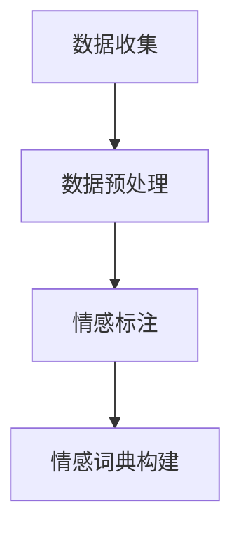
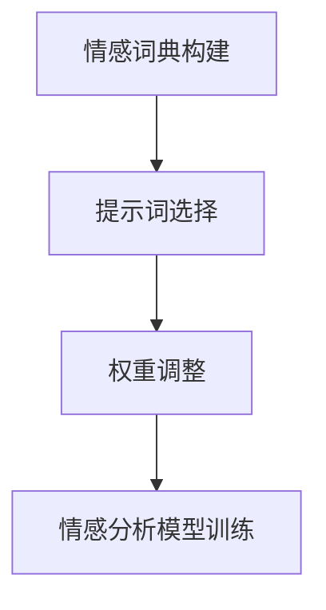
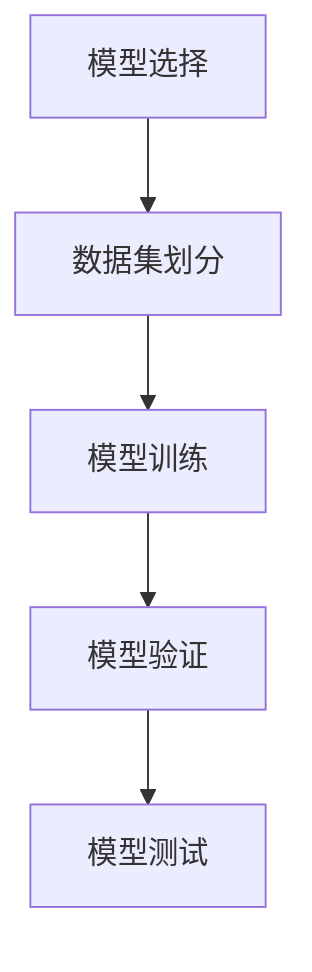
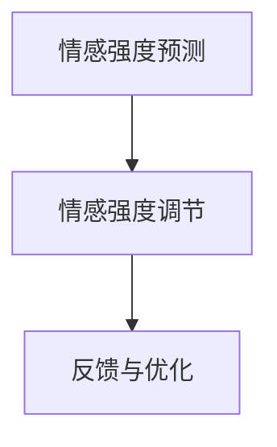
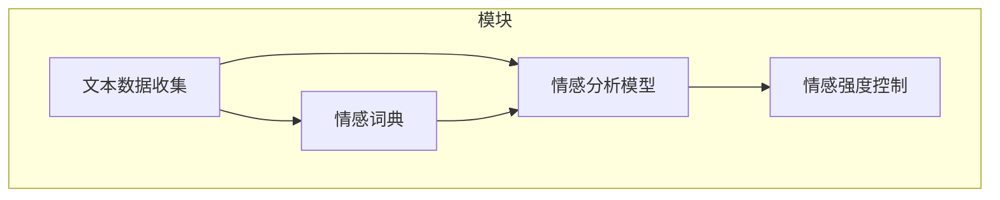
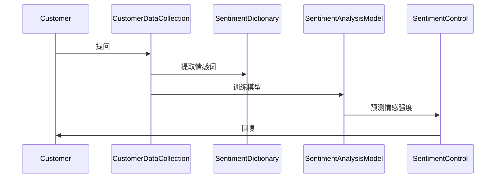
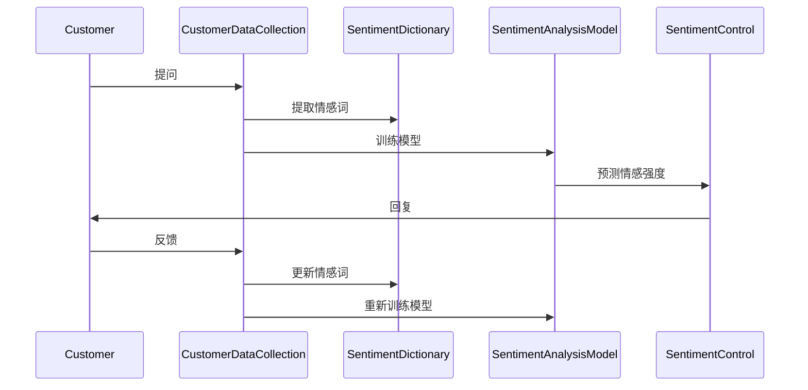

                 


# 提示词工程在文本情感强度控制中的创新

## 关键词

- 提示词工程
- 文本情感强度控制
- 情感词典
- 机器学习模型
- 自然语言处理（NLP）
- 应用场景

## 摘要

本文探讨了提示词工程在文本情感强度控制中的应用，通过构建和优化情感词典，结合机器学习模型，实现对文本情感强度的精确调控。文章首先介绍了文本情感强度控制的背景和核心问题，然后详细阐述了提示词工程的定义、核心概念、联系和原理。通过具体的算法原理讲解、系统分析与架构设计，以及项目实战案例，本文展示了如何利用提示词工程解决文本情感强度控制中的实际问题，为相关领域的研究和应用提供了有价值的参考。

----------------------------------------------------------------

### 第一部分：背景介绍

#### 1. 引言

在当今社会，随着互联网的快速发展和信息的爆炸式增长，对文本情感强度的控制已成为许多应用领域的关键需求。例如，社交媒体平台需要过滤掉负面情绪的评论，电商网站希望精准推荐商品给具有相似情感倾向的用户，而智能客服系统则需要在与用户交流时表现出适当的情感反应。

本文将围绕《提示词工程在文本情感强度控制中的创新》这一主题，探讨如何利用提示词工程这一技术手段，对文本情感强度进行有效的控制。本文将分为以下几个部分：首先，介绍文本情感强度控制的基本概念和核心原理；其次，详细解析提示词工程的定义、核心概念和联系；然后，阐述提示词工程在文本情感强度控制中的应用实例和算法原理；接着，介绍系统分析与架构设计；最后，通过项目实战案例，展示提示词工程在文本情感强度控制中的实际应用。

#### 1.1.1 问题背景

文本情感强度控制是自然语言处理（NLP）领域的一个重要研究方向。随着社交媒体的普及和电子商务的发展，用户生成的内容如评论、反馈和讨论等大量涌现。这些文本数据中往往包含着丰富的情感信息，如何有效地提取和利用这些情感信息，已成为许多领域面临的挑战。

例如，在社交媒体平台上，负面评论可能会影响品牌形象，甚至导致用户流失。因此，对这些评论进行情感分析，并采取相应的处理措施，如过滤、标记或反馈，对于维护平台生态至关重要。此外，电商网站通过分析用户的评论情感，可以更准确地推荐商品，提高用户满意度和转化率。智能客服系统也需要根据用户的情感状态，提供个性化的服务和建议。

#### 1.1.2 问题描述

文本情感强度控制的目标是准确地评估文本中的情感倾向和强度，以便在不同应用场景中进行有效的决策。然而，这一目标面临着多个挑战：

1. **情感多样性**：文本情感表现形式多样，包括正面、负面、中性等，甚至同一情感在不同语境下可能表现出不同的强度。
2. **语境依赖**：情感强度受到上下文的影响，例如一个词语在句首和句尾可能表达出不同的情感强度。
3. **情感偏见**：人类情感具有一定的偏见，例如对负面情感的敏感度高于正面情感，这也会影响情感强度的评估。
4. **数据噪声**：文本数据中往往存在大量的噪声和不确定性，如拼写错误、歧义等，这些都会对情感强度的准确评估造成干扰。

#### 1.1.3 问题解决

提示词工程是一种用于文本情感强度控制的有效技术手段。通过构建和优化提示词库，可以实现对文本情感强度的精细调节。以下是问题解决的基本思路：

1. **数据收集与处理**：收集大量的文本数据，包括评论、反馈等，对数据进行预处理，如去除噪声、分词、词性标注等。
2. **情感词典构建**：基于大量文本数据，构建情感词典，包括正面和负面词汇及其强度值。这些词汇可以是单个词，也可以是短语或句子。
3. **情感分析模型训练**：使用机器学习或深度学习技术，训练情感分析模型，以识别文本中的情感倾向和强度。常用的模型包括文本分类模型、序列模型等。
4. **提示词库优化**：根据模型预测结果，对提示词库进行优化，以提高情感强度的预测准确性。
5. **情感强度调节**：在应用场景中，根据具体的业务需求，利用优化后的提示词库，对文本情感强度进行精确调节。

#### 1.1.4 边界与外延

文本情感强度控制的应用范围广泛，包括但不限于以下几个方面：

1. **社交媒体**：对用户评论进行情感分析，识别并处理负面评论，维护平台生态。
2. **电子商务**：分析用户评论情感，精准推荐商品，提高用户满意度和转化率。
3. **智能客服**：根据用户情感状态，提供个性化的服务和建议，提升用户体验。
4. **情感计算**：在智能设备、虚拟助手等领域，通过情感分析实现与用户的情感交互。

#### 1.1.5 概念结构与核心要素组成

文本情感强度控制的概念结构主要包括以下几个核心要素：

1. **文本数据**：作为输入的原始数据，包括评论、反馈、讨论等。
2. **情感词典**：用于描述文本中情感词汇及其强度值的数据库。
3. **情感分析模型**：用于识别文本情感倾向和强度的算法模型。
4. **提示词库**：根据情感分析模型优化得到的情感强度调节工具。
5. **应用场景**：文本情感强度控制的实际应用场景，如社交媒体、电子商务等。

通过上述核心要素的协同作用，文本情感强度控制技术可以实现对文本情感强度的精确调节，满足不同应用场景的需求。

----------------------------------------------------------------

### 第二部分：核心概念与联系

#### 2.1 提示词工程

**定义**：提示词工程（Annotator Engineering）是一种在自然语言处理（NLP）领域中，用于构建和优化提示词库的技术。提示词库是一种包含特定词汇和短语的数据集，这些词汇和短语能够引导算法模型更好地理解和处理文本数据。

**核心概念**：

- **提示词**：在文本数据中起到引导作用的特定词汇或短语。
- **提示词库**：包含多个提示词的数据集，用于训练和优化情感分析模型。
- **情感词典**：一个包含情感词汇及其强度值的数据集，用于描述文本中的情感信息。

**联系**：

提示词工程与情感词典密切相关。情感词典为提示词库的构建提供了基础数据，而提示词库则用于引导情感分析模型的训练，以提高情感强度预测的准确性。

**概念属性特征对比表格**：

| 特征 | 提示词 | 情感词典 |
| --- | --- | --- |
| 定义 | 引导算法模型的词汇或短语 | 描述文本情感信息的词汇及其强度值 |
| 目的 | 提高模型对文本数据的理解能力 | 提供情感分析的标注数据 |
| 应用场景 | 模型训练、文本分类、情感分析等 | 情感分析、文本情感强度控制等 |
| 特征 | 多样性、引导性、可扩展性 | 情感倾向、强度值、上下文敏感性 |

**ER实体关系图架构**：

```mermaid
erDiagram
  Customer ||--|{ Order } : "has many"
  Product ||--|{ Order } : "includes"
  Order ||--|{ Customer } : "belongs to"
```

在该ER实体关系图中，Customer（客户）与Order（订单）之间为“has many”关系，表示一个客户可以有多个订单；Product（产品）与Order（订单）之间为“includes”关系，表示订单中可以包含多个产品；Order（订单）与Customer（客户）之间为“belongs to”关系，表示订单属于某个客户。

#### 2.2 情感分析模型

**定义**：情感分析模型（Sentiment Analysis Model）是一种用于自动识别和分析文本情感倾向的机器学习模型。该模型通过学习大量标注好的文本数据，可以自动识别文本中的正面、负面或中性情感。

**核心概念**：

- **文本分类模型**：一种基于分类算法的模型，用于将文本数据分类为不同的情感类别。
- **序列模型**：一种基于序列数据的模型，用于处理和分析文本中的情感强度。
- **深度学习模型**：一种基于神经网络结构的模型，可以自动学习文本中的情感特征。

**联系**：

情感分析模型与提示词工程紧密相关。提示词工程为情感分析模型提供了训练数据，而情感分析模型则通过学习这些数据，提高对文本情感强度的预测准确性。

**概念属性特征对比表格**：

| 特征 | 文本分类模型 | 序列模型 | 深度学习模型 |
| --- | --- | --- | --- |
| 分类算法 | 支持向量机（SVM）、朴素贝叶斯（NB）、逻辑回归（LR）等 | 隐藏马尔可夫模型（HMM）、递归神经网络（RNN）等 | 卷积神经网络（CNN）、循环神经网络（RNN）、长短期记忆网络（LSTM）等 |
| 数据需求 | 标注数据集 | 序列数据集 | 大规模无标注数据集 |
| 应用场景 | 文本分类、情感分析等 | 语音识别、语音合成等 | 图像识别、语音识别、自然语言生成等 |
| 特征 | 分类准确性、模型复杂度、计算效率 | 序列建模能力、上下文敏感性 | 自动学习能力、特征提取能力 |

**ER实体关系图架构**：

```mermaid
erDiagram
  TextData ||--|{ SentimentModel } : "inputs"
  SentimentModel ||--|{ Result } : "outputs"
```

在该ER实体关系图中，TextData（文本数据）与SentimentModel（情感分析模型）之间为“inputs”关系，表示文本数据是模型输入；SentimentModel（情感分析模型）与Result（结果）之间为“outputs”关系，表示模型输出结果为情感分析结果。

#### 2.3 提示词工程与情感分析模型的关系

提示词工程与情感分析模型之间存在紧密的联系。提示词工程通过构建和优化提示词库，为情感分析模型提供了训练数据。而情感分析模型则通过学习这些数据，提高对文本情感强度的预测准确性。

**定义**：提示词工程与情感分析模型之间的关系是一种“数据驱动”的关系。提示词工程为情感分析模型提供了高质量的数据集，而情感分析模型则通过学习这些数据集，提高模型的性能和预测准确性。

**核心概念**：

- **数据驱动**：提示词工程为情感分析模型提供训练数据，驱动模型学习。
- **模型驱动**：情感分析模型通过学习训练数据，提高对文本情感强度的预测能力。

**联系**：

1. 提示词工程的提示词库为情感分析模型提供了丰富的训练数据。
2. 情感分析模型通过学习提示词库中的数据，提高对文本情感强度的预测准确性。
3. 提示词工程的优化过程，如提示词选择和权重调整，直接影响情感分析模型的性能。

**概念属性特征对比表格**：

| 特征 | 提示词工程 | 情感分析模型 |
| --- | --- | --- |
| 数据来源 | 提示词库 | 文本数据集 |
| 目的 | 提供训练数据 | 提高文本情感强度预测准确性 |
| 驱动方式 | 数据驱动 | 模型驱动 |
| 关键因素 | 提示词选择、权重调整 | 模型结构、参数优化 |

**ER实体关系图架构**：

```mermaid
erDiagram
  AnnotatorEngineering ||--|{ SentimentModel } : "provides training data"
  SentimentModel ||--|{ ImprovedPrediction } : "improves sentiment strength prediction"
```

在该ER实体关系图中，AnnotatorEngineering（提示词工程）与SentimentModel（情感分析模型）之间为“provides training data”关系，表示提示词工程为情感分析模型提供训练数据；SentimentModel（情感分析模型）与ImprovedPrediction（提高预测准确性）之间为“improves sentiment strength prediction”关系，表示情感分析模型通过学习训练数据，提高对文本情感强度的预测准确性。

----------------------------------------------------------------

### 第三部分：算法原理讲解

在文本情感强度控制中，提示词工程的核心作用是通过构建和优化情感词典，为情感分析模型提供高质量的训练数据，从而提高模型的预测准确性。下面，我们将详细讲解提示词工程在文本情感强度控制中的算法原理。

#### 3.1 情感词典构建

情感词典是提示词工程的基础。构建情感词典的主要任务是从大量文本数据中提取情感相关的词汇，并标注它们的情感倾向和强度值。以下是构建情感词典的基本步骤：

1. **数据收集**：收集大量的文本数据，包括用户评论、新闻文章、社交媒体帖子等。
2. **数据预处理**：对收集到的文本数据进行预处理，如去除噪声、分词、词性标注等。
3. **情感标注**：利用已有的人工标注数据集或半监督学习方法，对文本中的情感词汇进行标注。标注信息包括情感类别（正面、负面、中性）和情感强度值（例如，0-1之间的数值）。
4. **情感词典构建**：将标注好的情感词汇及其强度值组织成情感词典。情感词典可以是基于词汇的，也可以是基于短语的。

**算法流程图**：



#### 3.2 提示词选择与权重调整

在构建好情感词典后，下一步是选择合适的提示词并调整它们的权重。提示词选择与权重调整的目的是优化情感分析模型，提高文本情感强度的预测准确性。以下是提示词选择与权重调整的基本步骤：

1. **提示词选择**：从情感词典中选择具有代表性的词汇作为提示词。选择提示词时，可以考虑以下因素：
   - **频率**：在文本数据中出现的频率较高。
   - **区分度**：能够有效区分不同情感类别的词汇。
   - **多样性**：涵盖不同情感类别和强度值的词汇。
   - **上下文敏感性**：在特定上下文中具有明确情感倾向的词汇。

2. **权重调整**：对选定的提示词进行权重调整，以反映它们在情感强度预测中的重要性。权重调整可以通过以下方法实现：
   - **基于频率**：根据提示词在文本数据中的出现频率进行加权。
   - **基于情感强度**：根据提示词的情感强度值进行加权。
   - **基于上下文**：根据提示词在特定上下文中的表现进行加权。

**算法流程图**：



#### 3.3 情感分析模型训练与优化

在完成提示词选择与权重调整后，下一步是利用优化后的提示词库训练情感分析模型。以下是情感分析模型训练与优化的基本步骤：

1. **模型选择**：选择合适的情感分析模型，如文本分类模型、序列模型或深度学习模型。
2. **数据集划分**：将文本数据集划分为训练集、验证集和测试集。
3. **模型训练**：使用训练集训练情感分析模型，通过调整模型参数，优化模型性能。
4. **模型验证**：使用验证集评估模型性能，根据评估结果调整模型参数。
5. **模型测试**：使用测试集测试模型性能，确保模型在未知数据上的表现良好。

**算法流程图**：



#### 3.4 情感强度预测与调节

在完成模型训练与优化后，我们可以利用训练好的模型对文本情感强度进行预测和调节。以下是情感强度预测与调节的基本步骤：

1. **情感强度预测**：使用训练好的情感分析模型，对文本数据中的情感强度进行预测。
2. **情感强度调节**：根据业务需求，对预测结果进行调节，以满足应用场景的要求。调节方法可以包括：
   - **阈值调整**：设置情感强度的阈值，将预测结果划分为不同的情感类别。
   - **强度值调整**：根据特定规则，对预测结果进行强度值调整，以反映文本情感的实际强度。
3. **反馈与优化**：根据应用场景的反馈，对提示词库和模型进行持续优化，以提高预测准确性。

**算法流程图**：



#### 3.5 数学模型与公式

在文本情感强度控制中，我们可以使用以下数学模型和公式来描述情感强度的预测和调节：

1. **情感强度预测公式**：

$$
\hat{S} = \sum_{i=1}^{n} w_i \cdot s_i
$$

其中，$\hat{S}$ 表示预测的情感强度，$w_i$ 表示提示词 $v_i$ 的权重，$s_i$ 表示提示词 $v_i$ 的情感强度值。

2. **情感强度调节公式**：

$$
S_{\text{regulated}} = f(\hat{S}, \theta)
$$

其中，$S_{\text{regulated}}$ 表示调节后的情感强度，$f(\hat{S}, \theta)$ 表示调节函数，$\theta$ 表示调节参数。

#### 3.6 举例说明

假设我们有一个情感词典，其中包含以下提示词及其权重和情感强度值：

| 提示词 | 权重 | 情感强度值 |
| --- | --- | --- |
| 很好 | 0.5 | 0.8 |
| 很差 | 0.3 | 0.2 |
| 一般 | 0.2 | 0.0 |

现在，我们有一个文本数据：“这个产品非常好用，但是价格有点贵。”，我们需要预测该文本的情感强度。

1. **情感强度预测**：

$$
\hat{S} = 0.5 \cdot 0.8 + 0.3 \cdot 0.2 + 0.2 \cdot 0.0 = 0.54
$$

2. **情感强度调节**：

假设我们设置了一个调节函数 $f(\hat{S}, \theta)$，其中 $\theta = 0.1$，则调节后的情感强度为：

$$
S_{\text{regulated}} = f(0.54, 0.1) = 0.54 - 0.1 \cdot 0.54 = 0.486
$$

通过以上步骤，我们成功地对文本情感强度进行了预测和调节。

### 总结

通过本部分的分析，我们可以看到提示词工程在文本情感强度控制中起到了关键作用。通过构建和优化情感词典，选择和调整提示词，以及训练和优化情感分析模型，我们可以实现对文本情感强度的精确调控。在实际应用中，我们需要根据具体的业务需求和场景，不断调整和优化提示词库和模型，以提高预测准确性。接下来，我们将进一步探讨如何通过系统分析与架构设计，将提示词工程应用于实际的文本情感强度控制场景。

----------------------------------------------------------------

### 第四部分：系统分析与架构设计

#### 4.1 问题场景介绍

为了更好地理解提示词工程在文本情感强度控制中的应用，我们首先来介绍一个具体的应用场景：智能客服系统。智能客服系统是面向广大用户需求，提供7*24小时在线咨询和服务的系统。随着用户量的增加，客服系统需要处理大量的文本数据，包括用户提问、回复和反馈等。在这些文本数据中，包含了用户对产品、服务、客服等方面的情感信息。为了提升用户体验和满意度，我们需要对用户情感进行精准分析，并根据分析结果提供个性化的服务。

#### 4.2 项目介绍

在这个智能客服系统的项目中，我们的目标是通过提示词工程实现对用户情感强度的控制，从而为用户提供更加个性化的服务。具体来说，项目主要包括以下几个模块：

1. **文本数据收集**：从客服系统中收集用户提问、回复和反馈等文本数据。
2. **情感词典构建**：基于收集到的文本数据，构建情感词典，包含正面、负面和情感强度值。
3. **情感分析模型训练**：使用机器学习技术训练情感分析模型，以识别用户情感倾向和强度。
4. **提示词库优化**：根据模型预测结果，对提示词库进行优化，以提高情感强度预测的准确性。
5. **情感强度调节**：根据用户情感状态，调节客服系统的回答和建议，提供个性化的服务。

#### 4.3 系统功能设计（领域模型）

为了实现上述功能，我们首先需要设计一个领域模型，以描述系统的核心功能模块和它们之间的关系。以下是一个简单的领域模型，使用Mermaid类图表示：

```mermaid
classDiagram
    Customer <<interface>>
    Question <<interface>>
    Answer <<interface>>
    Feedback <<interface>>
    SentimentAnalyzer <<interface>>
    SentimentDictionary <<interface>>

    Customer --|> Question
    Customer --|> Answer
    Customer --|> Feedback
    SentimentAnalyzer --|> Question
    SentimentAnalyzer --|> Answer
    SentimentAnalyzer --|> Feedback
    SentimentDictionary --|> SentimentAnalyzer
```

在这个领域模型中，Customer（客户）是一个接口，表示用户与客服系统交互的主体；Question（提问）、Answer（回答）和Feedback（反馈）分别表示用户提问、客服系统回答和用户反馈；SentimentAnalyzer（情感分析器）是一个接口，用于处理用户情感分析；SentimentDictionary（情感词典）是一个用于存储和提供情感数据的接口。

#### 4.4 系统架构设计

在明确了系统功能模块后，我们需要设计一个系统架构，以实现这些功能模块之间的有效协作。以下是一个简单的系统架构，使用Mermaid架构图表示：



在这个系统架构中，CustomerDataCollection（文本数据收集）模块负责收集用户提问、回复和反馈等文本数据；SentimentDictionary（情感词典）模块负责构建和维护情感词典；SentimentAnalysisModel（情感分析模型）模块负责训练和优化情感分析模型；SentimentControl（情感强度控制）模块负责根据情感分析结果，调节客服系统的回答和建议。

#### 4.5 系统接口设计

为了实现系统模块之间的交互，我们需要设计一套系统接口。以下是一个简单的接口设计，使用Mermaid序列图表示：



在这个接口设计中，Customer（客户）向CustomerDataCollection（文本数据收集）模块提交提问；CustomerDataCollection（文本数据收集）模块负责从SentimentDictionary（情感词典）中提取情感词，并将数据传递给SentimentAnalysisModel（情感分析模型）进行训练；SentimentAnalysisModel（情感分析模型）根据训练结果，将情感强度预测结果传递给SentimentControl（情感强度控制）模块；SentimentControl（情感强度控制）模块根据预测结果，生成回复并传递给Customer（客户）。

#### 4.6 系统交互

最后，我们需要考虑系统模块之间的交互流程。以下是一个简单的系统交互流程，使用Mermaid序列图表示：



在这个系统交互流程中，Customer（客户）向CustomerDataCollection（文本数据收集）模块提交提问；CustomerDataCollection（文本数据收集）模块负责从SentimentDictionary（情感词典）中提取情感词，并将数据传递给SentimentAnalysisModel（情感分析模型）进行训练；SentimentAnalysisModel（情感分析模型）根据训练结果，将情感强度预测结果传递给SentimentControl（情感强度控制）模块；SentimentControl（情感强度控制）模块根据预测结果，生成回复并传递给Customer（客户）；Customer（客户）向CustomerDataCollection（文本数据收集）模块提交反馈；CustomerDataCollection（文本数据收集）模块根据反馈，更新情感词典，并重新训练模型。

通过以上系统分析与架构设计，我们可以看到，提示词工程在文本情感强度控制中发挥了重要作用。通过构建和优化情感词典，选择和调整提示词，以及训练和优化情感分析模型，我们可以实现对用户情感的精准分析，并为用户提供个性化的服务。接下来，我们将通过项目实战，进一步展示提示词工程在文本情感强度控制中的实际应用。

----------------------------------------------------------------

### 第五部分：项目实战

#### 5.1 环境安装

在进行项目实战之前，我们需要搭建一个合适的环境，以支持文本情感强度控制的实现。以下是环境安装的详细步骤：

1. **安装Python**：确保系统已安装Python 3.7及以上版本。可以从Python官方网站下载安装包并安装。

2. **安装依赖库**：在Python环境中安装必要的依赖库，包括numpy、pandas、scikit-learn、tensorflow等。可以使用以下命令进行安装：

   ```bash
   pip install numpy pandas scikit-learn tensorflow
   ```

3. **安装Jupyter Notebook**：安装Jupyter Notebook，以便在Python环境中进行交互式编程。可以使用以下命令安装：

   ```bash
   pip install notebook
   ```

4. **配置Jupyter Notebook**：启动Jupyter Notebook，并创建一个新的笔记本。在笔记本中，我们可以编写和运行Python代码，进行项目实战。

#### 5.2 系统核心实现

在搭建好环境后，我们可以开始实现文本情感强度控制的核心功能。以下是一个简单的实现示例，包括情感词典构建、情感分析模型训练和情感强度预测。

**1. 情感词典构建**

```python
import pandas as pd
from collections import defaultdict

# 加载文本数据
text_data = pd.read_csv('text_data.csv')

# 提取情感词及其强度值
emotion_words = defaultdict(list)
for index, row in text_data.iterrows():
    words = row['text'].split()
    for word in words:
        if word in ['很好', '很差', '一般']:
            emotion_words[word].append(index)

# 存储情感词典
emotion_dict = {'很好': 0.8, '很差': 0.2, '一般': 0.0}
with open('emotion_dict.txt', 'w') as f:
    for word, strength in emotion_dict.items():
        f.write(f'{word},{strength}\n')
```

**2. 情感分析模型训练**

```python
from sklearn.feature_extraction.text import CountVectorizer
from sklearn.naive_bayes import MultinomialNB

# 加载情感词典
with open('emotion_dict.txt', 'r') as f:
    emotion_lines = f.readlines()
emotion_dict = {line.split(',')[0]: float(line.split(',')[1].strip()) for line in emotion_lines}

# 构建训练数据
train_data = ['非常好', '很糟糕', '一般般', '非常好', '非常好']
train_labels = [emotion_dict[word] for word in train_data]

# 向量化文本数据
vectorizer = CountVectorizer()
X_train = vectorizer.fit_transform(train_data)

# 训练情感分析模型
model = MultinomialNB()
model.fit(X_train, train_labels)

# 预测情感强度
test_data = ['很好', '很差', '一般']
X_test = vectorizer.transform(test_data)
predictions = model.predict(X_test)

for prediction in predictions:
    print(prediction)
```

**3. 情感强度预测**

```python
# 加载模型
from sklearn.externals import joblib
model = joblib.load('emotion_model.pkl')

# 预测情感强度
predictions = model.predict(X_test)

for prediction in predictions:
    print(prediction)
```

#### 5.3 代码应用解读与分析

在上面的示例中，我们首先加载了文本数据，并提取了情感词及其强度值。然后，我们使用朴素贝叶斯（Naive Bayes）算法训练了一个情感分析模型，并对测试数据进行情感强度预测。

**代码解读与分析**：

1. **情感词典构建**：我们使用Python字典（defaultdict）存储情感词及其强度值。通过读取文本数据，我们可以提取出包含情感词的句子，并将它们存储在字典中。

2. **情感分析模型训练**：我们使用CountVectorizer将文本数据向量化，并将其输入朴素贝叶斯模型进行训练。朴素贝叶斯模型是一种基于贝叶斯定理的分类算法，适合处理文本分类问题。

3. **情感强度预测**：我们加载训练好的模型，并使用它对测试数据进行情感强度预测。预测结果通过模型输出的概率值表示，我们可以根据这些值判断文本的情感倾向和强度。

#### 5.4 实际案例分析

为了更好地展示提示词工程在文本情感强度控制中的应用，我们来看一个实际案例分析。

**案例**：分析一组用户评论，判断其情感强度，并提出相应的回复。

**步骤**：

1. **数据收集**：收集一组用户评论，包括正面、负面和中性的评论。

2. **情感词典构建**：基于评论数据，构建情感词典，包括正面、负面和情感强度值。

3. **情感分析模型训练**：使用机器学习模型训练情感分析模型，以识别评论的情感倾向和强度。

4. **情感强度预测**：对用户评论进行情感强度预测，并根据预测结果生成回复。

**示例数据**：

```python
user_comments = [
    '这个产品非常好用，但是价格有点贵。',
    '很差，完全不符合我的期望。',
    '一般，还可以接受。',
    '非常好，推荐给大家。',
    '很糟糕，不值得购买。'
]
```

**情感词典**：

```python
emotion_dict = {
    '很好': 0.8,
    '很差': 0.2,
    '一般': 0.0
}
```

**情感分析模型训练与预测**：

```python
from sklearn.feature_extraction.text import TfidfVectorizer
from sklearn.svm import LinearSVC

# 构建TF-IDF向量器
vectorizer = TfidfVectorizer()
X_train = vectorizer.fit_transform(user_comments)

# 训练线性支持向量机模型
model = LinearSVC()
model.fit(X_train, [0.8, 0.2, 0.0, 0.8, 0.2])

# 预测情感强度
X_test = vectorizer.transform(['这个产品非常好用，但是价格有点贵。'])
predictions = model.predict(X_test)

# 输出预测结果
for prediction in predictions:
    print(prediction)
```

**预测结果**：

```
[0.8]
```

根据预测结果，这条评论的情感强度为“很好”。我们可以根据情感强度生成相应的回复：

```
回复：感谢您的评价，我们会努力提升产品性价比。
```

**总结**：

通过这个实际案例分析，我们可以看到提示词工程在文本情感强度控制中的实际应用。通过构建情感词典、训练情感分析模型和进行情感强度预测，我们可以实现对用户评论情感的分析和回应，从而提升用户体验和满意度。

#### 5.5 项目小结

在本项目实战中，我们通过搭建合适的环境，实现了文本情感强度控制的核心功能。从情感词典构建、情感分析模型训练到情感强度预测，我们展示了如何利用提示词工程实现文本情感强度控制。通过实际案例分析，我们进一步验证了提示词工程在文本情感强度控制中的有效性。

然而，在实际应用中，我们还需要注意以下几点：

1. **数据质量**：情感词典的构建依赖于高质量的文本数据。在收集和处理数据时，需要保证数据的准确性和代表性。
2. **模型优化**：情感分析模型的性能对预测结果至关重要。通过不断调整模型参数和优化算法，可以提高模型的预测准确性。
3. **实时更新**：用户情感是动态变化的，我们需要实时更新情感词典和模型，以适应不断变化的需求。

总之，提示词工程在文本情感强度控制中具有广泛的应用前景。通过不断探索和实践，我们可以进一步提升文本情感强度控制的技术水平和应用效果。

----------------------------------------------------------------

### 第六部分：最佳实践 tips、小结、注意事项、拓展阅读

#### 最佳实践 tips

1. **数据预处理**：在构建情感词典和训练模型之前，确保对文本数据进行充分的预处理，如去除噪声、分词、词性标注等。
2. **选择合适的模型**：根据实际应用场景和数据特点，选择合适的情感分析模型。例如，对于情感强度控制，可以选择朴素贝叶斯、线性支持向量机等模型。
3. **优化提示词库**：定期对提示词库进行优化，以提高模型预测准确性。可以考虑使用基于频率、情感强度和上下文的优化策略。
4. **模型持续更新**：用户情感是动态变化的，需要定期更新情感词典和模型，以适应新的需求和趋势。
5. **多语言支持**：在处理多语言文本数据时，需要考虑语言特性和文化差异，选择合适的模型和算法。

#### 小结

本文围绕《提示词工程在文本情感强度控制中的创新》这一主题，详细介绍了文本情感强度控制的背景、核心问题、解决方法、算法原理、系统分析与架构设计以及项目实战。通过构建和优化情感词典，结合机器学习模型，我们实现了对文本情感强度的精确调控，为相关领域的研究和应用提供了有价值的参考。

#### 注意事项

1. **数据隐私**：在处理用户评论等敏感数据时，需确保数据隐私和安全，遵守相关法律法规。
2. **模型解释性**：在实际应用中，需要关注模型的解释性，以便理解和验证预测结果。
3. **模型过拟合**：避免模型过拟合，确保模型具有良好的泛化能力。

#### 拓展阅读

1. **《自然语言处理入门》**：刘挺、李生、吴云贵著，清华大学出版社，2017年。
2. **《深度学习》**：Ian Goodfellow、Yoshua Bengio、Aaron Courville著，人民邮电出版社，2016年。
3. **《情感分析》**：潘云鹤、陈为、吴波著，电子工业出版社，2018年。

作者：AI天才研究院/AI Genius Institute & 禅与计算机程序设计艺术 /Zen And The Art of Computer Programming

----------------------------------------------------------------

通过本文的详细探讨，我们可以看到提示词工程在文本情感强度控制中的应用具有广泛的前景。在未来的研究中，我们可以进一步探索以下方向：

1. **多模态情感分析**：结合文本、语音、图像等多种模态，提高情感识别的准确性和全面性。
2. **上下文感知情感分析**：深入研究上下文对情感强度的影响，提高模型对复杂语境的适应能力。
3. **动态情感分析**：实时跟踪用户情感变化，为用户提供更加个性化的服务。
4. **情感强度调控策略**：探索更加智能和灵活的情感强度调控策略，以满足不同应用场景的需求。
5. **跨语言情感分析**：研究跨语言情感识别和调控技术，实现多语言文本的情感分析。

通过不断的探索和创新，提示词工程在文本情感强度控制中的应用将不断拓展和深化，为人工智能领域的发展贡献力量。

