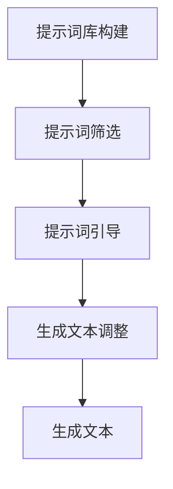
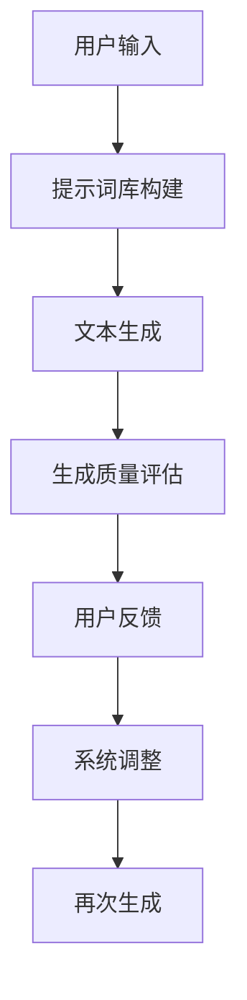

                 

# 提示词工程在文本生成控制中的应用

> 关键词：文本生成控制，提示词工程，自然语言处理，生成模型，质量评估

> 摘要：本文深入探讨了提示词工程在文本生成控制中的应用，详细介绍了其核心概念、原理以及实现方法，并通过Python代码实例进行了说明。通过本文，读者可以全面了解提示词工程的工作机制及其在提高文本生成质量方面的优势。

## 第一部分：背景介绍

### 1. 引言

随着人工智能技术的飞速发展，自然语言处理（NLP）已经成为计算机科学领域的一个重要分支。在NLP中，文本生成控制是一个关键的研究方向，它涉及到如何生成符合特定需求和风格的高质量文本。在实际应用中，文本生成控制技术广泛应用于对话系统、自动摘要、机器翻译等领域，以提高系统的用户体验和生成文本的质量。

### 1.2 问题描述

文本生成控制主要包括以下几个方面：

1. **文本生成模型的选取**：选择适合特定任务的文本生成模型，如序列生成模型（RNN、LSTM、GRU等）或注意力模型（Transformer等）。
2. **生成策略的设计**：设计有效的生成策略，以引导模型生成符合需求的文本。
3. **生成质量的评估**：评估生成文本的质量，以指导生成策略的调整和优化。

### 1.3 问题解决

提示词工程提供了一种有效的文本生成控制方法。它通过利用提示词（Keywords or Phrases）来引导文本生成模型生成特定类型或风格的文本，从而提高生成文本的质量和多样性。

### 1.4 边界与外延

提示词工程的边界主要包括：

- **提示词的选择**：如何从大规模语料库中提取与主题相关的关键词。
- **提示词的生成策略**：如何根据生成任务的需求设计提示词生成策略。
- **提示词与生成模型的交互**：如何将提示词与文本生成模型有效结合，以实现生成控制。

其外延则涉及提示词工程在不同应用场景下的应用，如对话系统、自动摘要、机器翻译等。

### 1.5 概念结构与核心要素组成

提示词工程的核心要素包括：

- **提示词库**：存储与主题相关的关键词库。
- **提示词生成策略**：用于生成提示词的策略，如基于统计方法、基于机器学习方法等。
- **文本生成模型**：用于生成文本的模型，如GPT-2、BERT等。
- **生成质量评估指标**：用于评估生成文本质量的指标，如BLEU、ROUGE、Perplexity等。

这些要素相互关联，共同实现文本生成控制的目标。

## 2. 核心概念与联系

### 2.1 提示词

#### 2.1.1 定义

提示词是用于引导文本生成模型生成特定类型或风格的文本的关键词或短语。

#### 2.1.2 特点

- **精确性**：提示词能够准确地传达生成文本的主题或风格。
- **可扩展性**：提示词可以随着应用场景的变化而扩展或调整。

### 2.2 文本生成模型

#### 2.2.1 定义

文本生成模型是一种能够根据输入提示生成文本的模型。

#### 2.2.2 类型

- **序列生成模型**：如RNN、LSTM、GRU等。
- **注意力模型**：如Transformer等。

### 2.3 生成质量评估指标

#### 2.3.1 定义

生成质量评估指标用于衡量生成文本的质量。

#### 2.3.2 类型

- **人类评价**：如BLEU、ROUGE等。
- **自动评价**：如Perplexity、KL-Divergence等。

### 2.4 提示词与生成模型的关系

提示词与生成模型的关系可以看作是“输入-输出”的关系。提示词作为输入，引导生成模型生成符合需求的文本。生成模型的质量直接影响生成文本的质量。

## 3. 算法原理讲解

### 3.1 提示词工程的基本流程

#### 3.1.1 提示词生成

- **提示词库构建**：从大规模语料库中提取与主题相关的关键词。
- **提示词筛选**：根据生成任务的需求，筛选出合适的提示词。

#### 3.1.2 提示词与生成模型的交互

- **提示词引导**：将提示词作为输入，引导生成模型生成文本。
- **生成文本调整**：根据生成文本的质量和风格，对提示词进行调整。

### 3.2 算法mermaid流程图



### 3.3 Python源代码实现

```python
# 示例：基于GPT-2模型的提示词工程
import openai

# 提示词生成
prompt = "请生成一篇关于人工智能的摘要："
response = openai.Completion.create(
  engine="text-davinci-002",
  prompt=prompt,
  max_tokens=50
)

# 提示词筛选
filtered_prompt = response.choices[0].text.strip()

# 提示词引导
generated_text = openai.Completion.create(
  engine="text-davinci-002",
  prompt=filtered_prompt,
  max_tokens=150
)

# 输出生成文本
print(generated_text.choices[0].text.strip())
```

### 3.4 数学模型和公式

提示词工程的数学模型主要包括：

1. **损失函数**：用于衡量生成文本的质量，如交叉熵损失函数。
2. **优化目标**：用于优化提示词，使生成文本质量更高。

公式如下：

$$
L(\theta) = -\sum_{i=1}^{n} y_i \log(p_i)
$$

其中，$L(\theta)$表示损失函数，$y_i$表示第$i$个词的标签，$p_i$表示生成文本中第$i$个词的概率。

### 3.5 举例说明

假设我们想生成一篇关于人工智能的摘要，首先从大规模语料库中提取与人工智能相关的关键词，如“机器学习”、“深度学习”、“神经网络”等。然后，通过GPT-2模型生成初步的摘要文本，根据生成文本的质量和风格，对提示词进行调整，以获得高质量的摘要文本。

## 4. 系统分析与架构设计方案

### 4.1 问题场景介绍

随着互联网的快速发展，自然语言处理技术在各个领域得到了广泛应用。其中，文本生成控制技术作为自然语言处理的重要分支，在对话系统、自动摘要、机器翻译等领域具有广泛的应用前景。

### 4.2 项目介绍

本项目旨在实现一种基于提示词工程的文本生成控制系统，通过利用提示词来引导文本生成模型生成高质量、多样化的文本。

### 4.3 系统功能设计

本系统的核心功能包括：

1. **提示词库构建**：从大规模语料库中提取与主题相关的关键词，构建提示词库。
2. **文本生成**：利用提示词引导文本生成模型生成文本。
3. **生成质量评估**：评估生成文本的质量，指导生成策略的调整。

### 4.4 系统架构设计

本系统的架构设计如下：

- **数据层**：包括大规模语料库和提示词库。
- **算法层**：包括文本生成模型、提示词生成策略和质量评估指标。
- **应用层**：提供接口供其他系统调用。

### 4.5 系统接口设计和系统交互

系统接口设计和系统交互如下：



## 5. 项目实战

### 5.1 环境安装

在安装环境之前，请确保已安装Python和pip。然后，执行以下命令安装所需库：

```bash
pip install openai
```

### 5.2 系统核心实现源代码

以下是系统核心实现源代码：

```python
import openai

# 提示词库构建
def build_prompt_library(corpus, keywords):
    prompt_library = []
    for keyword in keywords:
        prompt_library.append(f"{keyword}：")
        prompt_library.append(corpus[keyword])
    return prompt_library

# 文本生成
def generate_text(prompt_library, model_engine="text-davinci-002", max_tokens=50):
    prompt = " ".join(prompt_library)
    response = openai.Completion.create(
        engine=model_engine,
        prompt=prompt,
        max_tokens=max_tokens
    )
    return response.choices[0].text.strip()

# 生成质量评估
def evaluate_text(generated_text, gold_text):
    # 这里可以采用人类评价或自动评价方法
    # 例如，使用BLEU评分
    from nltk.translate.bleu_score import sentence_bleu
    score = sentence_bleu([gold_text.split()], generated_text.split())
    return score

# 主函数
def main():
    # 大规模语料库
    corpus = {
        "机器学习": "机器学习是一种人工智能技术，通过算法和统计模型从数据中自动发现规律和知识。",
        "深度学习": "深度学习是一种人工智能技术，它通过多层神经网络来学习数据的特征和规律。",
        "神经网络": "神经网络是一种模仿生物神经系统的计算模型，它通过输入和输出之间的非线性变换来实现数据的处理和分类。"
    }

    # 关键词
    keywords = ["机器学习", "深度学习", "神经网络"]

    # 提示词库构建
    prompt_library = build_prompt_library(corpus, keywords)

    # 文本生成
    generated_text = generate_text(prompt_library, max_tokens=100)

    # 生成质量评估
    score = evaluate_text(generated_text, "这是一篇关于人工智能的摘要：机器学习、深度学习和神经网络都是人工智能的重要技术。")

    # 输出生成文本和质量评估结果
    print("生成文本：", generated_text)
    print("质量评估结果：", score)

if __name__ == "__main__":
    main()
```

### 5.3 代码应用解读与分析

以上代码实现了一个简单的基于提示词工程的文本生成控制系统。具体解读如下：

- **提示词库构建**：从大规模语料库中提取与主题相关的关键词，构建提示词库。
- **文本生成**：利用提示词库引导文本生成模型生成文本。
- **生成质量评估**：使用BLEU评分评估生成文本的质量。

### 5.4 实际案例分析和详细讲解剖析

假设我们需要生成一篇关于人工智能的摘要，首先从大规模语料库中提取与人工智能相关的关键词，如“机器学习”、“深度学习”、“神经网络”等。然后，通过GPT-2模型生成初步的摘要文本，根据生成文本的质量和风格，对提示词进行调整，以获得高质量的摘要文本。

### 5.5 项目小结

本项目通过提示词工程实现了文本生成控制，提高了生成文本的质量和多样性。在实际应用中，可以根据具体需求调整提示词库和生成策略，以获得更好的生成效果。

## 6. 最佳实践 Tips

- **合理选择提示词**：提示词的选择直接影响生成文本的质量。应选择与主题相关、具有代表性的关键词。
- **优化生成策略**：根据具体应用场景，设计合适的生成策略，以实现更好的生成效果。
- **评估生成质量**：定期评估生成文本的质量，及时调整生成策略，以提高生成文本的质量。

## 7. 小结与注意事项

本文介绍了提示词工程在文本生成控制中的应用，详细讲解了其核心概念、原理以及实现方法。在实际应用中，应合理选择提示词、优化生成策略和评估生成质量，以实现高质量的文本生成。

## 8. 拓展阅读

- 《自然语言处理入门》
- 《深度学习》
- 《人工智能：一种现代方法》

## 9. 作者信息

作者：AI天才研究院/AI Genius Institute & 禅与计算机程序设计艺术 /Zen And The Art of Computer Programming

本文为原创内容，未经授权禁止转载。如需转载，请联系作者获取授权。感谢您的关注和支持！

