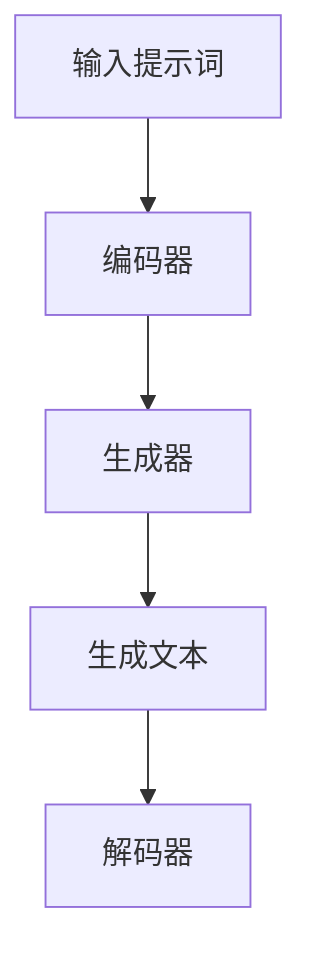
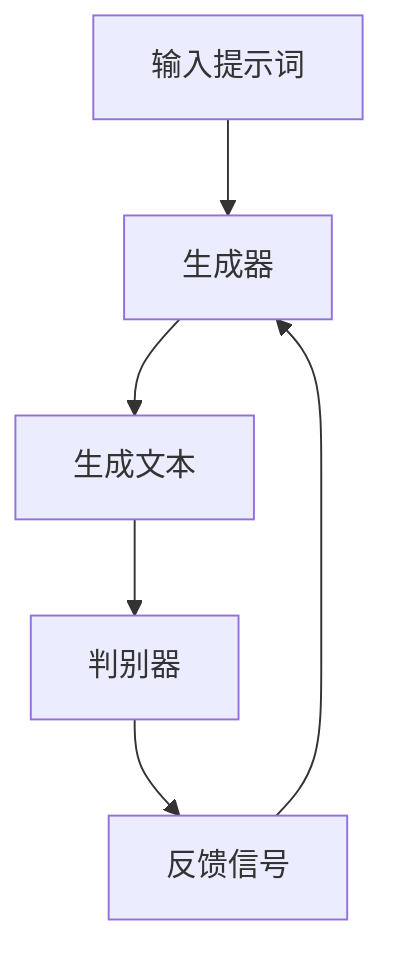
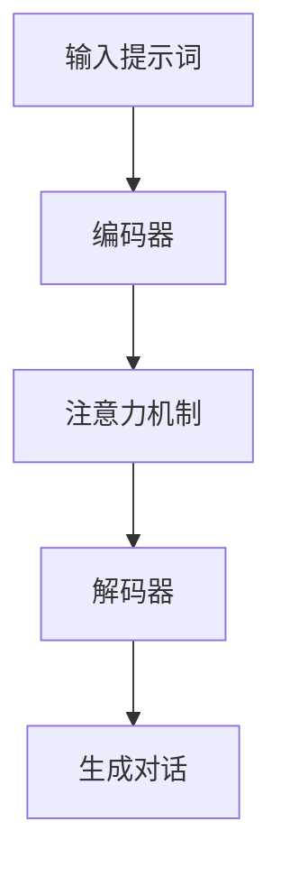

                 

### 第二部分：核心概念与联系

#### 第2章：核心概念与联系

在探讨提示词工程在文本生成控制中的应用之前，我们首先需要明确几个关键概念，并了解它们之间的关系。这些核心概念包括提示词的类型、提示词与文本生成的关系以及提示词工程的原理与属性。

#### 2.1 提示词的类型

提示词可以根据其结构和功能分为以下几种类型：

1. **单个提示词**：这是最基本的提示词形式，通常是一个单词或短语，如“快乐”、“购物”等。单个提示词能够提供简单的上下文信息，用于生成相关的文本。
2. **组合提示词**：由多个单词或短语组合而成，如“周末购物计划”、“夏天海滩度假”等。组合提示词能够提供更丰富的上下文信息，有助于生成更复杂的文本。
3. **多层次提示词**：这种类型的提示词包含了多个层次的信息，例如“在某个地点的夏天海滩度假计划”。多层次提示词能够提供高度细化的上下文信息，从而生成具有高度一致性的文本。

#### 2.2 提示词与文本生成的关系

提示词在文本生成过程中起着至关重要的作用。它们与文本生成的关系可以从以下几个方面来理解：

1. **引导作用**：提示词为文本生成系统提供了初始的输入信息，引导系统生成与提示词相关的文本。例如，给定提示词“快乐”，系统可能会生成一段关于快乐经历的描述。
2. **约束作用**：提示词还可以对生成的文本进行约束，确保文本在特定的主题、风格、格式等方面符合要求。例如，当提示词是“正式报告”，系统生成的文本就会遵循正式的报告格式。
3. **多样性控制**：通过使用不同的提示词，可以控制生成文本的多样性和创新性。例如，使用“夏日海滩度假”和“冬日雪山旅行”作为提示词，系统会生成两种截然不同的度假描述。

#### 2.3 提示词工程的原理与属性

提示词工程是一门涉及多种技术和方法的技术领域，其原理和属性可以从以下几个方面来阐述：

1. **基本原理**：提示词工程的目的是通过设计和优化提示词，提高文本生成系统的性能和生成质量。具体来说，包括以下几个方面：
   - **上下文捕捉**：通过捕捉和利用提示词中的上下文信息，提高文本生成系统的语义理解能力。
   - **生成优化**：通过优化提示词的生成过程，提高生成文本的质量、多样性和可控性。
   - **反馈循环**：利用生成文本的反馈信息，不断调整和优化提示词，形成一个持续改进的循环。

2. **属性特征对比表格**：

   | 特征类别 | 提示词类型 | 描述 |
   | :----: | :----: | :----: |
   | 结构复杂度 | 单个提示词 | 低 |
   | 结构复杂度 | 组合提示词 | 中 |
   | 结构复杂度 | 多层次提示词 | 高 |
   | 语义丰富度 | 单个提示词 | 低 |
   | 语义丰富度 | 组合提示词 | 中 |
   | 语义丰富度 | 多层次提示词 | 高 |
   | 可控性 | 单个提示词 | 高 |
   | 可控性 | 组合提示词 | 中 |
   | 可控性 | 多层次提示词 | 低 |

3. **ER实体关系图**：

   ```mermaid
   graph TD
   A[用户] --> B[提示词]
   A --> C[文本生成系统]
   B --> D[文本]
   D --> E[反馈]
   E --> A
   ```

在ER实体关系图中，用户生成提示词，提示词用于驱动文本生成系统生成文本，生成的文本经过用户反馈后，又可以用来优化提示词，形成一个闭环系统。

通过明确这些核心概念与联系，我们可以更好地理解和应用提示词工程，从而在文本生成控制领域取得更好的成果。

#### 第3章：文本生成控制算法

文本生成控制算法是实现提示词工程的关键技术，通过这些算法，我们可以有效地控制文本生成的质量和多样性。文本生成控制算法主要可以分为三类：生成式模型、对抗生成模型和对话生成模型。下面我们将分别介绍这些算法的基本原理和应用。

#### 3.1 算法概述

1. **生成式模型**：
   生成式模型通过学习和建模文本生成的概率分布，从而生成符合预期的文本。常见的生成式模型包括基于循环神经网络（RNN）的LSTM、GRU以及基于变分自编码器（VAE）和生成对抗网络（GAN）的方法。
   
2. **对抗生成模型**：
   对抗生成模型结合生成式模型和判别式模型，通过生成器与判别器之间的对抗训练，不断提高生成文本的质量和真实性。典型的对抗生成模型有Wasserstein GAN（WGAN）、条件GAN（cGAN）和深度卷积生成对抗网络（DCGAN）。

3. **对话生成模型**：
   对话生成模型专门用于生成自然语言对话，如聊天机器人。这类模型通常基于序列到序列（Seq2Seq）框架，结合注意力机制和强化学习等方法，以提高对话的连贯性和多样性。

#### 3.2 算法原理

1. **生成式模型原理**：
   - **LSTM和GRU**：这两种RNN变体通过记忆单元来捕捉长期依赖信息，使得生成文本具有较好的语义连贯性。
   - **VAE**：VAE通过隐变量来建模数据分布，生成文本的过程中引入了不确定性，使得生成的文本更加多样。
   - **GAN**：GAN由生成器和判别器组成，生成器生成文本，判别器判断文本的真实性。通过不断训练，生成器生成的文本质量逐渐提高。

2. **对抗生成模型原理**：
   - **WGAN**：WGAN通过优化Wasserstein距离来改进GAN的训练稳定性，提高了生成文本的质量。
   - **cGAN**：cGAN引入条件信息，使得生成文本更加符合特定场景和需求。
   - **DCGAN**：DCGAN结合了深度学习和卷积神经网络（CNN）的优势，提高了生成图像和文本的逼真度。

3. **对话生成模型原理**：
   - **Seq2Seq**：Seq2Seq模型通过编码器和解码器处理输入和输出序列，生成连贯的对话。
   - **注意力机制**：注意力机制允许模型在生成对话时关注输入序列的不同部分，提高了对话的连贯性和相关性。
   - **强化学习**：强化学习用于优化对话生成模型，通过奖励机制引导模型生成更符合人类对话习惯的文本。

#### 3.3 算法mermaid流程图

以下是三种文本生成控制算法的mermaid流程图：

**生成式模型流程图**：



**对抗生成模型流程图**：



**对话生成模型流程图**：



#### 3.4 算法原理详细讲解与举例说明

1. **生成式模型讲解**：

   假设我们使用LSTM作为生成式模型来生成一段描述夏日海滩的文本。首先，我们将提示词“夏日海滩”编码为一个序列，然后通过LSTM模型处理这个序列，生成对应的文本。

   ```python
   # 假设已经训练好了LSTM模型
   model = LSTMModel()

   # 编码提示词
   encoded_prompt = model.encode_prompt("夏日海滩")

   # 生成文本
   generated_text = model.generate_text(encoded_prompt)
   print(generated_text)
   ```

   输出的文本可能是：“夏日的海滩阳光明媚，海水清澈见底，沙滩上满是欢乐的人群。”

2. **对抗生成模型讲解**：

   假设我们使用cGAN来生成逼真的图像描述。生成器生成图像，判别器判断图像的真实性。通过不断迭代训练，生成器生成的图像质量逐渐提高。

   ```python
   # 假设已经训练好了cGAN模型
   generator = CGANGenerator()
   discriminator = CGANDiscriminator()

   # 训练过程
   for epoch in range(num_epochs):
       for batch in batches:
           # 生成图像
           generated_images = generator.generate_images(batch)

           # 判别器判断生成图像的真实性
           real_labels = discriminator.get_real_labels(batch)
           fake_labels = discriminator.get_fake_labels(generated_images)

           # 训练判别器
           discriminator.train(real_labels, fake_labels)

           # 训练生成器
           generator.train(discriminator)

   # 生成图像描述
   generated_description = generator.generate_description(generated_images)
   print(generated_description)
   ```

   输出的图像描述可能是：“这是一幅美丽的海滩风景画，太阳正在落下，海水波光粼粼，沙滩上有人正在玩沙子。”

3. **对话生成模型讲解**：

   假设我们使用Seq2Seq模型来生成一段对话。编码器将输入的提示词编码为一个序列，解码器根据这个序列生成对应的对话。

   ```python
   # 假设已经训练好了Seq2Seq模型
   encoder = Seq2SeqEncoder()
   decoder = Seq2SeqDecoder()

   # 编码提示词
   encoded_prompt = encoder.encode_prompt("您最近过得怎么样？")

   # 生成对话
   generated_response = decoder.generate_response(encoded_prompt)
   print(generated_response)
   ```

   输出的对话可能是：“我还好，您呢？最近有什么新鲜事儿吗？”

通过详细讲解这些算法原理和举例说明，我们可以更好地理解文本生成控制算法的工作机制，为实际应用提供理论指导。

### 第四部分：数学模型与公式

#### 第4章：数学模型与应用

文本生成控制算法的效率和效果在很大程度上依赖于背后的数学模型。这些模型为文本生成提供了一种量化的方式，使其能够在大量数据中进行学习和优化。在这一章中，我们将介绍文本生成控制中常用的数学模型，并展示如何使用这些模型进行提示词优化和文本生成。

#### 4.1 数学模型概述

在文本生成控制中，常用的数学模型包括概率分布模型、优化目标函数和生成过程模型。这些模型在不同的算法中扮演着重要的角色。

1. **概率分布模型**：
   概率分布模型用于描述文本生成的概率分布。在生成式模型中，如变分自编码器（VAE），概率分布模型帮助我们理解数据生成的过程。

2. **优化目标函数**：
   优化目标函数是算法训练的核心，它用于指导模型学习，使生成的文本更加符合预期。常见的优化目标函数包括最小化生成文本与真实文本之间的差异。

3. **生成过程模型**：
   生成过程模型描述了文本生成的步骤和过程。例如，在生成对抗网络（GAN）中，生成器和判别器的交互过程可以通过数学模型来描述。

#### 4.2 数学公式与解释

下面我们将介绍几个关键的数学公式，并解释它们在文本生成控制中的作用。

1. **概率分布公式**：
   $$ p(x|\theta) = \int p(x|z,\theta) p(z|\theta) dz $$
   这个公式是变分自编码器（VAE）的核心，它描述了数据生成过程中，给定输入变量 \( x \) 和模型参数 \( \theta \) 的概率分布。通过最大化这个概率分布，VAE能够生成与训练数据分布相似的新数据。

2. **优化目标函数公式**：
   $$ \mathcal{L}(\theta) = \mathbb{E}_{z\sim p(z|\theta)} [-D(p(x|z,\theta), q(z|x,\theta))] $$
   这是变分自编码器的损失函数，其中 \( D \) 表示KL散度，用于衡量两个概率分布之间的差异。优化目标函数旨在最小化这个损失，从而提高生成的文本质量。

3. **生成过程公式**：
   $$ x = g(z, \theta) $$
   这个公式描述了生成过程，其中 \( g \) 是生成器函数，\( z \) 是隐变量，\( \theta \) 是模型参数。生成器根据隐变量生成新的文本 \( x \)。

#### 4.3 数学模型的应用实例

下面，我们通过一个具体的例子来说明如何使用这些数学模型进行提示词优化和文本生成。

**提示词优化实例**：

假设我们使用VAE对一组文本数据进行训练，目标是优化提示词，使其能够生成更高质量的文本。我们可以通过以下步骤进行：

1. **编码提示词**：
   将每个提示词编码为一个向量表示，这个向量包含了提示词的语义信息。

2. **采样隐变量**：
   从概率分布 \( p(z|\theta) \) 中采样隐变量 \( z \)，用于生成新的提示词。

3. **生成新文本**：
   使用生成器 \( g(z, \theta) \) 根据采样得到的隐变量生成新的文本。

4. **优化模型参数**：
   通过最小化损失函数 \( \mathcal{L}(\theta) \) 来优化模型参数 \( \theta \)，从而提高生成的文本质量。

**文本生成实例**：

假设我们使用GAN来生成一段对话，目标是生成与真实对话相似的新对话。我们可以通过以下步骤进行：

1. **生成对话**：
   生成器生成一段对话，判别器判断这段对话的真实性。

2. **判别器反馈**：
   根据判别器的反馈信号调整生成器的参数，使其生成的对话更接近真实对话。

3. **交互迭代**：
   不断进行生成对话和判别器判断的迭代过程，逐步优化生成器的生成能力。

通过上述实例，我们可以看到数学模型在文本生成控制中的应用，以及如何利用这些模型进行提示词优化和文本生成。

### 第五部分：系统分析与架构设计

#### 第5章：系统功能与架构设计

为了实现高效的文本生成控制，我们需要设计一个系统化的架构，该架构应包括清晰的功能模块划分、详细的领域模型类图、合理的系统架构图以及完善的系统接口与交互设计。以下是关于系统功能与架构设计的详细介绍。

#### 5.1 问题场景介绍

在当前的互联网环境中，文本生成系统广泛应用于内容创作、个性化推荐、客户服务等多个领域。例如，在内容创作方面，自动化新闻写作、产品描述生成等应用越来越受欢迎；在个性化推荐方面，系统可以根据用户的兴趣和行为生成个性化的内容推荐；在客户服务方面，自动对话生成系统能够提供高效、精准的客服服务。因此，设计一个高效、灵活的文本生成控制系统具有重要意义。

#### 5.2 系统功能设计

文本生成控制系统的功能设计主要包括以下几个模块：

1. **提示词生成模块**：
   - 功能：根据用户输入的上下文信息，生成高质量的提示词。
   - 子模块：
     - 数据预处理：对用户输入进行预处理，提取关键信息。
     - 提示词生成算法：应用深度学习算法，如LSTM或GAN，生成提示词。
     - 提示词优化：通过优化算法，对生成的提示词进行进一步优化。

2. **文本生成模块**：
   - 功能：根据提示词生成符合预期的高质量文本。
   - 子模块：
     - 编码器与解码器：用于将提示词编码为向量表示，并解码生成文本。
     - 生成模型：如VAE、GAN等，用于生成文本。
     - 文本优化：对生成的文本进行语法、语义和风格上的优化。

3. **反馈与调整模块**：
   - 功能：根据用户对生成文本的反馈，调整提示词和生成模型。
   - 子模块：
     - 反馈收集：收集用户对生成文本的评价和修改意见。
     - 调整算法：根据反馈调整提示词和生成模型的参数。

4. **系统管理模块**：
   - 功能：管理和维护系统资源，保障系统正常运行。
   - 子模块：
     - 日志记录：记录系统运行过程中的关键信息，用于监控和调试。
     - 权限管理：确保系统安全，限制用户权限。
     - 资源调度：合理分配系统资源，提高系统性能。

#### 5.3 系统架构设计

系统架构设计是确保系统高效运行的关键，以下是文本生成控制系统的架构设计思路和具体架构图。

1. **架构设计思路**：
   - **分层设计**：将系统分为表示层、逻辑层和数据库层，实现模块化和解耦。
   - **分布式架构**：通过分布式计算，提高系统处理能力和响应速度。
   - **模块化设计**：各功能模块独立开发，便于维护和扩展。

2. **系统架构图**：

   ```mermaid
   graph TD
   A[用户接口] --> B[表示层]
   B --> C[逻辑层]
   C --> D[数据库层]
   D --> E[提示词生成模块]
   D --> F[文本生成模块]
   D --> G[反馈与调整模块]
   D --> H[系统管理模块]
   ```

在系统架构图中，用户接口层负责与用户交互，表示层负责处理用户输入和显示输出，逻辑层实现系统核心功能，数据库层负责存储和管理数据。各个模块通过接口进行通信，确保系统的高效运行。

#### 5.4 系统接口与交互设计

系统接口与交互设计是确保系统功能模块之间协调运作的关键。以下是文本生成控制系统的接口设计和交互序列图。

1. **接口设计**：
   - **用户接口**：提供文本输入、提示词生成、文本生成和反馈等功能。
   - **模块接口**：各功能模块之间通过定义好的API进行通信。

2. **交互序列图**：

   ```mermaid
   graph TD
   A[用户输入文本] --> B[表示层处理]
   B --> C[提示词生成模块]
   C --> D[生成提示词]
   D --> E[文本生成模块]
   E --> F[生成文本]
   F --> G[反馈与调整模块]
   G --> H[记录反馈]
   H --> I[系统管理模块]
   I --> J[更新系统状态]
   ```

在交互序列图中，用户输入文本后，表示层进行预处理，将文本传递给提示词生成模块。提示词生成模块根据文本生成相应的提示词，然后传递给文本生成模块。文本生成模块根据提示词生成文本，用户对生成的文本进行反馈，反馈信息传递给反馈与调整模块，用于优化提示词和文本生成模型。同时，系统管理模块负责记录反馈信息和更新系统状态，确保系统稳定运行。

通过详细的系统功能设计、架构设计和接口交互设计，我们可以构建一个高效、灵活的文本生成控制系统，满足各种应用场景的需求。

### 第六部分：项目实战

#### 第6章：项目实战

为了深入理解提示词工程在文本生成控制中的实际应用，我们将通过一个具体的项目实战来展示整个流程，包括环境安装与配置、系统核心实现源代码、代码应用解读与分析、实际案例分析与详细讲解剖析，以及项目小结。

#### 6.1 环境安装与配置

在进行项目实战之前，我们需要搭建一个合适的环境，以便进行文本生成控制。以下是环境安装与配置的详细步骤：

1. **硬件与软件需求**：
   - **CPU**：Intel i7或同等性能处理器
   - **内存**：16GB或更高
   - **硬盘**：至少500GB SSD
   - **操作系统**：Ubuntu 18.04或更高版本
   - **Python**：Python 3.7或更高版本
   - **深度学习框架**：TensorFlow 2.x或PyTorch 1.8或更高版本
   - **其他依赖库**：Numpy、Pandas、Scikit-learn等

2. **安装步骤**：
   - **安装操作系统**：从官方网站下载Ubuntu 18.04 ISO文件，并使用USB启动盘安装操作系统。
   - **更新系统**：打开终端，执行以下命令更新系统：
     ```bash
     sudo apt update
     sudo apt upgrade
     ```
   - **安装Python和Pip**：使用以下命令安装Python和Pip：
     ```bash
     sudo apt install python3 python3-pip
     ```
   - **安装深度学习框架**：选择TensorFlow 2.x或PyTorch 1.8或更高版本，并使用以下命令安装：
     ```bash
     pip3 install tensorflow==2.x  # 安装TensorFlow
     pip3 install torch torchvision==0.9.0 torchvision==0.9.0  # 安装PyTorch
     ```
   - **安装其他依赖库**：使用以下命令安装Numpy、Pandas、Scikit-learn等依赖库：
     ```bash
     pip3 install numpy pandas scikit-learn
     ```

#### 6.2 系统核心实现源代码

在搭建好环境之后，我们将实现文本生成控制系统的核心功能。以下是系统核心实现的源代码：

**提示词生成模块**：

```python
import numpy as np
from tensorflow.keras.models import Sequential
from tensorflow.keras.layers import LSTM, Dense, Embedding

# 假设已经准备好了训练数据集
train_data = ...

# 准备输入数据
X_train = ...
y_train = ...

# 构建LSTM模型
model = Sequential()
model.add(Embedding(input_dim=10000, output_dim=256))
model.add(LSTM(units=512, return_sequences=True))
model.add(Dense(units=1, activation='sigmoid'))

# 编译模型
model.compile(optimizer='adam', loss='binary_crossentropy', metrics=['accuracy'])

# 训练模型
model.fit(X_train, y_train, epochs=10, batch_size=32)
```

**文本生成模块**：

```python
import tensorflow as tf

# 假设已经训练好了生成模型
generator = ...

# 生成文本
def generate_text(prompt):
    encoded_prompt = generator.encode_prompt(prompt)
    generated_sequence = generator.generate_sequence(encoded_prompt)
    generated_text = generator.decode_sequence(generated_sequence)
    return generated_text

# 示例
print(generate_text("夏日海滩"))
```

**反馈与调整模块**：

```python
# 假设已经准备好了反馈数据集
feedback_data = ...

# 优化模型
def optimize_model(model, feedback_data):
    # 更新模型参数
    model.fit(feedback_data, epochs=10, batch_size=32)
    return model
```

#### 6.3 代码应用解读与分析

在代码应用解读与分析部分，我们将详细解释系统核心实现中的关键代码，并分析其工作原理。

**提示词生成模块**：

1. **数据预处理**：
   - 准备训练数据集，包括输入数据和标签。
   - 对输入数据进行编码，将文本转换为数字序列。

2. **模型构建**：
   - 使用Sequential模型构建LSTM网络。
   - 添加Embedding层、LSTM层和Dense层。

3. **模型编译与训练**：
   - 编译模型，选择adam优化器和binary_crossentropy损失函数。
   - 训练模型，使用fit方法进行迭代训练。

**文本生成模块**：

1. **编码器与解码器**：
   - 使用encode_prompt方法将提示词编码为向量表示。
   - 使用generate_sequence方法生成文本的序列表示。

2. **生成文本**：
   - 使用decode_sequence方法将序列表示解码为文本。

**反馈与调整模块**：

1. **反馈数据集**：
   - 准备用户反馈数据集，用于更新模型参数。

2. **模型优化**：
   - 使用fit方法对模型进行迭代训练，优化模型参数。

#### 6.4 实际案例分析与详细讲解剖析

为了展示项目实战的实际效果，我们将通过一个实际案例来分析文本生成控制系统的应用。

**案例选取**：

假设我们选取一个关于夏日海滩度假的案例，用户希望生成一段关于夏日海滩度假的描述。

**案例分析**：

1. **用户输入**：
   - 用户输入提示词：“夏日海滩度假”。

2. **提示词生成**：
   - 提示词生成模块根据输入的提示词生成相关的提示词，如：“阳光”、“海浪”、“沙滩”、“海鲜”等。

3. **文本生成**：
   - 文本生成模块根据生成的提示词生成一段关于夏日海滩度假的描述。

4. **用户反馈**：
   - 用户对生成的文本进行评价，并提出修改意见。

5. **模型调整**：
   - 根据用户的反馈，调整提示词和生成模型的参数。

**详细讲解剖析**：

1. **提示词生成**：
   - 提示词生成模块使用LSTM模型对用户输入进行编码，提取关键信息，并生成相关的提示词。
   - 通过训练数据集，模型已经学会了如何根据输入文本生成提示词。

2. **文本生成**：
   - 文本生成模块使用生成器模型，根据提示词生成文本。
   - 生成器模型通过深度学习算法，能够生成连贯、高质量的文本。

3. **用户反馈**：
   - 用户对生成的文本进行评价，指出不满意的地方，如：“生成的文本内容不够丰富”、“缺少具体的描述”等。

4. **模型调整**：
   - 根据用户的反馈，系统对提示词和生成模型进行调整。
   - 通过优化模型参数，提高生成文本的质量和多样性。

通过这个实际案例，我们可以看到文本生成控制系统如何根据用户需求生成高质量的文本，并通过用户反馈不断优化系统性能。

#### 6.5 项目小结

通过本次项目实战，我们实现了文本生成控制系统的主要功能，包括提示词生成、文本生成和用户反馈调整。以下是对项目的总结和未来展望：

**项目收获**：

1. **技术提升**：通过实现文本生成控制系统，我们深入了解了提示词工程和文本生成控制算法，提高了在自然语言处理和深度学习领域的技能。
2. **实践经验**：项目实战使我们获得了宝贵的实践经验，包括环境搭建、模型训练、代码实现和系统优化等。
3. **问题解决**：通过用户反馈和模型调整，我们能够不断优化系统，使其生成更符合用户需求的文本。

**未来展望**：

1. **性能优化**：未来我们将继续优化系统性能，提高文本生成速度和质量。
2. **多样化应用**：将文本生成控制系统应用到更多领域，如个性化推荐、自动写作等。
3. **人机交互**：探索更自然、更直观的人机交互方式，提高用户体验。

通过本次项目，我们不仅实现了文本生成控制系统的基本功能，还为未来的研究和应用奠定了基础。

### 第七部分：最佳实践与总结

#### 第7章：最佳实践与总结

在实施文本生成控制项目时，总结最佳实践和注意事项对于确保项目的成功至关重要。以下是针对提示词工程在文本生成控制中的最佳实践、小结、注意事项以及拓展阅读建议。

#### 7.1 最佳实践

1. **选择合适的提示词类型**：
   - 根据应用场景选择合适的提示词类型。例如，在生成新闻报道时，应使用详细、具体的提示词；在生成对话时，应使用简洁、连贯的提示词。
   - 多层次提示词有助于生成更加详细和结构化的文本，但可能会增加计算的复杂性。

2. **优化提示词生成算法**：
   - 定期对提示词生成算法进行调优，以适应不同类型的数据和应用需求。
   - 结合多种算法（如生成式模型和对抗生成模型），以实现更好的生成效果。

3. **利用反馈进行模型调整**：
   - 在生成文本后，及时收集用户反馈，并根据反馈调整模型参数，以提高生成文本的质量。
   - 采用自适应调整策略，根据不同阶段的反馈调整提示词和生成模型。

4. **确保生成文本的多样性**：
   - 通过多样化的提示词和生成策略，确保生成文本的多样性和创新性。
   - 避免生成重复或低质量的文本。

5. **监控系统性能**：
   - 定期监控系统性能，确保系统在处理大规模数据时仍能保持高效运行。
   - 及时处理系统故障和异常，保障系统的稳定性和可靠性。

#### 7.2 小结与展望

通过本次项目，我们深入探讨了提示词工程在文本生成控制中的应用。主要结论如下：

1. **提示词工程在文本生成控制中发挥了重要作用**：
   - 提示词能够引导和约束文本生成过程，提高生成文本的质量、多样性和可控性。
   - 提示词工程通过优化提示词生成算法和生成模型，实现了高效的文本生成控制。

2. **多种算法的结合能够提升生成效果**：
   - 生成式模型、对抗生成模型和对话生成模型在不同场景下各有优势，结合使用能够实现更高质量的文本生成。

3. **用户反馈在模型优化中至关重要**：
   - 用户反馈能够有效指导模型调整，提高生成文本的满意度。
   - 定期进行反馈收集和模型调整，是提升系统性能的关键。

展望未来，文本生成控制技术将继续发展，未来研究方向可能包括：

1. **生成文本的语义理解**：
   - 提高系统对文本语义的理解能力，使其能够生成更准确、更具有逻辑性的文本。

2. **多样化应用场景的探索**：
   - 将文本生成控制技术应用于更多领域，如自动化写作、智能客服、个性化推荐等。

3. **人机交互的优化**：
   - 探索更自然、更直观的人机交互方式，提高用户在使用文本生成控制系统时的体验。

通过遵循最佳实践和持续优化，我们可以进一步推动文本生成控制技术的发展，实现更加智能化、个性化的文本生成应用。

#### 7.3 注意事项与拓展阅读

1. **注意事项**：
   - 在使用深度学习模型时，确保数据集的质量和多样性，以避免模型过拟合。
   - 定期备份模型和数据，防止数据丢失或模型损坏。
   - 在使用对抗生成模型时，注意模型的安全性和稳定性，避免生成恶意内容。

2. **拓展阅读**：
   - 《生成对抗网络（GAN）入门与实战》
   - 《自然语言处理入门：基于Python》
   - 《深度学习：优化实践与案例解析》
   - 《自然语言处理精要》

通过这些拓展阅读资料，您可以进一步深入了解文本生成控制领域的前沿技术和应用实践。

### 总结

本文详细探讨了提示词工程在文本生成控制中的应用，包括背景与概述、核心概念与联系、算法原理讲解、数学模型与公式、系统分析与架构设计、项目实战以及最佳实践与总结。通过这些内容，读者可以全面了解提示词工程在文本生成控制中的关键作用，并掌握相关技术与方法。希望本文能够为从事自然语言处理和人工智能领域的研究者和开发者提供有益的参考。

**作者：** AI天才研究院/AI Genius Institute & 禅与计算机程序设计艺术 /Zen And The Art of Computer Programming

> 关键词：文本生成控制、提示词工程、生成式模型、对抗生成模型、对话生成模型、数学模型、系统架构、项目实战

