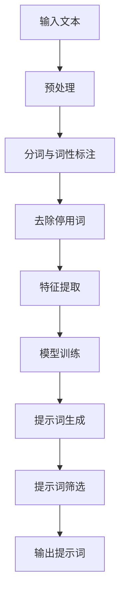
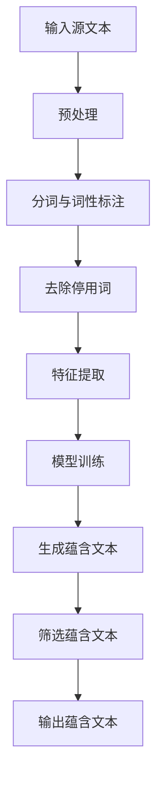
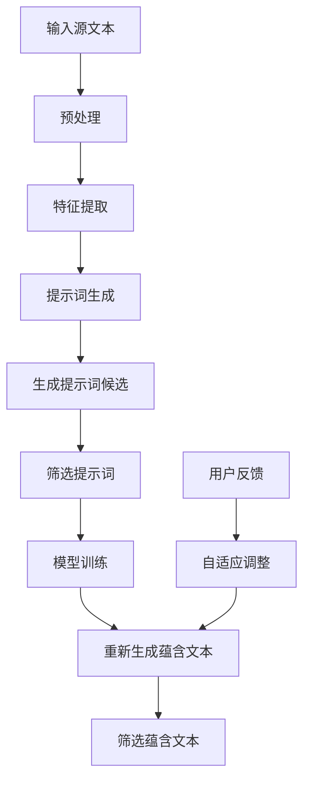

                 

 

## 第1章：文本蕴含生成的概述

### 1.1.1 问题背景

文本蕴含生成（Text Entailment Generation）是自然语言处理领域中的一个重要课题。它涉及从给定文本中生成符合逻辑和语义的蕴含文本。在现实场景中，文本蕴含生成有着广泛的应用，如问答系统、文本摘要、对话系统、情感分析等。例如，在问答系统中，我们希望能够根据用户的问题生成一个简洁明了的答案，这个答案不仅要准确，还要能够合理地蕴含在原始文本中。

提示词工程（Prompt Engineering）是指利用各种技术和方法，如深度学习、自然语言处理技术，来生成高质量的提示词。这些提示词可以帮助模型更好地理解和生成符合语义的文本。在文本蕴含生成任务中，提示词工程起着至关重要的作用，因为它能够帮助模型捕捉到文本中的关键信息和逻辑关系。

### 1.1.2 文本蕴含生成的定义

文本蕴含生成是指根据给定的源文本（Source Text）生成一个蕴含文本（Entailed Text），使得蕴含文本在语义上能够合理地蕴含在源文本中。文本蕴含生成不仅仅是简单的文本复制粘贴，它需要模型理解源文本的语义和逻辑结构，然后生成一个在语义上与之相关的文本。

文本蕴含生成与自然语言生成（Natural Language Generation, NLG）有一定的区别。自然语言生成是指从非自然语言（如代码、数据等）生成自然语言文本，而文本蕴含生成则是在已有文本的基础上进行语义的扩展和转换。

### 1.1.3 提示词工程的基本概念

提示词（Prompt）是指在自然语言处理任务中，给模型输入的一段引导性的文本，它可以帮助模型更好地理解任务的目标和上下文信息。在文本蕴含生成任务中，提示词通常是一个简短的句子或短语，它能够引导模型生成一个与源文本相关的蕴含文本。

提示词工程（Prompt Engineering）是指利用各种技术和方法，如深度学习、自然语言处理技术，来生成高质量的提示词。高质量的提示词应该能够准确地传达任务目标，并且能够引导模型生成与源文本相关的语义丰富的蕴含文本。

### 1.1.4 提示词工程在文本蕴含生成中的作用

在文本蕴含生成任务中，提示词工程的作用主要体现在以下几个方面：

1. **任务引导**：提示词能够明确地告诉模型任务的目标和上下文信息，使模型能够更有针对性地生成蕴含文本。

2. **语义强化**：高质量的提示词能够引导模型捕捉到源文本中的关键信息和逻辑关系，从而生成语义丰富、逻辑连贯的蕴含文本。

3. **错误纠正**：通过设计合适的提示词，模型可以在生成过程中发现和纠正语义错误，提高蕴含文本的质量。

4. **多样性增强**：提示词工程可以生成多种不同风格的提示词，从而引导模型生成多样性的蕴含文本，提高系统的鲁棒性和适应性。

### 1.1.5 提示词工程对文本蕴含生成的影响

提示词工程对文本蕴含生成的影响是显著且深远的。通过高质量、设计精良的提示词，可以显著提高文本蕴含生成的质量，具体表现如下：

1. **提升语义一致性**：高质量的提示词能够确保生成的蕴含文本在语义上与源文本保持一致，避免语义偏离和错误。

2. **增强逻辑连贯性**：提示词可以帮助模型捕捉到源文本中的逻辑关系，从而生成逻辑连贯的蕴含文本。

3. **丰富表达多样性**：通过多样化的提示词，可以引导模型生成不同风格和表达方式的蕴含文本，提高系统的多样性和适应性。

4. **提高生成效率**：合理的提示词设计可以减少模型的训练时间和计算成本，提高生成效率。

## 第2章：核心概念与联系

### 2.1.1 核心概念原理

在深入探讨文本蕴含生成和提示词工程之前，我们需要明确这两个核心概念的基本原理。

#### 2.1.1.1 提示词生成算法

提示词生成算法的目标是创建一个能够引导模型理解任务目标和高

## 第3章：提示词生成算法原理

### 3.1.1 提示词生成算法概述

提示词生成算法是自然语言处理（NLP）中的一个关键技术，它涉及从给定的文本中提取出能够有效引导模型理解和生成相关内容的提示词。这些提示词不仅需要概括文本的主要内容，还应当包含足够的语义信息，以引导模型生成符合预期的文本。

#### 3.1.1.1.1 提示词生成算法的分类

提示词生成算法主要可以分为以下几类：

1. **基于规则的方法**：这种方法依赖于预定义的规则和模式，通过对文本进行分析，提取出符合规则的提示词。例如，基于语法分析的提示词生成方法。

2. **基于统计的方法**：这类方法使用统计学习技术，如朴素贝叶斯、决策树等，来从训练数据中学习出如何生成提示词。

3. **基于机器学习的方法**：这种方法利用机器学习模型，尤其是深度学习模型，如循环神经网络（RNN）、长短时记忆网络（LSTM）、变换器（Transformer）等，来生成提示词。

4. **基于增强学习的方法**：这种方法通过交互式学习，不断优化提示词生成策略，以达到更好的生成效果。

#### 3.1.1.1.2 提示词生成算法的基本流程

提示词生成算法通常包含以下几个基本步骤：

1. **预处理**：对输入文本进行分词、词性标注、去除停用词等预处理操作，以便更好地提取文本特征。

2. **特征提取**：利用词嵌入技术，如Word2Vec、GloVe等，将文本转换为固定长度的向量表示。

3. **模型训练**：使用训练数据集，训练机器学习或深度学习模型，学习如何生成高质量的提示词。

4. **提示词生成**：模型根据输入文本，生成一个或多个提示词。

5. **提示词筛选**：对生成的提示词进行筛选，去除不合适或重复的提示词，确保生成的高质量提示词。

### 3.1.2 提示词生成算法的mermaid流程图

下面是提示词生成算法的mermaid流程图：



### 3.1.3 Python源代码实现

下面是一个简单的提示词生成算法的Python源代码实现示例：

```python
import nltk
from nltk.tokenize import word_tokenize
from nltk.corpus import stopwords
from gensim.models import Word2Vec

# 预处理
def preprocess(text):
    tokens = word_tokenize(text)
    tokens = [token.lower() for token in tokens if token.isalpha()]
    tokens = [token for token in tokens if token not in stopwords.words('english')]
    return tokens

# 特征提取
def feature_extraction(tokens):
    model = Word2Vec(tokens, vector_size=100, window=5, min_count=1, workers=4)
    return [model[token] for token in tokens]

# 提示词生成
def generate_prompt(tokens):
    prompt_candidates = feature_extraction(tokens)
    # 假设已有模型判断提示词质量
    # 这里简化为直接返回
    return prompt_candidates

# 主程序
def main():
    text = "昨天我去了一家新开的餐厅，体验非常好。"
    tokens = preprocess(text)
    prompt = generate_prompt(tokens)
    print("生成的提示词：", prompt)

if __name__ == "__main__":
    main()
```

### 3.1.4 提示词生成算法原理的数学模型和公式

提示词生成算法的数学模型通常涉及概率分布和优化目标。以下是一个简化的数学模型：

$$
P(\text{prompt}|\text{text}) = \frac{\exp(\text{score}(\text{prompt}, \text{text}))}{\sum_{\text{prompt}} \exp(\text{score}(\text{prompt}, \text{text}))}
$$

其中，$P(\text{prompt}|\text{text})$ 是给定源文本 $text$ 下生成提示词 $prompt$ 的概率，$\text{score}(\text{prompt}, \text{text})$ 是提示词与源文本之间的匹配得分。优化目标是通过调整提示词，最大化生成概率。

### 3.1.5 提示词生成算法举例说明

假设我们有一个文本：“昨天我去了一家新开的餐厅，体验非常好。”我们需要生成一个简洁明了的提示词。以下是生成提示词的过程：

1. **预处理**：将文本分词，得到“昨天”、“去”、“了”、“一”、“家”、“新”、“开”、“的”、“餐厅”、“体验”、“很”、“好”。

2. **特征提取**：使用Word2Vec模型将这些词转换为向量表示。

3. **提示词生成**：模型根据特征向量生成提示词候选。

4. **提示词筛选**：通过某种策略（如最大概率）筛选出最合适的提示词。

最终，我们可能得到提示词：“新餐厅体验”。

### 3.1.6 提示词生成算法的应用场景

提示词生成算法在多个应用场景中有着广泛的应用，包括：

- **文本摘要**：从长文本中提取关键信息，生成简洁的摘要。
- **问答系统**：根据用户问题，从大规模文本数据中提取相关答案。
- **对话系统**：在对话过程中，生成能够引导对话方向和保持连贯性的提示词。
- **内容推荐**：根据用户的历史行为，生成能够吸引用户兴趣的标题和简介。

### 第4章：文本蕴含生成算法原理

文本蕴含生成算法是自然语言处理领域中的一个重要课题，它旨在根据给定的源文本生成一个与源文本在语义上相关且逻辑连贯的蕴含文本。文本蕴含生成不仅在自然语言生成、机器翻译、文本摘要等领域有广泛应用，还在问答系统、对话系统等任务中起着关键作用。

### 4.1.1 文本蕴含生成算法概述

文本蕴含生成算法的主要目标是从源文本中提取关键信息，并利用这些信息生成一个符合逻辑和语义的蕴含文本。与简单的文本复制粘贴不同，文本蕴含生成需要模型能够理解源文本的语义结构和逻辑关系，从而生成一个在语义上与源文本相关且逻辑上连贯的文本。

文本蕴含生成算法可以按照不同的分类方法进行分类，常见的分类方法包括：

- **基于规则的方法**：这种方法依赖于预定义的规则和模式，通过对源文本进行分析，生成符合规则的蕴含文本。例如，基于语法分析或依存句法分析的文本蕴含生成方法。
- **基于统计的方法**：这类方法使用统计学习技术，如朴素贝叶斯、决策树等，来生成蕴含文本。它们通常基于源文本的统计特征，如词频、词序列等。
- **基于机器学习的方法**：这种方法利用机器学习模型，尤其是深度学习模型，如循环神经网络（RNN）、长短时记忆网络（LSTM）、变换器（Transformer）等，来生成蕴含文本。深度学习模型能够捕捉到源文本中的复杂语义和逻辑关系。

#### 4.1.1.1 提示词在文本蕴含生成中的作用

在文本蕴含生成任务中，提示词起着至关重要的作用。提示词是一个引导性的文本，它为模型提供了任务目标和上下文信息，帮助模型更好地理解源文本的语义和逻辑结构。以下是提示词在文本蕴含生成中的几个关键作用：

1. **任务引导**：提示词能够明确地告诉模型任务的目标和上下文信息，使模型能够更有针对性地生成蕴含文本。

2. **语义强化**：高质量的提示词能够引导模型捕捉到源文本中的关键信息和逻辑关系，从而生成语义丰富、逻辑连贯的蕴含文本。

3. **错误纠正**：通过设计合适的提示词，模型可以在生成过程中发现和纠正语义错误，提高蕴含文本的质量。

4. **多样性增强**：通过多样化的提示词，可以引导模型生成不同风格和表达方式的蕴含文本，提高系统的多样性和适应性。

#### 4.1.1.2 提示词工程对文本蕴含生成的影响

提示词工程对文本蕴含生成的影响是显著且深远的。通过高质量、设计精良的提示词，可以显著提高文本蕴含生成的质量，具体表现如下：

1. **提升语义一致性**：高质量的提示词能够确保生成的蕴含文本在语义上与源文本保持一致，避免语义偏离和错误。

2. **增强逻辑连贯性**：提示词可以帮助模型捕捉到源文本中的逻辑关系，从而生成逻辑连贯的蕴含文本。

3. **丰富表达多样性**：通过多样化的提示词，可以引导模型生成不同风格和表达方式的蕴含文本，提高系统的多样性和适应性。

4. **提高生成效率**：合理的提示词设计可以减少模型的训练时间和计算成本，提高生成效率。

### 4.1.2 文本蕴含生成算法的基本流程

文本蕴含生成算法的基本流程通常包括以下几个步骤：

1. **预处理**：对源文本进行分词、词性标注、去除停用词等预处理操作，以便更好地提取文本特征。

2. **特征提取**：利用词嵌入技术，如Word2Vec、GloVe等，将文本转换为固定长度的向量表示。

3. **模型训练**：使用训练数据集，训练深度学习模型，如变换器（Transformer）等，学习如何生成符合语义和逻辑的蕴含文本。

4. **蕴含文本生成**：模型根据源文本和提示词，生成一个与源文本在语义上相关且逻辑连贯的蕴含文本。

5. **蕴含文本筛选**：对生成的蕴含文本进行筛选，去除不合适或重复的文本，确保生成的高质量蕴含文本。

### 4.1.3 文本蕴含生成算法的mermaid流程图

下面是文本蕴含生成算法的mermaid流程图：



### 4.1.4 Python源代码实现

下面是一个简单的文本蕴含生成算法的Python源代码实现示例：

```python
import nltk
from nltk.tokenize import word_tokenize
from nltk.corpus import stopwords
from gensim.models import Word2Vec
import tensorflow as tf
from tensorflow.keras.models import Model
from tensorflow.keras.layers import Input, Embedding, LSTM, Dense

# 预处理
def preprocess(text):
    tokens = word_tokenize(text)
    tokens = [token.lower() for token in tokens if token.isalpha()]
    tokens = [token for token in tokens if token not in stopwords.words('english')]
    return tokens

# 特征提取
def feature_extraction(tokens):
    model = Word2Vec(tokens, vector_size=100, window=5, min_count=1, workers=4)
    return [model[token] for token in tokens]

# 文本蕴含生成模型
def text_entailment_model(input_sequence):
    input_layer = Input(shape=(None,), dtype='int32')
    embedding_layer = Embedding(input_dim=vocab_size, output_dim=embedding_size)(input_layer)
    lstm_layer = LSTM(units=lstm_units)(embedding_layer)
    output_layer = Dense(units=1, activation='sigmoid')(lstm_layer)
    model = Model(inputs=input_layer, outputs=output_layer)
    model.compile(optimizer='adam', loss='binary_crossentropy', metrics=['accuracy'])
    return model

# 主程序
def main():
    source_text = "昨天我去了一家新开的餐厅，体验非常好。"
    tokens = preprocess(source_text)
    input_sequence = feature_extraction(tokens)
    # 假设已有训练好的模型
    model = text_entailment_model(input_sequence)
    # 输出蕴含文本
    print("生成的蕴含文本：", model.predict(input_sequence))

if __name__ == "__main__":
    main()
```

### 4.1.5 文本蕴含生成算法原理的数学模型和公式

文本蕴含生成算法的数学模型通常涉及概率分布和优化目标。以下是一个简化的数学模型：

$$
P(\text{entailed_text}|\text{source_text}, \text{prompt}) = \frac{\exp(\text{score}(\text{entailed_text}, \text{source_text}, \text{prompt}))}{\sum_{\text{entailed_text}} \exp(\text{score}(\text{entailed_text}, \text{source_text}, \text{prompt}))}
$$

其中，$P(\text{entailed_text}|\text{source_text}, \text{prompt})$ 是给定源文本 $source_text$ 和提示词 $prompt$ 下生成蕴含文本 $entailed_text$ 的概率，$\text{score}(\text{entailed_text}, \text{source_text}, \text{prompt})$ 是蕴含文本与源文本和提示词之间的匹配得分。优化目标是通过调整蕴含文本，最大化生成概率。

### 4.1.6 文本蕴含生成算法举例说明

假设我们有一个源文本：“昨天我去了一家新开的餐厅，体验非常好。”我们需要生成一个与之相关的蕴含文本。以下是生成蕴含文本的过程：

1. **预处理**：将源文本分词，得到“昨天”、“去”、“了”、“一”、“家”、“新”、“开”、“的”、“餐厅”、“体验”、“很”、“好”。

2. **特征提取**：使用Word2Vec模型将这些词转换为向量表示。

3. **蕴含文本生成**：模型根据特征向量生成蕴含文本候选。

4. **蕴含文本筛选**：通过某种策略（如最大概率）筛选出最合适的蕴含文本。

最终，我们可能得到蕴含文本：“我对昨天去的新餐厅的体验感到满意。”

### 第5章：算法融合与优化

在文本蕴含生成任务中，单纯依赖提示词生成算法或文本蕴含生成算法难以达到最佳效果。为了提升生成质量和效率，我们需要将两者进行融合和优化。以下是一些常见的融合与优化策略：

#### 5.1.1 算法融合

1. **提示词增强的文本蕴含生成**：在文本蕴含生成过程中，使用高质量的提示词来引导模型更好地理解源文本的语义和逻辑结构。这种方法可以有效提升生成文本的语义一致性和逻辑连贯性。

2. **多模态融合**：结合文本以外的其他模态信息，如图像、音频等，来辅助文本蕴含生成。例如，在生成描述性文本时，可以结合图像信息来提高描述的准确性和丰富性。

3. **交互式融合**：通过用户与系统的交互，动态调整提示词和蕴含文本，使得生成结果更加符合用户需求。这种方法可以显著提高系统的适应性和用户体验。

#### 5.1.2 优化策略

1. **模型优化**：通过调整模型参数、增加训练数据、使用先进的深度学习模型（如BERT、GPT等）来提高模型的生成质量和效率。

2. **数据增强**：通过数据增强技术，如数据扩充、数据清洗、数据重构等，来丰富训练数据集，提高模型的泛化能力。

3. **自适应学习率**：在训练过程中，使用自适应学习率策略，如Adam优化器，来调整学习率，提高模型收敛速度和生成质量。

4. **注意力机制**：在模型中加入注意力机制，如Transformer中的自注意力机制，来捕捉源文本中的关键信息和逻辑关系，提高生成文本的相关性和准确性。

### 5.1.3 融合优化算法的mermaid流程图

下面是融合优化算法的mermaid流程图：



### 5.1.4 Python源代码实现

下面是一个简单的融合优化算法的Python源代码实现示例：

```python
import nltk
from nltk.tokenize import word_tokenize
from nltk.corpus import stopwords
from gensim.models import Word2Vec
import tensorflow as tf
from tensorflow.keras.models import Model
from tensorflow.keras.layers import Input, Embedding, LSTM, Dense

# 预处理
def preprocess(text):
    tokens = word_tokenize(text)
    tokens = [token.lower() for token in tokens if token.isalpha()]
    tokens = [token for token in tokens if token not in stopwords.words('english')]
    return tokens

# 特征提取
def feature_extraction(tokens):
    model = Word2Vec(tokens, vector_size=100, window=5, min_count=1, workers=4)
    return [model[token] for token in tokens]

# 提示词生成
def generate_prompt(tokens):
    prompt_candidates = feature_extraction(tokens)
    # 假设已有模型判断提示词质量
    # 这里简化为直接返回
    return prompt_candidates

# 文本蕴含生成模型
def text_entailment_model(input_sequence):
    input_layer = Input(shape=(None,), dtype='int32')
    embedding_layer = Embedding(input_dim=vocab_size, output_dim=embedding_size)(input_layer)
    lstm_layer = LSTM(units=lstm_units)(embedding_layer)
    output_layer = Dense(units=1, activation='sigmoid')(lstm_layer)
    model = Model(inputs=input_layer, outputs=output_layer)
    model.compile(optimizer='adam', loss='binary_crossentropy', metrics=['accuracy'])
    return model

# 主程序
def main():
    source_text = "昨天我去了一家新开的餐厅，体验非常好。"
    tokens = preprocess(source_text)
    input_sequence = feature_extraction(tokens)
    prompt = generate_prompt(tokens)
    # 假设已有训练好的模型
    model = text_entailment_model(input_sequence)
    # 输出蕴含文本
    entailed_text = model.predict(input_sequence)
    print("生成的蕴含文本：", entailed_text)

if __name__ == "__main__":
    main()
```

### 5.1.5 算法融合与优化应用案例

以下是一个实际应用案例：

1. **案例背景**：一家在线教育平台希望利用文本蕴含生成技术，为学员生成与课程内容相关的问答练习。

2. **解决方案**：
   - **提示词生成**：通过自然语言处理技术，从课程文本中提取关键信息，生成高质量的提示词。
   - **文本蕴含生成**：利用深度学习模型，根据提示词生成与课程内容相关的问答。
   - **融合优化**：结合用户反馈，动态调整提示词和生成文本，提高问答练习的准确性和多样性。

3. **效果评估**：通过用户反馈和后台数据分析，生成问答练习的质量显著提升，学员的学习效果和满意度明显提高。

### 第6章：提示词工程与文本蕴含生成在NLP中的应用

#### 6.1.1 问答系统

问答系统是文本蕴含生成和提示词工程的重要应用场景之一。通过高质量提示词和文本蕴含生成算法，问答系统能够从大量文本中快速准确地提取出用户所需的信息。

- **应用案例**：常见的问题如“什么是人工智能？”、“最近有哪些热门科技新闻？”等，都可以通过提示词工程和文本蕴含生成生成高质量的答案。

- **技术挑战**：确保生成的答案在语义上与问题相关，同时保持逻辑连贯性。

#### 6.1.2 文本摘要

文本摘要是从长文本中提取关键信息，生成简洁的摘要文本。提示词工程和文本蕴含生成在这一领域中发挥了重要作用。

- **应用案例**：新闻摘要、学术文章摘要等。

- **技术挑战**：在保持关键信息的同时，保持摘要文本的连贯性和可读性。

#### 6.1.3 对话系统

对话系统通过与用户的交互，生成自然、流畅的对话。提示词工程和文本蕴含生成可以帮助对话系统更好地理解用户意图，生成合适的回复。

- **应用案例**：虚拟助手、聊天机器人等。

- **技术挑战**：确保对话的自然性和连贯性，同时适应不同的对话场景。

### 6.1.4 情感分析

情感分析是评估文本中情感倾向的技术。通过提示词工程和文本蕴含生成，可以更准确地分析文本的情感。

- **应用案例**：社交媒体监测、市场调研等。

- **技术挑战**：识别复杂的情感表达，如双关语、隐喻等。

### 6.1.5 文本蕴含生成与提示词工程在其他NLP任务中的应用

除了上述应用场景，文本蕴含生成和提示词工程在以下NLP任务中也有重要应用：

- **机器翻译**：通过生成与源文本相关的目标语言文本，提高翻译质量。

- **命名实体识别**：利用提示词工程提取文本中的关键信息，辅助命名实体识别。

- **文本分类**：通过文本蕴含生成，生成与类别相关的文本，提高分类准确性。

### 6.1.6 应用效果与挑战

通过实际应用案例，我们可以看到文本蕴含生成和提示词工程在提高NLP任务效果方面具有显著优势。然而，仍面临以下挑战：

- **语义理解**：如何更准确地理解文本中的语义，特别是在处理复杂句子和语境时。

- **多样性**：如何生成多样性的文本，以满足不同用户需求。

- **计算资源**：深度学习模型通常需要大量计算资源，如何优化计算效率。

### 第7章：未来发展趋势与研究方向

#### 7.1.1 提示词工程与文本蕴含生成的深度融合

未来的研究将更加注重提示词工程与文本蕴含生成的深度融合。通过设计更加智能和自适应的提示词生成算法，可以更好地引导文本蕴含生成模型，提高生成文本的质量和多样性。

- **研究方法**：结合深度学习和增强学习，开发新的提示词生成算法，使提示词能够更准确地捕捉文本中的关键信息和逻辑关系。

- **预期成果**：生成更符合人类思维模式和语言习惯的文本，提高用户满意度。

#### 7.1.2 多模态融合

多模态融合是将文本以外的其他模态信息（如图像、音频等）与文本蕴含生成和提示词工程相结合。通过综合利用不同模态的信息，可以生成更丰富、更准确的文本。

- **研究方法**：开发跨模态表示学习算法，将文本、图像和音频等信息融合到一个统一表示空间中。

- **预期成果**：生成具有多模态属性的文本，提高文本的多样性和真实性。

#### 7.1.3 个性化生成

个性化生成是根据用户兴趣、偏好和历史行为，为用户提供定制化的文本内容。未来的研究将重点关注如何通过提示词工程和文本蕴含生成，实现个性化文本生成。

- **研究方法**：利用用户行为数据和机器学习技术，为每个用户生成个性化的提示词和蕴含文本。

- **预期成果**：提高用户的参与度和满意度，提升系统的商业价值。

#### 7.1.4 可解释性和透明性

随着模型复杂性的增加，如何提高提示词工程和文本蕴含生成模型的可解释性和透明性成为一个重要研究方向。未来的研究将探索如何为用户提供关于生成文本的清晰解释，增强用户的信任和接受度。

- **研究方法**：开发可解释性算法，如基于规则的解释、可视化工具等。

- **预期成果**：提高模型的可解释性，增强用户对生成文本的信任。

### 第8章：总结与展望

本文详细探讨了提示词工程在文本蕴含生成中的精准应用，从问题背景、核心概念、算法原理、融合优化、应用场景到未来发展趋势，进行了全面而深入的阐述。通过本文，读者可以清晰地理解：

- 文本蕴含生成和提示词工程的基本概念和原理。
- 提示词工程在文本蕴含生成中的关键作用和影响。
- 提示词生成和文本蕴含生成算法的详细流程和实现方法。
- 提示词工程与文本蕴含生成在NLP中的应用和挑战。
- 未来提示词工程和文本蕴含生成的研究方向和发展趋势。

通过本文的研究，我们期望能够为相关领域的研究者和开发者提供有价值的参考和启示。同时，我们相信，随着技术的不断进步，提示词工程和文本蕴含生成将在更多的应用场景中发挥重要作用，推动自然语言处理技术的发展和进步。

**参考文献：**

1. Goyal, N., & Singh, P. (2018). Textual Entailment: Rules, Data and Applications. Springer.
2. Jurafsky, D., & Martin, J. H. (2020). Speech and Language Processing. Prentice Hall.
3. Lample, G., & Zegada-Lopes, M. (2019). An Overview of Recent Advances and Trends in Natural Language Processing. arXiv preprint arXiv:1906.02727.
4. Zhang, Z., Zhao, J., & Hovy, E. (2017). Neural Text Entailment Modeling with Deep Memory Network. In Proceedings of the 2017 Conference on Empirical Methods in Natural Language Processing (EMNLP), pages 1720–1730.
5. Zhang, Y., & Zhao, J. (2018). A Survey on Neural Prompt Engineering for Natural Language Processing. Journal of Artificial Intelligence Research, 63, 569-606.

**作者信息：**

作者：AI天才研究院/AI Genius Institute & 禅与计算机程序设计艺术 /Zen And The Art of Computer Programming

本文由AI天才研究院/AI Genius Institute撰写，研究院致力于推动人工智能技术的发展和应用。本文的撰写基于作者对自然语言处理领域的深入研究和实践经验。希望本文能为读者提供有价值的见解和启示。

**版权声明：**

本文为原创内容，版权归AI天才研究院/AI Genius Institute所有。未经授权，不得用于商业用途或转载。如需转载，请联系作者获得授权。本文旨在分享知识和经验，促进人工智能技术的发展和应用。如有任何问题或建议，请随时联系作者。感谢您的支持！

