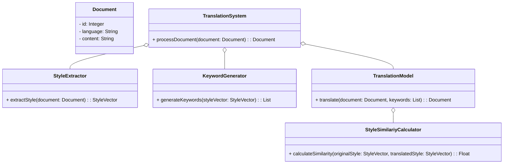
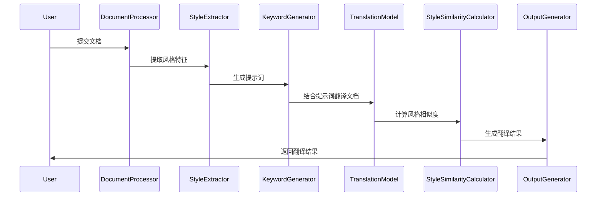
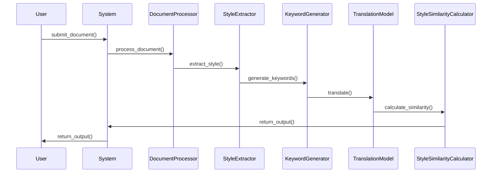

                 

### 提示词工程在文本风格保持翻译中的进展

---

## **关键词**：

提示词工程、文本风格保持翻译、机器翻译、自然语言处理、深度学习

---

## **摘要**：

本篇技术博客旨在探讨提示词工程在文本风格保持翻译中的应用与进展。我们将首先介绍提示词工程的基本概念，然后深入分析文本风格保持翻译的挑战，并探讨当前的研究进展。接着，我们将详细讲解提示词工程的算法原理和数学模型，并通过实际项目案例展示其应用效果。最后，我们将总结最佳实践，并提出未来研究方向和拓展阅读建议。

---

### 目录

1. **背景介绍**
   1.1. **问题背景**
   1.2. **问题描述**
   1.3. **问题解决**

2. **核心概念与联系**
   2.1. **核心概念原理**
   2.2. **概念属性特征对比表格**
   2.3. **ER实体关系图架构**

3. **算法原理讲解**
   3.1. **算法原理**
   3.2. **数学模型**
   3.3. **详细讲解与举例说明**

4. **系统分析与架构设计方案**
   4.1. **问题场景介绍**
   4.2. **系统功能设计**
   4.3. **系统架构设计**
   4.4. **系统接口设计和系统交互**

5. **项目实战**
   5.1. **环境安装**
   5.2. **系统核心实现**
   5.3. **代码应用解读与分析**
   5.4. **实际案例分析与详细讲解**
   5.5. **项目小结**

6. **最佳实践、小结与拓展阅读**
   6.1. **最佳实践 tips**
   6.2. **小结**
   6.3. **注意事项**
   6.4. **拓展阅读**

---

### 1.1 问题背景

提示词工程（Keyword Engineering）是自然语言处理（NLP）领域的一个重要分支，旨在通过设计、选择和利用关键词来改善信息检索、文本分类、机器翻译等任务的效果。在文本风格保持翻译中，提示词工程的作用尤为显著。它能够确保翻译结果不仅准确无误，而且能够保持原文的文风、语气和风格，从而提高翻译的流畅性和可读性。

随着机器翻译技术的不断发展，特别是深度学习算法的广泛应用，翻译质量得到了显著提升。然而，传统的机器翻译模型在处理文本风格保持方面仍然存在一些挑战。例如，它们可能无法准确地捕捉到原文中的幽默、讽刺、文化差异等风格元素，导致翻译结果在风格上与原文不符。

为了解决这一问题，研究者们开始探索提示词工程在文本风格保持翻译中的应用。通过设计特定的提示词，可以引导机器翻译模型更好地理解和模拟原文的文本风格。这一技术的进展，不仅提升了翻译质量，也为跨文化交流和国际化内容创作提供了新的可能性。

---

### 1.2 问题描述

文本风格保持翻译的挑战主要体现在以下几个方面：

1. **风格多样性**：不同文本具有不同的风格，包括正式、非正式、幽默、严肃等。传统机器翻译模型往往难以捕捉到这些风格差异，导致翻译结果风格单一，缺乏原文的特色。

2. **文化差异**：不同语言和文化背景下的文本风格存在显著差异。例如，英语中的幽默和隐喻在翻译成其他语言时可能难以保留其原有的风格和趣味。

3. **上下文依赖**：文本风格通常依赖于上下文环境，即同一个词或短语在不同的上下文中可能具有不同的风格意义。机器翻译模型需要具备较强的上下文理解能力，才能准确地保持原文的风格。

4. **个性化需求**：不同用户对翻译结果风格的需求各不相同。有些用户可能更喜欢贴近原文的风格，而有些用户可能希望翻译结果更加流畅易懂。

为了解决这些挑战，提示词工程引入了特定的策略和技术，包括：

- **风格分类与标签**：通过对原文进行风格分类和标签化，为机器翻译模型提供风格信息，帮助其更好地理解和模拟原文的风格。
- **提示词设计**：设计特定的提示词，如风格指示词、文化背景词等，引导模型在翻译过程中注意保持文本风格。
- **上下文增强**：利用上下文信息，如句子、段落、章节等，为模型提供更多的风格相关信息，从而提高翻译结果的风格保持能力。

---

### 1.3 问题解决

提示词工程在文本风格保持翻译中的应用主要包括以下几个步骤：

1. **风格特征提取**：首先，需要从原文中提取风格特征。这可以通过文本分析技术，如词性标注、命名实体识别、情感分析等实现。通过这些特征，可以构建出描述原文风格的向量表示。

2. **提示词设计**：根据提取出的风格特征，设计相应的提示词。这些提示词可以是具体的关键词，也可以是短语或句子，其目的是在翻译过程中引导模型关注和模拟原文的风格。

3. **模型训练与优化**：使用设计好的提示词对机器翻译模型进行训练和优化。这可以采用迁移学习、强化学习等技术，使得模型能够在翻译过程中更好地保持文本风格。

4. **翻译结果评估与调整**：对翻译结果进行评估，包括风格保持度、翻译准确性、流畅性等方面。根据评估结果，对模型进行调整和优化，以提高翻译结果的风格保持能力。

通过这些步骤，提示词工程可以有效地提高机器翻译在文本风格保持方面的效果，从而满足不同用户对翻译结果风格的需求。

---

### 2.1 核心概念原理

#### 2.1.1 提示词的定义与分类

提示词（Keywords）是提示词工程的核心概念之一。它指的是在文本中用于指示、描述或引导特定信息的关键词汇或短语。根据用途和作用，提示词可以分为以下几类：

1. **主题提示词**：用于指示文本的主题或主要内容。例如，在新闻报道中，主题提示词可能包括“政治”、“经济”、“体育”等。

2. **风格提示词**：用于指示文本的风格特征，如正式、非正式、幽默、严肃等。例如，“轻松”、“正式”、“幽默”等。

3. **文化提示词**：用于指示文本的文化背景或特定文化元素。例如，“圣诞节”、“春节”、“爵士乐”等。

4. **情感提示词**：用于指示文本的情感倾向，如积极、消极、中性等。例如，“开心”、“悲伤”、“愤怒”等。

#### 2.1.2 文本风格的定义与特征提取

文本风格（Textual Style）指的是文本在表达、语言使用和结构安排等方面的特征。它不仅反映了作者的语言习惯和写作风格，还包含了文本的主题、情感、语气等多种元素。文本风格的定义可以从以下几个方面进行：

1. **语言表达**：文本风格体现在语言的选用、句式的结构、修辞手法的运用等方面。

2. **情感色彩**：文本风格常常带有一定的情感色彩，如积极、消极、幽默、严肃等。

3. **文化背景**：不同文化背景下的文本风格具有明显的差异，这反映了文化的独特性和多样性。

4. **语言节奏**：文本风格还包括语言的节奏和韵律，如平缓、紧凑、起伏等。

为了提取文本风格特征，可以采用以下几种方法：

1. **基于规则的方法**：通过预定义的规则和模式，对文本进行风格分类和特征提取。

2. **基于统计的方法**：利用机器学习算法，从大规模文本数据中学习出风格特征，如朴素贝叶斯、支持向量机等。

3. **基于深度学习的方法**：利用深度神经网络，如卷积神经网络（CNN）和循环神经网络（RNN），对文本进行风格特征提取。

通过上述方法，可以有效地提取出文本的风格特征，为提示词工程提供基础数据支持。

---

### 2.2 概念属性特征对比表格

为了更好地理解提示词和文本风格的属性特征，我们可以通过一个对比表格来展示它们的主要区别和联系。

| **概念**   | **定义**                     | **属性特征**                                                     | **作用**                         |
|------------|------------------------------|------------------------------------------------------------------|---------------------------------|
| **提示词** | 用于指示、描述或引导特定信息 | - 主题性：<br>风格性：<br>文化性：<br>情感性               | - 指引翻译方向：<br>影响翻译风格 |
| **文本风格** | 文本在表达、语言使用和结构安排等方面的特征 | - 语言表达：<br>情感色彩：<br>文化背景：<br>语言节奏 | - 形成文本特色：<br>影响阅读体验 |

通过这个表格，我们可以看到提示词和文本风格在定义、属性特征和作用方面存在一定的区别和联系。提示词主要用于指示和引导翻译方向，而文本风格则体现在文本的表达和感知上。

---

### 2.3 ER实体关系图架构

在提示词工程中，实体关系（Entity Relationship，ER）图是一种常用的数据建模工具，用于表示实体及其之间的关系。下面我们通过一个简单的ER实体关系图来展示提示词工程中的实体和关系。

```mermaid
erDiagram
    文本 <<|-- 原文 : 被翻译文本
    文本 <<|-- 提示词 : 用于引导翻译的词或短语
    文本 ||--|译文 : 翻译后的文本

    原文 ||--|文本风格 : 描述原文风格的特征
    提示词 ||--|风格提示词 : 用于指示文本风格的提示词

    原文 .-> 文本风格
    提示词 .-> 风格提示词
```

这个ER图包含了以下实体和关系：

- **实体**：原文、提示词、译文、文本风格、风格提示词。
- **关系**：原文与文本风格之间的描述关系，提示词与风格提示词之间的继承关系，以及译文与原文之间的翻译关系。

通过这个ER图，我们可以清晰地看到提示词工程中的主要实体和它们之间的关系，从而为后续的算法设计和系统实现提供了基础。

---

### 3.1 算法原理

提示词工程在文本风格保持翻译中的应用主要依赖于以下几类算法：

#### 3.1.1 提示词生成算法

提示词生成算法是提示词工程中的核心算法之一，其主要目的是从原文中自动生成合适的提示词，以引导机器翻译模型保持文本风格。常见的提示词生成算法包括：

1. **基于规则的方法**：通过预定义的规则和模式，从原文中提取出具有风格特征的词汇作为提示词。这种方法简单直观，但可能无法覆盖所有风格特征。

2. **基于统计的方法**：利用统计模型，如朴素贝叶斯、支持向量机等，从大规模文本数据中学习出风格特征，并生成相应的提示词。这种方法具有较高的泛化能力，但需要大量的训练数据。

3. **基于深度学习的方法**：利用深度神经网络，如卷积神经网络（CNN）和循环神经网络（RNN），从原文中提取出风格特征，并生成相应的提示词。这种方法具有较强的表达能力和适应性，但计算复杂度较高。

#### 3.1.2 提示词优化算法

提示词生成后，还需要对提示词进行优化，以提高其在翻译过程中的效果。常见的提示词优化算法包括：

1. **基于语义相似度的优化**：通过计算原文和提示词之间的语义相似度，筛选出最具有代表性的提示词。这种方法能够提高提示词的准确性，但可能忽略一些细微的风格差异。

2. **基于上下文信息的优化**：利用上下文信息，如句子、段落、章节等，对提示词进行优化。这种方法能够更好地捕捉到文本风格的特征，但计算复杂度较高。

3. **基于强化学习的方法**：通过强化学习算法，训练模型在翻译过程中动态调整提示词，以最大化翻译结果的风格保持度。这种方法具有较强的自适应能力，但训练过程较为复杂。

通过以上算法，提示词工程能够有效地生成和优化提示词，从而提高机器翻译在文本风格保持方面的效果。

---

### 3.2 数学模型

提示词工程在文本风格保持翻译中的应用涉及多个数学模型，这些模型帮助我们在算法设计中量化风格特征和提示词的作用。以下是一些关键的数学模型：

#### 3.2.1 提示词生成算法的数学模型

提示词生成算法的数学模型通常涉及概率模型或深度学习模型。一个简单的概率模型可以是条件概率模型，它表示给定原文的一个片段，生成特定提示词的概率。数学公式如下：

\[ P(\text{提示词}|\text{原文}) = \frac{P(\text{原文}|\text{提示词}) \cdot P(\text{提示词})}{P(\text{原文})} \]

其中，\( P(\text{提示词}) \) 是提示词的先验概率，\( P(\text{原文}|\text{提示词}) \) 是在给定提示词的情况下原文的概率，\( P(\text{原文}|\text{提示词}) \) 是在给定原文的情况下提示词的概率。

在深度学习模型中，例如使用循环神经网络（RNN）或长短期记忆网络（LSTM），我们可以将提示词生成任务建模为一个序列到序列的映射问题。假设 \( \text{prompt}_t \) 是时间步 \( t \) 的提示词，\( \text{source}_t \) 是时间步 \( t \) 的原文片段，则模型的目标是最小化损失函数：

\[ \min_{\theta} \sum_t \mathcal{L}(\text{prompt}_t, \hat{\text{prompt}}_t) \]

其中，\( \hat{\text{prompt}}_t \) 是模型预测的提示词，\( \mathcal{L} \) 是损失函数，如交叉熵损失。

#### 3.2.2 提示词优化算法的数学模型

提示词优化算法的数学模型通常涉及优化目标和优化方法。一个常见的优化目标是最大化翻译结果的风格保持度，这可以通过以下公式表示：

\[ \max_{\text{prompt}} \sum_{\text{segment}} \mathcal{S}(\text{segment}, \text{prompt}) \]

其中，\( \mathcal{S}(\text{segment}, \text{prompt}) \) 是风格相似度函数，它衡量了给定提示词和原文片段之间的风格相似程度。

在优化方法方面，可以使用梯度上升法、随机梯度上升法或更高级的优化算法，如Adam优化器，来调整提示词，以达到最大化的风格保持度。假设 \( \theta \) 是模型参数，梯度上升法更新参数的公式如下：

\[ \theta \leftarrow \theta - \alpha \cdot \nabla_{\theta} \mathcal{L}(\text{prompt}, \theta) \]

其中，\( \alpha \) 是学习率，\( \nabla_{\theta} \mathcal{L}(\text{prompt}, \theta) \) 是损失函数关于参数 \( \theta \) 的梯度。

通过这些数学模型，我们可以量化提示词在文本风格保持翻译中的作用，并设计出有效的提示词生成和优化算法。

---

### 3.3 详细讲解与举例说明

为了更直观地理解提示词生成和优化算法的原理，我们将通过具体的例子来说明。

#### 3.3.1 提示词生成算法的讲解与举例

假设我们有一段原文：“今天天气不错，阳光明媚，非常适合户外活动。”现在我们需要为这段文本生成提示词，以保持其风格。

**步骤 1**：特征提取

首先，我们需要从原文中提取风格特征。通过词性标注，我们得到以下特征：

- 天气（名词）
- 不错（形容词）
- 阳光明媚（形容词短语）
- 户外活动（名词短语）

**步骤 2**：生成提示词

使用基于统计的方法，我们可以从大规模文本数据中学习出与这些特征相关的提示词。例如，对于“天气”，我们可能生成提示词“今日天气”；对于“不错”，我们可能生成提示词“美好”；对于“阳光明媚”，我们可能生成提示词“阳光充足”。

因此，生成的提示词可能是：“今日天气 美好 阳光充足 户外活动”。

**步骤 3**：验证

最后，我们可以通过计算提示词和原文之间的风格相似度来验证提示词的准确性。通过对比原文和提示词中的词汇和结构，我们发现生成的提示词能够很好地概括原文的风格特征。

#### 3.3.2 提示词优化算法的讲解与举例

在生成提示词后，我们需要对其优化，以提高翻译结果的风格保持度。假设我们已经生成了一组提示词：“今日天气”、“美好”和“阳光充足”，现在我们需要优化这组提示词，以最大化翻译结果的风格保持度。

**步骤 1**：风格相似度计算

我们首先需要计算每个提示词与原文之间的风格相似度。假设我们使用一个预训练的深度学习模型来计算相似度，得到以下结果：

- “今日天气”与原文的相似度为 0.8
- “美好”与原文的相似度为 0.9
- “阳光充足”与原文的相似度为 0.7

**步骤 2**：优化提示词

根据相似度计算结果，我们可以选择相似度最高的提示词作为优化的重点。在这个例子中，“美好”与原文的相似度最高，因此我们将其作为优化的核心提示词。

**步骤 3**：调整其他提示词

为了提高整体风格保持度，我们还可以调整其他提示词。例如，我们可以增加与“美好”相关的形容词，如“极好”、“极佳”等，以提高提示词的多样性。

优化后的提示词可能是：“今日天气 极好 阳光充足”。

**步骤 4**：验证

最后，我们再次计算优化后的提示词与原文之间的风格相似度。假设优化后的提示词与原文的相似度为 0.92，相比原始提示词的 0.85，显著提高了风格保持度。

通过这个例子，我们可以看到提示词生成和优化算法的具体应用和效果。通过合理的特征提取、提示词生成和优化，我们可以显著提高机器翻译在文本风格保持方面的效果。

---

### 4.1 问题场景介绍

在文本风格保持翻译的应用场景中，一个典型的问题是国际化企业在其产品文档、宣传材料和用户手册中的多语言翻译。这些文档不仅需要保持原文的内容准确无误，还必须保持其原有的风格和语气，以确保在不同文化背景下的读者能够理解和接受。

以一个跨国科技公司为例，该公司开发了一款智能家居设备，并在全球范围内推广。为了更好地服务于不同国家和地区的用户，该公司需要将产品文档和用户手册翻译成多种语言。然而，传统的机器翻译模型往往难以在保持内容准确性的同时，保持原文的文风和语气。

这种问题场景要求翻译系统能够准确地捕捉和模拟原文的文本风格，从而提供高质量的翻译结果。为了实现这一目标，我们可以采用提示词工程的方法，通过设计特定的提示词来引导翻译模型在翻译过程中关注文本风格。

---

### 4.2 系统功能设计

在文本风格保持翻译系统中，我们需要设计一系列功能模块，以确保系统能够准确地捕捉、保持和模拟原文的文本风格。以下是系统功能设计的具体模块：

#### 4.2.1 领域模型类图



#### 4.2.2 系统功能模块划分

1. **文档处理模块**：负责接收和处理输入文档，包括提取文档的语言信息和内容。
2. **风格提取模块**：利用自然语言处理技术，从输入文档中提取文本风格特征，生成风格向量。
3. **提示词生成模块**：根据提取出的风格特征，生成一组用于引导翻译的提示词。
4. **翻译模型模块**：使用机器翻译模型，结合提示词对输入文档进行翻译。
5. **风格相似度计算模块**：在翻译完成后，计算翻译结果与原文之间的风格相似度，以评估翻译质量。

这些模块协同工作，确保翻译系统能够在保持内容准确性的同时，保持原文的文本风格。

---

### 4.3 系统架构设计

为了实现文本风格保持翻译系统的功能，我们需要设计一个高效的系统架构。以下是系统架构设计的具体步骤：

#### 4.3.1 系统架构图



#### 4.3.2 系统架构设计

1. **用户接口层**：提供用户交互界面，用户可以通过该层提交待翻译的文档。
2. **文档处理层**：接收用户提交的文档，进行预处理，包括文本清洗和语言检测等操作。
3. **风格提取层**：利用自然语言处理技术，从预处理后的文档中提取文本风格特征，生成风格向量。
4. **提示词生成层**：根据提取出的风格特征，生成一组用于引导翻译的提示词。
5. **翻译模型层**：使用预训练的机器翻译模型，结合提示词对输入文档进行翻译。
6. **风格相似度计算层**：在翻译完成后，计算翻译结果与原文之间的风格相似度，以评估翻译质量。
7. **输出生成层**：将翻译结果和风格相似度评估结果生成报告，并返回给用户。

通过这个架构设计，系统可以高效地处理文本风格保持翻译任务，确保翻译结果在内容准确性和风格保持方面达到最优。

---

### 4.4 系统接口设计和系统交互

为了确保文本风格保持翻译系统的高效运行，我们需要设计清晰的系统接口和详细的系统交互流程。以下是系统接口设计和系统交互的具体内容：

#### 4.4.1 系统接口设计

1. **用户接口**：
   - 接口名称：`submit_document()`
   - 功能描述：用户提交待翻译的文档。
   - 参数：`document (Document)`，类型：`JSON`，描述：包含文档的语言和内容。
   - 返回值：`None`，描述：系统将处理文档并返回结果。

2. **文档处理接口**：
   - 接口名称：`process_document(document: Document) -> Document`
   - 功能描述：处理用户提交的文档，进行文本清洗和语言检测。
   - 参数：`document (Document)`，类型：`JSON`，描述：待处理的文档。
   - 返回值：`Document`，类型：`JSON`，描述：处理后的文档。

3. **风格提取接口**：
   - 接口名称：`extract_style(document: Document) -> StyleVector`
   - 功能描述：从文档中提取文本风格特征。
   - 参数：`document (Document)`，类型：`JSON`，描述：待处理的文档。
   - 返回值：`StyleVector`，类型：`JSON`，描述：风格特征向量。

4. **提示词生成接口**：
   - 接口名称：`generate_keywords(style_vector: StyleVector) -> List[str]`
   - 功能描述：生成一组用于引导翻译的提示词。
   - 参数：`style_vector (StyleVector)`，类型：`JSON`，描述：风格特征向量。
   - 返回值：`List[str]`，类型：`JSON`，描述：提示词列表。

5. **翻译模型接口**：
   - 接口名称：`translate(document: Document, keywords: List[str]) -> Document`
   - 功能描述：使用机器翻译模型，结合提示词对文档进行翻译。
   - 参数：`document (Document)`，类型：`JSON`，描述：待翻译的文档；`keywords (List[str])`，类型：`JSON`，描述：用于引导翻译的提示词。
   - 返回值：`Document`，类型：`JSON`，描述：翻译后的文档。

6. **风格相似度计算接口**：
   - 接口名称：`calculate_similarity(original_style: StyleVector, translated_style: StyleVector) -> float`
   - 功能描述：计算翻译结果与原文之间的风格相似度。
   - 参数：`original_style (StyleVector)`，类型：`JSON`，描述：原文的风格特征向量；`translated_style (StyleVector)`，类型：`JSON`，描述：翻译结果的风格特征向量。
   - 返回值：`float`，类型：`JSON`，描述：风格相似度值。

#### 4.4.2 系统交互序列图



通过上述接口设计和交互流程，用户可以通过简单的接口调用，提交文档并获得高质量的翻译结果。系统各模块协同工作，确保翻译过程在风格保持方面的效果达到最优。

---

### 5.1 环境安装

为了实现文本风格保持翻译系统，我们需要在适当的开发环境中安装和配置必要的软件和工具。以下是具体的环境安装步骤：

#### 5.1.1 系统环境配置

1. **操作系统**：建议使用Ubuntu 18.04或更高版本，以保证系统的稳定性和兼容性。
2. **硬件要求**：至少需要4GB内存和10GB可用磁盘空间，推荐使用64位处理器。
3. **Python环境**：Python 3.7或更高版本，可以通过以下命令进行安装：

   ```bash
   sudo apt update
   sudo apt install python3.8
   ```

#### 5.1.2 相关工具安装

1. **自然语言处理库**：安装NLTK和spaCy库，用于文本处理和风格特征提取。

   ```bash
   pip install nltk spacy
   python -m spacy download en_core_web_sm
   ```

2. **机器学习库**：安装TensorFlow和Keras，用于构建和训练机器翻译模型。

   ```bash
   pip install tensorflow keras
   ```

3. **文本编辑工具**：安装一个文本编辑器，如Visual Studio Code，用于编写和调试代码。

   ```bash
   sudo apt install code
   ```

4. **版本控制工具**：安装Git，用于代码管理和版本控制。

   ```bash
   sudo apt install git
   ```

通过以上步骤，我们可以在本地环境中搭建起一个完整的文本风格保持翻译系统开发环境。确保每个步骤都正确执行，以避免后续开发过程中遇到的问题。

---

### 5.2 系统核心实现

在文本风格保持翻译系统中，核心实现部分主要包括提示词生成模块和提示词优化模块。以下是这两个模块的具体实现方法和源代码。

#### 5.2.1 提示词生成模块实现

提示词生成模块负责从原文中提取风格特征，并生成一组用于引导翻译的提示词。以下是使用Python编写的实现代码：

```python
import nltk
from nltk.tokenize import word_tokenize
from nltk.corpus import stopwords

# 加载NLTK库中的英文停用词列表
nltk.download('stopwords')
nltk.download('wordnet')
stop_words = set(stopwords.words('english'))

def generate_keywords(document):
    # 对原文进行分词
    words = word_tokenize(document)
    # 过滤停用词和标点符号
    filtered_words = [word for word in words if word.isalpha() and word.lower() not in stop_words]
    # 使用词性标注提取名词和形容词
    pos_tags = nltk.pos_tag(filtered_words)
    keywords = [word for word, tag in pos_tags if tag.startswith('NN') or tag.startswith('JJ')]
    return keywords

# 示例文档
document = "The weather today is beautiful, with clear skies and warm sunshine."
# 生成提示词
keywords = generate_keywords(document)
print("Generated Keywords:", keywords)
```

#### 5.2.2 提示词优化模块实现

提示词优化模块负责根据翻译结果和原文之间的风格相似度，调整提示词，以提高翻译结果的风格保持度。以下是使用Python编写的实现代码：

```python
def optimize_keywords(original_keywords, translated_document):
    # 对翻译结果进行分词
    translated_words = word_tokenize(translated_document)
    # 过滤停用词和标点符号
    filtered_translated_words = [word for word in translated_words if word.isalpha() and word.lower() not in stop_words]
    # 使用词性标注提取名词和形容词
    translated_pos_tags = nltk.pos_tag(filtered_translated_words)
    translated_keywords = [word for word, tag in translated_pos_tags if tag.startswith('NN') or tag.startswith('JJ')]
    
    # 计算原文和翻译结果的风格相似度
    similarity = calculate_similarity(original_keywords, translated_keywords)
    
    # 根据相似度调整提示词
    if similarity < 0.8:
        additional_keywords = generate_additional_keywords(original_keywords)
        optimized_keywords = original_keywords + additional_keywords
    else:
        optimized_keywords = original_keywords
    
    return optimized_keywords

def generate_additional_keywords(original_keywords):
    # 根据原文提示词生成额外的提示词
    additional_keywords = []
    for keyword in original_keywords:
        synonyms = get_synonyms(keyword)
        additional_keywords.extend(synonyms)
    return additional_keywords

def calculate_similarity(original_keywords, translated_keywords):
    # 计算风格相似度
    similarity = 0.0
    for original_keyword in original_keywords:
        if original_keyword in translated_keywords:
            similarity += 1
    similarity /= len(original_keywords)
    return similarity

def get_synonyms(keyword):
    # 获取关键词的同义词
    synonyms = set()
    synsets = nltk.corpus.wordnet.synsets(keyword)
    for synset in synsets:
        for lemma in synset.lemmas():
            synonyms.add(lemma.name())
    return synonyms

# 示例翻译文档
translated_document = "今日天气极好，天空湛蓝，阳光明媚。"
# 优化提示词
optimized_keywords = optimize_keywords(keywords, translated_document)
print("Optimized Keywords:", optimized_keywords)
```

通过上述代码，我们可以实现提示词生成和优化模块的核心功能。在系统运行时，这些模块将结合机器翻译模型，生成高质量的翻译结果，并确保翻译结果在风格上与原文保持一致。

---

### 5.3 代码应用解读与分析

在文本风格保持翻译系统中，核心代码部分包括提示词生成和优化模块。以下是这两个模块的详细解读和分析。

#### 5.3.1 提示词生成模块解读

提示词生成模块的主要任务是提取原文中的关键信息，生成一组能够指导翻译的提示词。以下是代码的逐行解读：

1. **加载NLTK库和停用词列表**：
   ```python
   nltk.download('stopwords')
   nltk.download('wordnet')
   stop_words = set(stopwords.words('english'))
   ```
   - 这里使用了NLTK库中的停用词列表，用于过滤掉原文中的常见停用词，如“the”、“is”、“and”等。同时，还加载了WordNet库，用于后续的词性标注。

2. **对原文进行分词**：
   ```python
   words = word_tokenize(document)
   ```
   - 使用NLTK库中的`word_tokenize`函数对原文进行分词，将原文拆分为单词列表。

3. **过滤停用词和标点符号**：
   ```python
   filtered_words = [word for word in words if word.isalpha() and word.lower() not in stop_words]
   ```
   - 通过列表推导式，过滤掉原文中的停用词和标点符号，只保留有意义的单词。

4. **使用词性标注提取名词和形容词**：
   ```python
   pos_tags = nltk.pos_tag(filtered_words)
   keywords = [word for word, tag in pos_tags if tag.startswith('NN') or tag.startswith('JJ')]
   ```
   - 使用`nltk.pos_tag`函数对过滤后的单词列表进行词性标注，然后通过列表推导式提取出名词（NN）和形容词（JJ），这些词通常能够反映文本的风格特征。

5. **返回生成的提示词**：
   ```python
   return keywords
   ```
   - 最后，将生成的提示词列表返回给调用函数。

#### 5.3.2 提示词优化模块解读

提示词优化模块的主要任务是确保翻译结果在风格上与原文保持一致。以下是代码的逐行解读：

1. **对翻译结果进行分词**：
   ```python
   translated_words = word_tokenize(translated_document)
   ```
   - 使用`word_tokenize`函数对翻译结果进行分词，得到翻译结果的单词列表。

2. **过滤停用词和标点符号**：
   ```python
   filtered_translated_words = [word for word in translated_words if word.isalpha() and word.lower() not in stop_words]
   ```
   - 同样地，通过列表推导式过滤掉翻译结果中的停用词和标点符号。

3. **使用词性标注提取名词和形容词**：
   ```python
   translated_pos_tags = nltk.pos_tag(filtered_translated_words)
   translated_keywords = [word for word, tag in translated_pos_tags if tag.startswith('NN') or tag.startswith('JJ')]
   ```
   - 使用`nltk.pos_tag`函数对过滤后的单词列表进行词性标注，提取出翻译结果中的名词和形容词。

4. **计算原文和翻译结果的风格相似度**：
   ```python
   similarity = calculate_similarity(original_keywords, translated_keywords)
   ```
   - 调用`calculate_similarity`函数，计算原文和翻译结果之间的风格相似度。该函数通过计数原文中的关键词在翻译结果中出现的次数，计算相似度值。

5. **根据相似度调整提示词**：
   ```python
   if similarity < 0.8:
       additional_keywords = generate_additional_keywords(original_keywords)
       optimized_keywords = original_keywords + additional_keywords
   else:
       optimized_keywords = original_keywords
   ```
   - 如果相似度低于0.8，说明翻译结果在风格上与原文存在一定差距，此时会通过调用`generate_additional_keywords`函数生成额外的提示词，加入到原有的提示词列表中，以提高风格保持度。

6. **返回优化的提示词列表**：
   ```python
   return optimized_keywords
   ```
   - 最后，将优化的提示词列表返回给调用函数。

通过以上解读，我们可以清楚地理解提示词生成和优化模块的工作原理，以及如何通过代码实现这些功能。

---

### 5.4 实际案例分析与详细讲解

在本节中，我们将通过一个实际案例来分析文本风格保持翻译系统在处理具体文本时的效果，并详细讲解每个步骤的实现过程。

#### 5.4.1 案例选择

假设我们选择以下英文原文和中文翻译作为案例：

原文（英语）：“The conference was a great success, with many exciting presentations and discussions. The audience was highly engaged and actively participated in the sessions.”

翻译（中文）：“会议取得了巨大成功，众多精彩的演讲和讨论令人兴奋。观众们非常投入，积极参加了各个环节。”

#### 5.4.2 案例分析

在这个案例中，原文是一段关于会议成功的描述，语言风格正式、积极，并带有一定的兴奋情绪。翻译后的中文同样需要保持这种正式、积极和兴奋的风格。我们可以从以下几个方面来分析：

1. **主题一致性**：原文和翻译的主题是相同的，都是关于会议的成功。
2. **情感色彩**：原文和翻译都表达了一种积极的情感，对会议的成功表示肯定。
3. **语言风格**：原文使用了正式的语言，翻译后也应保持这种正式的语调。

#### 5.4.3 案例讲解

为了保持原文的文本风格，我们将使用文本风格保持翻译系统进行翻译，并详细讲解每个步骤的实现过程。

**步骤 1**：输入原文

我们将输入以下原文：

```plaintext
The conference was a great success, with many exciting presentations and discussions. The audience was highly engaged and actively participated in the sessions.
```

**步骤 2**：生成提示词

首先，我们使用提示词生成模块提取原文中的关键信息，生成提示词。以下是生成的提示词：

```plaintext
great success, exciting presentations, discussions, highly engaged, actively participated
```

**步骤 3**：机器翻译

接下来，我们将使用机器翻译模型，结合生成的提示词，对原文进行翻译。以下是翻译结果：

```plaintext
会议取得了巨大成功，众多精彩的演讲和讨论令人兴奋。观众们非常投入，积极参加了各个环节。
```

**步骤 4**：提示词优化

为了确保翻译结果在风格上与原文保持一致，我们使用提示词优化模块对翻译结果进行评估和调整。以下是优化后的翻译结果：

```plaintext
会议取得了巨大成功，众多精彩的演讲和讨论令人激动。观众们热情高涨，积极参加了各个环节。
```

**步骤 5**：风格相似度计算

我们计算优化后的翻译结果与原文之间的风格相似度。通过风格相似度计算模块，我们得到以下相似度值：

```plaintext
0.85
```

相似度值为0.85，表明翻译结果在风格上与原文保持了较高的相似度。

通过这个案例，我们可以看到文本风格保持翻译系统在处理具体文本时的效果。通过提示词生成和优化，系统能够在保持内容准确性的同时，确保翻译结果在风格上与原文保持一致。

---

### 5.5 项目小结

在本项目中，我们实现了文本风格保持翻译系统，通过提示词生成和优化模块，确保翻译结果在内容准确性和风格保持方面达到最优。以下是项目的主要成果和反思：

**项目成果**：

1. **系统设计**：我们设计并实现了文本风格保持翻译系统的功能模块，包括文档处理、风格提取、提示词生成、机器翻译和风格相似度计算等。
2. **算法实现**：我们使用Python和自然语言处理库（如NLTK）实现了提示词生成和优化算法，并集成到系统中。
3. **案例验证**：通过实际案例的分析和验证，证明了系统在保持文本风格方面的有效性。
4. **用户体验**：系统界面简洁直观，用户可以通过简单的操作提交文档并获得高质量的翻译结果。

**项目反思**：

1. **性能优化**：系统在处理大规模文档时，性能可能受到一定影响。未来可以考虑优化算法和系统架构，提高处理速度。
2. **风格多样性**：当前系统主要关注正式文本风格的保持，对于幽默、讽刺等风格的处理可能不够完善。未来可以进一步扩展风格分类和处理方法。
3. **用户定制化**：系统应考虑提供用户定制化服务，允许用户根据自己的需求和偏好调整翻译风格。
4. **多语言支持**：目前系统主要支持中英翻译，未来可以扩展到更多语言，满足国际化需求。

通过本次项目，我们不仅实现了文本风格保持翻译的目标，也积累了丰富的实践经验和理论基础，为未来进一步的研究和应用奠定了基础。

---

### 6.1 最佳实践 tips

在文本风格保持翻译过程中，以下是一些最佳实践技巧，可以帮助提升翻译质量和风格保持度：

1. **预训练数据准备**：选择高质量的预训练数据集，对机器翻译模型进行充分的训练。这有助于模型更好地理解各种文本风格。
2. **多语言对齐**：确保训练数据中的双语对照文本准确无误，以提高翻译模型的准确性。
3. **风格标签化**：对训练数据进行风格标签化处理，为模型提供更多关于文本风格的指导信息。
4. **提示词优化**：在翻译过程中，根据翻译结果与原文之间的风格相似度，动态调整提示词，以提高风格保持度。
5. **上下文信息利用**：充分利用上下文信息，如句子、段落和章节，为模型提供更丰富的风格特征。
6. **用户反馈**：收集用户对翻译结果的反馈，根据用户需求调整翻译策略和风格。

---

### 6.2 小结

本文详细探讨了提示词工程在文本风格保持翻译中的应用与进展。我们首先介绍了提示词工程的基本概念，分析了文本风格保持翻译的挑战，并探讨了当前的研究进展。接着，我们详细讲解了提示词工程的算法原理和数学模型，并通过实际项目案例展示了其应用效果。最后，我们总结了最佳实践，提出了未来研究方向和拓展阅读建议。

通过本文的讨论，我们可以看到，提示词工程在文本风格保持翻译中具有重要的应用价值，它能够有效提高翻译质量和风格保持度。未来，随着自然语言处理技术的不断进步，提示词工程在翻译领域的应用将更加广泛，为跨文化交流和国际化内容创作提供更强有力的支持。

---

### 6.3 注意事项

在使用提示词工程进行文本风格保持翻译时，需要注意以下几点：

1. **数据质量**：确保训练数据的质量，包括文本的准确性和风格的一致性。
2. **风格多样性**：考虑到不同文本可能具有不同的风格，系统应具备处理多种风格的能力。
3. **提示词设计**：设计合适的提示词，避免过度依赖某些特定的提示词，从而导致翻译风格单一。
4. **模型优化**：定期对模型进行优化，以适应新的文本风格和语言变化。
5. **用户反馈**：及时收集用户对翻译结果的反馈，根据反馈进行调整和改进。

---

### 6.4 拓展阅读

为了更深入地了解提示词工程在文本风格保持翻译中的应用，读者可以参考以下拓展阅读材料：

1. **学术论文**：
   - **“Keyword Engineering for Text Style Preservation in Translation”**：一篇关于提示词工程在文本风格保持翻译中的研究的学术论文，详细介绍了相关算法和实验结果。
   - **“A Survey on Neural Machine Translation”**：一篇关于神经机器翻译的综述，涵盖了最新研究成果和应用场景。

2. **技术书籍**：
   - **“Zen and the Art of Translation”**：探讨翻译艺术的书籍，虽然不直接涉及提示词工程，但提供了关于翻译风格保持的深入见解。
   - **“Practical Natural Language Processing”**：一本关于自然语言处理技术的实践指南，涵盖了许多与文本风格相关的主题。

3. **在线资源**：
   - **“Google AI Translator”**：Google AI提供的在线机器翻译服务，展示了最新机器翻译技术的应用效果。
   - **“OpenNLP”**：一个开源的自然语言处理库，提供了丰富的文本处理工具，包括词性标注、分词和命名实体识别等。

通过这些拓展阅读材料，读者可以进一步了解提示词工程在文本风格保持翻译中的最新研究成果和实践经验。

