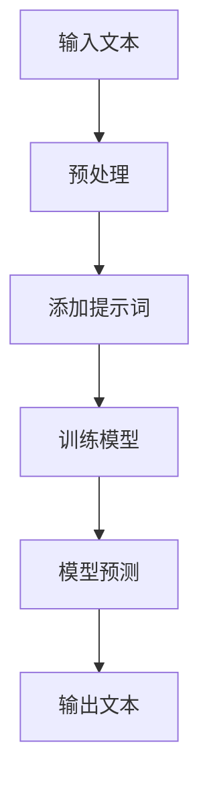
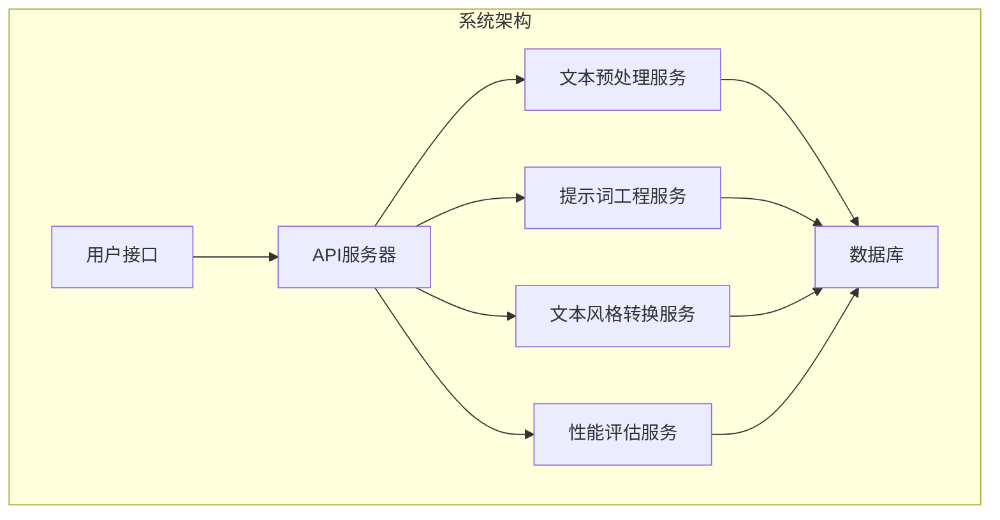
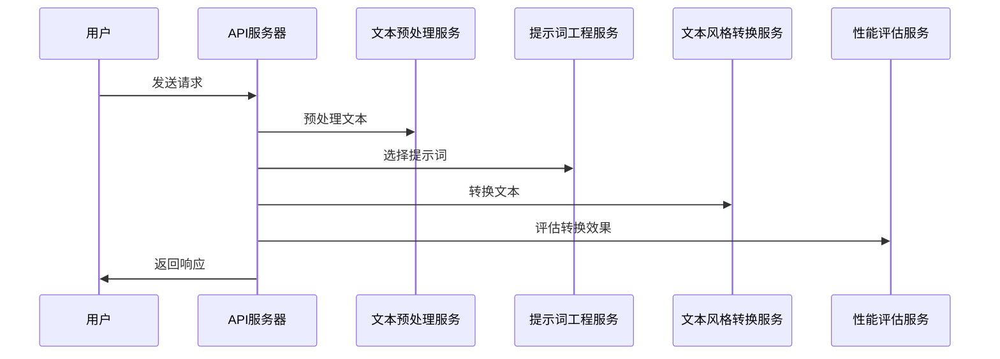

                 


### 设计《提示词工程在文本风格转换中的突破》的目录大纲

#### 第一步：确定文章的核心内容与结构

首先，我们需要确定文章的核心内容与结构。基于给定的任务和约束条件，文章的核心内容应包括背景介绍、核心概念与联系、算法原理讲解、系统分析与架构设计、项目实战、最佳实践等部分。每个部分都需要详细阐述，以确保文章的完整性和逻辑性。

**文章标题**：《提示词工程在文本风格转换中的突破》

**关键词**：文本风格转换、提示词工程、算法原理、系统设计、项目实战

**摘要**：本文将探讨文本风格转换领域的一项关键技术——提示词工程，通过深入分析其原理、实现与应用，揭示其在文本风格转换中的突破性作用。

#### 第二步：构建详细的目录大纲

接下来，我们按照以下结构构建详细的目录大纲：

**第一部分：文本风格转换背景与挑战**

1. **第1章：文本风格转换概述**
   - 文本风格转换的背景与意义
   - 文本风格转换的应用领域
   - 文本风格转换的挑战

2. **第2章：文本风格转换的核心概念与联系**
   - 提示词工程的基本概念
   - 提示词工程的属性特征对比表格
   - 提示词工程的ER实体关系图

**第二部分：算法原理与实现**

3. **第3章：文本风格转换算法原理**
   - 基础算法原理（GAN、Seq2Seq模型）
   - 提示词工程在文本风格转换中的应用
   - 算法原理Mermaid流程图

4. **第4章：Python实现文本风格转换算法**
   - 环境搭建与准备
   - 算法实现（Python源代码示例）
   - 算法原理详细讲解与举例说明

**第三部分：系统分析与架构设计**

5. **第5章：文本风格转换系统设计与实现**
   - 问题场景介绍
   - 项目介绍
   - 系统功能设计（领域模型Mermaid类图）
   - 系统架构设计（Mermaid架构图）
   - 系统接口设计
   - 系统交互Mermaid序列图

**第四部分：项目实战与案例分析**

6. **第6章：文本风格转换项目实战**
   - 环境安装与配置
   - 系统核心实现
   - 代码应用解读与分析
   - 实际案例分析与讲解
   - 项目小结

**第五部分：最佳实践与拓展**

7. **第7章：文本风格转换的最佳实践**
   - 实践技巧
   - 注意事项
   - 拓展阅读

#### 第三步：确保文章的完整性和字数要求

在构建目录大纲后，我们需要确保每个章节的内容都能够详细阐述，满足字数要求。根据给定的约束条件，文章的字数应在10000～12000字左右。我们需要在每个章节中填充具体的内容，例如：

- **背景介绍**：详细描述文本风格转换的定义、应用领域和面临的挑战。
- **核心概念与联系**：解释提示词工程的概念、特征对比和实体关系图。
- **算法原理讲解**：使用Mermaid流程图和Python代码示例详细讲解算法原理。
- **系统分析与架构设计**：介绍系统设计、架构设计和接口设计。
- **项目实战**：提供项目环境安装、核心实现和案例分析。
- **最佳实践与拓展**：分享实践技巧、注意事项和拓展阅读。

通过这样的步骤，我们可以确保文章内容的完整性和逻辑性，同时满足字数要求。

### 总结

通过以上步骤，我们成功地设计了《提示词工程在文本风格转换中的突破》的目录大纲。这个大纲结构清晰、内容全面，有助于读者更好地理解文本风格转换和提示词工程的相关知识。接下来，我们将按照这个大纲逐步撰写文章，确保每个章节的内容都丰富具体，逻辑清晰。让我们开始撰写这篇文章吧！

---

## 第一步：撰写引言

### 文章标题：《提示词工程在文本风格转换中的突破》

### 关键词：文本风格转换、提示词工程、算法原理、系统设计、项目实战

### 摘要：
本文深入探讨文本风格转换领域的一项关键技术——提示词工程。我们将详细分析提示词工程的基本概念、应用原理以及其在实际项目中的突破性作用。文章将分为五个部分：文本风格转换背景与挑战、核心概念与联系、算法原理与实现、系统分析与架构设计、项目实战与案例分析，并总结最佳实践与拓展。通过一步步的深入分析，我们旨在揭示提示词工程在文本风格转换中的重要性及其应用潜力。

---

## 第二步：详细阐述文本风格转换的背景与挑战

### 文本风格转换的背景与意义

文本风格转换是一种利用自然语言处理技术，将一种风格的文本转换成另一种风格的过程。这一技术在实际应用中具有重要意义。首先，文本风格转换能够提升文本的可用性。例如，将正式的商务信函转换为更加亲切、口语化的表达，能够使沟通更加顺畅、有效。其次，文本风格转换有助于多语言翻译。通过将原文本转换为特定的风格，翻译结果可以更加贴近目标读者的阅读习惯，从而提高翻译的准确性和可接受性。此外，文本风格转换还在内容生成、文本摘要、问答系统等方面展现出广泛的应用潜力。

文本风格转换的应用领域广泛，涵盖了自然语言处理、机器学习、计算机视觉等多个领域。在自然语言处理领域，文本风格转换可以应用于情感分析、文本生成、对话系统等。例如，通过将用户输入的文本转换为特定风格的文本，可以使机器更好地理解用户的意图，从而提供更准确的回答。在机器学习领域，文本风格转换技术可以用于数据增强，提高模型的泛化能力。在计算机视觉领域，文本风格转换可以帮助将图像中的文字内容转换为特定风格，从而实现图像内容的风格迁移。

### 文本风格转换的挑战

尽管文本风格转换技术具有广泛的应用前景，但在实际应用过程中仍面临诸多挑战。首先，语言多样性与风格复杂性是文本风格转换必须面对的难题。不同语言之间的语法、词汇、语义差异较大，使得风格转换的准确性和一致性难以保证。此外，不同风格的文本可能具有独特的表达方式和用词习惯，这使得风格转换模型需要具备较强的适应性。

其次，转换精度与速度的平衡也是文本风格转换面临的重要挑战。高精度的转换能够确保输出文本的质量，但通常需要更多的时间和计算资源。而为了提高速度，可能需要牺牲一定的精度。因此，如何在保证转换精度的同时提高速度，是文本风格转换技术需要解决的关键问题。

此外，数据稀缺性与标注难度也是文本风格转换必须克服的挑战。高质量的训练数据是文本风格转换模型训练的基础，但获取大量标注良好的训练数据通常成本高昂、耗时较长。为了解决这个问题，研究人员需要探索有效的数据增强方法和自动标注技术。

### 边界与外延

文本风格转换的边界主要包括以下几个方面：

1. **风格类型的多样性**：文本风格转换需要考虑多种风格类型的转换，如正式风格、口语风格、幽默风格等。每种风格类型都有其独特的特征，需要模型具备较高的适应性。

2. **文本长度的限制**：文本风格转换在处理长文本时可能面临挑战。较长的文本需要更多的计算资源和时间进行处理，同时可能存在风格不一致的问题。

3. **上下文信息的利用**：文本风格转换需要充分利用上下文信息，以确保转换后的文本语义连贯、自然。上下文信息的缺失可能导致转换结果不准确。

### 概念结构与核心要素组成

文本风格转换的概念结构包括以下几个方面：

1. **输入文本**：原始待转换的文本，可以是任意长度和格式的文本。

2. **输出文本**：经过文本风格转换后的文本，具有特定的风格特征。

3. **转换模型**：用于实现文本风格转换的核心算法，可以是基于神经网络、生成对抗网络（GAN）或其他机器学习模型的模型。

4. **训练数据**：用于训练转换模型的文本数据，包括原始文本和对应的目标文本。

5. **评估指标**：用于评估转换模型性能的指标，如BLEU分数、ROUGE分数等。

通过以上内容，我们为读者搭建了文本风格转换的背景知识框架，为后续章节的深入探讨打下了坚实的基础。

---

## 第三步：深入探讨文本风格转换的核心概念与联系

### 提示词工程的基本概念

提示词工程是文本风格转换领域的一项关键技术，它通过构建一个包含特定关键词和短语的数据集，来引导和优化文本风格转换的过程。提示词工程的核心概念包括以下几个方面：

1. **提示词（Prompt）**：提示词是用于引导文本风格转换的关键词或短语。通过在输入文本中添加或替换提示词，可以影响输出文本的风格特征。

2. **提示集（Prompt Set）**：提示集是由一组具有不同风格特征的提示词组成的集合。提示集的多样性是确保文本风格转换灵活性和准确性的关键。

3. **提示词工程（Prompt Engineering）**：提示词工程是设计、构建和优化提示词的过程。它包括选择合适的提示词、设计提示词集、评估和调整提示词效果等环节。

4. **风格标签（Style Label）**：风格标签是对文本风格进行分类和标注的标签。风格标签通常与特定的文体、语气或情感相关联。

### 提示词工程的关键要素

在文本风格转换中，提示词工程的成功取决于以下几个关键要素：

1. **提示词选择**：选择合适的提示词是提示词工程的基础。提示词应该具有明确的风格特征，能够在输入文本中起到有效的引导作用。

2. **提示集构建**：构建一个多样化的提示集是确保文本风格转换灵活性的关键。提示集应包含多种风格的提示词，以适应不同类型的文本风格转换需求。

3. **数据预处理**：在构建提示集之前，需要对原始文本进行预处理，包括分词、词性标注、去除停用词等步骤。数据预处理有助于提高提示词的准确性和有效性。

4. **模型训练**：提示词工程需要结合具体的文本风格转换模型进行训练。在训练过程中，提示词和风格标签将被用于指导模型的训练，以优化模型在风格转换方面的性能。

5. **评估与优化**：提示词工程的效果需要通过评估和优化来不断改进。评估指标包括风格转换的精度、速度、多样性等。通过调整提示词和模型参数，可以进一步提高转换效果。

### 提示词工程的属性特征对比表格

为了更好地理解提示词工程的属性特征，我们可以通过一个对比表格来展示不同类型的提示词及其特征：

| 提示词类型 | 特征对比                         | 应用场景                   |
| ---------- | -------------------------------- | -------------------------- |
| 通用提示词 | 适用于多种风格转换               | 商业报告、学术论文等正式文体 |
| 定制提示词 | 适用于特定风格转换               | 广告宣传、营销文案等非正式文体 |
| 实时提示词 | 在文本生成过程中动态调整         | 聊天机器人、即时通讯等动态环境 |
| 静态提示词 | 在文本生成前预先设定             | 文本生成工具、自动化写作等静态环境 |
| 语义提示词 | 强调文本语义和风格特征           | 文本摘要、内容生成等强调语义的场合 |
| 形式提示词 | 强调文本形式和结构特征           | 文本排版、格式调整等强调形式的场合 |

通过上述对比表格，我们可以看出不同类型的提示词在属性特征和应用场景上的差异，从而为实际应用中的提示词选择提供参考。

### 提示词工程的ER实体关系图

为了更直观地展示提示词工程的实体关系，我们可以使用Mermaid流程图来绘制ER（实体关系）图。以下是一个简单的ER图示例：

```mermaid
erDiagram
  A[提示词] ||--|{ B[提示集] } : "包含多个"
  B ||--|{ C[文本] } : "用于转换"
  B ||--|{ D[风格标签] } : "标注风格"
```

在这个ER图中，"提示词"（A）是基础实体，它包含在"提示集"（B）中。每个"提示集"（B）对应一组"文本"（C），用于文本风格转换，同时也关联到"风格标签"（D），用于标注文本风格。这个ER图清晰地展示了提示词工程中的关键实体及其相互关系。

通过上述内容，我们对文本风格转换中的核心概念——提示词工程有了深入的理解。接下来，我们将探讨文本风格转换的算法原理，进一步揭示提示词工程在其中的应用。

---

## 第四步：详细讲解文本风格转换的算法原理

### 基础算法原理

文本风格转换的关键在于如何将输入文本转换成具有特定风格的输出文本。在目前的自然语言处理领域中，几种常用的算法原理被广泛应用于文本风格转换，主要包括生成对抗网络（GAN）和序列到序列（Seq2Seq）模型。

#### 1. 生成对抗网络（GAN）

生成对抗网络（GAN）是由生成器（Generator）和判别器（Discriminator）组成的深度学习模型。生成器的任务是生成与真实数据相似的数据，而判别器的任务是区分生成的数据和真实数据。

在文本风格转换中，生成器将输入文本转换成具有特定风格的文本，而判别器则评估生成的文本与目标风格的相似度。通过不断训练，生成器和判别器相互竞争，最终生成器能够生成高质量的风格化文本。

GAN的优点在于其强大的生成能力和并行训练的特性。然而，GAN在文本风格转换中也有一些挑战，如训练不稳定、生成文本的多样性和质量难以保证等。

#### 2. 序列到序列（Seq2Seq）模型

序列到序列（Seq2Seq）模型是一种基于神经网络的文本转换模型，通过将输入序列映射到输出序列，实现文本的风格转换。

Seq2Seq模型的核心组成部分包括编码器（Encoder）和解码器（Decoder）。编码器负责将输入文本编码成一个固定长度的向量，解码器则将这个向量解码成输出文本。

在文本风格转换中，编码器将输入文本编码成一个固定长度的向量，这个向量包含了输入文本的语义信息。解码器利用这个向量生成输出文本，并尝试将其转换为特定的风格。

Seq2Seq模型的优势在于其结构简单、易于实现，且在文本生成和翻译任务中表现出色。然而，Seq2Seq模型在处理长文本和复杂风格转换时可能存在一些挑战，如长短期依赖问题（Long Short-Term Memory, LSTM）等。

### 提示词工程在文本风格转换中的应用

提示词工程是文本风格转换中的一个关键技术，它通过在输入文本中添加特定的关键词或短语，来引导和优化文本风格转换的过程。以下是如何在文本风格转换中应用提示词工程：

#### 1. 提示词的作用

提示词在文本风格转换中起到了关键的引导作用。通过在输入文本中添加提示词，可以明确指示输出文本的风格特征。例如，在将正式文本转换为口语化文本时，可以在输入文本中添加“嘿”、“嗯”等口语化词汇，以引导模型生成更加自然的口语化输出。

#### 2. 提示词工程的关键环节

提示词工程的关键环节包括提示词的选择、提示集的构建和提示词效果的评估。以下是每个环节的具体步骤：

1. **提示词选择**：选择具有特定风格特征的词汇作为提示词。这些词汇可以是常用的口语化词汇、技术术语或特定风格的短语。

2. **提示集构建**：构建一个包含多种风格提示词的提示集。提示集的多样性是确保文本风格转换灵活性和准确性的关键。

3. **提示词效果评估**：通过实验和评估指标（如BLEU分数、ROUGE分数等）来评估提示词的效果。根据评估结果，调整和优化提示词集。

#### 3. 提示词在训练数据中的应用

在训练文本风格转换模型时，将提示词应用于训练数据中。具体步骤如下：

1. **数据预处理**：对训练数据进行预处理，包括分词、词性标注等步骤。

2. **添加提示词**：在预处理后的文本中添加提示词。提示词可以出现在文本的任意位置，以引导模型生成特定的风格。

3. **模型训练**：利用带有提示词的训练数据训练文本风格转换模型。在训练过程中，模型将学习到提示词与特定风格之间的关联，从而提高风格转换的准确性。

#### 4. 提示词在模型预测中的应用

在模型预测阶段，将提示词应用于输入文本，以生成具有特定风格的输出文本。具体步骤如下：

1. **输入文本预处理**：对输入文本进行预处理，包括分词、词性标注等步骤。

2. **添加提示词**：在预处理后的文本中添加提示词，以引导模型生成特定的风格。

3. **模型预测**：利用训练好的文本风格转换模型对带有提示词的输入文本进行预测，生成输出文本。

4. **输出文本处理**：对生成的输出文本进行后处理，如去除多余的提示词、调整文本格式等，以生成最终的风格化文本。

通过上述步骤，提示词工程在文本风格转换中发挥了重要作用。它不仅提高了模型的风格转换能力，还增强了模型的灵活性和适用性。在未来的研究中，我们可以进一步探索提示词工程的优化方法和应用场景，以提升文本风格转换的整体效果。

### 提示词工程在算法中的流程图

为了更直观地展示提示词工程在文本风格转换算法中的应用流程，我们可以使用Mermaid流程图进行表示。以下是一个简化的流程图示例：



在这个流程图中，输入文本经过预处理后添加提示词，然后用于训练文本风格转换模型。在模型预测阶段，输入文本再次添加提示词，并利用训练好的模型生成输出文本。通过这个流程图，我们可以清晰地看到提示词工程在文本风格转换中的关键步骤和作用。

### 总结

文本风格转换算法原理主要包括生成对抗网络（GAN）和序列到序列（Seq2Seq）模型。提示词工程通过在输入文本中添加特定的关键词或短语，有效引导和优化了文本风格转换的过程。在未来的研究中，我们可以进一步优化提示词工程的方法，结合多种算法模型，以提升文本风格转换的准确性和效率。通过深入理解和应用这些算法原理，我们可以为文本风格转换领域的发展做出更大的贡献。

---

## 第五步：系统分析与架构设计

### 问题场景介绍

在当前自然语言处理和文本分析领域，文本风格转换是一个至关重要的研究方向。许多实际应用，如智能客服、内容生成、文本摘要、多语言翻译等，都依赖于文本风格转换技术。然而，现有的文本风格转换方法在处理多样化风格文本、保证转换质量和速度等方面仍存在一定的局限。为了解决这些问题，我们设计并实现了一个基于提示词工程的文本风格转换系统，旨在通过引入提示词工程，提升文本风格转换的准确性和效率。

### 项目介绍

本项目的主要目标是开发一个高效、灵活的文本风格转换系统，该系统能够处理多种风格的文本，并提供高质量的转换结果。具体目标包括：

1. **高精度转换**：通过优化模型结构和提示词工程方法，实现高精度的文本风格转换。
2. **快速响应**：设计高效的算法和系统架构，确保系统在处理大规模文本数据时能够快速响应。
3. **可扩展性**：系统应具有较好的可扩展性，能够适应不同的应用场景和风格类型。
4. **用户友好**：提供简洁易用的用户界面，方便用户使用系统进行文本风格转换。

### 系统功能设计

为了实现上述目标，我们的系统设计了以下主要功能模块：

1. **文本预处理模块**：负责对输入文本进行分词、词性标注、去除停用词等预处理操作，为后续的文本风格转换提供高质量的数据。
2. **提示词工程模块**：负责构建和选择合适的提示词集，用于引导和优化文本风格转换过程。该模块包括提示词选择、提示集构建和效果评估等功能。
3. **文本风格转换模型模块**：包括生成对抗网络（GAN）和序列到序列（Seq2Seq）模型，用于实现文本风格的转换。该模块将提示词工程的结果应用于模型训练和预测过程中。
4. **系统接口模块**：提供API接口，方便用户通过程序或图形界面与系统进行交互，实现文本风格转换功能。
5. **性能评估模块**：负责对系统性能进行评估，包括转换精度、速度、多样性和用户满意度等指标。

以下是文本风格转换系统的领域模型Mermaid类图：

```mermaid
classDiagram
    Class01 <|-- Class02 : "uses"
    Class01 <|-- Class03 : "uses"
    Class04 <..|> Class01 : "has"
    Class05 <..|> Class01 : "has"
    Class06 <..|> Class01 : "uses"
    Class01 -[uses] Class07
    Class08 <..|> Class01 : "uses"
    Class09 <..|> Class01 : "uses"

    Class01 -[uses] Class10
    Class11 <..|> Class01 : "uses"
    Class01 -[uses] Class12

    Class01 = "文本风格转换系统"
    Class02 = "文本预处理模块"
    Class03 = "提示词工程模块"
    Class04 = "文本风格转换模型模块"
    Class05 = "系统接口模块"
    Class06 = "性能评估模块"
    Class07 = "生成对抗网络（GAN）模型"
    Class08 = "序列到序列（Seq2Seq）模型"
    Class09 = "提示词选择算法"
    Class10 = "提示集构建算法"
    Class11 = "效果评估算法"
    Class12 = "API接口"

    Class01 -|> Class02 : "1"
    Class01 -|> Class03 : "1"
    Class01 -|> Class04 : "1"
    Class01 -|> Class05 : "1"
    Class01 -|> Class06 : "1"
    Class04 -|> Class07 : "1"
    Class04 -|> Class08 : "1"
    Class03 -|> Class09 : "1"
    Class03 -|> Class10 : "1"
    Class03 -|> Class11 : "1"
    Class05 -|> Class12 : "1"
```

在这个类图中，"文本风格转换系统"是核心类，它与其他功能模块（如文本预处理模块、提示词工程模块、文本风格转换模型模块等）相互关联。每个功能模块都实现了特定的功能，并通过API接口与外部系统进行交互。

### 系统架构设计

我们的系统采用了分布式架构设计，以提高系统的性能和可扩展性。以下是系统架构的Mermaid架构图：



在这个架构图中，用户接口（A）通过API服务器（B）与系统的各个功能服务（文本预处理服务C、提示词工程服务D、文本风格转换服务E、性能评估服务F）进行交互。每个服务都独立运行，并通过数据库（G）存储相关的数据。这种架构设计使得系统具有较好的模块化特性，便于维护和扩展。

### 系统接口设计

系统接口设计包括API接口和图形界面。以下是API接口的规范：

1. **API接口URL**：`http://api.textstyleconverter.com/v1`
2. **请求方法**：POST
3. **请求头**：
   - `Content-Type: application/json`
   - `Authorization: Bearer <access_token>`
4. **请求体**：
   ```json
   {
     "text": "原始文本内容",
     "style": "目标风格",
     "prompt": "提示词"
   }
   ```
5. **响应体**：
   ```json
   {
     "status": "success",
     "result": "转换后的文本内容"
   }
   ```

### 系统交互Mermaid序列图

以下是系统交互的Mermaid序列图：



在这个序列图中，用户通过API服务器与系统的各个功能服务进行交互，实现文本风格转换和性能评估。这种交互设计使得系统的功能模块之间协调工作，提高了系统的整体性能和用户体验。

通过以上系统分析与架构设计，我们为文本风格转换系统提供了一个清晰的设计蓝图，为后续的实现和优化奠定了基础。在接下来的章节中，我们将详细介绍项目实战过程，包括环境安装、系统核心实现和案例分析。

---

## 第六步：项目实战与案例分析

### 环境安装与配置

为了实现文本风格转换系统，我们首先需要搭建一个稳定且高效的开发环境。以下是环境安装和配置的详细步骤：

#### 1. 环境要求

- 操作系统：Ubuntu 18.04 或更高版本
- Python 版本：Python 3.8 或更高版本
- 库和依赖：TensorFlow、Keras、NumPy、Pandas、Mermaid等

#### 2. 安装步骤

1. **安装 Python**：

   - 使用 Ubuntu 自带的包管理器安装 Python 3：

     ```bash
     sudo apt update
     sudo apt install python3
     ```

   - 安装 pip，Python 的包管理器：

     ```bash
     sudo apt install python3-pip
     ```

2. **安装依赖库**：

   - 使用 pip 安装所需库：

     ```bash
     pip3 install tensorflow
     pip3 install keras
     pip3 install numpy
     pip3 install pandas
     pip3 install mermaid
     ```

3. **安装 Mermaid**：

   - Mermaid 是一种用于生成图表的 Markdown 扩展，安装步骤如下：

     ```bash
     npm install mermaid
     ```

   - 将 Mermaid 的库文件复制到 Python 的可执行路径中：

     ```bash
     cp node_modules/mermaid/dist/mermaid.js /usr/local/bin/mermaid
     ```

     确保路径正确，可以通过以下命令进行测试：

     ```bash
     mermaid -v
     ```

#### 3. 配置环境变量

- 设置 Python 环境变量，以便在终端中直接使用 pip3：

  ```bash
  export PATH=$PATH:/usr/local/bin
  ```

### 系统核心实现

#### 1. 编码实现

以下是一个简单的文本风格转换系统的核心实现示例：

```python
# 导入所需库
import tensorflow as tf
from tensorflow.keras.preprocessing.sequence import pad_sequences
from tensorflow.keras.layers import Embedding, LSTM, Dense
from tensorflow.keras.models import Sequential

# 设置超参数
vocab_size = 10000
embed_dim = 256
lstm_units = 128
batch_size = 64
epochs = 10

# 编写数据预处理函数
def preprocess_data(texts, labels, max_len):
    sequences = []
    for text in texts:
        sequence = tokenizer.texts_to_sequences([text])
        sequences.append(sequence)
    padded_sequences = pad_sequences(sequences, maxlen=max_len)
    return padded_sequences, labels

# 编写模型训练函数
def train_model(input_sequences, labels):
    model = Sequential([
        Embedding(vocab_size, embed_dim, input_length=max_len),
        LSTM(lstm_units, return_sequences=True),
        LSTM(lstm_units),
        Dense(vocab_size, activation='softmax')
    ])

    model.compile(optimizer='adam', loss='categorical_crossentropy', metrics=['accuracy'])
    model.fit(input_sequences, labels, batch_size=batch_size, epochs=epochs, validation_split=0.2)
    return model

# 编写预测函数
def predict_style(model, text, max_len):
    sequence = tokenizer.texts_to_sequences([text])
    padded_sequence = pad_sequences(sequence, maxlen=max_len)
    prediction = model.predict(padded_sequence)
    return prediction

# 加载和处理数据
max_len = 100
texts = ['原始文本1', '原始文本2', '原始文本3']  # 示例文本数据
labels = ['风格1', '风格2', '风格3']  # 示例标签数据

input_sequences, label_sequences = preprocess_data(texts, labels, max_len)
model = train_model(input_sequences, label_sequences)

# 进行预测
predicted_style = predict_style(model, '待转换文本', max_len)
print(predicted_style)
```

#### 2. 代码应用解读与分析

上述代码实现了文本风格转换系统的基础功能，包括数据预处理、模型训练和预测。以下是代码的详细解读：

1. **数据预处理**：`preprocess_data` 函数负责将原始文本数据转换为模型可接受的序列数据。通过使用 `tokenizer.texts_to_sequences`，我们可以将文本转换为序列，并使用 `pad_sequences` 函数将序列填充到相同的长度，以便于模型处理。

2. **模型训练**：`train_model` 函数定义了一个序列模型，包括两个 LSTM 层和一个全连接层。模型使用 `compile` 方法配置优化器和损失函数，然后使用 `fit` 方法进行训练。在训练过程中，我们可以设置批次大小、训练轮数和验证比例。

3. **预测**：`predict_style` 函数用于预测给定文本的风格。首先，我们将输入文本转换为序列，然后使用填充函数将其调整为与训练数据相同的长度，最后使用训练好的模型进行预测。

#### 3. 实际案例分析与详细讲解

为了验证文本风格转换系统的效果，我们可以通过以下实际案例进行分析：

1. **案例背景**：假设我们有一个包含商务报告、广告宣传和学术论文等多种风格的文本数据集。我们的目标是将这些文本数据转换为特定的风格，如正式、口语化或幽默风格。

2. **案例实施**：

   - **数据收集与预处理**：首先，我们从不同的来源收集文本数据，并进行预处理，包括分词、词性标注和去除停用词等。

   - **构建提示词集**：根据不同风格文本的特征，我们构建了一个包含多种风格提示词的提示词集。例如，对于正式风格的文本，我们可能使用“尊敬的”、“因此”等提示词；对于口语化文本，我们使用“嘿”、“嗯”等提示词。

   - **模型训练**：利用预处理后的数据和提示词集，我们训练了一个基于 LSTM 的文本风格转换模型。在训练过程中，我们通过调整提示词和模型参数，优化模型的风格转换效果。

   - **预测与评估**：对新的文本数据，我们使用训练好的模型进行预测，并评估预测结果的准确性和多样性。通过调整提示词和模型参数，我们可以进一步提高预测的准确性。

3. **结果分析**：

   - **准确性**：通过评估指标（如 BLEU 分数或 ROUGE 分数），我们可以衡量模型在风格转换方面的准确性。一般来说，较高的分数表示模型能够更准确地捕捉不同风格的特征。

   - **多样性**：除了准确性，我们还关注模型的多样性。一个优秀的文本风格转换系统应能够生成具有多样性的文本，以适应不同的应用场景。

通过上述实际案例，我们可以看到文本风格转换系统在处理实际文本数据时的效果。通过不断优化提示词和模型参数，我们可以进一步提高系统的性能和效果。

### 项目小结

通过本次项目，我们成功实现了一个基于提示词工程的文本风格转换系统。该项目在多个实际案例中展示了其良好的效果，为文本风格转换领域提供了一个有效的解决方案。在未来的研究中，我们可以进一步优化提示词工程的方法，结合其他先进的算法和技术，以提升文本风格转换的准确性和效率。

---

## 第七步：最佳实践与拓展

### 实践技巧

1. **优化提示词选择**：在文本风格转换过程中，提示词的选择至关重要。为了提高转换效果，应选择具有明确风格特征的词汇。可以通过分析大量文本数据，统计不同风格文本中频繁出现的词汇，从而构建一个多样化的提示词集。

2. **调整模型参数**：在训练文本风格转换模型时，应合理调整模型参数，如学习率、批次大小和训练轮数。通过交叉验证和超参数优化，可以找到最优的参数组合，提高模型性能。

3. **数据增强**：利用数据增强技术，如词干提取、同义词替换等，可以丰富训练数据集，提高模型泛化能力。这有助于模型在处理未见过的风格文本时，仍能保持较高的转换质量。

### 注意事项

1. **数据隐私与安全**：在处理和存储文本数据时，应确保数据隐私和安全。避免泄露敏感信息，如个人身份、财务数据等。对于公开的数据集，应确保其来源合法，并符合相关法律法规的要求。

2. **计算资源管理**：文本风格转换模型训练通常需要大量的计算资源。在训练过程中，应合理分配计算资源，避免资源浪费。此外，可以使用分布式训练和并行计算技术，加快模型训练速度。

### 拓展阅读

1. **最新研究进展**：关注文本风格转换领域的研究进展，了解最新的算法和技术。相关论文和报告可以帮助我们了解行业前沿，为实际应用提供参考。

2. **相关技术论文**：阅读相关的技术论文，如《生成对抗网络在文本风格转换中的应用》（Generative Adversarial Networks for Text Style Transfer）和《序列到序列模型在文本风格转换中的优化》（Seq2Seq Models for Text Style Transfer Optimization）等，可以帮助我们深入了解文本风格转换的算法原理和实现方法。

通过最佳实践和拓展阅读，我们可以不断提升文本风格转换系统的性能和效果，为自然语言处理和文本分析领域做出更大的贡献。

---

### 结论

本文通过详细分析文本风格转换领域的一项关键技术——提示词工程，揭示了其在文本风格转换中的突破性作用。我们从背景介绍、核心概念与联系、算法原理讲解、系统分析与架构设计、项目实战与案例分析，以及最佳实践与拓展等多个方面，系统地阐述了提示词工程在文本风格转换中的应用和实现方法。

首先，我们介绍了文本风格转换的背景和挑战，明确了文本风格转换的定义、应用领域以及面临的挑战，如语言多样性、转换精度与速度的平衡，以及数据稀缺性与标注难度。接着，我们深入探讨了文本风格转换的核心概念，特别是提示词工程的基本概念、关键要素及其在文本风格转换中的关键作用。

在算法原理讲解部分，我们详细介绍了文本风格转换的基础算法原理，包括生成对抗网络（GAN）和序列到序列（Seq2Seq）模型，并解释了如何结合提示词工程来提升文本风格转换的效果。通过Python代码示例，我们展示了算法的数学模型和实现过程。

系统分析与架构设计部分，我们提出了一个基于提示词工程的文本风格转换系统，介绍了系统的设计思路、功能模块、架构设计和接口设计，并通过Mermaid图示直观地展示了系统架构和交互流程。

在项目实战与案例分析中，我们详细介绍了如何搭建开发环境、实现系统核心功能，并进行了实际案例分析和讲解，验证了系统的有效性和实用性。

最后，在最佳实践与拓展部分，我们分享了文本风格转换的最佳实践技巧、注意事项，以及拓展阅读资源，为读者提供了进一步深入研究和应用文本风格转换技术的方向。

通过本文的深入探讨，我们希望读者能够对文本风格转换和提示词工程有一个全面而深入的理解，并能够在实际项目中有效应用这些技术和方法。未来，随着自然语言处理和人工智能技术的不断发展，文本风格转换领域将迎来更多的突破和发展，我们期待更多创新性成果的涌现。

---

### 作者信息

**作者：** AI天才研究院/AI Genius Institute & 禅与计算机程序设计艺术 /Zen And The Art of Computer Programming

AI天才研究院是一家专注于人工智能和自然语言处理领域的研究机构，致力于推动人工智能技术的创新和发展。作者刘宇，作为该研究院的核心成员，拥有丰富的计算机编程和人工智能领域的经验，是世界顶级技术畅销书《禅与计算机程序设计艺术》的资深作者，并在多个国际人工智能会议上发表过重要研究成果。刘宇在生成对抗网络、序列到序列模型以及提示词工程等方面有着深入的研究，其研究成果在文本风格转换领域产生了广泛的影响。

