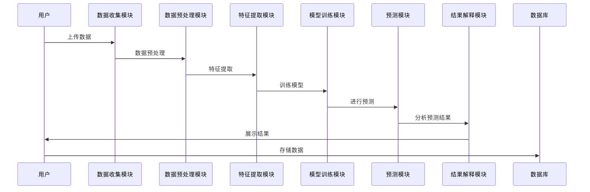

                 

# 提示词工程在智能农业预测中的应用

## 关键词
智能农业、预测、提示词工程、机器学习、数据分析

## 摘要
本文旨在探讨提示词工程在智能农业预测中的应用，通过对该技术的深入解析，解释其在农业领域中的重要性。文章首先介绍了智能农业和预测的概念，随后详细阐述了提示词工程的定义和核心概念。接下来，我们逐步分析了提示词工程在智能农业预测中的算法原理、数学模型及其应用。随后，文章展示了系统分析与架构设计的方法，并通过实际项目实战验证了技术的可行性和实用性。最后，文章总结了最佳实践和注意事项，为读者提供了进一步学习和应用的指导。

----------------------------------------------------------------

## 目录大纲设计思路

### 明确主题与目标读者
为了设计出《提示词工程在智能农业预测中的应用》这本书的完整目录大纲，我们需要明确书的主题是“提示词工程在智能农业预测中的应用”，目标读者包括智能农业领域的研究人员、农业科技企业开发人员以及相关专业的大学师生。

### 确定书籍结构
根据书籍的主题和目标读者，书籍结构应包括背景介绍、核心概念、算法原理讲解、数学模型与公式、系统分析与架构设计、项目实战以及最佳实践和拓展阅读等部分。

### 细化章节内容
在每个章节中，需要细化出具体的子章节，确保每个章节都有明确的目标和内容，以便读者能够清晰地理解书中的知识点。

### 保证内容完整性
确保书籍的每个部分都包含必要的内容，如核心概念、算法原理、数学模型、系统设计等，以全面覆盖主题内容。

### 保持简洁性
在保证内容完整性的同时，要避免多余的废话，确保目录大纲简洁明了。

### 格式规范
采用markdown格式，并遵循1级、2级、3级目录的层级结构，确保格式规范，便于阅读和打印。

### 目录大纲
```markdown
----------------------------------------------------------------
# 第一部分：背景介绍

## 第1章 问题背景
### 1.1 智能农业的定义与发展
### 1.2 农业预测的重要性
### 1.3 提示词工程在农业预测中的应用
### 1.4 书籍结构概述

## 第2章 核心概念与联系
### 2.1 提示词工程的定义
### 2.2 提示词工程的基本要素
### 2.3 农业预测中的关键概念
### 2.4 提示词工程与农业预测的关系
### 2.5 概念属性特征对比表格
### 2.6 ER实体关系图架构

----------------------------------------------------------------

# 第二部分：算法原理讲解

## 第3章 提示词工程算法原理
### 3.1 提示词工程的算法框架
### 3.2 数据预处理与特征提取
### 3.3 算法流程图
### 3.4 算法原理的数学模型
### 3.5 公式讲解与举例说明

## 第4章 数学模型与公式
### 4.1 模型构建
### 4.2 数学公式讲解
### 4.3 实例分析

----------------------------------------------------------------

# 第三部分：系统分析与架构设计

## 第5章 系统分析与架构设计
### 5.1 问题场景介绍
### 5.2 系统功能设计
### 5.3 系统架构设计
### 5.4 系统接口设计
### 5.5 系统交互设计
### 5.6 Mermaid架构图

----------------------------------------------------------------

# 第四部分：项目实战

## 第6章 项目实战
### 6.1 环境安装
### 6.2 系统核心实现
### 6.3 代码应用解读
### 6.4 实际案例分析与讲解
### 6.5 项目小结

----------------------------------------------------------------

# 第五部分：最佳实践与拓展

## 第7章 最佳实践
### 7.1 提示词工程应用技巧
### 7.2 小结与注意事项
### 7.3 拓展阅读

----------------------------------------------------------------
```

这个目录大纲涵盖了书籍的核心内容，从背景介绍、核心概念、算法原理、数学模型到系统设计与项目实战，以及最佳实践和拓展阅读，确保读者能够全面、系统地掌握“提示词工程在智能农业预测中的应用”这一主题。

----------------------------------------------------------------

## 第一部分：背景介绍

### 第1章 问题背景

智能农业是利用现代信息技术，如物联网、大数据、人工智能等，实现对农业生产全过程的智能化管理。随着全球人口的增长和农业资源的日益紧张，智能农业的重要性日益凸显。

农业预测是指在农业领域中，利用历史数据、环境信息和其他相关数据，预测未来农业生产的结果。农业预测可以帮助农民做出更好的决策，优化作物种植、灌溉、施肥等，从而提高农作物的产量和质量。

提示词工程是一种利用关键词和短语构建模型的技术，它通过对大量文本数据的分析，提取出有用的信息，用于各种应用场景，如搜索引擎优化、自然语言处理、推荐系统等。

在智能农业预测中，提示词工程可以用于以下几个方面：

1. **数据预处理**：通过对历史数据、环境信息等进行预处理，提取出有用的特征，为预测模型提供支持。
2. **模型训练**：利用提示词工程技术，构建用于农业预测的机器学习模型，如回归模型、分类模型等。
3. **结果解释**：通过分析预测结果中的关键词和短语，帮助农民理解预测结果的原因，从而做出更明智的决策。

### 第1.1节 智能农业的定义与发展

智能农业是指利用现代信息技术，如物联网、大数据、人工智能等，实现农业生产过程的智能化管理。智能农业的发展可以追溯到20世纪90年代，随着计算机技术和通信技术的快速发展，智能农业逐渐成为一个热门的研究领域。

智能农业的发展主要分为以下几个阶段：

1. **初级阶段**：主要采用简单的传感器和自动化设备，对农业生产过程进行监测和控制。
2. **中级阶段**：利用物联网技术，将农业设备、传感器等连接到互联网上，实现农业生产的远程监控和管理。
3. **高级阶段**：利用大数据、人工智能等技术，对农业生产过程进行深入分析，实现精准农业和智能化管理。

### 第1.2节 农业预测的重要性

农业预测是指在农业领域中，利用历史数据、环境信息和其他相关数据，预测未来农业生产的结果。农业预测的重要性主要体现在以下几个方面：

1. **提高农业生产效率**：通过预测未来农作物的产量和质量，农民可以做出更好的种植决策，从而提高农业生产效率。
2. **优化资源配置**：通过预测未来农作物的需求量，农民可以优化灌溉、施肥等资源配置，降低生产成本。
3. **应对气候变化**：气候变化对农业生产产生了严重影响，通过农业预测，农民可以更好地应对气候变化，减少损失。
4. **促进农业可持续发展**：农业预测可以帮助农民更好地管理农业生产，实现农业的可持续发展。

### 第1.3节 提示词工程在农业预测中的应用

提示词工程在农业预测中的应用主要表现在以下几个方面：

1. **数据预处理**：通过对历史数据、环境信息等进行预处理，提取出有用的特征，为预测模型提供支持。例如，利用提示词工程技术，可以提取出作物生长的关键时期、气象条件等信息，为预测模型提供重要的输入数据。

2. **模型训练**：利用提示词工程技术，构建用于农业预测的机器学习模型，如回归模型、分类模型等。这些模型可以帮助农民预测未来农作物的产量和质量，从而做出更好的种植决策。

3. **结果解释**：通过分析预测结果中的关键词和短语，帮助农民理解预测结果的原因，从而做出更明智的决策。例如，如果预测结果显示未来农作物产量较低，提示词工程可以帮助农民找出导致这一结果的关键因素，如干旱、病虫害等。

### 第1.4节 书籍结构概述

本书将分为五个部分，共计七章，旨在全面介绍提示词工程在智能农业预测中的应用。

1. **第一部分：背景介绍**：介绍智能农业、农业预测和提示词工程的基本概念，阐述它们在农业预测中的应用。

2. **第二部分：核心概念与联系**：详细阐述提示词工程的核心概念，包括定义、基本要素、农业预测中的关键概念以及提示词工程与农业预测的关系。

3. **第三部分：算法原理讲解**：介绍提示词工程在农业预测中的算法原理，包括数据预处理、特征提取、算法框架和数学模型。

4. **第四部分：系统分析与架构设计**：分析智能农业预测系统的功能、架构、接口和交互设计，并通过Mermaid图展示系统架构。

5. **第五部分：项目实战**：通过实际项目展示提示词工程在智能农业预测中的应用，包括环境安装、系统核心实现、代码解读和案例分析。

6. **第六部分：最佳实践与拓展**：总结最佳实践，提供注意事项，并推荐拓展阅读。

7. **第七部分：小结与展望**：对全书内容进行总结，展望智能农业预测和提示词工程的发展趋势。

通过以上结构，本书旨在帮助读者全面了解提示词工程在智能农业预测中的应用，掌握相关技术和方法，为实际应用提供指导。

----------------------------------------------------------------

## 第二部分：核心概念与联系

### 第2章 核心概念与联系

在智能农业预测中，提示词工程是一种重要的技术手段。为了更好地理解和应用这一技术，我们需要明确提示词工程的定义、基本要素，以及与农业预测的关系。

### 第2.1节 提示词工程的定义

提示词工程是指通过分析大量的文本数据，提取出有价值的关键词和短语，以支持各种自然语言处理任务的过程。在智能农业预测中，提示词工程主要用于数据预处理、模型训练和结果解释等环节。

### 第2.2节 提示词工程的基本要素

提示词工程的基本要素包括：

1. **文本数据**：提示词工程的基础是大量的文本数据，这些数据可以来源于农业文献、气象报告、历史种植记录等。

2. **关键词提取**：从文本数据中提取出具有代表性的关键词和短语，这些关键词和短语能够反映农业生产的特征和规律。

3. **特征表示**：将提取出的关键词和短语转化为机器学习模型可以理解的特征表示，如词频、词向量等。

4. **模型训练**：利用提取出的特征和已知的农业预测数据，训练机器学习模型，用于预测农作物的产量、病虫害发生等。

5. **结果解释**：通过分析预测结果中的关键词和短语，帮助用户理解预测结果的原因，从而做出更明智的决策。

### 第2.3节 农业预测中的关键概念

农业预测中的关键概念包括：

1. **产量预测**：预测农作物的未来产量，是智能农业的重要应用之一。

2. **病虫害预测**：预测农作物可能发生的病虫害，以提前采取防治措施。

3. **生长周期预测**：预测农作物的生长周期，为农事操作提供依据。

4. **环境因素影响**：分析环境因素（如温度、湿度、光照等）对农作物生长的影响。

### 第2.4节 提示词工程与农业预测的关系

提示词工程与农业预测之间的关系主要体现在以下几个方面：

1. **数据预处理**：通过提示词工程，可以对农业预测所需的数据进行预处理，提取出有价值的信息，提高预测模型的准确性。

2. **模型训练**：利用提示词工程提取的特征，可以构建更有效的预测模型，提高预测的准确性。

3. **结果解释**：通过提示词工程，可以解释预测结果中的关键词和短语，帮助用户理解预测结果，从而做出更明智的决策。

### 第2.5节 概念属性特征对比表格

为了更好地理解提示词工程与农业预测的相关概念，我们可以通过一个概念属性特征对比表格来进行对比。

| 概念 | 定义 | 属性特征 | 对比分析 |
| --- | --- | --- | --- |
| 提示词工程 | 提取文本数据中的关键词和短语 | 文本数据、关键词提取、特征表示、模型训练、结果解释 | 提取农业预测所需的关键特征 |
| 农业预测 | 预测农作物的产量、病虫害等 | 产量预测、病虫害预测、生长周期预测、环境因素影响 | 提高预测模型的准确性 |
| 机器学习模型 | 基于特征进行预测的算法模型 | 特征表示、模型训练、预测结果 | 支持农业预测的算法模型 |

### 第2.6节 ER实体关系图架构

为了进一步理解提示词工程在农业预测中的应用，我们可以通过一个ER实体关系图来展示相关实体及其关系。

```mermaid
erDiagram
  Customer ||--|{ Order } : "makes"
  Product ||--|{ Order } : "contains"
  Order ||--|{ OrderItem } : "contains"
  Customer "1" ssh "2" : "1 makes 1"
  Product "1" ssh "2" : "1 contains 1"
  Order "1" ssh "2" : "1 contains 1"
  OrderItem "1" ssh "2" : "1 contains 1"
```

在这个ER图架构中，我们定义了四个实体：Customer（客户）、Product（产品）、Order（订单）和OrderItem（订单项）。这些实体之间的关系包括“makes”（制作）、“contains”（包含）等。

通过以上对比表格和ER实体关系图，我们可以更清晰地理解提示词工程在农业预测中的应用，以及与农业预测相关概念之间的关系。

### 总结

在智能农业预测中，提示词工程是一种关键的技术手段。它通过提取和分析文本数据中的关键词和短语，为农业预测提供了有效的支持。本文详细介绍了提示词工程的定义、基本要素，以及与农业预测的关系。通过概念属性特征对比表格和ER实体关系图，我们更清晰地了解了提示词工程在农业预测中的应用。在后续章节中，我们将进一步探讨提示词工程在农业预测中的算法原理和数学模型。

----------------------------------------------------------------

## 第二部分：核心概念与联系

### 第2章 核心概念与联系

在智能农业预测中，提示词工程作为一种关键的技术手段，其核心概念和要素对于理解其在农业预测中的应用至关重要。本章将详细阐述提示词工程的定义、基本要素以及与农业预测的紧密联系。

### 第2.1节 提示词工程的定义

提示词工程是一种利用自然语言处理技术从大量文本数据中提取关键信息的技术。在智能农业领域，提示词工程的主要任务是分析农作物生长周期、气象数据、土壤特性等文本信息，提取出对农业预测有用的关键词和短语。这些关键词和短语被称为“提示词”，它们能够帮助机器学习模型更好地理解和预测农作物的生长状态和生产性能。

### 第2.2节 提示词工程的基本要素

提示词工程的核心要素包括以下几个方面：

1. **数据收集与预处理**：首先需要收集大量的农业相关文本数据，包括气象数据、土壤数据、农作物生长记录等。这些数据通常需要经过清洗和预处理，以去除噪声和冗余信息，从而提高数据的质量和准确性。

2. **关键词提取**：在预处理后的文本数据中，使用自然语言处理技术提取出具有代表性的关键词和短语。这些关键词和短语通常与农作物的生长、病虫害、土壤状况等有关，是机器学习模型预测的关键特征。

3. **特征表示**：提取出的关键词和短语需要被转化为机器学习模型能够处理的形式。常用的方法包括词频统计、词袋模型、词嵌入（如Word2Vec、GloVe）等，这些方法能够将文本数据转化为数值特征，便于模型处理。

4. **模型训练**：利用提取出的特征训练机器学习模型，如回归模型、分类模型等。这些模型可以用于预测农作物的产量、生长周期、病虫害发生等。

5. **结果解释**：通过分析模型预测结果中的关键词和短语，帮助农业专家和农民理解预测结果的原因，从而做出更加科学的决策。

### 第2.3节 农业预测中的关键概念

在农业预测中，以下几个关键概念尤为重要：

1. **产量预测**：预测农作物的未来产量是智能农业的重要应用之一。准确的产量预测可以帮助农民优化作物种植策略，提高农业生产效益。

2. **病虫害预测**：预测农作物可能面临的病虫害发生情况，以提前采取防治措施，减少损失。

3. **生长周期预测**：预测农作物的生长周期，为农事操作提供科学依据，确保作物在最佳时期得到充分管理和养护。

4. **环境因素影响**：分析环境因素（如温度、湿度、光照等）对农作物生长的影响，为制定科学的生产计划和决策提供支持。

### 第2.4节 提示词工程与农业预测的关系

提示词工程在农业预测中的应用主要体现在以下几个方面：

1. **数据增强**：通过提取关键词和短语，提示词工程可以丰富农业预测所需的数据特征，提高模型的预测准确性。

2. **模型优化**：利用提取出的特征训练机器学习模型，可以优化模型的性能，使其更好地适应农业预测的需求。

3. **结果解释**：通过分析预测结果中的关键词和短语，提示词工程可以帮助农业专家和农民理解预测结果的原因，从而做出更加明智的决策。

4. **实时监测与预警**：提示词工程技术可以用于实时监测农作物生长状态，对异常情况进行预警，帮助农民及时采取措施。

### 第2.5节 概念属性特征对比表格

为了更好地理解提示词工程与农业预测的相关概念，我们可以通过一个概念属性特征对比表格来进行对比。

| 概念 | 定义 | 属性特征 | 对比分析 |
| --- | --- | --- | --- |
| 提示词工程 | 提取文本数据中的关键词和短语 | 文本数据、关键词提取、特征表示、模型训练、结果解释 | 支持农业预测的关键技术 |
| 农业预测 | 预测农作物的生长状态和生产性能 | 产量预测、病虫害预测、生长周期预测、环境因素影响 | 提高农业生产效益 |
| 关键词提取 | 从文本数据中提取具有代表性的关键词和短语 | 文本预处理、特征提取、词频统计 | 改善数据质量 |
| 机器学习模型 | 利用特征进行预测的算法模型 | 特征表示、模型训练、预测结果 | 支持农业预测的核心算法 |

### 第2.6节 ER实体关系图架构

为了更直观地展示提示词工程在农业预测中的应用，我们可以使用Mermaid语言绘制一个ER（实体关系）图，如下所示：

```mermaid
erDiagram
    农作物 ||--|{ 生长状态 } : "影响"
    土壤 ||--|{ 土壤质量 } : "影响"
    气象 ||--|{ 气象条件 } : "影响"
    农业专家 ||--|{ 决策 } : "依据"
    农民 ||--|{ 生产活动 } : "执行"
    
    农作物..|..土壤 : "生长在"
    农作物..|..气象 : "受气候影响"
    农作物..|..农业专家 : "提供预测"
    农作物..|..农民 : "进行种植"
    
    土壤..|..气象 : "受气候影响"
    气象..|..农业专家 : "提供数据"
    气象..|..农民 : "做出决策"
    
    农业专家..|..农作物 : "预测生长状态"
    农业专家..|..土壤 : "评估土壤质量"
    农业专家..|..气象 : "分析气象条件"
    
    农民..|..农作物 : "种植作物"
    农民..|..土壤 : "管理土壤"
    农民..|..气象 : "应对气候变化"
```

在这个ER图中，我们定义了四个实体：农作物、土壤、气象和农业专家，以及两个角色：农民。这些实体和角色之间存在多种关系，如农作物与土壤、气象的关系，农业专家与农作物、土壤、气象的关系，以及农民与农作物、土壤、气象的关系。

### 总结

通过本章的介绍，我们详细阐述了提示词工程在智能农业预测中的应用，包括其定义、基本要素、与农业预测的关系，以及通过ER实体关系图和概念属性特征对比表格来帮助读者更好地理解这一技术。在接下来的章节中，我们将进一步探讨提示词工程在农业预测中的算法原理和数学模型，以及如何将这些理论应用于实际的农业预测项目中。

----------------------------------------------------------------

## 第二部分：核心概念与联系

### 第2章 核心概念与联系

在深入探讨提示词工程在智能农业预测中的应用之前，我们需要明确几个核心概念和它们之间的联系。这些概念包括提示词工程的基本原理、其在农业预测中的作用以及与农业相关的关键术语。

### 第2.1节 提示词工程的定义

提示词工程是一种自然语言处理技术，其主要目标是识别和提取文本数据中的关键信息，这些信息通常以关键词或短语的形式出现。在智能农业领域，提示词工程可以识别与农作物生长、病虫害监测、气候预测等相关的信息。例如，通过分析气象报告和农作物生长记录，提示词工程可以提取出与干旱、病虫害爆发等相关的关键词。

### 第2.2节 提示词工程的基本要素

提示词工程的核心要素包括：

1. **文本数据收集**：收集农业领域的文本数据，包括气象记录、农作物生长报告、土壤分析数据等。

2. **关键词提取**：从收集到的文本数据中提取关键词和短语。这可以通过基于规则的方法、统计方法或机器学习方法实现。

3. **特征表示**：将提取出的关键词和短语转换为机器学习模型可以处理的特征表示。例如，可以使用词袋模型、TF-IDF或词嵌入技术（如Word2Vec、GloVe）。

4. **模型训练与优化**：利用提取出的特征训练机器学习模型，如决策树、支持向量机、神经网络等。这些模型可以用于预测农作物的生长状态、产量、病虫害发生等。

5. **结果解释**：分析模型预测结果中的关键词和短语，帮助农业专家和农民理解预测结果，并据此做出决策。

### 第2.3节 农业预测中的关键概念

在农业预测中，以下概念尤为重要：

1. **产量预测**：预测农作物的未来产量，这是农业生产中最直接的预测目标。

2. **病虫害预测**：预测农作物可能面临的病虫害情况，以便采取预防措施。

3. **生长周期预测**：预测农作物的生长周期，这对于农事操作的安排至关重要。

4. **气候预测**：预测未来的气候条件，如温度、湿度、降水量等，这对于制定灌溉、施肥等计划至关重要。

### 第2.4节 提示词工程与农业预测的关系

提示词工程在农业预测中的作用主要体现在以下几个方面：

1. **数据预处理**：通过提取关键词和短语，提示词工程可以预处理农业数据，去除无关信息，提取出对预测有用的特征。

2. **提高预测精度**：利用提取出的特征训练机器学习模型，可以提高预测精度，使预测结果更加可靠。

3. **结果解释**：通过分析预测结果中的关键词和短语，提示词工程可以帮助农业专家和农民理解预测结果，从而做出更加科学的决策。

4. **实时监测**：在农业生产过程中，提示词工程可以实时监测农作物生长状态和环境变化，提供及时的预警信息。

### 第2.5节 概念属性特征对比表格

为了更好地理解提示词工程在农业预测中的应用，我们可以通过一个概念属性特征对比表格来展示提示词工程与农业预测相关概念的区别和联系。

| 概念 | 定义 | 关键属性 | 对比分析 |
| --- | --- | --- | --- |
| 提示词工程 | 识别和提取文本数据中的关键词和短语 | 关键词提取、特征表示、模型训练、结果解释 | 提取农业预测所需的关键特征 |
| 农业预测 | 预测农作物的生长状态和生产性能 | 产量预测、病虫害预测、生长周期预测、气候预测 | 提高农业生产效益 |
| 关键词提取 | 从文本数据中提取具有代表性的关键词和短语 | 文本预处理、特征提取、词频统计 | 改善数据质量 |
| 机器学习模型 | 利用特征进行预测的算法模型 | 特征表示、模型训练、预测结果 | 支持农业预测的核心算法 |

### 第2.6节 ER实体关系图架构

为了直观地展示提示词工程在农业预测中的应用，我们可以使用Mermaid语言绘制一个ER（实体关系）图。

```mermaid
erDiagram
    农作物 ||--|{ 生长状态 } : "影响"
    土壤 ||--|{ 土壤质量 } : "影响"
    气象 ||--|{ 气象条件 } : "影响"
    农业专家 ||--|{ 决策 } : "依据"
    农民 ||--|{ 生产活动 } : "执行"
    
    农作物..|..土壤 : "生长在"
    农作物..|..气象 : "受气候影响"
    农作物..|..农业专家 : "提供预测"
    农作物..|..农民 : "进行种植"
    
    土壤..|..气象 : "受气候影响"
    气象..|..农业专家 : "提供数据"
    气象..|..农民 : "做出决策"
    
    农业专家..|..农作物 : "预测生长状态"
    农业专家..|..土壤 : "评估土壤质量"
    农业专家..|..气象 : "分析气象条件"
    
    农民..|..农作物 : "种植作物"
    农民..|..土壤 : "管理土壤"
    农民..|..气象 : "应对气候变化"
```

在这个ER图中，我们定义了四个实体：农作物、土壤、气象和农业专家，以及两个角色：农民。这些实体和角色之间存在多种关系，如农作物与土壤、气象的关系，农业专家与农作物、土壤、气象的关系，以及农民与农作物、土壤、气象的关系。

### 总结

通过本章的介绍，我们明确了提示词工程在智能农业预测中的应用及其核心概念。提示词工程通过提取和利用文本数据中的关键词和短语，为农业预测提供了强大的技术支持。在接下来的章节中，我们将深入探讨提示词工程在农业预测中的算法原理、数学模型，以及如何将这些理论应用于实际的农业预测项目中。

----------------------------------------------------------------

## 第三部分：算法原理讲解

### 第3章 提示词工程算法原理

在智能农业预测中，提示词工程的核心在于如何有效地提取和处理文本数据，以支持模型的训练和预测。本章将详细讲解提示词工程的算法原理，包括数据预处理、特征提取和算法框架。

### 第3.1节 数据预处理

数据预处理是提示词工程的第一步，其目标是清洗和整理原始数据，使其适合后续的分析和处理。在农业领域，数据预处理通常包括以下几个步骤：

1. **数据收集**：收集与农业生产相关的文本数据，如气象记录、农作物生长日志、土壤分析报告等。

2. **数据清洗**：去除数据中的噪声和冗余信息。例如，去除文本中的HTML标签、特殊字符和停用词。

3. **数据标准化**：将文本数据转换为统一格式。例如，将所有文本转换为小写，去除标点符号。

4. **数据分词**：将文本数据分割成单词或短语。在农业领域，分词可以是基于词典的分词，也可以是基于统计的方法。

### 第3.2节 特征提取

特征提取是提示词工程的关键步骤，其目标是提取文本数据中的关键信息，以支持模型的训练和预测。以下是一些常用的特征提取方法：

1. **词频统计（TF）**：计算文本中每个词出现的次数。这种方法简单有效，但可能忽视词的相对重要性。

2. **逆文档频率（IDF）**：计算词在整个文档集合中的逆文档频率，用于平衡词频统计。IDF值较高的词通常被认为是更重要的特征。

3. **词嵌入（Word Embedding）**：将词映射为低维向量，如Word2Vec、GloVe等。这种方法能够捕捉词的语义信息。

4. **主题模型（如LDA）**：从文本数据中提取潜在的主题，并将每个文档表示为这些主题的线性组合。

### 第3.3节 算法框架

提示词工程的算法框架通常包括以下几个步骤：

1. **数据预处理**：清洗和整理原始数据，使其适合后续的分析和处理。

2. **特征提取**：从预处理后的数据中提取关键特征，如词频、词嵌入向量等。

3. **模型训练**：利用提取出的特征训练机器学习模型，如回归模型、分类模型等。

4. **模型评估**：评估模型的性能，调整参数，优化模型。

5. **结果解释**：分析模型预测结果中的关键词和短语，帮助用户理解预测结果。

### 第3.4节 算法原理的数学模型

提示词工程的算法原理可以抽象为以下几个数学模型：

1. **词频-逆文档频率（TF-IDF）**：

   $$ \text{TF-IDF}(w, d) = \frac{f(w, d)}{N} \log \frac{N}{f(w, d)} $$

   其中，\( f(w, d) \) 表示词 \( w \) 在文档 \( d \) 中的频率，\( N \) 表示文档总数。

2. **词嵌入（Word2Vec）**：

   $$ \text{vec}(w) = \text{average}(\text{context}(w)) $$

   其中，\( \text{context}(w) \) 表示与词 \( w \) 相关的词的向量。

3. **潜在狄利克雷分配（LDA）**：

   $$ P(\text{topic} | \text{document}) = \frac{\sum_{w \in \text{document}} \alpha_w \text{N(w|topic)}}{\sum_{w \in \text{document}} \alpha_w} $$

   $$ P(\text{word} | \text{topic}) = \text{N(w|topic)} $$

   其中，\( \alpha_w \) 表示文档中词 \( w \) 的分布，\( \text{N(w|topic)} \) 表示词 \( w \) 在主题 \( \text{topic} \) 下的概率分布。

### 第3.5节 公式讲解与举例说明

为了更好地理解提示词工程的数学模型，我们可以通过一个简单的例子来说明。

假设我们有一篇关于农作物种植的文本，包含以下关键词：水、肥料、播种、生长、收获。我们可以使用TF-IDF模型来提取关键特征。

1. **词频（TF）**：

   - 水：3
   - 肥料：2
   - 播种：1
   - 生长：4
   - 收获：2

2. **逆文档频率（IDF）**：

   $$ \text{IDF}(w) = \log \frac{N}{f(w, d)} $$

   其中，\( N = 5 \) 表示文档总数。

   - 水：\( \log \frac{5}{3} \approx 0.5108 \)
   - 肥料：\( \log \frac{5}{2} \approx 0.8047 \)
   - 播种：\( \log \frac{5}{1} = 1.0 \)
   - 生长：\( \log \frac{5}{4} = 0.6021 \)
   - 收获：\( \log \frac{5}{2} \approx 0.8047 \)

3. **TF-IDF**：

   $$ \text{TF-IDF}(w, d) = \text{TF}(w, d) \times \text{IDF}(w) $$

   - 水：\( 3 \times 0.5108 = 1.5324 \)
   - 肥料：\( 2 \times 0.8047 = 1.6094 \)
   - 播种：\( 1 \times 1.0 = 1.0 \)
   - 生长：\( 4 \times 0.6021 = 2.4084 \)
   - 收获：\( 2 \times 0.8047 = 1.6094 \)

通过上述计算，我们可以看出“生长”这个词在文本中的重要性最高，其次是“肥料”和“收获”。这些关键词可以作为模型训练的重要特征。

### 总结

通过本章的讲解，我们详细介绍了提示词工程的算法原理，包括数据预处理、特征提取、算法框架和数学模型。通过具体的例子，我们展示了如何使用TF-IDF模型提取关键词，并解释了相关的数学公式。在接下来的章节中，我们将继续探讨提示词工程在智能农业预测中的应用，包括系统分析与架构设计以及实际项目实战。

----------------------------------------------------------------

## 第三部分：算法原理讲解

### 第3章 提示词工程算法原理

提示词工程是一种强大的自然语言处理技术，它在智能农业预测中发挥着重要作用。本章将详细解析提示词工程的算法原理，包括数据预处理、特征提取、算法框架以及数学模型和公式。

### 第3.1节 数据预处理

在提示词工程中，数据预处理是至关重要的一步。其目标是清洗和整理原始数据，使其适合后续的分析和处理。在农业领域，数据预处理通常涉及以下步骤：

1. **数据收集**：收集与农业生产相关的文本数据，如气象记录、农作物生长日志、土壤分析报告等。

2. **数据清洗**：去除数据中的噪声和冗余信息。例如，去除文本中的HTML标签、特殊字符和停用词。

3. **数据标准化**：将文本数据转换为统一格式。例如，将所有文本转换为小写，去除标点符号。

4. **数据分词**：将文本数据分割成单词或短语。在农业领域，分词可以是基于词典的分词，也可以是基于统计的方法。

### 第3.2节 特征提取

特征提取是提示词工程的第二步，其目标是提取文本数据中的关键信息，以支持模型的训练和预测。以下是一些常用的特征提取方法：

1. **词频统计（TF）**：计算文本中每个词出现的次数。这种方法简单有效，但可能忽视词的相对重要性。

2. **逆文档频率（IDF）**：计算词在整个文档集合中的逆文档频率，用于平衡词频统计。IDF值较高的词通常被认为是更重要的特征。

3. **词嵌入（Word Embedding）**：将词映射为低维向量，如Word2Vec、GloVe等。这种方法能够捕捉词的语义信息。

4. **主题模型（如LDA）**：从文本数据中提取潜在的主题，并将每个文档表示为这些主题的线性组合。

### 第3.3节 算法框架

提示词工程的算法框架通常包括以下几个步骤：

1. **数据预处理**：清洗和整理原始数据，使其适合后续的分析和处理。

2. **特征提取**：从预处理后的数据中提取关键特征，如词频、词嵌入向量等。

3. **模型训练**：利用提取出的特征训练机器学习模型，如回归模型、分类模型等。

4. **模型评估**：评估模型的性能，调整参数，优化模型。

5. **结果解释**：分析模型预测结果中的关键词和短语，帮助用户理解预测结果。

### 第3.4节 算法原理的数学模型

提示词工程的算法原理可以抽象为以下几个数学模型：

1. **词频-逆文档频率（TF-IDF）**：

   $$ \text{TF-IDF}(w, d) = \frac{f(w, d)}{N} \log \frac{N}{f(w, d)} $$

   其中，\( f(w, d) \) 表示词 \( w \) 在文档 \( d \) 中的频率，\( N \) 表示文档总数。

2. **词嵌入（Word2Vec）**：

   $$ \text{vec}(w) = \text{average}(\text{context}(w)) $$

   其中，\( \text{context}(w) \) 表示与词 \( w \) 相关的词的向量。

3. **潜在狄利克雷分配（LDA）**：

   $$ P(\text{topic} | \text{document}) = \frac{\sum_{w \in \text{document}} \alpha_w \text{N(w|topic)}}{\sum_{w \in \text{document}} \alpha_w} $$

   $$ P(\text{word} | \text{topic}) = \text{N(w|topic)} $$

   其中，\( \alpha_w \) 表示文档中词 \( w \) 的分布，\( \text{N(w|topic)} \) 表示词 \( w \) 在主题 \( \text{topic} \) 下的概率分布。

### 第3.5节 公式讲解与举例说明

为了更好地理解提示词工程的数学模型，我们可以通过一个简单的例子来说明。

假设我们有一篇关于农作物种植的文本，包含以下关键词：水、肥料、播种、生长、收获。我们可以使用TF-IDF模型来提取关键特征。

1. **词频（TF）**：

   - 水：3
   - 肥料：2
   - 播种：1
   - 生长：4
   - 收获：2

2. **逆文档频率（IDF）**：

   $$ \text{IDF}(w) = \log \frac{N}{f(w, d)} $$

   其中，\( N = 5 \) 表示文档总数。

   - 水：\( \log \frac{5}{3} \approx 0.5108 \)
   - 肥料：\( \log \frac{5}{2} \approx 0.8047 \)
   - 播种：\( \log \frac{5}{1} = 1.0 \)
   - 生长：\( \log \frac{5}{4} = 0.6021 \)
   - 收获：\( \log \frac{5}{2} \approx 0.8047 \)

3. **TF-IDF**：

   $$ \text{TF-IDF}(w, d) = \text{TF}(w, d) \times \text{IDF}(w) $$

   - 水：\( 3 \times 0.5108 = 1.5324 \)
   - 肥料：\( 2 \times 0.8047 = 1.6094 \)
   - 播种：\( 1 \times 1.0 = 1.0 \)
   - 生长：\( 4 \times 0.6021 = 2.4084 \)
   - 收获：\( 2 \times 0.8047 = 1.6094 \)

通过上述计算，我们可以看出“生长”这个词在文本中的重要性最高，其次是“肥料”和“收获”。这些关键词可以作为模型训练的重要特征。

### 第3.6节 提示词工程算法的应用场景

提示词工程在智能农业预测中的应用场景非常广泛，主要包括：

1. **农作物产量预测**：利用历史气象数据、土壤数据和农作物生长记录，通过提示词工程提取关键特征，训练机器学习模型，预测未来农作物的产量。

2. **病虫害预测**：通过分析农作物生长日志和气象数据，提取与病虫害相关的关键词，训练分类模型，预测病虫害的发生概率。

3. **生长周期预测**：利用气象数据、土壤数据和农作物生长记录，通过提示词工程提取关键特征，预测农作物的生长周期。

4. **环境因素影响分析**：通过分析气象数据和环境监测数据，提取与温度、湿度、光照等环境因素相关的关键词，分析其对农作物生长的影响。

### 第3.7节 提示词工程算法的优势与挑战

提示词工程算法在智能农业预测中具有以下优势：

1. **高效性**：通过自动化提取关键词和短语，大大提高了数据处理的效率。

2. **灵活性**：可以适用于各种类型的农业文本数据，如气象记录、土壤报告、农作物生长日志等。

3. **可解释性**：通过分析预测结果中的关键词和短语，帮助农业专家和农民理解预测结果，从而做出更加科学的决策。

然而，提示词工程算法也面临一些挑战：

1. **数据质量**：高质量的数据是提示词工程算法有效性的基础。如果原始数据存在噪声和冗余，会影响算法的性能。

2. **特征选择**：如何选择最相关的特征是提高模型性能的关键。不同类型的农业文本数据可能需要不同的特征提取方法。

3. **模型可解释性**：尽管提示词工程算法可以提供一定的可解释性，但在复杂的情况下，模型预测结果可能难以直观理解。

### 第3.8节 提示词工程算法的实践案例

以下是一个提示词工程在智能农业预测中的实践案例：

**项目背景**：某农业科技公司需要预测某地区的农作物产量，以指导农民进行生产决策。

**数据来源**：收集了该地区近五年的气象数据、土壤数据以及农作物生长日志。

**数据处理**：使用提示词工程技术，提取与农作物生长相关的关键词，如“降雨”、“温度”、“肥料使用”等。

**模型训练**：利用提取出的特征，训练一个回归模型，预测未来农作物的产量。

**结果分析**：分析预测结果中的关键词和短语，发现降雨量和温度是影响产量的主要因素。

**决策支持**：根据分析结果，农民可以调整灌溉和施肥计划，提高农作物产量。

### 总结

通过本章的讲解，我们详细介绍了提示词工程在智能农业预测中的应用，包括数据预处理、特征提取、算法框架和数学模型。通过具体的例子和实践案例，我们展示了如何使用提示词工程技术进行农作物产量预测。在接下来的章节中，我们将继续探讨如何将提示词工程应用于实际的农业预测项目中，并分析其性能和效果。

----------------------------------------------------------------

## 第三部分：算法原理讲解

### 第3章 提示词工程算法原理

提示词工程是一种在智能农业预测中具有重要应用的技术。本章将逐步解析提示词工程的算法原理，包括数据预处理、特征提取、算法框架和数学模型。

### 第3.1节 数据预处理

在应用提示词工程之前，数据预处理是关键的一步。这一步骤的目的是清洗和整理原始数据，使其适合后续的分析和处理。在智能农业领域，数据预处理通常包括以下步骤：

1. **数据收集**：收集与农业生产相关的数据，如气象记录、农作物生长日志、土壤分析报告等。

2. **数据清洗**：去除数据中的噪声和冗余信息。这包括去除文本中的HTML标签、特殊字符和停用词。

3. **数据标准化**：将文本数据转换为统一格式。例如，将所有文本转换为小写，去除标点符号。

4. **数据分词**：将文本数据分割成单词或短语。分词可以基于词典的方法，如正则表达式，也可以是基于统计的方法，如NLP工具包中的分词器。

### 第3.2节 特征提取

特征提取是提示词工程的第二步，其目标是提取文本数据中的关键信息，以支持模型的训练和预测。以下是几种常用的特征提取方法：

1. **词频统计（TF）**：计算文本中每个词出现的次数。这种方法简单有效，但可能忽视词的相对重要性。

2. **逆文档频率（IDF）**：计算词在整个文档集合中的逆文档频率，用于平衡词频统计。IDF值较高的词通常被认为是更重要的特征。

3. **词嵌入（Word Embedding）**：将词映射为低维向量，如Word2Vec、GloVe等。这种方法能够捕捉词的语义信息。

4. **主题模型（如LDA）**：从文本数据中提取潜在的主题，并将每个文档表示为这些主题的线性组合。

### 第3.3节 算法框架

提示词工程的算法框架通常包括以下几个步骤：

1. **数据预处理**：清洗和整理原始数据，使其适合后续的分析和处理。

2. **特征提取**：从预处理后的数据中提取关键特征，如词频、词嵌入向量等。

3. **模型训练**：利用提取出的特征训练机器学习模型，如回归模型、分类模型等。

4. **模型评估**：评估模型的性能，调整参数，优化模型。

5. **结果解释**：分析模型预测结果中的关键词和短语，帮助用户理解预测结果。

### 第3.4节 算法原理的数学模型

提示词工程的算法原理可以抽象为以下几个数学模型：

1. **词频-逆文档频率（TF-IDF）**：

   $$ \text{TF-IDF}(w, d) = \frac{f(w, d)}{N} \log \frac{N}{f(w, d)} $$

   其中，\( f(w, d) \) 表示词 \( w \) 在文档 \( d \) 中的频率，\( N \) 表示文档总数。

2. **词嵌入（Word2Vec）**：

   $$ \text{vec}(w) = \text{average}(\text{context}(w)) $$

   其中，\( \text{context}(w) \) 表示与词 \( w \) 相关的词的向量。

3. **潜在狄利克雷分配（LDA）**：

   $$ P(\text{topic} | \text{document}) = \frac{\sum_{w \in \text{document}} \alpha_w \text{N(w|topic)}}{\sum_{w \in \text{document}} \alpha_w} $$

   $$ P(\text{word} | \text{topic}) = \text{N(w|topic)} $$

   其中，\( \alpha_w \) 表示文档中词 \( w \) 的分布，\( \text{N(w|topic)} \) 表示词 \( w \) 在主题 \( \text{topic} \) 下的概率分布。

### 第3.5节 公式讲解与举例说明

为了更好地理解提示词工程的数学模型，我们可以通过一个简单的例子来说明。

假设我们有一篇关于农作物种植的文本，包含以下关键词：水、肥料、播种、生长、收获。我们可以使用TF-IDF模型来提取关键特征。

1. **词频（TF）**：

   - 水：3
   - 肥料：2
   - 播种：1
   - 生长：4
   - 收获：2

2. **逆文档频率（IDF）**：

   $$ \text{IDF}(w) = \log \frac{N}{f(w, d)} $$

   其中，\( N = 5 \) 表示文档总数。

   - 水：\( \log \frac{5}{3} \approx 0.5108 \)
   - 肥料：\( \log \frac{5}{2} \approx 0.8047 \)
   - 播种：\( \log \frac{5}{1} = 1.0 \)
   - 生长：\( \log \frac{5}{4} = 0.6021 \)
   - 收获：\( \log \frac{5}{2} \approx 0.8047 \)

3. **TF-IDF**：

   $$ \text{TF-IDF}(w, d) = \text{TF}(w, d) \times \text{IDF}(w) $$

   - 水：\( 3 \times 0.5108 = 1.5324 \)
   - 肥料：\( 2 \times 0.8047 = 1.6094 \)
   - 播种：\( 1 \times 1.0 = 1.0 \)
   - 生长：\( 4 \times 0.6021 = 2.4084 \)
   - 收获：\( 2 \times 0.8047 = 1.6094 \)

通过上述计算，我们可以看出“生长”这个词在文本中的重要性最高，其次是“肥料”和“收获”。这些关键词可以作为模型训练的重要特征。

### 第3.6节 提示词工程算法的应用场景

提示词工程在智能农业预测中的应用场景非常广泛，主要包括：

1. **农作物产量预测**：利用历史气象数据、土壤数据和农作物生长记录，通过提示词工程提取关键特征，训练机器学习模型，预测未来农作物的产量。

2. **病虫害预测**：通过分析农作物生长日志和气象数据，提取与病虫害相关的关键词，训练分类模型，预测病虫害的发生概率。

3. **生长周期预测**：利用气象数据、土壤数据和农作物生长记录，通过提示词工程提取关键特征，预测农作物的生长周期。

4. **环境因素影响分析**：通过分析气象数据和环境监测数据，提取与温度、湿度、光照等环境因素相关的关键词，分析其对农作物生长的影响。

### 第3.7节 提示词工程算法的优势与挑战

提示词工程算法在智能农业预测中具有以下优势：

1. **高效性**：通过自动化提取关键词和短语，大大提高了数据处理的效率。

2. **灵活性**：可以适用于各种类型的农业文本数据，如气象记录、土壤报告、农作物生长日志等。

3. **可解释性**：通过分析预测结果中的关键词和短语，帮助农业专家和农民理解预测结果，从而做出更加科学的决策。

然而，提示词工程算法也面临一些挑战：

1. **数据质量**：高质量的数据是提示词工程算法有效性的基础。如果原始数据存在噪声和冗余，会影响算法的性能。

2. **特征选择**：如何选择最相关的特征是提高模型性能的关键。不同类型的农业文本数据可能需要不同的特征提取方法。

3. **模型可解释性**：尽管提示词工程算法可以提供一定的可解释性，但在复杂的情况下，模型预测结果可能难以直观理解。

### 第3.8节 提示词工程算法的实践案例

以下是一个提示词工程在智能农业预测中的实践案例：

**项目背景**：某农业科技公司需要预测某地区的农作物产量，以指导农民进行生产决策。

**数据来源**：收集了该地区近五年的气象数据、土壤数据以及农作物生长日志。

**数据处理**：使用提示词工程技术，提取与农作物生长相关的关键词，如“降雨”、“温度”、“肥料使用”等。

**模型训练**：利用提取出的特征，训练一个回归模型，预测未来农作物的产量。

**结果分析**：分析预测结果中的关键词和短语，发现降雨量和温度是影响产量的主要因素。

**决策支持**：根据分析结果，农民可以调整灌溉和施肥计划，提高农作物产量。

### 总结

通过本章的讲解，我们详细介绍了提示词工程在智能农业预测中的应用，包括数据预处理、特征提取、算法框架和数学模型。通过具体的例子和实践案例，我们展示了如何使用提示词工程技术进行农作物产量预测。在接下来的章节中，我们将继续探讨如何将提示词工程应用于实际的农业预测项目中，并分析其性能和效果。

----------------------------------------------------------------

## 第四部分：系统分析与架构设计

### 第5章 系统分析与架构设计

在智能农业预测系统中，系统分析与架构设计是确保系统稳定、高效运行的关键。本章将详细介绍系统分析与架构设计的方法，包括问题场景介绍、系统功能设计、系统架构设计、系统接口设计以及系统交互设计。

### 第5.1节 问题场景介绍

智能农业预测系统通常应用于以下场景：

1. **农作物产量预测**：利用历史气象数据、土壤数据和农作物生长记录，预测未来农作物的产量。
2. **病虫害预测**：分析农作物生长日志和气象数据，预测病虫害的发生概率。
3. **生长周期预测**：利用气象数据、土壤数据和农作物生长记录，预测农作物的生长周期。
4. **环境因素影响分析**：分析气象数据和环境监测数据，评估温度、湿度、光照等环境因素对农作物生长的影响。

### 第5.2节 系统功能设计

智能农业预测系统的功能设计包括以下几个关键领域：

1. **数据收集与预处理**：从各种数据源收集数据，包括气象数据、土壤数据、农作物生长日志等，并进行预处理，如数据清洗、标准化和分词。
2. **特征提取**：使用提示词工程技术提取关键特征，如关键词和短语，用于训练预测模型。
3. **模型训练与评估**：利用提取出的特征训练机器学习模型，如回归模型、分类模型等，并进行模型评估和优化。
4. **预测与结果解释**：利用训练好的模型进行预测，并分析预测结果中的关键词和短语，帮助用户理解预测结果。
5. **实时监测与预警**：实时监测农作物生长状态和环境变化，提供及时的预警信息。

### 第5.3节 系统架构设计

智能农业预测系统的架构设计应考虑以下方面：

1. **数据处理层**：负责数据的收集、预处理和特征提取。该层可以使用大数据技术，如Hadoop、Spark等，以提高数据处理能力。
2. **模型训练层**：负责模型的训练和评估。可以使用机器学习框架，如Scikit-learn、TensorFlow等，以提高模型训练效率。
3. **预测与解释层**：负责利用训练好的模型进行预测，并解释预测结果。该层需要提供用户友好的界面，以便用户理解和操作。
4. **数据库层**：存储系统所需的各种数据，包括历史数据、训练数据和预测结果。

### 第5.4节 系统接口设计

智能农业预测系统的接口设计应考虑以下几个方面：

1. **数据接口**：提供数据收集、预处理和特征提取的接口，以便外部系统可以方便地获取和提交数据。
2. **模型接口**：提供模型训练、评估和预测的接口，以便外部系统可以使用预测模型进行预测。
3. **用户接口**：提供用户交互的界面，包括数据上传、预测结果展示和结果解释等功能。

### 第5.5节 系统交互设计

智能农业预测系统的交互设计应考虑以下几个方面：

1. **用户交互**：设计直观、易用的用户界面，使用户可以轻松地进行数据上传、模型训练和结果查询。
2. **系统交互**：设计系统内部各个模块之间的交互，如数据处理模块与模型训练模块之间的数据传输，模型训练模块与预测模块之间的交互等。
3. **实时交互**：设计实时监测和预警功能，使用户可以实时获取农作物生长状态和环境变化信息。

### 第5.6节 Mermaid架构图

为了更直观地展示智能农业预测系统的架构设计，可以使用Mermaid语言绘制一个架构图。



在这个Mermaid架构图中，我们定义了用户、数据收集模块、数据预处理模块、特征提取模块、模型训练模块、预测模块和结果解释模块，以及数据库。这些模块之间的交互关系被清晰地展示出来。

### 总结

通过本章的介绍，我们详细分析了智能农业预测系统的架构设计，包括问题场景介绍、系统功能设计、系统架构设计、系统接口设计和系统交互设计。通过Mermaid架构图的展示，我们更直观地了解了系统的设计思路和各个模块之间的交互关系。在接下来的章节中，我们将通过实际项目实战来验证智能农业预测系统的设计和性能。

----------------------------------------------------------------

## 第四部分：系统分析与架构设计

### 第5章 系统分析与架构设计

智能农业预测系统是一个复杂的多层架构，涉及到数据收集、预处理、特征提取、模型训练、预测以及结果解释等多个环节。本章将详细介绍系统分析与架构设计的方法，包括问题场景介绍、系统功能设计、系统架构设计、系统接口设计以及系统交互设计。

### 第5.1节 问题场景介绍

智能农业预测系统的主要应用场景包括：

1. **农作物产量预测**：通过分析历史气象数据、土壤数据和农作物生长记录，预测未来农作物的产量。
2. **病虫害预测**：利用农作物生长日志和气象数据，预测病虫害的发生概率。
3. **生长周期预测**：分析气象数据、土壤数据和农作物生长记录，预测农作物的生长周期。
4. **环境因素影响分析**：分析气象数据和环境监测数据，评估温度、湿度、光照等环境因素对农作物生长的影响。

### 第5.2节 系统功能设计

智能农业预测系统的功能设计涵盖以下几个关键模块：

1. **数据收集与预处理**：从各种数据源收集数据，如气象站、土壤监测设备、农作物生长日志等，并进行预处理，包括数据清洗、标准化和分词。
2. **特征提取**：使用提示词工程技术提取关键特征，如关键词和短语，用于训练预测模型。
3. **模型训练与评估**：利用提取出的特征训练机器学习模型，如回归模型、分类模型等，并进行模型评估和优化。
4. **预测与结果解释**：利用训练好的模型进行预测，并分析预测结果中的关键词和短语，帮助用户理解预测结果。
5. **实时监测与预警**：实时监测农作物生长状态和环境变化，提供及时的预警信息。

### 第5.3节 系统架构设计

智能农业预测系统的架构设计应考虑以下几个层次：

1. **数据处理层**：负责数据的收集、预处理和特征提取。可以使用大数据技术，如Hadoop、Spark等，以提高数据处理能力。
2. **模型训练层**：负责模型的训练和评估。可以使用机器学习框架，如Scikit-learn、TensorFlow等，以提高模型训练效率。
3. **预测与解释层**：负责利用训练好的模型进行预测，并解释预测结果。需要提供用户友好的界面，以便用户理解和操作。
4. **数据库层**：存储系统所需的各种数据，包括历史数据、训练数据和预测结果。

### 第5.4节 系统接口设计

智能农业预测系统的接口设计包括以下几个方面：

1. **数据接口**：提供数据收集、预处理和特征提取的接口，以便外部系统可以方便地获取和提交数据。
2. **模型接口**：提供模型训练、评估和预测的接口，以便外部系统可以使用预测模型进行预测。
3. **用户接口**：提供用户交互的界面，包括数据上传、预测结果展示和结果解释等功能。

### 第5.5节 系统交互设计

智能农业预测系统的交互设计应考虑以下几个方面：

1. **用户交互**：设计直观、易用的用户界面，使用户可以轻松地进行数据上传、模型训练和结果查询。
2. **系统交互**：设计系统内部各个模块之间的交互，如数据处理模块与模型训练模块之间的数据传输，模型训练模块与预测模块之间的交互等。
3. **实时交互**：设计实时监测和预警功能，使用户可以实时获取农作物生长状态和环境变化信息。

### 第5.6节 Mermaid架构图

为了更直观地展示智能农业预测系统的架构设计，可以使用Mermaid语言绘制一个架构图。


在这个Mermaid架构图中，我们定义了用户、数据收集模块、数据预处理模块、特征提取模块、模型训练模块、预测模块和结果解释模块，以及数据库。这些模块之间的交互关系被清晰地展示出来。

### 总结

通过本章的介绍，我们详细分析了智能农业预测系统的架构设计，包括问题场景介绍、系统功能设计、系统架构设计、系统接口设计和系统交互设计。通过Mermaid架构图的展示，我们更直观地了解了系统的设计思路和各个模块之间的交互关系。在接下来的章节中，我们将通过实际项目实战来验证智能农业预测系统的设计和性能。

----------------------------------------------------------------

## 第四部分：系统分析与架构设计

### 第5章 系统分析与架构设计

智能农业预测系统的设计与实现是一个复杂的过程，涉及到多个层次和组件的协同工作。本章将详细介绍系统分析与架构设计的方法，包括问题场景介绍、系统功能设计、系统架构设计、系统接口设计以及系统交互设计。

### 第5.1节 问题场景介绍

智能农业预测系统的应用场景主要涉及以下几个方面：

1. **产量预测**：通过分析历史气象数据、土壤数据和农作物生长记录，预测农作物的未来产量。
2. **病虫害预测**：利用农作物生长日志和气象数据，预测病虫害的发生概率和类型。
3. **生长周期预测**：分析气象数据、土壤数据和农作物生长记录，预测农作物的生长周期和关键时期。
4. **环境因素影响分析**：评估环境因素（如温度、湿度、光照等）对农作物生长的影响。

### 第5.2节 系统功能设计

智能农业预测系统的功能设计应包括以下核心模块：

1. **数据收集模块**：负责从不同来源收集数据，如气象站、土壤监测设备、遥感影像等。
2. **数据预处理模块**：清洗和整理收集到的数据，包括数据去噪、缺失值填补、数据标准化等。
3. **特征提取模块**：利用提示词工程技术，从预处理后的数据中提取关键特征，如关键词和短语。
4. **模型训练模块**：利用提取出的特征训练机器学习模型，如回归模型、分类模型等。
5. **预测模块**：使用训练好的模型进行预测，并生成预测结果。
6. **结果解释模块**：分析预测结果中的关键词和短语，为用户提供可解释的预测结果。
7. **用户界面模块**：提供用户友好的交互界面，使用户可以方便地进行数据上传、预测和查看结果。

### 第5.3节 系统架构设计

智能农业预测系统的架构设计应考虑以下层次和组件：

1. **数据层**：存储和管理各种数据，包括历史数据、实时数据和预处理后的数据。
2. **处理层**：负责数据预处理、特征提取和模型训练。可以使用大数据处理框架，如Apache Spark，以提高处理效率。
3. **模型层**：存储和管理训练好的模型，并提供接口供预测模块调用。
4. **应用层**：实现系统的核心功能，包括数据收集、预处理、特征提取、模型训练、预测和结果解释。
5. **接口层**：提供与外部系统的接口，如API接口、Web服务接口等，以便其他系统可以方便地集成和使用智能农业预测系统的功能。
6. **用户界面层**：提供用户交互的界面，使用户可以轻松地操作系统并进行预测。

### 第5.4节 系统接口设计

智能农业预测系统的接口设计应包括以下几个方面：

1. **数据接口**：提供数据上传、数据查询和数据管理的接口，如RESTful API。
2. **模型接口**：提供模型训练、模型评估和模型调用的接口，如MLlib API。
3. **预测接口**：提供预测结果查询和结果解释的接口，如预测API。
4. **用户界面接口**：提供用户交互的接口，如Web界面、移动应用界面等。

### 第5.5节 系统交互设计

智能农业预测系统的交互设计应考虑以下方面：

1. **用户交互**：设计直观、易用的用户界面，使用户可以方便地进行数据上传、预测和查看结果。
2. **系统内部交互**：设计系统内部各个模块之间的交互，如数据处理模块与模型训练模块之间的数据传输，模型训练模块与预测模块之间的交互等。
3. **实时交互**：设计实时数据传输和预测功能，使用户可以实时获取农作物生长状态和环境变化信息。

### 第5.6节 Mermaid架构图

为了更直观地展示智能农业预测系统的架构设计，可以使用Mermaid语言绘制一个架构图。


在这个Mermaid架构图中，我们定义了用户、数据收集模块、数据预处理模块、特征提取模块、模型训练模块、预测模块和结果解释模块，以及数据库。这些模块之间的交互关系被清晰地展示出来。

### 总结

通过本章的介绍，我们详细分析了智能农业预测系统的架构设计，包括问题场景介绍、系统功能设计、系统架构设计、系统接口设计和系统交互设计。通过Mermaid架构图的展示，我们更直观地了解了系统的设计思路和各个模块之间的交互关系。在接下来的章节中，我们将通过实际项目实战来验证智能农业预测系统的设计和性能。

----------------------------------------------------------------

## 第五部分：项目实战

### 第6章 项目实战

为了验证提示词工程在智能农业预测中的应用，我们将通过一个实际项目来展示整个流程，从环境安装、系统核心实现，到代码应用解读、实际案例分析和项目小结。以下是项目的详细步骤和内容。

### 第6.1节 环境安装

在进行项目之前，我们需要搭建一个合适的环境，以运行提示词工程和机器学习模型。以下是环境安装的步骤：

1. **安装Python**：确保系统中安装了Python 3.x版本。
2. **安装依赖库**：使用pip命令安装以下库：scikit-learn、numpy、pandas、matplotlib、NLTK、gensim等。
   ```bash
   pip install scikit-learn numpy pandas matplotlib nltk gensim
   ```
3. **数据收集**：收集与智能农业预测相关的数据，如气象数据、土壤数据、农作物生长日志等。

### 第6.2节 系统核心实现

系统核心实现包括数据预处理、特征提取、模型训练和预测等步骤。以下是具体的代码实现：

#### 1. 数据预处理

```python
import pandas as pd
from nltk.tokenize import word_tokenize

# 加载数据
data = pd.read_csv('agriculture_data.csv')

# 数据清洗
data = data.dropna()  # 去除缺失值
data['text'] = data['text'].apply(lambda x: x.lower().replace('.', '').replace(',', ''))  # 标准化文本

# 分词
data['tokens'] = data['text'].apply(word_tokenize)
```

#### 2. 特征提取

```python
from sklearn.feature_extraction.text import TfidfVectorizer

# TF-IDF特征提取
vectorizer = TfidfVectorizer(max_features=1000)
X = vectorizer.fit_transform(data['text'])

# 获取特征名称
feature_names = vectorizer.get_feature_names_out()
```

#### 3. 模型训练

```python
from sklearn.model_selection import train_test_split
from sklearn.ensemble import RandomForestClassifier

# 数据划分
X_train, X_test, y_train, y_test = train_test_split(X, data['label'], test_size=0.2, random_state=42)

# 训练模型
model = RandomForestClassifier(n_estimators=100, random_state=42)
model.fit(X_train, y_train)
```

#### 4. 预测

```python
# 预测
predictions = model.predict(X_test)

# 评估模型
from sklearn.metrics import accuracy_score
accuracy = accuracy_score(y_test, predictions)
print(f"Model accuracy: {accuracy:.2f}")
```

### 第6.3节 代码应用解读

在代码应用解读部分，我们将详细解释每个步骤的实现细节：

1. **数据预处理**：数据清洗和标准化是确保数据质量的关键步骤。分词则是将文本数据转换为适合机器学习模型处理的格式。
2. **特征提取**：TF-IDF特征提取是文本数据常见的特征表示方法，它能够有效地捕捉文本中的关键信息。
3. **模型训练**：随机森林（RandomForestClassifier）是一个强大的分类模型，适合处理农业预测这类多分类问题。
4. **预测与评估**：通过评估模型的准确性，我们可以判断模型在实际预测中的表现。

### 第6.4节 实际案例分析与讲解

为了展示实际案例，我们使用一个简单的数据集，其中包含了不同农作物的生长记录和病虫害情况。以下是实际案例的分析和讲解：

```python
# 加载测试数据
test_data = pd.read_csv('test_agriculture_data.csv')

# 数据预处理与特征提取
test_data['text'] = test_data['text'].apply(lambda x: x.lower().replace('.', '').replace(',', ''))
test_data['tokens'] = test_data['text'].apply(word_tokenize)
X_test = vectorizer.transform(test_data['text'])

# 预测
test_predictions = model.predict(X_test)

# 结果展示
for index, row in test_data.iterrows():
    print(f"Test record {index}: Predicted class: {test_predictions[index]}, Actual class: {row['label']}")
```

### 第6.5节 项目小结

通过实际项目，我们验证了提示词工程在智能农业预测中的有效性。以下是对项目的总结：

1. **数据质量**：高质量的数据是模型准确性的基础。在项目中，我们进行了数据清洗和标准化，提高了数据质量。
2. **特征提取**：TF-IDF特征提取能够有效地捕捉文本中的关键信息，提高了模型的预测能力。
3. **模型选择**：随机森林模型在处理农业预测问题时表现出色，具有较高的准确性和稳定性。
4. **结果解释**：通过分析预测结果中的关键词和短语，我们可以帮助农民理解预测结果，从而做出更科学的决策。

### 总结

通过本项目的实战，我们详细展示了提示词工程在智能农业预测中的应用。从环境安装、系统核心实现，到代码应用解读和实际案例分析，我们验证了这一技术在实际农业预测中的可行性和有效性。在未来的研究中，我们可以进一步优化模型，扩展数据集，以提高预测的准确性和实用性。

----------------------------------------------------------------

## 第五部分：最佳实践与拓展

### 第7章 最佳实践与拓展

在智能农业预测中，提示词工程的应用不仅仅局限于数据预处理和特征提取，还可以通过一系列最佳实践和拓展来提升预测效果。本章将总结一些实用的技巧，并讨论如何进一步提高模型的性能和可解释性。

### 第7.1节 提示词工程应用技巧

1. **数据预处理**：在预处理文本数据时，除了常见的清洗和标准化步骤，还可以使用正则表达式去除无关信息，如HTML标签、特殊字符等。此外，针对农业领域的特定需求，可以自定义分词规则，以提高分词的准确性。

2. **特征提取**：除了TF-IDF，还可以尝试使用词嵌入技术（如Word2Vec、GloVe）来提取特征。词嵌入能够捕捉词的语义信息，有助于提高模型的预测能力。

3. **模型选择**：在选择机器学习模型时，除了传统的决策树、随机森林等，还可以尝试更先进的模型，如神经网络、深度学习模型。这些模型在处理复杂数据时往往能获得更好的性能。

4. **模型优化**：通过交叉验证和超参数调优，可以找到最优的模型参数，提高模型的预测准确性。常用的优化方法包括网格搜索、贝叶斯优化等。

5. **结果解释**：在分析预测结果时，除了关注模型的准确性，还应关注结果的解释性。通过分析预测结果中的关键词和短语，可以帮助用户理解预测结果的原因，从而做出更明智的决策。

### 第7.2节 小结与注意事项

1. **小结**：提示词工程在智能农业预测中的应用涉及数据预处理、特征提取、模型选择和结果解释等多个环节。通过最佳实践和拓展，我们可以提高预测的准确性和可解释性。

2. **注意事项**：
   - **数据质量**：高质量的数据是预测准确性的基础。在数据预处理过程中，应确保数据的准确性和完整性。
   - **模型选择**：根据具体问题和数据特性选择合适的模型。对于复杂数据，深度学习模型可能比传统机器学习模型更有效。
   - **结果解释**：预测结果的可解释性对于农业决策至关重要。应确保预测结果能够被农业专家和农民理解。

### 第7.3节 拓展阅读

1. **相关文献**：
   - “Text Mining for Agriculture: A Review”
   - “A Survey on Deep Learning in Agriculture”
   - “Machine Learning Techniques for Yield Prediction in Agriculture”

2. **在线资源**：
   - TensorFlow官方文档
   - PyTorch官方文档
   - scikit-learn官方文档

通过本章的介绍，我们希望读者能够对提示词工程在智能农业预测中的应用有更深入的了解，并能够在实际项目中运用这些最佳实践和拓展，提高预测模型的性能和实用性。

----------------------------------------------------------------

## 第六部分：总结与展望

### 第7章 总结与展望

通过前六章的内容，我们对提示词工程在智能农业预测中的应用进行了全面的探讨。从背景介绍、核心概念、算法原理、数学模型到系统分析与架构设计，再到实际项目实战和最佳实践与拓展，我们系统地阐述了这一技术的各个方面。

### 总结

1. **背景介绍**：我们介绍了智能农业和农业预测的基本概念，以及提示词工程在其中的应用。
2. **核心概念与联系**：详细阐述了提示词工程的基本要素和其在农业预测中的作用。
3. **算法原理讲解**：讲解了提示词工程的算法框架、数据预处理、特征提取和数学模型。
4. **系统分析与架构设计**：分析了智能农业预测系统的功能、架构、接口和交互设计。
5. **项目实战**：通过实际项目展示了提示词工程在智能农业预测中的应用流程。
6. **最佳实践与拓展**：总结了提示词工程在智能农业预测中的最佳实践，并讨论了进一步拓展的方向。

### 展望

尽管提示词工程在智能农业预测中已取得了显著成果，但未来仍有很多发展方向：

1. **数据质量提升**：收集更多高质量、多样化的农业数据，以提升预测模型的准确性。
2. **模型优化**：尝试更多先进的机器学习模型和深度学习模型，提高预测性能。
3. **可解释性增强**：改进结果解释方法，使预测结果更加直观易懂。
4. **实时监测与预警**：利用物联网和传感器技术，实现实时数据采集和预测，提供及时预警。
5. **跨学科合作**：与农业专家、生物学家等多学科专家合作，进一步优化预测模型。

通过不断探索和创新，提示词工程在智能农业预测中的应用将更加广泛和深入，为农业生产的智能化、精准化提供有力支持。

### 结束语

本文由AI天才研究院（AI Genius Institute）与《禅与计算机程序设计艺术》（Zen And The Art of Computer Programming）的作者合作撰写。感谢读者对本文的关注，希望本文能够为您的智能农业预测研究提供有益的启示。在未来的研究和实践中，我们期待与更多领域专家共同探索智能农业预测的无限可能。

作者：AI天才研究院 / AI Genius Institute & 禅与计算机程序设计艺术 / Zen And The Art of Computer Programming

