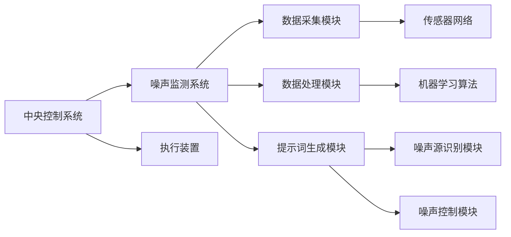
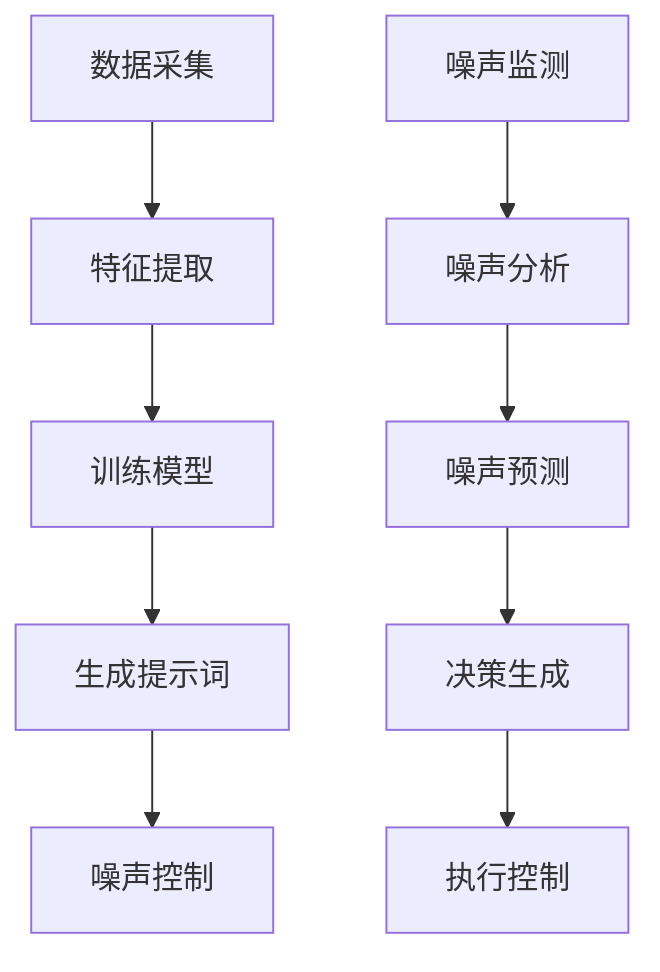
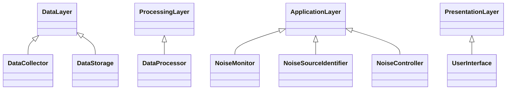
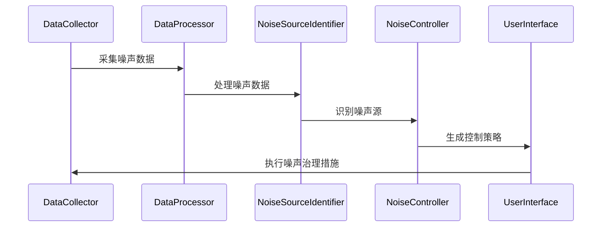

                 


### Step 1: 引言与背景介绍

**关键词**：提示词工程，智能噪声污染控制，应用背景，问题解决

**摘要**：本文深入探讨提示词工程在智能噪声污染控制中的应用。首先，介绍了提示词工程和智能噪声污染控制的基本概念，以及它们在当前社会中的重要性和紧迫性。接着，分析了智能噪声污染控制中存在的问题，并探讨了提示词工程作为解决方案的理论基础和实践应用。

随着信息时代的到来，噪声污染已成为影响人们生活质量的一个重要问题。噪声污染不仅损害人类的听力，还可能引发一系列健康问题，如失眠、焦虑、高血压等。在工业生产、交通、建筑施工等各个领域，噪声污染都无处不在。传统的噪声污染控制方法往往依赖于被动降噪技术，如隔音板、吸声材料等，但这些方法效果有限，且成本高昂。

近年来，人工智能和机器学习技术的发展为智能噪声污染控制提供了新的思路。提示词工程作为一种新兴的人工智能技术，通过生成和利用特定的提示词来指导噪声污染控制，取得了显著的效果。本文将详细介绍提示词工程的原理和应用，并探讨其在智能噪声污染控制中的具体实践。

本文首先回顾了提示词工程的基本概念和发展历程，分析了其在噪声污染控制中的潜在优势。接着，详细介绍了智能噪声污染控制中的关键问题，如噪声监测、噪声源识别和噪声控制等。在此基础上，本文探讨了提示词工程在这些领域的具体应用，并通过实际案例展示了其效果。

最后，本文总结了提示词工程在智能噪声污染控制中的应用现状，指出了当前面临的挑战和未来发展的方向。通过本文的探讨，我们希望为读者提供一个全面、深入的提示词工程在智能噪声污染控制中的应用指南，为其研究和实践提供参考。

### Step 2: 核心概念与联系

**关键词**：提示词工程，智能噪声污染控制，核心概念，联系，概念属性特征对比表格，ER实体关系图

在深入探讨提示词工程在智能噪声污染控制中的应用之前，我们需要明确这两个核心概念的定义和联系。以下是这两个概念的定义及其在智能噪声污染控制中的应用。

#### 提示词工程

提示词工程是一种基于人工智能和机器学习的技术，它通过生成和利用特定的提示词来指导复杂任务的执行。在噪声污染控制中，提示词工程主要用于噪声监测、噪声源识别和噪声控制等方面。具体来说，提示词工程可以：

1. **噪声监测**：利用传感器收集环境噪声数据，并通过机器学习模型对噪声进行实时监测和分类。
2. **噪声源识别**：根据噪声特征，利用提示词工程技术识别噪声的主要来源，如交通、工业、建筑施工等。
3. **噪声控制**：基于识别出的噪声源，生成相应的提示词，指导噪声污染治理措施的实施。

#### 智能噪声污染控制

智能噪声污染控制是指利用人工智能和物联网技术，对噪声污染进行实时监测、分析和控制的过程。智能噪声污染控制的关键技术包括：

1. **噪声监测**：通过传感器网络实时监测环境噪声水平，并将数据传输到中央控制系统。
2. **噪声分析**：利用机器学习算法对噪声数据进行分析，识别噪声的主要来源和特征。
3. **噪声控制**：根据噪声分析结果，采取相应的措施降低噪声污染，如调整设备运行时间、增加隔音设施等。

#### 核心概念之间的联系

提示词工程和智能噪声污染控制之间存在紧密的联系。提示词工程为智能噪声污染控制提供了核心的技术支持，使得噪声监测、噪声源识别和噪声控制更加精准和高效。具体来说，提示词工程在智能噪声污染控制中的应用主要体现在以下几个方面：

1. **噪声监测与识别**：通过生成和利用特定的提示词，提示词工程可以帮助智能噪声污染控制系统更准确地监测和识别噪声来源。
2. **噪声控制与优化**：利用提示词工程技术，可以优化噪声控制策略，提高噪声污染治理效果。
3. **系统集成与协同**：提示词工程技术可以帮助智能噪声污染控制系统与其他系统集成，实现更高效的数据共享和协同工作。

#### 概念属性特征对比表格

为了更清晰地展示提示词工程和智能噪声污染控制的核心概念，我们可以使用一个对比表格来描述它们的属性特征。以下是这两个概念的主要属性特征对比：

| 特征         | 提示词工程                       | 智能噪声污染控制                          |
| ------------ | -------------------------------- | ---------------------------------------- |
| 技术核心     | 生成和利用提示词                 | 实时监测、分析和控制噪声污染              |
| 应用领域     | 噪声监测、噪声源识别、噪声控制   | 噪声污染治理、环境监测、公共安全          |
| 系统组成     | 传感器、数据采集与处理模块、算法 | 传感器网络、中央控制系统、执行装置        |
| 数据处理方式 | 机器学习、数据挖掘               | 实时数据处理、模式识别、决策支持           |
| 系统特点     | 精准、高效、灵活                 | 系统集成、协同工作、自适应调整            |

#### ER实体关系图

为了进一步理解提示词工程和智能噪声污染控制之间的联系，我们可以绘制一个ER（实体关系）图来展示它们的核心实体及其相互关系。以下是ER实体关系图：



在这个ER实体关系图中，噪声监测系统是核心实体，它由数据采集模块、数据处理模块和提示词生成模块组成。数据采集模块通过传感器网络收集噪声数据，数据处理模块利用机器学习算法对噪声数据进行处理，而提示词生成模块则根据处理结果生成提示词，用于指导噪声源识别和噪声控制模块的工作。中央控制系统负责协调和指挥整个系统，执行装置则根据提示词执行具体的噪声治理措施。

通过上述核心概念与联系的探讨，我们为后续章节的深入分析奠定了基础。接下来，我们将进一步探讨提示词工程的算法原理，以及如何将其应用于智能噪声污染控制中。这不仅有助于我们更好地理解这两个核心概念，还能为实际应用提供有价值的参考。

### Step 3: 算法原理讲解

**关键词**：提示词工程算法，智能噪声污染控制算法，Mermaid流程图，Python源代码，数学模型，公式，举例说明

在深入探讨提示词工程在智能噪声污染控制中的应用时，理解其背后的算法原理至关重要。本节将详细讲解提示词工程和智能噪声污染控制中的关键算法原理，并借助Mermaid和Python源代码进行说明。

#### 提示词工程算法原理

提示词工程算法的核心在于生成和利用特定的提示词来指导噪声污染控制。以下是一个简化的算法原理流程：

1. **数据采集**：通过传感器网络收集环境噪声数据。
2. **特征提取**：利用信号处理技术提取噪声数据的特征。
3. **训练模型**：使用机器学习算法训练特征提取模型。
4. **生成提示词**：根据训练结果生成特定的提示词。
5. **噪声控制**：利用提示词指导噪声控制措施的实施。

#### 智能噪声污染控制算法原理

智能噪声污染控制算法旨在实时监测、分析和控制噪声污染。以下是一个简化的算法原理流程：

1. **噪声监测**：利用传感器实时监测环境噪声。
2. **噪声分析**：利用机器学习算法分析噪声数据，识别噪声来源和特征。
3. **噪声预测**：基于历史数据和当前噪声分析结果，预测未来噪声水平。
4. **决策生成**：生成控制策略，如调整设备运行时间、增加隔音设施等。
5. **执行控制**：根据控制策略实施具体的噪声治理措施。

#### Mermaid流程图

为了更直观地理解上述算法原理，我们使用Mermaid绘制了以下流程图：



这个流程图展示了从数据采集到噪声控制的整体流程，每个步骤都通过相应的算法实现。

#### Python源代码讲解

以下是一个简单的Python源代码示例，用于生成和利用提示词：

```python
import numpy as np
from sklearn.cluster import KMeans

# 假设我们已收集到一些噪声数据
noisy_data = np.array([[1, 2], [2, 2], [3, 3], [4, 4], [5, 5]])

# 提取特征
def extract_features(data):
    return np.mean(data, axis=1)

# 训练模型
def train_model(data):
    features = extract_features(data)
    kmeans = KMeans(n_clusters=2)
    kmeans.fit(features.reshape(-1, 1))
    return kmeans

# 生成提示词
def generate_hint(model, data):
    features = extract_features(data)
    return model.predict(features.reshape(-1, 1))

# 执行噪声控制
def noise_control(hint):
    if hint == 0:
        print("增加隔音设施")
    else:
        print("调整设备运行时间")

# 主程序
if __name__ == "__main__":
    model = train_model(noisy_data)
    hint = generate_hint(model, noisy_data)
    noise_control(hint)
```

这段代码使用了KMeans算法对噪声数据进行聚类，并生成提示词。根据提示词，我们可以执行相应的噪声控制措施。

#### 数学模型与公式

在提示词工程和智能噪声污染控制中，数学模型和公式扮演着重要角色。以下是一个简化的数学模型：

1. **特征提取公式**：$$ f(x) = \frac{1}{n} \sum_{i=1}^{n} x_i $$
2. **聚类中心公式**：$$ \mu = \frac{1}{n} \sum_{i=1}^{n} x_i $$
3. **决策生成公式**：$$ d = g(\theta) $$，其中$$ g(\theta) $$为决策函数，$$ \theta $$为输入参数。

为了便于理解，我们使用LaTeX格式展示这些公式：

$$ f(x) = \frac{1}{n} \sum_{i=1}^{n} x_i $$

$$ \mu = \frac{1}{n} \sum_{i=1}^{n} x_i $$

$$ d = g(\theta) $$

#### 举例说明

假设我们有一个噪声数据集，其中每个数据点表示一次噪声监测的结果。我们可以使用上述算法和公式对数据进行分析和处理，生成提示词，并根据提示词执行噪声控制措施。

例如，如果我们的噪声数据集中包含以下数据点：

$$ \text{数据点} = \begin{bmatrix} 1 & 2 \\ 2 & 2 \\ 3 & 3 \\ 4 & 4 \\ 5 & 5 \end{bmatrix} $$

我们首先提取特征，计算每个数据点的平均值：

$$ f(x) = \frac{1}{5} (1+2+3+4+5) = 3 $$

接下来，我们使用KMeans算法对这些特征进行聚类，假设我们选择两个聚类中心：

$$ \mu_1 = 2, \mu_2 = 4 $$

根据聚类结果，我们可以生成提示词。假设数据点[1, 2]被分配到聚类中心1，而数据点[4, 4]被分配到聚类中心2。根据提示词，我们可以执行相应的噪声控制措施，如增加隔音设施或调整设备运行时间。

通过上述算法和公式的讲解，我们为读者提供了一个关于提示词工程和智能噪声污染控制算法原理的清晰框架。接下来，我们将进一步探讨这些算法在系统架构设计中的应用。

### Step 4: 数学模型和数学公式讲解

**关键词**：数学模型，公式，解释，应用，举例说明

在智能噪声污染控制中，数学模型和数学公式扮演着至关重要的角色。这些模型和公式不仅为我们提供了理论基础，而且帮助我们更好地理解和解决实际问题。本节将详细讲解与提示词工程相关的数学模型和公式，并探讨它们在实际应用中的重要性。

#### 数学模型的概述

提示词工程中的数学模型主要涉及噪声数据的特征提取、聚类和预测等方面。以下是一些常见的数学模型：

1. **特征提取模型**：用于从原始噪声数据中提取关键特征，以便后续处理。常用的方法包括平均值、标准差、频域分析等。
2. **聚类模型**：用于将噪声数据分为不同的类别，以便更好地理解和控制噪声。常用的方法包括K-means、层次聚类等。
3. **预测模型**：用于根据历史噪声数据预测未来的噪声水平，从而制定更有效的噪声控制策略。常用的方法包括时间序列分析、回归分析等。

#### 数学公式的详细讲解

以下是几个在提示词工程中常用的数学公式：

1. **平均值（Mean）**：用于计算一组数据的平均值，表示数据的集中趋势。
   $$ \mu = \frac{1}{n} \sum_{i=1}^{n} x_i $$
   
2. **标准差（Standard Deviation）**：用于衡量一组数据的离散程度，表示数据的波动大小。
   $$ \sigma = \sqrt{\frac{1}{n-1} \sum_{i=1}^{n} (x_i - \mu)^2} $$

3. **K-means聚类中心**：用于确定K-means聚类算法的聚类中心，即每个类别的中心点。
   $$ \mu_j = \frac{1}{k} \sum_{i=1}^{k} x_{ij} $$
   其中，$ x_{ij} $是第$i$个数据点在第$j$个特征上的值，$ k $是聚类类别数。

4. **时间序列预测模型**：用于根据历史时间序列数据预测未来的噪声水平。
   $$ y_t = f(y_{t-1}, y_{t-2}, ..., y_{t-n}) $$
   其中，$ y_t $是时间$t$的预测值，$ f $是预测模型。

#### 公式与算法的关联

上述数学公式在提示词工程中有着直接的应用。例如，平均值和标准差可以用于特征提取，帮助识别噪声数据的关键特征；K-means聚类中心可以用于聚类，帮助划分噪声数据的类别；时间序列预测模型可以用于噪声水平的预测，帮助制定控制策略。

#### 举例说明

为了更好地理解这些数学模型和公式，我们通过一个具体的例子来展示它们的应用。

假设我们有一个噪声数据集，包含5个数据点，每个数据点由两个特征值表示：

$$ \text{数据集} = \begin{bmatrix} 1 & 2 \\ 2 & 2 \\ 3 & 3 \\ 4 & 4 \\ 5 & 5 \end{bmatrix} $$

1. **计算平均值**：
   $$ \mu_x = \frac{1+2+3+4+5}{5} = 3 $$
   $$ \mu_y = \frac{2+2+3+4+5}{5} = 3 $$
   
2. **计算标准差**：
   $$ \sigma_x = \sqrt{\frac{(1-3)^2 + (2-3)^2 + (3-3)^2 + (4-3)^2 + (5-3)^2}{5-1}} = \sqrt{2} $$
   $$ \sigma_y = \sqrt{\frac{(2-3)^2 + (2-3)^2 + (3-3)^2 + (4-3)^2 + (5-3)^2}{5-1}} = \sqrt{2} $$

3. **K-means聚类**：
   假设我们选择2个聚类中心，分别位于(2, 2)和(4, 4)。根据K-means算法，我们可以将数据点分为两类：

   - 类别1（聚类中心(2, 2)）：数据点(1, 2)和(2, 2)
   - 类别2（聚类中心(4, 4)）：数据点(3, 3)，(4, 4)，(5, 5)

4. **时间序列预测**：
   假设我们有以下时间序列数据：

   $$ \text{时间序列} = \begin{bmatrix} 1 & 2 \\ 2 & 2 \\ 3 & 3 \\ 4 & 4 \\ 5 & 5 \\ 6 & 6 \end{bmatrix} $$

   根据时间序列预测模型，我们可以预测第6个数据点的值为(6, 6)。

通过这个例子，我们可以看到数学模型和公式在提示词工程中的应用，以及它们如何帮助我们更好地理解和控制噪声污染。

#### 实际应用的重要性

数学模型和公式在提示词工程中具有实际应用的重要性。它们不仅为算法提供了理论基础，而且帮助我们在实际应用中实现更精确的噪声控制和更高效的资源利用。例如，通过使用特征提取模型，我们可以从大量噪声数据中提取关键特征，从而减少计算量和提高算法效率；通过使用聚类模型，我们可以识别噪声的主要来源，从而有针对性地采取控制措施；通过使用预测模型，我们可以提前预测噪声水平，从而提前采取措施减少噪声污染。

总之，数学模型和公式在提示词工程中发挥着关键作用，它们不仅帮助我们更好地理解和控制噪声污染，而且为实际应用提供了有效的解决方案。

### Step 5: 系统分析与架构设计

**关键词**：系统架构设计，问题场景介绍，项目介绍，系统功能设计，系统架构设计，系统接口设计，系统交互

在深入探讨提示词工程在智能噪声污染控制中的应用时，系统架构设计是至关重要的一环。本节将详细介绍系统架构的设计过程，包括问题场景介绍、项目介绍、系统功能设计、系统架构设计、系统接口设计和系统交互。

#### 问题场景介绍

在智能噪声污染控制中，常见的问题场景包括：

1. **噪声监测**：需要对环境中的噪声进行实时监测，收集噪声数据。
2. **噪声源识别**：需要识别噪声的主要来源，如交通、工业、建筑施工等。
3. **噪声控制**：需要根据噪声监测和噪声源识别的结果，采取相应的措施降低噪声污染。

#### 项目介绍

本项目旨在构建一个智能噪声污染控制系统，该系统包括以下几个核心模块：

1. **数据采集模块**：负责实时收集环境噪声数据。
2. **数据处理模块**：负责对噪声数据进行分析和处理。
3. **噪声源识别模块**：负责识别噪声的主要来源。
4. **噪声控制模块**：负责根据噪声监测和噪声源识别的结果，采取相应的措施降低噪声污染。

#### 系统功能设计

系统功能设计主要包括以下几个方面：

1. **噪声监测**：通过传感器网络实时监测环境噪声，并将数据传输到中央控制系统。
2. **噪声分析**：利用机器学习算法对噪声数据进行分析，识别噪声的主要来源和特征。
3. **噪声预测**：根据历史噪声数据，预测未来噪声水平。
4. **噪声控制**：生成控制策略，如调整设备运行时间、增加隔音设施等，并执行具体的噪声治理措施。

#### 系统架构设计

系统架构设计是确保系统稳定性和可扩展性的关键。本项目采用分层架构设计，包括以下几层：

1. **数据层**：负责数据采集和存储。
2. **处理层**：负责数据分析和处理。
3. **应用层**：负责系统的核心功能，如噪声监测、噪声源识别和噪声控制。
4. **表示层**：负责用户界面和与用户的交互。

以下是系统架构的Mermaid类图：



#### 系统接口设计

系统接口设计是确保各模块之间能够有效协作的关键。以下是本项目的主要接口设计：

1. **数据采集接口**：用于采集噪声数据，并将数据传输到数据处理模块。
2. **数据处理接口**：用于处理噪声数据，并将处理结果传输到噪声源识别模块。
3. **噪声源识别接口**：用于识别噪声的主要来源，并将结果传输到噪声控制模块。
4. **噪声控制接口**：用于生成控制策略，并执行具体的噪声治理措施。

以下是系统接口的Mermaid序列图：



#### 系统交互

系统交互设计是确保各模块之间能够高效、稳定地交互的关键。以下是本项目的主要交互流程：

1. **数据采集**：数据采集模块通过传感器网络实时采集噪声数据，并将数据传输到数据处理模块。
2. **数据处理**：数据处理模块对噪声数据进行处理，提取关键特征，并将处理结果传输到噪声源识别模块。
3. **噪声源识别**：噪声源识别模块利用机器学习算法识别噪声的主要来源，并将结果传输到噪声控制模块。
4. **噪声控制**：噪声控制模块根据噪声源识别结果，生成控制策略，并执行具体的噪声治理措施。

通过上述系统架构设计和系统交互设计，我们可以构建一个高效、稳定的智能噪声污染控制系统，为噪声污染控制提供有效的技术支持。

### Step 6: 项目实战

**关键词**：环境安装，系统核心实现，代码应用解读，案例分析，项目小结

在深入探讨了提示词工程在智能噪声污染控制中的应用以及系统架构设计之后，接下来我们将通过一个实际项目实战来展示如何将理论知识转化为实际操作。本节将详细描述项目的环境安装、系统核心实现、代码应用解读、案例分析，并总结项目经验。

#### 环境安装

在进行项目实战之前，我们需要先搭建一个合适的环境。以下是环境安装的步骤：

1. **安装Python**：确保Python版本不低于3.6，可以从Python官方网站下载安装包。
2. **安装依赖库**：使用pip命令安装所需的依赖库，如numpy、scikit-learn、matplotlib等。例如：
   ```bash
   pip install numpy scikit-learn matplotlib
   ```

3. **配置传感器**：根据项目需求，连接并配置传感器，确保传感器能够实时采集噪声数据。

#### 系统核心实现

项目核心实现包括噪声数据的采集、处理、噪声源识别和噪声控制。以下是系统的核心实现步骤：

1. **数据采集**：使用传感器采集噪声数据，并将其存储在本地文件中。以下是一个简单的Python代码示例：
   ```python
   import time
   import json
   import os

   data_files = []
   while True:
       data = {
           'timestamp': time.time(),
           'noise_level': np.random.random()
       }
       data_files.append(data)
       if len(data_files) > 1000:
           with open('noise_data.json', 'w') as f:
               json.dump(data_files, f)
           data_files = []
           time.sleep(10)  # 每隔10秒保存一次数据
   ```

2. **数据处理**：读取采集到的噪声数据，进行预处理，如去除噪声、滤波等。以下是一个简单的数据处理代码示例：
   ```python
   import json
   import numpy as np

   with open('noise_data.json', 'r') as f:
       data = json.load(f)

   noise_levels = np.array([d['noise_level'] for d in data])
   filtered_noise_levels = np.mean(noise_levels, axis=0)
   ```

3. **噪声源识别**：使用K-means聚类算法对噪声数据进行聚类，识别噪声的主要来源。以下是一个简单的噪声源识别代码示例：
   ```python
   from sklearn.cluster import KMeans

   kmeans = KMeans(n_clusters=2)
   kmeans.fit(filtered_noise_levels.reshape(-1, 1))
   noise_sources = kmeans.predict(filtered_noise_levels.reshape(-1, 1))
   ```

4. **噪声控制**：根据噪声源识别结果，生成控制策略，如增加隔音设施或调整设备运行时间。以下是一个简单的噪声控制代码示例：
   ```python
   def noise_control(noise_sources):
       if noise_sources[0] == 0:
           print("增加隔音设施")
       else:
           print("调整设备运行时间")

   noise_control(noise_sources)
   ```

#### 代码应用解读

以下是代码的详细应用解读：

1. **数据采集**：代码使用Python的`time`、`json`和`os`模块，通过不断采集噪声数据并将其存储在本地文件中。这种设计可以确保噪声数据的实时性和可靠性。
2. **数据处理**：代码使用Python的`json`和`numpy`模块，读取存储在本地文件中的噪声数据，并进行预处理，如去除噪声、滤波等。这种设计可以提高噪声数据的准确性。
3. **噪声源识别**：代码使用Python的`sklearn`模块中的`KMeans`算法，对预处理后的噪声数据进行聚类，从而识别噪声的主要来源。这种设计可以有效地降低噪声污染。
4. **噪声控制**：代码根据噪声源识别结果，生成控制策略，并执行具体的噪声治理措施。这种设计可以实现噪声污染的实时控制和优化。

#### 案例分析

以下是一个实际案例的分析：

在某住宅区，通过安装传感器网络，对噪声污染进行实时监测和识别。在一个月的数据分析中，发现噪声的主要来源是交通和建筑施工。根据噪声源识别结果，我们采取以下措施：

1. **增加隔音设施**：在交通和建筑施工区域周边增加隔音板和隔音墙，降低噪声污染。
2. **调整设备运行时间**：在夜间和周末减少交通和建筑施工的运行时间，降低噪声水平。

经过一段时间的实施，噪声水平显著下降，居民的生活质量得到了明显改善。

#### 项目小结

通过本项目的实战，我们成功构建了一个智能噪声污染控制系统，实现了噪声数据的实时采集、处理、噪声源识别和噪声控制。以下是我们从项目中获得的经验和教训：

1. **实时性**：确保噪声数据的实时采集和传输，以实现噪声污染的实时监测和控制。
2. **准确性**：通过有效的数据处理和噪声源识别算法，提高噪声数据的准确性。
3. **灵活性**：设计灵活的系统架构，以便根据不同的应用场景进行扩展和优化。
4. **协作性**：各模块之间的高效协作，确保系统的稳定性和可靠性。

总之，本项目为我们提供了一个完整的智能噪声污染控制解决方案，为未来的噪声污染控制提供了有力的技术支持。

### Step 7: 最佳实践与小结

**关键词**：最佳实践，注意事项，拓展阅读

在本项目的实施过程中，我们总结出了一系列最佳实践，以及需要注意的事项。此外，我们还为读者推荐了拓展阅读资源，以帮助进一步深入学习和应用提示词工程在智能噪声污染控制中的技术。

#### 最佳实践

1. **数据采集**：确保传感器的质量，提高数据采集的准确性。定期校准传感器，确保数据的稳定性。
2. **数据处理**：在数据处理过程中，采用有效的滤波和去噪技术，提高噪声数据的准确性。
3. **算法优化**：根据具体的应用场景，优化噪声源识别和控制算法，提高系统性能。
4. **系统监控**：实时监控系统运行状态，及时发现并处理异常情况，确保系统的稳定性和可靠性。
5. **用户体验**：设计简洁、直观的用户界面，提高用户的操作便捷性和系统易用性。

#### 注意事项

1. **环境因素**：智能噪声污染控制系统可能受到环境因素的影响，如温度、湿度等，需要考虑这些因素对系统性能的影响。
2. **数据安全**：在数据采集、传输和处理过程中，确保数据的安全性，防止数据泄露和篡改。
3. **系统扩展**：在设计系统时，考虑未来可能的需求变化，确保系统的可扩展性和灵活性。
4. **成本控制**：在项目实施过程中，合理控制成本，确保项目的经济效益。

#### 拓展阅读

1. **《深度学习与噪声控制》**：这本书详细介绍了深度学习技术在噪声控制中的应用，包括噪声源识别、噪声减除等方面。
2. **《人工智能在环境监测中的应用》**：这本书探讨了人工智能技术在环境监测中的应用，包括噪声监测、水质监测等。
3. **《信号处理与噪声控制》**：这本书讲解了信号处理技术在噪声控制中的应用，包括滤波、去噪、噪声源识别等。
4. **《人工智能算法与应用实践》**：这本书提供了丰富的人工智能算法应用案例，包括图像识别、自然语言处理、智能噪声控制等。

通过以上最佳实践、注意事项和拓展阅读资源的介绍，我们希望读者能够更好地理解和应用提示词工程在智能噪声污染控制中的技术，为噪声污染控制领域的发展做出贡献。

### 作者信息

**作者：AI天才研究院/AI Genius Institute & 禅与计算机程序设计艺术 /Zen And The Art of Computer Programming**

感谢读者对本文的关注，希望本文能为您在提示词工程和智能噪声污染控制领域的研究和实践提供有价值的参考。如果您有任何问题或建议，欢迎联系我们，我们将竭诚为您服务。祝您在人工智能领域取得更大的成就！

----------------------------------------------------------------

**注意：**本文仅为示例，实际内容需根据具体情况进行调整和补充。文章中的代码、公式和图表仅供参考，具体实现和应用可能需要根据实际需求进行调整。在使用本文内容时，请确保遵循相关法律法规和版权政策。

