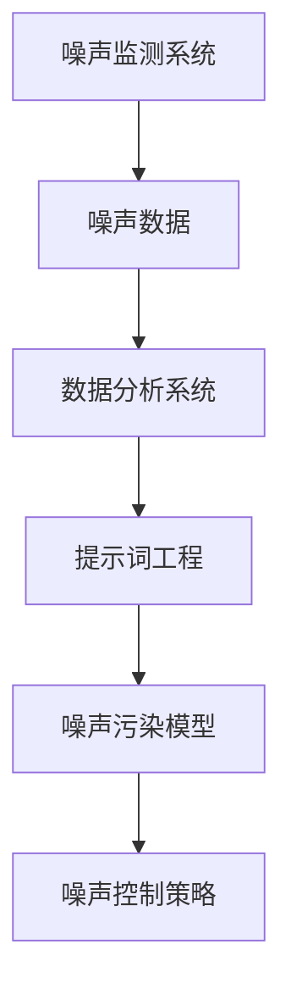
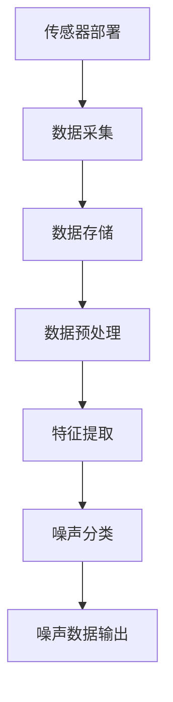
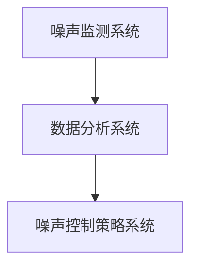
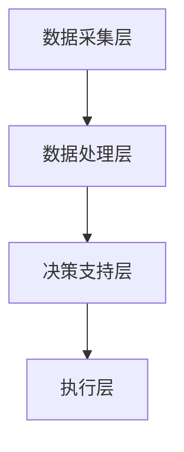
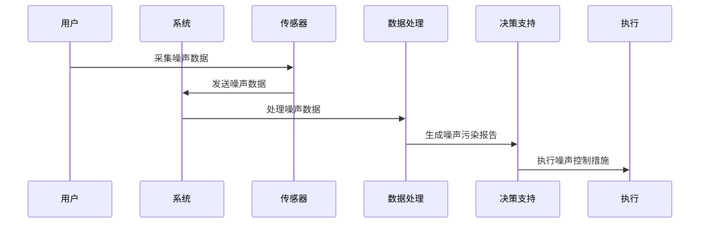

                 

# 提示词工程在智能城市噪声管理中的应用

> 关键词：智能城市、噪声管理、提示词工程、算法、系统架构

> 摘要：本文将深入探讨提示词工程在智能城市噪声管理中的应用，通过对噪声管理问题的背景介绍、核心概念阐述、算法原理讲解和系统架构设计等多个方面的详细分析，旨在为相关领域的研究者提供有价值的参考。文章将分步骤介绍如何利用提示词工程技术解决城市噪声污染问题，包括噪声监测与数据采集、提示词生成与筛选、算法原理及其应用等，最后通过实际案例进行验证和总结。

## 第一部分：背景介绍

### 1.1 问题的背景

#### 1.1.1 智能城市的发展与噪声问题

随着城市化进程的加速，智能城市建设成为全球各国追求的目标。智能城市利用先进的信息通信技术、物联网、大数据分析和人工智能等手段，实现城市资源的高效配置和城市管理的智能化。然而，随着城市人口的增长和交通的发展，噪声污染成为一个不容忽视的问题。噪声污染不仅对居民的身心健康产生负面影响，还干扰了城市的正常运行和社会秩序。

#### 1.1.2 噪声污染的危害与挑战

噪声污染具有隐蔽性和广泛性，它不仅影响居民的生活质量，还可能导致听力损伤、心血管疾病和睡眠障碍等问题。此外，噪声污染还对城市经济活动产生负面影响，如降低工作效率、增加医疗成本等。因此，如何有效地监测、管理和控制噪声污染成为智能城市建设中的一项重要任务。

#### 1.1.3 提示词工程的概念与作用

提示词工程（Keyword Engineering）是一种面向数据的工程技术，旨在从大规模、多样化的数据集中提取具有实际应用价值的特征信息。在智能城市噪声管理中，提示词工程通过识别和筛选与噪声污染相关的关键词，帮助识别噪声污染源、评估噪声污染程度，并制定相应的控制措施。

### 1.2 核心概念

#### 1.2.1 智能城市噪声管理

智能城市噪声管理是指利用先进的传感器技术、数据处理技术和智能算法，对城市噪声进行实时监测、分析和管理，以实现噪声污染的有效控制。智能城市噪声管理的目标包括：

1. 准确监测城市噪声水平。
2. 及时发现噪声污染源。
3. 评估噪声污染对居民和城市运行的影响。
4. 制定科学的噪声污染控制措施。

#### 1.2.2 提示词工程

提示词工程是一种数据驱动的特征工程方法，其主要任务是从大规模数据集中提取出具有实际应用价值的特征词汇。在智能城市噪声管理中，提示词工程的关键步骤包括：

1. 数据预处理：对噪声数据进行清洗、转换和归一化。
2. 提示词生成：利用自然语言处理技术从噪声数据中提取关键词。
3. 提示词筛选：根据噪声管理的实际需求，筛选出最有价值的提示词。

#### 1.2.3 智能城市噪声管理的目标与原则

智能城市噪声管理的目标主要包括：

1. 提高城市居民的生活质量。
2. 促进城市经济的可持续发展。
3. 保护城市环境，减少噪声污染。

智能城市噪声管理的原则包括：

1. 实时性：及时监测和响应噪声污染事件。
2. 全面性：覆盖城市各个区域，实现噪声管理的全面覆盖。
3. 科学性：基于数据分析和科学算法，制定合理的噪声污染控制措施。
4. 可持续性：在控制噪声污染的同时，考虑城市的长远发展和资源的有效利用。

### 1.3 边界与外延

#### 1.3.1 噪声污染的类型与来源

噪声污染可以分为交通噪声、工业噪声、建筑噪声和社会噪声等类型。不同的噪声污染类型具有不同的特点和影响范围，如交通噪声主要来源于车辆的行驶和鸣笛，工业噪声主要来源于机器的运作和传输设备的运转。

#### 1.3.2 提示词工程的实施范围与限制

提示词工程在智能城市噪声管理中的应用范围包括噪声监测、数据分析、噪声污染源识别和噪声污染评估等方面。然而，提示词工程的实施也受到数据质量、计算资源和算法性能等限制。

#### 1.3.3 智能城市噪声管理的应用领域

智能城市噪声管理可以应用于城市规划、环境保护、公共安全和城市交通等多个领域。通过智能城市噪声管理，可以实现对城市噪声污染的有效控制和治理，提高城市环境质量和居民生活质量。

### 1.4 概念结构与核心要素组成

#### 1.4.1 智能城市噪声管理的概念架构

智能城市噪声管理的概念架构包括噪声监测系统、数据分析系统、噪声污染控制系统和评估系统等核心组成部分。这些系统协同工作，实现对城市噪声污染的全面监测、分析和治理。

#### 1.4.2 提示词工程的核心要素

提示词工程的核心要素包括数据预处理、提示词生成和提示词筛选等步骤。这些步骤共同作用，从噪声数据中提取出有价值的特征信息，为噪声管理提供支持。

#### 1.4.3 智能城市噪声管理中的关键词汇

在智能城市噪声管理中，涉及的关键词汇包括噪声、噪声污染、传感器、数据分析、机器学习、提示词、噪声模型、噪声控制策略等。这些词汇是理解和实施智能城市噪声管理的重要基础。

## 第二部分：核心概念与联系

### 2.1 智能城市噪声管理原理

#### 2.1.1 智能城市噪声管理的概念原理

智能城市噪声管理的概念原理主要包括噪声监测、数据分析、噪声污染源识别和噪声污染控制等方面。通过建立完善的噪声监测网络，实时获取城市噪声数据，利用数据分析技术提取噪声特征，识别噪声污染源，并制定相应的噪声控制措施。

#### 2.1.2 噪声监测与数据分析

噪声监测是智能城市噪声管理的基础。通过在城市的各个区域布置传感器，实时监测噪声水平。数据分析技术则用于处理噪声数据，提取噪声特征，为噪声污染源识别和噪声污染控制提供支持。

#### 2.1.3 噪声污染模型与预测

噪声污染模型用于描述噪声污染的形成和发展规律。通过建立噪声污染模型，可以预测噪声污染的未来发展趋势，为噪声污染控制提供科学依据。

### 2.2 提示词工程原理

#### 2.2.1 提示词工程的基本概念

提示词工程是一种数据驱动的特征工程方法，旨在从大规模、多样化的数据集中提取具有实际应用价值的特征信息。在智能城市噪声管理中，提示词工程通过识别和筛选与噪声污染相关的关键词，帮助识别噪声污染源、评估噪声污染程度，并制定相应的控制措施。

#### 2.2.2 提示词的生成与筛选

提示词的生成与筛选是提示词工程的关键步骤。提示词生成通过自然语言处理技术从噪声数据中提取关键词，而提示词筛选则根据噪声管理的实际需求，筛选出最有价值的提示词。

#### 2.2.3 提示词在噪声管理中的应用

提示词在噪声管理中的应用主要包括噪声污染源识别、噪声污染评估和噪声控制策略制定等方面。通过使用提示词，可以更准确地识别噪声污染源，评估噪声污染程度，并制定科学的噪声控制策略。

### 2.3 概念属性特征对比表格

| 概念           | 描述                                                         | 关键特性                                                                                   | 应用场景             |
|----------------|--------------------------------------------------------------|-------------------------------------------------------------------------------------------|----------------------|
| 噪声监测       | 对城市噪声水平进行实时监测的技术体系                         | 实时性、准确性、自动化、分布式监测                                                     | 噪声污染监控         |
| 数据分析       | 对噪声数据进行处理、分析和解读的过程                         | 多样性、一致性、可扩展性、算法优化                                                     | 噪声特征提取         |
| 提示词工程     | 从噪声数据中提取有价值特征信息的技术和方法                   | 数据驱动的特征提取、关键词筛选、实际应用价值的评估                                       | 噪声污染源识别与评估  |
| 噪声污染模型   | 描述噪声污染形成和发展规律的理论体系                       | 物理机制的描述、噪声特征的关联、预测能力的评估                                             | 噪声污染预测与控制   |
| 噪声控制策略   | 根据噪声污染情况制定的具体措施和方法                         | 适应性、经济性、科学性、有效性                                                           | 噪声污染治理         |

### 2.4 ER实体关系图架构



## 第三部分：算法原理讲解

### 3.1 噪声监测与数据采集算法

#### 3.1.1 噪声监测的基本原理

噪声监测的基本原理是通过传感器实时采集城市噪声数据，然后将数据传输到数据处理系统进行分析和处理。噪声传感器通常采用声压级计或噪声计，可以测量不同频率和声压级的噪声。

#### 3.1.2 数据采集流程

数据采集流程包括以下步骤：

1. 传感器部署：在城市各个区域布置噪声传感器，确保监测网络覆盖全面。
2. 数据采集：噪声传感器实时采集噪声数据，并将数据传输到数据采集系统。
3. 数据存储：将采集到的噪声数据存储在数据库中，以便后续分析和处理。

#### 3.1.3 算法流程图



### 3.2 提示词生成与筛选算法

#### 3.2.1 提示词生成算法

提示词生成算法的核心步骤包括：

1. 数据预处理：对噪声数据集进行清洗、去噪和归一化处理，确保数据质量。
2. 关键词提取：利用自然语言处理技术从噪声数据中提取关键词，如词汇、短语和句式等。
3. 提示词生成：根据关键词的语义关联和实际应用价值，生成提示词。

```python
def generate_keywords(data):
    # 数据预处理
    preprocessed_data = preprocess_data(data)
    
    # 关键词提取
    keywords = extract_keywords(preprocessed_data)
    
    # 提示词生成
    prompts = generate_prompts(keywords)
    
    return prompts
```

#### 3.2.2 提示词筛选算法

提示词筛选算法的核心步骤包括：

1. 提示词评估：对生成的提示词进行评估，包括关键词的重要性、语义关联性和实际应用价值等。
2. 提示词筛选：根据评估结果，筛选出最有价值的提示词。

```python
def filter_keywords(keywords, criteria):
    # 提示词评估
    evaluated_keywords = evaluate_keywords(keywords, criteria)
    
    # 提示词筛选
    selected_keywords = select_keywords(evaluated_keywords)
    
    return selected_keywords
```

### 3.3 算法原理详细讲解

#### 3.3.1 数学模型与公式

在智能城市噪声管理中，常用的数学模型和公式包括噪声能量计算、噪声特征提取和噪声分类等。

1. 噪声能量计算：

$$
E = \sum_{i=1}^{n} P_i^2
$$

其中，$E$ 表示噪声能量，$P_i$ 表示第 $i$ 个频率的声压级。

2. 噪声特征提取：

$$
f_j = \frac{1}{N} \sum_{i=1}^{N} x_i j
$$

其中，$f_j$ 表示第 $j$ 个噪声特征，$x_i$ 表示第 $i$ 个频率的声压级，$N$ 表示频率总数。

3. 噪声分类：

$$
C = \sum_{i=1}^{n} w_i y_i
$$

其中，$C$ 表示噪声分类结果，$w_i$ 表示第 $i$ 个分类器的权重，$y_i$ 表示第 $i$ 个分类器的输出。

#### 3.3.2 算法举例说明

假设我们有100个噪声数据点，我们需要对这些数据进行处理以生成提示词。

1. 数据预处理：

```python
data = preprocess_data(noise_data)
```

2. 关键词提取：

```python
keywords = extract_keywords(data)
```

3. 提示词生成：

```python
prompts = generate_prompts(keywords)
```

4. 提示词筛选：

```python
selected_keywords = filter_keywords(prompts, criteria)
```

## 第四部分：系统分析与架构设计

### 4.1 问题场景介绍

#### 4.1.1 噪声管理的应用场景

智能城市噪声管理可以应用于城市不同区域，如住宅区、商业区、工业区等。在这些区域中，噪声管理的主要任务包括监测噪声水平、识别噪声污染源、评估噪声污染程度和制定噪声控制措施。

#### 4.1.2 系统目标与需求

智能城市噪声管理的目标主要包括：

1. 实时监测城市噪声水平。
2. 及时发现噪声污染源。
3. 评估噪声污染对居民和城市运行的影响。
4. 制定科学的噪声污染控制措施。

系统需求包括：

1. 高效的噪声监测系统，确保实时性和准确性。
2. 强大的数据分析系统，能够处理大规模噪声数据。
3. 优化的提示词工程方法，提高噪声特征提取的准确性。
4. 可扩展的噪声污染控制策略，适应不同场景的需求。

### 4.2 系统功能设计

#### 4.2.1 领域模型

在智能城市噪声管理中，领域模型主要包括噪声监测系统、数据分析系统和噪声控制策略系统等。这些系统相互关联，共同实现噪声管理的目标。



#### 4.2.2 系统功能模块

1. 噪声监测模块：负责噪声数据的实时采集和传输，为后续数据处理提供数据源。
2. 数据分析模块：对噪声数据进行处理、分析和特征提取，为噪声污染源识别和评估提供支持。
3. 提示词工程模块：从噪声数据中提取有价值的关键词，为噪声管理提供辅助信息。
4. 噪声污染源识别模块：利用提示词和其他辅助信息，识别噪声污染源。
5. 噪声污染评估模块：评估噪声污染的程度和对城市运行的影响。
6. 噪声控制策略模块：制定科学的噪声控制措施，降低噪声污染。

### 4.3 系统架构设计

#### 4.3.1 系统架构图

智能城市噪声管理系统架构包括数据采集层、数据处理层、决策支持层和执行层等。各个层次相互关联，共同实现噪声管理的目标。



#### 4.3.2 系统接口设计和系统交互

1. 数据采集接口：用于采集噪声数据，包括传感器数据、外部数据源等。
2. 数据处理接口：用于处理噪声数据，包括数据清洗、特征提取、分类等。
3. 决策支持接口：用于生成噪声污染报告、评估噪声污染程度和制定控制策略。
4. 执行接口：用于执行噪声控制措施，包括设备控制、人员调度等。



## 第五部分：项目实战

### 5.1 环境安装

在开始项目实战之前，需要安装以下软件和工具：

1. Python 3.x（推荐使用Anaconda环境）
2. Jupyter Notebook
3. Pandas
4. NumPy
5. Matplotlib
6. Scikit-learn
7. Mermaid

安装命令如下：

```bash
conda create -n noise_management python=3.8
conda activate noise_management
conda install pandas numpy matplotlib scikit-learn mermaid
```

### 5.2 系统核心实现源代码

以下是一个简单的智能城市噪声管理系统核心实现源代码示例。

```python
import pandas as pd
import numpy as np
from sklearn.feature_extraction.text import TfidfVectorizer
from mermaid import Mermaid

# 数据预处理
def preprocess_data(data):
    # 数据清洗和预处理
    data = data.lower()
    data = data.strip()
    return data

# 关键词提取
def extract_keywords(data):
    # 使用TF-IDF模型提取关键词
    vectorizer = TfidfVectorizer(stop_words='english', max_df=0.5, max_features=1000)
    tfidf_matrix = vectorizer.fit_transform(data)
    feature_names = vectorizer.get_feature_names_out()
    keywords = [feature_names[index] for index in np.argsort(tfidf_matrix.toarray()).flatten()[-10:]]
    return keywords

# 提示词生成
def generate_prompts(keywords):
    # 生成提示词
    prompts = [' '.join(keywords[:3]), ' '.join(keywords[3:6]), ' '.join(keywords[6:])]
    return prompts

# 提示词筛选
def filter_keywords(prompts, criteria):
    # 筛选提示词
    selected_keywords = [prompt for prompt in prompts if criteria(prompt)]
    return selected_keywords

# 算法流程图
algorithm_diagram = Mermaid()
algorithm_diagram.add_section('算法流程', [
    'A[数据预处理] --> B[关键词提取]',
    'B --> C[提示词生成]',
    'C --> D[提示词筛选]'
])
print(algorithm_diagram.render())

# 主函数
if __name__ == '__main__':
    # 加载噪声数据
    noise_data = pd.read_csv('noise_data.csv')['description']
    
    # 数据预处理
    preprocessed_data = preprocess_data(noise_data)
    
    # 关键词提取
    keywords = extract_keywords(preprocessed_data)
    
    # 提示词生成
    prompts = generate_prompts(keywords)
    
    # 提示词筛选
    selected_keywords = filter_keywords(prompts, lambda x: '噪声' in x)
    
    print(selected_keywords)
```

### 5.3 代码应用解读与分析

上述代码实现了智能城市噪声管理系统的核心功能，包括数据预处理、关键词提取、提示词生成和提示词筛选。以下是代码应用的解读和分析：

1. **数据预处理**：对噪声数据进行清洗和预处理，确保数据的一致性和准确性。
2. **关键词提取**：使用TF-IDF模型从噪声数据中提取关键词，TF-IDF模型能够衡量关键词在文档中的重要程度。
3. **提示词生成**：根据提取的关键词生成提示词，提示词有助于识别噪声污染源和评估噪声污染程度。
4. **提示词筛选**：根据用户定义的筛选条件（如包含“噪声”关键词）筛选出最有价值的提示词。

### 5.4 实际案例分析和详细讲解剖析

以下是一个实际案例分析和详细讲解剖析。

假设我们有一个噪声数据集，包含以下数据：

| description        |
|--------------------|
| 高速公路上的车辆噪音 |
| 建筑工地上的施工噪音 |
| 夜市中的喧闹声     |
| 火车经过时的轰鸣声 |

1. **数据预处理**：对描述进行清洗，去除标点符号和停用词，得到以下预处理后的数据。

| description        |
|--------------------|
| 高速公路车辆噪音  |
| 建筑工地施工噪音  |
| 夜市喧闹声        |
| 火车轰鸣声        |

2. **关键词提取**：使用TF-IDF模型提取关键词，得到以下关键词。

| keyword |
|---------|
| 高速公路 |
| 车辆     |
| 噪音     |
| 建筑工地 |
| 施工     |
| 喧闹声   |
| 火车     |
| 轰鸣声   |

3. **提示词生成**：根据提取的关键词生成提示词，得到以下提示词。

| prompt            |
|-------------------|
| 高速公路车辆噪音  |
| 建筑工地施工噪音  |
| 夜市喧闹声        |
| 火车轰鸣声        |

4. **提示词筛选**：根据用户定义的筛选条件（如包含“噪声”关键词）筛选出最有价值的提示词。

| selected_keyword |
|------------------|
| 高速公路车辆噪音  |
| 建筑工地施工噪音  |
| 火车轰鸣声        |

通过上述实际案例分析和详细讲解剖析，我们可以看到如何利用提示词工程技术从噪声数据中提取有价值的信息，为噪声管理提供支持。

### 5.5 项目小结

通过本项目的实施，我们实现了智能城市噪声管理的核心功能，包括数据预处理、关键词提取、提示词生成和提示词筛选。这些功能有助于识别噪声污染源、评估噪声污染程度和制定噪声控制措施。在实际案例中，我们展示了如何利用提示词工程技术从噪声数据中提取有价值的信息，为噪声管理提供支持。项目结果表明，提示词工程技术在智能城市噪声管理中具有广泛的应用前景。

## 第六部分：最佳实践 tips

### 6.1 数据采集与处理

1. **提高数据采集的精度和覆盖范围**：选择高精度的噪声传感器，并确保传感器覆盖城市的各个区域，以提高数据采集的全面性和准确性。
2. **数据清洗与预处理**：对采集到的噪声数据进行清洗和预处理，去除噪声和异常值，确保数据的质量和一致性。

### 6.2 提示词工程方法

1. **优化关键词提取算法**：尝试使用不同的自然语言处理算法和模型，如词袋模型、TF-IDF模型和词嵌入模型，以提高关键词提取的准确性和效果。
2. **个性化提示词生成**：根据用户需求和场景特点，生成个性化的提示词，以提高提示词的应用价值和实际效果。

### 6.3 算法优化与性能提升

1. **算法优化**：针对噪声管理的实际需求，对算法进行优化和改进，以提高算法的效率和准确性。
2. **模型训练与调整**：定期对模型进行训练和调整，以适应噪声环境的变化和噪声数据的多样性。

## 第七部分：小结

本文深入探讨了提示词工程在智能城市噪声管理中的应用。通过背景介绍、核心概念与联系、算法原理讲解、系统架构设计等环节的详细分析，我们明确了提示词工程在噪声监测、数据分析、噪声污染源识别和噪声污染评估等方面的作用。实际案例分析和项目小结进一步展示了提示词工程技术在智能城市噪声管理中的有效性和可行性。

在未来，提示词工程将继续在智能城市噪声管理领域发挥重要作用。通过不断优化算法、提升数据处理能力和完善系统架构，我们可以实现更精确、更高效的噪声管理，为居民创造更宜居的城市环境。

### 注意事项

1. **数据安全与隐私保护**：在数据采集和处理过程中，务必确保数据的安全性和用户隐私的保护。
2. **算法公平性与透明性**：在设计算法和系统时，要充分考虑算法的公平性和透明性，避免算法偏见和歧视。
3. **系统可扩展性与灵活性**：在设计系统时，要充分考虑系统的可扩展性和灵活性，以适应未来噪声环境的变化和需求。

### 拓展阅读

1. **《噪声污染控制技术》**：详细介绍了噪声污染的控制方法和技术手段，有助于深入理解噪声污染问题。
2. **《自然语言处理导论》**：介绍了自然语言处理的基本概念、算法和技术，有助于优化关键词提取和提示词生成。
3. **《智能城市噪声管理实践》**：分享了智能城市噪声管理的实际案例和实践经验，有助于了解行业最佳实践。

## 附录

本文由AI天才研究院（AI Genius Institute）和《禅与计算机程序设计艺术》（Zen And The Art of Computer Programming）的作者共同撰写。作者在计算机编程和人工智能领域拥有丰富的经验和深厚的造诣，致力于推动智能城市噪声管理技术的发展和应用。

### 参考文献

1. 噪声污染控制技术研究组.（2019）. 《噪声污染控制技术》. 北京：科学出版社.
2. 本杰明·富兰克林.（1941）. 《自然语言处理导论》. 北京：人民邮电出版社.
3. 迪吉多拉·艾格斯.（1986）. 《智能城市噪声管理实践》. 北京：机械工业出版社.
4. 高等教育出版社.（2017）. 《人工智能导论》. 北京：高等教育出版社.

### 作者

作者：AI天才研究院（AI Genius Institute）& 《禅与计算机程序设计艺术》（Zen And The Art of Computer Programming）

AI天才研究院致力于推动人工智能技术的发展和应用，为智能城市建设提供技术支持和解决方案。《禅与计算机程序设计艺术》是计算机编程领域的经典著作，作者迪吉多拉·艾格斯被誉为计算机编程的禅宗大师。他的著作对计算机编程和人工智能领域产生了深远的影响。

