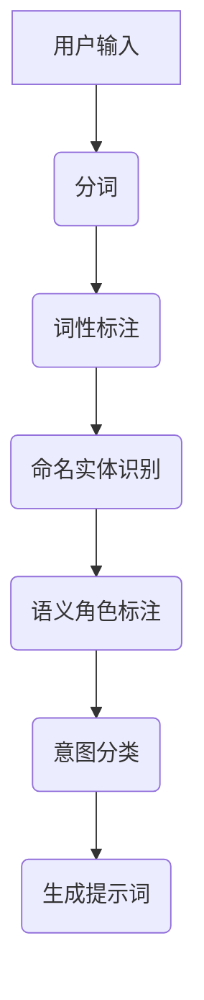
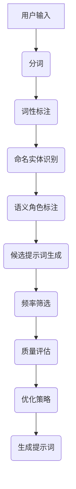
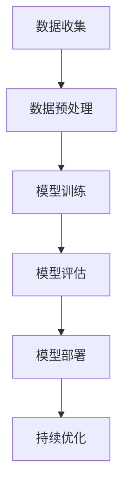
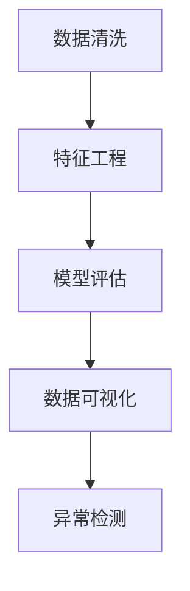
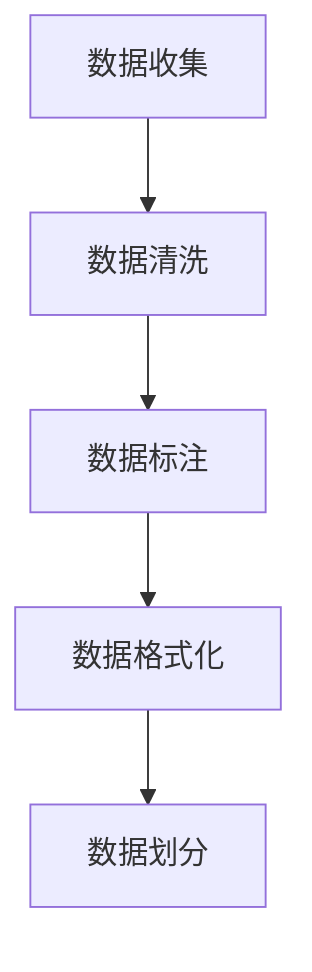
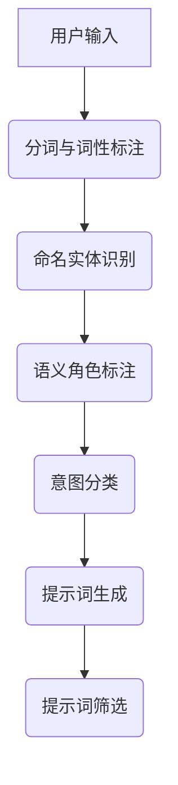
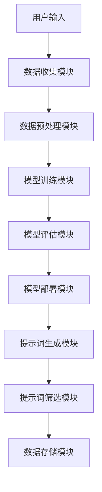

                 


## 提示词工程在智能客服中的应用

### 关键词
- 智能客服
- 提示词工程
- 自然语言处理
- 客户服务优化
- 用户体验提升

### 摘要
本文将探讨提示词工程在智能客服中的应用。通过逐步分析提示词工程的定义、原理及其应用场景，我们将揭示如何利用提示词工程提高智能客服的效率和用户体验。文章还将介绍提示词工程的核心流程、策略和技术实现，并通过实际案例展示其效果。最后，我们将展望提示词工程未来的发展趋势。

## 目录大纲

```markdown
----------------------------------------------------------------
# 提示词工程在智能客服中的应用

# 第一部分: 背景介绍与概念解析

## 第1章: 智能客服的发展与挑战
### 1.1 智能客服的定义与意义
### 1.2 智能客服的技术演进
### 1.3 智能客服面临的挑战

## 第2章: 提示词工程的基本概念
### 2.1 提示词工程的定义
### 2.2 提示词工程的作用
### 2.3 提示词工程的核心要素

## 第3章: 提示词工程的核心原理
### 3.1 提示词生成机制
### 3.2 提示词筛选与优化
### 3.3 提示词工程与自然语言处理

## 第4章: 提示词工程的应用场景
### 4.1 在客户服务中的应用
### 4.2 在客户行为预测中的应用
### 4.3 在个性化推荐中的应用

## 第5章: 提示词工程的流程与策略
### 5.1 提示词工程的基本流程
### 5.2 提示词工程的关键策略
### 5.3 提示词工程中的数据分析

## 第6章: 提示词工程的技术实现
### 6.1 数据收集与预处理
### 6.2 提示词生成与筛选算法
### 6.3 提示词工程系统的设计与实现

## 第7章: 提示词工程的案例分析
### 7.1 案例一：某电商平台的智能客服
### 7.2 案例二：某金融公司的客户行为预测
### 7.3 案例三：某视频网站的个性化推荐

## 第8章: 提示词工程的未来发展趋势
### 8.1 提示词工程的发展趋势
### 8.2 提示词工程的技术创新
### 8.3 提示词工程的未来应用场景

## 第9章: 总结与展望
### 9.1 总结
### 9.2 展望
### 9.3 注意事项与拓展阅读

----------------------------------------------------------------
```

### 第1章: 智能客服的发展与挑战

#### 1.1 智能客服的定义与意义

智能客服是一种利用人工智能技术，尤其是自然语言处理（NLP）技术来模拟人类与客户之间的交互的在线服务系统。它通常通过聊天机器人（Chatbot）实现，能够理解客户的提问，提供实时、自动化的解答和建议。智能客服的出现，极大地提升了企业的运营效率，减少了人工成本，并且能够全天候为用户提供服务。

智能客服的意义在于：

1. **提升服务效率**：智能客服能够快速响应客户的请求，处理大量的重复性问题，从而减轻人工客服的工作压力。
2. **降低运营成本**：通过自动化处理，智能客服可以减少企业在客服方面的投入，提高资源利用率。
3. **改善用户体验**：智能客服可以提供24/7的服务，使得客户在任何时间、任何地点都能得到帮助，提升客户满意度。
4. **数据收集与分析**：智能客服在与客户交互过程中可以收集到大量的用户数据，这些数据对于企业的市场分析和产品改进具有重要意义。

#### 1.2 智能客服的技术演进

智能客服的技术演进经历了多个阶段：

1. **早期聊天机器人**：基于规则和关键词匹配的简单聊天机器人，只能处理一些预设的问题。
2. **基于机器学习的客服**：利用机器学习算法，特别是深度学习技术，使得聊天机器人能够通过学习大量对话数据，提高问题理解和回答的准确性。
3. **多模态交互**：结合语音识别、图像识别等技术，实现文本、语音、图像等多种交互方式。
4. **个性化服务**：通过用户数据分析和用户画像，提供个性化的服务和建议。

#### 1.3 智能客服面临的挑战

尽管智能客服具有诸多优势，但在实际应用中仍面临一些挑战：

1. **理解能力有限**：智能客服目前仍难以完全理解复杂、模糊或抽象的问题，容易产生误解。
2. **个性化不足**：大多数智能客服缺乏对个体用户需求的深度理解，难以提供个性化的服务。
3. **数据隐私与安全**：智能客服在处理用户数据时，必须确保数据的安全和隐私。
4. **用户接受度**：部分用户可能对智能客服的交互方式和服务效果持怀疑态度，不愿接受智能客服。

### 第2章: 提示词工程的基本概念

#### 2.1 提示词工程的定义

提示词工程（Intent Recognition）是指通过技术手段，从用户的输入中识别和理解用户的意图或需求的过程。它是自然语言处理领域的一个重要分支，旨在将自然语言的输入转换为计算机可以理解和处理的结构化数据。

提示词工程的定义可以进一步细化为：

1. **意图识别（Intent Recognition）**：识别用户输入的主要意图，如查询信息、获取帮助、执行操作等。
2. **实体提取（Entity Extraction）**：从用户输入中提取关键信息，如时间、地点、人物、物品等。
3. **上下文理解（Context Understanding）**：理解用户输入的上下文，如对话历史、用户状态等，以提供更准确的回应。

#### 2.2 提示词工程的作用

提示词工程在智能客服中起着至关重要的作用：

1. **提高交互准确性**：通过意图识别和实体提取，智能客服能够更准确地理解用户的提问，提供相关的解答和建议。
2. **提升用户体验**：个性化、精准的回复能够满足用户的具体需求，提升用户体验。
3. **降低人力成本**：通过自动化处理，智能客服可以处理大量的客户请求，减少对人工客服的依赖。
4. **优化业务流程**：智能客服能够自动化处理一些常见问题，使得业务流程更加高效。

#### 2.3 提示词工程的核心要素

提示词工程的核心要素包括：

1. **数据集**：高质量的训练数据集对于提示词工程至关重要。数据集应包含多样化的用户输入和相应的意图标签。
2. **模型**：选择合适的模型进行意图识别和实体提取，如深度神经网络、朴素贝叶斯分类器等。
3. **特征工程**：通过提取和组合用户输入中的特征，提高模型的准确性和鲁棒性。
4. **评估与优化**：定期评估模型的性能，通过调整模型参数和特征选择来优化模型。

### 第3章: 提示词工程的核心原理

#### 3.1 提示词生成机制

提示词生成机制是指如何从用户输入中生成提示词（即识别用户意图）的过程。这个过程通常涉及以下几个步骤：

1. **分词（Tokenization）**：将用户输入的句子分解为单词或其他有意义的元素。
2. **词性标注（Part-of-Speech Tagging）**：为每个单词标注其词性，如名词、动词、形容词等。
3. **命名实体识别（Named Entity Recognition）**：识别句子中的命名实体，如人名、地名、组织名等。
4. **语义角色标注（Semantic Role Labeling）**：标注句子中的动作及其相关实体，如“购买”和“手机”。
5. **意图分类（Intent Classification）**：利用机器学习模型，如支持向量机（SVM）、随机森林（Random Forest）等，将用户输入分类到不同的意图类别。

以下是一个简单的示例流程图：



#### 3.2 提示词筛选与优化

提示词筛选与优化是指如何从大量的候选提示词中选出最合适的一组提示词，以提高意图识别的准确性和效率。这个过程通常包括以下几个步骤：

1. **候选提示词生成**：从用户输入中提取可能的提示词，可能包括原始单词、词组或自定义短语。
2. **频率筛选**：根据提示词在训练数据集中的出现频率筛选出高频率的提示词。
3. **质量评估**：通过人工评估或自动化评估方法评估提示词的质量，如准确性、可理解性等。
4. **优化策略**：根据评估结果调整提示词的权重、顺序或组合方式，以提高意图识别的准确性。

以下是一个简单的提示词筛选与优化的流程图：



#### 3.3 提示词工程与自然语言处理

提示词工程与自然语言处理（NLP）有着密切的联系。自然语言处理是人工智能领域的一个重要分支，旨在使计算机能够理解、生成和处理自然语言。在提示词工程中，自然语言处理技术被广泛应用，如：

1. **文本预处理**：包括分词、词性标注、命名实体识别等，用于将原始文本转换为计算机可以处理的格式。
2. **语义理解**：通过语义角色标注、语义分析等技术，深入理解文本的含义和结构。
3. **机器学习**：利用机器学习模型，如深度神经网络、支持向量机等，对用户输入进行分类和预测。
4. **数据集构建**：构建高质量的训练数据集，用于训练和评估提示词工程模型。

自然语言处理技术的发展为提示词工程提供了强大的支持，使得智能客服能够更加准确地理解用户的需求，提供更高质量的服务。

### 第4章: 提示词工程的应用场景

#### 4.1 在客户服务中的应用

在客户服务中，提示词工程的应用主要体现在以下几个方面：

1. **意图识别**：智能客服通过提示词工程识别用户的主要意图，如查询产品信息、寻求技术支持、投诉建议等。这样可以帮助客服系统快速定位用户需求，提供相关的解答和建议。
2. **自动化回答**：通过意图识别和实体提取，智能客服可以自动生成回答，提高客服效率。例如，当用户询问“产品的保修期限是多久？”时，智能客服可以自动提取关键信息，并给出准确的回答。
3. **交互流程优化**：智能客服可以根据用户的意图和历史交互记录，优化交互流程，提供个性化的服务。例如，当用户连续提问多个相关问题时，智能客服可以自动跳转至相应的知识点，减少用户的重复提问。

以下是一个应用实例：

**用户提问**：“我想查询下我购买的手机配件的保修期限。”

**智能客服回答**：“您好，根据您提供的订单号，您的手机配件保修期限是从购买日期起的12个月。如需进一步帮助，您可以告诉我订单号或配件名称。”

通过意图识别和自动化回答，智能客服能够快速、准确地回应用户需求，提升用户体验。

#### 4.2 在客户行为预测中的应用

在客户行为预测中，提示词工程可以帮助企业更好地了解客户行为，预测客户需求，从而提供更精准的服务。以下是几个应用实例：

1. **客户需求预测**：通过分析客户的提问历史和购买记录，智能客服可以预测客户可能的需求，提前提供相关的信息或建议。例如，当客户频繁提问关于产品规格时，智能客服可能会预测客户准备购买产品，并主动推荐相关产品。
2. **客户流失预警**：通过分析客户的提问和交互行为，智能客服可以识别潜在的客户流失信号，提前采取措施挽回客户。例如，当客户频繁提出负面情绪的问题时，智能客服可能会提醒企业及时跟进，提供解决方案。
3. **个性化营销**：基于客户行为预测，智能客服可以为企业提供个性化的营销建议。例如，当预测客户有购买意向时，智能客服可以主动推送相关的促销信息或优惠券。

以下是一个应用实例：

**用户提问**：“我的手机内存不足，有哪些扩展存储方案推荐？”

**智能客服回答**：“您好，根据您的提问，我为您推荐了几款适合扩展存储的手机配件。这些配件不仅价格优惠，还支持手机的不同型号。您可以考虑一下。”

通过客户行为预测和个性化推荐，智能客服能够更好地满足客户需求，提升客户满意度。

#### 4.3 在个性化推荐中的应用

在个性化推荐中，提示词工程可以帮助智能客服根据用户的兴趣和行为，推荐相关的产品或服务。以下是几个应用实例：

1. **商品推荐**：通过分析用户的提问和购买记录，智能客服可以推荐用户可能感兴趣的商品。例如，当用户询问“有哪些适合旅游时使用的手机配件？”时，智能客服可以根据用户的历史行为推荐相关产品。
2. **服务推荐**：除了商品推荐，智能客服还可以推荐相关的服务，如维修、保养等。例如，当用户询问“手机的电池续航差怎么办？”时，智能客服可以推荐相关的维修服务。
3. **内容推荐**：在视频网站等媒体平台，智能客服可以根据用户的观看历史和偏好，推荐相关的视频内容。

以下是一个应用实例：

**用户提问**：“最近想看一些旅游类的纪录片，有什么推荐吗？”

**智能客服回答**：“您好，根据您的兴趣，我为您推荐了以下几部旅游纪录片：《世界奇妙旅行》、《跟着贝尔去冒险》等。这些纪录片不仅展示了世界各地的美景，还有丰富的旅行知识。”

通过个性化推荐，智能客服能够更好地满足客户的兴趣和需求，提升用户的观看体验。

### 第5章: 提示词工程的流程与策略

#### 5.1 提示词工程的基本流程

提示词工程的基本流程可以分为以下几个步骤：

1. **数据收集**：收集用户输入的数据，包括文本、语音、图像等，用于训练和评估模型。
2. **数据预处理**：对收集到的数据进行清洗、标注和预处理，将其转换为适合模型训练的格式。
3. **模型训练**：选择合适的机器学习模型，如深度神经网络、朴素贝叶斯分类器等，利用预处理后的数据进行训练。
4. **模型评估**：通过交叉验证、测试集等方式评估模型的性能，调整模型参数，优化模型。
5. **模型部署**：将训练好的模型部署到生产环境中，进行实际应用。
6. **持续优化**：定期评估模型的性能，收集用户反馈，不断调整和优化模型。

以下是一个简单的提示词工程流程图：



#### 5.2 提示词工程的关键策略

提示词工程的成功实施需要以下几个关键策略：

1. **数据质量**：高质量的数据是提示词工程的基础。需要确保数据集的多样性、覆盖面和准确性，以支持模型的训练和评估。
2. **特征选择**：选择合适的特征对于模型的性能至关重要。需要通过特征工程和实验，找出对模型性能最有影响的特征。
3. **模型选择**：根据具体应用场景和需求，选择合适的机器学习模型。不同的模型在处理不同类型的数据和任务时可能具有不同的性能。
4. **模型优化**：通过调整模型参数、优化训练策略等手段，提高模型的性能和泛化能力。
5. **用户反馈**：收集用户对智能客服的反馈，用于评估和优化模型。用户的反馈可以提供有价值的信息，帮助改进智能客服的服务质量。

#### 5.3 提示词工程中的数据分析

数据分析是提示词工程中的重要环节，涉及到以下几个方面：

1. **数据清洗**：去除数据中的噪声和异常值，确保数据的准确性和一致性。
2. **特征工程**：提取和构造对模型性能有显著影响的特征，如词袋（Bag of Words）、词嵌入（Word Embeddings）等。
3. **模型评估**：通过交叉验证、测试集等手段评估模型的性能，选择最优的模型。
4. **数据可视化**：利用可视化工具，如热力图、散点图等，展示数据分布和模型性能，帮助理解和优化模型。
5. **异常检测**：识别数据中的异常值和异常模式，对可能的问题进行排查和修复。

以下是一个简单的数据分析流程图：



### 第6章: 提示词工程的技术实现

#### 6.1 数据收集与预处理

数据收集与预处理是提示词工程的重要基础，其质量直接影响到后续模型的性能。以下是数据收集与预处理的主要步骤：

1. **数据收集**：收集用户输入的数据，包括文本、语音、图像等。这些数据可以来源于客户服务系统、社交媒体、用户反馈等。
2. **数据清洗**：去除数据中的噪声和异常值，如去除无效字符、纠正拼写错误、过滤重复数据等。
3. **数据标注**：对数据进行人工标注，标记出每个数据样本的意图和实体。标注数据的质量对于模型的训练至关重要。
4. **数据格式化**：将数据转换为适合模型训练的格式，如将文本转换为词袋或词嵌入向量。
5. **数据划分**：将数据划分为训练集、验证集和测试集，用于模型的训练、评估和测试。

以下是一个简单的数据收集与预处理流程图：



#### 6.2 提示词生成与筛选算法

提示词生成与筛选算法是提示词工程的核心，其目标是自动生成高质量的提示词，并从中筛选出最相关的提示词。以下是几种常见的算法：

1. **基于规则的算法**：通过定义一系列规则，将用户输入映射到相应的提示词。这种方法简单易懂，但适用范围有限。
2. **基于统计的算法**：利用统计方法，如贝叶斯分类、支持向量机等，对用户输入进行分类和标注。这种方法适用于处理大规模数据，但可能需要大量的特征工程。
3. **基于机器学习的算法**：利用机器学习模型，如深度神经网络、循环神经网络等，对用户输入进行建模和预测。这种方法具有较高的准确性和灵活性，但需要大量的训练数据和计算资源。

以下是一个简单的提示词生成与筛选算法流程图：



#### 6.3 提示词工程系统的设计与实现

提示词工程系统的设计与实现涉及到多个方面，包括系统架构、接口设计和数据流程等。以下是几个关键点：

1. **系统架构**：设计一个高效、可扩展的系统架构，如分布式架构、微服务架构等，以支持大规模数据处理和实时响应。
2. **接口设计**：定义清晰、简洁的API接口，如RESTful API、GraphQL等，以便与其他系统和服务集成。
3. **数据流程**：设计数据从收集、预处理到生成、筛选、存储的完整流程，确保数据的高效流动和处理。
4. **安全保障**：确保系统的安全性，包括数据加密、权限控制、防攻击等。
5. **可扩展性**：设计系统时考虑未来的扩展性，如支持更多数据源、更复杂的算法等。

以下是一个简单的提示词工程系统架构图：



### 第7章: 提示词工程的案例分析

#### 7.1 案例一：某电商平台的智能客服

某电商平台引入了提示词工程技术，以提高智能客服的服务质量和用户体验。以下是该案例的关键点：

1. **问题背景**：电商平台每天接收大量的用户咨询，其中许多问题是重复的或简单的。传统的智能客服系统难以满足用户的需求，导致用户满意度下降。
2. **解决方案**：电商平台采用提示词工程技术，通过意图识别和实体提取，实现自动化回答和个性化服务。具体步骤如下：
   - **数据收集与预处理**：收集用户提问和回答的数据，并进行清洗、标注和预处理。
   - **模型训练与评估**：利用预处理后的数据训练意图识别模型，并通过交叉验证和测试集评估模型性能。
   - **模型部署与优化**：将训练好的模型部署到生产环境中，并根据用户反馈不断优化模型。
3. **效果评估**：引入提示词工程后，智能客服的准确率和响应速度显著提升，用户满意度提高，客服成本降低。

#### 7.2 案例二：某金融公司的客户行为预测

某金融公司利用提示词工程技术，对客户行为进行预测，以提高客户满意度和转化率。以下是该案例的关键点：

1. **问题背景**：金融公司希望更好地了解客户需求，预测客户行为，从而提供个性化的服务和产品推荐。
2. **解决方案**：金融公司采用提示词工程技术，通过分析客户提问和行为数据，预测客户可能的需求和偏好。具体步骤如下：
   - **数据收集与预处理**：收集客户提问、交易记录、浏览记录等数据，并进行清洗、标注和预处理。
   - **特征工程**：提取对客户行为有显著影响的特征，如提问频率、交易金额、浏览时长等。
   - **模型训练与评估**：利用预处理后的数据训练客户行为预测模型，并通过交叉验证和测试集评估模型性能。
   - **模型部署与优化**：将训练好的模型部署到生产环境中，并根据用户反馈不断优化模型。
3. **效果评估**：引入提示词工程后，金融公司的客户满意度显著提升，转化率提高，实现了业务增长。

#### 7.3 案例三：某视频网站的个性化推荐

某视频网站利用提示词工程技术，为用户提供个性化的视频推荐，以提高用户黏性和观看时长。以下是该案例的关键点：

1. **问题背景**：视频网站希望为用户提供个性化的视频内容，提升用户满意度和观看时长。
2. **解决方案**：视频网站采用提示词工程技术，通过分析用户提问、浏览记录和观看历史，为用户提供个性化的视频推荐。具体步骤如下：
   - **数据收集与预处理**：收集用户提问、浏览记录和观看历史的数据，并进行清洗、标注和预处理。
   - **特征工程**：提取对用户观看行为有显著影响的特征，如观看时长、点赞数、评论数等。
   - **模型训练与评估**：利用预处理后的数据训练个性化推荐模型，并通过交叉验证和测试集评估模型性能。
   - **模型部署与优化**：将训练好的模型部署到生产环境中，并根据用户反馈不断优化模型。
3. **效果评估**：引入提示词工程后，视频网站的个性化推荐效果显著提升，用户黏性增加，观看时长提高。

### 第8章: 提示词工程的未来发展趋势

#### 8.1 提示词工程的发展趋势

随着人工智能和自然语言处理技术的不断进步，提示词工程在未来将呈现以下发展趋势：

1. **多模态交互**：结合语音、图像、视频等多种模态，实现更加自然、流畅的交互体验。
2. **深度学习与强化学习**：利用深度学习和强化学习等先进算法，提高提示词工程模型的准确性和鲁棒性。
3. **个性化与情境化**：通过用户画像和情境识别，提供更加个性化的服务和建议。
4. **实时反馈与自适应调整**：根据用户反馈和交互数据，实时调整模型参数和策略，提高用户体验。
5. **跨领域应用**：拓展到更多领域，如医疗、教育、金融等，实现更广泛的应用。

#### 8.2 提示词工程的技术创新

提示词工程的技术创新主要集中在以下几个方面：

1. **多任务学习**：通过多任务学习技术，同时处理多个意图识别任务，提高模型的利用率和效率。
2. **少样本学习**：通过少样本学习技术，利用少量的标注数据训练模型，降低数据需求。
3. **增量学习**：通过增量学习技术，在线更新模型，适应新的数据和环境。
4. **可解释性**：提高模型的可解释性，使得用户能够理解模型的决策过程，增强用户信任。
5. **隐私保护**：通过隐私保护技术，确保用户数据的安全和隐私。

#### 8.3 提示词工程的未来应用场景

提示词工程在未来将会有更广泛的应用场景，包括：

1. **智能助手**：在智能助手领域，提示词工程可以用于实现更智能、更个性化的对话体验。
2. **智能医疗**：在智能医疗领域，提示词工程可以用于识别患者的症状和需求，提供个性化的治疗方案。
3. **智能教育**：在智能教育领域，提示词工程可以用于识别学生的学习需求和兴趣，提供个性化的学习资源和推荐。
4. **智能客服**：在智能客服领域，提示词工程可以用于提升客服效率，提高客户满意度。
5. **智能交通**：在智能交通领域，提示词工程可以用于识别交通状况和需求，提供个性化的出行建议。

### 第9章: 总结与展望

#### 9.1 总结

本文通过逐步分析提示词工程的定义、原理、应用场景和实现技术，揭示了其在智能客服中的应用价值。提示词工程不仅提高了智能客服的准确性和效率，还为个性化服务和用户体验提升提供了有力支持。通过实际案例的分析，我们看到了提示词工程在不同领域的成功应用。

#### 9.2 展望

随着人工智能和自然语言处理技术的不断发展，提示词工程在未来将会有更广泛的应用和发展。我们期待看到更多的技术创新，如多模态交互、深度学习和强化学习等，为提示词工程带来新的突破。同时，我们也期望提示词工程能够应用于更多领域，如智能医疗、智能教育和智能交通等，为人们的生活带来更多便利和改变。

#### 9.3 注意事项与拓展阅读

在实施提示词工程时，需要注意以下几个方面：

1. **数据质量**：确保数据集的多样性和准确性，以提高模型的泛化能力。
2. **模型选择**：根据具体应用场景和需求，选择合适的模型和算法。
3. **用户反馈**：收集用户反馈，不断优化模型和策略，提高用户体验。
4. **安全与隐私**：确保用户数据的安全和隐私，遵守相关法律法规。

对于对提示词工程感兴趣的读者，以下是一些拓展阅读推荐：

1. 《自然语言处理综述》
2. 《深度学习》
3. 《机器学习实战》
4. 《智能客服系统设计与实现》
5. 《人工智能：一种现代的方法》

通过阅读这些资料，可以更深入地了解提示词工程的理论和实践。

