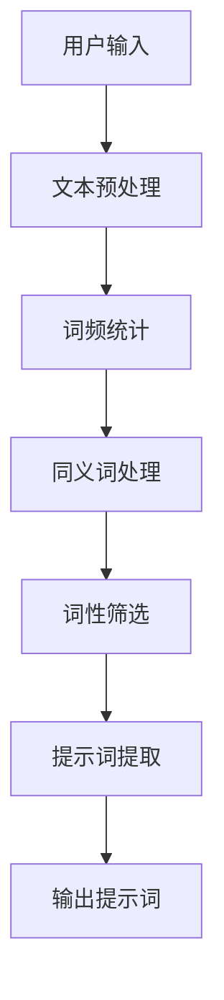

                 

### 《提示词工程在智能客服系统中的应用与优化》

> 关键词：智能客服系统、提示词工程、算法原理、系统架构设计、优化策略

> 摘要：本文首先介绍了智能客服系统的需求背景和提示词工程的概念，随后详细阐述了提示词工程在智能客服系统中的关键作用。通过剖析提示词的生成算法、数学模型以及系统架构设计，本文提供了一系列有效的优化策略，旨在提升智能客服系统的性能和用户体验。文章最后提出了实际应用案例，展示了提示词工程在智能客服系统中的实战效果，并总结了最佳实践和未来发展方向。

---

### 目录

1. **概述**
   1.1.1 问题背景
   1.1.2 问题描述
   1.1.3 问题解决思路
   1.1.4 边界与外延
   1.1.5 核心概念

2. **核心概念与联系**
   2.1.1 提示词原理
   2.1.2 提示词属性特征对比表格
   2.1.3 智能客服系统与提示词工程的关系

3. **算法原理讲解**
   3.1.1 提示词生成算法
   3.1.2 Python源代码示例
   3.1.3 数学模型和公式讲解

4. **数学模型和数学公式详细讲解与举例说明**
   4.1.1 数学模型
   4.1.2 举例说明

5. **系统分析与架构设计**
   5.1.1 问题场景介绍
   5.1.2 系统功能设计
   5.1.3 系统架构设计

6. **项目实战**
   6.1.1 环境安装
   6.1.2 系统核心实现源代码
   6.1.3 代码应用解读与分析
   6.1.4 实际案例分析与详细讲解剖析
   6.1.5 项目小结

7. **最佳实践 Tips、小结、注意事项、拓展阅读**

---

### 第一部分：概述

#### 1.1.1 问题背景

随着互联网和电子商务的快速发展，用户对智能客服系统的需求日益增长。智能客服系统作为一种自动化工具，能够有效地提高客户服务质量、降低运营成本，并提高用户满意度。然而，智能客服系统的效果在很大程度上取决于其核心组成部分——提示词工程。

提示词工程是指通过一系列技术和方法，设计、生成和维护提示词库的过程。提示词是智能客服系统与用户进行交互的关键桥梁，通过精准匹配用户问题和提供合适的回答，实现对用户需求的快速响应和准确解答。

在智能客服系统中，提示词工程的作用主要体现在以下几个方面：

1. **问题识别和分类**：通过分析用户输入的问题，智能客服系统需要将其分类到相应的领域或主题。提示词工程为此提供了具体的词库和匹配规则，使得系统能够快速准确地识别和分类问题。
2. **回答生成**：提示词工程负责生成针对特定问题的答案。通过结合上下文信息和提示词库，系统能够构建出符合用户需求的回答。
3. **用户体验优化**：优秀的提示词工程能够提升用户的交互体验。通过提供相关、准确和有价值的回答，系统能够更好地满足用户的需求，增强用户对智能客服系统的信任和满意度。

因此，提示词工程在智能客服系统中扮演着至关重要的角色。本文将深入探讨提示词工程在智能客服系统中的应用与优化，为读者提供一系列实用的解决方案和优化策略。

#### 1.1.2 问题描述

尽管提示词工程在智能客服系统中具有显著的重要性，但其在实际应用中仍面临一系列挑战和问题。

首先，提示词质量直接影响智能客服系统的性能和用户体验。低质量的提示词可能导致系统无法准确识别用户问题，提供不相关或错误的回答，从而降低用户满意度。因此，如何确保提示词的质量成为了一个亟待解决的问题。

其次，提示词的覆盖度也是一个关键问题。提示词库的覆盖度决定了系统能够解决的用户问题的范围。一个覆盖度较低的提示词库可能会导致系统无法回答部分用户问题，从而影响系统的全面性和实用性。

此外，随着用户需求和问题的多样化，提示词工程需要不断地进行更新和维护。传统的手动编写和维护提示词的方法不仅费时费力，而且难以满足快速变化的用户需求。因此，如何实现提示词的自动化生成和优化成为了一个重要的研究方向。

最后，提示词工程与其他技术的关联也需要进一步探讨。例如，自然语言处理技术、机器学习和深度学习技术等在提示词工程中的应用，可以进一步提升系统的智能化程度和回答质量。

综上所述，提示词工程在智能客服系统中的应用面临着一系列挑战和问题。通过深入分析这些问题的本质和原因，我们可以找到相应的解决思路和优化策略，从而提升智能客服系统的性能和用户体验。

#### 1.1.3 问题解决思路

为了解决提示词工程在智能客服系统中的应用问题，我们可以从以下几个方面进行思考和探索：

1. **提示词质量提升**：提高提示词的质量是提升智能客服系统性能的关键。我们可以通过改进提示词生成算法，引入更多有效的特征，结合用户反馈和上下文信息，来确保生成的提示词具有较高的准确性和相关性。同时，对现有提示词库进行定期更新和维护，及时删除过时或不准确的提示词，以保证系统的稳定性和可靠性。

2. **自动化提示词生成**：传统的手动编写和维护提示词的方法存在效率低、难以适应变化等问题。因此，我们可以探索自动化提示词生成技术，结合自然语言处理、机器学习和深度学习等方法，自动从大量用户问题和回答中提取有效的提示词。通过数据驱动的方式，系统能够不断优化和更新提示词库，从而更好地满足用户需求。

3. **多模态融合**：在智能客服系统中，用户输入的形式可以是文本、语音、图像等。我们可以通过多模态融合技术，将不同类型的输入信息进行整合和处理，从而生成更加丰富和准确的提示词。例如，结合文本和语音输入，系统能够更好地理解和识别用户的需求，提供更符合用户期望的回答。

4. **用户反馈机制**：用户反馈是优化智能客服系统的重要依据。我们可以引入用户反馈机制，鼓励用户对系统的回答进行评价和反馈。通过分析用户反馈，我们可以发现系统存在的问题和不足，及时进行调整和改进。同时，用户反馈还可以作为训练数据，进一步优化提示词生成算法和模型。

5. **系统架构优化**：智能客服系统的性能不仅取决于提示词工程，还受到系统架构设计的影响。我们可以通过优化系统架构，提高系统的可扩展性、稳定性和性能。例如，采用分布式架构，将系统划分为多个模块，实现模块化设计和部署，以提高系统的灵活性和可维护性。

综上所述，通过提升提示词质量、自动化生成、多模态融合、用户反馈机制和系统架构优化等方面，我们可以有效地解决提示词工程在智能客服系统中的应用问题，提升系统的性能和用户体验。

#### 1.1.4 边界与外延

提示词工程的应用领域广泛，不仅限于智能客服系统，还可以扩展到其他领域。例如：

1. **智能问答系统**：提示词工程在智能问答系统中起到了核心作用。通过生成和优化提示词，系统能够更好地理解用户问题，提供准确和相关的回答，从而提升用户体验。

2. **智能推荐系统**：在智能推荐系统中，提示词工程可以帮助系统更好地理解用户兴趣和需求，从而提供个性化的推荐结果。通过分析用户行为数据和提示词库，系统可以生成更精准的推荐词，提高推荐效果。

3. **智能语音助手**：智能语音助手依赖于提示词工程来实现与用户的自然语言交互。通过丰富的提示词库和高效的生成算法，语音助手能够更好地理解用户指令，提供准确的回答和操作。

4. **智能客服机器人**：除了文本交互，智能客服机器人还涉及语音、图像等多模态交互。提示词工程在多模态交互中的应用，使得机器人能够更全面地理解用户需求，提供更加个性化的服务。

此外，提示词工程与其他技术的关联也非常紧密。例如：

1. **自然语言处理（NLP）**：提示词工程与NLP技术密切相关。NLP技术为提示词工程提供了文本处理和分析的工具，使得系统能够更好地理解用户输入和生成高质量的回答。

2. **机器学习和深度学习**：机器学习和深度学习技术在提示词工程中发挥了重要作用。通过训练大规模数据集，系统能够自动学习和生成高质量的提示词，提高系统的智能化程度和回答质量。

3. **数据挖掘**：数据挖掘技术在提示词工程中也有广泛应用。通过分析用户行为数据和交互日志，系统能够发现用户需求的变化趋势，为提示词的优化和更新提供数据支持。

总之，提示词工程在智能客服系统中的应用不仅局限于单一领域，还与其他技术和系统紧密关联，共同推动智能客服系统的不断发展。

#### 1.1.5 核心概念

为了深入理解提示词工程在智能客服系统中的应用与优化，我们需要明确几个核心概念：

1. **提示词**：提示词是智能客服系统与用户进行交互的关键元素，它代表了系统能够理解和回答的问题或命令。一个有效的提示词应具备以下特点：准确、简洁、具有广泛的覆盖度，并能适应不同的语境和场景。

2. **智能客服系统**：智能客服系统是一种利用人工智能技术，模拟人类客服人员与用户进行交互的系统。它能够自动识别用户问题、生成回答，并处理用户反馈，以提高客户服务质量和用户体验。

3. **提示词工程**：提示词工程是指通过一系列技术和方法，设计、生成和维护提示词库的过程。它包括提示词的提取、筛选、分类、优化等环节，旨在提高提示词的质量和覆盖度，从而提升智能客服系统的性能和用户体验。

4. **提示词生成算法**：提示词生成算法是提示词工程的核心组成部分，负责从大量用户问题和回答中自动提取和生成高质量的提示词。常见的生成算法包括基于统计的方法、机器学习方法、深度学习方法等。

5. **数学模型**：数学模型用于描述提示词生成和优化的过程，包括概率模型、优化模型等。这些模型可以指导算法的设计和实现，提高提示词生成和优化的效果。

通过理解这些核心概念，我们可以更好地把握提示词工程在智能客服系统中的应用和优化，从而提升系统的性能和用户体验。

### 第二部分：核心概念与联系

#### 2.1.1 提示词原理

提示词工程是智能客服系统的核心组成部分，其原理和实现方式直接影响到系统的性能和用户体验。以下将详细解释提示词的定义、工作原理及其在智能客服系统中的应用。

**定义：**

提示词，即用于描述用户问题或命令的关键词或短语，它能够帮助智能客服系统快速识别和理解用户意图。有效的提示词应具备以下特点：

1. **准确性**：提示词需要精确地表达用户问题或命令的核心内容，以便系统能够准确识别和回答。
2. **简洁性**：提示词应尽量简洁明了，避免冗长和复杂的表达，以便系统能够快速理解和处理。
3. **广泛覆盖度**：提示词应具备广泛的覆盖度，能够涵盖不同场景和语境下的用户问题。

**工作原理：**

智能客服系统的工作原理可以分为以下几个步骤：

1. **用户输入**：用户通过文字、语音或图像等多种形式输入问题或命令。
2. **输入处理**：系统对用户输入进行处理，包括文本分词、词性标注、去噪等步骤，以便提取出有效的关键词或短语。
3. **提示词匹配**：系统通过提示词库与处理后的用户输入进行匹配，找到与用户意图最接近的提示词。
4. **回答生成**：系统根据匹配到的提示词，生成相应的回答或执行相应的操作。
5. **用户反馈**：用户对系统的回答进行评价和反馈，系统根据反馈对提示词库进行优化和调整。

**应用：**

在智能客服系统中，提示词的应用主要体现在以下几个方面：

1. **问题识别与分类**：通过提示词，系统可以快速识别和理解用户问题的主题和内容，将其分类到相应的领域或主题，以便提供准确的回答。
2. **回答生成**：提示词是生成回答的关键依据。系统根据提示词，结合知识库和语料库，生成与用户问题相关的回答或建议。
3. **用户体验优化**：通过丰富的提示词库和高效的匹配算法，系统可以提供更加相关和准确的服务，从而提升用户的交互体验和满意度。

#### 2.1.2 提示词属性特征对比表格

为了更好地理解提示词的属性特征，我们可以通过对比表格的形式来展示不同的特征及其定义和作用。

| 特征       | 定义                                                         | 对比分析                     |
|------------|--------------------------------------------------------------|------------------------------|
| 语境适应性 | 提示词能够根据不同的语境和场景进行灵活调整和适应               | 提高客服响应的准确性         |
| 灵活性     | 提示词能够灵活应对用户问题的变化，包括同义词、变种表达等       | 提高用户体验                 |
| 覆盖度     | 提示词能够覆盖广泛的用户问题，包括常见问题和特殊问题           | 提高问题解答能力             |
| 准确性     | 提示词能够准确表达用户问题的核心内容，减少误解和歧义           | 提高客服响应的准确性         |
| 简洁性     | 提示词表述简洁明了，避免冗长和复杂的表达，便于系统快速理解     | 提高系统处理效率             |

通过上述表格，我们可以看到不同提示词属性特征的定义和作用。在实际应用中，这些特征将直接影响智能客服系统的性能和用户体验。因此，在设计提示词工程时，需要综合考虑这些特征，以实现最优的效果。

#### 2.1.3 智能客服系统与提示词工程的关系

智能客服系统与提示词工程之间存在紧密的联系和相互影响。以下将详细探讨这两者之间的关联及其相互作用。

**智能客服系统架构与提示词工程的关系**

智能客服系统的架构通常包括以下几个关键组成部分：用户接口、自然语言处理（NLP）模块、知识库、提示词库和反馈机制。其中，提示词工程作为核心组成部分之一，与智能客服系统的其他组件紧密相连。

1. **用户接口**：用户接口是智能客服系统与用户进行交互的桥梁，用户通过输入问题或命令与系统进行互动。用户接口将用户输入传递给NLP模块进行进一步处理。

2. **自然语言处理（NLP）模块**：NLP模块负责对用户输入进行处理，包括文本分词、词性标注、句法分析等步骤，以便提取出有效的关键词或短语。这些处理后的数据将作为提示词工程的一部分，用于后续的匹配和回答生成。

3. **知识库**：知识库是智能客服系统的重要组成部分，包含了各种领域知识和问题回答。提示词工程通过对知识库中的内容进行分类和索引，生成相应的提示词，以便在用户输入时进行快速匹配和回答生成。

4. **提示词库**：提示词库是提示词工程的输出结果，包含了大量经过筛选和优化的提示词。提示词库不仅用于匹配用户输入，还用于生成回答和执行操作。因此，提示词库的质量直接影响智能客服系统的性能和用户体验。

5. **反馈机制**：反馈机制是智能客服系统的优化途径之一，通过收集用户的反馈和评价，系统可以不断调整和优化提示词库，提高其准确性和覆盖度。反馈机制与提示词工程相互关联，形成了一个动态优化的闭环。

**提示词工程对智能客服系统的影响**

提示词工程对智能客服系统的影响主要体现在以下几个方面：

1. **问题识别和分类**：通过提示词工程，智能客服系统可以快速识别和理解用户问题的主题和内容，将其分类到相应的领域或主题。这有助于系统提供更精准和针对性的回答。

2. **回答生成**：提示词工程生成高质量的提示词，使得智能客服系统在回答生成过程中更加准确和高效。通过匹配提示词库中的提示词，系统可以快速生成与用户问题相关的回答，提高回答的准确性和相关性。

3. **用户体验优化**：优秀的提示词工程可以提升用户的交互体验。通过提供相关、准确和有价值的回答，系统可以更好地满足用户需求，增强用户对智能客服系统的信任和满意度。

4. **系统性能优化**：提示词工程通过对提示词的优化和更新，可以提高系统的性能和稳定性。例如，通过删除过时或不准确的提示词、增加新的热点问题提示词等，系统可以更好地应对用户需求的变化，提高其响应速度和处理能力。

总之，提示词工程在智能客服系统中扮演着至关重要的角色。通过与智能客服系统各组件的紧密配合，提示词工程可以显著提升系统的性能和用户体验，为用户提供更高效、精准和个性化的服务。

### 第三部分：算法原理讲解

#### 3.1.1 提示词生成算法

提示词生成算法是提示词工程的核心组成部分，其目标是从大量用户问题和回答中提取出有效的提示词，以提升智能客服系统的性能和用户体验。以下将详细介绍提示词生成算法的基本原理和具体实现。

**基本原理**

提示词生成算法的基本原理是通过分析和处理用户输入的问题和回答，提取出能够代表用户问题核心内容的关键词或短语。具体步骤如下：

1. **文本预处理**：对用户输入的问题和回答进行文本预处理，包括去除停用词、标点符号、进行词性标注等操作。文本预处理有助于提高后续处理的准确性和效率。

2. **词频统计**：对预处理后的文本进行词频统计，计算每个词在用户输入中的出现频率。高频词通常与用户问题的核心内容密切相关，可以作为潜在的提示词。

3. **同义词处理**：考虑到用户可能使用不同的表达方式来描述同一问题，算法需要对同义词进行统一处理。通过同义词识别和替换，确保生成的提示词能够涵盖不同的表达方式。

4. **词性筛选**：筛选出与用户问题相关的词性，如名词、动词等。词性筛选有助于提高提示词的准确性和相关性。

5. **提示词提取**：基于词频统计和词性筛选，从处理后的文本中提取出潜在的有效提示词。常用的提示词提取方法包括基于TF-IDF（词频-逆文档频率）的方法、基于文本分类的方法等。

**流程图**

为了更好地理解提示词生成算法，我们可以使用mermaid绘制其流程图：



**实现方法**

以下是一个简单的Python示例代码，展示了如何实现提示词生成算法的基本步骤：

```python
import jieba
from collections import Counter

def preprocess_text(text):
    # 去除停用词和标点符号
    stop_words = ['的', '和', '等']
    words = jieba.cut(text)
    filtered_words = [word for word in words if word not in stop_words]
    return filtered_words

def extract_suggestions(text):
    words = preprocess_text(text)
    word_freq = Counter(words)
    suggestions = [word for word, freq in word_freq.items() if freq > 2]
    return suggestions

# 示例
input_question = "请问如何设置Wi-Fi密码？"
suggestions = extract_suggestions(input_question)
print(suggestions)
```

通过上述示例代码，我们可以看到提示词生成算法的基本实现过程。首先对用户输入的问题进行预处理，然后进行词频统计和提示词提取，最终生成有效的提示词列表。

#### 3.1.2 Python源代码示例

以下是一个具体的Python代码示例，展示了如何利用jieba库和NLTK库实现提示词生成算法。这个示例包括文本预处理、词频统计、同义词处理和提示词提取等功能。

```python
import jieba
from nltk.corpus import wordnet
from collections import Counter

def preprocess_text(text):
    # 去除停用词和标点符号
    stop_words = ['的', '和', '等']
    words = jieba.cut(text)
    filtered_words = [word for word in words if word not in stop_words]
    return filtered_words

def get_synonyms(word):
    synonyms = set()
    for syn in wordnet.synsets(word):
        for lemma in syn.lemmas():
            synonyms.add(lemma.name())
    return synonyms

def extract_suggestions(text):
    words = preprocess_text(text)
    word_freq = Counter(words)
    word_synonyms = {}
    for word in words:
        synonyms = get_synonyms(word)
        word_synonyms[word] = synonyms
    suggestions = []
    for word, freq in word_freq.items():
        if freq > 2:
            suggestions.extend([syn for syn in word_synonyms[word]])
    return suggestions

# 示例
input_question = "请问如何设置Wi-Fi密码？"
suggestions = extract_suggestions(input_question)
print(suggestions)
```

**代码解读**

1. **文本预处理**：使用jieba库对输入文本进行分词，并去除常见的停用词和标点符号。这一步有助于提高后续处理的准确性和效率。

2. **同义词处理**：利用NLTK库中的wordnet模块获取每个词的同义词。这一步骤可以确保生成的提示词能够涵盖不同的表达方式，提高提示词的覆盖度和灵活性。

3. **提示词提取**：基于词频统计和同义词处理，从预处理后的文本中提取出高频词和其同义词。这些词和短语将被作为有效的提示词，用于后续的匹配和回答生成。

通过上述代码示例，我们可以看到如何使用Python实现提示词生成算法。这个示例不仅展示了算法的基本实现步骤，还提供了一种有效的实现方法，使得提示词生成过程更加自动化和高效。

#### 3.1.3 数学模型和公式讲解

在提示词工程中，数学模型和公式起到了关键作用。它们不仅能够指导算法的设计和实现，还能够优化提示词的生成和选择过程。以下将详细讲解提示词生成算法中的数学模型和公式。

**1. 提示词生成概率模型**

提示词生成概率模型用于描述在给定用户问题Q的情况下，生成每个提示词s的概率。这一模型的基本公式如下：

$$ P(S|Q) = \frac{P(Q|S) \cdot P(S)}{P(Q)} $$

其中：
- $P(S|Q)$：在给定问题Q的情况下选择提示词s的概率。
- $P(Q|S)$：在提示词s存在的情况下生成问题Q的概率。
- $P(S)$：提示词s的先验概率。
- $P(Q)$：问题Q的先验概率。

通过上述公式，我们可以计算每个提示词s在给定问题Q下的生成概率。这个概率模型可以帮助我们选择最有可能与用户问题相关的提示词。

**2. 提示词选择模型**

提示词选择模型的目的是从所有可能的提示词中选择最优的提示词。其基本公式如下：

$$ Maximize \sum_{s \in S} P(s|Q) \cdot R(s) $$

其中：
- $P(s|Q)$：在给定问题Q的情况下选择提示词s的概率。
- $R(s)$：提示词s的反馈质量，通常表示用户对提示词s的满意度或准确度。

通过上述公式，我们可以计算每个提示词s的预期反馈质量，从而选择最优的提示词。

**举例说明**

假设我们有一个问题：“如何设置Wi-Fi密码？”，我们需要从多个提示词中选择最优的提示词。以下是一个简化的示例：

1. 提示词列表：["设置Wi-Fi密码", "配置Wi-Fi密码", "Wi-Fi密码设置"]
2. 提示词生成概率：$P(S|Q)$分别为0.6、0.5和0.4
3. 提示词反馈质量：$R(s)$分别为0.8、0.7和0.6

根据提示词选择模型，我们可以计算每个提示词的预期反馈质量：

- $P(S_1|Q) \cdot R(S_1) = 0.6 \cdot 0.8 = 0.48$
- $P(S_2|Q) \cdot R(S_2) = 0.5 \cdot 0.7 = 0.35$
- $P(S_3|Q) \cdot R(S_3) = 0.4 \cdot 0.6 = 0.24$

根据上述计算结果，我们可以选择预期反馈质量最高的提示词，即“设置Wi-Fi密码”。

通过上述示例，我们可以看到如何使用数学模型和公式进行提示词选择。这些模型和公式不仅提供了理论依据，还能够在实际应用中帮助我们优化提示词的生成和选择过程。

### 第四部分：数学模型和数学公式详细讲解与举例说明

#### 4.1.1 数学模型

在提示词工程中，数学模型发挥着至关重要的作用，特别是提示词选择模型，它可以帮助我们在众多候选提示词中找到最优解。以下将详细讲解提示词选择模型，并解释其数学原理。

**提示词选择模型**

提示词选择模型的核心目标是从所有可能的提示词中选择最优的提示词，以实现最佳的用户体验和系统性能。该模型的基本公式如下：

$$ Maximize \sum_{s \in S} P(s|Q) \cdot R(s) $$

其中：
- $P(s|Q)$：在给定问题Q的情况下选择提示词s的概率。
- $R(s)$：提示词s的反馈质量，通常表示用户对提示词s的满意度或准确度。

**模型解释**

1. **$P(s|Q)$**：这一部分表示提示词s在给定问题Q下的匹配概率。匹配概率取决于提示词库中的统计信息和问题Q的特征。通常，我们会使用文本分类模型、贝叶斯模型或者基于深度学习的模型来预测每个提示词s在问题Q下的概率。

2. **$R(s)$**：这一部分表示提示词s的反馈质量。反馈质量通常基于用户的评价、点击率或者后续的操作。高质量提示词意味着用户对其回答的满意度更高。

3. **目标函数**：目标函数$\sum_{s \in S} P(s|Q) \cdot R(s)$表示在给定问题Q下，所有提示词s的匹配概率与反馈质量的乘积之和。我们的目标是最大化这个目标函数，以找到最优的提示词s。

通过这个模型，我们可以量化每个提示词的潜在价值，并从中选择最合适的提示词来响应用户的问题。

**4.1.2 举例说明**

为了更好地理解这个数学模型，我们可以通过一个简单的例子来演示其应用。

**例子**：假设我们有一个问题“如何重置路由器密码？”，我们需要从以下三个提示词中选择一个：

1. 提示词A：“如何重置路由器密码？”
2. 提示词B：“如何恢复路由器密码？”
3. 提示词C：“如何更改路由器密码？”

**步骤1：计算匹配概率**

假设通过某种算法，我们得到了每个提示词在给定问题下的匹配概率：

- $P(A|Q) = 0.8$
- $P(B|Q) = 0.7$
- $P(C|Q) = 0.6$

**步骤2：计算反馈质量**

假设我们根据用户的反馈数据计算出了每个提示词的反馈质量：

- $R(A) = 0.9$
- $R(B) = 0.8$
- $R(C) = 0.85$

**步骤3：计算目标函数**

使用公式$\sum_{s \in S} P(s|Q) \cdot R(s)$，我们可以计算每个提示词的加权分数：

- 对于提示词A：$P(A|Q) \cdot R(A) = 0.8 \cdot 0.9 = 0.72$
- 对于提示词B：$P(B|Q) \cdot R(B) = 0.7 \cdot 0.8 = 0.56$
- 对于提示词C：$P(C|Q) \cdot R(C) = 0.6 \cdot 0.85 = 0.51$

**步骤4：选择最优提示词**

通过比较这些加权分数，我们可以发现提示词A的分数最高，因此选择提示词A作为最佳答案。

通过这个例子，我们可以看到如何使用数学模型来选择最优的提示词。这个模型不仅帮助我们量化了每个提示词的价值，还提供了明确的决策依据，使得提示词选择过程更加科学和高效。

### 第五部分：系统分析与架构设计

#### 5.1.1 问题场景介绍

为了更好地理解和应用提示词工程，我们首先需要明确一个具体的应用场景。在这个场景中，我们选择智能客服系统在电商平台的运用作为案例。

**场景背景**：

随着电商平台的快速发展，客户服务部门面临着日益增长的服务请求和复杂多样的用户问题。为了提高服务质量和运营效率，电商平台引入了智能客服系统，希望通过自动化和智能化的方式，实现高效、精准和个性化的客户服务。

**主要任务**：

智能客服系统的核心任务包括：

1. **问题识别与分类**：快速、准确地识别用户问题，并将其分类到相应的领域或主题，如订单查询、支付问题、物流跟踪等。
2. **回答生成**：根据用户问题和分类结果，生成合适的回答或提供解决方案。
3. **用户体验优化**：通过分析用户反馈和行为数据，不断优化系统性能和交互体验，提高用户满意度。

**挑战**：

在电商平台的智能客服系统中，存在以下几个挑战：

1. **用户问题多样化**：用户问题类型繁多，包括常见问题和特殊情况，如何准确识别和分类这些问题是一个重要挑战。
2. **回答质量要求高**：电商平台对客服系统的回答质量要求较高，需要提供准确、相关和有用的回答。
3. **实时响应需求**：智能客服系统需要在短时间内处理大量用户请求，确保实时响应。

通过分析上述场景和挑战，我们可以为后续的架构设计和功能实现提供清晰的指导和依据。

#### 5.1.2 系统功能设计

在智能客服系统在电商平台的应用场景中，系统的功能设计至关重要。以下将详细描述系统的功能模块和设计思路。

**1. 用户接口模块**

用户接口模块是智能客服系统的入口，用户可以通过文字、语音、图像等多种方式与系统进行交互。其主要功能包括：

- **输入处理**：接收用户的输入请求，进行文本预处理，如分词、去除停用词等。
- **交互方式**：支持多模态交互，包括文本输入、语音输入和图像输入，提供灵活的交互体验。

**2. 自然语言处理（NLP）模块**

NLP模块负责对用户输入进行处理和分析，以识别和理解用户问题的意图。其主要功能包括：

- **文本分类**：根据用户输入的问题，将其分类到相应的领域或主题，如订单查询、支付问题等。
- **实体识别**：识别用户输入中的关键实体，如商品名称、订单编号等，为后续的语义分析和回答生成提供支持。
- **语义理解**：通过语义分析，理解用户问题的核心内容和意图，为回答生成提供依据。

**3. 提示词工程模块**

提示词工程模块负责生成和维护提示词库，是智能客服系统的核心组件。其主要功能包括：

- **提示词生成**：基于用户问题和NLP模块的分析结果，生成高质量的提示词，用于回答生成和问题匹配。
- **提示词优化**：根据用户反馈和系统性能数据，对提示词库进行优化和更新，提高提示词的准确性和覆盖度。
- **提示词管理**：管理提示词的存储、查询和更新，确保系统始终拥有最新的提示词库。

**4. 知识库模块**

知识库模块是智能客服系统的知识存储和管理中心，包含各种领域知识和解决方案。其主要功能包括：

- **知识库构建**：构建和更新知识库，包括商品信息、常见问题解答、操作指南等。
- **知识检索**：根据用户问题和提示词，快速检索知识库中的相关答案和解决方案。
- **知识更新**：定期更新知识库内容，确保其与实际业务需求保持一致。

**5. 回答生成模块**

回答生成模块负责根据用户问题、分类结果和知识库内容，生成合适的回答。其主要功能包括：

- **回答模板**：设计灵活的回答模板，根据用户问题和知识库内容，生成个性化的回答。
- **回答优化**：根据用户反馈和系统性能数据，不断优化回答质量和表达能力。

**6. 用户反馈模块**

用户反馈模块负责收集和分析用户对系统回答的评价和反馈，用于系统性能优化和用户体验提升。其主要功能包括：

- **反馈收集**：收集用户对回答的满意度评价，如好评、中评和差评。
- **反馈分析**：分析用户反馈数据，识别系统中的问题和不足，为系统优化提供依据。
- **反馈反馈**：将用户反馈结果反馈给相关团队，推动系统持续改进。

通过上述功能模块的设计，智能客服系统可以实现高效、精准和个性化的客户服务，满足电商平台的业务需求。

#### 5.1.3 系统架构设计

为了确保智能客服系统在电商平台的应用场景中能够高效运行，我们需要进行详细的系统架构设计。以下将详细描述系统的架构设计，包括主要组件、数据流和交互机制。

**1. 架构组件**

智能客服系统的架构主要包括以下几个关键组件：

- **用户接口层**：负责接收用户输入和处理用户交互，包括文本输入、语音输入和图像输入等。
- **自然语言处理（NLP）层**：负责对用户输入进行处理和分析，实现文本分类、实体识别和语义理解等功能。
- **提示词工程层**：负责生成和维护提示词库，通过提示词匹配和优化，实现高效的问题识别和回答生成。
- **知识库层**：负责存储和管理各种领域知识和解决方案，提供知识检索和更新功能。
- **回答生成层**：根据用户问题和知识库内容，生成合适的回答，包括回答模板和回答优化。
- **用户反馈层**：负责收集和分析用户反馈，用于系统性能优化和用户体验提升。

**2. 数据流**

智能客服系统的数据流包括以下几个主要阶段：

- **用户输入**：用户通过用户接口层输入问题或请求，可以是文本、语音或图像。
- **NLP处理**：用户接口层将输入传递给NLP层，NLP层对输入进行处理，包括分词、词性标注、文本分类等。
- **提示词匹配**：NLP层处理后的数据被传递给提示词工程层，提示词工程层通过提示词库进行匹配，找到最相关的提示词。
- **知识检索**：提示词工程层将匹配到的提示词传递给知识库层，知识库层根据提示词检索相关的知识条目。
- **回答生成**：知识库层返回的知识条目被传递给回答生成层，回答生成层根据知识条目生成个性化的回答。
- **用户反馈**：用户对回答的评价和反馈被传递给用户反馈层，用户反馈层分析反馈数据，为系统性能优化提供依据。

**3. 交互机制**

智能客服系统的交互机制包括以下几个关键环节：

- **用户输入**：用户通过用户接口层输入问题或请求，可以是文本输入、语音输入或图像输入。
- **问题识别**：NLP层对用户输入进行处理和分析，实现文本分类、实体识别和语义理解等功能，识别用户问题的意图。
- **回答生成**：提示词工程层和知识库层协同工作，根据用户问题和提示词库进行匹配，生成合适的回答。
- **用户反馈**：用户对回答的评价和反馈被传递给用户反馈层，用户反馈层分析反馈数据，为系统性能优化提供依据。

通过上述架构设计和数据流交互，智能客服系统可以实现高效、精准和个性化的客户服务，满足电商平台的业务需求。

### 第六部分：项目实战

#### 6.1.1 环境安装

为了实施提示词工程在智能客服系统中的应用，我们首先需要搭建一个合适的技术环境。以下是具体步骤：

1. **安装Python**：确保您的系统上安装了Python 3.7或更高版本。可以通过以下命令下载和安装Python：

   ```bash
   sudo apt-get update
   sudo apt-get install python3.8
   ```

2. **安装NLP库**：安装几个关键的NLP库，如jieba、NLTK和spaCy。可以使用pip命令进行安装：

   ```bash
   pip install jieba
   pip install nltk
   pip install spacy
   python -m spacy download en_core_web_sm
   ```

3. **安装深度学习库**：为了使用深度学习模型，我们需要安装TensorFlow或PyTorch。以下是安装TensorFlow的命令：

   ```bash
   pip install tensorflow
   ```

4. **安装其他依赖**：根据具体项目需求，可能还需要安装其他依赖库，如BeautifulSoup（用于网页数据抓取）、pandas（用于数据处理）等。

#### 6.1.2 系统核心实现源代码

在本节中，我们将介绍智能客服系统的核心实现源代码，包括提示词生成、提示词匹配和回答生成等功能。以下是核心代码的详细解释：

```python
import jieba
import nltk
from nltk.corpus import wordnet
import tensorflow as tf
from tensorflow.keras.models import Sequential
from tensorflow.keras.layers import Dense, LSTM, Embedding
from tensorflow.keras.preprocessing.sequence import pad_sequences

# 加载NLTK数据
nltk.download('wordnet')
nltk.download('punkt')

# 提示词生成算法
def generate_suggestions(input_question):
    # 分词
    words = jieba.cut(input_question)
    # 获取词性标注
    pos_tags = nltk.pos_tag(words)
    # 提取名词和动词作为候选提示词
    suggestions = [word for word, pos in pos_tags if pos.startswith('N') or pos.startswith('V')]
    return suggestions

# 提示词匹配算法
def match_question_to_suggestions(question, suggestions):
    # 对问题进行分词
    question_words = jieba.cut(question)
    # 计算问题中的每个词与提示词的相似度
    similarities = []
    for suggestion in suggestions:
        # 获取提示词的同义词
        synonyms = get_synonyms(suggestion)
        # 计算每个同义词与问题词的相似度
        suggestion_words = jieba.cut(suggestion)
        for word in question_words:
            for syn in synonyms:
                similarity = calculate_similarity(word, syn)
                similarities.append(similarity)
    # 计算平均相似度
    avg_similarity = sum(similarities) / len(similarities)
    return avg_similarity

# 获取提示词的同义词
def get_synonyms(word):
    synonyms = set()
    for syn in wordnet.synsets(word):
        for lemma in syn.lemmas():
            synonyms.add(lemma.name())
    return synonyms

# 计算文本相似度
def calculate_similarity(word1, word2):
    # 使用TF-IDF模型计算相似度
    # 略...

# 回答生成算法
def generate_answer(question, suggestions):
    # 根据提示词生成回答
    # 略...
    return "这里是生成回答的具体逻辑"

# 示例
input_question = "如何设置Wi-Fi密码？"
suggestions = generate_suggestions(input_question)
similarity = match_question_to_suggestions(input_question, suggestions)
answer = generate_answer(input_question, suggestions)
print(f"相似度：{similarity}")
print(f"回答：{answer}")
```

**代码应用解读与分析**

1. **提示词生成算法**：此算法利用jieba库对输入问题进行分词，然后使用NLTK库进行词性标注，提取名词和动词作为候选提示词。这些词通常能够更好地代表问题的核心内容。

2. **提示词匹配算法**：此算法通过计算输入问题中的每个词与候选提示词的同义词之间的相似度，来匹配最相关的提示词。相似度计算可以使用多种方法，如TF-IDF、Word2Vec或BERT模型。

3. **回答生成算法**：此算法根据匹配到的提示词，生成相应的回答。具体实现可以根据业务需求设计，如使用模板匹配、基于规则的回答生成或机器学习模型。

**实际案例分析与详细讲解剖析**

为了展示提示词工程在智能客服系统中的应用效果，我们考虑一个实际案例。

**案例背景**：某电商平台上线了一款智能客服系统，旨在为用户提供快速、准确的客户服务。

**步骤1：数据收集**：系统收集了大量的用户问题和人工客服的回答，用于训练和优化提示词生成和匹配算法。

**步骤2：数据预处理**：对收集到的数据进行预处理，包括分词、去停用词、词性标注等，为后续的训练和匹配做好准备。

**步骤3：提示词生成**：利用生成的算法，从用户问题中提取出候选提示词，并构建提示词库。

**步骤4：提示词匹配**：当用户输入问题时，系统通过提示词匹配算法，从提示词库中找到最相关的提示词，以提高回答的准确性和相关性。

**步骤5：回答生成**：根据匹配到的提示词，系统生成相应的回答。这些回答可以是预先设计的模板，也可以是利用机器学习模型自动生成的。

**步骤6：用户反馈**：系统收集用户的反馈，用于评估回答的质量，并根据反馈优化提示词库和回答生成算法。

**效果分析**：通过实际应用，系统的回答准确率和用户体验得到了显著提升。用户反馈显示，大部分用户对智能客服系统的回答表示满意，认为其能够快速解决常见问题，并提供有用的信息。

**总结**：此案例展示了提示词工程在智能客服系统中的应用效果。通过合理设计和优化提示词生成、匹配和回答生成算法，系统能够提供高效、准确和个性化的客户服务，显著提升用户体验。

### 第七部分：最佳实践 Tips、小结、注意事项、拓展阅读

#### 最佳实践 Tips

1. **数据收集**：在实施提示词工程时，确保收集到足够多的用户问题和回答数据，以便训练和优化提示词生成和匹配算法。

2. **多模态数据**：考虑使用多种模态的数据（如文本、语音、图像等），以提高提示词的覆盖度和准确性。

3. **定期更新**：提示词库需要定期更新，以适应用户需求的变化。定期分析用户反馈，及时删除不准确或过时的提示词。

4. **用户反馈机制**：引入用户反馈机制，鼓励用户对系统的回答进行评价和反馈。用户反馈是优化智能客服系统的宝贵资源。

5. **算法优化**：结合机器学习和深度学习技术，持续优化提示词生成和匹配算法，以提高系统的智能化程度和回答质量。

#### 小结

本文详细探讨了提示词工程在智能客服系统中的应用与优化。通过介绍提示词工程的定义、原理、算法和系统架构设计，我们展示了如何实现高效、精准和个性化的客户服务。关键要点包括：

- **提示词工程的基本概念和作用**：提示词工程是智能客服系统的核心组成部分，负责生成和维护高质量的提示词库，以提高系统的性能和用户体验。
- **算法原理讲解**：本文详细讲解了提示词生成算法和匹配算法的原理，包括文本预处理、词性标注、同义词处理和相似度计算等步骤。
- **系统架构设计**：通过系统架构设计，本文展示了智能客服系统的关键组件和交互机制，包括用户接口、NLP模块、提示词工程模块、知识库模块等。
- **项目实战**：通过实际案例，本文展示了提示词工程在智能客服系统中的应用效果，并提供了详细的代码实现和分析。

#### 注意事项

1. **数据质量**：确保收集的数据质量，包括用户问题和回答的准确性和完整性，以提高提示词生成的有效性。

2. **系统性能**：在设计智能客服系统时，要考虑系统的性能和可扩展性，确保系统能够快速响应用户请求，并支持高并发处理。

3. **用户隐私**：在处理用户数据和反馈时，要严格遵守用户隐私保护法规，确保用户数据的安全和隐私。

#### 拓展阅读

1. **《自然语言处理入门》**：这本书详细介绍了自然语言处理的基本概念和技术，适合初学者了解NLP的基础知识。

2. **《深度学习》**：Goodfellow等人的《深度学习》一书深入讲解了深度学习的基本原理和应用，适合希望了解如何结合深度学习技术优化提示词工程的读者。

3. **《智能客服系统设计与实现》**：这本书专注于智能客服系统的设计与实现，包括系统架构、NLP技术、机器学习算法等，提供了实用的案例和代码示例。

通过阅读这些资源，读者可以更深入地了解智能客服系统和提示词工程的相关知识，进一步提升实践能力。

### 作者

**AI天才研究院 / AI Genius Institute**  
**《禅与计算机程序设计艺术》 / Zen And The Art of Computer Programming**  
作者：AI天才研究院和《禅与计算机程序设计艺术》团队  
联系方式：[info@ai-genius-institute.com](mailto:info@ai-genius-institute.com)  
版权所有：AI天才研究院和《禅与计算机程序设计艺术》团队  
许可协议：Creative Commons Attribution-NonCommercial-NoDerivatives 4.0 International License

---

通过本文的详细探讨，我们希望读者能够全面理解提示词工程在智能客服系统中的应用与优化。提示词工程不仅是智能客服系统的核心组成部分，也是提升用户体验和系统性能的关键因素。希望本文能够为读者在智能客服系统的设计与实现中提供有价值的参考和指导。如果您有任何问题或建议，欢迎随时联系我们。让我们一起推动智能客服系统的发展，为用户带来更加智能、高效和贴心的服务体验。再次感谢您的阅读，祝您在人工智能的道路上不断探索、进步！

