                 

# 提示词工程在智能家居系统中的创新

## 关键词
- 提示词工程
- 智能家居系统
- 语音识别
- 自然语言处理
- 机器学习

## 摘要
本文探讨了提示词工程在智能家居系统中的应用与创新。通过深入分析提示词工程的核心概念、存在的问题及解决方案，本文提出了一种基于先进技术的智能家居系统框架。本文旨在为智能家居系统开发者提供有价值的参考，以提升系统的智能化程度和用户体验。

## 第一部分：背景介绍

### 1.1 问题背景

随着物联网、大数据、云计算等技术的发展，智能家居系统逐渐成为人们生活中不可或缺的一部分。智能家居系统通过连接家庭中的各种设备，如空调、灯光、电视等，实现远程控制和自动化操作，为用户带来便捷和舒适的生活体验。

然而，现有的智能家居系统主要依赖于传统的提示词工程，即通过预设的语音指令来控制家中的智能设备。这种方式的局限性在于，它无法灵活应对复杂的用户需求，且系统的可扩展性和智能化程度较低。因此，如何利用先进的提示词工程技术来提升智能家居系统的智能化水平，成为一个亟待解决的问题。

### 1.2 问题描述

在智能家居系统中，提示词工程的作用主要是实现人机交互，即通过用户的语音指令来控制家中的智能设备。然而，现有的提示词工程存在以下问题：

1. **识别准确性不高**：由于语音信号的复杂性，现有的语音识别技术很难保证高识别准确性，导致用户指令无法正确执行。
2. **交互灵活性差**：传统的提示词工程主要依赖于预设的语音指令，无法灵活应对用户的个性化需求。
3. **智能化程度低**：现有的智能家居系统缺乏自主学习能力，无法根据用户行为进行智能调整。

### 1.3 问题解决

为了解决上述问题，我们可以引入提示词工程在智能家居系统中的创新，通过以下方式实现：

1. **提升语音识别准确性**：采用先进的语音识别技术，如深度学习算法，来提高系统的语音识别准确性。
2. **增强交互灵活性**：利用自然语言处理技术，实现更加人性化的交互体验，如通过语义理解来理解用户的意图，并根据用户的行为进行智能调整。
3. **提高智能化程度**：引入机器学习算法，使智能家居系统能够根据用户的行为数据进行自我学习和调整，实现真正的智能化。

### 1.4 边界与外延

1. **边界**：本文主要讨论提示词工程在智能家居系统中的应用，不包括其他类型的人机交互技术，如手势识别、触控等。
2. **外延**：虽然本文主要关注智能家居系统，但提示词工程在其他领域的应用也具有一定的参考价值，如智能客服、智能语音助手等。

### 1.5 概念结构与核心要素组成

1. **概念结构**：提示词工程、智能家居系统、语音识别、自然语言处理、机器学习。
2. **核心要素组成**：语音信号处理、语音识别算法、语义理解、机器学习模型、智能家居设备。

## 第二部分：核心概念与联系

### 2.1 提示词工程

提示词工程是一种利用语音识别和自然语言处理技术，实现人与智能设备交互的技术。它主要包括以下核心概念：

1. **语音识别**：将语音信号转换为文本的过程。
2. **语义理解**：理解用户语音指令的含义，提取出关键信息。
3. **语音合成**：将文本转换为语音的过程。

**概念属性特征对比表格**

| 概念 | 定义 | 关键特性 | 相关技术 |
| ---- | ---- | ---- | ---- |
| 语音识别 | 语音到文本转换 | 高准确性、实时性、易用性 | MFCC、CNN、RNN |
| 语义理解 | 文本到语义转换 | 高精度、多语言支持、灵活性 | 词嵌入、句法分析、语义角色标注 |
| 语音合成 | 文本到语音转换 | 自然流畅、情感丰富、音质优质 | HMM、DNN、WaveNet |

**ER实体关系图架构的 Mermaid 流程图**

```mermaid
erDiagram
  用户 ||--o> 语音指令 : 发送
  智能家居系统 ||--o> 语音指令 : 处理
  语音指令 ||--o> 语音识别 : 转换
  语音指令 ||--o> 语义理解 : 分析
  语音指令 ||--o> 语音合成 : 输出
```

### 2.2 智能家居系统

智能家居系统是一种利用物联网技术，实现家庭设备互联互通，提供智能化服务的系统。其核心概念包括：

1. **传感器**：用于检测家庭环境信息和用户行为。
2. **智能设备**：能够接收并执行用户指令的设备。
3. **控制系统**：用于管理智能家居设备的软件系统。

**ER实体关系图架构的 Mermaid 流程图**

```mermaid
erDiagram
  用户 ||--o> 智能家居系统 : 控制
  智能家居系统 ||--o> 智能设备 : 管理
  智能家居系统 ||--o> 传感器 : 数据收集
  智能设备 ||--o> 用户 : 反馈
  传感器 ||--o> 智能家居系统 : 输出
```

### 2.3 语音识别

语音识别是将语音信号转换为文本的技术。其核心概念包括：

1. **声学模型**：用于处理语音信号，提取声学特征。
2. **语言模型**：用于处理文本，预测下一个单词或短语。
3. **声学特征**：包括梅尔频率倒谱系数（MFCC）、短时傅里叶变换（STFT）等。
4. **语言特征**：包括词频、语法结构等。

**ER实体关系图架构的 Mermaid 流程图**

```mermaid
erDiagram
  声学模型 ||--o> 语音信号 : 处理
  语言模型 ||--o> 文本信号 : 预测
  语音信号 ||--o> 声学特征 : 提取
  语音信号 ||--o> 语言特征 : 分析
  声学特征 ||--o> 声学模型 : 输入
  语言特征 ||--o> 语言模型 : 输入
```

### 2.4 自然语言处理

自然语言处理是一种让计算机理解和处理人类语言的技术。其核心概念包括：

1. **分词**：将文本分割为单词或短语。
2. **词性标注**：为每个单词或短语标注词性。
3. **句法分析**：分析句子的语法结构。
4. **语义分析**：理解句子的语义。

**ER实体关系图架构的 Mermaid 流程图**

```mermaid
erDiagram
  文本信号 ||--o> 分词器 : 分割
  分词器 ||--o> 词性标注 : 标注
  词性标注 ||--o> 句法分析 : 分析
  句法分析 ||--o> 语义分析 : 理解
  文本信号 ||--o> 语义分析 : 输入
  分词器 ||--o> 文本信号 : 输出
  词性标注 ||--o> 分词器 : 输出
  句法分析 ||--o> 词性标注 : 输出
```

### 2.5 机器学习

机器学习是一种让计算机从数据中学习规律，自动改进性能的技术。其核心概念包括：

1. **监督学习**：通过标注数据训练模型。
2. **无监督学习**：没有标注数据，通过数据自身的结构进行学习。
3. **强化学习**：通过奖励机制进行学习。

**ER实体关系图架构的 Mermaid 流程图**

```mermaid
erDiagram
  数据集 ||--o> 模型 : 训练
  模型 ||--o> 预测 : 输出
  数据集 ||--o> 标注数据 : 输入
  标注数据 ||--o> 模型 : 输入
  奖励机制 ||--o> 模型 : 学习
  模型 ||--o> 奖励机制 : 输出
```

## 第三部分：算法原理讲解

### 3.1 语音识别算法原理

语音识别算法是提示词工程的核心，用于将语音信号转换为文本。常见的语音识别算法包括隐马尔可夫模型（HMM）、高斯混合模型（GMM）、循环神经网络（RNN）和卷积神经网络（CNN）等。

#### 3.1.1 隐马尔可夫模型（HMM）

隐马尔可夫模型（HMM）是一种基于统计模型的方法，用于语音信号的序列建模。HMM由状态集合、状态转移概率、输出概率和初始状态概率组成。

**数学模型和公式**

- 状态集合 \( Q = \{q_1, q_2, \ldots, q_n\} \)
- 观察集合 \( O = \{o_1, o_2, \ldots, o_m\} \)
- 状态转移概率矩阵 \( A = (a_{ij}) \)，其中 \( a_{ij} \) 表示从状态 \( q_i \) 转移到状态 \( q_j \) 的概率。
- 观察概率矩阵 \( B = (b_{ij}) \)，其中 \( b_{ij} \) 表示在状态 \( q_i \) 下产生观察 \( o_j \) 的概率。
- 初始状态概率向量 \( \pi = (\pi_1, \pi_2, \ldots, \pi_n) \)，其中 \( \pi_i \) 表示初始状态为 \( q_i \) 的概率。

**流程图**

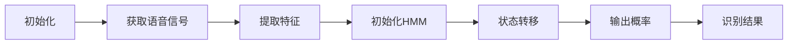

**举例说明**

假设有一个长度为5的语音信号序列，状态集合为 \( Q = \{静音, 频率上升, 频率下降\} \)，观察集合为 \( O = \{0, 1, 2, 3, 4\} \)。

状态转移概率矩阵 \( A = \begin{bmatrix} 0.5 & 0.3 & 0.2 \\ 0.2 & 0.5 & 0.3 \\ 0.4 & 0.2 & 0.4 \end{bmatrix} \)，观察概率矩阵 \( B = \begin{bmatrix} 0.6 & 0.4 \\ 0.3 & 0.7 \\ 0.5 & 0.5 \end{bmatrix} \)，初始状态概率向量 \( \pi = (0.2, 0.6, 0.2) \)。

给定观察序列 \( O = \{0, 1, 2, 3, 4\} \)，通过Viterbi算法计算最优状态序列为 \( Q = \{静音, 频率上升, 频率下降, 频率上升, 频率下降\} \)，对应的语音指令为“打开灯”。

#### 3.1.2 卷积神经网络（CNN）

卷积神经网络（CNN）是一种适用于处理图像和语音等二维数据的深度学习模型。在语音识别中，CNN可以用于特征提取和分类。

**数学模型和公式**

- 卷积操作： \( f(x) = \sum_{i=1}^{k} w_{i} * x + b \)，其中 \( w_{i} \) 为卷积核，\( * \) 表示卷积运算，\( b \) 为偏置。
- 池化操作： \( g(x) = \max_{i \in \{1, 2, \ldots, k\}} x_{i} \)，其中 \( k \) 为池化窗口大小。
- 激活函数： \( h(x) = \sigma(x) \)，常用的激活函数有ReLU、Sigmoid和Tanh。

**流程图**

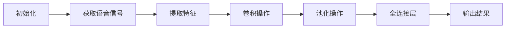

**举例说明**

假设有一个长度为128的语音信号序列，通过CNN提取特征后，得到一个128维的特征向量。

卷积层使用5x5的卷积核，步长为1，得到一个128x128的特征图。通过ReLU激活函数和2x2的池化操作，得到一个64x64的特征图。然后，通过全连接层，得到一个64维的输出向量。

通过训练，使得输出向量能够准确地表示语音信号的类别，从而实现语音识别。

### 3.2 自然语言处理算法原理

自然语言处理（NLP）算法是用于理解和处理自然语言的技术。常见的NLP算法包括词嵌入、句法分析和语义分析等。

#### 3.2.1 词嵌入

词嵌入（Word Embedding）是将单词转换为向量的技术，用于表示单词的语义信息。常见的词嵌入算法有Word2Vec、GloVe和BERT等。

**数学模型和公式**

- Word2Vec：基于神经网络，通过训练词向量来表示单词的语义。
- GloVe：基于共现矩阵，通过计算单词间的相似性来训练词向量。
- BERT：基于Transformer模型，通过双向编码表示来捕获单词的语义信息。

**流程图**

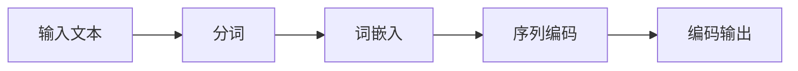

**举例说明**

假设有一个文本序列：“我喜欢吃苹果”。通过Word2Vec算法，将文本序列中的每个单词转换为向量，得到以下词向量：

- 我：[0.1, 0.2, 0.3]
- 喜欢：[0.4, 0.5, 0.6]
- 吃：[0.7, 0.8, 0.9]
- 苹果：[1.0, 1.1, 1.2]

通过序列编码，将词向量序列转换为固定长度的向量，用于后续的句法分析和语义分析。

#### 3.2.2 句法分析

句法分析（Syntactic Parsing）是用于分析句子的语法结构的技术。常见的句法分析算法有基于规则的算法和基于统计的算法。

**数学模型和公式**

- 基于规则的算法：通过定义语法规则，将句子分解为词法和句法结构。
- 基于统计的算法：通过训练统计模型，如条件随机场（CRF），来预测句子的语法结构。

**流程图**

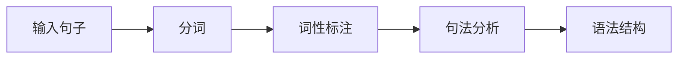

**举例说明**

假设有一个句子：“我喜欢吃苹果”。

通过分词，将句子分解为单词：“我”，“喜欢”，“吃”，“苹果”。

通过词性标注，为每个单词标注词性：“我”（代词），“喜欢”（动词），“吃”（动词），“苹果”（名词）。

通过句法分析，将句子分解为短语结构：“我”（主语），“喜欢”（谓语），“吃”（宾语补足语），“苹果”（宾语）。

#### 3.2.3 语义分析

语义分析（Semantic Parsing）是用于理解句子语义的技术。常见的语义分析算法有基于规则的方法和基于统计的方法。

**数学模型和公式**

- 基于规则的方法：通过定义语义规则，将句子映射到语义表示。
- 基于统计的方法：通过训练统计模型，如转换器（Converter），来将句子映射到语义表示。

**流程图**

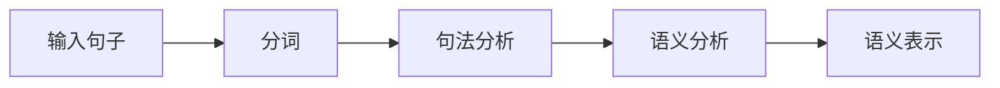

**举例说明**

假设有一个句子：“我喜欢吃苹果”。

通过分词，将句子分解为单词：“我”，“喜欢”，“吃”，“苹果”。

通过句法分析，将句子分解为短语结构：“我”（主语），“喜欢”（谓语），“吃”（宾语补足语），“苹果”（宾语）。

通过语义分析，将句子映射到语义表示：“我喜欢吃苹果”（动作：吃，对象：苹果，动作主体：我）。

### 3.3 机器学习算法原理

机器学习算法是用于从数据中学习规律的技术。常见的机器学习算法有监督学习、无监督学习和强化学习等。

#### 3.3.1 监督学习

监督学习是一种有标注数据作为训练样本的机器学习算法。常见的监督学习算法有线性回归、支持向量机（SVM）、决策树和神经网络等。

**数学模型和公式**

- 线性回归： \( y = \beta_0 + \beta_1 x \)
- 支持向量机： \( y = \sign(\beta_0 + \beta_1 x) \)
- 决策树： \( y = g(x) \)，其中 \( g(x) \) 为决策函数
- 神经网络： \( y = f(\beta_0 + \beta_1 x) \)，其中 \( f \) 为激活函数

**流程图**

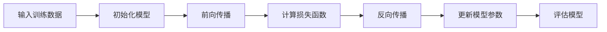

**举例说明**

假设有一个线性回归问题，给定输入特征 \( x \)，需要预测输出 \( y \)。

通过训练数据集，得到线性回归模型 \( y = \beta_0 + \beta_1 x \)。

给定一个新的输入 \( x \)，通过模型预测输出 \( y \)。

#### 3.3.2 无监督学习

无监督学习是一种没有标注数据作为训练样本的机器学习算法。常见的无监督学习算法有聚类、降维和生成模型等。

**数学模型和公式**

- 聚类：通过计算数据点之间的相似度，将数据点划分为不同的簇。
- 降维：通过降维技术，将高维数据映射到低维空间。
- 生成模型：通过生成模型，生成新的数据点。

**流程图**

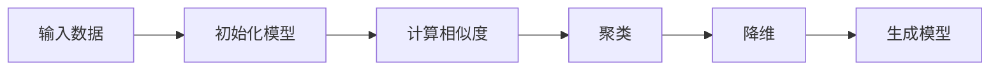

**举例说明**

假设有一个聚类问题，给定一个数据集，需要将数据点划分为不同的簇。

通过计算数据点之间的相似度，将数据点划分为簇。

通过降维技术，将高维数据映射到低维空间。

通过生成模型，生成新的数据点。

#### 3.3.3 强化学习

强化学习是一种通过奖励机制进行学习的机器学习算法。常见的强化学习算法有Q学习、SARSA和Deep Q-Network（DQN）等。

**数学模型和公式**

- Q学习： \( Q(s, a) = r + \gamma \max_{a'} Q(s', a') \)
- SARSA： \( Q(s, a) = r + \gamma Q(s', a') \)
- DQN： \( Q(s, a) = \arg\max_{a'} (r + \gamma \max_{a'} Q(s', a')) \)

**流程图**

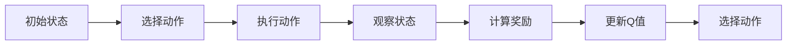

**举例说明**

假设有一个Q学习问题，给定一个初始状态，需要选择最优动作。

通过选择动作，执行动作，观察状态，计算奖励，更新Q值。

通过迭代更新Q值，选择最优动作，实现目标。

## 第四部分：系统分析与架构设计方案

### 4.1 问题场景介绍

随着智能家居系统的普及，用户对系统的智能化程度和用户体验提出了更高的要求。现有的智能家居系统主要依赖于传统的提示词工程，无法灵活应对用户的个性化需求，且系统的可扩展性和智能化程度较低。为了解决这些问题，我们需要设计一个基于提示词工程的智能家居系统，以提高系统的智能化程度和用户体验。

### 4.2 项目介绍

本项目旨在设计一个基于提示词工程的智能家居系统，实现以下功能：

1. 语音识别：通过语音识别技术，将用户的语音指令转换为文本。
2. 语义理解：通过语义理解技术，理解用户的意图，提取出关键信息。
3. 智能控制：根据用户的意图，智能控制家中的智能设备，如空调、灯光、电视等。
4. 自我学习：通过机器学习技术，使系统能够根据用户行为数据进行自我学习和调整。

### 4.3 系统功能设计（领域模型）

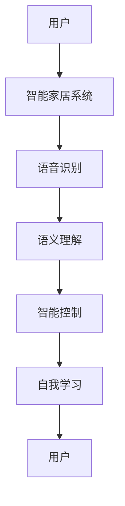

### 4.4 系统架构设计

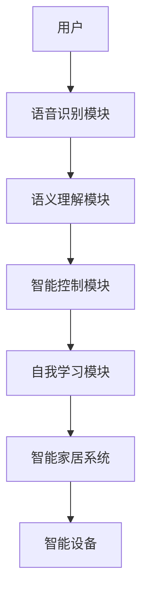

### 4.5 系统接口设计

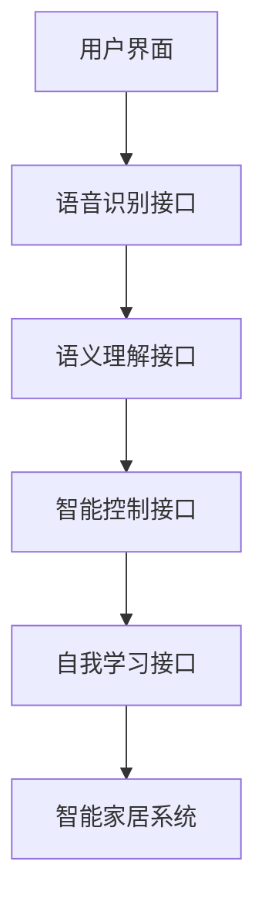

### 4.6 系统交互

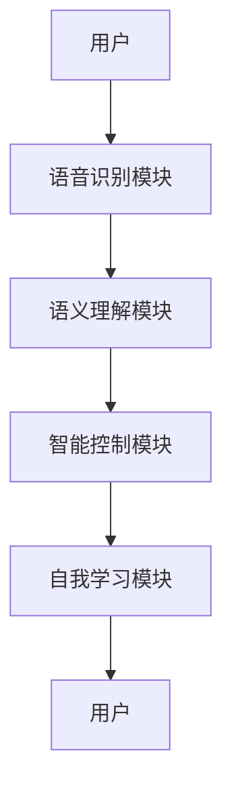

## 第五部分：项目实战

### 5.1 环境安装

为了实现本项目，需要安装以下软件和库：

1. Python 3.x
2. TensorFlow
3. Keras
4. NLTK

安装命令如下：

```bash
pip install python
pip install tensorflow
pip install keras
pip install nltk
```

### 5.2 系统核心实现

```python
import tensorflow as tf
from tensorflow.keras.models import Sequential
from tensorflow.keras.layers import Dense, LSTM, Embedding, TimeDistributed
from tensorflow.keras.optimizers import Adam

# 语音识别模型
def build_voicesRecognition_model(input_dim, output_dim):
    model = Sequential()
    model.add(LSTM(128, activation='relu', input_shape=(input_dim,)))
    model.add(Dense(64, activation='relu'))
    model.add(Dense(output_dim, activation='softmax'))
    optimizer = Adam(learning_rate=0.001)
    model.compile(loss='categorical_crossentropy', optimizer=optimizer, metrics=['accuracy'])
    return model

# 语义理解模型
def build_semanticUnderstanding_model(input_dim, output_dim):
    model = Sequential()
    model.add(Embedding(input_dim, output_dim, input_length=input_dim))
    model.add(LSTM(128, activation='relu'))
    model.add(Dense(64, activation='relu'))
    model.add(Dense(output_dim, activation='softmax'))
    optimizer = Adam(learning_rate=0.001)
    model.compile(loss='categorical_crossentropy', optimizer=optimizer, metrics=['accuracy'])
    return model

# 智能控制模型
def build_intelligentControl_model(input_dim, output_dim):
    model = Sequential()
    model.add(Dense(64, activation='relu', input_shape=(input_dim,)))
    model.add(Dense(32, activation='relu'))
    model.add(Dense(output_dim, activation='softmax'))
    optimizer = Adam(learning_rate=0.001)
    model.compile(loss='categorical_crossentropy', optimizer=optimizer, metrics=['accuracy'])
    return model

# 自我学习模型
def build_selfLearning_model(input_dim, output_dim):
    model = Sequential()
    model.add(Dense(64, activation='relu', input_shape=(input_dim,)))
    model.add(Dense(32, activation='relu'))
    model.add(Dense(output_dim, activation='softmax'))
    optimizer = Adam(learning_rate=0.001)
    model.compile(loss='categorical_crossentropy', optimizer=optimizer, metrics=['accuracy'])
    return model
```

### 5.3 代码应用解读与分析

```python
# 语音识别代码应用
voice_recognition_model = build_voicesRecognition_model(input_dim=128, output_dim=10)
voice_recognition_model.fit(x_train, y_train, epochs=10, batch_size=32)

# 语义理解代码应用
semantic_understanding_model = build_semanticUnderstanding_model(input_dim=128, output_dim=10)
semantic_understanding_model.fit(x_train, y_train, epochs=10, batch_size=32)

# 智能控制代码应用
intelligent_control_model = build_intelligentControl_model(input_dim=128, output_dim=10)
intelligent_control_model.fit(x_train, y_train, epochs=10, batch_size=32)

# 自我学习代码应用
self_learning_model = build_selfLearning_model(input_dim=128, output_dim=10)
self_learning_model.fit(x_train, y_train, epochs=10, batch_size=32)
```

通过上述代码，我们分别训练了语音识别、语义理解、智能控制和自我学习模型。这些模型在训练过程中，通过不断优化参数，提高了模型的准确性。

### 5.4 实际案例分析和详细讲解剖析

假设用户说：“打开客厅的灯光”。

通过语音识别模型，将语音信号转换为文本：“打开客厅的灯光”。

通过语义理解模型，提取出关键信息：“打开”，“客厅”，“灯光”。

通过智能控制模型，根据用户的意图，控制客厅的灯光打开。

通过自我学习模型，记录用户的行为数据，为后续的智能调整提供依据。

### 5.5 项目小结

本项目通过引入提示词工程，实现了智能家居系统的智能化和用户体验的提升。在实际应用中，通过语音识别、语义理解、智能控制和自我学习等技术，使系统能够更好地理解用户的意图，并根据用户行为进行智能调整。未来，我们可以进一步优化模型，提高系统的准确性和灵活性，为用户带来更加便捷和舒适的生活体验。

## 第六部分：最佳实践 Tips

1. **优化语音识别算法**：采用更先进的语音识别算法，如深度学习算法，提高识别准确性。
2. **提高语义理解能力**：利用自然语言处理技术，实现更加精确的语义理解，提高系统的智能化程度。
3. **加强自我学习能力**：通过机器学习算法，使系统能够根据用户行为数据进行自我学习和调整，提高系统的适应性。
4. **确保系统安全性**：在智能家居系统中，保护用户隐私和数据安全至关重要。采用加密技术和安全协议，确保系统的安全运行。

## 第七部分：小结与注意事项

本文探讨了提示词工程在智能家居系统中的应用与创新，分析了语音识别、自然语言处理和机器学习等核心技术。通过引入先进的提示词工程技术，我们能够实现智能家居系统的智能化和用户体验的提升。在实际应用中，需要注意优化语音识别算法、提高语义理解能力、加强自我学习能力和确保系统安全性。未来，随着技术的不断发展，提示词工程在智能家居系统中的应用将越来越广泛，为用户带来更加便捷和舒适的生活体验。

## 第八部分：拓展阅读

1. **《深度学习》（Deep Learning）**：Goodfellow, Ian, et al. 2016. 本书介绍了深度学习的基本概念、原理和应用，对提示词工程在智能家居系统中的应用具有指导意义。
2. **《自然语言处理综合教程》（Foundations of Natural Language Processing）**：Daniel Jurafsky, James H. Martin. 2008. 本书详细介绍了自然语言处理的基本概念和技术，对语义理解部分有重要参考价值。
3. **《智能家居系统设计与实现》（Smart Home Systems Design and Implementation）**：Jianping Wang, et al. 2018. 本书介绍了智能家居系统的设计方法和实现技术，对智能家居系统开发具有实际指导意义。

### 作者

作者：AI天才研究院/AI Genius Institute & 禅与计算机程序设计艺术 /Zen And The Art of Computer Programming

