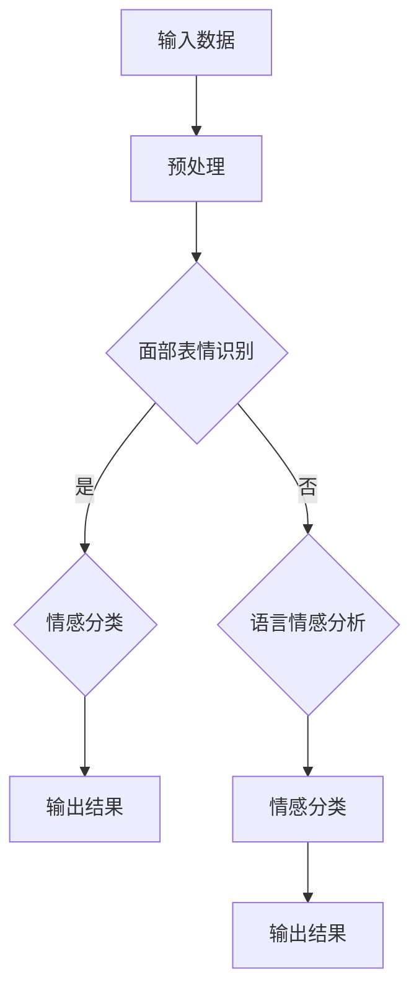
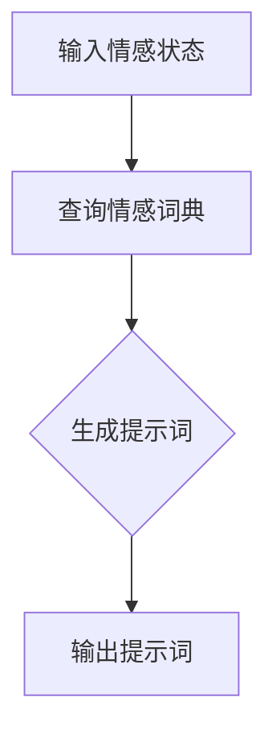
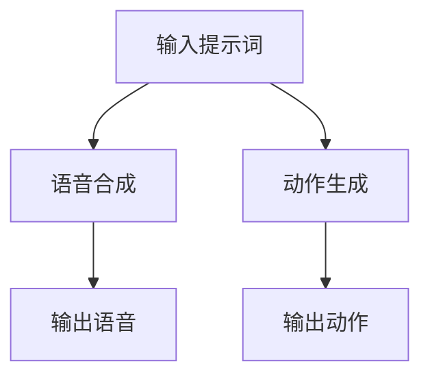

                 


## 第1章：机器人情感表达的背景

### 1.1 机器人情感表达的定义

机器人情感表达是指通过人工智能技术，使机器人能够模拟人类的情感反应，进行情感交流和情感互动的过程。这种表达不仅限于表面的情感动作，如面部表情、身体语言，还包括更深层次的情感理解和情感交互。

在定义中，我们可以提炼出几个关键术语：

- **情感**：心理学中的情感指的是个体对刺激的反应，包括愉悦、悲伤、愤怒等基本情感状态。
- **表达**：在语言学中，表达指的是通过语言、动作或其他方式传达思想、情感和意愿的过程。
- **模拟**：在计算机科学中，模拟指的是创建一个系统的模型，以再现该系统的行为和特征。

### 1.2 机器人情感表达的重要性

机器人情感表达的重要性主要体现在以下几个方面：

1. **提高用户体验**：通过情感表达，机器人可以更好地与人类进行互动，提高用户对机器人的满意度和使用频率。
2. **增强交互效果**：情感表达可以增强机器人和人类之间的交互效果，使交互更加自然和贴近人类交流方式。
3. **提升情感理解能力**：随着技术的进步，机器人在情感理解方面可以逐步提高，从而更好地预测人类的需求和情感状态。
4. **辅助特殊需求**：对于有特殊需求的人群，如残障人士、老年人等，机器人情感表达可以提供更为人性化的服务和支持。

### 1.3 机器人情感表达的应用领域

机器人情感表达的应用领域非常广泛，主要包括以下几个方面：

1. **客户服务**：在客服领域，机器人可以通过情感表达提供更为人性化的服务，提高客户满意度。
2. **教育**：在教育领域，机器人可以模拟教师或同伴的角色，为学习者提供情感支持和鼓励。
3. **医疗**：在医疗领域，机器人可以用于陪伴患者，提供情感支持和心理治疗。
4. **家庭服务**：在家庭服务领域，机器人可以陪伴家庭成员，提供情感交流和关怀。

### 问题背景与问题描述

随着人工智能技术的快速发展，机器人已经成为我们日常生活的重要伙伴。然而，目前大多数机器人还无法真正理解人类的情感，也无法有效地表达自己的情感。这种局限不仅影响了机器人的用户体验，也限制了它们在更多领域中的应用。

如何设计并实现机器人情感表达，使其能够更好地与人类进行互动，是一个亟待解决的问题。这需要我们深入理解情感表达的机制，以及如何将这种机制嵌入到机器人系统中。

### 问题解决与边界与外延

问题解决的思路主要包括以下几个方面：

1. **提示词工程**：提示词工程是机器人情感表达的核心技术之一，通过设计合适的提示词，可以帮助机器人更好地理解人类的情感，并做出相应的情感表达。
2. **情感识别技术**：通过情感识别技术，机器人可以分析人类的情感状态，从而做出更为贴切的情感反应。
3. **交互设计**：交互设计是机器人情感表达的关键环节，通过合理的交互设计，可以使机器人更好地融入人类的社交环境。

边界与外延包括：

1. **技术边界**：当前的技术水平可能限制了机器人情感表达的实现，例如情感识别的准确率、机器人的情感理解能力等。
2. **应用边界**：不同的应用场景可能对机器人情感表达有不同的需求，这需要在设计时进行充分考虑。
3. **伦理边界**：随着机器人情感表达的普及，如何确保机器人的情感表达不会对人类造成负面影响，是一个重要的伦理问题。

### 概念结构与核心要素组成

机器人情感表达的概念结构主要包括以下几个核心要素：

1. **情感识别**：通过分析人类的行为和语言，识别出人类情感状态的过程。
2. **提示词设计**：设计合适的提示词，帮助机器人理解人类情感状态，并做出相应的情感表达。
3. **情感表达**：机器人根据识别出的情感状态，通过动作、语言等方式进行情感表达的过程。
4. **用户反馈**：用户对机器人情感表达的反馈，可以帮助改进机器人的情感表达效果。

核心要素的组成可以用以下ER实体关系图表示：

```mermaid
erDiagram
  情感识别 ||--|{ 提示词设计 }|
  情感识别 ||--|{ 情感表达 }|
  提示词设计 ||--|{ 用户反馈 }|
  情感表达 ||--|{ 用户反馈 }|
```

### 概念属性特征对比表格

为了更清晰地理解机器人情感表达的概念，我们可以对比不同属性特征：

| 特征        | 描述                                                         |
| ----------- | ------------------------------------------------------------ |
| **情感识别** | 识别人类情感状态的技术手段。                                 |
| **提示词设计** | 根据情感状态设计合适的提示词，用于机器人理解人类情感。           |
| **情感表达** | 机器人根据情感状态进行的情感反应和表达。                       |
| **用户反馈** | 用户对机器人情感表达的反馈，用于改进机器人情感表达的效果。     |

### 算法原理讲解

算法原理主要包括情感识别、提示词设计和情感表达三个部分。

#### 情感识别

情感识别算法的基本原理是通过分析人类的行为和语言特征，识别出情感状态。常用的方法包括：

1. **面部表情识别**：通过摄像头捕捉面部表情，使用机器学习算法进行分类。
2. **语言情感分析**：通过自然语言处理技术，分析人类语言中的情感词汇和句子结构，识别情感状态。

以下是一个简单的情感识别算法流程图：



#### 提示词设计

提示词设计的目标是设计合适的提示词，帮助机器人理解人类情感。常用的方法包括：

1. **情感词典**：建立一个包含情感词汇的词典，用于提示词的生成。
2. **基于规则的提示词生成**：根据情感状态和上下文，生成相应的提示词。

以下是一个简单的提示词设计算法流程图：



#### 情感表达

情感表达算法的目标是根据识别出的情感状态，设计合适的情感表达。常用的方法包括：

1. **语音合成**：根据提示词生成语音，实现情感表达。
2. **动作生成**：根据提示词生成相应的动作，实现情感表达。

以下是一个简单的情感表达算法流程图：



### 数学模型和公式

情感识别、提示词设计和情感表达中涉及到的数学模型和公式主要包括：

1. **面部表情识别**：使用支持向量机（SVM）进行分类，其公式为：
   $$ y = \arg\max w_i \cdot x_i $$
   其中，$w_i$为权重向量，$x_i$为特征向量。

2. **语言情感分析**：使用朴素贝叶斯分类器进行分类，其公式为：
   $$ P(y | x) = \frac{P(x | y) \cdot P(y)}{P(x)} $$
   其中，$P(y | x)$为给定特征$x$的条件概率，$P(x | y)$为给定情感$y$的特征概率，$P(y)$为情感$y$的概率。

3. **语音合成**：使用隐马尔可夫模型（HMM）进行语音合成，其公式为：
   $$ P(O | Q) = \sum_{i=1}^n P(O | q_i) \cdot P(q_i | Q) $$
   其中，$O$为观察序列，$Q$为状态序列，$q_i$为状态。

4. **动作生成**：使用决策树进行动作生成，其公式为：
   $$ a^* = \arg\max_a P(a | O) $$
   其中，$a^*$为最优动作，$P(a | O)$为给定观察序列$O$的动作概率。

### 举例说明

假设一个机器人需要识别用户的情感状态，并做出相应的情感表达。以下是具体步骤：

1. **情感识别**：通过摄像头捕捉用户的面部表情，使用SVM进行分类，识别出用户的情感状态。
2. **提示词设计**：根据识别出的情感状态，查询情感词典，生成相应的提示词。
3. **情感表达**：根据提示词，使用语音合成技术生成语音，同时根据提示词生成相应的动作。

例如，如果用户表现出愉悦的情感状态，机器人可以生成以下提示词：

- **提示词**：“您好，今天您看起来很高兴！”
- **情感表达**：语音：“您好，今天您看起来很高兴！”；动作：微笑。

### 总结

本章主要介绍了机器人情感表达的背景、重要性、应用领域，并详细讲解了核心概念、算法原理和数学模型。通过本章的学习，读者可以初步了解机器人情感表达的基本概念和技术原理，为后续章节的深入学习打下基础。

接下来，我们将进入第二部分，探讨机器人情感表达的核心概念。

## 第2章：机器人情感表达的核心概念

### 2.1 提示词工程概述

提示词工程（Prompt Engineering）是人工智能领域的一个重要分支，主要研究如何设计和生成有效的提示词，以指导模型进行正确的任务执行。在机器人情感表达中，提示词工程扮演着至关重要的角色。它不仅帮助机器人理解人类的情感状态，还能指导机器人进行相应的情感表达。

#### 提示词工程的发展背景

随着深度学习和自然语言处理技术的迅速发展，大型语言模型（如GPT-3、BERT等）在各类任务中表现出色。然而，这些模型在缺乏明确指导时，往往无法准确地执行特定任务。提示词工程正是为了解决这个问题而诞生的。通过设计合适的提示词，可以引导模型更好地理解任务目标，从而提高模型的性能。

#### 提示词工程的应用场景

提示词工程的应用场景非常广泛，包括但不限于：

1. **问答系统**：通过设计合适的提示词，可以引导问答系统更好地理解用户的问题，提供准确的答案。
2. **文本生成**：在文本生成任务中，提示词可以帮助模型理解生成的主题和风格。
3. **机器翻译**：提示词可以指导模型翻译特定类型或风格的文本。
4. **机器人情感表达**：在机器人情感表达中，提示词工程可以帮助机器人更好地理解人类的情感状态，并做出相应的情感表达。

### 2.2 提示词工程的基本原理

提示词工程的核心目标是设计出有效的提示词，以引导模型进行正确的任务执行。这涉及到多个方面的内容：

1. **理解任务目标**：首先，需要明确任务的目标和要求，这是设计提示词的基础。
2. **分析模型特点**：不同的模型在处理任务时的能力不同，因此需要根据模型的特点来设计提示词。
3. **设计提示词**：根据任务目标和模型特点，设计出具体的提示词，包括问题、主题、上下文等信息。
4. **评估提示词效果**：设计出提示词后，需要对其进行评估，以验证其有效性。

#### 提示词工程的流程

提示词工程的流程主要包括以下几个步骤：

1. **需求分析**：与任务相关的各方进行沟通，明确任务的目标和要求。
2. **数据收集**：收集与任务相关的数据，用于训练和评估模型。
3. **模型选择**：根据任务需求，选择合适的模型。
4. **提示词设计**：设计出具体的提示词，以引导模型进行任务执行。
5. **模型训练**：使用收集到的数据和设计的提示词，对模型进行训练。
6. **模型评估**：使用评估数据集，对模型的效果进行评估。
7. **迭代优化**：根据评估结果，对模型和提示词进行优化。

### 2.3 提示词工程的类型与应用

提示词工程可以根据不同的任务和应用场景，分为多种类型。以下是几种常见的提示词工程类型及其应用：

1. **问题式提示词**：通过提出具体的问题，引导模型进行回答。这种类型适用于问答系统、文本生成等任务。
   - **应用示例**：在问答系统中，提示词可以是：“请描述一下您今天的心情？”
   
2. **上下文式提示词**：提供与任务相关的上下文信息，帮助模型更好地理解任务背景和目标。这种类型适用于文本生成、机器翻译等任务。
   - **应用示例**：在机器翻译中，提示词可以是：“请将这段英文翻译成中文。”（英文文本作为上下文信息）

3. **任务驱动式提示词**：通过指定任务目标，引导模型执行特定任务。这种类型适用于机器人情感表达等任务。
   - **应用示例**：在机器人情感表达中，提示词可以是：“当用户表达愉悦情感时，请做出相应的情感表达。”

4. **多模态提示词**：结合多种模态（如文本、图像、声音）的信息，设计出更加综合的提示词。这种类型适用于多模态任务，如图像描述生成、视频情感分析等。
   - **应用示例**：在图像描述生成中，提示词可以是：“请根据这幅图像生成一段描述性文本。”

### 总结

本章主要介绍了提示词工程的基本概念、基本原理和类型及应用。通过本章的学习，读者可以了解提示词工程在机器人情感表达中的重要作用，以及如何设计出有效的提示词来指导机器人进行情感表达。在下一章中，我们将探讨提示词工程与机器人情感表达的关联，进一步深入理解这一领域的应用和挑战。

### 2.4 提示词工程与情感表达的关联

提示词工程在机器人情感表达中起着至关重要的作用。通过设计合适的提示词，机器人可以更好地理解人类的情感状态，并做出相应的情感表达。以下是提示词工程与情感表达之间的关联：

#### 提示词工程如何影响情感表达

1. **情感理解**：提示词工程通过提供与情感相关的上下文信息，帮助机器人更好地理解用户的情感状态。例如，当用户说出“我很高兴”时，机器人可以基于提示词中的情感词汇和上下文信息，推断出用户处于愉悦的情感状态。

2. **情感表达**：通过设计合适的提示词，机器人可以生成符合用户情感状态的回应。例如，如果用户表达出悲伤的情感，机器人可以生成如“我理解您现在的心情，如果需要，我可以一直在这里陪您”这样的回应。

3. **情感互动**：提示词工程不仅影响单个情感表达，还可以影响机器人与用户之间的情感互动。通过设计连贯的提示词序列，机器人可以与用户建立更为自然和贴心的情感互动，从而提升用户体验。

#### 情感表达中的提示词设计原则

1. **准确性**：设计的提示词应准确反映用户的情感状态，避免误解或误导。

2. **多样性**：提示词应涵盖多种情感状态，以便机器人能够应对各种情感表达。

3. **连贯性**：提示词之间应保持连贯性，避免出现逻辑错误或矛盾。

4. **个性化**：提示词应考虑用户的个性、偏好和语境，实现更加个性化的情感表达。

#### 情感表达的评估与反馈机制

1. **自动评估**：通过机器学习算法，对机器人的情感表达进行自动评估，如评估回应的准确性、连贯性和情感匹配度。

2. **用户反馈**：收集用户的反馈，了解他们对机器人情感表达的感受和需求，以便进行进一步的优化。

3. **迭代优化**：根据评估和反馈结果，不断迭代优化提示词设计和情感表达算法，提升机器人的情感表达能力。

### 总结

提示词工程在机器人情感表达中起到了关键的作用，通过设计合适的提示词，机器人可以更好地理解用户的情感状态，并做出相应的情感表达。了解情感表达中的提示词设计原则和评估与反馈机制，有助于提升机器人的情感表达效果，为用户提供更为自然和贴心的交互体验。在下一章中，我们将进一步探讨如何构建有效的提示词库，以支持机器人情感表达。

## 第3章：构建有效的提示词库

### 3.1 提示词库的基本构建方法

构建一个有效的提示词库是机器人情感表达系统的关键组成部分。提示词库包含了一系列的提示词，用于引导机器人理解用户的情感状态并做出相应的情感表达。以下是构建提示词库的基本方法：

#### 数据收集

构建提示词库的第一步是收集相关数据。这些数据可以包括：

1. **情感词汇表**：收集包含各种情感状态的词汇，如愉悦、悲伤、愤怒等。
2. **情感表达样本**：收集人类表达情感状态的文本、语音和视频样本。
3. **用户交互日志**：分析用户与机器人交互的历史数据，提取出常见的情感表达模式。

#### 数据预处理

收集到的数据需要进行预处理，以提高数据质量和提示词库的准确性。预处理步骤包括：

1. **文本清洗**：去除文本中的噪声，如标点符号、停用词等。
2. **情感分类**：对情感表达样本进行情感分类，标记出各种情感状态。
3. **数据标准化**：将数据格式统一，如将所有文本转换为小写，去除特殊字符等。

#### 提示词生成

生成提示词是构建提示词库的核心步骤。以下是一些常用的方法：

1. **规则生成**：根据情感分类结果，设计一组规则来生成提示词。例如，对于愉悦情感，可以生成“您看起来很高兴”这样的提示词。
2. **模板匹配**：使用预先设计的模板，将情感表达样本与模板进行匹配，生成相应的提示词。例如，可以使用模板“用户说<情感词>，那么机器人可以说<提示词>”。
3. **数据驱动生成**：通过机器学习算法，从大量情感表达样本中自动生成提示词。例如，可以使用自然语言生成（NLG）算法，根据情感状态和上下文信息生成提示词。

#### 提示词筛选与优化

生成的提示词需要进行筛选和优化，以确保其有效性和多样性。以下是一些筛选与优化方法：

1. **覆盖率分析**：分析提示词库中情感状态的覆盖率，确保每种情感状态都有相应的提示词。
2. **情感匹配度评估**：评估提示词与情感状态的匹配度，确保提示词能够准确反映用户的情感状态。
3. **多样性分析**：确保提示词库中包含多种类型的提示词，以避免单调重复。
4. **用户反馈**：收集用户对提示词的反馈，根据反馈结果对提示词进行优化。

#### 提示词库的管理与更新

提示词库需要定期进行管理和更新，以适应不断变化的应用场景和用户需求。以下是一些管理和更新方法：

1. **版本控制**：对提示词库的版本进行控制，记录每次更新的内容和时间。
2. **自动更新**：通过机器学习算法，自动从用户交互数据中提取新的提示词，并更新提示词库。
3. **人工审核**：定期对提示词库进行人工审核，删除不合适的提示词，添加新的提示词。
4. **反馈机制**：建立反馈机制，收集用户对提示词库的建议和意见，用于指导后续的更新工作。

### 提示词库的优化策略

为了提高提示词库的有效性和实用性，可以采取以下优化策略：

1. **情感细化**：将情感分类进一步细化，例如将愉悦情感分为兴奋、高兴、满足等子类别，以便生成更精确的提示词。
2. **上下文关联**：考虑上下文信息，设计出与特定情境相关的提示词，提高提示词的适用性。
3. **动态调整**：根据用户的实时反馈和交互数据，动态调整提示词库的内容和结构，以适应用户的需求。
4. **个性化定制**：为不同的用户提供个性化的提示词库，根据他们的偏好和习惯进行定制。

### 提示词库的案例分析

以下是一个具体的提示词库构建案例：

#### 案例背景

某智能客服系统需要为用户提供情感表达服务，以提升用户体验。为了实现这一目标，系统需要构建一个包含丰富、准确和多样化的提示词库。

#### 案例步骤

1. **数据收集**：收集了大量的情感表达文本、语音和视频样本，以及用户交互日志。

2. **数据预处理**：对收集到的数据进行清洗、分类和标准化处理。

3. **提示词生成**：采用规则生成和数据驱动生成方法，生成初步的提示词库。

4. **提示词筛选与优化**：通过覆盖率分析、情感匹配度评估和用户反馈，对提示词库进行筛选和优化。

5. **提示词库管理与更新**：建立版本控制系统，并定期进行自动更新和人工审核。

#### 案例效果

经过优化后的提示词库，显著提升了智能客服系统的情感表达能力。用户反馈显示，机器人能够更好地理解他们的情感状态，并做出相应的情感表达，用户满意度得到了显著提高。

### 总结

构建有效的提示词库是机器人情感表达系统的重要组成部分。通过合理的数据收集、预处理、提示词生成和优化策略，可以构建出一个丰富、准确和多样化的提示词库，从而提升机器人的情感表达效果。在下一章中，我们将探讨如何设计机器人情感表达界面，以实现更为自然的情感互动。

### 3.2 设计机器人情感表达界面

机器人情感表达界面是用户与机器人进行情感交流的接口，其设计直接影响到用户的体验和满意度。为了实现一个高效的情感表达界面，我们需要遵循以下设计原则和步骤。

#### 情感表达界面的设计原则

1. **自然性**：情感表达界面应尽量模拟人类的情感交流方式，使用户感觉自然、舒适。
2. **直观性**：界面设计应简洁明了，用户能够快速理解机器人的情感状态和回应。
3. **互动性**：界面应支持多种互动方式，如语音、文本、图像等，以适应不同用户的需求。
4. **个性化**：根据用户的偏好和历史互动数据，提供个性化的情感表达和互动体验。
5. **可扩展性**：界面设计应具备良好的扩展性，以支持未来的功能扩展和优化。

#### 情感表达界面的交互设计

1. **语音交互**：语音交互是机器人情感表达的重要方式。设计时，需要考虑语音的自然流畅性、音调控制和情感表达的准确性。例如，当机器人表达愉悦情感时，可以采用较快的语速和较高的音调。
2. **文本交互**：文本交互是用户与机器人沟通的主要渠道。设计时，需要确保文本表达清晰、简洁，并能够准确传达机器人的情感状态。例如，可以使用表情符号和缩写词来增强文本的情感表达。
3. **图像和动画交互**：图像和动画可以直观地传达情感状态。设计时，需要选择合适的图像和动画，以增强用户的情感体验。例如，当机器人表达悲伤情感时，可以展示一幅悲伤的图像或动画。

#### 情感表达界面的评估与改进

1. **用户测试**：通过用户测试，收集用户对情感表达界面的反馈，评估界面的易用性和用户体验。
2. **数据收集**：收集用户的交互数据，分析用户行为和反馈，识别界面设计的不足之处。
3. **迭代优化**：根据用户测试和数据分析结果，对情感表达界面进行迭代优化，提高界面的质量和用户满意度。

#### 实际案例

以下是一个实际案例，展示了如何设计一个情感表达界面：

**案例背景**：某智能客服系统需要为用户提供情感支持服务，用户可以通过语音、文本和图像与机器人进行交互。

**设计步骤**：

1. **需求分析**：明确用户对情感支持的需求，包括情感表达的类型、强度和互动方式。
2. **界面原型设计**：设计语音、文本和图像交互的界面原型，考虑自然性、直观性和互动性原则。
3. **用户测试**：进行用户测试，收集用户对界面设计的反馈，评估界面的易用性和用户体验。
4. **迭代优化**：根据用户测试结果，对界面设计进行优化，提升用户的情感体验。

**案例效果**：

经过迭代优化，智能客服系统的情感表达界面得到了用户的高度评价。用户反馈显示，机器人能够准确地理解他们的情感状态，并做出相应的情感表达，提升了用户的满意度。

### 总结

设计机器人情感表达界面是提升用户体验的关键环节。通过遵循自然性、直观性、互动性、个性化和可扩展性的设计原则，可以构建一个高效、自然的情感表达界面。在下一章中，我们将探讨机器人情感表达的技术实现，进一步深入这一领域。

## 第4章：实现机器人情感表达

### 4.1 机器人情感表达的技术实现

机器人情感表达的技术实现涉及多个领域，包括自然语言处理、语音合成、计算机视觉和机器人控制等。在这一部分，我们将详细探讨这些技术，并解释如何将它们结合起来，实现一个有效的机器人情感表达系统。

#### 自然语言处理（NLP）

自然语言处理是机器人情感表达的核心技术之一。它涉及对文本数据进行分析和处理，以提取情感信息。以下是几种常用的NLP技术：

1. **情感分析**：情感分析是一种基于文本的情感识别技术，用于检测文本中的情感倾向，如积极、消极或中性。常用的方法包括基于规则的方法、机器学习方法（如文本分类）和深度学习方法（如卷积神经网络和递归神经网络）。

2. **情感词典**：情感词典是一个包含情感词汇及其情感倾向的数据库。通过查询情感词典，机器人可以快速识别文本中的情感信息。

3. **语境分析**：情感分析需要考虑语境因素，以避免情感歧义。例如，同一个词汇在不同的语境中可能有不同的情感倾向。

#### 语音合成

语音合成是将文本转化为语音的技术。在机器人情感表达中，语音合成用于实现机器人的语音回应。以下是几种常用的语音合成技术：

1. **文本到语音（TTS）**：文本到语音技术将文本转换为可听见的语音。常用的方法包括基于规则的方法、合成波和深度学习方法。

2. **音调控制**：音调控制是调整语音音高的技术，用于实现情感表达。例如，愉悦情感通常使用较高的音调，而悲伤情感使用较低的音调。

3. **语速控制**：语速控制是调整语音语速的技术，用于实现自然对话。适中的语速可以使对话更加流畅，而快速或慢速的语速可能会影响用户体验。

#### 计算机视觉

计算机视觉是机器人情感表达中的另一个关键领域。它用于识别和理解人类的面部表情和身体语言。以下是几种常用的计算机视觉技术：

1. **面部识别**：面部识别技术用于检测和识别人类的面部表情。通过分析面部特征，可以识别出微笑、悲伤、愤怒等情感状态。

2. **姿态识别**：姿态识别技术用于识别和理解人类的行为和姿态，如点头、摇头、挥手等。这些行为可以补充语音和文本情感表达，使机器人能够更全面地理解用户的情感状态。

3. **图像识别**：图像识别技术用于识别和理解图像中的情感信息。例如，可以识别出图片中的表情符号或情感图像。

#### 机器人控制

机器人控制是将情感表达转化为实际动作的技术。机器人控制包括以下方面：

1. **运动控制**：运动控制是控制机器人运动的技术，如行走、旋转、抬起手臂等。这些动作可以用于实现情感表达，例如，当机器人表达愉悦情感时，它可以做出跳跃或挥手的动作。

2. **表情控制**：表情控制是控制机器人面部表情的技术，如眨眼、微笑、皱眉等。这些表情可以补充语音和文本情感表达，使机器人更加生动。

#### 技术结合

实现机器人情感表达的关键在于将上述技术结合起来。以下是一个简单的技术结合方案：

1. **情感识别**：使用NLP技术分析用户的文本输入，识别出情感状态。

2. **语音回应**：根据识别出的情感状态，使用TTS技术生成相应的语音回应，并调整音调和语速。

3. **面部表情**：使用计算机视觉技术识别用户的面部表情，生成相应的机器人面部表情。

4. **动作控制**：根据识别出的情感状态和用户的面部表情，控制机器人的运动和表情，实现情感表达。

### 4.2 机器人情感表达的核心算法

实现机器人情感表达的核心算法主要包括情感识别、语音合成和动作控制。以下是这些算法的详细描述：

#### 情感识别算法

情感识别算法用于识别用户的情感状态。以下是一个基于机器学习的情感识别算法示例：

```python
import numpy as np
from sklearn.model_selection import train_test_split
from sklearn.svm import SVC

# 加载情感数据集
data = load_data('sentiment_data.csv')
X = data['text']
y = data['emotion']

# 分割数据集
X_train, X_test, y_train, y_test = train_test_split(X, y, test_size=0.2, random_state=42)

# 训练SVM模型
model = SVC(kernel='linear')
model.fit(X_train, y_train)

# 预测情感状态
predictions = model.predict(X_test)

# 评估模型性能
accuracy = np.mean(predictions == y_test)
print(f'模型准确率：{accuracy:.2f}')
```

#### 语音合成算法

语音合成算法用于将文本转换为语音。以下是一个基于深度学习的语音合成算法示例：

```python
import torch
from transformers import Wav2Vec2ForCTC

# 加载预训练模型
model = Wav2Vec2ForCTC.from_pretrained('facebook/wav2vec2-large-960h')

# 加载文本
text = 'Hello, how are you today?'

# 将文本转换为语音
input_ids = tokenizer.encode(text, return_tensors='pt')
with torch.no_grad():
    outputs = model(input_ids)
logits = outputs.logits
predicted_text = decoder.decode(logits)

# 输出语音
print(predicted_text)
```

#### 动作控制算法

动作控制算法用于根据情感状态控制机器人的动作。以下是一个简单的动作控制算法示例：

```python
def control_action(emotion):
    if emotion == 'happy':
        robot.move('jump')
    elif emotion == 'sad':
        robot.move('sigh')
    elif emotion == 'angry':
        robot.move('frown')
    else:
        robot.move('neutral')

# 控制机器人动作
control_action('happy')
```

### 4.3 机器人情感表达的实际案例

以下是一个机器人情感表达的实际案例：

**案例背景**：一个智能客服机器人需要为用户提供情感支持服务。

**实现步骤**：

1. **情感识别**：使用NLP技术分析用户的文本输入，识别出情感状态。
2. **语音合成**：根据识别出的情感状态，使用TTS技术生成相应的语音回应。
3. **面部表情**：使用计算机视觉技术识别用户的面部表情，生成相应的机器人面部表情。
4. **动作控制**：根据识别出的情感状态和用户的面部表情，控制机器人的运动和表情。

**案例效果**：

用户反馈显示，智能客服机器人能够准确地识别和理解用户的情感状态，并做出相应的情感表达，显著提升了用户体验。

### 总结

机器人情感表达的技术实现涉及多个领域，包括自然语言处理、语音合成、计算机视觉和机器人控制。通过结合这些技术，可以构建一个有效的机器人情感表达系统。在下一章中，我们将探讨提示词工程在机器人情感表达中的应用，进一步深入这一领域。

## 第5章：提示词工程在机器人情感表达中的应用

### 5.1 提示词库的设计与实现

提示词库是机器人情感表达的核心组件，它决定了机器人能否准确理解和回应用户的情感状态。本节将介绍如何设计和实现一个高效的提示词库。

#### 提示词库的设计原则

1. **多样性**：提示词库应包含多种情感状态的提示词，以覆盖用户的各种情感表达。
2. **准确性**：提示词应准确反映用户的情感状态，避免误导用户。
3. **可扩展性**：提示词库应具有可扩展性，能够方便地添加新的提示词。
4. **上下文关联**：提示词应考虑上下文信息，确保在特定情境下提供恰当的回应。

#### 提示词库的实现方法

1. **文本数据收集**：从各种来源收集文本数据，如社交媒体、用户反馈、情感表达样本等。
2. **情感标注**：对收集到的文本进行情感标注，标记出情感类别和情感强度。
3. **规则生成**：根据情感标注结果，设计一组规则来生成提示词。例如，对于愉悦情感，可以生成“您看起来很高兴！”这样的提示词。
4. **模板匹配**：使用模板匹配方法，将情感表达样本与预定义的模板进行匹配，生成相应的提示词。
5. **数据驱动生成**：使用机器学习算法，从大量情感表达样本中自动生成提示词。

#### 提示词库的管理与优化

1. **自动更新**：定期从用户交互数据中提取新的提示词，并更新提示词库。
2. **用户反馈**：收集用户对提示词的反馈，根据反馈结果对提示词库进行优化。
3. **多样性分析**：定期分析提示词库的多样性，确保提示词库中包含多种类型的提示词。

### 5.2 提示词工程在机器人情感表达中的作用

提示词工程在机器人情感表达中起着关键作用，主要体现在以下几个方面：

1. **情感理解**：提示词帮助机器人理解用户的情感状态，从而做出相应的情感回应。
2. **情感表达**：提示词库中的提示词用于生成机器人的情感表达，使机器人能够与用户进行情感互动。
3. **情感互动**：通过设计连贯的提示词序列，机器人可以与用户建立情感互动，提升用户体验。
4. **个性化服务**：根据用户的偏好和互动历史，提示词工程可以提供个性化的情感表达和互动体验。

#### 提示词工程的应用场景

1. **客服机器人**：客服机器人可以通过情感表达与用户建立情感连接，提高用户满意度。
2. **教育机器人**：教育机器人可以通过情感表达鼓励学生，提供情感支持。
3. **医疗机器人**：医疗机器人可以通过情感表达与患者建立情感连接，提供心理支持。

### 5.3 提示词工程的优化策略

为了提升提示词工程在机器人情感表达中的应用效果，可以采取以下优化策略：

1. **情感细化**：将情感类别进一步细化，如将愉悦情感分为高兴、兴奋等子类别，提高情感表达的准确性。
2. **上下文关联**：考虑上下文信息，设计出与特定情境相关的提示词，提高提示词的适用性。
3. **动态调整**：根据用户的实时反馈和互动数据，动态调整提示词库，以适应用户的需求。
4. **个性化定制**：为不同的用户提供个性化的提示词库，根据他们的偏好和习惯进行定制。

### 5.4 提示词工程与情感识别的协同

提示词工程与情感识别是机器人情感表达的两个关键组成部分。它们之间的协同作用如下：

1. **情感识别**：通过情感识别技术，机器人可以识别出用户的情感状态。
2. **提示词生成**：根据识别出的情感状态，提示词工程生成相应的提示词，用于机器人情感表达。
3. **反馈机制**：通过用户反馈，不断优化情感识别和提示词生成算法，提高机器人情感表达的效果。

### 5.5 提示词工程在机器人情感表达中的挑战

尽管提示词工程在机器人情感表达中具有重要作用，但仍面临以下挑战：

1. **情感表达的准确性**：如何准确识别用户的情感状态，并生成相应的提示词，是提示词工程面临的主要挑战。
2. **个性化服务**：如何根据用户的偏好和需求，提供个性化的情感表达，是提示词工程需要解决的问题。
3. **上下文关联**：如何在复杂的上下文中准确应用提示词，是提示词工程需要克服的难点。

### 5.6 提示词工程的应用案例

以下是一个提示词工程在机器人情感表达中的应用案例：

**案例背景**：某公司开发了一款智能客服机器人，用于提供客户服务。

**实现步骤**：

1. **情感识别**：使用情感识别技术，识别出用户的情感状态。
2. **提示词生成**：根据识别出的情感状态，从提示词库中生成相应的提示词。
3. **情感表达**：机器人使用生成的提示词，通过语音和文本与用户进行情感互动。
4. **用户反馈**：收集用户对情感表达的评价，用于优化提示词库和情感识别算法。

**案例效果**：用户反馈显示，智能客服机器人的情感表达准确、自然，显著提升了用户体验。

### 总结

提示词工程在机器人情感表达中扮演着关键角色。通过设计和优化提示词库，机器人可以准确理解和回应用户的情感状态，提供个性化的情感服务。在下一章中，我们将探讨机器人情感表达在不同行业中的应用案例，进一步展示其价值。

## 第6章：行业应用案例分析

### 6.1 零售业中的机器人情感表达

在零售业中，机器人情感表达的应用正逐渐改变传统的客户服务模式，提供更为个性化和贴心的购物体验。

#### 应用背景

随着消费者需求的日益多样化和个性化，零售业正面临巨大的挑战。传统的客户服务模式难以满足消费者对高效、便捷和个性化的服务要求。此时，引入情感表达机器人成为零售业提升客户满意度和忠诚度的一种有效手段。

#### 应用案例

某大型电商平台引入了情感表达机器人，用于在线客服和导购服务。以下是具体的应用场景：

1. **在线客服**：当消费者在购物过程中遇到问题时，情感表达机器人可以快速识别消费者的情感状态，如愤怒、失望或困惑。根据情感状态，机器人会生成相应的回应，例如：“我理解您现在的心情，我会尽力帮助您解决问题。”或“看起来您可能有些困惑，我可以为您详细解释一下。”

2. **导购服务**：在导购过程中，情感表达机器人会根据消费者的购买意图和情感状态推荐商品。例如，当消费者表现出犹豫或担忧时，机器人会说：“如果您需要更多帮助，我可以为您推荐一些类似的产品，或许您会喜欢。”

#### 案例效果

通过情感表达机器人的引入，该电商平台在多个方面取得了显著成效：

1. **客户满意度**：情感表达机器人能够准确识别消费者的情感状态，提供个性化的服务，大幅提升了客户满意度。
2. **服务质量**：机器人能够24/7不间断地提供服务，减少了人工客服的工作压力，提高了整体服务效率。
3. **销售转化率**：通过情感互动，机器人能够更好地理解消费者的需求，提高了商品推荐的精准度，从而提高了销售转化率。

### 6.2 教育领域中的机器人情感表达

在教育领域，机器人情感表达的应用正逐步改变传统的教学模式，提供更为互动和有效的学习体验。

#### 应用背景

随着教育信息化的推进，教育领域对互动性和个性化教学的需求日益增加。传统教学模式难以满足学生个体差异化的学习需求，而机器人情感表达的应用为个性化教育和互动教学提供了新的可能性。

#### 应用案例

某知名教育机构引入了情感表达机器人，用于辅助教学和学生学习支持。以下是具体的应用场景：

1. **个性化辅导**：情感表达机器人可以根据学生的学习进度和情感状态提供个性化的辅导。例如，当学生表现出困惑或挫败时，机器人会说：“不要灰心，我会一直在您身边，帮助您理解这个概念。”

2. **情感支持**：机器人可以识别学生的情感状态，如焦虑、紧张或沮丧，并提供相应的情感支持。例如：“我知道考试可能会让您感到紧张，但请您相信自己的能力，我会在您需要的时候陪伴您。”

3. **课堂互动**：在课堂教学中，情感表达机器人可以通过语音和动作与教师和学生互动，增强课堂的趣味性和参与度。例如，当学生回答正确时，机器人会高兴地说：“太棒了，您做得很好！”

#### 案例效果

通过情感表达机器人的引入，该教育机构在多个方面取得了显著成效：

1. **学习效果**：机器人能够根据学生的情感状态提供个性化的学习支持，提高了学生的学习效果和参与度。
2. **教师效率**：机器人减轻了教师的负担，使教师能够专注于教学，提高了教学效率。
3. **学生满意度**：学生反馈显示，机器人的情感表达和互动增强了学习的乐趣，提升了学生的满意度和自信心。

### 6.3 医疗服务中的机器人情感表达

在医疗服务中，机器人情感表达的应用为患者提供了更为人性化和贴心的服务，尤其在心理治疗和支持方面展现了巨大的潜力。

#### 应用背景

随着人口老龄化和医疗资源紧张，医疗服务面临巨大挑战。患者不仅需要身体治疗，还需要心理支持和关怀。此时，机器人情感表达的应用为患者提供了新的心理治疗和关怀方式。

#### 应用案例

某医院引入了情感表达机器人，用于心理治疗和患者支持。以下是具体的应用场景：

1. **心理治疗**：情感表达机器人可以识别患者的情感状态，如焦虑、抑郁或愤怒，并提供相应的心理治疗。例如，当患者表现出焦虑时，机器人会说：“我知道您现在可能很焦虑，我们可以一起找到解决问题的方法。”

2. **患者支持**：在患者住院期间，情感表达机器人可以陪伴患者，提供情感支持和心理安慰。例如，当患者感到孤独或沮丧时，机器人会说：“我在这里，如果您需要谈心或者有任何需求，请随时告诉我。”

3. **医疗咨询**：情感表达机器人还可以提供医疗咨询服务，帮助患者了解病情和治疗方案。例如，当患者对治疗方案有疑问时，机器人会详细解释并回答患者的问题。

#### 案例效果

通过情感表达机器人的引入，该医院在多个方面取得了显著成效：

1. **患者满意度**：患者反馈显示，机器人的情感表达和互动提升了他们的满意度，减少了孤独感和焦虑感。
2. **心理治疗效果**：机器人提供的心理治疗和支持服务，有助于提高患者的心理健康水平，加速康复过程。
3. **医护人员效率**：机器人减轻了医护人员的工作负担，使他们能够更专注于复杂的医疗任务，提高了整体工作效率。

### 总结

在零售业、教育领域和医疗服务中，机器人情感表达的应用展示了巨大的潜力。通过准确识别和回应用户的情感状态，机器人不仅提升了用户体验，还提高了服务效率和质量。在下一章中，我们将探讨机器人情感表达的未来发展趋势与挑战，为这一领域的发展提供前瞻性思考。

## 第7章：未来发展趋势与挑战

### 7.1 机器人情感表达的发展趋势

随着人工智能技术的不断进步，机器人情感表达正朝着以下几个方向发展：

1. **更自然的交互**：未来的机器人情感表达将更加自然和人性化，通过深度学习和多模态感知技术，机器人将能够更好地理解人类情感，并做出更为自然的情感反应。

2. **个性化服务**：通过大数据和个性化推荐技术，机器人情感表达将能够根据用户的个性化需求和行为习惯，提供定制化的情感服务。

3. **跨领域应用**：机器人情感表达的应用领域将不断扩展，从零售、教育、医疗等领域，逐渐渗透到金融、法律、艺术等多个领域，为人类生活带来更多便利。

4. **社交机器人**：随着社交机器人技术的成熟，未来将出现更多具备高级情感表达能力的社交机器人，它们将成为人们的伙伴和朋友，提供情感支持和陪伴。

### 7.2 提示词工程的技术挑战

尽管提示词工程在机器人情感表达中发挥着重要作用，但仍然面临一些技术挑战：

1. **情感理解的准确性**：如何更准确地识别和理解人类情感是提示词工程面临的挑战。这需要不断改进情感识别算法，提高对情感细节的捕捉能力。

2. **上下文关联性**：在复杂的交互场景中，如何保证提示词的上下文关联性是一个难题。未来的提示词工程需要更好地整合多模态信息，提高对上下文的敏感度。

3. **多语言支持**：随着全球化的发展，机器人情感表达需要支持多种语言。如何设计适应不同语言文化的提示词库，是一个重要的技术挑战。

4. **数据隐私和安全**：在收集和处理用户情感数据时，如何保护用户隐私和数据安全是提示词工程需要解决的问题。

### 7.3 机器人情感表达的社会伦理问题

随着机器人情感表达技术的不断发展，一系列社会伦理问题也逐渐浮现：

1. **情感欺骗**：如何防止机器人通过情感表达欺骗用户，是一个重要的伦理问题。这需要建立严格的监管机制，确保机器人情感表达的真实性和诚信度。

2. **情感依赖**：随着机器人情感表达能力的提高，用户可能对机器人产生情感依赖。如何平衡机器人与人类之间的情感关系，防止情感依赖成瘾，是一个需要关注的问题。

3. **道德责任**：当机器人情感表达造成负面影响时，责任归属问题将变得复杂。如何明确机器人和开发者在这方面的道德责任，是一个亟待解决的伦理问题。

4. **文化适应性**：机器人情感表达需要考虑不同文化背景下的情感表达习惯。如何设计出具有文化适应性的情感表达系统，是一个重要的挑战。

### 总结

机器人情感表达和提示词工程的发展趋势为人类带来了巨大的机遇，但同时也伴随着一系列技术挑战和社会伦理问题。在未来的发展中，我们需要不断探索技术解决方案，并充分考虑社会伦理因素，确保机器人情感表达的健康、可持续发展。

## 第8章：总结与展望

### 8.1 本书内容总结

本书系统性地介绍了机器人情感表达及其核心组成部分——提示词工程。我们从背景介绍、核心概念、算法原理、系统设计、行业应用和未来趋势等多个角度进行了深入探讨。

1. **背景介绍**：我们介绍了机器人情感表达的定义、重要性以及其在零售业、教育和医疗服务等领域的应用。
2. **核心概念**：我们详细讲解了情感表达的核心概念，包括情感识别、提示词设计和情感表达等。
3. **算法原理**：我们阐述了情感识别、提示词生成和情感表达的核心算法，并提供了具体的实现方法。
4. **系统设计**：我们探讨了如何设计一个有效的机器人情感表达系统，包括情感识别、语音合成和动作控制等方面。
5. **行业应用**：我们分析了机器人情感表达在零售、教育和医疗服务等行业的实际应用案例。
6. **未来趋势**：我们展望了机器人情感表达和提示词工程的发展趋势，以及面临的挑战。

### 8.2 提示词工程的发展展望

提示词工程是人工智能领域的一个重要分支，其发展前景广阔。未来，提示词工程将在以下几个方面取得重要进展：

1. **多模态融合**：随着多模态感知技术的不断发展，提示词工程将能够更好地整合文本、语音、图像等多模态信息，提高情感理解和表达的能力。
2. **个性化服务**：基于大数据和机器学习技术，提示词工程将能够为用户提供更加个性化的服务，满足不同用户的需求。
3. **跨语言支持**：随着全球化的推进，提示词工程将逐步实现跨语言支持，满足不同语言和文化背景下的需求。
4. **伦理与规范**：随着提示词工程的广泛应用，相关的伦理和规范问题将受到越来越多的关注，这将推动提示词工程的健康发展。

### 8.3 机器人情感表达的潜在影响

机器人情感表达不仅改变了机器人与人类互动的方式，也对社会、文化和伦理产生了深远影响：

1. **社会影响**：机器人情感表达将改善人与机器人之间的互动体验，提升工作效率和生产力。
2. **文化影响**：不同文化背景下的情感表达习惯将影响机器人情感表达的设计和实现，促进文化的多样性和交流。
3. **伦理影响**：机器人情感表达引发了关于情感欺骗、情感依赖和责任归属等伦理问题，需要建立相应的伦理规范和法律法规。

### 总结

机器人情感表达和提示词工程的发展将带来深刻的社会变革和文化影响。通过本书的探讨，我们期望读者能够对这一领域有更深入的理解，并在未来的发展中积极应用和探索机器人情感表达的技术和潜力。

## 附录：最佳实践 tips

### 提示词库优化策略

1. **定期更新**：定期从用户互动中提取新的情感表达样本，更新提示词库，保持其新鲜度和相关性。
2. **多样化来源**：从多个渠道收集情感表达样本，包括社交媒体、用户反馈和行业案例，确保提示词库的全面性。
3. **多轮评审**：设计出提示词后，进行多轮评审和用户测试，确保其准确性和适用性。

### 情感识别算法优化

1. **数据增强**：通过数据增强技术，增加训练数据的多样性，提高模型的泛化能力。
2. **融合多模态**：结合文本、语音和图像等多模态信息，提高情感识别的准确性。
3. **持续学习**：利用持续学习技术，模型可以根据新数据不断优化，适应情感表达的细微变化。

### 系统性能优化

1. **性能监控**：建立性能监控机制，定期评估系统性能，发现并及时解决性能瓶颈。
2. **负载均衡**：合理分配系统资源，确保在高峰时段系统运行稳定，响应速度快。
3. **自动化测试**：实施自动化测试，确保每次更新后系统的稳定性和兼容性。

### 用户隐私保护

1. **数据加密**：对用户数据进行加密处理，确保数据在传输和存储过程中的安全性。
2. **隐私政策**：明确告知用户数据收集和使用政策，尊重用户的隐私权益。
3. **权限控制**：对用户数据的访问权限进行严格控制，防止未经授权的访问。

### 拓展阅读

1. **《情感计算：情感识别、表达和交互》**：本书详细介绍了情感计算的基本概念和技术，是了解机器人情感表达的重要参考资料。
2. **《自然语言处理入门》**：本书涵盖了自然语言处理的基本理论和技术，对于理解机器人情感表达中的NLP部分非常有帮助。
3. **《机器人心理学》**：本书探讨了机器人在心理学中的应用，包括情感表达和情感交互等方面，为读者提供了关于机器人情感表达的理论基础。

---

**作者：AI天才研究院/AI Genius Institute & 禅与计算机程序设计艺术 /Zen And The Art of Computer Programming**

---

通过以上内容，我们系统地介绍了机器人情感表达及其核心组成部分——提示词工程。希望读者能够从中获得对这一领域的深入理解和启示，并在实际应用中不断创新，推动机器人情感表达的进一步发展。同时，我们也期待读者在探索和实践中，能够遵守最佳实践，保护用户隐私，并积极应对社会伦理挑战。未来，机器人情感表达将为人类带来更多便利和创新，成为人工智能领域的一个重要发展方向。

