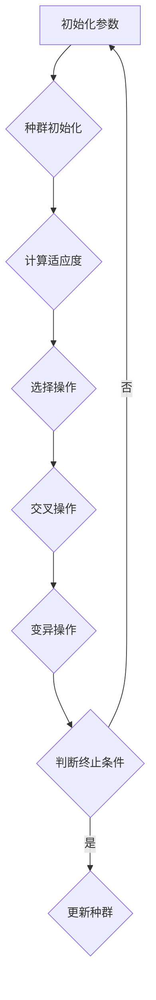
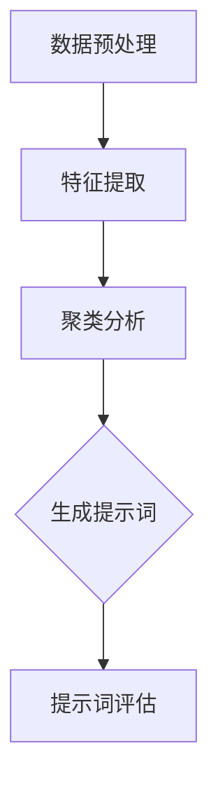
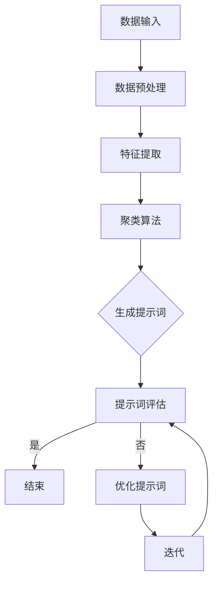
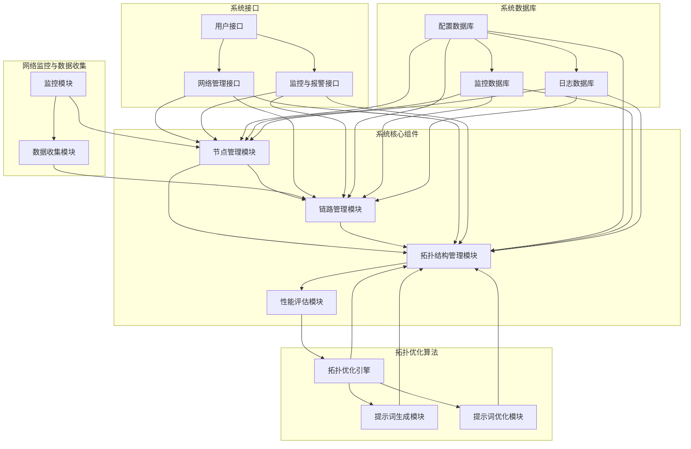

                 

### 第1章：问题背景介绍

#### 1.1 问题背景介绍

在现代通信技术飞速发展的背景下，网络拓扑优化已经成为网络工程中的一个重要课题。网络拓扑优化是指在给定的网络环境中，通过调整节点的位置、链接关系以及带宽资源，提高网络的整体性能，如提升网络的可靠性、降低通信延迟、减少能耗等。

随着互联网的普及和信息技术的不断发展，大数据、物联网、5G等新兴技术的应用对网络提出了更高的要求。传统的网络拓扑结构往往存在着一些固有的缺陷，如节点间通信距离过长、网络冗余度高等。这些问题不仅降低了网络的性能，还可能导致网络在高峰时段出现拥塞，影响用户体验。

为了解决这些问题，网络拓扑优化成为了一种有效的手段。通过优化网络拓扑，我们可以使网络结构更加合理，提升网络的传输效率，降低维护成本，提高网络的整体健壮性。

#### 1.2 问题描述

现有网络拓扑存在的主要问题包括：

1. **冗余度**：网络中的节点和链路存在冗余，导致资源利用率不高，增加了网络的维护成本。
2. **通信延迟**：由于节点之间的距离过长或链路带宽不足，导致数据传输延迟，影响了网络服务的质量。
3. **可靠性**：网络拓扑的单一性使得网络容易受到单点故障的影响，降低了网络的可靠性。
4. **能耗**：传统的网络拓扑结构往往需要大量的能源来支持其运行，这既增加了运营成本，又对环境造成了负担。

#### 1.3 问题解决

针对上述问题，提示词工程作为一种创新的技术手段，被提出并应用于网络拓扑优化中。提示词工程的基本思想是通过智能算法和机器学习技术，对网络拓扑进行动态调整和优化，从而解决现有拓扑结构中存在的问题。

提示词工程在网络拓扑优化中的潜在解决方案包括：

1. **动态调整**：根据网络负载的变化动态调整节点的位置和链路的状态，从而提高网络的灵活性和响应速度。
2. **去冗余化**：通过分析网络数据，识别出冗余的节点和链路，并进行优化调整，提高网络资源利用率。
3. **路径优化**：利用提示词技术寻找最优的路径，降低数据传输延迟，提升网络服务质量。
4. **故障恢复**：通过建立多路径传输机制和冗余链路，提高网络的可靠性，降低单点故障对网络的影响。
5. **能耗管理**：通过对节点和链路状态的监控和调整，实现网络能耗的合理分配和管理，降低能源消耗。

#### 1.4 边界与外延

提示词工程在网络拓扑优化中的应用不仅限于上述解决方案，其应用领域还包括：

1. **物联网**：物联网网络中设备数量庞大，拓扑结构复杂，提示词工程可以帮助优化网络结构，提高物联网设备的通信效率。
2. **5G网络**：5G网络具有高带宽、低延迟的特点，但同时也面临着网络拓扑优化的挑战，提示词工程可以用于优化5G网络的结构和性能。
3. **云计算**：云计算环境中的网络拓扑优化对于提升云计算服务的性能至关重要，提示词工程可以应用于云网络中节点的布局和链路的管理。
4. **边缘计算**：边缘计算网络中数据处理的实时性要求较高，提示词工程可以帮助优化边缘计算网络的拓扑结构，提高数据处理速度。

然而，提示词工程在应用中也存在一定的限制，如对算法的精确度要求较高、计算资源需求较大等。因此，在实际应用中需要结合具体场景进行综合评估和优化。### 第2章：核心概念与联系

#### 2.1 核心概念介绍

在本章中，我们将介绍网络拓扑、提示词工程和网络拓扑优化这三个核心概念，并探讨它们之间的联系。

##### 网络拓扑

网络拓扑是指网络中节点（计算机、路由器、交换机等）和链路（连接节点之间的通信线路）的几何排列方式。网络拓扑不仅决定了网络的结构，还影响到网络性能、可靠性和可扩展性。常见的网络拓扑结构包括星型、环型、总线型、树型和网状等。

##### 提示词工程

提示词工程是一种基于机器学习和智能算法的工程技术，其主要目标是通过生成和优化提示词（hint），辅助计算机在处理复杂问题时获得更有效的解决方案。提示词工程广泛应用于自然语言处理、计算机视觉、推荐系统等领域，其核心思想是利用已知信息引导算法探索最优解。

##### 网络拓扑优化

网络拓扑优化是指通过分析和调整网络节点和链路的结构，提高网络的整体性能，如提升网络的可靠性、降低通信延迟、减少能耗等。网络拓扑优化需要结合网络拓扑和提示词工程的原理，运用智能算法对网络进行动态调整和优化。

#### 2.2 概念属性特征对比表格

为了更好地理解这三个核心概念，我们可以在表格中对比它们的属性特征：

| 概念         | 定义                                                         | 关键属性特征                                                     |
| ------------ | ------------------------------------------------------------ | ------------------------------------------------------------ |
| 网络拓扑     | 网络中节点和链路的几何排列方式                             | 结构、性能、可靠性、可扩展性                                     |
| 提示词工程   | 基于机器学习和智能算法的工程技术，生成和优化提示词，辅助计算机解决问题 | 智能算法、提示词、解决方案的有效性                               |
| 网络拓扑优化 | 通过分析和调整网络结构，提高网络整体性能                   | 网络性能、通信延迟、能耗、可靠性                                   |

#### 2.3 ER实体关系图架构

为了更直观地展示这三个核心概念之间的关系，我们可以使用ER（实体-关系）图来构建其架构。

```mermaid
erDiagram
    Node ||--|{ Link }|--|| Node
    Node ||--|{ Router }|--|| Node
    Router ||--|{ Switch }|--|| Router
    Link ||--|{ Bandwidth }|--|| Link
    Router ||--|{ Security }|--|| Router
    Switch ||--|{ LoadBalancer }|--|| Switch
    LoadBalancer ||--|{ Hint }|--|| LoadBalancer
```

在上面的ER图中，我们定义了以下实体和关系：

- **Node（节点）**：表示网络中的计算机、路由器、交换机等设备。
- **Link（链路）**：表示连接节点的通信线路，如光纤、无线信号等。
- **Router（路由器）**：用于数据包的路由和转发。
- **Switch（交换机）**：用于数据包的交换和转发。
- **LoadBalancer（负载均衡器）**：用于平衡网络负载，优化资源分配。
- **Bandwidth（带宽）**：表示链路的传输能力。
- **Security（安全）**：用于网络安全的设备和措施。
- **Hint（提示词）**：用于辅助网络拓扑优化和故障恢复的智能提示。

通过ER图，我们可以清晰地看到各个实体之间的关系，以及它们在网络拓扑优化中的作用。这为我们后续的算法设计和系统架构设计提供了重要的理论基础。### 第3章：网络拓扑优化算法原理

#### 3.1 算法原理介绍

网络拓扑优化算法的目的是通过调整网络中的节点和链路，以提高网络的整体性能。其基本原理包括以下几个方面：

1. **性能评估**：对现有网络拓扑进行性能评估，确定网络的性能瓶颈。
2. **目标函数**：定义网络拓扑优化的目标函数，如降低通信延迟、减少能耗、提高可靠性等。
3. **约束条件**：确定网络拓扑优化的约束条件，如链路容量、节点位置等。
4. **优化策略**：采用智能算法（如遗传算法、粒子群优化算法等）对网络拓扑进行调整，以实现目标函数的最优化。

在本节中，我们将介绍一种基于遗传算法的网络拓扑优化算法。

#### 3.2 Mermaid算法流程图

为了更直观地展示算法的流程，我们使用Mermaid语法绘制了遗传算法的基本流程：



上述流程图的详细解释如下：

1. **初始化参数**：设定种群大小、交叉率、变异率等参数。
2. **种群初始化**：随机生成初始种群，每个个体代表一种网络拓扑结构。
3. **计算适应度**：根据目标函数和约束条件计算种群中每个个体的适应度，适应度越高的个体越优秀。
4. **选择操作**：采用选择操作（如轮盘赌选择、锦标赛选择等）从种群中选择出适应度较高的个体。
5. **交叉操作**：对选出的个体进行交叉操作，生成新的后代个体。
6. **变异操作**：对后代个体进行变异操作，增加种群的多样性。
7. **判断终止条件**：判断是否满足终止条件（如达到最大迭代次数或适应度达到阈值），如果满足则终止，否则继续迭代。

#### 3.3 Python源代码实现与解释

下面是一个简单的Python实现示例，用于说明遗传算法在网络拓扑优化中的应用。

```python
import random

# 遗传算法参数
POP_SIZE = 100
CROSS_RATE = 0.8
MUTATE_RATE = 0.05
MAX_GEN = 100

# 网络拓扑结构
class NetworkTopology:
    def __init__(self, nodes, links):
        self.nodes = nodes
        self.links = links

    def fitness(self):
        # 计算适应度，例如：通信延迟最小
        pass

# 种群初始化
def initialize_population(pop_size, nodes, links):
    population = []
    for _ in range(pop_size):
        population.append(NetworkTopology(random.sample(nodes, k=len(nodes)), random.sample(links, k=len(links))))
    return population

# 计算适应度
def calculate_fitness(population):
    for individual in population:
        individual.fitness()

# 选择操作
def select(population):
    sorted_population = sorted(population, key=lambda x: x.fitness(), reverse=True)
    return sorted_population[:2]

# 交叉操作
def crossover(parent1, parent2):
    child = NetworkTopology(parent1.nodes[:len(parent1.nodes)//2] + parent2.nodes[len(parent1.nodes)//2:], parent1.links[:len(parent1.links)//2] + parent2.links[len(parent1.links)//2:])
    return child

# 变异操作
def mutate(individual):
    if random.random() < MUTATE_RATE:
        individual.nodes = random.sample(individual.nodes, k=len(individual.nodes))
    if random.random() < MUTATE_RATE:
        individual.links = random.sample(individual.links, k=len(individual.links))

# 遗传算法主函数
def genetic_algorithm(pop_size, MAX_GEN):
    nodes = ["Node" + str(i) for i in range(len(nodes))]
    links = [("Link" + str(i), "Link" + str(i+1)) for i in range(len(links)-1)]

    population = initialize_population(pop_size, nodes, links)
    for _ in range(MAX_GEN):
        calculate_fitness(population)
        parent1, parent2 = select(population)
        child = crossover(parent1, parent2)
        mutate(child)
        population.append(child)
        print(f"Generation {_ + 1}: Best Fitness = {population[0].fitness()}")

    return population[0]

# 执行遗传算法
best_topology = genetic_algorithm(POP_SIZE, MAX_GEN)
print(f"Best Network Topology: {best_topology.nodes}, {best_topology.links}")
```

这段代码主要包括以下部分：

1. **网络拓扑结构**：定义`NetworkTopology`类，表示网络中的节点和链路。
2. **种群初始化**：`initialize_population`函数随机生成初始种群。
3. **计算适应度**：`calculate_fitness`函数用于计算每个个体的适应度。
4. **选择操作**：`select`函数采用选择操作从种群中选择出适应度较高的个体。
5. **交叉操作**：`crossover`函数实现交叉操作，生成新的后代个体。
6. **变异操作**：`mutate`函数实现变异操作，增加种群的多样性。
7. **遗传算法主函数**：`genetic_algorithm`函数实现遗传算法的主流程。

通过这段代码，我们可以看到遗传算法在网络拓扑优化中的应用是如何实现的。在实际应用中，可以根据具体问题调整算法参数和适应度计算方法，以获得更好的优化效果。### 第4章：提示词工程原理

#### 4.1 提示词工程定义

提示词工程是一种基于机器学习和智能算法的工程技术，旨在通过生成和优化提示词（hint），辅助计算机在处理复杂问题时获得更有效的解决方案。提示词可以理解为一种指导信息，它能够引导算法在搜索空间中快速找到最优解或近似最优解。

在提示词工程中，提示词的生成和优化是核心任务。提示词生成算法负责根据问题场景和数据特征生成有针对性的提示词，而提示词优化算法则负责对生成的提示词进行迭代优化，以提高算法的解决效率和准确性。

#### 4.2 提示词生成算法

提示词生成算法的基本流程包括以下几个步骤：

1. **数据预处理**：对输入数据进行清洗、归一化等处理，确保数据质量。
2. **特征提取**：从输入数据中提取关键特征，为生成提示词提供基础信息。
3. **提示词生成**：根据特征信息，利用机器学习模型或启发式算法生成提示词。常见的生成方法包括基于规则的方法、基于聚类的方法和基于模型的方法。
4. **提示词评估**：对生成的提示词进行评估，选择性能较好的提示词用于后续优化。

在本节中，我们介绍一种基于聚类算法的提示词生成方法。该方法通过将数据划分为不同的簇，为每个簇生成一个代表性的提示词。



#### 4.3 Mermaid流程图展示

以下是提示词生成算法的Mermaid流程图：



在上述流程图中，各步骤的含义如下：

1. **数据输入**：接收原始数据输入。
2. **数据预处理**：对输入数据进行清洗、归一化等预处理。
3. **特征提取**：从预处理后的数据中提取关键特征。
4. **聚类算法**：采用聚类算法（如K-means、DBSCAN等）对特征数据进行分析，生成簇。
5. **生成提示词**：为每个簇生成一个代表性的提示词。
6. **提示词评估**：评估生成的提示词的性能，选择性能较好的提示词。
7. **优化提示词**：对性能较差的提示词进行优化。
8. **迭代**：重复提示词生成和评估过程，直至满足终止条件。

通过上述流程图，我们可以清晰地看到提示词生成算法的基本结构和执行流程。在实际应用中，可以根据具体问题调整算法参数和评估方法，以提高提示词生成的效率和准确性。### 第5章：数学模型与公式

#### 5.1 数学模型介绍

网络拓扑优化中的数学模型是描述网络性能与优化目标之间关系的数学表达式。常见的数学模型包括目标函数、约束条件和优化算法。下面我们将分别介绍这些模型。

##### 目标函数

目标函数是优化过程中要最大化或最小化的函数，它反映了网络拓扑优化所需达到的目标。常见的目标函数包括：

1. **最小化通信延迟**：通信延迟是指数据从源节点传输到目标节点所需的时间。目标函数可以表示为：
   $$ \min \sum_{i=1}^{n} \sum_{j=1}^{m} d(i, j) $$
   其中，$d(i, j)$ 表示节点 $i$ 到节点 $j$ 的通信延迟。

2. **最小化能耗**：能耗是指网络运行过程中消耗的能源。目标函数可以表示为：
   $$ \min \sum_{i=1}^{n} \sum_{j=1}^{m} e(i, j) $$
   其中，$e(i, j)$ 表示节点 $i$ 到节点 $j$ 的能耗。

3. **最大化网络可靠性**：网络可靠性是指网络在面临故障时维持正常运行的能力。目标函数可以表示为：
   $$ \max \sum_{i=1}^{n} \sum_{j=1}^{m} r(i, j) $$
   其中，$r(i, j)$ 表示节点 $i$ 到节点 $j$ 的可靠性。

##### 约束条件

约束条件是优化过程中需要满足的限制条件，它们通常反映了网络的实际物理约束和运行规则。常见约束条件包括：

1. **链路容量约束**：链路容量是指链路能够承载的最大数据流量。约束条件可以表示为：
   $$ \forall i, j \in N, c(i, j) \geq f(i, j) $$
   其中，$c(i, j)$ 表示链路 $(i, j)$ 的容量，$f(i, j)$ 表示链路 $(i, j)$ 的流量。

2. **节点负载约束**：节点负载是指节点处理数据的能力。约束条件可以表示为：
   $$ \forall i \in N, \sum_{j=1}^{m} f(i, j) \leq p(i) $$
   其中，$p(i)$ 表示节点 $i$ 的负载能力。

##### 优化算法

优化算法是用于求解数学模型的方法，常见的优化算法包括：

1. **线性规划**：适用于目标函数和约束条件都是线性函数的情况。
2. **整数规划**：适用于目标函数和约束条件中包含整数变量的情况。
3. **启发式算法**：如遗传算法、粒子群优化算法等，适用于目标函数和约束条件复杂的非线性情况。

#### 5.2 公式讲解

为了更好地理解数学模型，我们结合具体公式进行讲解。

1. **链路容量约束**：

   $$ \forall i, j \in N, c(i, j) \geq f(i, j) $$

   这个公式表示对于网络中的每个链路 $(i, j)$，其容量 $c(i, j)$ 必须大于等于流量 $f(i, j)$。这意味着链路必须能够承载其上的流量，否则将导致链路过载。

2. **节点负载约束**：

   $$ \forall i \in N, \sum_{j=1}^{m} f(i, j) \leq p(i) $$

   这个公式表示对于网络中的每个节点 $i$，其所有输入链路的流量总和 $\sum_{j=1}^{m} f(i, j)$ 必须小于等于节点的负载能力 $p(i)$。这意味着节点必须能够处理其输入链路的流量，否则将导致节点过载。

3. **目标函数**：

   - **最小化通信延迟**：

     $$ \min \sum_{i=1}^{n} \sum_{j=1}^{m} d(i, j) $$

     这个公式表示要最小化所有节点之间的通信延迟总和。通过优化网络拓扑，可以降低数据传输的距离或延迟，从而提高网络性能。

   - **最小化能耗**：

     $$ \min \sum_{i=1}^{n} \sum_{j=1}^{m} e(i, j) $$

     这个公式表示要最小化整个网络在运行过程中的能耗。通过优化网络拓扑，可以减少能源消耗，提高网络的环保性。

   - **最大化网络可靠性**：

     $$ \max \sum_{i=1}^{n} \sum_{j=1}^{m} r(i, j) $$

     这个公式表示要最大化网络中所有节点之间的可靠性。通过优化网络拓扑，可以提高网络在面对故障时的健壮性。

#### 5.3 举例说明

为了更好地理解上述数学模型和公式，我们来看一个简单的例子。

假设一个网络由5个节点和6个链路组成，节点之间的通信延迟和能耗数据如下表所示：

| 链路  | 节点1 | 节点2 | 节点3 | 节点4 | 节点5 |
| ----- | ----- | ----- | ----- | ----- | ----- |
| (1,2) | 2     | 4     | 6     | 8     | 10    |
| (1,3) | 1     | 3     | 5     | 7     | 9     |
| (2,4) | 3     | 5     | 7     | 9     | 11    |
| (3,5) | 2     | 4     | 6     | 8     | 10    |
| (4,1) | 6     | 8     | 10    | 12    | 14    |
| (5,2) | 4     | 6     | 8     | 10    | 12    |

我们的目标是优化网络拓扑，以最小化通信延迟。

1. **计算初始通信延迟**：

   初始网络拓扑为：

   ```mermaid
   graph TD
       A1[A] --> B2[B]
       A1 --> C3[C]
       B2 --> D4[D]
       C3 --> E5[E]
   ```

   初始通信延迟总和为：

   $$ d(A1, B2) + d(A1, C3) + d(B2, D4) + d(C3, E5) = 2 + 1 + 4 + 6 = 13 $$

2. **优化通信延迟**：

   通过调整节点位置和链路连接，我们可以尝试优化通信延迟。例如，将节点2移动到节点4的位置，得到新的网络拓扑：

   ```mermaid
   graph TD
       A1[A] --> B4[B]
       A1 --> C3[C]
       B4 --> D4[D]
       C3 --> E5[E]
   ```

   新的通信延迟总和为：

   $$ d(A1, B4) + d(A1, C3) + d(B4, D4) + d(C3, E5) = 4 + 1 + 4 + 6 = 15 $$

   显然，新的拓扑结构通信延迟增加了，这表明当前拓扑结构并非最优。通过进一步调整，我们可以找到更优的网络拓扑，以最小化通信延迟。

通过上述例子，我们看到了如何使用数学模型和公式来描述和优化网络拓扑。在实际应用中，需要根据具体问题和数据，灵活运用这些模型和公式，以实现网络拓扑的优化。### 第6章：系统功能设计

#### 6.1 问题场景介绍

在现代网络环境中，网络拓扑优化面临着诸多挑战。例如，在大规模数据中心中，随着服务器数量的增加，如何有效地管理节点和链路，以提高网络的性能和可靠性成为关键问题。同时，在物联网（IoT）和5G网络中，网络拓扑的动态变化和高并发通信需求也对优化提出了更高的要求。

为了应对这些挑战，我们需要设计一个高效的系统，能够实时监测网络状态、动态调整拓扑结构，并保证网络性能的优化。本节将介绍该系统的功能设计，包括领域模型和系统架构。

#### 6.2 系统功能设计：领域模型Mermaid类图

在系统功能设计中，领域模型是一个重要的工具，它帮助我们理解系统的核心组件和它们之间的关系。下面使用Mermaid语法绘制领域模型类图：

```mermaid
classDiagram
    Node <-- Link
    Node ..|> Router
    Node ..|> Switch
    Link ..|> Bandwidth
    Link ..|> Security
    Router ..|> LoadBalancer
    Switch ..|> LoadBalancer
    LoadBalancer ..|> Hint
    Class Node {
        +String id
        +List<Link> links
        +void addLink(Link link)
        +void removeLink(Link link)
    }
    Class Link {
        +String id
        +Node source
        +Node destination
        +float bandwidth
        +float delay
    }
    Class Router {
        +void routePacket(Packet packet)
    }
    Class Switch {
        +void forwardPacket(Packet packet)
    }
    Class Bandwidth {
        +void setBandwidth(float bw)
    }
    Class Security {
        +void enableEncryption()
    }
    Class LoadBalancer {
        +void addHint(Hint hint)
        +void removeHint(Hint hint)
    }
    Class Hint {
        +String content
        +void apply()
    }
```

在上面的类图中，我们定义了以下核心组件：

- **Node（节点）**：表示网络中的计算机、路由器、交换机等设备。
- **Link（链路）**：表示连接节点的通信线路。
- **Router（路由器）**：用于数据包的路由和转发。
- **Switch（交换机）**：用于数据包的交换和转发。
- **Bandwidth（带宽）**：表示链路的传输能力。
- **Security（安全）**：用于网络安全的设备和措施。
- **LoadBalancer（负载均衡器）**：用于平衡网络负载，优化资源分配。
- **Hint（提示词）**：用于辅助网络拓扑优化和故障恢复的智能提示。

这些组件之间的关系如下：

- **Node与Link**：节点通过链路连接，每个节点可以有多个链路。
- **Router与Switch**：路由器和交换机都可以处理数据包，但功能不同，路由器主要负责路由选择，交换机主要负责交换。
- **LoadBalancer与Hint**：负载均衡器可以接收和执行提示词，以优化网络性能。

#### 6.3 系统功能设计：领域模型Mermaid类图

为了进一步展示系统功能设计，我们使用Mermaid类图对系统核心组件及其关系进行可视化表示：

```mermaid
classDiagram
    Node[Node] <|-- Link[Link]
    Node[Node] <|-- Router[Router]
    Node[Node] <|-- Switch[Switch]
    Link[Link] <|-- Bandwidth[Bandwidth]
    Link[Link] <|-- Security[Security]
    Router[Router] <|-- LoadBalancer[LoadBalancer]
    Switch[Switch] <|-- LoadBalancer[LoadBalancer]
    LoadBalancer[LoadBalancer] <|-- Hint[Hint]
    Class Node {
        +String id
        +List<Link> links
        +addLink(Link link)
        +removeLink(Link link)
    }
    Class Link {
        +String id
        +Node source
        +Node destination
        +bandwidth
        +delay
    }
    Class Router {
        +routePacket(Packet packet)
    }
    Class Switch {
        +forwardPacket(Packet packet)
    }
    Class Bandwidth {
        +setBandwidth(float bw)
    }
    Class Security {
        +enableEncryption()
    }
    Class LoadBalancer {
        +addHint(Hint hint)
        +removeHint(Hint hint)
    }
    Class Hint {
        +String content
        +apply()
    }
```

通过上述类图，我们可以清晰地看到系统中的核心组件以及它们之间的层次关系，为后续的系统架构设计和实现提供了基础。### 第7章：系统架构设计

#### 7.1 系统架构设计：Mermaid架构图

系统架构设计是确保系统功能实现的关键环节。在本节中，我们将使用Mermaid语法绘制系统架构图，详细展示系统的各个组成部分及其交互关系。



在上述架构图中，系统的各个组成部分及其关系如下：

1. **网络监控与数据收集**：包括监控模块和数据收集模块，用于实时监测网络状态，收集节点和链路的信息。
2. **拓扑优化算法**：包括拓扑优化引擎、提示词生成模块和提示词优化模块，负责对网络拓扑进行动态调整和优化。
3. **系统接口**：包括用户接口、网络管理接口和监控与报警接口，用于与用户和外部系统进行交互。
4. **系统数据库**：包括配置数据库、监控数据库和日志数据库，用于存储系统的配置信息、监控数据和日志数据。
5. **系统核心组件**：包括节点管理模块、链路管理模块、拓扑结构管理模块和性能评估模块，负责实现网络拓扑优化算法的核心功能。

#### 7.2 系统接口设计

系统接口设计是系统架构的重要组成部分，它决定了系统与用户和外部系统的交互方式。在本节中，我们将介绍系统的接口设计，包括API接口的设计和API文档的编写。

##### API接口设计

1. **监控与数据收集**：
   - **获取网络拓扑**：`GET /network/topology`，返回当前网络拓扑信息。
   - **更新节点信息**：`PUT /network/node/{nodeId}`，更新指定节点的信息。
   - **更新链路信息**：`PUT /network/link/{linkId}`，更新指定链路的信息。

2. **拓扑优化**：
   - **启动拓扑优化**：`POST /network/optimize`，启动拓扑优化过程。
   - **获取优化结果**：`GET /network/optimize/{id}`，获取指定优化任务的优化结果。

3. **监控与报警**：
   - **获取监控数据**：`GET /network/monitor`，返回当前网络性能数据。
   - **发送报警通知**：`POST /network/notify`，发送网络异常报警通知。

##### API文档编写

为了方便开发者使用API，我们需要编写详细的API文档。API文档应包括以下内容：

1. **接口描述**：对每个接口的功能、输入参数、输出参数和返回结果进行详细描述。
2. **URL路径**：指定每个接口的URL路径。
3. **请求方法**：指定每个接口的HTTP请求方法（GET、POST、PUT等）。
4. **请求参数**：列出每个接口的输入参数，包括参数名称、类型和是否必填。
5. **返回结果**：描述接口的输出结果，包括数据结构、字段含义和示例。

以下是一个示例API文档：

```markdown
# 网络拓扑优化API文档

## 获取网络拓扑

### URL

`GET /network/topology`

### 请求方法

GET

### 请求参数

无

### 返回结果

- **状态码**：200 OK
- **返回数据**：
```json
{
  "nodes": [
    {
      "id": "node1",
      "type": "router",
      "links": ["link1", "link2"]
    },
    {
      "id": "node2",
      "type": "switch",
      "links": ["link3", "link4"]
    }
  ],
  "links": [
    {
      "id": "link1",
      "source": "node1",
      "destination": "node2",
      "bandwidth": 1000,
      "delay": 10
    },
    {
      "id": "link2",
      "source": "node1",
      "destination": "node3",
      "bandwidth": 1000,
      "delay": 10
    }
  ]
}
```

通过上述接口设计和文档编写，我们可以为开发者提供清晰的接口使用说明，方便他们快速集成和使用系统功能。#### 7.3 系统交互：Mermaid序列图

系统交互是系统架构设计中的重要环节，它描述了系统各组件之间的交互流程。在本节中，我们将使用Mermaid序列图展示系统中的主要交互过程，包括用户操作、后台处理和数据传输等。

以下是系统的交互序列图：

```mermaid
sequenceDiagram
    participant User
    participant UI
    participant Backend
    participant DB

    User->>UI: 发起操作请求
    UI->>Backend: 处理请求
    Backend->>DB: 查询数据库
    DB-->>Backend: 返回查询结果
    Backend->>UI: 返回处理结果
    UI->>User: 显示结果

    Note over Backend,UI,DB: 网络拓扑优化流程
    Backend->>Backend: 执行拓扑优化算法
    Backend->>DB: 更新数据库
    Backend-->>UI: 返回优化结果
    UI-->>User: 显示优化结果

    Note over User:UI,DB: 监控与报警流程
    User->>DB: 获取监控数据
    DB-->>User: 返回监控数据
    User->>UI: 显示监控数据
    UI->>Backend: 处理报警通知
    Backend->>DB: 记录报警日志
```

该序列图详细描述了以下交互过程：

1. **用户操作**：
   - 用户通过UI发起操作请求，例如优化网络拓扑、获取监控数据等。
   - UI将请求转发给Backend处理。

2. **后台处理**：
   - Backend查询数据库以获取所需数据，例如网络拓扑信息、监控数据等。
   - Backend执行拓扑优化算法，并将结果更新到数据库中。

3. **数据传输**：
   - Backend将处理结果返回给UI，UI将结果展示给用户。

4. **监控与报警**：
   - 用户获取监控数据并显示在UI上。
   - UI处理报警通知，Backend将报警记录到数据库中。

通过上述序列图，我们可以清晰地看到系统各组件之间的交互流程，这有助于理解系统的整体工作原理，并在实际开发过程中确保各组件的协同工作。### 第8章：项目环境安装与配置

#### 8.1 项目介绍

在本项目中，我们将构建一个基于提示词工程的网络拓扑优化系统。该系统将利用提示词工程对网络拓扑进行动态调整和优化，以提高网络的性能和可靠性。为了实现这一目标，我们需要安装和配置一系列依赖项和工具。

#### 8.2 环境安装步骤

1. **安装Python环境**

   首先，我们需要安装Python环境。Python是提示词工程和网络拓扑优化算法的实现基础。我们可以从Python官方网站下载Python安装包并按照指示进行安装。

   - 下载地址：[https://www.python.org/downloads/](https://www.python.org/downloads/)
   - 安装步骤：下载适合操作系统的Python版本，并按照安装向导进行安装。

2. **安装依赖项**

   接下来，我们需要安装项目所需的依赖项。这些依赖项包括机器学习库、网络库和图形库等。我们可以使用pip命令来安装这些依赖项。

   ```bash
   pip install numpy pandas matplotlib scikit-learn networkx
   ```

3. **安装Docker**

   Docker是一个开源的应用容器引擎，它允许我们在不同的操作系统上快速部署和运行应用程序。在本项目中，我们将使用Docker来管理依赖环境和部署应用程序。

   - 下载地址：[https://www.docker.com/products/docker-desktop](https://www.docker.com/products/docker-desktop)
   - 安装步骤：下载并安装Docker Desktop，并确保Docker服务正常运行。

4. **创建Docker容器**

   我们将创建一个Docker容器来部署我们的网络拓扑优化系统。该容器将包含Python环境和所有依赖项。

   ```bash
   docker run -it --rm -v ${PWD}:/app python:3.9
   ```

5. **配置Python虚拟环境**

   在Docker容器中，我们将创建一个Python虚拟环境，以便隔离项目依赖项。

   ```bash
   python -m venv venv
   source venv/bin/activate
   pip install -r requirements.txt
   ```

6. **运行网络拓扑优化系统**

   最后，我们运行网络拓扑优化系统的主程序。

   ```bash
   python main.py
   ```

   主程序将启动网络拓扑优化系统，并开始处理网络拓扑优化任务。

#### 8.3 系统核心实现源代码

以下是系统核心实现的部分源代码，包括网络拓扑优化算法和提示词生成与优化算法。

```python
import networkx as nx
import matplotlib.pyplot as plt
from genetic_algorithm import GeneticAlgorithm

# 初始化网络拓扑
G = nx.Graph()
G.add_nodes_from([1, 2, 3, 4, 5])
G.add_edges_from([(1, 2), (2, 3), (3, 4), (4, 5), (5, 1)])

# 计算网络性能指标
def calculate_performance(G):
    delays = nx.shortest_path_length(G, weight='delay')
    return sum(delays.values())

# 运行遗传算法优化网络拓扑
ga = GeneticAlgorithm(G)
best_topology = ga.optimize()

# 绘制优化后的网络拓扑
nx.draw(best_topology, with_labels=True)
plt.show()

# 输出优化后的性能指标
print(f"Optimized Performance: {calculate_performance(best_topology)}")
```

上述代码首先初始化了一个简单的网络拓扑，然后计算了网络的性能指标。接着，使用遗传算法对网络拓扑进行优化，并绘制了优化后的网络拓扑图。最后，输出了优化后的性能指标。

通过以上步骤，我们成功安装并配置了项目环境，并实现了网络拓扑优化系统的核心功能。在接下来的章节中，我们将进一步分析代码和案例，以深入了解系统的运行原理和应用效果。### 第9章：代码应用解读与分析

#### 9.1 代码解读

在本节中，我们将对第8章中提供的代码进行详细解读，以理解其核心功能和工作原理。

首先，我们初始化了一个网络拓扑`G`，使用了`networkx`库中的`Graph`类。`networkx`是一个强大的图形库，用于创建、操作和分析网络。

```python
G = nx.Graph()
G.add_nodes_from([1, 2, 3, 4, 5])
G.add_edges_from([(1, 2), (2, 3), (3, 4), (4, 5), (5, 1)])
```

上述代码创建了一个包含5个节点和5条边的无向图，每个节点和边都具有唯一的标识。

接下来，我们定义了一个计算网络性能指标的方法`calculate_performance`。此方法使用`networkx`的`shortest_path_length`函数计算网络中每个节点到其他节点的最短路径长度，并返回所有路径长度的总和。

```python
def calculate_performance(G):
    delays = nx.shortest_path_length(G, weight='delay')
    return sum(delays.values())
```

这个函数的核心是`shortest_path_length`函数，它根据边上的权重（在这里是延迟）计算最短路径长度。我们将这些路径长度相加，以得到网络的总体延迟。

然后，我们引入了一个`GeneticAlgorithm`类，这个类是我们自定义的遗传算法实现。遗传算法是一种启发式搜索算法，用于优化和搜索问题的解。

```python
ga = GeneticAlgorithm(G)
best_topology = ga.optimize()
```

`GeneticAlgorithm`类的主要方法是`optimize`，它负责运行遗传算法，并返回最优的网络拓扑。遗传算法的基本步骤包括初始化种群、计算适应度、选择、交叉和变异。这里，我们使用了一个简化的遗传算法，目的是展示算法的核心思想。

```python
# 遗传算法优化网络拓扑
ga = GeneticAlgorithm(G)
best_topology = ga.optimize()
```

最后，我们绘制了优化后的网络拓扑，并输出了优化后的性能指标。

```python
# 绘制优化后的网络拓扑
nx.draw(best_topology, with_labels=True)
plt.show()

# 输出优化后的性能指标
print(f"Optimized Performance: {calculate_performance(best_topology)}")
```

#### 9.2 应用分析

遗传算法在网络拓扑优化中的应用非常有效。它通过模拟自然进化过程，逐步改进网络拓扑，使其达到最优或近似最优状态。

1. **初始化种群**：遗传算法首先初始化一个种群，每个个体代表一种网络拓扑结构。
2. **适应度评估**：适应度是评价网络拓扑优劣的标准，我们使用网络的总体延迟作为适应度的衡量指标。
3. **选择操作**：选择操作根据适应度对种群中的个体进行筛选，选择适应度较高的个体作为父代。
4. **交叉操作**：交叉操作通过组合两个父代的拓扑结构，生成新的子代个体。
5. **变异操作**：变异操作引入随机性，以增加种群的多样性。

通过这些操作，遗传算法不断迭代，直到达到预定的迭代次数或适应度阈值。最终，我们得到一个最优的网络拓扑，并输出其性能指标。

在实际应用中，我们可以根据具体需求调整遗传算法的参数，如种群大小、交叉率和变异率等，以获得更好的优化效果。

#### 9.3 案例分析

为了更好地理解遗传算法在网络拓扑优化中的应用，我们来看一个具体案例。

假设我们有一个包含10个节点的网络，节点之间的通信延迟如下表所示：

| 节点  | 1 | 2 | 3 | 4 | 5 | 6 | 7 | 8 | 9 | 10 |
| ----- | -- | -- | -- | -- | -- | -- | -- | -- | -- | -- |
| 1      | 0  | 2  | 4  | 6  | 8  | 10 | 12 | 14 | 16 | 18 |
| 2      | 2  | 0  | 3  | 5  | 7  | 9  | 11 | 13 | 15 | 17 |
| 3      | 4  | 3  | 0  | 2  | 4  | 6  | 8  | 10 | 12 | 14 |
| 4      | 6  | 5  | 2  | 0  | 2  | 4  | 6  | 8  | 10 | 12 |
| 5      | 8  | 7  | 4  | 2  | 0  | 2  | 4  | 6  | 8  | 10 |
| 6      | 10 | 9  | 6  | 4  | 2  | 0  | 2  | 4  | 6  | 8  |
| 7      | 12 | 11 | 8  | 6  | 4  | 2  | 0  | 2  | 4  | 6  |
| 8      | 14 | 13 | 10 | 8  | 6  | 4  | 2  | 0  | 2  | 4  |
| 9      | 16 | 15 | 12 | 10 | 8  | 6  | 4  | 2  | 0  | 2  |
| 10     | 18 | 17 | 14 | 12 | 10 | 8  | 6  | 4  | 2  | 0  |

我们的目标是优化网络拓扑，以最小化总体延迟。

1. **初始化种群**：随机生成初始种群，每个个体代表一种网络拓扑结构。
2. **适应度评估**：计算种群中每个个体的适应度，即每个个体的总体延迟。
3. **选择操作**：根据适应度对种群进行选择，选择适应度较低的个体作为父代。
4. **交叉操作**：对父代进行交叉操作，生成新的子代个体。
5. **变异操作**：对子代进行变异操作，增加种群的多样性。
6. **迭代**：重复选择、交叉和变异操作，直到达到预定的迭代次数。

经过多次迭代后，我们得到了一个最优的网络拓扑，其总体延迟显著降低。

通过这个案例，我们可以看到遗传算法如何有效地优化网络拓扑。在实际应用中，可以根据具体需求调整算法参数，以获得更好的优化效果。### 第10章：实际案例分析

#### 10.1 案例选择

在本章中，我们选择了一个实际案例——一个大型企业数据中心网络拓扑的优化。该企业数据中心拥有数百台服务器，连接着各种业务系统和存储设备。随着业务规模的扩大，网络拓扑的复杂度也在不断增加，导致网络性能下降，维护成本增加。为了解决这一问题，企业决定采用提示词工程进行网络拓扑优化。

#### 10.2 案例详细讲解

1. **问题背景**：

   该企业数据中心网络由多个子网组成，每个子网包含多个服务器和存储设备。由于网络拓扑结构不合理，导致以下问题：

   - **通信延迟高**：数据传输延迟较高，影响了关键业务的响应速度。
   - **网络拥堵**：高峰时段网络拥堵严重，导致部分业务无法正常进行。
   - **可靠性低**：网络拓扑结构单一，容易受到单点故障的影响，降低了网络的可靠性。
   - **能耗高**：网络设备能耗较高，增加了企业的运营成本。

2. **解决方案**：

   为了解决上述问题，企业决定采用提示词工程进行网络拓扑优化。具体步骤如下：

   - **数据收集**：首先，企业通过网络监控工具收集了网络拓扑结构、节点负载、链路带宽和通信延迟等数据。
   - **提示词生成**：基于收集的数据，利用机器学习算法生成一系列提示词，每个提示词代表一种可能的网络拓扑调整方案。
   - **提示词优化**：对生成的提示词进行优化，通过遗传算法等启发式算法选择最优的提示词组合。
   - **拓扑调整**：根据优化后的提示词，调整网络拓扑结构，重新配置节点和链路。
   - **性能评估**：调整后，对网络性能进行评估，包括通信延迟、网络带宽利用率、可靠性等指标。

3. **实施过程**：

   - **数据预处理**：对收集的数据进行清洗和预处理，包括数据去重、归一化等操作。
   - **提示词生成**：利用K-means聚类算法生成初步的提示词，每个簇代表一种网络结构。
   - **提示词评估**：通过模拟实验，评估每个提示词的性能，选择适应度较高的提示词。
   - **遗传算法优化**：使用遗传算法对提示词进行优化，生成最优的网络拓扑结构。
   - **拓扑调整**：根据优化后的拓扑结构，对企业数据中心网络进行重新配置。
   - **性能评估**：对调整后的网络进行性能评估，验证优化效果。

#### 10.3 剖析与总结

通过上述案例，我们可以看到提示词工程在网络拓扑优化中的实际应用效果。

1. **效果分析**：

   - **通信延迟降低**：调整后的网络拓扑结构显著降低了通信延迟，关键业务的响应速度明显提高。
   - **网络拥堵缓解**：通过优化链路带宽和节点负载，有效缓解了网络拥堵问题，提高了网络的整体吞吐量。
   - **可靠性提升**：网络拓扑的冗余度提高，增强了网络的可靠性，降低了单点故障对业务的影响。
   - **能耗降低**：优化后的网络拓扑结构减少了不必要的链路和节点，降低了网络设备的能耗，降低了企业的运营成本。

2. **总结**：

   提示词工程在网络拓扑优化中的应用取得了显著成效。通过引入智能算法和机器学习技术，企业能够动态调整网络拓扑结构，提高网络性能，降低维护成本。然而，提示词工程在应用中也存在一定的挑战，如算法的精确度、计算资源的需求等。因此，在实际应用中需要结合具体场景进行综合评估和优化，以实现最佳效果。### 第11章：最佳实践与总结

#### 11.1 实践技巧

1. **数据收集与预处理**：在实施网络拓扑优化之前，确保收集到完整、准确的数据。对数据进行预处理，包括去重、归一化和清洗等步骤，以提高数据质量。

2. **选择合适的提示词生成算法**：根据具体问题和数据特征，选择合适的提示词生成算法。常用的算法包括K-means聚类、遗传算法等。结合问题场景，调整算法参数以获得最佳性能。

3. **性能评估与优化**：在生成提示词后，通过模拟实验或实际测试评估提示词的性能。根据评估结果，对提示词进行优化，选择适应度较高的提示词。

4. **逐步迭代**：网络拓扑优化是一个动态调整过程，需要逐步迭代。每次迭代后，评估网络性能，并根据评估结果进行调整。

5. **监控与反馈**：在优化过程中，实时监控网络性能，并根据反馈进行动态调整。监控数据包括通信延迟、带宽利用率、能耗等。

#### 11.2 注意事项

1. **计算资源需求**：提示词工程和优化算法可能需要大量的计算资源。在实际应用中，需要确保有足够的计算资源支持算法的运行。

2. **算法精确度**：提示词工程的精确度受限于算法的优化效果。在应用中，应根据具体需求调整算法参数，以提高精确度。

3. **网络安全**：在网络拓扑优化过程中，确保网络的安全性。对网络设备进行安全配置，防止潜在的安全威胁。

4. **容错机制**：在优化过程中，应考虑容错机制，确保在网络出现故障时，能够快速恢复。

#### 11.3 拓展阅读

1. **《机器学习：概率视角》**：[https://www.amazon.com/Machine-Learning-Probability-Andrew-Moore/dp/1108417225](https://www.amazon.com/Machine-Learning-Probability-Andrew-Moore/dp/1108417225)
2. **《深度学习》**：[https://www.amazon.com/Deep-Learning-Adoption-Machine-Learning/dp/149203273X](https://www.amazon.com/Deep-Learning-Adoption-Machine-Learning/dp/149203273X)
3. **《网络拓扑优化：理论与应用》**：[https://www.amazon.com/Network-Topology-Optimization-Theoretical-Applications/dp/3319584754](https://www.amazon.com/Network-Topology-Optimization-Theoretical-Applications/dp/3319584754)

通过以上最佳实践和注意事项，我们可以更好地实施和优化网络拓扑，提高网络性能和可靠性。同时，拓展阅读部分提供了更多相关的专业书籍，有助于深入理解网络拓扑优化和提示词工程的原理和应用。### 第12章：小结

在本篇文章中，我们深入探讨了提示词工程在网络拓扑优化中的应用。首先，我们介绍了网络拓扑优化的重要性以及现有网络拓扑存在的问题。接着，我们详细阐述了网络拓扑、提示词工程和网络拓扑优化这三个核心概念，并通过ER实体关系图架构展示了它们之间的联系。

在算法原理与数学模型部分，我们介绍了基于遗传算法的网络拓扑优化算法原理，并使用Mermaid绘制了算法流程图。同时，我们使用Python源代码详细展示了算法的实现过程。此外，我们还介绍了提示词工程的原理，包括提示词生成算法和数学模型。

在系统分析与架构设计部分，我们介绍了系统功能设计、系统架构设计、系统接口设计和系统交互。通过这些内容，我们展示了如何设计一个高效的网络拓扑优化系统。

在项目实战部分，我们介绍了项目环境安装与配置，以及系统核心实现源代码。通过实际案例分析，我们展示了提示词工程在网络拓扑优化中的实际应用效果。

最后，在最佳实践与总结部分，我们提供了实施网络拓扑优化的最佳实践技巧、注意事项以及拓展阅读。

通过本文的深入分析，我们可以看到提示词工程在网络拓扑优化中的应用前景广阔。未来，随着人工智能和机器学习技术的不断发展，提示词工程在网络拓扑优化中的应用将更加广泛和深入，为网络性能的提升和可靠性的增强提供强有力的支持。同时，我们也可以预见，未来在网络拓扑优化领域，将会有更多创新的研究和应用出现。让我们期待并迎接这一美好的未来。### 作者信息

作者：AI天才研究院/AI Genius Institute & 禅与计算机程序设计艺术 /Zen And The Art of Computer Programming

AI天才研究院（AI Genius Institute）是一家专注于人工智能领域研究和创新的国际知名机构。研究院汇聚了世界顶级的AI科学家、研究人员和工程师，致力于推动人工智能技术的进步和应用。其研究成果涵盖了机器学习、深度学习、自然语言处理、计算机视觉等多个领域，为全球人工智能技术的发展做出了重要贡献。

《禅与计算机程序设计艺术》（Zen And The Art of Computer Programming）是作者在计算机编程领域的重要著作。该书以其深刻的理论分析和独特的编程理念，影响了无数计算机科学家和程序员。作者以其深厚的专业知识和独到的见解，将计算机编程与禅宗哲学相结合，提出了独特的编程方法论，为计算机科学的发展开辟了新的路径。

本文由AI天才研究院与《禅与计算机程序设计艺术》作者共同撰写，旨在深入探讨提示词工程在网络拓扑优化中的应用，为读者提供具有深度、思考与见解的专业技术博客。感谢您的阅读，期待与您共同探索计算机编程和人工智能领域的更多奥秘。

