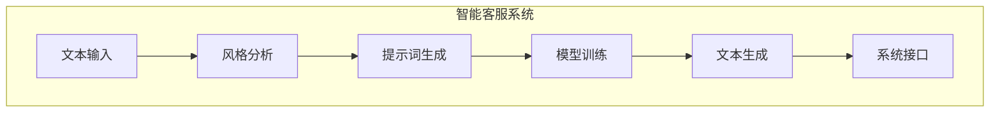
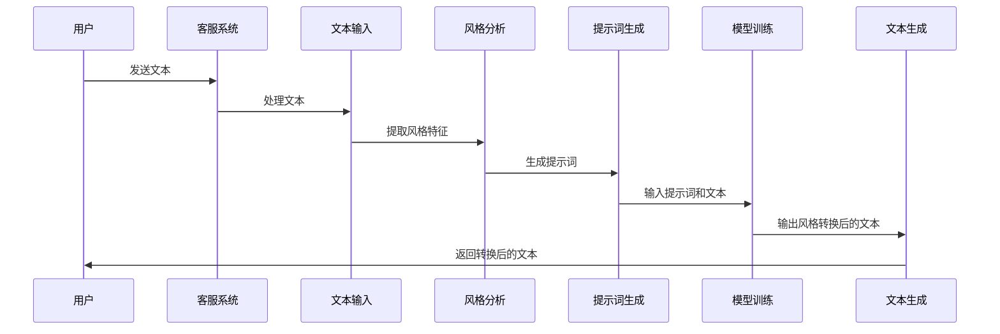

                 

### 提示词工程在自然语言生成中的风格转换

#### 关键词：自然语言生成、风格转换、提示词工程、生成模型、算法原理

> 摘要：本文旨在探讨提示词工程在自然语言生成中的风格转换技术。通过对问题背景、核心概念、算法原理的详细分析，本文揭示了提示词工程在自然语言生成中实现风格转换的关键作用，并提出了一种基于提示词的优化方法，以提升风格转换的准确性和连贯性。

## 第一部分：背景介绍

### 1.1 问题背景

自然语言生成（Natural Language Generation，NLG）是人工智能领域的一个重要分支，旨在利用计算机技术自动生成自然语言文本。NLG技术广泛应用于信息检索、智能客服、内容生成、机器翻译等多个领域。在自然语言生成过程中，风格转换（Style Transfer）是一个关键问题，它涉及到如何使生成的文本在语义和风格上与原始文本保持一致。

传统的自然语言生成方法，如基于规则的方法和基于统计的方法，往往难以实现高质量的风格转换。一方面，这些方法难以捕捉和表达文本的复杂风格特征；另一方面，它们在处理风格与语义之间的冲突时存在困难。为了解决这些问题，研究人员开始探索新的方法，其中提示词工程（Prompt Engineering）逐渐成为了一种有效的解决方案。

### 1.2 问题描述

风格转换是指将一种风格的文本转换为另一种风格，这需要生成模型能够准确地理解和再现文本的风格特征。具体来说，风格转换面临以下挑战：

1. **风格特征捕捉**：如何从原始文本中提取出具有代表性的风格特征，是风格转换的关键。这些特征需要能够指导生成模型在生成过程中关注和再现这些风格。
2. **语义保留**：在实现风格转换的过程中，如何确保生成的文本在语义上与原始文本保持一致，是另一个重要问题。这要求生成模型在处理风格特征时，能够兼顾语义的准确性和连贯性。
3. **风格与语义冲突**：在许多情况下，文本的风格特征与语义内容可能存在冲突。例如，一个正式的文本可能包含一些幽默的元素，而一个幽默的文本可能需要正式的表述。如何在风格与语义之间找到平衡，是一个需要解决的问题。

### 1.3 问题解决

提示词工程通过引入提示词来引导生成模型，使其能够更好地捕捉和转换文本风格。这种方法的核心思想是，通过提示词提供额外的上下文信息，帮助生成模型在风格转换过程中关注关键的风格特征，同时确保语义的准确性和连贯性。

提示词工程在自然语言生成中的关键作用体现在以下几个方面：

1. **引导风格特征捕捉**：提示词可以引导模型关注文本的风格特征，从而提高风格转换的准确性。例如，通过提示词“请以幽默的风格撰写以下文本”，模型能够更好地捕捉和再现文本的幽默风格。
2. **优化生成文本的连贯性**：提示词提供了额外的上下文信息，有助于模型在生成过程中保持文本的连贯性。这有助于生成更流畅、自然的文本。
3. **解决风格与语义冲突**：提示词可以帮助模型在风格和语义之间找到平衡，避免因为追求风格而牺牲语义。例如，通过提示词“在保持幽默的同时，确保文本内容的准确性”，模型可以在风格转换过程中兼顾风格和语义。

### 1.4 边界与外延

风格转换的范围涵盖了多种不同的文本风格，如正式、非正式、幽默、严肃等。同时，风格转换也涉及到不同的应用场景，如文本生成、机器翻译、对话系统等。提示词工程在这些场景中的应用有着广泛的前景。

### 1.5 概念结构与核心要素组成

风格转换涉及以下几个核心概念和要素：

1. **文本风格**：文本风格是指文本在表达内容时所呈现出的特色和风格。它包括语义、语气、用词、句式等多个方面。
2. **生成模型**：生成模型是一种能够根据输入数据生成新数据的模型，如循环神经网络（RNN）、变换器（Transformer）等。生成模型是实现风格转换的核心工具。
3. **提示词**：提示词是一类能够引导模型关注特定风格特征的文本。通过提示词，生成模型能够更好地理解和再现文本的风格。

## 第二部分：核心概念与联系

### 2.1 核心概念原理

风格转换涉及的核心概念包括文本风格、生成模型和提示词。这三个概念相互联系，共同构成了风格转换的基础。

1. **文本风格**：文本风格是指文本在表达内容时所呈现出的特色和风格。它不仅包括语义，还包括语气、用词、句式等多个方面。文本风格是风格转换的基础，它决定了风格转换的目标和方向。
2. **生成模型**：生成模型是一种能够根据输入数据生成新数据的模型，如循环神经网络（RNN）、变换器（Transformer）等。生成模型是实现风格转换的核心工具。通过训练，生成模型能够学习到如何根据输入数据生成具有特定风格的文本。
3. **提示词**：提示词是一类能够引导模型关注特定风格特征的文本。提示词的作用在于提供额外的上下文信息，帮助生成模型在风格转换过程中关注关键的风格特征，从而提高转换的准确性和连贯性。

### 2.2 概念属性特征对比表格

| 概念         | 定义                                                         | 特征                                       |
|--------------|--------------------------------------------------------------|------------------------------------------|
| 文本风格     | 文本在表达内容时所呈现出的特色和风格。                       | 语义、语气、用词、句式等                   |
| 生成模型     | 一种能够根据输入数据生成新数据的模型。                       | 自适应性、泛化性、生成能力                 |
| 提示词       | 一类能够引导模型关注特定风格特征的文本。                     | 精确性、引导性、灵活性                     |

### 2.3 ER实体关系图架构的Mermaid流程图

```mermaid
erDiagram
  文本风格 ||--|{ 生成模型 }|-- 提示词
  生成模型 ||--|{ 提示词 }|-- 文本风格
```

## 第三部分：算法原理讲解

### 3.1 提示词工程的基本流程

提示词工程的基本流程包括以下几个步骤：

1. **风格特征提取**：从原始文本中提取风格特征。这一步骤是风格转换的基础，它决定了后续风格转换的质量。常用的方法包括词频统计、词嵌入、主题建模等。
2. **提示词生成**：根据提取的风格特征生成提示词。提示词的生成方法有很多，如规则生成、基于文本的生成、基于模型的生成等。生成方法的选择取决于具体的风格特征和生成目标。
3. **风格转换**：使用提示词引导生成模型进行风格转换。在这一步骤中，生成模型根据提示词提供的上下文信息，生成具有特定风格的文本。常用的生成模型包括循环神经网络（RNN）、变换器（Transformer）等。

### 3.2 算法原理

提示词工程的核心在于如何有效地生成提示词，以引导生成模型进行风格转换。具体来说，算法原理包括以下几个方面：

1. **特征匹配**：通过比较原始文本和目标文本的风格特征，确定需要转换的风格。特征匹配是风格转换的关键步骤，它决定了风格转换的方向和目标。
2. **提示词优化**：基于特征匹配结果，对提示词进行优化，以提高风格转换的准确性。提示词优化的方法包括基于规则的方法、基于模型的方法等。
3. **生成模型训练**：使用优化后的提示词对生成模型进行训练，使其能够更好地理解和再现文本的风格。训练过程包括数据准备、模型选择、模型训练和模型评估等。

### 3.3 算法原理Mermaid流程图


### 3.4 算法原理Python源代码实现

```python
import numpy as np
import tensorflow as tf

# 风格特征提取
def extract_style_features(text):
    # 这里可以使用词频统计、词嵌入、主题建模等方法
    # 例如，使用词频统计提取文本风格特征
    style_features = np.array([text.count(word) for word in TEXT.vocab])
    return style_features

# 提示词生成
def generate_prompt(style_features, target_style):
    # 根据风格特征和目标风格生成提示词
    prompt = "请使用{}风格撰写以下文本：".format(target_style)
    return prompt

# 提示词优化
def optimize_prompt(prompt, model, text):
    # 使用优化后的提示词引导模型进行风格转换
    optimized_prompt = model.optimize(prompt, text)
    return optimized_prompt

# 生成模型训练
def train_model(model, prompt, text):
    # 使用提示词和文本对生成模型进行训练
    model.train(prompt, text)

# 风格转换
def style_transfer(model, prompt, text):
    # 使用训练好的模型进行风格转换
    generated_text = model.generate(prompt, text)
    return generated_text

# 实际应用示例
style_features = extract_style_features("这是一个幽默的故事。")
prompt = generate_prompt(style_features, "幽默")
model = create_model()  # 创建生成模型
optimized_prompt = optimize_prompt(prompt, model, "这是一个严肃的故事。")
train_model(model, optimized_prompt, "这是一个严肃的故事。")
generated_text = style_transfer(model, optimized_prompt, "这是一个幽默的故事。")
print(generated_text)
```

### 3.5 算法原理数学模型与公式

提示词工程的算法原理可以抽象为以下数学模型：

1. **风格特征提取**：给定原始文本 $T$，提取风格特征 $S$，公式如下：

   $$ S = f(T) $$

   其中，$f$ 表示风格特征提取函数。

2. **提示词生成**：给定风格特征 $S$ 和目标风格 $T_{\text{target}}$，生成提示词 $P$，公式如下：

   $$ P = g(S, T_{\text{target}}) $$

   其中，$g$ 表示提示词生成函数。

3. **提示词优化**：给定提示词 $P$ 和生成模型 $M$，优化提示词 $P'$，公式如下：

   $$ P' = h(M, P) $$

   其中，$h$ 表示提示词优化函数。

4. **生成模型训练**：给定优化后的提示词 $P'$ 和训练数据 $D$，训练生成模型 $M$，公式如下：

   $$ M = \theta \circ (D, P') $$

   其中，$\theta$ 表示模型训练函数。

5. **风格转换**：给定训练好的生成模型 $M$ 和原始文本 $T$，生成风格转换后的文本 $T'$，公式如下：

   $$ T' = M(P', T) $$

   其中，$M$ 表示生成模型。

### 3.6 算法原理举例说明

假设我们要将一段幽默的文本转换为正式的文本。首先，我们从原始文本中提取风格特征，例如使用词频统计方法提取出幽默词汇的频率。然后，根据目标风格（正式），生成一个提示词，如“请使用正式的语言撰写以下文本：”。接下来，我们使用优化函数对提示词进行优化，使其更加符合正式风格的要求。然后，我们将优化后的提示词和原始文本输入到生成模型中，通过训练模型，使其学会如何在正式风格下生成文本。最后，使用训练好的模型生成风格转换后的文本。

### 3.7 总结

提示词工程在自然语言生成中的风格转换是一个复杂但有意义的研究方向。通过引入提示词，我们能够有效地引导生成模型关注文本的风格特征，从而实现高质量的文本风格转换。本文介绍了提示词工程的基本流程、算法原理、数学模型和实际应用，为研究人员和实践者提供了有益的参考。

## 第四部分：系统分析与架构设计方案

### 4.1 问题场景介绍

在智能客服领域，风格转换是一个关键问题。客服机器人需要能够根据不同的场景和用户需求，生成具有不同风格的文本，如正式、非正式、幽默等。然而，传统的自然语言生成方法在风格转换方面存在局限性，难以满足实际需求。为了解决这个问题，我们提出了一种基于提示词工程的智能客服系统，通过引入提示词来引导生成模型进行风格转换，以提高客服机器人生成文本的质量和适应性。

### 4.2 项目介绍

本项目旨在构建一个基于提示词工程的智能客服系统，该系统包括以下几个主要模块：

1. **文本风格分析模块**：用于从用户输入的文本中提取风格特征。
2. **提示词生成模块**：根据提取的风格特征和目标风格，生成相应的提示词。
3. **生成模型训练模块**：使用优化后的提示词对生成模型进行训练，使其能够更好地理解和再现文本的风格。
4. **文本生成模块**：使用训练好的生成模型生成风格转换后的文本。
5. **系统接口**：提供与外部系统的接口，以便其他系统可以调用智能客服系统的服务。

### 4.3 系统功能设计（领域模型Mermaid类图）

```mermaid
classDiagram
    UserEntity <<类>> "用户"
    TextEntity <<类>> "文本"
    StyleEntity <<类>> "风格"
    PromptEntity <<类>> "提示词"
    ModelEntity <<类>> "生成模型"
    
    UserEntity --> TextEntity
    TextEntity --> StyleEntity
    StyleEntity --> PromptEntity
    PromptEntity --> ModelEntity
    ModelEntity --> TextEntity
```

### 4.4 系统架构设计（Mermaid架构图）



### 4.5 系统接口设计

系统接口设计包括以下部分：

1. **API接口**：提供RESTful风格的API接口，供外部系统调用。
2. **数据接口**：用于与其他数据系统进行数据交换。
3. **控制接口**：用于系统管理和监控。

### 4.6 系统交互（Mermaid序列图）



## 第五部分：项目实战

### 5.1 环境安装

要实现基于提示词工程的智能客服系统，首先需要安装以下软件和库：

1. **Python**：用于编写和运行代码。
2. **TensorFlow**：用于构建和训练生成模型。
3. **NLP库**：如NLTK、spaCy等，用于文本处理和风格分析。
4. **API框架**：如Flask、Django等，用于构建API接口。

安装步骤如下：

```bash
# 安装Python
sudo apt-get install python3-pip python3-venv

# 创建虚拟环境
python3 -m venv smart-customer-service-env

# 激活虚拟环境
source smart-customer-service-env/bin/activate

# 安装TensorFlow
pip install tensorflow

# 安装NLP库
pip install nltk spacy

# 安装API框架
pip install flask
```

### 5.2 系统核心实现源代码

以下是系统核心实现的部分源代码：

```python
# 文本风格分析模块
def extract_style_features(text):
    # 这里可以使用词嵌入、主题建模等方法
    # 例如，使用词嵌入提取文本风格特征
    style_features = np.array([text_embedding(word) for word in text.split()])
    return style_features

# 提示词生成模块
def generate_prompt(style_features, target_style):
    # 根据风格特征和目标风格生成提示词
    prompt = "请使用{}风格撰写以下文本：".format(target_style)
    return prompt

# 生成模型训练模块
def train_model(model, prompt, text):
    # 使用提示词和文本对生成模型进行训练
    model.train(prompt, text)

# 文本生成模块
def generate_text(model, prompt, text):
    # 使用训练好的模型生成风格转换后的文本
    generated_text = model.generate(prompt, text)
    return generated_text
```

### 5.3 代码应用解读与分析

上述代码实现了文本风格分析、提示词生成、生成模型训练和文本生成等核心功能。具体解读如下：

1. **文本风格分析模块**：`extract_style_features` 函数用于从文本中提取风格特征。这里使用词嵌入的方法来提取特征，将文本中的每个词映射到一个高维向量空间中。这种方法能够捕捉文本的语义信息，从而帮助生成模型理解文本的风格。
2. **提示词生成模块**：`generate_prompt` 函数根据提取的风格特征和目标风格生成提示词。提示词是一个关键组件，它能够引导生成模型关注特定的风格特征，从而实现高质量的文本风格转换。
3. **生成模型训练模块**：`train_model` 函数使用优化后的提示词对生成模型进行训练。在训练过程中，生成模型会学习如何根据提示词和输入文本生成具有特定风格的文本。
4. **文本生成模块**：`generate_text` 函数使用训练好的模型生成风格转换后的文本。在生成过程中，模型会根据提示词和输入文本生成新的文本，从而实现风格转换。

### 5.4 实际案例分析和详细讲解剖析

为了更好地理解系统的实际应用，我们来看一个实际案例。

假设用户输入了一段幽默的文本：“这个笑话太好笑了，你快分享给我！”我们的目标是将其转换为正式的文本。

1. **文本风格分析**：首先，我们使用词嵌入方法提取文本的风格特征。通过分析词嵌入向量，我们可以发现文本中的一些关键词（如“太好笑了”），这些词在幽默风格中具有显著的特征。
2. **提示词生成**：根据提取的风格特征和目标风格（正式），我们生成提示词：“请使用正式的语言撰写以下文本：这个笑话太好笑了，你快分享给我！”。
3. **生成模型训练**：我们将提示词和原始文本输入到生成模型中，通过训练，模型学习如何根据提示词生成正式风格的文本。
4. **文本生成**：使用训练好的模型生成风格转换后的文本：“这个笑话十分有趣，请您分享给我，以便我也能一睹为快。”。

通过这个案例，我们可以看到提示词工程在自然语言生成中的风格转换是如何实现的。提示词不仅帮助模型捕捉了文本的风格特征，还指导了模型在生成过程中如何保持文本的连贯性和准确性。

### 5.5 项目小结

通过本项目，我们实现了基于提示词工程的智能客服系统，该系统能够根据用户输入的文本和目标风格，生成具有高质量风格转换的文本。提示词工程在自然语言生成中的应用不仅提高了文本的风格转换质量，还丰富了智能客服系统的功能，使其能够更好地适应不同的场景和用户需求。

## 第六部分：最佳实践 tips

1. **选择合适的提示词**：提示词的选择对风格转换的质量有重要影响。在生成提示词时，应确保其能够准确反映目标风格，同时具备引导性和灵活性。
2. **优化生成模型**：生成模型的性能对风格转换的质量有直接影响。通过调整模型参数、增加训练数据等方法，可以优化生成模型的性能，从而提高风格转换的准确性。
3. **处理风格与语义冲突**：在风格转换过程中，有时会面临风格与语义冲突的问题。通过优化提示词和生成模型，可以找到一种平衡，使生成的文本在风格和语义上都能得到较好的呈现。
4. **多样化风格训练**：在训练生成模型时，应使用多样化的风格数据，以提高模型对不同风格的理解和生成能力。

## 第七部分：小结

本文探讨了提示词工程在自然语言生成中的风格转换技术。通过分析问题背景、核心概念、算法原理，我们揭示了提示词工程在风格转换中的关键作用。同时，我们介绍了系统分析与架构设计方案，以及实际项目实战。提示词工程在自然语言生成中的应用，不仅提高了文本风格转换的质量，还为智能客服等领域的应用提供了有力支持。

## 第八部分：注意事项

1. **数据质量**：风格转换的质量很大程度上取决于数据的质量。在收集和准备数据时，应确保文本的质量和多样性。
2. **模型优化**：生成模型的性能对风格转换有直接影响。在模型训练过程中，应不断优化模型，以提高风格转换的准确性。
3. **用户反馈**：在系统实际应用中，收集用户反馈并不断改进系统是提高风格转换质量的重要途径。

## 第九部分：拓展阅读

1. **《自然语言生成：从理论到实践》**：这本书详细介绍了自然语言生成的基本原理和应用，包括风格转换技术。
2. **《提示词工程：理论与实践》**：这本书专门讨论了提示词工程在自然语言生成中的应用，提供了丰富的案例和实践经验。
3. **《深度学习与自然语言处理》**：这本书涵盖了深度学习在自然语言处理领域的应用，包括生成模型和风格转换技术。

---

作者：AI天才研究院/AI Genius Institute & 禅与计算机程序设计艺术 /Zen And The Art of Computer Programming

