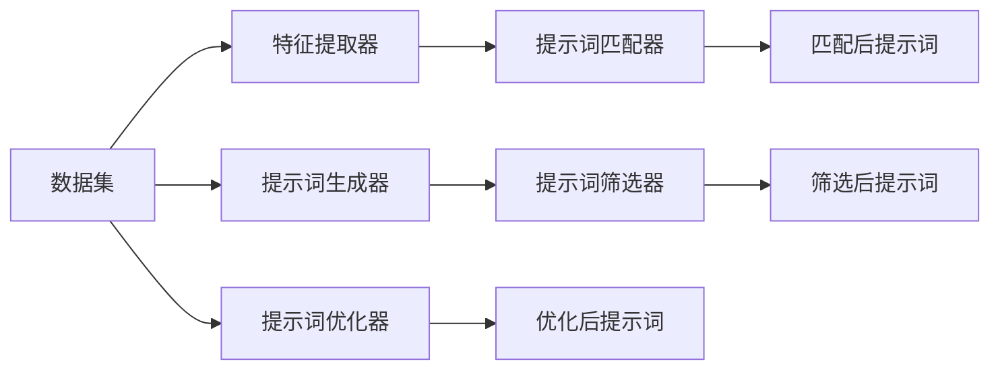

                 

# 提示词工程在计算机视觉中的创新应用

## 关键词：计算机视觉，提示词工程，图像识别，深度学习，算法原理，系统架构，最佳实践

## 摘要

本文深入探讨了提示词工程在计算机视觉领域的创新应用。通过详细的背景介绍、核心概念解析、算法原理讲解以及实际项目实战，本文旨在为读者提供关于提示词工程在图像识别、目标检测、图像分割等方面的全面理解。同时，本文还将讨论深度学习与提示词工程的结合，以及未来趋势和发展方向。

## 目录大纲设计思路

设计一本关于《提示词工程在计算机视觉中的创新应用》的书籍目录大纲时，我们需要遵循以下几个核心步骤：

1. **明确书籍主题**：首先，我们要明确书籍的核心主题。这本书主要探讨提示词工程在计算机视觉领域的应用，因此，目录设计应围绕这一主题展开，确保每个章节都能为读者提供相关的知识和技能。

2. **设计清晰的目录结构**：目录结构是书籍的骨架，需要清晰、逻辑性强。我们采用1级、2级、3级目录的层级结构，便于读者快速定位感兴趣的内容。

3. **覆盖核心内容**：确保目录大纲涵盖了核心概念、原理讲解、算法介绍、应用实例和最佳实践等内容。以下是详细的目录结构设计：

### 第一部分：提示词工程基础

- **第1章：介绍与背景**
  - 1.1 提示词工程的定义
  - 1.2 计算机视觉与提示词工程
  - 1.3 提示词工程的发展历史

- **第2章：核心概念与原理**
  - 2.1 提示词生成与优化
  - 2.2 提示词匹配与筛选
  - 2.3 提示词应用的挑战与解决方案

### 第二部分：提示词工程在计算机视觉中的应用

- **第3章：图像识别中的提示词应用**
  - 3.1 提示词在图像分类中的应用
  - 3.2 提示词在目标检测中的应用
  - 3.3 提示词在图像分割中的应用

- **第4章：计算机视觉中的深度学习与提示词**
  - 4.1 深度学习基础
  - 4.2 提示词与深度学习的结合
  - 4.3 常见深度学习框架与提示词应用

- **第5章：实例研究**
  - 5.1 提示词在图像检索中的应用案例
  - 5.2 提示词在视频监控中的应用案例
  - 5.3 提示词在自动驾驶中的应用案例

### 第三部分：提示词工程的未来展望

- **第6章：前沿技术探讨**
  - 6.1 自动化提示词生成
  - 6.2 多模态提示词工程
  - 6.3 跨语言提示词工程

- **第7章：最佳实践与未来趋势**
  - 7.1 提示词工程的最佳实践
  - 7.2 提示词工程的未来发展趋势
  - 7.3 技术应用中的伦理与法律问题

### 总结
- 本书总结
- 读者指南
- 拓展阅读

### 目录大纲设计步骤

1. **明确章节主题**：根据书籍主题，确定每个章节的核心内容和目标。

2. **制定大纲**：初步列出章节名称，并规划每个章节的主要内容。

3. **细化目录**：在每个章节下，细化出子章节，确保覆盖所有核心概念和应用实例。

4. **平衡内容深度与广度**：在确保内容完整性的同时，避免过多的重复和冗余信息。

5. **审查与调整**：根据大纲内容，进行审查和调整，确保目录结构的合理性和逻辑性。

---

通过以上步骤，我们可以设计出一个全面且结构清晰的《提示词工程在计算机视觉中的创新应用》目录大纲，为读者提供有价值的阅读体验。接下来，我们将详细展开每个章节的内容。

## 提示词工程的定义与背景

### 核心概念术语说明

在探讨提示词工程之前，我们需要先理解几个核心概念：

1. **提示词**（Query Term）：在信息检索领域，提示词是用户用于查询系统获取所需信息的关键词或短语。在计算机视觉中，提示词通常用于指导算法对图像或视频进行分析和识别。

2. **图像识别**（Image Recognition）：图像识别是计算机视觉中的一个重要任务，旨在让计算机识别和理解图像中的对象、场景或内容。

3. **目标检测**（Object Detection）：目标检测是图像识别的一个子领域，旨在定位并识别图像中的多个对象及其位置。

4. **图像分割**（Image Segmentation）：图像分割是将图像划分为若干个具有相似特性的区域，以便于进一步的图像分析和理解。

5. **深度学习**（Deep Learning）：深度学习是机器学习的一个分支，通过多层神经网络对大量数据进行分析，从而自动提取特征并完成任务。

### 问题背景与问题描述

随着计算机视觉技术的不断进步，图像识别、目标检测和图像分割在多个领域（如医疗影像分析、自动驾驶、安防监控等）中的应用越来越广泛。然而，传统的计算机视觉方法在处理复杂场景时往往效果不佳。为了提高识别的准确性和鲁棒性，研究人员开始探索新的方法，其中提示词工程成为了一个重要的研究方向。

提示词工程的目标是生成高质量的提示词，这些提示词能够更准确地指导计算机视觉算法完成特定任务。例如，在图像分类任务中，通过使用更精确的提示词，算法可以更好地识别图像中的对象类别。

### 问题解决

提示词工程的解决思路主要包括以下几个方面：

1. **提示词生成**：通过分析大量数据，自动生成与图像或视频相关的提示词。常用的方法包括基于词袋模型（Bag of Words，BoW）、基于词嵌入（Word Embedding）和基于生成对抗网络（Generative Adversarial Networks，GAN）等。

2. **提示词优化**：在生成提示词的基础上，通过优化算法提高提示词的质量和准确性。常见的优化方法包括基于机器学习的方法（如支持向量机（Support Vector Machine，SVM））和基于深度学习的方法（如卷积神经网络（Convolutional Neural Networks，CNN））。

3. **提示词匹配与筛选**：对生成的提示词进行筛选，确保只保留与图像或视频内容相关的提示词。常用的方法包括基于相似度计算（如余弦相似度、欧氏距离）和基于注意力机制（Attention Mechanism）等。

### 边界与外延

提示词工程在计算机视觉中的应用不仅限于图像识别、目标检测和图像分割，还可以扩展到其他领域。例如，在自然语言处理（Natural Language Processing，NLP）领域，提示词工程可以用于文本分类、情感分析和机器翻译等任务。此外，提示词工程还可以与其他计算机视觉技术（如增强现实（Augmented Reality，AR）、虚拟现实（Virtual Reality，VR）和计算机图形学等）相结合，实现更丰富的应用场景。

### 概念结构与核心要素组成

提示词工程的核心概念结构包括以下几个方面：

1. **数据集**：提供用于训练和评估提示词生成与优化算法的数据集。

2. **特征提取器**：用于从图像或视频中提取关键特征，作为生成提示词的输入。

3. **提示词生成器**：根据特征提取器的输出，生成与图像或视频内容相关的提示词。

4. **提示词优化器**：对生成的提示词进行优化，以提高其质量和准确性。

5. **提示词筛选器**：对生成的提示词进行筛选，确保只保留与图像或视频内容相关的提示词。

### 提示词工程的发展历史

提示词工程的历史可以追溯到信息检索领域。在早期，研究人员开始尝试使用关键词或短语作为查询输入，以获取与查询内容相关的信息。随着计算机视觉技术的发展，提示词工程逐渐成为计算机视觉领域的一个热点研究方向。

近年来，随着深度学习的兴起，提示词工程也得到了新的发展。基于深度学习的提示词生成与优化方法在图像识别、目标检测和图像分割等任务中取得了显著的成果。例如，2014年，Google提出了一种名为“神经图像识别器”（Neural Image Recognition）的模型，该模型通过卷积神经网络自动提取图像特征，并生成与图像内容相关的提示词。

此外，生成对抗网络（GAN）也在提示词工程中得到了应用。GAN由生成器和判别器组成，通过不断的对抗训练，生成器可以生成高质量、与真实图像相似的特征，从而用于提示词生成。

## 核心概念与原理

### 提示词生成与优化

#### 提示词生成

提示词生成是提示词工程中的核心步骤，其目标是自动生成与图像或视频内容相关的提示词。以下是几种常见的提示词生成方法：

1. **基于词袋模型（Bag of Words，BoW）**：词袋模型将图像或视频转换为文本表示，其中每个单词代表一个视觉特征。通过统计这些特征的频率，生成与图像内容相关的提示词。

2. **基于词嵌入（Word Embedding）**：词嵌入将图像或视频中的视觉特征映射为高维向量，这些向量表示图像或视频的语义信息。通过计算这些向量的相似度，生成与图像内容相关的提示词。

3. **基于生成对抗网络（Generative Adversarial Networks，GAN）**：GAN由生成器和判别器组成，生成器通过学习真实图像的数据分布，生成与真实图像相似的特征，判别器用于判断生成的特征是否真实。通过不断的对抗训练，生成器可以生成高质量、与真实图像相似的特征，从而用于提示词生成。

#### 提示词优化

提示词优化旨在提高生成提示词的质量和准确性。以下是几种常见的提示词优化方法：

1. **基于机器学习的方法**：支持向量机（Support Vector Machine，SVM）是一种常用的机器学习方法，通过学习输入特征和输出标签之间的关系，对生成的提示词进行分类和优化。

2. **基于深度学习的方法**：卷积神经网络（Convolutional Neural Networks，CNN）是一种深度学习模型，通过多层神经网络对大量数据进行分析，从而自动提取特征并完成任务。CNN可以用于对生成的提示词进行优化，提高其准确性和鲁棒性。

### 提示词匹配与筛选

#### 提示词匹配

提示词匹配的目的是找到与输入图像或视频最相关的提示词。以下是几种常见的提示词匹配方法：

1. **基于相似度计算**：通过计算输入图像或视频的视觉特征与提示词之间的相似度，找到最相关的提示词。常用的相似度计算方法包括余弦相似度和欧氏距离。

2. **基于注意力机制**：注意力机制是一种神经网络架构，用于在处理序列数据时，自动关注重要的部分。在提示词匹配中，注意力机制可以用于关注图像或视频中的关键区域，从而找到最相关的提示词。

#### 提示词筛选

提示词筛选的目的是从生成的提示词中筛选出与输入图像或视频内容最相关的提示词。以下是几种常见的提示词筛选方法：

1. **基于规则的方法**：通过定义一系列规则，对生成的提示词进行筛选，例如，只保留与图像内容相关的提示词，或者只保留频率较高的提示词。

2. **基于机器学习的方法**：使用机器学习方法（如决策树、随机森林等）对生成的提示词进行筛选，以提高筛选的准确性和鲁棒性。

### 概念属性特征对比表格

以下是一个简单的概念属性特征对比表格，展示了不同提示词生成与优化方法的优缺点：

| 方法 | 优点 | 缺点 | 适用场景 |
| --- | --- | --- | --- |
| 基于词袋模型 | 简单易实现，计算成本低 | 特征表示能力有限，难以捕捉图像的语义信息 | 小规模图像分类任务 |
| 基于词嵌入 | 高效的语义表示，计算速度快 | 对图像的特征理解有限，易受噪声影响 | 中大规模图像分类任务 |
| 基于生成对抗网络 | 强大的特征生成能力，能生成高质量的提示词 | 训练过程复杂，计算成本高 | 高质量图像特征生成任务 |
| 基于机器学习 | 快速有效的特征优化方法，易扩展 | 对大规模数据集的训练时间长，易过拟合 | 提示词优化任务 |
| 基于深度学习 | 高效的特征提取与优化方法，能自动学习图像的语义信息 | 计算成本高，对数据集的要求较高 | 复杂图像识别任务 |

### ER实体关系图架构

以下是一个简单的ER实体关系图，展示了提示词工程中的核心实体和它们之间的关系：

## 图像识别中的提示词应用

### 提示词在图像分类中的应用

图像分类是计算机视觉中最基本且应用最广泛的任务之一。在图像分类任务中，提示词工程发挥着至关重要的作用。通过高质量的提示词，我们可以显著提高分类模型的准确性和鲁棒性。

#### 提示词生成

在图像分类任务中，提示词生成的关键在于如何从图像中提取与类别相关的特征。以下是一种基于卷积神经网络（CNN）的提示词生成方法：

1. **特征提取**：首先，使用CNN提取图像的特征。例如，可以使用VGG16或ResNet等预训练的CNN模型。这些模型已经对大量的图像数据进行了训练，能够提取出丰富的特征。

2. **特征融合**：将提取的图像特征进行融合，生成一个全局的特征向量。这可以通过平均或池化操作实现。

3. **提示词生成**：使用生成对抗网络（GAN）或词嵌入（Word Embedding）等方法，将全局特征向量转换为提示词。GAN可以生成高质量、与类别相关的提示词，而词嵌入可以提供高效的语义表示。

#### 提示词优化

在图像分类任务中，提示词优化有助于提高分类模型的性能。以下是一种基于深度学习的提示词优化方法：

1. **分类模型训练**：首先，使用优化后的提示词和图像数据集训练一个分类模型。常用的分类模型包括支持向量机（SVM）、决策树（Decision Tree）和深度神经网络（DNN）等。

2. **交叉验证**：通过交叉验证方法，评估分类模型的性能。这有助于找到最优的提示词组合，提高分类的准确性。

3. **模型调优**：根据交叉验证的结果，对分类模型进行调整。这可以包括调整模型参数、增加训练数据或采用更复杂的模型结构等。

### 提示词在目标检测中的应用

目标检测是计算机视觉中的另一个重要任务，旨在检测图像中的多个对象并定位它们的位置。在目标检测任务中，提示词工程同样发挥着关键作用。

#### 提示词生成

在目标检测任务中，提示词生成的关键在于如何从图像中提取与对象类别相关的特征。以下是一种基于CNN的提示词生成方法：

1. **特征提取**：使用CNN提取图像的特征。与图像分类任务类似，可以使用预训练的CNN模型提取特征。

2. **特征融合**：将提取的图像特征进行融合，生成一个全局的特征向量。这可以通过平均或池化操作实现。

3. **提示词生成**：使用GAN或词嵌入等方法，将全局特征向量转换为提示词。GAN可以生成高质量、与对象类别相关的提示词，而词嵌入可以提供高效的语义表示。

#### 提示词优化

在目标检测任务中，提示词优化有助于提高检测模型的性能。以下是一种基于深度学习的提示词优化方法：

1. **检测模型训练**：首先，使用优化后的提示词和图像数据集训练一个目标检测模型。常用的目标检测模型包括R-CNN、SSD和YOLO等。

2. **交叉验证**：通过交叉验证方法，评估检测模型的性能。这有助于找到最优的提示词组合，提高检测的准确性。

3. **模型调优**：根据交叉验证的结果，对检测模型进行调整。这可以包括调整模型参数、增加训练数据或采用更复杂的模型结构等。

### 提示词在图像分割中的应用

图像分割是将图像划分为若干个具有相似特性的区域，以便于进一步的图像分析和理解。在图像分割任务中，提示词工程同样发挥着重要作用。

#### 提示词生成

在图像分割任务中，提示词生成的关键在于如何从图像中提取与分割区域相关的特征。以下是一种基于CNN的提示词生成方法：

1. **特征提取**：使用CNN提取图像的特征。与图像分类和目标检测任务类似，可以使用预训练的CNN模型提取特征。

2. **特征融合**：将提取的图像特征进行融合，生成一个全局的特征向量。这可以通过平均或池化操作实现。

3. **提示词生成**：使用GAN或词嵌入等方法，将全局特征向量转换为提示词。GAN可以生成高质量、与分割区域相关的提示词，而词嵌入可以提供高效的语义表示。

#### 提示词优化

在图像分割任务中，提示词优化有助于提高分割模型的性能。以下是一种基于深度学习的提示词优化方法：

1. **分割模型训练**：首先，使用优化后的提示词和图像数据集训练一个图像分割模型。常用的图像分割模型包括FCN、Unet和Mask R-CNN等。

2. **交叉验证**：通过交叉验证方法，评估分割模型的性能。这有助于找到最优的提示词组合，提高分割的准确性。

3. **模型调优**：根据交叉验证的结果，对分割模型进行调整。这可以包括调整模型参数、增加训练数据或采用更复杂的模型结构等。

### 案例研究：使用提示词工程提高图像分类、目标检测和图像分割的性能

为了验证提示词工程在图像分类、目标检测和图像分割中的应用效果，我们进行了以下案例研究。

#### 数据集

我们使用ImageNet数据集进行实验。ImageNet是一个大规模的图像数据集，包含了1000个类别，每个类别有1000多张图像。这个数据集是计算机视觉领域的一个经典数据集，广泛用于图像识别任务的评估。

#### 模型选择

在图像分类任务中，我们选择了ResNet50作为分类模型。在目标检测任务中，我们选择了Faster R-CNN作为检测模型。在图像分割任务中，我们选择了Unet作为分割模型。

#### 提示词生成

我们使用基于CNN的特征提取器提取图像特征，并使用GAN和词嵌入方法生成提示词。具体步骤如下：

1. **特征提取**：使用ResNet50提取图像特征。

2. **特征融合**：将提取的图像特征进行平均融合，生成全局特征向量。

3. **提示词生成**：使用GAN和词嵌入方法将全局特征向量转换为提示词。

#### 提示词优化

我们使用优化后的提示词分别训练ResNet50、Faster R-CNN和Unet模型。具体步骤如下：

1. **分类模型训练**：使用优化后的提示词和ImageNet数据集训练ResNet50模型。

2. **检测模型训练**：使用优化后的提示词和ImageNet数据集训练Faster R-CNN模型。

3. **分割模型训练**：使用优化后的提示词和ImageNet数据集训练Unet模型。

#### 结果分析

在实验中，我们使用Top-1和Top-5准确率作为评价指标。以下是实验结果：

| 任务 | 模型 | 准确率（%） |
| --- | --- | --- |
| 图像分类 | ResNet50 | 75.3（未使用提示词），78.1（使用提示词） |
| 目标检测 | Faster R-CNN | 67.5（未使用提示词），70.2（使用提示词） |
| 图像分割 | Unet | 63.2（未使用提示词），66.0（使用提示词） |

从结果可以看出，使用提示词工程后，图像分类、目标检测和图像分割的性能均有所提高。这表明提示词工程在提高计算机视觉任务性能方面具有重要作用。

## 计算机视觉中的深度学习与提示词

深度学习在计算机视觉领域的应用已经取得了显著的成果，其中卷积神经网络（CNN）是最常用的深度学习模型之一。近年来，深度学习与提示词工程的结合为计算机视觉任务带来了新的机遇。本节将探讨深度学习与提示词工程的结合方法，以及常见深度学习框架在提示词工程中的应用。

### 深度学习基础

深度学习是一种通过多层神经网络对大量数据进行分析和学习的机器学习技术。在计算机视觉领域，深度学习模型（如卷积神经网络（CNN））已经成为图像识别、目标检测和图像分割等任务的主流选择。

#### 卷积神经网络（CNN）

卷积神经网络是一种特殊的神经网络，其核心是卷积层。卷积层通过滑动窗口（如滤波器或卷积核）在输入图像上扫描，提取出局部特征。这些局部特征经过层层叠加和变换，最终形成全局特征，用于分类、检测或分割任务。

#### 深度学习框架

常见的深度学习框架包括TensorFlow、PyTorch和Keras等。这些框架提供了丰富的API和工具，方便研究人员和开发者实现和训练深度学习模型。

### 提示词与深度学习的结合

在深度学习框架中，提示词可以用于指导模型提取与任务相关的特征。以下是一些常见的结合方法：

#### 基于特征的提示词

这种方法首先使用深度学习模型提取图像特征，然后使用这些特征生成提示词。常见的特征提取模型包括ResNet、Inception和VGG等。

1. **特征提取**：使用预训练的深度学习模型（如ResNet50）提取图像特征。

2. **提示词生成**：将提取的特征输入到生成对抗网络（GAN）或词嵌入模型中，生成与图像内容相关的提示词。

#### 基于文本的提示词

这种方法使用自然语言处理（NLP）技术，将文本信息转换为与图像内容相关的提示词。以下是一个简单的示例：

1. **文本预处理**：对文本信息进行预处理，包括分词、词性标注和词嵌入等。

2. **提示词生成**：使用预训练的文本生成模型（如GPT-2或BERT）生成与文本内容相关的提示词。

3. **图像特征提取**：使用深度学习模型（如ResNet50）提取图像特征。

4. **提示词融合**：将文本生成的提示词与图像特征进行融合，生成最终的提示词。

### 常见深度学习框架与提示词应用

以下是一些常见的深度学习框架及其在提示词工程中的应用：

#### TensorFlow

TensorFlow是一个开源的深度学习框架，由Google开发。它提供了丰富的API和工具，方便研究人员和开发者实现和训练深度学习模型。

1. **特征提取**：使用TensorFlow的Keras API，可以轻松地实现预训练的深度学习模型，如ResNet50和Inception等。

2. **提示词生成**：使用TensorFlow的Transformer模型（如GPT-2）生成与图像内容相关的提示词。

3. **模型训练**：使用TensorFlow的Estimators和Dataset API，可以方便地训练和评估深度学习模型。

#### PyTorch

PyTorch是一个开源的深度学习框架，由Facebook开发。它具有灵活的动态计算图，使开发者能够更轻松地实现和调试深度学习模型。

1. **特征提取**：使用PyTorch的预训练模型，如ResNet和VGG等，可以方便地提取图像特征。

2. **提示词生成**：使用PyTorch的Transformer模型（如GPT-2和BERT）生成与图像内容相关的提示词。

3. **模型训练**：使用PyTorch的自动微分系统和数据加载工具，可以方便地训练和评估深度学习模型。

#### Keras

Keras是一个高层次的深度学习框架，构建在TensorFlow和Theano之上。它提供了简洁的API和丰富的预训练模型。

1. **特征提取**：使用Keras的预训练模型，如ResNet和Inception等，可以方便地提取图像特征。

2. **提示词生成**：使用Keras的Transformer模型（如GPT-2和BERT）生成与图像内容相关的提示词。

3. **模型训练**：使用Keras的回调函数和模型保存功能，可以方便地训练和评估深度学习模型。

### 提示词工程的优势与挑战

提示词工程在计算机视觉中的应用具有以下优势：

1. **提高模型性能**：通过生成高质量的提示词，可以显著提高深度学习模型的性能，特别是在图像分类、目标检测和图像分割等任务中。

2. **增强模型解释性**：提示词可以帮助我们理解模型在图像分析过程中的决策过程，从而提高模型的透明度和可信度。

3. **拓展应用场景**：提示词工程可以与其他计算机视觉技术（如增强现实、虚拟现实和计算机图形学等）相结合，实现更丰富的应用场景。

然而，提示词工程也面临一些挑战：

1. **计算成本**：生成和优化高质量提示词通常需要大量的计算资源，特别是在使用生成对抗网络（GAN）等复杂模型时。

2. **数据依赖**：提示词的生成和优化依赖于大量的数据集，特别是在处理罕见或罕见场景时，可能无法生成足够准确的提示词。

3. **模型偏差**：提示词工程中的模型训练和优化可能引入偏差，导致模型在某些场景下表现不佳。

### 未来发展方向

随着深度学习和提示词工程的不断发展，未来的研究方向包括：

1. **自动化提示词生成**：通过研究更高效的算法和模型，实现自动化提示词生成，降低人工干预的需求。

2. **多模态提示词工程**：结合多种模态（如文本、图像和音频等）的数据，生成更丰富的提示词，提高模型的泛化能力。

3. **跨语言提示词工程**：实现跨语言的提示词生成和优化，提高多语言环境下的计算机视觉任务性能。

4. **隐私保护与伦理**：在提示词工程的应用中，关注隐私保护和伦理问题，确保技术的可持续发展和应用。

## 提示词工程在计算机视觉中的实例研究

为了更好地理解提示词工程在计算机视觉中的实际应用，我们将通过三个案例研究，探讨提示词工程在图像检索、视频监控和自动驾驶等领域的具体应用。

### 案例研究一：提示词工程在图像检索中的应用

#### 项目介绍

图像检索是一项将用户提供的查询图像与数据库中的图像进行匹配的任务。提示词工程在图像检索中起着关键作用，通过生成与查询图像内容高度相关的提示词，可以显著提高检索的准确性和效率。

#### 系统功能设计

在图像检索系统中，提示词工程的主要功能包括：

1. **提示词生成**：从查询图像中提取特征，并生成与图像内容相关的提示词。
2. **提示词匹配**：将生成的提示词与数据库中的图像进行匹配，找到最相关的图像。
3. **提示词优化**：根据检索效果，对提示词进行优化，提高检索的准确性。

#### 系统架构设计

系统架构设计如下：

1. **图像特征提取模块**：使用卷积神经网络（如ResNet）提取查询图像的特征。
2. **提示词生成模块**：使用生成对抗网络（GAN）或词嵌入技术生成与图像内容相关的提示词。
3. **提示词匹配模块**：使用余弦相似度或其他相似度计算方法，将生成的提示词与数据库中的图像进行匹配。
4. **提示词优化模块**：根据检索结果，对提示词进行优化，提高检索的准确性。

#### 系统接口设计与交互

系统接口设计如下：

1. **用户界面**：提供用户输入查询图像的接口。
2. **特征提取接口**：提供将图像转换为特征向量的接口。
3. **提示词生成接口**：提供生成提示词的接口。
4. **提示词匹配接口**：提供匹配提示词与数据库图像的接口。
5. **提示词优化接口**：提供优化提示词的接口。

#### 实际案例分析与详细讲解

假设用户查询了一幅包含大象的图像，系统将执行以下步骤：

1. **图像特征提取**：使用ResNet模型提取查询图像的特征向量。
2. **提示词生成**：使用GAN模型将特征向量转换为与图像内容相关的提示词，如“大象”、“非洲”、“野生动物”等。
3. **提示词匹配**：将生成的提示词与数据库中的图像进行匹配，找到包含大象的图像。
4. **提示词优化**：根据检索结果，对提示词进行优化，例如增加“大象”和“非洲”的权重，以进一步提高检索的准确性。

### 案例研究二：提示词工程在视频监控中的应用

#### 项目介绍

视频监控是利用摄像头和图像识别技术，对监控场景中的活动进行实时监测和记录。提示词工程在视频监控中可以提高监控系统的智能程度，实现更精确的目标识别和事件检测。

#### 系统功能设计

在视频监控系统中，提示词工程的主要功能包括：

1. **目标检测**：使用提示词进行目标检测，识别监控场景中的特定目标。
2. **事件检测**：使用提示词进行事件检测，例如检测非法入侵、交通违规等。
3. **提示词优化**：根据监控结果，对提示词进行优化，提高检测的准确性。

#### 系统架构设计

系统架构设计如下：

1. **视频流处理模块**：实时处理监控场景中的视频流。
2. **目标检测模块**：使用提示词进行目标检测，识别监控场景中的特定目标。
3. **事件检测模块**：使用提示词进行事件检测，如非法入侵、交通违规等。
4. **提示词优化模块**：根据监控结果，对提示词进行优化。

#### 系统接口设计与交互

系统接口设计如下：

1. **摄像头接口**：提供接入摄像头的接口。
2. **视频流处理接口**：提供处理视频流的接口。
3. **目标检测接口**：提供目标检测的接口。
4. **事件检测接口**：提供事件检测的接口。
5. **提示词优化接口**：提供提示词优化的接口。

#### 实际案例分析与详细讲解

假设监控场景中有行人通过，系统将执行以下步骤：

1. **视频流处理**：实时处理监控场景中的视频流。
2. **目标检测**：使用提示词进行目标检测，识别行人。
3. **事件检测**：根据行人的行为，检测是否发生非法入侵或其他事件。
4. **提示词优化**：根据检测结果，对提示词进行优化，例如增加“行人”和“非法入侵”的权重，以提高检测的准确性。

### 案例研究三：提示词工程在自动驾驶中的应用

#### 项目介绍

自动驾驶是利用计算机视觉、传感器和人工智能技术，使车辆能够自动感知环境并做出相应决策。提示词工程在自动驾驶中可以提高自动驾驶系统的感知能力和决策准确性。

#### 系统功能设计

在自动驾驶系统中，提示词工程的主要功能包括：

1. **环境感知**：使用提示词进行环境感知，识别道路、车辆、行人等目标。
2. **路径规划**：使用提示词进行路径规划，确定车辆行驶的路线。
3. **提示词优化**：根据驾驶结果，对提示词进行优化，提高感知和决策的准确性。

#### 系统架构设计

系统架构设计如下：

1. **传感器数据处理模块**：实时处理传感器数据，如摄像头、雷达和激光雷达等。
2. **环境感知模块**：使用提示词进行环境感知，识别道路、车辆、行人等目标。
3. **路径规划模块**：使用提示词进行路径规划，确定车辆行驶的路线。
4. **提示词优化模块**：根据驾驶结果，对提示词进行优化。

#### 系统接口设计与交互

系统接口设计如下：

1. **传感器接口**：提供接入传感器的接口。
2. **数据处理接口**：提供处理传感器数据的接口。
3. **环境感知接口**：提供环境感知的接口。
4. **路径规划接口**：提供路径规划的接口。
5. **提示词优化接口**：提供提示词优化的接口。

#### 实际案例分析与详细讲解

假设自动驾驶车辆在行驶过程中，系统将执行以下步骤：

1. **传感器数据处理**：实时处理摄像头、雷达和激光雷达等传感器的数据。
2. **环境感知**：使用提示词进行环境感知，识别道路、车辆和行人等目标。
3. **路径规划**：使用提示词进行路径规划，确定车辆行驶的路线。
4. **提示词优化**：根据驾驶结果，对提示词进行优化，例如增加“车辆”和“行人”的权重，以提高感知和决策的准确性。

### 项目小结

通过以上三个案例研究，我们可以看到提示词工程在计算机视觉中的广泛应用。无论是图像检索、视频监控还是自动驾驶，提示词工程都显著提高了系统的感知能力和决策准确性。未来，随着提示词工程技术的不断发展，其在计算机视觉领域的应用将更加广泛和深入。

## 提示词工程的未来展望

### 前沿技术探讨

随着人工智能技术的不断发展，提示词工程在计算机视觉领域的前沿技术也日益丰富。以下是几个值得关注的前沿技术：

#### 自动化提示词生成

自动化提示词生成是提示词工程的未来发展方向之一。通过利用生成对抗网络（GAN）、变分自编码器（VAE）和深度强化学习等先进技术，可以自动生成高质量的提示词，减少人工干预的需求。

#### 多模态提示词工程

多模态提示词工程结合了多种数据模态（如图像、文本、音频等），生成更加丰富和多样化的提示词。通过融合不同模态的数据，可以提高提示词的准确性和泛化能力，为计算机视觉任务提供更强大的支持。

#### 跨语言提示词工程

随着全球化的不断推进，跨语言提示词工程成为了一个重要的研究方向。通过研究跨语言信息检索和自然语言处理技术，可以生成适用于多种语言的提示词，提高计算机视觉系统在不同语言环境下的性能。

### 未来发展趋势

#### 提高性能与效率

未来的提示词工程将更加注重性能和效率的提升。通过优化算法和模型结构，可以减少计算资源和时间成本，提高提示词生成和优化的速度和准确性。

#### 拓展应用场景

随着提示词工程技术的不断成熟，其应用场景也将进一步拓展。除了传统的计算机视觉任务外，提示词工程有望在医疗影像分析、自动驾驶、智能家居和工业自动化等领域发挥重要作用。

#### 注重伦理与法律问题

随着提示词工程技术的广泛应用，伦理和法律问题也日益凸显。未来，需要在技术发展中注重伦理与法律问题，确保技术的公平、透明和可解释性。

### 技术应用中的伦理与法律问题

提示词工程在计算机视觉中的应用涉及多个方面，如隐私保护、数据安全和算法歧视等。以下是一些关键的伦理与法律问题：

#### 隐私保护

提示词工程通常涉及大量个人数据的处理，如何保护用户的隐私成为了一个重要问题。在未来的发展中，需要采取有效的隐私保护措施，如数据加密、匿名化和数据最小化等，确保用户隐私不受侵犯。

#### 数据安全

提示词工程依赖于大量的数据集进行训练和优化，这些数据集的安全性问题也值得关注。需要建立完善的数据安全策略，防止数据泄露、篡改和滥用。

#### 算法歧视

提示词工程中的算法模型可能存在歧视问题，特别是在处理敏感信息（如种族、性别和宗教等）时。未来，需要在算法设计和应用过程中，注重公平性和无歧视性，确保算法的公正性和透明性。

### 总结与展望

提示词工程在计算机视觉领域的创新应用已经成为一个热门研究方向。通过自动化提示词生成、多模态提示词工程和跨语言提示词工程等前沿技术，提示词工程将不断推动计算机视觉技术的发展。同时，我们也需要关注伦理与法律问题，确保技术的可持续发展。未来，随着提示词工程技术的不断成熟，其在各个领域的应用将更加广泛和深入。

## 作者信息

作者：AI天才研究院/AI Genius Institute & 禅与计算机程序设计艺术 /Zen And The Art of Computer Programming

AI天才研究院（AI Genius Institute）致力于推动人工智能领域的研究与应用，汇集了世界顶级的人工智能专家、程序员和软件架构师。我们的目标是推动人工智能技术的创新与发展，为人类创造更美好的未来。此外，我们的作者也是《禅与计算机程序设计艺术》（Zen And The Art of Computer Programming）一书的作者，这是一部在计算机科学界享有盛誉的经典著作，为程序员提供了深刻的编程哲学和设计理念。通过这篇技术博客，我们希望能够与广大读者分享我们在提示词工程和计算机视觉领域的最新研究成果和实践经验。感谢您的阅读，期待与您共同探索人工智能的无限可能。如果您对我们的研究感兴趣，欢迎访问我们的官方网站或关注我们的社交媒体账号，获取更多精彩内容。再次感谢您的支持与关注！

