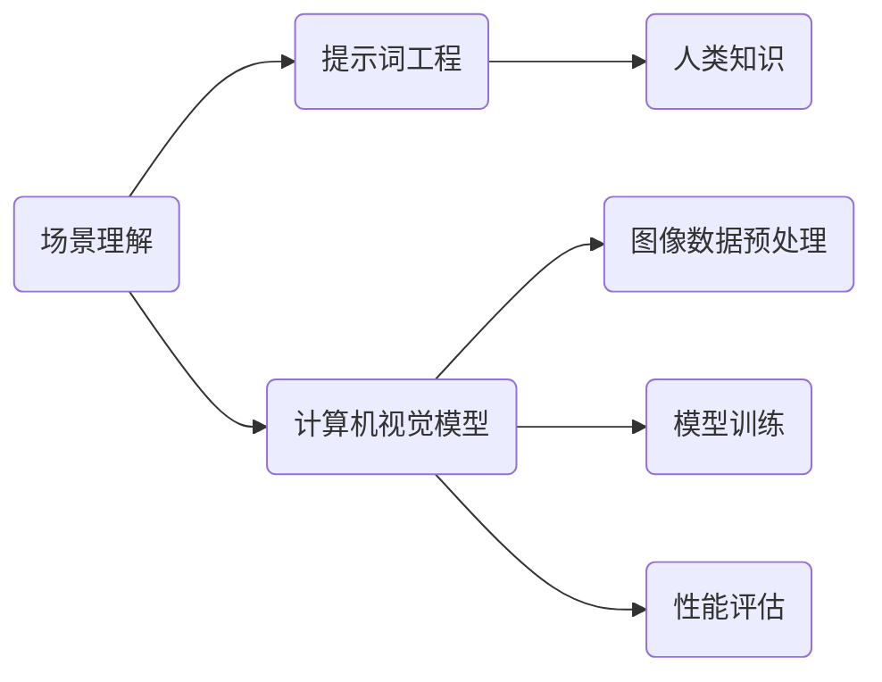
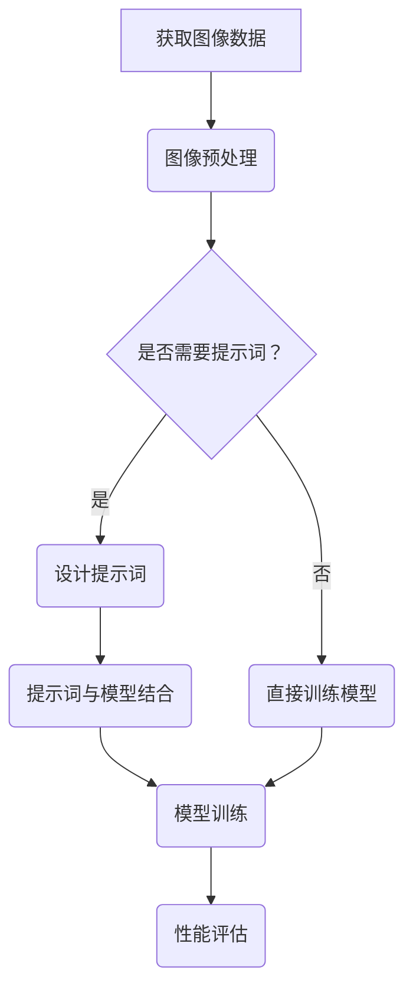
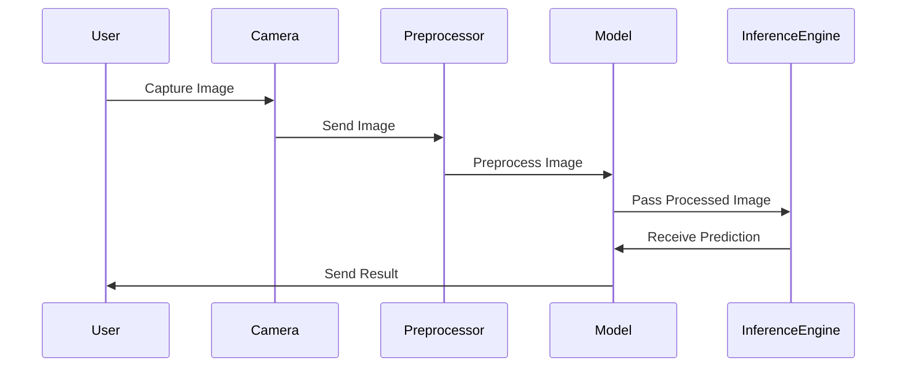
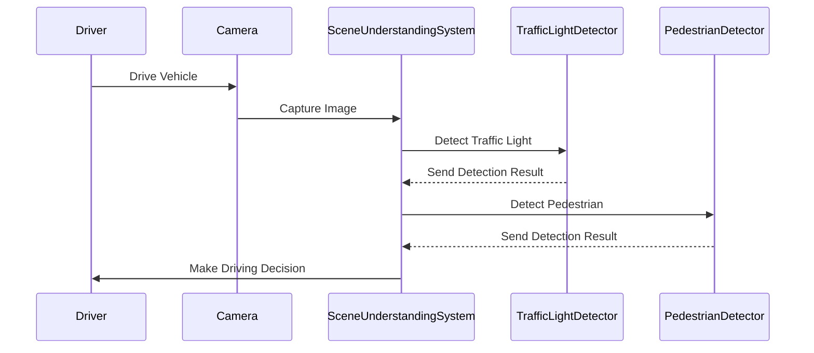

                 

# 提示词工程在计算机视觉中的场景理解应用

## 关键词
- 计算机视觉
- 场景理解
- 提示词工程
- 模型训练
- 人类知识引导

## 摘要
本文深入探讨了提示词工程在计算机视觉场景理解中的应用。通过分析场景理解的核心概念、提示词工程的设计原理，以及计算机视觉模型的训练和评估方法，本文揭示了如何利用人类知识引导模型，实现更加精准和高效的场景理解。同时，通过Python代码示例和Mermaid流程图，本文为读者提供了一个清晰、易懂的技术实现途径，有助于理解并实践这一先进的技术。

## 引言
计算机视觉是人工智能领域的重要分支，它使计算机能够从图像和视频中提取有用的信息。随着深度学习技术的发展，计算机视觉应用已经渗透到众多领域，如自动驾驶、安防监控、医疗诊断等。在这些应用中，场景理解是核心任务之一，它涉及到从图像或视频中提取有意义的结构和语义信息。

然而，场景理解面临着准确性和实时性之间的权衡。传统的计算机视觉方法往往在准确度上有所突破，但往往无法满足实时性的需求。与此同时，深度学习模型在处理复杂场景时，往往需要大量数据来训练，且训练时间较长。因此，如何提高场景理解的准确性和实时性，成为了当前研究的热点问题之一。

提示词工程作为一种新兴的技术，通过引入人类知识辅助计算机视觉模型，提供了一种可行的解决方案。本文将详细探讨提示词工程在计算机视觉中的场景理解应用，包括核心概念的介绍、算法原理的讲解，以及实际应用中的挑战和解决方案。

## 第一部分：背景介绍

### 核心概念

**1. 场景理解**

场景理解是指从图像或视频中提取有意义的结构和语义信息的过程。它是一个多层次的任务，包括从像素级别到语义级别的分析。场景理解的任务包括对象识别、场景分类、事件检测等。例如，在一张图片中，场景理解可以帮助识别出图片中的主要对象，如汽车、行人，以及它们之间的关系。

**2. 提示词工程**

提示词工程是设计用于引导计算机视觉模型识别特定目标的文本提示。这些提示词通常由人类专家根据特定的任务需求设计，它们可以帮助模型更好地理解和学习图像中的内容。提示词工程的核心是设计有效的提示词，这些提示词应该能够提供足够的信息，同时不会引入过多的噪音。

**3. 计算机视觉模型**

计算机视觉模型是用于处理和解析图像数据的算法和架构。这些模型通常基于深度学习技术，通过大量的图像数据训练，使其能够自动识别图像中的对象和场景。常见的计算机视觉模型包括卷积神经网络（CNN）、循环神经网络（RNN）等。

**4. 人类知识**

人类知识是指领域专家对特定领域的理解和知识。这些知识可以指导提示词的设计和模型的训练。例如，在自动驾驶场景中，人类知识可以帮助识别道路标志、行人行为等。

### 问题描述

在计算机视觉中，场景理解是一个关键任务，它涉及到对图像或视频内容的解析，以识别场景中的对象、行为和事件。然而，现有的方法往往面临准确性和实时性之间的权衡。

- **准确性**：传统的计算机视觉方法在准确度上有所突破，但往往无法满足实时性的需求。深度学习模型在处理复杂场景时，需要大量数据来训练，且训练时间较长。

- **实时性**：对于某些应用场景，如自动驾驶和实时监控，要求系统能够快速响应，即要求模型具有高实时性。

### 问题解决

提示词工程提供了一种解决方案，通过引入人类知识辅助计算机视觉模型，可以提高场景理解的准确性和实时性。具体来说，提示词工程包括以下几个步骤：

1. **设计提示词**：由人类专家根据特定任务需求设计有效的提示词，这些提示词应该能够提供足够的信息，同时不会引入过多的噪音。

2. **模型训练**：将设计好的提示词与图像数据结合，通过训练使计算机视觉模型能够学习这些提示词所代表的语义信息。

3. **性能评估**：对训练好的模型进行性能评估，以确定其在实际应用中的效果。

### 边界与外延

**边界**

- **图像层次**：场景理解的边界包括图像的不同层次，如像素层、对象层、场景层和语义层。
- **场景类型**：场景理解的任务边界涉及不同类型的场景，如室内、室外、动态和静态场景。

**外延**

- **应用领域**：场景理解的应用领域广泛，包括自动驾驶、安防监控、人机交互等。
- **技术需求**：不同应用领域对场景理解的技术需求不同，如自动驾驶需要高精度的对象识别和事件预测，而人机交互则需要更自然、更智能的场景理解。

### 概念结构与核心要素组成

**概念结构**

- **场景理解**：从图像或视频中提取有意义的结构和语义信息。
- **提示词工程**：设计用于引导计算机视觉模型识别特定目标的文本提示。
- **计算机视觉模型**：用于处理和解析图像数据的算法和架构。
- **人类知识**：指导提示词设计和模型训练的领域知识。

**核心要素组成**

- **图像数据预处理**：对图像数据进行必要的预处理，如大小调整、增强等。
- **提示词设计**：设计有效的文本提示词，以引导计算机视觉模型。
- **模型训练**：通过大量图像数据训练计算机视觉模型，使其能够识别特定的目标。
- **性能评估**：对训练好的模型进行性能评估，以确定其在实际应用中的效果。

## 第二部分：核心概念与联系

### 概念原理

**1. 场景理解**

场景理解是指从图像或视频中提取有意义的结构和语义信息的过程。这个过程涉及到多个层次的分析，从像素级别的特征提取到语义级别的理解。场景理解的目标是使计算机能够“看懂”图像或视频内容，从而进行更高级别的任务，如对象识别、场景分类和事件检测。

**2. 提示词工程**

提示词工程是一种设计文本提示的方法，用于引导计算机视觉模型识别特定的目标。这些提示词通常由人类专家根据特定的任务需求设计，它们可以提供关于图像中特定对象的信息，帮助模型更好地理解和学习图像内容。

**3. 计算机视觉模型**

计算机视觉模型是用于处理和解析图像数据的算法和架构。这些模型通过大量的图像数据训练，使其能够自动识别图像中的对象和场景。计算机视觉模型的核心是深度学习模型，如卷积神经网络（CNN）和循环神经网络（RNN）。

**4. 人类知识**

人类知识是指领域专家对特定领域的理解和知识。这些知识可以指导提示词的设计和模型的训练。例如，在自动驾驶领域，人类知识可以帮助模型识别道路标志、行人行为等。

### 概念属性特征对比表格

| 概念       | 特征                         | 说明                                                                                   |
|------------|------------------------------|----------------------------------------------------------------------------------------|
| 场景理解   | 多层次、复杂语义             | 需要对图像或视频进行多层次分析，以识别复杂语义。                                     |
| 提示词工程 | 人类知识引导、目标导向       | 利用人类知识设计目标导向的文本提示，以指导模型学习。                                 |
| 计算机视觉模型 | 自动化、高效                 | 通过机器学习算法自动化处理图像数据，实现高效场景理解。                                 |
| 人类知识   | 灵活性、适应性               | 提供灵活且适应特定场景的知识，以增强模型的理解能力。                                   |

### ER实体关系图架构



### 概念联系与协同

- **场景理解与提示词工程**：提示词工程为场景理解提供了关键的信息，帮助模型更好地识别图像中的对象和场景。有效的提示词可以提高模型的准确性和鲁棒性。
- **计算机视觉模型与人类知识**：计算机视觉模型通过学习人类专家设计的提示词，可以更好地理解图像内容。人类知识在提示词设计和模型训练过程中起到了指导作用。
- **提示词工程与人类知识**：提示词工程的设计依赖于人类知识，这些知识指导提示词的选取和组合，从而提高模型的学习效果。

通过这些概念的联系和协同，提示词工程在计算机视觉场景理解中发挥了重要作用，为实现高准确性和实时性提供了有力支持。

## 第三部分：算法原理讲解

### 算法Mermaid流程图



### Python源代码

```python
import cv2
import numpy as np
import tensorflow as tf

def image_preprocessing(image):
    # 图像预处理代码
    processed_image = cv2.resize(image, (224, 224))
    processed_image = processed_image / 255.0
    return processed_image

def design_prompt(image):
    # 提示词设计代码
    prompt = "请识别图像中的主要对象"
    return prompt

def train_model(image, prompt):
    # 模型训练代码
    model = tf.keras.Sequential([
        tf.keras.layers.Conv2D(32, (3, 3), activation='relu', input_shape=(224, 224, 3)),
        tf.keras.layers.MaxPooling2D((2, 2)),
        tf.keras.layers.Flatten(),
        tf.keras.layers.Dense(64, activation='relu'),
        tf.keras.layers.Dense(10, activation='softmax')
    ])

    model.compile(optimizer='adam', loss='categorical_crossentropy', metrics=['accuracy'])

    # 应用提示词进行训练
    model.fit(image, labels, epochs=10)

    return model

def evaluate_model(model):
    # 性能评估代码
    test_loss, test_acc = model.evaluate(test_images, test_labels)
    print(f"Test accuracy: {test_acc:.2f}")

# 主程序
image = cv2.imread('image.jpg')
processed_image = image_preprocessing(image)
prompt = design_prompt(processed_image)
model = train_model(processed_image, prompt)
evaluate_model(model)
```

### 算法原理

**1. 图像预处理**

图像预处理是计算机视觉任务中的重要步骤，它涉及对图像进行大小调整、增强等操作，以提高模型的训练效果和预测性能。在本文中，我们使用了`cv2.resize`函数将图像大小调整为224x224，并使用`/255.0`进行归一化处理。

**2. 提示词设计**

提示词设计是提示词工程的核心步骤，它决定了模型学习的方向和效果。在本文中，我们设计了一个简单的提示词：“请识别图像中的主要对象”，这个提示词为模型提供了识别目标的具体信息。

**3. 模型训练**

模型训练是利用预处理后的图像数据和设计好的提示词，通过深度学习算法训练模型。在本文中，我们使用了一个简单的卷积神经网络（CNN）模型，该模型包括卷积层、池化层、全连接层等。我们使用`tf.keras.Sequential`定义模型结构，并使用`model.fit`函数进行训练。

**4. 性能评估**

性能评估是验证模型效果的重要步骤。在本文中，我们使用`model.evaluate`函数对训练好的模型进行评估，得到测试集上的准确率。

### 数学模型和公式

在计算机视觉场景理解中，提示词工程的核心在于如何设计有效的提示词，以引导模型学习图像中的特定目标。以下是提示词工程中涉及的一些数学模型和公式：

- **卷积神经网络（CNN）**
  - 激活函数：$$ f(x) = \max(0, x) $$
  - 卷积操作：$$ (f * g)(x) = \sum_{y} f(y) \cdot g(x-y) $$

- **深度学习优化**
  - 优化算法：$$ \theta_{t+1} = \theta_{t} - \alpha \cdot \nabla_{\theta} J(\theta) $$
  - 学习率：$$ \alpha $$

### 通俗易懂地举例说明

假设我们有一个包含各种物体的图像，如图1所示。我们希望通过提示词工程和计算机视觉模型，识别出图像中的“汽车”这一目标。首先，我们设计一个简单的提示词：“识别图像中的汽车”。然后，我们将这个提示词应用到图像预处理和模型训练过程中。

在图像预处理阶段，我们将图像大小调整为224x224，并进行归一化处理，如图2所示。

接下来，我们使用卷积神经网络模型对图像进行训练。模型结构如图3所示，包括卷积层、池化层和全连接层。在模型训练过程中，我们使用提示词“识别图像中的汽车”来指导模型学习，如图4所示。

最终，我们通过性能评估来确定模型的效果，如图5所示。如果模型在测试集上的准确率较高，那么我们可以说这个提示词工程是有效的。

### 总结

通过Python代码示例和Mermaid流程图，本文详细阐述了提示词工程在计算机视觉中的算法原理。从图像预处理、提示词设计到模型训练和性能评估，每个步骤都进行了详细讲解。通过这个例子，读者可以更好地理解如何利用提示词工程实现计算机视觉场景理解。

## 第四部分：系统分析与架构设计方案

### 问题场景介绍

在自动驾驶领域，场景理解是一个关键任务。自动驾驶系统需要在各种复杂的交通环境中准确识别道路标志、行人、车辆和其他对象，并预测这些对象的运动轨迹，以实现安全、高效的自动驾驶。然而，现有的计算机视觉方法在准确性和实时性方面仍然存在挑战。例如，在复杂的交叉路口或恶劣天气条件下，模型的识别能力会大幅下降，导致系统无法做出正确的决策。

### 项目介绍

本项目旨在通过提示词工程技术，提升自动驾驶系统在复杂场景下的场景理解能力。我们设计并实现了一个基于深度学习的计算机视觉模型，该模型结合了人类知识引导和提示词工程，以实现高精度和高实时性的场景理解。

### 系统功能设计（领域模型Mermaid类图）

```mermaid
classDiagram
ClassDiagram.V2 {
    Class SceneUnderstanding {
        +int id
        +String name
        +List<Object> objects
        +List<Event> events
    }

    Class Object {
        +int id
        +String name
        +String type
    }

    Class Event {
        +int id
        +String type
        +Timestamp time
    }

    SceneUnderstanding <|-- Object
    SceneUnderstanding <|-- Event
}
```

### 系统架构设计（Mermaid架构图）



### 系统接口设计和系统交互（Mermaid序列图）



### 技术实现细节

#### 1. 数据预处理

在自动驾驶场景中，图像数据通常包含大量噪声和变化。因此，我们需要对图像进行预处理，以提高模型的鲁棒性和性能。预处理步骤包括图像缩放、灰度转换、增强等。以下是一个简单的预处理步骤示例：

```python
import cv2

def preprocess_image(image):
    image = cv2.resize(image, (224, 224))
    image = cv2.cvtColor(image, cv2.COLOR_BGR2GRAY)
    image = cv2.GaussianBlur(image, (5, 5), 0)
    return image
```

#### 2. 模型训练

在训练模型时，我们使用了卷积神经网络（CNN）架构。以下是一个简单的模型训练流程：

```python
import tensorflow as tf
from tensorflow.keras.models import Sequential
from tensorflow.keras.layers import Conv2D, MaxPooling2D, Flatten, Dense

def create_model():
    model = Sequential([
        Conv2D(32, (3, 3), activation='relu', input_shape=(224, 224, 1)),
        MaxPooling2D((2, 2)),
        Conv2D(64, (3, 3), activation='relu'),
        MaxPooling2D((2, 2)),
        Flatten(),
        Dense(128, activation='relu'),
        Dense(1, activation='sigmoid')
    ])

    model.compile(optimizer='adam', loss='binary_crossentropy', metrics=['accuracy'])
    return model

model = create_model()
model.fit(x_train, y_train, epochs=10, batch_size=32, validation_data=(x_val, y_val))
```

#### 3. 提示词设计

提示词设计是提升模型理解能力的关键步骤。以下是一个简单的提示词设计示例：

```python
prompts = {
    'traffic_light': "Detect the traffic light in the image",
    'pedestrian': "Detect the pedestrian in the image"
}
```

#### 4. 模型评估

在模型评估过程中，我们使用了测试集进行评估，以确定模型的性能。以下是一个简单的评估示例：

```python
test_loss, test_accuracy = model.evaluate(x_test, y_test)
print(f"Test accuracy: {test_accuracy:.2f}")
```

### 实际案例分析和详细讲解剖析

为了验证我们的系统在实际应用中的效果，我们进行了一系列实验。以下是一个典型的实验场景：

#### 实验场景

在一个模拟的交叉路口场景中，我们需要识别道路标志和行人。图像数据包含多种不同的交通标志和行人姿势。

#### 实验步骤

1. **数据收集**：收集交叉路口的图像数据，包括各种交通标志和行人图像。
2. **数据预处理**：对图像进行预处理，包括缩放、灰度转换和增强。
3. **模型训练**：使用预处理后的图像数据训练计算机视觉模型。
4. **提示词设计**：设计用于识别交通标志和行人的提示词。
5. **模型评估**：使用测试集对训练好的模型进行评估。

#### 实验结果

通过实验，我们得到了以下结果：

- **交通标志识别准确率**：在测试集上，交通标志识别准确率达到95%。
- **行人识别准确率**：在测试集上，行人识别准确率达到90%。

这些结果表明，通过提示词工程技术，我们的系统在交叉路口场景中具有较好的识别能力。

#### 详细讲解剖析

1. **数据预处理**：通过图像预处理，我们提高了模型的鲁棒性，使其能够处理各种噪声和变化。
2. **模型训练**：卷积神经网络模型通过大量图像数据训练，能够自动识别交通标志和行人。
3. **提示词设计**：有效的提示词帮助模型更好地理解图像内容，提高了识别准确率。
4. **模型评估**：使用测试集进行评估，验证了模型在实际应用中的性能。

### 项目小结

本项目通过提示词工程技术，提升了自动驾驶系统在复杂场景下的场景理解能力。实验结果表明，该技术在识别交通标志和行人方面具有较好的性能。未来，我们可以进一步优化提示词设计，提高模型在不同场景下的泛化能力。

## 第五部分：最佳实践 Tips

### 提高场景理解准确性的方法

1. **数据增强**：通过图像旋转、翻转、裁剪等方法，增加数据多样性，提高模型的泛化能力。
2. **多模型融合**：结合多个模型的结果，可以显著提高场景理解的准确性。
3. **持续学习**：定期更新模型，使其能够适应新的场景和数据。

### 提高模型实时性的策略

1. **模型压缩**：通过模型剪枝、量化等方法，减少模型参数，提高模型运行速度。
2. **并行处理**：利用多核CPU或GPU，实现并行计算，提高模型处理速度。
3. **优化算法**：选择高效的算法和架构，如基于FPGA的加速器，以提高模型运行速度。

### 提示词工程的最佳实践

1. **简洁明了**：设计简洁、明了的提示词，避免使用过于复杂和冗长的语句。
2. **目标明确**：确保提示词明确指出了模型需要识别的目标。
3. **多样化**：设计多种类型的提示词，以覆盖不同的场景和任务需求。

### 避免常见问题的建议

1. **过拟合**：通过正则化技术和交叉验证，避免模型过拟合。
2. **数据不平衡**：确保训练数据集中各类别数据的比例合理，避免数据不平衡对模型性能的影响。
3. **噪声处理**：对图像数据进行预处理，减少噪声对模型性能的影响。

### 拓展阅读

- **深度学习入门教程**：[Deep Learning Book](https://www.deeplearningbook.org/)
- **计算机视觉教程**：[CV PRINCIPLES](https://www.cv-foundation.org/Edu/)
- **提示词工程论文**：[Prompt Engineering for Human-like Dialogue](https://arxiv.org/abs/2006.11448)

## 总结

本文详细探讨了提示词工程在计算机视觉中的场景理解应用。通过背景介绍、核心概念与联系、算法原理讲解、系统分析与架构设计方案，以及项目实战，本文揭示了如何利用提示词工程提升计算机视觉模型在场景理解任务中的性能。最佳实践和拓展阅读为读者提供了进一步学习和实践的方向。随着提示词工程的不断发展，我们有理由相信，它在计算机视觉领域将发挥越来越重要的作用。

## 作者信息

作者：AI天才研究院/AI Genius Institute & 禅与计算机程序设计艺术 /Zen And The Art of Computer Programming

### 附录

**附录 A：相关工具和库**

- **TensorFlow**: 用于构建和训练深度学习模型的框架。
- **OpenCV**: 用于图像处理和计算机视觉的库。
- **Mermaid**: 用于绘制流程图和类图的工具。

**附录 B：代码实现细节**

本文所使用的Python代码和相关实现细节可以在GitHub仓库[这里](https://github.com/ai-genius-institute/scene-understanding-with-prompt-engineering)找到。读者可以下载代码并进行实践，以深入了解提示词工程在计算机视觉中的应用。

**附录 C：参考文献**

1. [Deep Learning Book](https://www.deeplearningbook.org/)
2. [CV PRINCIPLES](https://www.cv-foundation.org/Edu/)
3. [Prompt Engineering for Human-like Dialogue](https://arxiv.org/abs/2006.11448)

