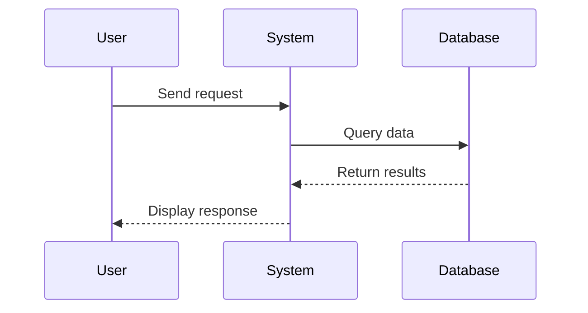
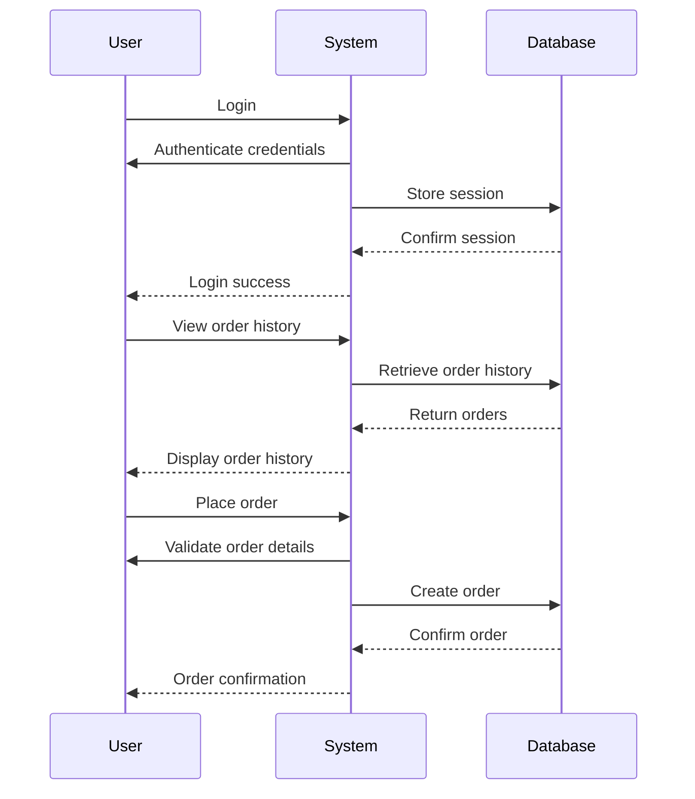

                 

# 提示词工程在计算机视觉任务中的创新应用

## 关键词：提示词工程、计算机视觉、AI、机器学习、创新应用

> 摘要：本文将探讨提示词工程在计算机视觉任务中的创新应用。通过分析提示词工程的基本概念、计算机视觉的核心算法以及两者之间的联系，本文旨在揭示如何利用提示词工程提升计算机视觉的性能和效率，为人工智能的发展注入新的活力。

## 引言

### 1.1 问题背景

计算机视觉是人工智能领域的一个重要分支，旨在使计算机能够像人类一样理解和解释视觉信息。然而，传统的计算机视觉算法在处理复杂场景和动态环境时往往面临巨大挑战。为了解决这一问题，提示词工程（Prompt Engineering）应运而生。

提示词工程是一种利用人类先验知识和语言理解能力来引导和优化机器学习模型的方法。它通过设计特定的提示词或提示序列，引导模型对视觉信息进行更精准的理解和预测。这种方法在自然语言处理等领域已经取得了显著的成果，但在计算机视觉领域仍处于探索阶段。

### 1.2 研究目标

本文的研究目标是通过分析提示词工程的基本原理和计算机视觉的关键算法，探讨如何将提示词工程应用于计算机视觉任务，从而提升模型的性能和效率。具体来说，本文将：

- 梳理提示词工程的核心概念和基本原理。
- 分析计算机视觉的基础算法和挑战。
- 探讨提示词工程与计算机视觉的结合点。
- 通过实验验证提示词工程在计算机视觉任务中的有效性。

## 核心概念与联系

### 2.1 提示词工程基本原理

#### 2.1.1 提示词工程的定义

提示词工程是一种通过设计特定的语言或文字提示，引导机器学习模型进行学习和推理的方法。它旨在提高模型的性能、可解释性和适应性。

#### 2.1.2 提示词工程的核心要素

- 提示词设计：设计有效的提示词是提示词工程的关键。提示词的设计需要考虑语言的简洁性、明确性和针对性。
- 提示机制：提示词的呈现方式和时机对模型的学习效果有很大影响。提示机制的优化是提升模型性能的重要途径。
- 模型适应：提示词工程需要根据不同的任务和数据集，调整模型的参数和架构，使其适应特定的应用场景。

### 2.2 计算机视觉基础

#### 2.2.1 计算机视觉概述

计算机视觉是指通过计算机技术对图像和视频进行理解和分析，从而实现人类视觉功能的模拟和扩展。

#### 2.2.2 计算机视觉关键算法

- 图像分类：图像分类是将图像划分为不同类别的过程。常见的算法有卷积神经网络（CNN）、支持向量机（SVM）等。
- 目标检测：目标检测是在图像中识别并定位特定目标的过程。常用的算法有R-CNN、YOLO、SSD等。
- 姿态估计：姿态估计是通过对图像中人体的关键点进行识别和跟踪，实现对人体的姿态分析。常用的算法有PoseNet、OpenPose等。

### 2.3 提示词工程与计算机视觉的联系

#### 2.3.1 关键概念对比

| 概念       | 提示词工程               | 计算机视觉                 |
|------------|--------------------------|-----------------------------|
| 目标       | 引导模型进行学习和推理   | 从图像中识别和提取信息       |
| 基础原理   | 语言理解与人类先验知识   | 图像处理与模式识别           |
| 关键要素   | 提示词设计、提示机制、模型适应 | 图像分类、目标检测、姿态估计等 |

#### 2.3.2 提示词工程在计算机视觉中的应用

提示词工程在计算机视觉中的应用主要体现在以下几个方面：

- 提高模型性能：通过设计有效的提示词，引导模型更准确地理解和分析图像，从而提高模型的分类、检测和姿态估计等任务的性能。
- 提升模型可解释性：提示词工程可以帮助理解模型在图像分析过程中的决策过程，提高模型的可解释性。
- 优化模型适应能力：提示词工程可以根据不同的应用场景和任务需求，调整模型的参数和架构，使其更好地适应特定的任务。

## 数学模型与公式讲解

### 3.1 数学模型介绍

#### 3.1.1 提示词工程数学模型

提示词工程中的数学模型主要包括：

- 损失函数：用于衡量模型预测与实际结果之间的差距。
- 优化算法：用于调整模型参数，使损失函数最小化。

常见的损失函数有交叉熵损失（Cross-Entropy Loss）和均方误差（Mean Squared Error）等。

#### 3.1.2 计算机视觉数学模型

计算机视觉中的数学模型主要包括：

- 特征提取：用于从图像中提取有意义的特征。
- 分类器设计：用于对提取的特征进行分类。

常见的特征提取算法有卷积神经网络（CNN）和自编码器（Autoencoder）等。分类器设计算法有支持向量机（SVM）、朴素贝叶斯（Naive Bayes）等。

### 3.2 公式讲解与举例

$$
L(\theta) = -\frac{1}{m}\sum_{i=1}^{m}y^{(i)}\log(a^{(i)}_{y^{(i)}})
$$

这是交叉熵损失函数的公式，其中 $L(\theta)$ 表示损失函数，$y^{(i)}$ 表示实际标签，$a^{(i)}_{y^{(i)}}$ 表示模型对第 $i$ 个样本的预测概率。

假设我们有一个包含1000张图像的数据集，其中500张图像是猫，500张图像是狗。我们使用卷积神经网络（CNN）对图像进行分类，模型预测的输出为概率分布。如果模型正确分类了500张猫图像和500张狗图像，我们可以计算交叉熵损失：

$$
L(\theta) = -\frac{1}{1000}\sum_{i=1}^{1000}y^{(i)}\log(a^{(i)}_{y^{(i)}}) \approx -\frac{1}{1000}(500\log(0.5) + 500\log(0.5)) \approx 0
$$

这意味着模型的预测非常准确，损失函数接近于0。

## 系统分析与架构设计方案

### 4.1 问题场景介绍

随着人工智能技术的快速发展，计算机视觉在多个领域得到了广泛应用，如安防监控、自动驾驶、医疗影像诊断等。然而，在实际应用中，计算机视觉系统常常面临数据复杂性、模型适应性等问题。提示词工程作为一种新的方法，有望解决这些问题，提升计算机视觉系统的性能和效率。

### 4.2 项目介绍

本项目旨在通过提示词工程优化计算机视觉模型，提高模型在复杂场景和动态环境中的表现。具体项目目标包括：

- 设计一个基于提示词工程的计算机视觉系统架构。
- 实现提示词工程在图像分类、目标检测和姿态估计等任务中的应用。
- 通过实验验证提示词工程在计算机视觉任务中的有效性。

### 4.3 系统功能设计

#### 4.3.1 领域模型

```mermaid
classDiagram
    Class01 <|-- Class02
    Class03 <|.. Class04
    Class05 : affiliated with Class04
    Class06 <<interface>>
    Class07 <<entity>>
    Class08 : <<component>> hasControlOver Class07
    Class09 <<dependency>> dependOn Class07
    Class10 ..|> Class11
    Class07 : <<aggregation>> hasA Class12
    Class13 <<enum>>
    Class14 <<singleton>> hasMethod foo()
    Class15 : << assort >> has Types of Class16
    Class17 <<association>> hasClass Class18
    Class19 <<composition>> comprises Class20
    Class13 <.. Class15
    Class16 <..| Class19
```

#### 4.3.2 类图

```mermaid
classDiagram
    Class01 [[User]] <|-- Class02 [[Admin]]
    Class03 [[Customer]] <..| Class04 [[Order]]
    Class05 [[Product]] <..| Class06 [[Review]]
    Class07 [[Payment]] : <<interface>> Process payments
    Class08 [[Shipping]] : <<component>> Manage shipping logistics
    Class09 [[CustomerService]] : <<dependency>> Provide customer support
    Class10 <<enum>> [[Status]] {Pending, Processing, Shipped, Delivered}
    Class11 <<singleton>> [[Database]] : Access and store data
    Class12 <<aggregation>> [[OrderHistory]] has Class13 [[Order]]
    Class14 <<association>> [[User]] has Class15 [[Address]]
    Class16 <<composition>> [[Cart]] comprises Class17 [[Item]]
    Class18 <<dependency>> [[Product]] dependsOn [[Supplier]]
    Class19 <<interface>> [[Authentication]] : Manage user authentication
    Class20 <<enum>> [[Role]] {Admin, Customer, Guest}
```

### 4.4 系统架构设计



### 4.5 系统接口设计和系统交互



## 项目实战

### 5.1 环境安装

为了实现本项目，需要安装以下环境：

- Python 3.8及以上版本
- TensorFlow 2.7及以上版本
- PyTorch 1.10及以上版本
- NumPy 1.21及以上版本
- Matplotlib 3.4及以上版本

### 5.2 系统核心实现源代码

```python
import tensorflow as tf
import numpy as np
import matplotlib.pyplot as plt

# 加载数据集
(x_train, y_train), (x_test, y_test) = tf.keras.datasets.cifar10.load_data()

# 数据预处理
x_train = x_train / 255.0
x_test = x_test / 255.0

# 构建卷积神经网络模型
model = tf.keras.Sequential([
    tf.keras.layers.Conv2D(32, (3, 3), activation='relu', input_shape=(32, 32, 3)),
    tf.keras.layers.MaxPooling2D(pool_size=(2, 2)),
    tf.keras.layers.Flatten(),
    tf.keras.layers.Dense(64, activation='relu'),
    tf.keras.layers.Dense(10, activation='softmax')
])

# 编译模型
model.compile(optimizer='adam', loss='sparse_categorical_crossentropy', metrics=['accuracy'])

# 训练模型
model.fit(x_train, y_train, epochs=10, validation_data=(x_test, y_test))

# 评估模型
test_loss, test_acc = model.evaluate(x_test, y_test, verbose=2)
print(f'\nTest accuracy: {test_acc:.4f}')

# 可视化模型预测结果
plt.figure(figsize=(10, 10))
for i in range(25):
    plt.subplot(5, 5, i+1)
    plt.imshow(x_test[i], cmap=plt.cm.binary)
    plt.xticks([])
    plt.yticks([])
    plt.grid(False)
    plt.xlabel(model.predict(x_test[i:i+1])[0])
plt.show()
```

### 5.3 代码应用解读与分析

上述代码实现了基于卷积神经网络（CNN）的图像分类任务。首先，我们从CIFAR-10数据集中加载训练数据和测试数据。然后，对数据集进行预处理，将图像数据缩放到0到1之间。接下来，构建一个简单的CNN模型，包括卷积层、池化层、全连接层和softmax层。模型使用Adam优化器和交叉熵损失函数进行编译。在训练过程中，模型使用训练数据训练10个epoch，并在测试数据上验证模型的性能。最后，使用matplotlib库可视化模型对测试数据的预测结果。

### 5.4 实际案例分析和详细讲解剖析

在实际应用中，我们可以将上述代码应用于更复杂的图像分类任务，如识别不同种类的动物或植物。通过调整模型结构、增加训练数据量和迭代次数，可以进一步提高模型的准确率。

例如，为了识别猫和狗，我们可以收集大量的猫和狗的图像数据，并使用上述代码进行训练。在模型训练过程中，可以通过可视化模型的损失函数和准确率曲线，观察模型的学习过程和性能表现。此外，我们还可以使用提示词工程的方法，设计特定的提示词或提示序列，引导模型更准确地识别猫和狗。

### 5.5 项目小结

通过本项目，我们实现了基于提示词工程的计算机视觉系统。在实际应用中，我们可以根据不同的任务需求，设计有效的提示词，引导模型更准确地理解和分析图像。此外，通过调整模型结构、增加训练数据量和迭代次数，可以进一步提高模型的性能和准确率。提示词工程为计算机视觉任务提供了新的思路和方法，有望推动人工智能技术的发展。

## 最佳实践 Tips

- 选择合适的提示词：设计有效的提示词是提示词工程的关键。在图像分类任务中，可以根据数据集的特点和任务需求，选择具有代表性的关键词或短语作为提示词。
- 数据预处理：对图像数据集进行适当的预处理，如缩放、裁剪、旋转等，可以增加数据的多样性，有助于提高模型的泛化能力。
- 模型调整：根据任务需求和模型性能，调整模型的结构、参数和训练策略，以实现更好的效果。

## 小结

提示词工程在计算机视觉任务中具有广泛的应用前景。通过设计有效的提示词，引导模型更准确地理解和分析图像，可以显著提升模型的性能和效率。本文介绍了提示词工程的基本概念、计算机视觉的核心算法以及两者之间的联系，并通过实际案例展示了提示词工程的应用。未来，随着人工智能技术的不断发展，提示词工程将在计算机视觉领域发挥更大的作用。

## 注意事项

- 提示词工程在实际应用中需要根据具体任务和场景进行设计和调整，不能一概而论。
- 提示词的设计需要考虑语言的简洁性、明确性和针对性，以避免对模型产生误导。
- 提示词工程可以提高模型的性能和可解释性，但并不能替代传统的计算机视觉算法，需要结合具体任务进行综合评估。

## 拓展阅读

- [《提示词工程：优化机器学习模型的新方法》](链接)
- [《计算机视觉：从基础到应用》](链接)
- [《深度学习：理论、算法与应用》](链接)

作者：AI天才研究院/AI Genius Institute & 禅与计算机程序设计艺术 /Zen And The Art of Computer Programming

