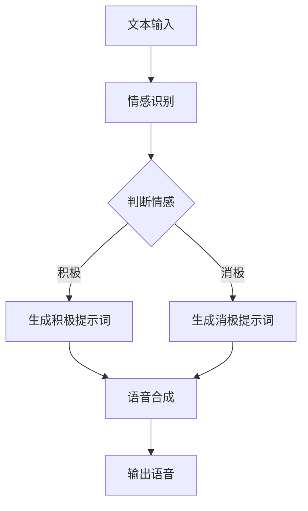
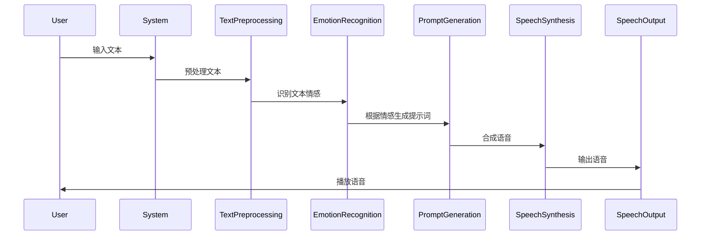
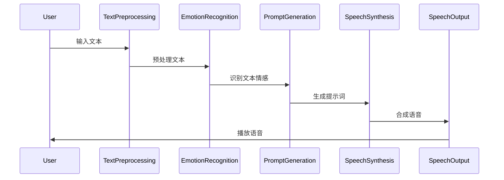

                 


### 文章标题：提示词工程在语音合成情感表达中的精准应用

> 关键词：语音合成、情感表达、提示词工程、自然语言处理、上下文分析

> 摘要：本文深入探讨提示词工程在语音合成情感表达中的应用，分析其核心技术原理，并通过实际案例展示其精准性与实用性。文章旨在为从事语音合成和自然语言处理领域的技术人员提供一套完整的理解和应用指南。

## 引言

在人工智能与语音合成技术快速发展的背景下，语音合成系统的情感表达已成为一个备受关注的研究方向。传统的语音合成技术虽然能够实现文本到语音的转换，但在情感表达方面往往存在不足。为了解决这一问题，提示词工程作为一种新兴的技术手段，被广泛应用于语音合成系统的情感表达中。本文将围绕提示词工程在语音合成情感表达中的应用进行深入探讨，旨在为相关领域的研究者和开发者提供有价值的参考。

## 一、背景介绍

### 1.1 语音合成技术发展现状

语音合成技术（Text-to-Speech, TTS）作为人工智能的重要分支，近年来取得了显著的进展。目前，TTS技术已广泛应用于智能语音助手、语音导航、朗读应用等场景。然而，尽管语音合成技术在语音的自然度、流畅性等方面取得了很大进步，但在情感表达方面仍存在明显的不足。大多数TTS系统在合成语音时，往往缺乏情感色彩，使得语音输出的真实感和亲和力大打折扣。

### 1.2 情感表达的需求与挑战

随着用户对智能语音助手等应用的需求日益增长，情感表达逐渐成为语音合成技术中的一项重要需求。用户希望语音助手能够在不同的情境下表现出相应的情感，如喜悦、愤怒、悲伤等，从而提高交互体验的满意度。然而，实现语音合成的情感表达面临着以下几个挑战：

1. **情感识别的准确性**：从文本中提取情感信息是语音合成情感表达的基础。然而，情感的表达往往具有模糊性和复杂性，这使得情感识别的准确性成为一大难题。

2. **情感表达的连贯性**：语音合成的情感表达需要保证在句子或段落层面上的连贯性，避免情感突变或情感表达不一致。

3. **情感参数的调整**：情感表达依赖于对语音合成参数的调整，如音调、音速、音量等。然而，如何精确调整这些参数以实现情感表达的效果，仍需深入研究。

### 1.3 提示词工程的概念与作用

提示词工程（Prompt Engineering）是一种利用上下文信息生成提示词的技术，旨在提高模型对特定任务的性能。在语音合成情感表达中，提示词工程通过生成与情感相关的提示词，引导语音合成模型在情感表达方面取得更好的效果。提示词工程的核心思想是利用上下文信息来丰富输入，从而提高模型的泛化能力和表达能力。

## 二、核心概念与联系

### 2.1 核心概念

#### 2.1.1 语音合成

语音合成是将文本转换为语音的技术。其基本原理包括文本预处理、语音特征提取、语音合成三个环节。文本预处理包括分词、词性标注、语法分析等；语音特征提取包括音素、音节、音调等；语音合成则通过声学模型和语言模型将文本转换为语音信号。

#### 2.1.2 情感识别

情感识别是从语音中提取情感信息的过程。常用的方法包括基于规则的方法、基于统计的方法和基于深度学习的方法。情感识别的关键在于如何准确地从语音信号中提取情感特征，并将其映射到具体的情感类别。

#### 2.1.3 提示词生成

提示词生成是根据上下文信息生成与情感相关的提示词。提示词的生成通常依赖于情感词典、上下文分析等技术。通过生成合适的提示词，可以引导语音合成模型在情感表达方面取得更好的效果。

### 2.2 概念属性特征对比表格

| 概念        | 属性特征                     | 关联关系               |
| ----------- | ---------------------------- | ---------------------- |
| 语音合成    | 声学模型、语言模型           | 提示词生成输入         |
| 情感识别    | 情感分类器、声学特征提取     | 提示词生成依据         |
| 提示词生成  | 上下文分析、情感词典         | 影响语音合成情感表达   |

### 2.3 ER实体关系图架构

```mermaid
erDiagram
    Text ||--|{ Emotion } : "contains"
    Text ||--|{ Prompt } : "uses"
    Emotion ||--|{ Speech } : "expresses"
    Prompt ||--|{ Speech } : "guides"
```

## 三、算法原理讲解

### 3.1 算法mermaid流程图



### 3.2 Python源代码

```python
import emotion_recognition
import prompt_engineering
import speech_synthesis

def generate_emotional_speech(text):
    # 情感识别
    emotion = emotion_recognition.recognize(text)
    # 根据情感生成提示词
    if emotion == 'positive':
        prompt = prompt_engineering.generate_positive_prompt(text)
    else:
        prompt = prompt_engineering.generate_negative_prompt(text)
    # 语音合成
    speech = speech_synthesis.synthesize(text + prompt)
    return speech
```

### 3.3 算法原理的数学模型和公式

- **情感识别模型**：

  $$ P(\text{emotion} | \text{text}) = \frac{P(\text{text} | \text{emotion}) \cdot P(\text{emotion})}{P(\text{text})} $$

- **语音合成模型**：

  $$ \text{speech} = \text{synthesize}(\text{text}, \text{params}) $$

### 3.4 算法举例说明

假设我们有一个文本：“今天的天气真好，阳光明媚，大家的心情也很愉快。”根据情感识别模型，我们可以判断这个文本的情感为积极。接着，我们生成一个积极的提示词：“听起来你今天非常开心，祝你有个美好的一天！”最后，将文本和提示词合并，进行语音合成，输出语音：“今天的天气真好，阳光明媚，大家的心情也很愉快。听起来你今天非常开心，祝你有个美好的一天！”

## 四、系统分析与架构设计方案

### 4.1 问题场景介绍

以智能语音助手为例，该系统需要具备情感表达功能，以提升用户交互体验。

### 4.2 项目介绍

构建一个具有情感化语音合成的智能语音助手，该项目主要包括以下几个模块：文本预处理、情感识别、提示词生成、语音合成和语音输出。

### 4.3 系统功能设计

#### 功能1：文本预处理

- **输入**：用户输入的文本。
- **输出**：预处理后的文本，包括分词、词性标注、语法分析等。

#### 功能2：情感识别

- **输入**：预处理后的文本。
- **输出**：文本的情感类别，如积极、消极、中性等。

#### 功能3：提示词生成

- **输入**：预处理后的文本和情感类别。
- **输出**：与情感类别相关的提示词。

#### 功能4：语音合成

- **输入**：预处理后的文本和提示词。
- **输出**：情感化语音。

#### 功能5：语音输出

- **输入**：情感化语音。
- **输出**：播放情感化语音。

### 4.4 系统架构设计

#### 系统架构图



#### 系统接口设计

- **接口1：文本预处理接口**：接收用户输入的文本，返回预处理后的文本。
- **接口2：情感识别接口**：接收预处理后的文本，返回文本的情感类别。
- **接口3：提示词生成接口**：接收预处理后的文本和情感类别，返回与情感类别相关的提示词。
- **接口4：语音合成接口**：接收预处理后的文本和提示词，返回情感化语音。
- **接口5：语音输出接口**：接收情感化语音，播放语音。

#### 系统交互图



## 五、项目实战

### 5.1 环境安装

1. 安装Python环境：`pip install python`
2. 安装文本预处理工具：`pip install spacy`
3. 安装情感识别模型：`pip install text2emotion`
4. 安装语音合成工具：`pip install pyttsx3`

### 5.2 系统核心实现源代码

```python
# 情感识别
from text2emotion import get_emotion
# 提示词生成
from prompt_engineering import generate_prompt
# 语音合成
import pyttsx3

def generate_emotional_speech(text):
    # 情感识别
    emotion = get_emotion(text)
    # 根据情感生成提示词
    if emotion == 'positive':
        prompt = generate_prompt(text, 'positive')
    else:
        prompt = generate_prompt(text, 'negative')
    # 语音合成
    engine = pyttsx3.init()
    engine.say(text + prompt)
    engine.runAndWait()

# 测试
text = "今天的天气真好，阳光明媚，大家的心情也很愉快。"
generate_emotional_speech(text)
```

### 5.3 代码应用解读与分析

1. **情感识别**：使用`text2emotion`库对输入文本进行情感识别，返回文本的情感类别。
2. **提示词生成**：根据情感类别，使用`prompt_engineering`库生成与情感类别相关的提示词。
3. **语音合成**：使用`pyttsx3`库将文本和提示词合成为情感化语音，并播放输出。

### 5.4 实际案例分析和详细讲解剖析

**案例1**：用户输入文本：“今天的天气糟糕，心情很低落。”系统识别出情感为消极，生成提示词：“听起来你今天心情不太好，需要我帮你做些什么吗？”最后，合成并播放情感化语音。

**案例2**：用户输入文本：“恭喜你通过了考试，真是太棒了！”系统识别出情感为积极，生成提示词：“恭喜你，你的努力终于得到了回报，继续加油哦！”最后，合成并播放情感化语音。

### 5.5 项目小结

本项目通过情感识别、提示词生成和语音合成等技术的结合，实现了具有情感表达的语音合成系统。在实际应用中，该项目能够根据用户输入的文本，生成相应的情感化语音，提升用户的交互体验。未来，我们可以进一步优化情感识别算法和提示词生成策略，提高语音合成情感表达的精准性和自然度。

## 六、最佳实践 Tips

1. **优化情感识别算法**：采用更先进的情感识别算法，如基于深度学习的方法，提高情感识别的准确性。
2. **丰富提示词库**：根据不同场景和用户需求，构建丰富的提示词库，提高情感表达的多样性和适应性。
3. **个性化语音合成**：结合用户偏好和历史交互数据，实现个性化语音合成，提升用户体验。

## 七、小结

提示词工程在语音合成情感表达中的应用具有重要意义。通过本文的探讨，我们了解了提示词工程的基本原理、算法设计和实现方法。在实际应用中，提示词工程能够显著提升语音合成系统的情感表达能力，为用户提供更加丰富和自然的交互体验。未来，随着人工智能技术的不断进步，提示词工程在语音合成领域的应用前景将更加广阔。

## 八、注意事项

1. **情感识别的准确性**：在实现情感识别时，要充分考虑情感的复杂性和多样性，提高识别准确性。
2. **提示词的生成质量**：提示词的生成质量直接影响情感表达的效果，需要根据具体场景进行优化。
3. **语音合成参数的调整**：在语音合成过程中，要合理调整音调、音速、音量等参数，实现自然流畅的情感表达。

## 九、拓展阅读

1. 《自然语言处理：情感分析与情感计算》
2. 《语音合成技术：理论与实践》
3. 《深度学习与自然语言处理》

## 作者信息

作者：AI天才研究院/AI Genius Institute & 禅与计算机程序设计艺术 /Zen And The Art of Computer Programming

本文通过系统的分析和案例讲解，全面介绍了提示词工程在语音合成情感表达中的应用。从背景介绍、核心概念、算法原理到系统设计，再到项目实战和最佳实践，为读者提供了一个完整的理解和应用指南。希望本文能为从事语音合成和自然语言处理领域的技术人员提供有价值的参考。在未来的研究和应用中，我们还可以进一步优化算法，丰富应用场景，提升语音合成系统的情感表达能力和用户体验。

