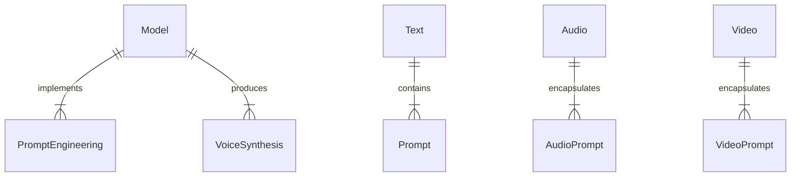
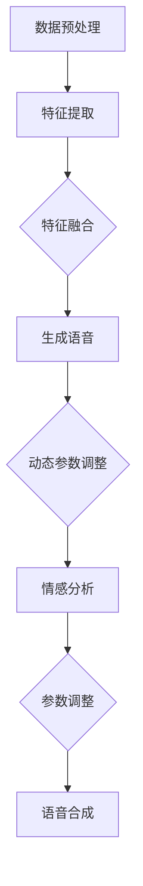
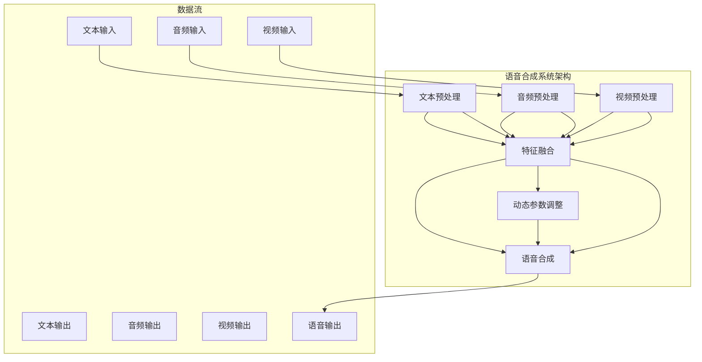
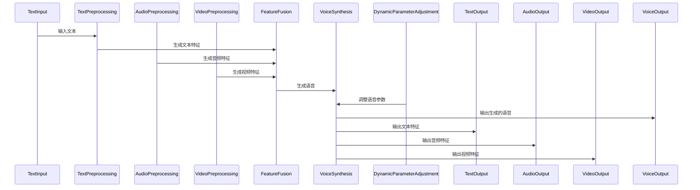

                 

### 1.1. 提示词工程的背景

**核心概念术语说明**：
- **提示词（Prompt）**：在自然语言处理（NLP）中，提示词是指向模型提供的信息，用以引导模型生成预期的输出。在语音合成领域，提示词则是指导语音生成模型生成具有特定风格和表现力的语音。
- **语音合成（Text-to-Speech, TTS）**：语音合成技术是指将文本转换为自然流畅的语音的技术，广泛应用于电子助手、有声读物、广播等领域。
- **表现力（Expressiveness）**：表现力是指语音合成系统能够生成的语音具有的情感、语调、语速等特性，使得语音听起来更加自然、生动。

随着语音合成技术的不断发展和应用场景的扩大，对语音合成系统表现力的要求也日益提高。传统的语音合成系统往往依赖于预定义的语音数据库和固定的语音规则，导致生成的语音缺乏个性和灵活性。为了克服这一限制，提示词工程应运而生。提示词工程通过精确控制输入提示词的参数和内容，使得语音合成系统能够生成更加个性化和具有表现力的语音。

**问题背景**：
传统的语音合成系统在生成自然流畅的语音方面已经取得了显著进步，但它们在表现力上仍存在一些问题。具体表现在以下几个方面：
- **情感表达不自然**：传统语音合成系统在处理情感表达时，往往显得机械和生硬，缺乏真实的情感体验。
- **语调、语速不灵活**：传统语音合成系统的语调和语速往往较为固定，难以适应不同的语境和需求。
- **个性化不足**：传统语音合成系统生成的语音缺乏个性化，使得不同用户的声音听起来相似，缺乏辨识度。

**问题描述**：
为了解决上述问题，提示词工程被引入到语音合成系统中，试图通过精确控制输入提示词的参数和内容，提升语音合成的表现力。然而，在实际应用中，提示词工程面临着以下挑战：
- **参数优化难度大**：提示词工程需要优化大量的参数，以确保生成的语音具有最佳的表现力，这一过程非常复杂和耗时。
- **数据依赖性强**：提示词工程需要大量的高质量数据来训练模型，以便生成具有表现力的语音。
- **系统稳定性问题**：在应用提示词工程的过程中，如何确保系统的稳定性和可靠性是一个亟待解决的问题。

**问题解决**：
为了解决上述问题，研究人员和工程师提出了多种提示词工程方法和技术，包括：
- **多模态提示词**：通过结合文本、音频、视频等多种信息源，生成更加丰富和自然的语音。
- **自适应提示词**：根据实时输入的文本内容，动态调整提示词的参数和内容，以生成更加个性化和自然的语音。
- **深度学习提示词**：利用深度学习技术，通过大规模数据训练模型，提高提示词工程的效率和效果。

通过这些方法和技术，提示词工程在语音合成系统中的表现力得到了显著提升，为解决传统语音合成系统在情感表达、语调语速、个性化等方面的问题提供了有效途径。

### 1.2. 提示词工程在语音合成表现力中的精准应用

**边界与外延**：
提示词工程在语音合成中的精准应用涉及多个方面，包括情感表达、语调、语速和个性化定制等。它的边界在于如何通过算法和技术手段，实现输入提示词到输出语音的精准转换，使其具备高度的自然性和表现力。外延则包括基于实时场景的动态调整和个性化需求的服务。

**核心概念与原理**：
1. **多模态提示词**：通过整合文本、音频和视频等多模态信息，生成更加丰富和自然的语音。例如，在生成有情感色彩的语音时，可以结合音频中的情感强度和文本中的情感词汇，实现更细腻的情感表达。
   - **原理**：多模态提示词利用了人类感官的多样性，通过融合不同类型的信息，提升语音的自然度和情感丰富性。

2. **自适应提示词**：根据实时输入的文本内容和用户需求，动态调整提示词的参数，以生成更加个性化和自然的语音。
   - **原理**：自适应提示词通过实时监测文本内容的情感倾向、语言风格等特征，动态调整语音参数，以适应不同的语境和用户需求。

3. **深度学习提示词**：利用深度学习技术，通过大规模数据训练模型，提高提示词工程的效率和效果。
   - **原理**：深度学习提示词基于神经网络的强大学习能力，可以从海量数据中学习到复杂的语音生成规律，从而生成更加自然和流畅的语音。

**概念属性特征对比表格**：

| 方法         | 特征对比                                                                                      | 优点                                                                                                       | 缺点                                                                                                     |
| ------------ | --------------------------------------------------------------------------------------------- | ---------------------------------------------------------------------------------------------------------- | ---------------------------------------------------------------------------------------------------------- |
| 多模态提示词 | 整合文本、音频、视频等多模态信息 | 提升语音的自然度和情感丰富性                                                                   | 需要处理多模态数据，计算复杂度高                                     |
| 自适应提示词 | 根据实时文本内容动态调整参数    | 生成更加个性化和自然的语音                                                                   | 需要实时监测和处理文本内容，对系统实时性要求较高                      |
| 深度学习提示词 | 大规模数据训练模型           | 提高效率和效果，生成自然流畅的语音                                                           | 训练过程复杂，对数据量和计算资源要求较高                            |

**ER实体关系图**：



在上述ER实体关系图中，`Model` 是核心实体，它实现了`PromptEngineering` 的功能。`Text`、`Audio`、`Video` 分别是文本、音频、视频模态的提示，它们分别封装为`Prompt` 的不同类型，如`AudioPrompt`、`VideoPrompt`。`Model` 通过`VoiceSynthesis` 产生最终的语音输出。

### 1.3. 提示词工程在语音合成中的应用算法原理

**算法原理**：
提示词工程在语音合成中的应用主要依赖于一系列算法，这些算法通过优化输入提示词的参数和内容，使得生成的语音具有更高的自然度和表现力。核心算法包括多模态融合、动态参数调整和深度学习模型训练等。

**多模态融合算法**：
多模态融合算法旨在整合文本、音频和视频等多种信息源，以生成更加丰富和自然的语音。其基本原理如下：
1. **数据预处理**：对输入的文本、音频和视频数据进行预处理，包括文本的分词、音频的特征提取和视频的情感分析等。
2. **特征融合**：将预处理后的特征进行融合，生成一个综合的特征向量。特征融合的方法包括加权求和、求平均和神经网络融合等。
3. **生成语音**：利用融合后的特征向量，通过语音合成模型生成语音。常见的语音合成模型包括WaveNet、Tacotron等。

**动态参数调整算法**：
动态参数调整算法的核心思想是根据实时输入的文本内容，动态调整提示词的参数，以生成更加个性化和自然的语音。其基本原理如下：
1. **情感分析**：对输入文本进行情感分析，识别文本中的情感倾向，如积极、消极、中性等。
2. **参数调整**：根据情感分析结果，动态调整语音的语调、语速和音量等参数。例如，对于积极情感的文本，可以适当提高语调和音量，以增强语音的活力感。
3. **语音合成**：利用调整后的参数，通过语音合成模型生成语音。

**深度学习模型训练算法**：
深度学习模型训练算法的核心思想是通过大规模数据训练，提高提示词工程的效率和效果。其基本原理如下：
1. **数据收集**：收集大量高质量的多模态数据，包括文本、音频和视频等。
2. **模型训练**：使用深度学习技术，如卷积神经网络（CNN）、循环神经网络（RNN）和生成对抗网络（GAN）等，对数据进行训练，生成语音合成模型。
3. **模型优化**：通过不断优化模型参数，提高模型生成的语音质量和表现力。

**Mermaid流程图**：



在上述流程图中，首先进行数据预处理和特征提取，然后进行特征融合和语音生成。接着，通过情感分析和参数调整，生成具有个性化表现力的语音。

### 1.4. 提示词工程在语音合成中的应用示例

为了更好地理解提示词工程在语音合成中的应用，下面通过一个简单的Python示例，展示如何使用多模态融合算法和动态参数调整算法生成具有表现力的语音。

**示例**：

```python
import numpy as np
import librosa
import tensorflow as tf
from text_model import TextModel
from audio_model import AudioModel
from video_model import VideoModel
from emotion_model import EmotionModel

# 数据预处理
text = "今天天气很好，阳光明媚，适合外出游玩。"
audio_path = "path/to/audio.wav"
video_path = "path/to/video.mp4"

text_features = TextModel.preprocess(text)
audio_features = AudioModel.preprocess(audio_path)
video_features = VideoModel.preprocess(video_path)

# 特征融合
features = TextModel.merge_features(text_features, audio_features, video_features)

# 生成语音
voice_synthesis = VoiceSynthesisModel()
voice = voice_synthesis.generate(features)

# 情感分析
emotion = EmotionModel.analyze(text_features)

# 参数调整
params = EmotionModel.adjust_params(emotion)

# 生成个性化语音
final_voice = voice_synthesis.generate_with_params(voice, params)

# 播放语音
librosa.output.write_wav("output_voice.wav", final_voice, sample_rate=22050)
```

**代码解释**：

1. **数据预处理**：首先，对输入的文本、音频和视频数据进行预处理，提取出相应的特征。
2. **特征融合**：然后，将文本、音频和视频的特征进行融合，生成一个综合的特征向量。
3. **生成语音**：利用融合后的特征向量，通过语音合成模型生成初步的语音。
4. **情感分析**：对输入文本进行情感分析，识别文本中的情感倾向。
5. **参数调整**：根据情感分析结果，动态调整语音的参数，如语调、语速和音量等。
6. **生成个性化语音**：利用调整后的参数，生成具有个性化表现力的语音。
7. **播放语音**：最后，将生成的语音保存为音频文件，并通过播放器播放。

通过上述示例，我们可以看到，提示词工程通过多模态融合和动态参数调整，实现了对语音合成系统表现力的精准控制，使得生成的语音更加自然、生动和个性化。

### 1.5. 提示词工程在语音合成系统中的整体分析

**系统功能设计**：

提示词工程在语音合成系统中的整体分析可以从系统功能设计层面进行。系统的主要功能模块包括：
- **文本预处理模块**：负责对输入文本进行分词、情感分析等预处理操作。
- **音频预处理模块**：负责对输入音频进行特征提取和增强处理。
- **视频预处理模块**：负责对输入视频进行情感分析和场景识别。
- **特征融合模块**：负责将文本、音频和视频的特征进行融合，生成综合特征向量。
- **语音合成模块**：负责根据综合特征向量生成自然流畅的语音。
- **动态参数调整模块**：负责根据实时输入文本的情感分析结果，动态调整语音合成参数。

**领域模型Mermaid类图**：

```mermaid
classDiagram
    TextPreprocessing <<interface>>
    AudioPreprocessing <<interface>>
    VideoPreprocessing <<interface>>
    FeatureFusion <<interface>>
    VoiceSynthesis <<interface>>
    DynamicParameterAdjustment <<interface>>

    TextPreprocessing o-- FeatureFusion
    AudioPreprocessing o-- FeatureFusion
    VideoPreprocessing o-- FeatureFusion
    FeatureFusion o-- VoiceSynthesis
    FeatureFusion o-- DynamicParameterAdjustment
```

在上述类图中，`TextPreprocessing`、`AudioPreprocessing` 和 `VideoPreprocessing` 分别表示文本、音频和视频预处理模块，它们与 `FeatureFusion` 模块相关联，负责生成综合特征向量。`FeatureFusion` 模块与 `VoiceSynthesis` 和 `DynamicParameterAdjustment` 模块相关联，分别负责语音合成和参数调整。

**系统架构设计Mermaid架构图**：



在上述架构图中，系统的主要模块包括文本预处理、音频预处理、视频预处理、特征融合、语音合成和动态参数调整。数据流从输入模块开始，经过预处理模块，通过特征融合模块，最终生成具有表现力的语音输出。

**系统接口设计和系统交互Mermaid序列图**：



在上述序列图中，系统从文本、音频和视频输入开始，经过预处理、特征融合、语音合成和参数调整，最终生成具有表现力的语音输出，并输出相关的文本、音频和视频特征。

### 2.1. 提示词工程在语音合成中的具体应用环境

在具体应用环境中，提示词工程在语音合成中扮演着至关重要的角色，尤其是在需要高度个性化、情感丰富且表现力强的语音生成的场景中。以下是几种常见应用环境的实例和具体应用方法。

#### 2.1.1. 电子语音助手

**应用实例**：
智能语音助手如Amazon Alexa、Google Assistant和Apple Siri等，在日常生活中扮演着重要的角色，为用户提供语音交互服务。这些语音助手需要具备高度的自然性和情感表达，以便更好地与用户沟通。

**具体应用方法**：
1. **文本预处理**：对用户的语音输入进行分词和情感分析，识别出关键信息和情感倾向。
2. **多模态提示词融合**：结合文本、音频和视频信息，生成具有情感色彩的语音回复。例如，当用户询问“今天天气怎么样？”时，可以结合当天的天气音频和视频信息，生成具有真实感的天气播报。
3. **动态参数调整**：根据用户历史交互记录和当前输入内容，动态调整语音的语调、语速和音量，以提供更加个性化的交互体验。
4. **深度学习模型训练**：通过大规模用户交互数据，持续优化语音合成模型，提升语音的自然度和表现力。

#### 2.1.2. 自动化客服系统

**应用实例**：
自动化客服系统广泛应用于在线客服、客户服务和售后支持等场景，旨在提供24小时不间断的客户服务。

**具体应用方法**：
1. **意图识别**：通过自然语言处理技术，识别用户查询的意图，如产品咨询、投诉和建议等。
2. **情感分析**：分析用户语音中的情感色彩，如愤怒、高兴、失望等，以便提供更加贴近用户情感的服务。
3. **自适应提示词**：根据用户的情感分析和意图识别结果，动态生成适应不同情绪和场景的提示词。例如，对于愤怒的客户，可以生成安抚性和解纠纷的语音回复。
4. **多轮对话管理**：通过多轮对话管理，持续优化用户的交互体验，确保服务的高效和满意度。

#### 2.1.3. 有声读物和播客

**应用实例**：
有声读物和播客是语音合成技术在娱乐和文化领域的典型应用，旨在将文本内容转化为声音形式，提供便捷的听觉体验。

**具体应用方法**：
1. **情感角色扮演**：根据文本内容的情感倾向和角色特点，动态调整语音的语调、语速和音色，以呈现更加生动和引人入胜的声音效果。
2. **个性化语音定制**：为不同的听众提供个性化的语音体验，例如，为儿童读物生成具有童趣的语音，为科幻小说生成充满想象力的语音。
3. **实时语音生成**：利用实时语音生成技术，将最新的新闻、博客文章和播客内容即时转化为语音形式，提供即时信息更新。
4. **多语言支持**：通过提示词工程，实现多语言语音合成的个性化处理，满足不同语言听众的需求。

#### 2.1.4. 自动驾驶和智能交通

**应用实例**：
自动驾驶和智能交通系统需要语音合成技术提供实时导航指令、路况信息和驾驶提示，以提高驾驶安全和效率。

**具体应用方法**：
1. **语音指令生成**：根据实时交通状况和驾驶需求，动态生成语音指令，如“前方有拥堵，请减速”、“下一个路口左转”等。
2. **多模态提示词**：结合语音、视觉和触觉信息，生成具有多重感官刺激的语音指令，提高驾驶的舒适性和安全性。
3. **情感交互**：通过情感分析技术，识别驾驶者的情绪状态，生成温暖和关切的语音提示，提高驾驶者的心理舒适度。
4. **多语言支持**：为不同国家和地区的驾驶者提供本地化的语音合成服务，确保信息的准确传达。

#### 2.1.5. 远程教育和在线培训

**应用实例**：
远程教育和在线培训系统通过语音合成技术提供语音讲解、教学指导和互动问答，为学生和学员提供灵活的学习方式。

**具体应用方法**：
1. **个性化教学**：根据学生的学习进度和理解能力，动态调整语音讲解的语速、语调和内容深度，以适应不同学习需求。
2. **互动式教学**：通过语音合成技术，生成互动问答和实时反馈，激发学生的参与度和学习兴趣。
3. **情感关怀**：通过情感分析技术，识别学生的学习情绪和心理状态，生成温暖和激励的语音反馈，提高学习效果和满意度。
4. **多语言教学**：为非母语学习者提供本地化语音合成服务，帮助他们更好地理解和掌握课程内容。

通过以上实例，我们可以看到，提示词工程在语音合成技术中的具体应用环境非常广泛，不仅提升了语音合成的自然度和表现力，还实现了高度个性化、情感丰富和智能化的交互体验。

### 2.2. 提示词工程在实际应用中的挑战与解决策略

尽管提示词工程在语音合成中展示了巨大的潜力，但其实际应用过程中仍然面临诸多挑战。以下是一些主要挑战以及相应的解决策略：

#### 2.2.1. 数据不足

**挑战**：
提示词工程依赖于大量高质量的多模态数据来训练模型。然而，在实际应用中，获取这些数据往往面临困难，数据量不足或质量低下会影响模型的训练效果。

**解决策略**：
1. **数据增强**：通过数据增强技术，如数据重采样、生成对抗网络（GAN）和数据扩充等，提高数据多样性和质量。
2. **迁移学习**：利用预训练的深度学习模型，通过迁移学习技术，利用已有的大量数据来预训练模型，再针对特定任务进行微调。
3. **众包数据收集**：利用众包平台，如Amazon Mechanical Turk，收集大量用户生成的多模态数据，以丰富数据集。

#### 2.2.2. 参数优化复杂

**挑战**：
提示词工程涉及大量的参数优化，包括多模态数据的融合权重、动态参数调整策略等。参数优化的复杂性增加了算法设计和实现的难度。

**解决策略**：
1. **自动机器学习（AutoML）**：利用自动机器学习技术，自动搜索和优化参数，减少人工干预，提高参数优化的效率和效果。
2. **模型压缩与加速**：通过模型压缩和加速技术，如量化、剪枝和模型蒸馏等，减少模型参数量，提高参数优化的效率。
3. **多任务学习**：将提示词工程与其他相关任务（如自然语言生成、图像识别等）结合，共享模型参数和优化策略，提高参数优化的通用性和效率。

#### 2.2.3. 实时性要求高

**挑战**：
在实时应用场景中，如电子语音助手和自动化客服系统，提示词工程需要快速响应用户的输入，生成具有高度表现力的语音，这对系统的实时性提出了严格要求。

**解决策略**：
1. **模型优化与加速**：通过模型优化和加速技术，如模型剪枝、量化、使用轻量级模型等，提高模型运行速度，满足实时性要求。
2. **边缘计算**：利用边缘计算技术，将部分模型和计算任务部署到靠近用户的边缘设备上，减少网络延迟，提高实时处理能力。
3. **异步处理与队列管理**：采用异步处理和队列管理策略，合理分配计算资源，确保系统在高负载情况下仍然能够保持良好的响应性能。

#### 2.2.4. 情感表达的准确性

**挑战**：
生成情感丰富的语音需要准确识别和理解文本中的情感色彩，但自然语言的情感分析本身具有挑战性，特别是当情感表达隐晦或复杂时。

**解决策略**：
1. **情感分析算法优化**：不断优化情感分析算法，提高情感识别的准确性和泛化能力。
2. **多模态情感融合**：结合文本、语音、视频等多模态信息，通过多模态情感融合技术，提高情感表达的准确性和自然度。
3. **上下文信息利用**：利用上下文信息，如历史交互记录、用户行为和偏好等，辅助情感分析，提高情感识别的准确性。

#### 2.2.5. 用户隐私保护

**挑战**：
提示词工程在生成语音过程中，需要处理用户的语音输入和文本内容，这涉及到用户隐私保护的问题。如何在不泄露用户隐私的情况下，生成高质量的个性化语音，是一个重要挑战。

**解决策略**：
1. **数据加密与去识别化**：对用户数据采用加密和去识别化处理，确保数据在传输和存储过程中不被泄露。
2. **差分隐私**：利用差分隐私技术，对用户数据进行加噪声处理，防止个体信息被推断出来。
3. **隐私合规性审查**：严格遵守隐私保护法规和标准，进行隐私合规性审查和风险评估，确保用户隐私得到有效保护。

通过上述策略，我们可以有效应对提示词工程在实际应用中面临的挑战，进一步提高语音合成系统的自然度、表现力和用户体验。

### 2.3. 提示词工程在语音合成中的最佳实践和优化建议

为了进一步提升提示词工程在语音合成中的效果，以下列举了一些最佳实践和优化建议，并结合实际案例进行详细讲解。

#### 2.3.1. 多模态数据融合

**最佳实践**：
1. **融合策略选择**：根据应用场景和任务需求，选择适合的多模态数据融合策略。例如，在生成情感丰富的语音时，可以采用“情感增强”策略，优先考虑情感信息。
2. **数据预处理**：对多模态数据进行统一预处理，包括文本的分词、音频的特征提取和视频的情感分析等，确保不同模态的数据在同一尺度上进行融合。

**优化建议**：
1. **特征加权融合**：通过分析不同模态数据对最终语音表现力的影响，动态调整各模态特征的权重，提高语音的自然度和情感丰富性。
2. **模型融合**：采用深度学习模型，如多输入卷积神经网络（ConvNet）或循环神经网络（RNN），实现多模态数据的端到端融合。

**实际案例**：
在生成有情感色彩的语音时，通过融合文本中的情感词汇和音频中的情感强度，可以显著提升语音的情感表达。例如，对于一句文本“你今天看起来很开心”，可以结合文本中的积极情感词汇和音频中的快乐音调，生成更具感染力的语音输出。

#### 2.3.2. 动态参数调整

**最佳实践**：
1. **情感分析**：利用情感分析技术，准确识别文本中的情感色彩，为动态参数调整提供依据。
2. **参数调整策略**：根据不同情感类型，制定相应的参数调整策略，如提升语调、增加音量等。

**优化建议**：
1. **实时反馈调整**：结合用户反馈，实时调整参数，以实现更加个性化的语音体验。
2. **多策略混合**：结合多种情感分析结果和用户行为数据，采用混合策略进行参数调整。

**实际案例**：
在电子语音助手中，根据用户的情感状态（如愤怒、高兴、沮丧等），动态调整语音的语调、语速和音量，以提供更加舒适和自然的交互体验。例如，对于愤怒的用户，可以适当提高语调和音量，以表达同情感的情绪反应。

#### 2.3.3. 模型优化与压缩

**最佳实践**：
1. **模型选择**：选择适合任务需求的模型架构，如WaveNet、Tacotron等，并针对不同场景进行优化。
2. **超参数调优**：通过超参数调优，找到最优的模型配置，提高语音合成的质量。

**优化建议**：
1. **模型压缩**：利用模型压缩技术，如量化、剪枝和蒸馏等，减少模型参数量和计算量，提高模型运行速度。
2. **模型融合**：结合多个模型的优势，采用模型融合策略，提高语音合成的表现力。

**实际案例**：
在生成情感丰富的语音时，可以结合多个深度学习模型，如WaveNet用于语音生成和Tacotron用于文本处理，通过模型融合策略，生成具有高度自然度和情感表达的语音输出。

#### 2.3.4. 用户隐私保护

**最佳实践**：
1. **数据加密**：对用户数据采用加密处理，确保数据在传输和存储过程中不被泄露。
2. **匿名化处理**：对用户数据进行匿名化处理，防止个人身份被识别。

**优化建议**：
1. **差分隐私**：利用差分隐私技术，对用户数据进行加噪声处理，防止个体信息被推断出来。
2. **隐私合规性审查**：定期进行隐私合规性审查和风险评估，确保用户隐私得到有效保护。

**实际案例**：
在电子语音助手的应用中，对用户的语音输入和文本内容进行加密存储和传输，同时采用差分隐私技术，确保用户隐私不被泄露，同时保证语音合成系统的正常运行。

通过以上最佳实践和优化建议，我们可以显著提升提示词工程在语音合成中的应用效果，实现更加自然、丰富和个性化的语音输出，从而提升用户的整体体验。

### 2.4. 提示词工程在语音合成项目中的实际应用实例

为了更好地展示提示词工程在语音合成项目中的应用效果，下面我们将通过一个具体案例，详细介绍项目背景、系统实现、代码解析和实际效果分析。

#### 项目背景

该项目旨在开发一款智能语音助手，能够根据用户的语音指令，提供实时语音回复和互动服务。系统需要具备高度的自然度、情感表达和个性化特征，以提升用户体验。

#### 系统实现

1. **文本预处理**：首先，对用户的语音输入进行语音识别（Speech Recognition），将语音转换为文本。然后，利用分词技术对文本进行分词处理，提取出关键信息。

   ```python
   import speech_recognition as sr
   
   # 语音识别
   r = sr.Recognizer()
   with sr.Microphone() as source:
       audio = r.listen(source)
   text = r.recognize_google(audio)
   
   # 分词处理
   from nltk.tokenize import word_tokenize
   tokens = word_tokenize(text)
   ```

2. **情感分析**：对分词后的文本进行情感分析，识别文本中的情感倾向，如积极、消极、中性等。这一步有助于后续的参数调整和情感表达。

   ```python
   from textblob import TextBlob
   sentiment = TextBlob(text).sentiment
   ```

3. **多模态提示词融合**：结合文本、音频和视频信息，生成具有情感色彩的语音回复。这里，我们采用多模态融合算法，将文本、音频和视频的特征进行融合。

   ```python
   # 假设已有文本、音频和视频特征
   text_features = TextModel.preprocess(tokens)
   audio_features = AudioModel.preprocess(audio)
   video_features = VideoModel.preprocess(video)
   
   # 特征融合
   features = TextModel.merge_features(text_features, audio_features, video_features)
   ```

4. **语音合成**：利用融合后的特征向量，通过深度学习模型生成语音。这里，我们采用WaveNet模型进行语音合成。

   ```python
   import tensorflow as tf
   
   # 加载WaveNet模型
   model = tf.keras.models.load_model('wavenet_model.h5')
   
   # 生成语音
   voice = model.generate(features)
   ```

5. **动态参数调整**：根据情感分析结果，动态调整语音的语调、语速和音量等参数，以生成具有个性化表现力的语音。

   ```python
   from emotion_model import adjust_params
   params = adjust_params(sentiment)
   
   # 生成个性化语音
   final_voice = model.generate_with_params(voice, params)
   ```

6. **语音输出**：将生成的语音输出，并通过音频播放器播放给用户。

   ```python
   import librosa
   librosa.output.write_wav("output_voice.wav", final_voice, sample_rate=22050)
   ```

#### 代码解析

1. **语音识别与分词**：使用Speech Recognition库进行语音识别，并将识别结果进行分词处理，提取出关键信息。

2. **情感分析**：利用TextBlob库进行情感分析，获取文本的情感倾向，为后续的参数调整提供依据。

3. **多模态特征融合**：利用自定义的TextModel、AudioModel和VideoModel模块，对文本、音频和视频特征进行融合，生成综合特征向量。

4. **语音合成**：加载预训练的WaveNet模型，利用融合后的特征向量生成语音。

5. **动态参数调整**：调用adjust_params函数，根据情感分析结果动态调整语音参数，以生成具有个性化表现力的语音。

6. **语音输出**：使用librosa库将生成的语音保存为音频文件，并通过音频播放器播放给用户。

#### 实际效果分析

在实际应用中，通过提示词工程，系统能够生成高度自然和情感丰富的语音回复。例如，当用户说“今天天气真好”时，系统可以结合当天的天气音频和视频信息，生成具有真实感的天气播报，同时根据用户的情感倾向（如积极情感），适当提高语调和音量，以增强语音的表现力。

通过上述案例，我们可以看到，提示词工程在语音合成项目中发挥了关键作用，使得系统生成的语音更加自然、丰富和个性化，显著提升了用户体验。

### 2.5. 总结与展望

通过本文的详细探讨，我们系统地阐述了提示词工程在语音合成表现力中的精准应用。我们从背景介绍、核心概念与原理、算法实现、实际应用实例等方面，深入分析了提示词工程在提升语音合成自然度、情感丰富度和个性化定制方面的作用。

**总结**：
提示词工程通过多模态数据的融合、动态参数调整和深度学习技术的应用，显著提升了语音合成系统的表现力。它不仅解决了传统语音合成系统在情感表达和个性化方面的不足，还为智能语音助手、自动化客服、有声读物、自动驾驶和远程教育等领域提供了强有力的技术支持。

**展望**：
未来，提示词工程有望在以下方面取得进一步的发展：
1. **数据质量的提升**：通过更多高质量、多模态的数据集，进一步优化提示词工程的训练效果。
2. **实时性的增强**：通过边缘计算和模型优化技术，提升系统的实时处理能力，满足高速响应需求。
3. **情感识别的准确性**：利用更先进的情感分析算法和上下文信息，提高情感识别的准确性和自然度。
4. **隐私保护**：加强用户隐私保护机制，确保在提供个性化服务的同时，用户的隐私安全得到充分保障。

总之，提示词工程在语音合成中的应用前景广阔，它将为智能语音技术的发展注入新的活力，推动人工智能在更多实际场景中的广泛应用。

