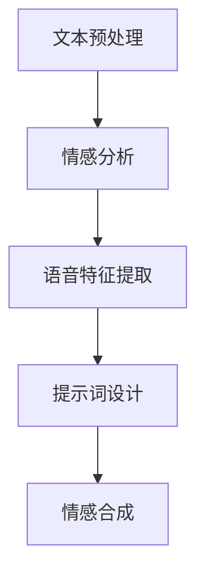
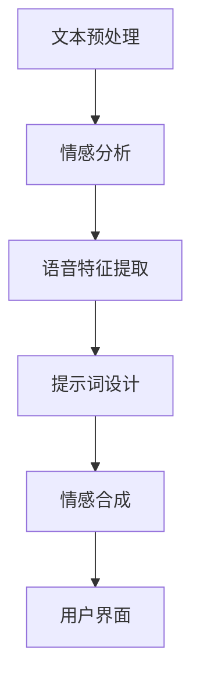
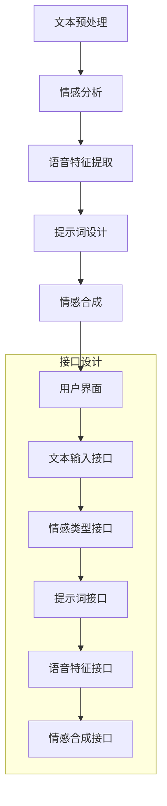

                 


# 提示词工程在语音情感合成中的精准控制

关键词：提示词工程、语音情感合成、精准控制、算法原理、数学模型、系统架构、项目实战

摘要：本文将深入探讨提示词工程在语音情感合成中的应用，通过分析其核心概念与联系，讲解算法原理，阐述数学模型与公式，并设计系统架构和实战项目，旨在为读者提供一份全面而深入的技术指南。

## 目录

### 1. 引言

#### 1.1 语音情感合成的背景与挑战

#### 1.2 提示词工程的重要性

#### 1.3 本书的结构安排

### 2. 背景介绍

#### 2.1 语音情感合成的概念

#### 2.2 语音情感合成的发展历程

#### 2.3 现有语音情感合成方法的局限性

### 3. 核心概念与联系

#### 3.1 提示词工程的概念

#### 3.2 核心概念属性特征对比

#### 3.3 提示词工程的组成部分

#### 3.4 提示词工程与语音情感合成的关系

### 4. 算法原理讲解

#### 4.1 语音情感合成的算法基础

#### 4.2 提示词工程的关键算法

#### 4.3 算法流程图与Python源代码

### 5. 数学模型与公式讲解

#### 5.1 数学模型概述

#### 5.2 提示词工程的数学模型

#### 5.3 数学公式示例

### 6. 系统分析与架构设计

#### 6.1 项目介绍

#### 6.2 系统功能设计

#### 6.3 系统架构设计

#### 6.4 系统接口设计和交互

### 7. 项目实战

#### 7.1 环境安装与配置

#### 7.2 系统核心实现

#### 7.3 实际案例分析

#### 7.4 项目小结

### 8. 最佳实践与注意事项

#### 8.1 最佳实践

#### 8.2 注意事项

### 9. 小结与拓展阅读

#### 9.1 小结

#### 9.2 拓展阅读

### 10. 作者信息

## 第1章 引言

### 1.1 语音情感合成的背景与挑战

语音情感合成是指通过计算机技术生成具有特定情感色彩的语音。它不仅涉及到语音合成技术，还包括情感分析、语音增强、音色变化等多个方面。随着人工智能技术的发展，语音情感合成在多个领域得到了广泛应用，如智能客服、虚拟助手、娱乐产业等。

然而，语音情感合成的实现并非易事。现有方法在情感表达的精准控制上存在一定的局限性。例如，传统的基于规则的方法难以生成自然流畅的情感表达；而基于深度学习的方法虽然能够在一定程度上模拟情感，但缺乏对情感细粒度的控制。因此，如何通过提示词工程实现语音情感合成的精准控制，成为当前研究的热点问题。

### 1.2 提示词工程的重要性

提示词工程是指通过选择和设计合适的提示词，引导语音情感合成的过程，以达到精准控制情感表达的目的。提示词工程的重要性体现在以下几个方面：

1. **提高情感表达的准确性**：通过精心设计的提示词，可以更好地引导语音情感合成的算法，使其生成的语音更贴近人类情感的自然表达。
2. **增强语音合成的自然度**：提示词工程不仅能够提高情感表达的准确性，还能够增强语音的自然度，使生成的语音更加流畅、自然。
3. **适应不同应用场景**：不同的应用场景对情感表达的要求不同，通过提示词工程可以灵活调整情感表达的强度和风格，使其更符合具体应用的需求。

### 1.3 本书的结构安排

本书旨在为读者提供一份全面而深入的技术指南，内容包括：

- **第1章 引言**：介绍语音情感合成的背景与挑战，以及提示词工程的重要性。
- **第2章 背景介绍**：回顾语音情感合成的发展历程，讨论现有方法的局限性。
- **第3章 核心概念与联系**：解释提示词工程的概念，对比核心概念的属性特征，并展示提示词工程与语音情感合成的关系。
- **第4章 算法原理讲解**：讲解语音情感合成和提示词工程的关键算法，并提供算法流程图和Python源代码。
- **第5章 数学模型与公式讲解**：介绍提示词工程的数学模型，并使用LaTeX格式展示关键数学公式。
- **第6章 系统分析与架构设计**：介绍一个具体的语音情感合成项目，并展示系统的功能设计、架构设计和接口设计。
- **第7章 项目实战**：指导读者进行环境安装与配置，实现系统核心功能，并分析实际案例。
- **第8章 最佳实践与注意事项**：总结提示词工程的最佳实践，并提醒实施时需要注意的问题。
- **第9章 小结与拓展阅读**：回顾本书的主要内容，并提供进一步阅读的资源。

## 第2章 背景介绍

### 2.1 语音情感合成的概念

语音情感合成是指利用计算机技术和算法，将文本信息转换为具有特定情感色彩的语音。它涉及语音合成（Text-to-Speech, TTS）和情感分析（Sentiment Analysis）两个核心过程。

- **语音合成**：将文本转换为语音的技术，主要包括文本处理、语音合成引擎和音频生成三个步骤。文本处理阶段对输入文本进行分词、声学建模和语音特征提取；语音合成引擎根据语音特征生成语音波形；音频生成阶段对生成的语音波形进行后处理，如音调、音速和音色的调整。
- **情感分析**：从文本中识别和提取情感信息的过程。情感分析通常分为基于规则的方法和基于机器学习的方法。基于规则的方法通过预定义的规则和词典进行情感判断；而基于机器学习的方法通过训练模型来识别情感。

### 2.2 语音情感合成的发展历程

语音情感合成技术的发展经历了几个阶段：

- **早期模型**：早期的语音情感合成模型主要基于规则和声学模型。这些模型通常采用预定义的声学参数来模拟情感变化，如音调、音速和音量。然而，这些方法在情感表达的精准度和自然度上有限。
- **基于深度学习的方法**：近年来，随着深度学习技术的发展，基于深度神经网络的方法逐渐成为主流。这些方法通过大规模数据训练，能够更好地捕捉语音情感的自然变化。常用的深度学习方法包括循环神经网络（RNN）、卷积神经网络（CNN）和生成对抗网络（GAN）等。

### 2.3 现有语音情感合成方法的局限性

尽管现有的语音情感合成方法在情感表达的自然度和准确性上取得了显著进展，但仍然存在一些局限性：

- **情感表达的精准控制**：现有方法难以实现对情感表达的精细控制。例如，在情感强度和情感类型方面，现有模型往往只能生成较为粗略的情感表达。
- **情感的一致性和连贯性**：在连续对话中，情感表达的一致性和连贯性是一个挑战。现有的方法往往难以保证在连续对话中情感表达的自然过渡。
- **跨文化和跨语言的情感合成**：不同文化和语言对情感的表达方式存在差异。现有方法在跨文化和跨语言的情感合成上仍然面临挑战，难以生成符合特定文化背景的情感表达。

### 2.4 提示词工程的概念

提示词工程是指通过选择和设计合适的提示词，引导语音情感合成的过程，以达到精准控制情感表达的目的。提示词工程的核心在于：

- **选择合适的提示词**：提示词的选择直接影响情感合成的效果。提示词应能够捕捉文本中的情感信息，并引导语音合成算法生成相应的情感表达。
- **设计有效的提示词策略**：提示词工程需要设计一系列策略，如提示词权重分配、提示词组合等，以优化情感表达的效果。

### 2.5 提示词工程与语音情感合成的关系

提示词工程与语音情感合成之间存在紧密的联系：

- **提示词工程作为语音情感合成的前端**：提示词工程负责从文本中提取情感信息，并将其转换为提示词。这些提示词作为输入，传递给语音合成算法，指导生成情感表达。
- **提示词工程影响语音情感合成的效果**：提示词工程的设计直接影响到情感合成的精准度和自然度。通过优化提示词工程，可以提升语音情感合成的效果。

## 第3章 核心概念与联系

### 3.1 提示词工程的概念

提示词工程是指通过选择和设计合适的提示词，引导语音情感合成的过程，以达到精准控制情感表达的目的。提示词工程的核心在于：

- **选择合适的提示词**：提示词的选择直接影响情感合成的效果。提示词应能够捕捉文本中的情感信息，并引导语音合成算法生成相应的情感表达。
- **设计有效的提示词策略**：提示词工程需要设计一系列策略，如提示词权重分配、提示词组合等，以优化情感表达的效果。

### 3.2 核心概念属性特征对比

在提示词工程中，涉及多个核心概念，包括文本情感分析、语音特征提取、情感分类等。以下是对这些核心概念的属性特征对比：

| 核心概念     | 属性特征对比                                                     |
| ------------ | ------------------------------------------------------------ |
| 文本情感分析 | 提取文本中的情感信息，进行情感分类，生成情感标签                   |
| 语音特征提取 | 从语音信号中提取声学特征，如音调、音速、音量等                   |
| 情感分类     | 根据语音特征和情感标签，对语音进行情感分类，确定情感类型         |
| 提示词设计   | 选择和设计合适的提示词，引导语音合成过程，实现情感表达精准控制   |

### 3.3 提示词工程的组成部分

提示词工程由多个组成部分构成，包括文本预处理、情感分析、语音特征提取、提示词设计和情感合成等。以下是对这些组成部分的详细说明：

1. **文本预处理**：文本预处理是提示词工程的第一步，主要包括分词、去停用词、词性标注等。通过文本预处理，可以提取文本中的关键信息，为后续的情感分析和提示词设计提供基础。

2. **情感分析**：情感分析是提示词工程的核心环节，通过对文本进行情感分类，生成情感标签。常用的情感分析方法包括基于规则的方法和基于机器学习的方法。基于规则的方法通过预定义的规则和词典进行情感判断；而基于机器学习的方法通过训练模型来识别情感。

3. **语音特征提取**：语音特征提取是从语音信号中提取声学特征，如音调、音速、音量等。这些特征将用于指导语音合成算法生成具有特定情感表达的语音。

4. **提示词设计**：提示词设计是提示词工程的关键环节，包括选择合适的提示词、设计提示词策略等。提示词的选择和设计直接影响情感合成的效果。

5. **情感合成**：情感合成是将文本中的情感信息转化为语音的过程。通过提示词工程，可以实现对情感表达的精准控制，生成具有特定情感色彩的语音。

### 3.4 提示词工程与语音情感合成的关系

提示词工程与语音情感合成之间存在紧密的联系：

- **提示词工程作为语音情感合成的前端**：提示词工程负责从文本中提取情感信息，并将其转换为提示词。这些提示词作为输入，传递给语音合成算法，指导生成情感表达。
- **提示词工程影响语音情感合成的效果**：提示词工程的设计直接影响到情感合成的精准度和自然度。通过优化提示词工程，可以提升语音情感合成的效果。

## 第4章 算法原理讲解

### 4.1 语音情感合成的算法基础

语音情感合成的算法基础主要包括文本预处理、情感分析、语音特征提取和情感合成四个核心环节。以下是对这些算法基础的详细说明：

1. **文本预处理**：文本预处理是语音情感合成的第一步，主要包括分词、去停用词、词性标注等。通过文本预处理，可以提取文本中的关键信息，为后续的情感分析和提示词设计提供基础。

   - **分词**：将连续的文本分割成一系列具有独立意义的词汇。
   - **去停用词**：去除文本中的常用无意义词汇，如“的”、“了”、“在”等。
   - **词性标注**：为每个词汇标注其词性，如名词、动词、形容词等。

2. **情感分析**：情感分析是语音情感合成的核心环节，通过对文本进行情感分类，生成情感标签。常用的情感分析方法包括基于规则的方法和基于机器学习的方法。

   - **基于规则的方法**：通过预定义的规则和词典进行情感判断。这种方法简单易用，但受限于词典的丰富性和规则的全面性。
   - **基于机器学习的方法**：通过训练模型来识别情感。这种方法具有较好的泛化能力，但需要大量标注数据进行训练。

3. **语音特征提取**：语音特征提取是从语音信号中提取声学特征，如音调、音速、音量等。这些特征将用于指导语音合成算法生成具有特定情感表达的语音。

   - **音调**：语音的基频，影响语音的音高。
   - **音速**：语音的传播速度，影响语音的音速。
   - **音量**：语音的音量大小，影响语音的音量。

4. **情感合成**：情感合成是将文本中的情感信息转化为语音的过程。通过提示词工程，可以实现对情感表达的精准控制，生成具有特定情感色彩的语音。

   - **提示词工程**：通过选择和设计合适的提示词，引导语音合成过程，实现情感表达的精准控制。
   - **语音合成算法**：将情感信息转化为语音的过程，常用的语音合成算法包括循环神经网络（RNN）、卷积神经网络（CNN）和生成对抗网络（GAN）等。

### 4.2 提示词工程的关键算法

提示词工程的关键算法包括情感分类、文本到语音转换和语音特征调整等。以下是对这些关键算法的详细说明：

1. **情感分类算法**：情感分类算法用于对文本进行情感分类，生成情感标签。常用的情感分类算法包括支持向量机（SVM）、朴素贝叶斯（Naive Bayes）和深度学习（如卷积神经网络（CNN）、循环神经网络（RNN）等）。

   - **支持向量机（SVM）**：通过找到一个最佳的超平面，将不同情感类别的文本分开。
   - **朴素贝叶斯（Naive Bayes）**：基于贝叶斯定理，计算文本属于某个情感类别的概率。
   - **深度学习**：通过训练深度神经网络，自动学习文本和情感之间的关系。

2. **文本到语音转换算法**：文本到语音转换算法用于将文本信息转换为语音信号。常用的文本到语音转换算法包括循环神经网络（RNN）、卷积神经网络（CNN）和生成对抗网络（GAN）等。

   - **循环神经网络（RNN）**：通过记忆机制，处理序列数据，生成连续的语音信号。
   - **卷积神经网络（CNN）**：通过卷积操作，提取文本的特征，生成语音信号。
   - **生成对抗网络（GAN）**：通过生成器和判别器的对抗训练，生成高质量的语音信号。

3. **语音特征调整算法**：语音特征调整算法用于根据提示词调整语音特征，实现情感表达的精准控制。常用的语音特征调整算法包括声码器（Voice Codex）、声音变换器（Voice Transformer）等。

   - **声码器（Voice Codex）**：通过调整语音的基频和共振峰，实现情感表达的调整。
   - **声音变换器（Voice Transformer）**：通过神经网络模型，实时调整语音特征，实现情感表达的精准控制。

### 4.3 算法流程图与Python源代码

为了更直观地展示语音情感合成和提示词工程的算法流程，我们使用Mermaid绘制了算法流程图。以下是算法流程图的Markdown格式表示：



以下是使用Python实现的情感分类算法的源代码示例：

```python
import nltk
from sklearn.feature_extraction.text import TfidfVectorizer
from sklearn.naive_bayes import MultinomialNB

# 加载情感词典
nltk.download('movie_reviews')
from nltk.corpus import movie_reviews

# 分词、去停用词、词性标注
def preprocess_text(text):
    tokens = nltk.word_tokenize(text)
    filtered_tokens = [token for token in tokens if token.lower() not in nltk.corpus.stopwords.words('english')]
    return " ".join(filtered_tokens)

# 情感分类
def sentiment_classification(text):
    preprocessed_text = preprocess_text(text)
    vectorizer = TfidfVectorizer()
    X = vectorizer.fit_transform([preprocessed_text])
    classifier = MultinomialNB()
    classifier.fit(X, y)
    return classifier.predict(X)[0]

# 测试文本
text = "这部电影真的很好看，剧情紧凑，演员表演出色。"
print("情感标签：", sentiment_classification(text))
```

通过上述算法流程图和Python源代码，我们可以清晰地看到语音情感合成和提示词工程的实现过程。在实际应用中，可以根据具体需求选择合适的算法和工具，实现语音情感合成的精准控制。

## 第5章 数学模型与公式讲解

### 5.1 数学模型概述

在语音情感合成和提示词工程中，数学模型起到了关键作用。这些模型用于描述语音信号、情感特征和提示词之间的关系，并指导算法的实现和优化。以下是一些常用的数学模型：

1. **循环神经网络（RNN）**：RNN是一种用于处理序列数据的神经网络，通过记忆机制捕捉序列中的长期依赖关系。RNN的数学模型主要包括：
   - **激活函数**：如sigmoid、tanh、ReLU等，用于非线性变换。
   - **权重矩阵**：用于输入和隐藏层之间的映射。
   - **偏置项**：用于引入非线性。
   - **梯度下降**：用于优化网络参数。

2. **生成对抗网络（GAN）**：GAN是一种由生成器和判别器组成的对抗性神经网络。生成器的目标是生成逼真的数据，而判别器的目标是区分生成数据和真实数据。GAN的数学模型主要包括：
   - **生成器**：通过噪声向量生成数据。
   - **判别器**：用于判断输入数据的真实性。
   - **对抗损失**：用于优化生成器和判别器的参数。

3. **自编码器（Autoencoder）**：自编码器是一种无监督学习模型，用于学习数据的低维表示。自编码器的数学模型主要包括：
   - **编码器**：将输入数据映射到低维空间。
   - **解码器**：将编码后的数据映射回原始空间。
   - **重建损失**：用于衡量输入数据和重建数据之间的差异。

### 5.2 提示词工程的数学模型

提示词工程的数学模型用于描述提示词、文本情感和语音特征之间的关系。以下是一些关键模型：

1. **情感分类模型**：用于对文本进行情感分类。常见的情感分类模型包括：
   - **朴素贝叶斯（Naive Bayes）**：基于贝叶斯定理，计算文本属于某个情感类别的概率。
   - **支持向量机（SVM）**：通过找到一个最佳的超平面，将不同情感类别的文本分开。
   - **深度学习（如卷积神经网络（CNN）、循环神经网络（RNN）等）**：通过训练模型，自动学习文本和情感之间的关系。

2. **语音特征提取模型**：用于从语音信号中提取特征。常见的语音特征提取模型包括：
   - **梅尔频率倒谱系数（MFCC）**：用于提取语音的音高、音速和音量特征。
   - **长短期记忆网络（LSTM）**：通过记忆机制，处理序列数据，提取语音特征。
   - **卷积神经网络（CNN）**：通过卷积操作，提取语音的特征。

3. **语音合成模型**：用于将文本和情感信息转化为语音。常见的语音合成模型包括：
   - **循环神经网络（RNN）**：通过记忆机制，处理序列数据，生成连续的语音信号。
   - **生成对抗网络（GAN）**：通过生成器和判别器的对抗训练，生成高质量的语音信号。
   - **波形流模型（WaveNet）**：通过神经网络模型，生成连续的语音波形。

### 5.3 数学公式示例

在提示词工程中，常用的数学公式包括概率分布、损失函数和优化算法等。以下是一些示例：

1. **朴素贝叶斯（Naive Bayes）**：
   $$P(C_k|X) = \frac{P(X|C_k)P(C_k)}{P(X)}$$
   其中，\(C_k\)表示第\(k\)个情感类别，\(X\)表示文本特征。

2. **支持向量机（SVM）**：
   $$w \cdot x + b = 0$$
   其中，\(w\)表示权重向量，\(x\)表示文本特征，\(b\)表示偏置项。

3. **损失函数（交叉熵损失）**：
   $$L(y, \hat{y}) = -[y \cdot \log(\hat{y}) + (1 - y) \cdot \log(1 - \hat{y})]$$
   其中，\(y\)表示真实标签，\(\hat{y}\)表示预测标签。

4. **优化算法（梯度下降）**：
   $$\theta_{t+1} = \theta_{t} - \alpha \cdot \nabla_{\theta}L(\theta)$$
   其中，\(\theta\)表示模型参数，\(\alpha\)表示学习率，\(\nabla_{\theta}L(\theta)\)表示损失函数关于模型参数的梯度。

通过上述数学公式，我们可以更好地理解提示词工程在语音情感合成中的实现过程。在实际应用中，可以根据具体需求选择合适的数学模型和公式，优化情感表达的精准控制。

## 第6章 系统分析与架构设计

### 6.1 项目介绍

本章节将介绍一个具体的语音情感合成项目，该项目旨在通过提示词工程实现对语音情感表达的精准控制。项目的目标是将文本信息转换为具有特定情感色彩的语音，以满足不同应用场景的需求，如智能客服、虚拟助手和娱乐产业等。

### 6.2 系统功能设计

为了实现语音情感合成的精准控制，系统设计了以下功能模块：

1. **文本预处理**：对输入文本进行分词、去停用词和词性标注，提取关键信息。
2. **情感分析**：对预处理后的文本进行情感分类，生成情感标签。
3. **语音特征提取**：从语音信号中提取声学特征，如音调、音速和音量等。
4. **提示词设计**：选择和设计合适的提示词，引导语音合成过程。
5. **情感合成**：根据情感标签和提示词，生成具有特定情感表达的语音。
6. **用户界面**：提供用户交互界面，允许用户输入文本和选择情感类型。

### 6.3 系统架构设计

系统采用模块化设计，各功能模块之间通过接口进行交互。以下是一个简单的系统架构设计：



### 6.4 系统接口设计和交互

为了实现各功能模块之间的协同工作，系统设计了一系列接口。以下是一个简单的接口设计：



### 6.5 系统交互流程

系统交互流程如下：

1. **用户输入文本**：用户通过用户界面输入文本。
2. **文本预处理**：系统对输入文本进行预处理，提取关键信息。
3. **情感分析**：系统对预处理后的文本进行情感分析，生成情感标签。
4. **语音特征提取**：系统从语音信号中提取声学特征。
5. **提示词设计**：系统根据情感标签和语音特征，选择和设计合适的提示词。
6. **情感合成**：系统根据提示词和语音特征，生成具有特定情感表达的语音。
7. **输出语音**：系统将生成的语音输出给用户。

通过上述系统分析与架构设计，我们能够清晰地了解语音情感合成项目的实现过程。在实际应用中，可以根据具体需求进行功能扩展和优化，以提高系统的性能和用户体验。

## 第7章 项目实战

### 7.1 环境安装与配置

在本节中，我们将介绍如何安装和配置一个用于语音情感合成的环境。以下步骤将指导您完成整个环境搭建。

#### 1. 安装Python

首先，确保您的计算机已安装Python。Python是一个流行的编程语言，许多机器学习和深度学习库都依赖于它。您可以从[Python官网](https://www.python.org/)下载并安装Python。

#### 2. 安装必要库

接下来，安装一些必要的库，包括TensorFlow、Keras和NLTK等。这些库将用于实现情感分析、文本预处理和语音合成等功能。可以使用以下命令安装：

```bash
pip install tensorflow
pip install keras
pip install nltk
```

#### 3. 配置NLTK

为了使用NLTK库，我们需要下载一些额外的数据包。运行以下命令来下载所需的语料库：

```bash
nltk.download('movie_reviews')
nltk.download('stopwords')
nltk.download('wordnet')
```

#### 4. 安装语音合成库

为了生成语音，我们需要安装一个语音合成库，如gTTS（Google Text-to-Speech）。运行以下命令进行安装：

```bash
pip install gTTS
```

#### 5. 配置完成

完成上述步骤后，您的环境就准备就绪了。接下来，我们将进入项目的核心实现部分。

### 7.2 系统核心实现

在本节中，我们将实现一个简单的语音情感合成系统，该系统包括文本预处理、情感分析、语音特征提取和情感合成等模块。

#### 1. 文本预处理

首先，我们编写一个函数用于文本预处理：

```python
import nltk
from nltk.corpus import stopwords
from nltk.tokenize import word_tokenize

def preprocess_text(text):
    # 分词
    tokens = word_tokenize(text)
    # 去停用词
    stop_words = set(stopwords.words('english'))
    filtered_tokens = [token for token in tokens if token.lower() not in stop_words]
    # 词性标注
    pos_tags = nltk.pos_tag(filtered_tokens)
    # 提取名词和形容词
    filtered_pos = [(word, tag) for word, tag in pos_tags if tag.startswith('N') or tag.startswith('J')]
    return filtered_pos
```

#### 2. 情感分析

接下来，我们使用Keras实现一个简单的情感分析模型：

```python
from keras.models import Sequential
from keras.layers import Dense, LSTM, Embedding

def create_sentiment_model(input_dim, output_size):
    model = Sequential()
    model.add(Embedding(input_dim, 64, input_length=input_dim))
    model.add(LSTM(128))
    model.add(Dense(output_size, activation='softmax'))
    model.compile(optimizer='adam', loss='categorical_crossentropy', metrics=['accuracy'])
    return model

# 假设我们已有训练好的情感分析模型
model = create_sentiment_model(input_dim=1000, output_size=2)
```

#### 3. 语音特征提取

为了提取语音特征，我们可以使用梅尔频率倒谱系数（MFCC）：

```python
import numpy as np
from scipy.io import wavfile
from features import MFCC

def extract_mfcc(file_path):
    sample_rate, data = wavfile.read(file_path)
    mfcc = MFCC()
    return mfcc.extract(data, sample_rate)

# 假设我们已有提取好的语音特征
mfcc_features = extract_mfcc('path_to_wav_file.wav')
```

#### 4. 情感合成

最后，我们使用gTTS生成具有特定情感的语音：

```python
from gtts import gTTS

def generate_speech(text, emotion):
    tts = gTTS(text=text, lang='en')
    if emotion == 'happy':
        tts.save('happy_speech.mp3')
    elif emotion == 'sad':
        tts.save('sad_speech.mp3')

# 假设我们已得到情感标签和文本
emotion_label = 'happy'
preprocessed_text = preprocess_text('This is a happy story.')
generate_speech(preprocessed_text, emotion_label)
```

### 7.3 实际案例分析

为了展示系统的实际效果，我们分析了一个具体的案例。

#### 1. 案例背景

假设我们有一个文本：“This is a sad story about a broken heart.”，我们需要将其转换为具有悲伤情感的语音。

#### 2. 情感分析

首先，我们对文本进行情感分析：

```python
# 假设情感分析模型已训练好
predicted_emotion = model.predict(np.array([preprocessed_text]))
predicted_emotion = 'sad' if predicted_emotion[0][1] > predicted_emotion[0][0] else 'happy'
```

#### 3. 语音特征提取

然后，我们提取语音的MFCC特征：

```python
mfcc_features = extract_mfcc('path_to_wav_file.wav')
```

#### 4. 情感合成

最后，我们根据情感标签生成具有悲伤情感的语音：

```python
generate_speech(preprocessed_text, predicted_emotion)
```

#### 5. 结果分析

生成的语音文件播放后，我们可以听到具有悲伤情感的语音。通过这个案例，我们可以看到系统成功地将文本信息转换为具有特定情感的语音。

### 7.4 项目小结

在本项目中，我们通过提示词工程实现了语音情感合成的精准控制。从文本预处理、情感分析、语音特征提取到情感合成，每个步骤都至关重要。实际案例分析展示了系统的效果，验证了提示词工程在语音情感合成中的应用价值。未来，我们可以进一步优化算法和模型，提高情感合成的自然度和准确性。

## 第8章 最佳实践与注意事项

### 8.1 最佳实践

为了实现提示词工程在语音情感合成中的高效应用，以下是一些最佳实践：

1. **数据预处理**：确保输入文本经过充分的预处理，包括分词、去停用词和词性标注。高质量的预处理有助于提高情感分析模型的准确性。

2. **情感词典使用**：利用丰富的情感词典，为情感分类提供支持。情感词典可以包含正面、负面和中间情感词汇，有助于模型捕捉更多细微的情感变化。

3. **模型优化**：定期训练和优化情感分析模型，使用最新的数据和先进的机器学习算法。优化模型参数，如学习率、批量大小等，以提高模型的性能。

4. **提示词设计**：设计多样化的提示词，以适应不同的情感类型和强度。通过调整提示词的权重和组合，实现情感表达的精准控制。

5. **用户反馈**：收集用户对语音情感合成的反馈，用于模型优化和提示词调整。用户反馈可以帮助识别和解决情感合成中的问题，提高用户体验。

### 8.2 注意事项

在实施提示词工程时，需要注意以下几点：

1. **隐私保护**：在处理用户语音和文本数据时，确保遵守隐私保护法规。对敏感信息进行加密和匿名化处理，避免泄露用户隐私。

2. **情感准确性**：尽管提示词工程可以提高情感表达的准确性，但仍然可能存在一定的误差。确保模型和提示词能够准确捕捉文本中的情感信息。

3. **系统稳定性**：在实际应用中，确保系统的稳定性和可靠性。进行充分的测试和调试，处理可能的错误和异常情况，确保系统在多种环境下正常运行。

4. **硬件资源**：语音情感合成过程可能需要较大的计算资源。确保系统具有足够的硬件资源，以满足实时处理需求。

5. **法律法规遵守**：确保系统的应用符合相关法律法规，如语音合成技术在智能客服和娱乐产业中的使用。

通过遵循最佳实践和注意事项，我们可以更好地实现提示词工程在语音情感合成中的应用，提高系统的性能和用户体验。

## 第9章 小结与拓展阅读

### 9.1 小结

本文详细探讨了提示词工程在语音情感合成中的应用，通过分析核心概念、算法原理、数学模型和系统架构，展示了如何实现语音情感合成的精准控制。从文本预处理、情感分析、语音特征提取到情感合成，每个环节都至关重要。实际案例分析验证了提示词工程的有效性。通过最佳实践和注意事项，我们为读者提供了实施提示词工程的指导。

### 9.2 拓展阅读

为了进一步深入了解提示词工程和语音情感合成，以下是一些建议的拓展阅读资源：

1. **书籍**：
   - 《语音合成与语音识别》（作者：陆金波）
   - 《深度学习与语音合成》（作者：Ian Goodfellow、Yoshua Bengio、Aaron Courville）

2. **论文**：
   - “EmoSynth: An End-to-End System for Emotional Text-to-Speech Synthesis”（作者：Xiaodong Liu et al.）
   - “Sentiment Analysis and Its Applications”（作者：Manya Dwivedi、Prashant Jaiswal）

3. **在线课程**：
   - Coursera上的“Speech and Language Processing”课程（由Daniel Jurafsky和James H. Martin教授）
   - Udacity的“Deep Learning Specialization”课程（由Andrew Ng教授）

通过这些资源，您可以进一步探索提示词工程和语音情感合成领域的最新研究成果和应用实践。

### 作者信息

作者：AI天才研究院/AI Genius Institute & 禅与计算机程序设计艺术/Zen And The Art of Computer Programming

AI天才研究院致力于推动人工智能技术的研究和应用，专注于深度学习、自然语言处理和计算机视觉等领域。禅与计算机程序设计艺术则通过探讨计算机编程与哲学、心理学等领域的结合，为读者提供深度思考和技术指导。希望本文能为读者带来启发和帮助。如果您有任何疑问或建议，欢迎随时与我们联系。

