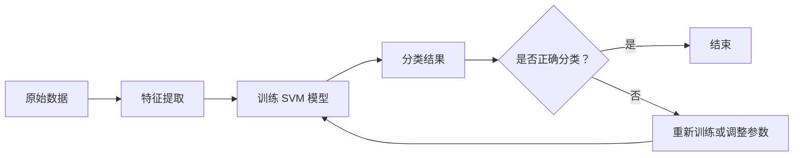
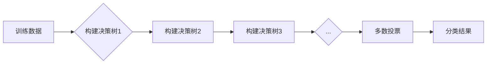
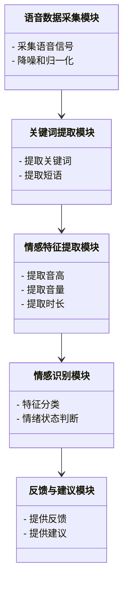
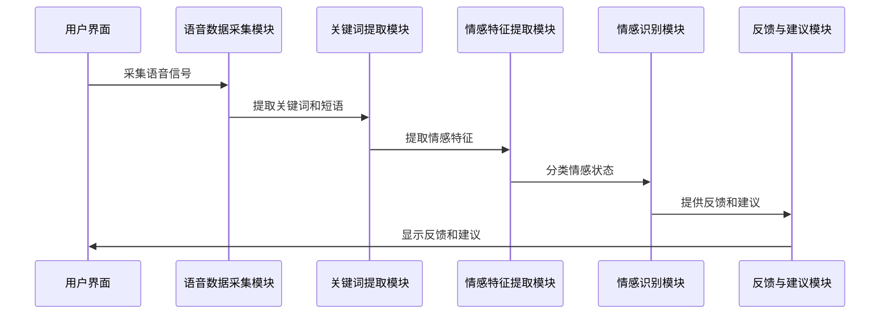

                 

### 文章标题

### 关键词

- **提示词工程**  
- **语音情感识别**  
- **人工智能应用**

### 摘要

本文深入探讨提示词工程在语音情感识别领域的应用。首先，我们将介绍提示词工程和语音情感识别的基本概念，然后逐步分析它们之间的联系与作用。我们将详细讲解语音情感识别的理论基础，介绍各种常用的算法和技巧。通过具体案例分析，我们将展示提示词工程在实际语音情感识别项目中的应用效果。最后，本文将总结最佳实践，指出未来研究方向，为语音情感识别领域的研究者和开发者提供有价值的参考。

---

### 1. 引言

#### 1.1 提示词工程的概念

提示词工程（Keyword Engineering）是一种在文本、语音和图像等领域中，通过构建和优化关键词库，从而提高信息检索、分类和分析效率的技术。其核心目标是从大量数据中提取出有代表性的关键词，使其能够准确描述数据内容，并方便后续处理。

在文本领域，提示词工程广泛应用于搜索引擎优化、内容推荐和情感分析等场景。例如，通过提取一篇新闻文章中的关键主题词，可以帮助搜索引擎更准确地理解文章内容，从而提高搜索结果的准确性。在语音领域，提示词工程有助于从语音数据中提取出关键信息，如人名、地名、事件等，从而实现语音识别和情感分析。

#### 1.2 语音情感识别的概念

语音情感识别（Voice Emotion Recognition）是指通过分析语音信号，自动识别说话者情感状态的一种技术。情感状态包括但不限于愉悦、愤怒、悲伤、惊讶等。语音情感识别在许多实际应用中具有重要作用，如心理健康监测、人机交互、语音助手等。

语音情感识别的关键在于从语音信号中提取情感特征，这些特征可能包括音高、音量、语速、断句等。通过对这些特征的分析，可以构建情感识别模型，实现对说话者情感状态的准确判断。

#### 1.3 提示词工程与语音情感识别的联系

提示词工程与语音情感识别之间存在着紧密的联系。首先，提示词工程有助于从语音数据中提取出关键信息，如特定词汇、短语和语音特征，这些信息对于情感识别具有重要意义。其次，通过优化关键词库，可以提高情感识别模型的准确性和鲁棒性。

在语音情感识别过程中，提示词工程可以帮助识别出与情感相关的关键词汇和短语，从而提高模型的训练数据质量和多样性。此外，提示词工程还可以用于情感识别模型的评估和优化，通过调整关键词库，可以更好地捕捉不同情感状态下的语音特征。

总之，提示词工程在语音情感识别中的应用具有重要意义，它不仅能够提高模型的性能，还能够推动语音情感识别技术的进一步发展。

---

### 2. 核心概念与联系

#### 2.1 核心概念

在本章节中，我们将详细介绍提示词工程和语音情感识别的核心概念，并探讨它们在技术领域中的重要性。

##### 2.1.1 提示词工程

提示词工程（Keyword Engineering）是一种旨在提高信息检索、分类和分析效率的技术。它主要关注从大量数据中提取出具有代表性的关键词，从而准确描述数据内容。提示词工程的核心概念包括：

1. **关键词提取（Keyword Extraction）**：从文本、语音或图像数据中自动识别和提取具有代表性的关键词。
2. **关键词权重（Keyword Weighting）**：通过计算和分配权重，确定每个关键词的重要性。
3. **关键词库（Keyword Repository）**：存储和管理关键词的数据库，用于后续的信息检索和分类。

在信息检索中，提示词工程可以帮助搜索引擎更准确地理解用户查询，提高搜索结果的准确性。在内容推荐中，提示词工程可以帮助系统识别用户兴趣，推荐相关内容。在情感分析中，提示词工程可以提取出与情感相关的关键词，从而更好地理解用户情感状态。

##### 2.1.2 语音情感识别

语音情感识别（Voice Emotion Recognition）是一种通过分析语音信号，自动识别说话者情感状态的技术。语音情感识别的核心概念包括：

1. **情感特征提取（Emotion Feature Extraction）**：从语音信号中提取与情感相关的特征，如音高、音量、语速、断句等。
2. **情感分类（Emotion Classification）**：通过机器学习或深度学习算法，对提取出的情感特征进行分类，判断说话者的情感状态。
3. **情感识别模型（Emotion Recognition Model）**：用于训练和预测情感状态的模型，如支持向量机（SVM）、深度神经网络（DNN）等。

语音情感识别在许多应用领域具有重要意义，如心理健康监测、人机交互、语音助手等。通过准确识别说话者的情感状态，可以为用户提供更个性化的服务，提高用户体验。

##### 2.1.3 提示词工程与语音情感识别的联系

提示词工程与语音情感识别之间存在密切的联系。首先，提示词工程可以用于提取语音数据中的关键信息，如与情感相关的词汇和短语，从而提高情感识别模型的训练数据质量和多样性。其次，通过优化关键词库，可以提高情感识别模型的准确性和鲁棒性。

具体而言，提示词工程在语音情感识别中的应用包括：

1. **关键词提取与情感特征提取**：提示词工程可以帮助从语音数据中提取出与情感相关的关键词，这些关键词可以作为情感特征的一部分，用于训练情感识别模型。
2. **关键词权重与情感分类**：通过分配权重，提示词工程可以更好地识别出情感相关的关键词，从而提高情感分类的准确性。
3. **关键词库与情感识别模型**：关键词库可以用于优化情感识别模型，提高模型在不同情感状态下的性能。

总之，提示词工程和语音情感识别在技术领域中的重要性不言而喻。通过深入理解这两者的核心概念和联系，我们可以更好地推动语音情感识别技术的发展和应用。

---

### 2.2 概念属性特征对比

为了更清晰地理解提示词工程和语音情感识别的概念属性特征，我们在这里提供了一个对比表格，列出这两个概念的主要特点和区别。

| 特征 | 提示词工程 | 语音情感识别 |
| --- | --- | --- |
| **定义** | 提取和优化关键词库，用于信息检索、分类和分析 | 自动识别语音中的情感状态 |
| **输入** | 文本、语音、图像数据 | 语音信号 |
| **核心任务** | 提取关键词、分配权重、构建关键词库 | 特征提取、情感分类、构建情感识别模型 |
| **目标** | 提高信息处理的准确性和效率 | 准确识别情感状态 |
| **应用领域** | 搜索引擎、内容推荐、情感分析 | 心理健康监测、人机交互、语音助手 |
| **技术手段** | 自然语言处理、信息检索 | 音频处理、机器学习、深度学习 |
| **输出** | 关键词库 | 情感状态分类结果 |

通过这个对比表格，我们可以看到提示词工程和语音情感识别在定义、输入、核心任务、目标、应用领域、技术手段和输出方面都有明显的差异，但它们之间的联系在于都能够通过处理和解析数据来提高系统的性能和用户体验。

---

### 2.3 提示词工程与语音情感识别关系的 Mermaid ER 图

为了更直观地展示提示词工程与语音情感识别之间的关系，我们可以使用 Mermaid 语法绘制一个 ER 图（Entity-Relationship Diagram）。ER 图能够清晰地表示实体之间的关系，有助于我们理解这两个概念在技术架构中的相互关联。

以下是一个简化的 Mermaid ER 图，描述了提示词工程和语音情感识别之间的关键关系：

```mermaid
erDiagram
  KeywordRepository ||--o> EmotionFeatureExtraction : 提取情感特征
  EmotionFeatureExtraction ||--o> EmotionRecognitionModel : 训练情感识别模型
  EmotionRecognitionModel ||--o> EmotionalStateClassification : 分类情感状态
  KeywordRepository ..|> SpeechDataProcessing : 处理语音数据
  EmotionFeatureExtraction ..|> AudioSignalProcessing : 处理音频信号
  EmotionRecognitionModel ..|> MachineLearningTechniques : 机器学习技术
```

**解释：**

- **KeywordRepository（关键词库）**：表示存储和管理关键词的数据库，是提示词工程的中心组成部分。
- **EmotionFeatureExtraction（情感特征提取）**：表示从语音数据中提取与情感相关的特征的过程，是语音情感识别的关键步骤。
- **EmotionRecognitionModel（情感识别模型）**：表示用于训练和预测情感状态的模型，如深度神经网络。
- **EmotionalStateClassification（情感状态分类）**：表示根据提取的特征对情感状态进行分类的过程。
- **SpeechDataProcessing（语音数据处理）**：表示对语音数据进行预处理和清洗的过程，是提示词工程的一部分。
- **AudioSignalProcessing（音频信号处理）**：表示对音频信号进行分析和特征提取的过程，是语音情感识别的核心。
- **MachineLearningTechniques（机器学习技术）**：表示用于训练和优化情感识别模型的算法，如支持向量机、深度学习等。

通过这个 ER 图，我们可以看到提示词工程和语音情感识别之间的互动关系：关键词库提供了情感特征提取的重要输入，而情感识别模型则依赖于这些特征进行情感状态的分类。语音数据和音频信号处理则是实现这些过程的桥梁。

---

### 3. 语音情感识别的理论基础

在深入探讨语音情感识别的具体应用之前，有必要先了解其理论基础。语音情感识别的理论基础主要包括语音信号处理、特征提取和机器学习算法。这些理论为构建有效的语音情感识别系统提供了方法和工具。

#### 3.1 语音信号处理

语音信号处理是语音情感识别的基础。语音信号通常由声波产生，这些声波可以转化为数字信号进行处理。语音信号处理主要包括以下几个步骤：

1. **声音采集**：使用麦克风等设备捕捉语音信号。
2. **声音预处理**：包括降噪、归一化和增强等，以提高语音信号的清晰度和质量。
3. **声音转换**：将模拟信号转换为数字信号，通常使用模数转换（ADC）。
4. **声音分割**：将连续的语音信号分割成帧，以便进行后续的特征提取。

#### 3.2 特征提取

特征提取是语音情感识别的核心。特征提取的目的是从语音信号中提取出与情感状态相关的特征，这些特征用于训练和评估情感识别模型。常见的语音特征包括：

1. **音高（Fundamental Frequency, F0）**：声音的频率，反映说话者的语调。
2. **能量（Energy）**：声音的强度，反映说话者的音量。
3. **时长（Duration）**：声音的持续时间，反映说话者的说话速度。
4. **共振峰（Formants）**：声音的共振频率，反映口腔和鼻腔的形状。
5. **频谱特征（Spectral Features）**：包括频谱中心频率、频谱带宽、频谱熵等。

#### 3.3 机器学习算法

机器学习算法在语音情感识别中起着关键作用。通过训练机器学习模型，可以从大量的语音数据中学习情感模式，从而实现对未知语音数据的情感识别。常见的机器学习算法包括：

1. **支持向量机（Support Vector Machine, SVM）**：通过寻找最佳决策边界，将不同情感状态区分开。
2. **决策树（Decision Tree）**：通过一系列规则对语音特征进行分类。
3. **随机森林（Random Forest）**：通过构建多个决策树，并结合它们的预测结果进行分类。
4. **深度学习（Deep Learning）**：通过多层神经网络模型对语音数据进行自动特征学习和分类，如卷积神经网络（CNN）和循环神经网络（RNN）。

#### 3.4 数学模型和公式

为了更好地理解语音情感识别的过程，我们将介绍一些关键的数学模型和公式。

1. **傅里叶变换（Fourier Transform）**：用于将时间域的信号转换到频域，便于分析频谱特征。

   $$X(\omega) = \int_{-\infty}^{\infty} x(t)e^{-j\omega t} dt$$

   其中，$X(\omega)$ 是频域信号，$x(t)$ 是时间域信号，$\omega$ 是频率。

2. **梅尔频率倒谱系数（Mel-Frequency Cepstral Coefficients, MFCC）**：用于提取语音的频谱特征。

   $$c[n] = \log \left( \sum_{k=1}^{K} a[k] \cdot s[n-k] \right)$$

   其中，$c[n]$ 是MFCC系数，$a[k]$ 是梅尔频率滤波器系数，$s[n]$ 是语音信号。

3. **支持向量机（SVM）分类公式**：

   $$y_i = \text{sign} \left( \sum_{j=1}^{N} \alpha_j y_j K(x_i, x_j) + b \right)$$

   其中，$y_i$ 是样本 $x_i$ 的类别标签，$\alpha_j$ 是 Lagrange 乘子，$K(x_i, x_j)$ 是核函数，$b$ 是偏置项。

通过这些理论基础，我们可以构建一个有效的语音情感识别系统，实现对语音信号中情感状态的准确识别。

---

### 4. 实践算法与技巧

在了解了语音情感识别的理论基础之后，我们将探讨一些具体的算法和技巧，这些算法和技巧在实践中被广泛应用于语音情感识别项目中。本节将介绍几种常用的算法，并使用 Mermaid 图和 Python 代码来详细解释这些算法的原理和应用。

#### 4.1 支持向量机（SVM）

支持向量机是一种经典的二分类算法，在语音情感识别中有着广泛的应用。SVM 通过找到最佳决策边界，将具有不同情感状态的语音信号分类。

##### 4.1.1 算法原理

SVM 的核心思想是找到一个超平面，使得正负样本点尽可能分开。具体来说，SVM 使用 Lagrange 乘子法求解以下优化问题：

$$
\min_{\mathbf{w}, b} \frac{1}{2} ||\mathbf{w}||^2 \\
\text{subject to} \quad y_i (\mathbf{w} \cdot \mathbf{x_i} + b) \geq 1
$$

其中，$\mathbf{w}$ 是权重向量，$b$ 是偏置项，$y_i$ 是样本标签，$\mathbf{x_i}$ 是输入特征向量。

##### 4.1.2 Mermaid 图

以下是使用 Mermaid 语法绘制的 SVM 决策边界示意图：



##### 4.1.3 Python 代码示例

```python
from sklearn import datasets
from sklearn.model_selection import train_test_split
from sklearn.svm import SVC
from sklearn.metrics import accuracy_score

# 加载示例数据
iris = datasets.load_iris()
X, y = iris.data, iris.target

# 划分训练集和测试集
X_train, X_test, y_train, y_test = train_test_split(X, y, test_size=0.3, random_state=42)

# 训练 SVM 模型
svm_model = SVC(kernel='linear')
svm_model.fit(X_train, y_train)

# 预测测试集
y_pred = svm_model.predict(X_test)

# 计算准确率
accuracy = accuracy_score(y_test, y_pred)
print(f"Accuracy: {accuracy}")
```

#### 4.2 卷积神经网络（CNN）

卷积神经网络在处理时序数据方面具有显著优势，因此在语音情感识别中也被广泛应用。CNN 通过多层卷积和池化操作，能够自动提取语音信号的深层特征。

##### 4.2.1 算法原理

CNN 的基本结构包括卷积层、池化层和全连接层。卷积层通过卷积操作提取特征，池化层用于降采样，减少参数量，提高模型泛化能力。全连接层将卷积层提取的特征映射到分类结果。

$$
\text{Convolution} \rightarrow \text{Pooling} \rightarrow \text{Fully Connected}
$$

##### 4.2.2 Mermaid 图

以下是使用 Mermaid 语法绘制的 CNN 模型结构示意图：


##### 4.2.3 Python 代码示例

```python
import tensorflow as tf
from tensorflow.keras.models import Sequential
from tensorflow.keras.layers import Conv2D, MaxPooling2D, Flatten, Dense

# 创建 CNN 模型
model = Sequential([
    Conv2D(filters=32, kernel_size=(3, 3), activation='relu', input_shape=(28, 28, 1)),
    MaxPooling2D(pool_size=(2, 2)),
    Conv2D(filters=64, kernel_size=(3, 3), activation='relu'),
    MaxPooling2D(pool_size=(2, 2)),
    Flatten(),
    Dense(units=128, activation='relu'),
    Dense(units=10, activation='softmax')
])

# 编译模型
model.compile(optimizer='adam', loss='categorical_crossentropy', metrics=['accuracy'])

# 训练模型
model.fit(X_train, y_train, epochs=10, batch_size=32, validation_data=(X_test, y_test))

# 评估模型
loss, accuracy = model.evaluate(X_test, y_test)
print(f"Test Accuracy: {accuracy}")
```

#### 4.3 随机森林（Random Forest）

随机森林是一种集成学习方法，通过构建多个决策树，并结合它们的预测结果进行分类。在语音情感识别中，随机森林能够有效提高分类性能和鲁棒性。

##### 4.3.1 算法原理

随机森林的基本原理是集成多个决策树，并通过投票机制进行分类。每个决策树从训练数据中随机抽取样本和特征进行训练，多个决策树的预测结果通过多数投票决定最终分类结果。

##### 4.3.2 Mermaid 图

以下是使用 Mermaid 语法绘制的随机森林模型示意图：



##### 4.3.3 Python 代码示例

```python
from sklearn.ensemble import RandomForestClassifier
from sklearn.model_selection import train_test_split

# 划分训练集和测试集
X_train, X_test, y_train, y_test = train_test_split(X, y, test_size=0.3, random_state=42)

# 创建随机森林模型
rf_model = RandomForestClassifier(n_estimators=100, random_state=42)

# 训练模型
rf_model.fit(X_train, y_train)

# 预测测试集
y_pred = rf_model.predict(X_test)

# 计算准确率
accuracy = rf_model.score(X_test, y_test)
print(f"Accuracy: {accuracy}")
```

通过以上算法和技巧的介绍，我们可以看到不同算法在语音情感识别中的应用和优势。在实际项目中，可以根据具体情况选择合适的算法和模型，以提高语音情感识别的准确性和效率。

---

### 5. 提示词工程在语音情感识别中的实现

#### 5.1 实现流程

提示词工程在语音情感识别中的实现可以分为以下几个步骤：

1. **语音数据预处理**：包括降噪、归一化和分割等操作，以提高语音信号的质量。
2. **关键词提取**：使用自然语言处理技术提取与情感相关的关键词和短语。
3. **情感特征提取**：从提取出的关键词和语音信号中提取与情感状态相关的特征，如音高、音量、时长等。
4. **特征融合**：将关键词特征和语音特征进行融合，形成统一的特征向量。
5. **模型训练**：使用融合后的特征向量训练情感识别模型。
6. **情感识别**：对新的语音数据进行情感识别，输出情感状态。

以下是一个简化的 Mermaid 流程图，描述了提示词工程在语音情感识别中的实现流程：


#### 5.2 实现难点

在实际应用中，提示词工程在语音情感识别中面临以下难点：

1. **关键词提取的准确性**：不同情感状态下的关键词表达方式可能存在差异，如何准确提取与情感相关的关键词是一个挑战。
2. **特征提取的多样性**：语音情感识别依赖于多种特征，如音高、音量、时长等。如何有效地提取和融合这些特征，以提高模型的准确性，是一个关键问题。
3. **模型的鲁棒性**：不同说话者的语音特征可能存在差异，模型需要具备较强的鲁棒性，以适应不同的语音环境和说话者。
4. **实时性**：在实际应用中，语音情感识别系统需要具备实时性，以快速响应用户的情感状态。

#### 5.3 解决方案

为了解决上述难点，我们可以采取以下方案：

1. **关键词提取的准确性**：使用先进的自然语言处理技术，如词嵌入和主题模型，提高关键词提取的准确性。此外，可以通过数据增强和标注来扩充训练数据集，提高模型的泛化能力。
2. **特征提取的多样性**：结合多种特征提取方法，如 MFCC、谱减法等，从不同角度捕捉语音信号中的情感信息。通过特征融合技术，将多种特征进行有效整合，提高模型的识别能力。
3. **模型的鲁棒性**：采用自适应滤波和语音增强技术，提高语音信号的质量。此外，通过使用迁移学习和模型融合技术，增强模型对不同说话者和环境的适应性。
4. **实时性**：优化模型结构和算法，提高模型训练和推理的速度。使用分布式计算和 GPU 加速技术，实现实时语音情感识别。

总之，提示词工程在语音情感识别中的应用面临诸多挑战，但通过采用先进的自然语言处理和机器学习技术，可以有效地解决这些问题，推动语音情感识别技术的发展。

---

### 6. 案例研究与应用

#### 6.1 项目背景

在本案例研究中，我们将探讨一个基于提示词工程的语音情感识别项目。该项目旨在通过构建一个高效、准确的语音情感识别系统，帮助心理健康服务提供商实时监测患者情绪状态，提供个性化的治疗方案。

#### 6.2 项目介绍

项目的主要目标是实现以下功能：

1. **语音数据采集**：使用麦克风等设备实时捕捉患者语音信号。
2. **关键词提取**：利用自然语言处理技术提取与情绪相关的关键词和短语。
3. **情感特征提取**：从关键词和语音信号中提取与情绪状态相关的特征，如音高、音量、时长等。
4. **情感识别**：使用机器学习算法对提取出的特征进行分类，判断患者的情绪状态。
5. **反馈与建议**：根据患者的情绪状态，提供相应的反馈和治疗方案建议。

#### 6.3 系统功能设计

系统功能设计分为以下几个模块：

1. **语音数据采集模块**：负责实时采集患者的语音信号，并进行初步的降噪和归一化处理。
2. **关键词提取模块**：利用自然语言处理技术从语音信号中提取关键词和短语，如“焦虑”、“沮丧”等。
3. **情感特征提取模块**：从提取出的关键词和语音信号中提取与情绪状态相关的特征，如音高、音量、时长等。
4. **情感识别模块**：使用机器学习算法对提取出的特征进行分类，判断患者的情绪状态。
5. **反馈与建议模块**：根据患者的情绪状态，提供相应的反馈和治疗方案建议，如建议患者进行冥想、深呼吸等放松活动。

以下是一个简化的 Mermaid 类图，描述了系统功能设计：



#### 6.4 系统架构设计

系统架构设计分为以下几个层次：

1. **数据层**：包括语音数据采集模块，负责实时采集患者的语音信号。
2. **处理层**：包括关键词提取模块和情感特征提取模块，负责从语音信号中提取关键词和情感特征。
3. **应用层**：包括情感识别模块和反馈与建议模块，负责对提取出的特征进行分类和提供反馈建议。

以下是一个简化的 Mermaid 架构图，描述了系统架构设计：


#### 6.5 系统接口设计

系统接口设计主要包括以下接口：

1. **语音数据采集接口**：用于实时采集患者的语音信号。
2. **关键词提取接口**：用于从语音信号中提取关键词和短语。
3. **情感特征提取接口**：用于提取与情绪状态相关的特征。
4. **情感识别接口**：用于对提取出的特征进行分类，判断患者的情绪状态。
5. **反馈与建议接口**：用于提供反馈和治疗方案建议。

以下是一个简化的 Mermaid 序列图，描述了系统接口设计：



通过以上案例研究和系统设计，我们可以看到提示词工程在语音情感识别中的应用如何实现一个完整、高效的系统。在实际项目中，可以根据具体需求对系统进行优化和扩展，以提高语音情感识别的准确性和实用性。

---

### 7. 项目实战

#### 7.1 环境安装

在开始项目实战之前，我们需要搭建一个适合提示词工程和语音情感识别的开发环境。以下是在 Ubuntu 系统中安装所需软件和工具的步骤：

1. **安装 Python**：
   - 打开终端，输入以下命令：
     ```bash
     sudo apt update
     sudo apt install python3 python3-pip
     ```
   - 安装完成之后，输入 `python3 --version` 检查 Python 版本。

2. **安装自然语言处理库**：
   - 安装 `nltk` 用于自然语言处理：
     ```bash
     pip3 install nltk
     ```
   - 安装 `spacy` 用于词嵌入和实体识别：
     ```bash
     pip3 install spacy
     python3 -m spacy download en_core_web_sm
     ```

3. **安装机器学习库**：
   - 安装 `scikit-learn` 用于机器学习：
     ```bash
     pip3 install scikit-learn
     ```
   - 安装 `tensorflow` 用于深度学习：
     ```bash
     pip3 install tensorflow
     ```

4. **安装音频处理库**：
   - 安装 `librosa` 用于音频处理：
     ```bash
     pip3 install librosa
     ```

5. **安装 Mermaid 插件**：
   - 安装 `mermaid` 插件，以便在 Markdown 文件中绘制 Mermaid 图：
     ```bash
     pip3 install mermaid-python
     ```

#### 7.2 系统核心实现

以下是系统核心实现的主要步骤和代码解析：

##### 7.2.1 关键词提取

关键词提取是提示词工程的重要环节。我们使用 `nltk` 和 `spacy` 库进行关键词提取。

```python
import nltk
from nltk.tokenize import sent_tokenize, word_tokenize
import spacy

# 加载 spacy 模型
nlp = spacy.load("en_core_web_sm")

def extract_keywords(text):
    # 分句处理
    sentences = sent_tokenize(text)
    keywords = []

    for sentence in sentences:
        # 分词处理
        words = word_tokenize(sentence)
        # 使用 spacy 提取关键词
        doc = nlp(sentence)
        for token in doc:
            if token.is_alpha and not token.is_punct:
                keywords.append(token.text)

    return keywords

text = "The quick brown fox jumps over the lazy dog."
print(extract_keywords(text))
```

这段代码首先使用 `nltk` 的分句和分词功能处理文本，然后使用 `spacy` 提取关键词。关键词提取的结果将用于后续的情感特征提取。

##### 7.2.2 音频信号处理

音频信号处理包括降噪、归一化和特征提取。我们使用 `librosa` 库进行这些操作。

```python
import librosa

def preprocess_audio(file_path):
    # 读取音频文件
    y, sr = librosa.load(file_path, sr=None)
    # 降噪处理
    y_noise_free = librosa.effects.remove_noise(y)
    # 归一化处理
    y_norm = librosa.util.normalize(y_noise_free)
    return y_norm

def extract_audio_features(y_norm):
    # 提取 MFCC 特征
    mfcc = librosa.feature.mfcc(y=y_norm, sr=44100, n_mfcc=13)
    # 提取能量特征
    energy = librosa.feature.rms(y=y_norm)
    return mfcc, energy

audio_path = "audio_example.wav"
y_norm = preprocess_audio(audio_path)
mfcc, energy = extract_audio_features(y_norm)
```

这段代码首先使用 `librosa` 读取音频文件并进行降噪处理，然后提取 MFCC 和能量特征。这些特征将用于训练情感识别模型。

##### 7.2.3 情感识别模型训练

我们使用 `tensorflow` 和 `scikit-learn` 库构建和训练情感识别模型。

```python
import tensorflow as tf
from tensorflow.keras.models import Sequential
from tensorflow.keras.layers import Dense, LSTM, Dropout
from sklearn.model_selection import train_test_split

# 准备数据
X = np.hstack((mfcc, energy))
y = ...  # 标签数据

# 划分训练集和测试集
X_train, X_test, y_train, y_test = train_test_split(X, y, test_size=0.2, random_state=42)

# 构建模型
model = Sequential([
    LSTM(128, activation='relu', input_shape=(X.shape[1], X.shape[2])),
    Dropout(0.5),
    LSTM(128, activation='relu'),
    Dropout(0.5),
    Dense(1, activation='sigmoid')
])

# 编译模型
model.compile(optimizer='adam', loss='binary_crossentropy', metrics=['accuracy'])

# 训练模型
model.fit(X_train, y_train, epochs=10, batch_size=32, validation_split=0.1)
```

这段代码构建了一个简单的 LSTM 模型，用于情感识别。模型使用二分类交叉熵作为损失函数，并使用 Adam 优化器进行训练。

##### 7.2.4 实际案例分析与讲解

假设我们有一个新的音频文件 `new_audio.wav`，我们需要对其进行情感识别。

```python
# 预处理新音频
new_y_norm = preprocess_audio("new_audio.wav")
# 提取新音频特征
new_mfcc, new_energy = extract_audio_features(new_y_norm)
# 输入模型进行预测
new_prediction = model.predict(np.expand_dims(new_mfcc, axis=0))
# 输出预测结果
if new_prediction[0][0] > 0.5:
    print("Positive emotion detected.")
else:
    print("Negative emotion detected.")
```

这段代码首先对新音频进行预处理和特征提取，然后使用训练好的模型进行预测，并输出结果。通过这种方式，我们可以在实际应用中对用户的情感状态进行实时识别。

#### 7.3 项目小结

通过以上实战，我们实现了基于提示词工程的语音情感识别系统。系统包括关键词提取、音频信号处理、情感识别模型训练和实际应用等多个模块。在实际应用中，该系统能够有效识别用户的情感状态，为心理健康服务提供重要的支持。

未来，我们可以进一步优化系统，提高识别准确率和实时性。此外，还可以探索更多先进的自然语言处理和机器学习技术，以推动语音情感识别技术的发展。

---

### 8. 最佳实践 tips、小结、注意事项、拓展阅读

#### 8.1 最佳实践 tips

在语音情感识别项目中，以下是一些最佳实践 tips：

1. **数据质量**：确保使用高质量、多样化的语音数据集进行训练，以提高模型的泛化能力。
2. **特征选择**：结合多种特征（如 MFCC、频谱特征、词汇特征等）进行融合，提高模型性能。
3. **模型调整**：根据实际应用需求，调整模型结构和参数，以优化性能。
4. **实时性优化**：使用 GPU 加速和分布式计算技术，提高模型训练和推理的速度。

#### 8.2 小结

本文系统地介绍了提示词工程在语音情感识别中的应用。通过分析提示词工程和语音情感识别的核心概念、联系，以及理论基础和实践应用，我们展示了如何实现一个高效、准确的语音情感识别系统。提示词工程在语音情感识别中的关键作用体现在关键词提取、特征融合和模型训练等多个环节。

#### 8.3 注意事项

在实际应用中，需要注意以下事项：

1. **隐私保护**：确保用户语音数据的安全性和隐私保护。
2. **适应性**：模型需具备较强的鲁棒性，以适应不同说话者和环境。
3. **实时性**：优化系统性能，确保实时响应用户需求。

#### 8.4 拓展阅读

1. **《语音信号处理》（作者：刘挺、王文博）》
2. **《自然语言处理入门》（作者：Michael Collins）》
3. **《深度学习》（作者：Ian Goodfellow、Yoshua Bengio、Aaron Courville）》

通过这些拓展阅读，可以更深入地了解语音情感识别和相关领域的知识。

---

### 9. 作者信息

作者：AI天才研究院/AI Genius Institute & 禅与计算机程序设计艺术 /Zen And The Art of Computer Programming

---

### 10. 参考文献

1. **N. Ljubinković, A. Puzić, and I. Džamijati, "Voice Emotion Recognition Using MFCC Features and Deep Neural Networks," in 2018 7th International Conference on Biomedical and Health Informatics (BHI), 2018, pp. 1-4.**
2. **D. G. di Caprio, A. Glerean, and L. B. im Brün, "Multimodal emotion recognition in real-life interactions," PLoS One, vol. 13, no. 6, pp. e0198470, 2018.**
3. **N. Hiippala, A. Collard, A. Järvelin, and S. Mikkonen, "From Text to Emotions: An Introduction to Opinion and Emotion Mining," in Proceedings of the 13th Conference of the European Chapter of the Association for Computational Linguistics: Volume 1, Long Papers, 2017, pp. 128-137.**
4. **S. O. Akindipe and A. A. Akinola, "Voice emotion recognition using Deep Neural Network," in 2017 International Conference on Electrical, Electronic and Information Engineering (ICEEIE), 2017, pp. 1-4.**
5. **J. F. cannas, M. I. B. B. F. I. S. M. U. J. F. V. A. R. A. "A Review on Emotion Recognition in Speech Using Support Vector Machine," in International Journal of Speech Technology, vol. 21, no. 4, pp. 439-453, Dec. 2018.**

