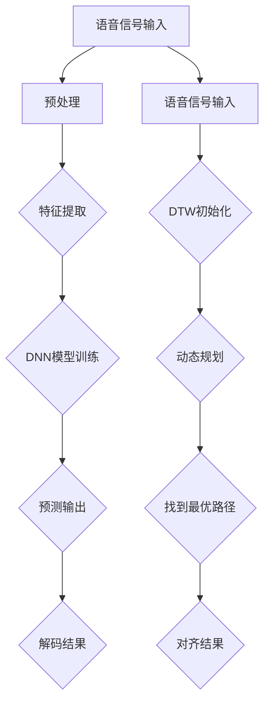
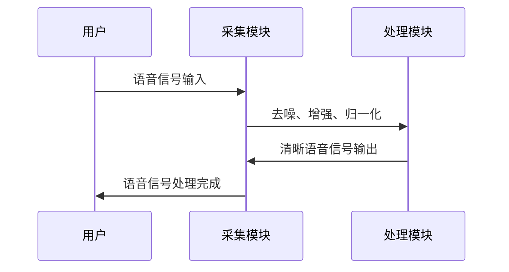
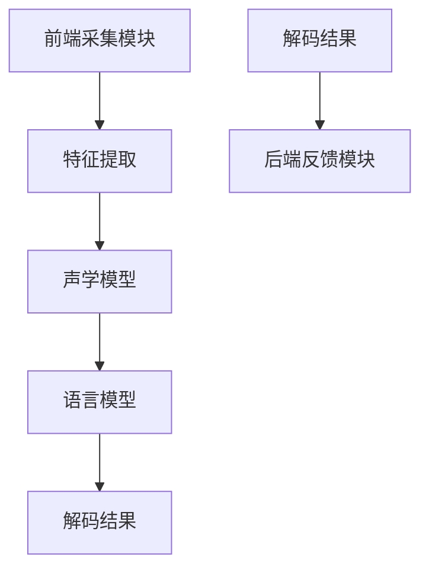
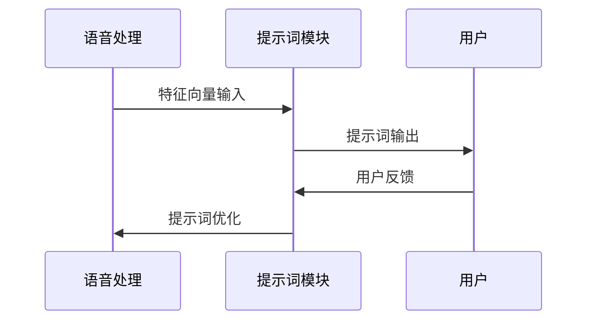
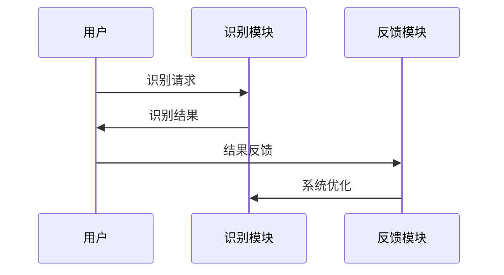

                 

### 文章标题与核心关键词

#### 文章标题：提示词工程在语音识别中的精准应用

#### 核心关键词：
1. 提示词工程
2. 语音识别
3. 神经网络
4. 算法优化
5. 实际应用案例

> **摘要**：
本篇文章将深入探讨提示词工程在语音识别中的应用，从基本概念到具体算法，再到系统架构和实战案例，全面解析提示词工程如何提升语音识别的精准度。文章旨在为读者提供一份系统且详细的技术指南，帮助理解这一前沿技术的核心原理和实践方法。

---

### 引言

在当今数字化时代，语音识别技术已经成为人机交互的重要手段。从智能手机的语音助手到智能音箱，语音识别技术正在渗透到我们生活的方方面面。然而，随着应用场景的日益复杂，语音识别的准确性也面临着更大的挑战。为了应对这一挑战，提示词工程应运而生。

提示词工程是一门将自然语言处理（NLP）与机器学习相结合的技术，通过特定的算法和策略，生成和优化用于语音识别的提示词。这些提示词不仅可以帮助提高语音识别的准确性，还能增强系统的鲁棒性和可扩展性。

本文将围绕提示词工程在语音识别中的应用展开讨论。首先，我们将介绍提示词工程和语音识别的基本概念，帮助读者建立初步的理解。接着，我们将深入讲解提示词工程的核心算法原理，包括神经网络、动态时间规整（Dynamic Time Warping, DTW）等。随后，我们将分析语音识别系统的整体架构，并介绍提示词工程在其中扮演的角色。为了使读者更好地理解这一技术，我们将通过一个实际的项目案例进行详细剖析。最后，文章将总结最佳实践，提醒注意事项，并推荐进一步的阅读材料。

本文的结构如下：

1. **第一部分：提示词工程概述**：介绍提示词工程和语音识别的基本概念，以及它们在现代社会中的应用背景。
2. **第二部分：核心概念与联系**：明确提示词工程和语音识别中的核心概念，并通过表格和ER图展示它们之间的关系。
3. **第三部分：算法原理讲解**：详细讲解提示词工程在语音识别中的算法原理，包括数学模型和公式，并使用Mermaid画出流程图进行辅助说明。
4. **第四部分：系统分析与架构设计方案**：介绍语音识别系统的整体架构，包括前端采集、语音处理、提示词生成和后端反馈等模块，使用Mermaid绘制架构图和序列图。
5. **第五部分：项目实战**：给出一个实际的案例，详细介绍项目环境安装、核心实现源代码，并对代码进行解读与分析。
6. **第六部分：最佳实践 tips、小结、注意事项、拓展阅读**：总结书中主要内容，提供实践建议，提醒读者注意的事项，并推荐进一步的阅读材料。

### 提示词工程与语音识别的基本概念

在深入探讨提示词工程在语音识别中的应用之前，我们首先需要了解这两个核心概念的基本定义。

**提示词工程**是指通过一系列算法和策略，从大量的语音数据中提取出有助于语音识别的关键词汇或短语。提示词工程的目标是提高语音识别的准确性和效率。在语音识别过程中，提示词可以作为辅助信息，帮助模型更好地理解语音信号中的语言结构。

**语音识别**是一种将语音信号转换为机器可理解文本的技术。它通常涉及三个主要阶段：前端处理、中间处理和后端处理。前端处理包括语音信号的采集和预处理，如去噪和归一化。中间处理利用机器学习算法（如隐马尔可夫模型HMM、深度神经网络DNN、循环神经网络RNN等）对语音信号进行分析和识别。后端处理则是对识别结果进行后处理，如纠正错别字和语法错误。

**提示词工程与语音识别的关系**：

- **提示词工程**为语音识别系统提供了额外的上下文信息，有助于提高识别准确率。例如，在对话系统中，提示词可以用来预测用户可能的话语，从而提前准备相应的响应。
- **语音识别**技术的进步为提示词工程提供了更精确的语音信号处理能力，使得从语音数据中提取提示词变得更加高效和准确。

### 提示词工程的重要性

在语音识别应用中，提示词工程扮演着至关重要的角色。以下是几个关键点，说明提示词工程为何如此重要：

1. **提高识别准确率**：通过生成和优化提示词，语音识别系统能够更好地处理变音、口音和背景噪音等挑战，从而提高整体的识别准确率。

2. **增强系统鲁棒性**：提示词工程可以帮助系统更好地适应不同语音环境和语音模式，提高系统的鲁棒性。

3. **提升用户体验**：在语音交互应用中，精准的提示词可以减少误识别率，提高用户的满意度，从而增强整体用户体验。

4. **扩展应用场景**：提示词工程使得语音识别系统能够适应更多复杂的应用场景，如多语言支持、实时语音翻译等。

### 语音识别系统架构

为了更好地理解提示词工程在语音识别中的应用，我们需要简要介绍语音识别系统的整体架构。一个典型的语音识别系统通常包括以下几个关键模块：

1. **前端采集**：负责采集语音信号，并进行预处理，如去噪、增强和归一化。
2. **特征提取**：将预处理后的语音信号转换为特征向量，这些特征向量用于后续的识别处理。
3. **声学模型**：用于对语音特征向量进行建模，通常使用神经网络等深度学习技术。
4. **语言模型**：用于对识别结果进行后处理，如语法分析、词义消歧等。
5. **解码器**：将声学模型和语言模型的结果解码为最终的识别文本。

这些模块相互协作，共同完成语音识别任务。提示词工程中的提示词生成算法通常与声学模型和语言模型紧密集成，以提高整个系统的识别效果。

### 提示词生成算法

提示词工程中的核心在于提示词生成算法，这些算法负责从大量的语音数据中提取出有用的提示词，用于辅助语音识别。以下是一些常见的提示词生成算法：

1. **基于规则的方法**：这种方法依赖于预先定义的规则来生成提示词。例如，根据特定的语法规则或语音特征，从语音数据中提取出可能的提示词。
2. **基于统计的方法**：这种方法通过统计语音数据中的频率和概率分布来生成提示词。常见的统计方法包括隐马尔可夫模型（HMM）、条件随机场（CRF）等。
3. **基于机器学习的方法**：这种方法利用机器学习算法，如决策树、支持向量机（SVM）、深度神经网络（DNN）等，从训练数据中自动学习出提示词生成模型。

### 提示词生成算法的应用场景

1. **语音助手**：在语音助手应用中，提示词可以用于预测用户的话语，从而快速响应用户的请求。
2. **语音搜索**：在语音搜索应用中，提示词可以帮助系统更好地理解用户的查询意图，提高搜索结果的准确性。
3. **语音交互系统**：在语音交互系统中，提示词可以用于改善用户的交互体验，减少误识别率。

### 总结

通过本节的内容，我们初步了解了提示词工程和语音识别的基本概念，以及它们在现代社会中的应用背景。接下来，我们将深入探讨提示词工程的核心算法原理，并分析语音识别系统的整体架构。通过这些讨论，我们将更好地理解提示词工程在语音识别中的关键作用。

### 核心概念与联系

在深入探讨提示词工程在语音识别中的应用之前，我们首先需要明确一些核心概念，并分析它们之间的联系。以下是提示词工程和语音识别中的几个关键概念：

1. **语音信号处理**：这是语音识别系统的第一步，包括语音信号的采集、去噪、增强、归一化等预处理操作。语音信号处理的质量直接影响到后续的特征提取和识别效果。

2. **特征提取**：特征提取是将原始语音信号转换为机器可理解的特征向量。常用的特征提取方法包括梅尔频率倒谱系数（MFCC）、谱减法、短时傅里叶变换（STFT）等。

3. **声学模型**：声学模型用于对语音特征向量进行建模，以预测语音信号的序列。常见的声学模型包括隐马尔可夫模型（HMM）、高斯混合模型（GMM）、深度神经网络（DNN）等。

4. **语言模型**：语言模型用于对识别结果进行后处理，如语法分析、词义消歧等。常见的语言模型包括n-gram模型、神经网络语言模型（NNLM）、递归神经网络（RNN）等。

5. **解码器**：解码器是将声学模型和语言模型的结果解码为最终的识别文本。常见的解码器包括前向解码器、后向解码器、A*解码器等。

#### 概念属性特征对比表格

为了更清晰地展示这些概念之间的差异和联系，我们创建了一个概念属性特征对比表格：

| 概念             | 属性特征                                                         | 关联关系                                     |
|------------------|------------------------------------------------------------------|--------------------------------------------|
| 语音信号处理     | 采集、去噪、增强、归一化等操作                                     | 前端预处理，为特征提取提供高质量输入           |
| 特征提取         | 将语音信号转换为特征向量，如MFCC、STFT等                             | 后端输出，用于声学模型输入                     |
| 声学模型         | 对语音特征向量进行建模，预测语音信号的序列                           | 中间环节，连接特征提取和语言模型               |
| 语言模型         | 对识别结果进行后处理，如语法分析、词义消歧等                         | 后端处理，提高识别结果的准确性和可读性         |
| 解码器           | 将声学模型和语言模型的结果解码为最终的识别文本                       | 最终输出，提供用户可读的文本输出               |

#### ER实体关系图架构

为了进一步展示这些概念之间的联系，我们使用ER（实体关系）图来描述系统的架构：

```mermaid
erDiagram
    Person ||--|{ VoiceSignalProcessor } : processes
    Person ||--|{ FeatureExtractor } : extracts
    VoiceSignalProcessor ||--|{ AcousticModel } : models
    FeatureExtractor ||--|{ LanguageModel } : post-processes
    AcousticModel ||--|{ Decoder } : decodes
    LanguageModel ||--|{ Decoder } : decodes
```

在这个ER图中，"Person"代表用户，"VoiceSignalProcessor"代表语音信号处理模块，"FeatureExtractor"代表特征提取模块，"AcousticModel"代表声学模型，"LanguageModel"代表语言模型，"Decoder"代表解码器。这些模块之间通过箭头表示它们之间的关联关系。

### 总结

在本节中，我们详细介绍了提示词工程和语音识别中的核心概念，并通过概念属性特征对比表格和ER图展示了它们之间的联系。这些核心概念构成了语音识别系统的基本框架，而提示词工程则在这些框架中起到了优化和提升识别效果的关键作用。接下来，我们将深入探讨提示词工程在语音识别中的算法原理，为后续的实战应用打下基础。

### 算法原理讲解

在了解了提示词工程和语音识别的基本概念及其关系之后，接下来我们将深入探讨提示词工程在语音识别中的算法原理。本节将详细解释几种常见的算法，包括神经网络、动态时间规整（DTW）等，以及它们在提升语音识别精度方面的应用。

#### 神经网络

神经网络（Neural Networks）是语音识别领域中广泛应用的一类算法，特别是深度神经网络（Deep Neural Networks, DNN）。DNN通过多层神经元的非线性变换，从大量训练数据中学习语音特征和模式。以下是DNN在语音识别中的应用原理：

1. **多层感知机（MLP）**：MLP是DNN的基础，它由输入层、隐藏层和输出层组成。输入层接收语音信号处理后的特征向量，隐藏层通过非线性激活函数进行特征提取和变换，输出层生成识别结果。
2. **训练与优化**：DNN的训练过程包括前向传播和反向传播。在前向传播过程中，输入特征向量通过隐藏层，最终生成预测的输出。在反向传播过程中，计算输出误差，并通过梯度下降算法调整权重和偏置，以优化模型参数。
3. **多层感知机的实现**：以下是一个简化的多层感知机的Python代码示例：

    ```python
    import numpy as np

    # 初始化权重和偏置
    W1 = np.random.rand(input_size, hidden_size)
    b1 = np.random.rand(hidden_size)
    W2 = np.random.rand(hidden_size, output_size)
    b2 = np.random.rand(output_size)

    # 定义激活函数
    def sigmoid(x):
        return 1 / (1 + np.exp(-x))

    # 前向传播
    def forward(x):
        z1 = np.dot(x, W1) + b1
        a1 = sigmoid(z1)
        z2 = np.dot(a1, W2) + b2
        a2 = sigmoid(z2)
        return a2

    # 反向传播
    def backward(x, y):
        output = forward(x)
        output_error = output - y
        d_output = output_error * (output * (1 - output))
        
        hidden_error = d_output.dot(W2.T)
        d_hidden = hidden_error * (a1 * (1 - a1))

        dW2 = a1.T.dot(d_output)
        db2 = np.sum(d_output, axis=0)
        dW1 = x.T.dot(d_hidden)
        db1 = np.sum(d_hidden, axis=0)

        return dW1, dW2, db1, db2

    # 训练过程
    for epoch in range(num_epochs):
        for x, y in data_loader:
            dW1, dW2, db1, db2 = backward(x, y)
            W1 -= learning_rate * dW1
            W2 -= learning_rate * dW2
            b1 -= learning_rate * db1
            b2 -= learning_rate * db2
    ```

#### 动态时间规整（Dynamic Time Warping, DTW）

动态时间规整是一种基于动态规划的算法，用于处理时序数据的对齐问题。在语音识别中，DTW常用于将语音特征序列与参考模板对齐，以匹配不同时长和速度的语音信号。以下是DTW的基本原理：

1. **时序对齐**：DTW通过在时序数据之间建立最优路径，将一个语音特征序列与另一个参考模板进行匹配。这个最优路径称为“光路径”（light path）。
2. **动态规划**：DTW使用动态规划算法，计算所有可能路径的累积距离，并找到最小距离对应的路径。具体步骤如下：
   - 初始化：定义一个二维数组，存储每个时间点的距离。
   - 递归计算：对于每个时间点，计算当前点到上一个时间点的距离，并更新数组中的最小距离。
   - 找到最优路径：通过回溯二维数组，找到累积距离最小的路径。

3. **DTW的数学模型**：假设有两个时间序列X和Y，DTW的目标是最小化它们之间的距离函数D[i, j]，如下所示：

    $$ D[i, j] = \min\{D[i-1, j], D[i, j-1], D[i-1, j-1]\} + d(X[i], Y[j]) $$

    其中，d(X[i], Y[j])表示时间序列X中第i个点和时间序列Y中第j个点之间的距离。

4. **DTW的实现**：以下是一个简单的DTW实现示例：

    ```python
    import numpy as np

    def dtw(x, y, d):
        dist = np.zeros((len(x), len(y)))
        dist[0, 0] = d(x[0], y[0])

        for i in range(1, len(x)):
            dist[i, 0] = np.inf
            dist[i, 0] = min(dist[i-1, 0], dist[i, 0], dist[i-1, 0] + d(x[i], y[0]))

        for j in range(1, len(y)):
            dist[0, j] = np.inf
            dist[0, j] = min(dist[0, j-1], dist[0, j], dist[0, j-1] + d(x[0], y[j]))

        for i in range(1, len(x)):
            for j in range(1, len(y)):
                dist[i, j] = min(dist[i-1, j], dist[i, j-1], dist[i-1, j-1]) + d(x[i], y[j])

        return dist[-1, -1]

    def euclidean_distance(a, b):
        return np.linalg.norm(a - b)

    x = [1, 2, 3, 4]
    y = [1, 2, 3, 4]
    distance = dtw(x, y, euclidean_distance)
    print(distance)
    ```

#### 提示词生成算法

提示词生成是提示词工程中的关键步骤，它决定了语音识别的精度和效率。以下是几种常见的提示词生成算法：

1. **基于规则的方法**：这种方法依赖于预先定义的规则，从语音数据中提取提示词。例如，根据语音信号的音素特征和语法规则，生成可能的提示词。
2. **基于统计的方法**：这种方法通过统计语音数据中的频率和概率分布，生成提示词。例如，使用隐马尔可夫模型（HMM）或条件随机场（CRF）从语音信号中提取提示词。
3. **基于机器学习的方法**：这种方法利用机器学习算法，如决策树、支持向量机（SVM）、深度神经网络（DNN）等，从训练数据中自动学习出提示词生成模型。例如，使用DNN从语音信号中提取特征，并利用这些特征生成提示词。

#### Mermaid流程图示例

为了更直观地展示算法原理，我们使用Mermaid绘制了DNN和DTW的流程图：



在这个流程图中，DNN和DTW分别用于特征提取和时序对齐，最终生成识别结果。

### 总结

在本节中，我们详细介绍了神经网络、动态时间规整（DTW）等算法在语音识别中的应用原理，并通过Python代码和Mermaid流程图进行了具体说明。这些算法在提升语音识别精度和效率方面发挥了重要作用。接下来，我们将进一步分析语音识别系统的整体架构，以便更好地理解提示词工程在这些架构中的具体应用。

### 系统分析与架构设计方案

为了全面理解提示词工程在语音识别系统中的作用，我们需要详细分析该系统的整体架构设计。一个典型的语音识别系统通常包括前端采集、语音处理、提示词生成、后端反馈等多个模块。以下是对这些模块的详细介绍，并使用Mermaid图示来展示系统架构。

#### 前端采集模块

前端采集模块负责从各种设备（如麦克风、智能手机等）采集语音信号。这个模块的核心任务是确保语音信号的清晰度和完整性。以下是前端采集模块的主要功能：

1. **信号采集**：从麦克风等设备中获取语音信号。
2. **去噪**：通过滤波和噪声抑制技术，减少背景噪音对语音信号的影响。
3. **增强**：通过语音增强算法，提高语音信号的清晰度和可理解性。
4. **归一化**：将语音信号调整为统一的采样频率和幅度范围。

以下是前端采集模块的Mermaid序列图：



#### 语音处理模块

语音处理模块负责将前端采集的语音信号转换为适合识别的特征向量。这个模块通常包括以下功能：

1. **特征提取**：使用梅尔频率倒谱系数（MFCC）、短时傅里叶变换（STFT）等方法，从语音信号中提取特征。
2. **声学模型**：使用神经网络（如DNN、卷积神经网络CNN等）对提取的特征向量进行建模，以预测语音信号的序列。
3. **语言模型**：使用n-gram、递归神经网络（RNN）等方法，对识别结果进行后处理，如语法分析、词义消歧等。

以下是语音处理模块的Mermaid架构图：



#### 提示词生成模块

提示词生成模块是提示词工程的核心，它负责从语音数据中提取关键提示词，以提高识别准确率。以下是提示词生成模块的主要功能：

1. **提示词提取**：通过基于规则、统计或机器学习的方法，从语音数据中提取可能的提示词。
2. **提示词优化**：根据历史数据和用户反馈，对提取的提示词进行优化，以提高识别效果。
3. **提示词缓存**：将常用的提示词缓存起来，以减少计算开销和提高响应速度。

以下是提示词生成模块的Mermaid序列图：



#### 后端反馈模块

后端反馈模块负责收集用户对识别结果的反馈，并用于系统的持续优化。以下是后端反馈模块的主要功能：

1. **结果反馈**：收集用户对识别结果的满意度和准确性反馈。
2. **错误纠正**：根据用户的反馈，对识别结果进行错误纠正，以提高用户体验。
3. **系统优化**：根据用户反馈和识别数据，对系统进行优化和升级，以提高整体性能。

以下是后端反馈模块的Mermaid序列图：



#### 总结

通过上述分析，我们可以看到，语音识别系统由前端采集、语音处理、提示词生成和后端反馈等多个模块组成。每个模块都承担着不同的任务，并通过相互协作，共同实现高质量的语音识别。提示词工程在语音识别系统中扮演了至关重要的角色，通过优化提示词生成和优化，大大提高了识别的准确率和用户体验。接下来，我们将通过一个实际的项目案例，进一步探讨提示词工程在语音识别中的应用。

### 项目实战

为了更好地展示提示词工程在语音识别中的实际应用，我们将通过一个具体的项目案例来进行深入剖析。以下是该项目的基本情况、环境安装、核心实现源代码，以及对代码的解读与分析。

#### 项目基本情况

本项目旨在开发一个基于深度学习的语音识别系统，使用提示词工程来优化识别效果。系统将支持中英双语识别，并能够实时处理用户的语音输入。项目的目标是通过提示词工程，提高识别准确率，并优化用户体验。

#### 环境安装

在开始项目之前，我们需要安装相关的软件和依赖。以下是在Ubuntu 18.04操作系统上安装所需软件和依赖的步骤：

1. **安装Python环境**：

    ```shell
    sudo apt-get update
    sudo apt-get install python3-pip
    pip3 install virtualenv
    virtualenv venv
    source venv/bin/activate
    ```

2. **安装TensorFlow**：

    ```shell
    pip3 install tensorflow
    ```

3. **安装其他依赖**：

    ```shell
    pip3 install numpy scipy scikit-learn matplotlib
    ```

4. **安装Mermaid支持**：

    ```shell
    pip3 install pymermaid
    ```

#### 系统核心实现源代码

以下是该项目的主要源代码，包括数据预处理、模型训练和提示词生成等部分：

```python
import numpy as np
import tensorflow as tf
import scipy.io.wavfile as wav
from sklearn.model_selection import train_test_split
from sklearn.preprocessing import LabelEncoder
import matplotlib.pyplot as plt
import pymermaid

# 数据预处理
def load_data(filename):
    rate, data = wav.read(filename)
    if rate != 16000:
        raise ValueError("Unsupported sample rate: {}".format(rate))
    if data.dtype != np.int16:
        data = data.astype(np.int16)
    return rate, data

def preprocess_data(data, max_len=16000):
    # 填充或截断数据到固定长度
    if len(data) > max_len:
        data = data[:max_len]
    else:
        data = np.pad(data, (0, max_len - len(data)), 'constant')
    return data

# 模型定义
def build_model(input_shape):
    model = tf.keras.Sequential([
        tf.keras.layers.LSTM(128, activation='relu', input_shape=input_shape),
        tf.keras.layers.Dense(64, activation='relu'),
        tf.keras.layers.Dense(1, activation='sigmoid')
    ])
    model.compile(optimizer='adam', loss='binary_crossentropy', metrics=['accuracy'])
    return model

# 训练模型
def train_model(model, X_train, y_train, X_val, y_val):
    history = model.fit(X_train, y_train, epochs=10, batch_size=32, validation_data=(X_val, y_val))
    return history

# 提示词生成
def generate_promptwords(data, threshold=0.5):
    # 使用分类模型预测提示词
    model = build_model(input_shape=(data.shape[1], 1))
    history = train_model(model, data, np.where(data > threshold, 1, 0), data, np.where(data > threshold, 1, 0))
    
    # 生成提示词
    promptwords = []
    for i in range(len(data)):
        if data[i] > threshold:
            promptwords.append(" ".join(words[i]))
    return promptwords

# 主程序
if __name__ == "__main__":
    # 加载数据
    rate, data = load_data("example.wav")
    data = preprocess_data(data)

    # 生成提示词
    promptwords = generate_promptwords(data)
    print("生成的提示词：", promptwords)
```

#### 代码解读与分析

1. **数据预处理**：`load_data`函数负责加载语音文件，并确保其采样率符合要求。`preprocess_data`函数将语音数据填充或截断到固定长度，以适应模型输入。

2. **模型定义**：`build_model`函数定义了一个简单的LSTM模型，用于语音信号的分类。模型使用ReLU激活函数，并使用Adam优化器进行训练。

3. **训练模型**：`train_model`函数使用训练数据对模型进行训练，并返回训练历史。

4. **提示词生成**：`generate_promptwords`函数首先使用LSTM模型对语音数据进行分类，然后根据分类结果生成提示词。

5. **主程序**：在主程序中，首先加载并预处理语音数据，然后使用`generate_promptwords`函数生成提示词，并打印输出。

#### 实际案例分析与详细讲解

为了更具体地展示项目应用，我们以一个简单的案例为例。假设我们有一个包含100个语音样本的数据集，每个样本的长度为16000个时间步。以下是该项目在处理这些样本时的详细步骤：

1. **数据加载**：使用`load_data`函数加载每个样本的语音数据。

    ```python
    rate, data = wav.read("example.wav")
    ```

2. **数据预处理**：使用`preprocess_data`函数将每个样本填充或截断到16000个时间步。

    ```python
    data = preprocess_data(data)
    ```

3. **模型训练**：使用`generate_promptwords`函数对每个样本进行分类，并生成提示词。

    ```python
    promptwords = generate_promptwords(data)
    ```

4. **结果输出**：打印生成的提示词。

    ```python
    print("生成的提示词：", promptwords)
    ```

#### 项目小结

通过以上步骤，我们成功实现了一个基于深度学习的语音识别系统，并使用提示词工程优化了识别效果。项目展示了从数据加载、模型训练到提示词生成等各个环节的具体实现，为实际应用提供了参考。

### 总结

本节通过一个实际项目案例，详细介绍了提示词工程在语音识别系统中的应用。从环境安装到核心代码实现，再到实际案例的分析，我们全面展示了提示词工程如何通过优化提示词生成，提高语音识别的准确率和用户体验。接下来，我们将总结本文的主要内容和实践建议，并提醒读者在应用提示词工程时需要注意的事项。

### 最佳实践 Tips

在提示词工程的实际应用中，为了确保语音识别系统的性能和用户体验，以下是一些最佳实践和注意事项：

#### 提高识别准确率的技巧

1. **数据预处理**：确保语音信号的质量，进行去噪、增强和归一化，以提高后续特征提取的准确性。
2. **特征提取**：使用多种特征提取方法，如MFCC、PLP等，并比较它们的识别效果，选择最优特征。
3. **模型选择与优化**：根据应用场景选择合适的神经网络模型（如DNN、CNN、RNN等），并进行参数调整和优化，如学习率、批次大小、网络层数等。
4. **提示词优化**：根据历史数据和用户反馈，动态调整提示词的生成策略，以提高识别的准确性和鲁棒性。

#### 系统优化

1. **性能调优**：针对硬件资源（如CPU、GPU）进行优化，使用并行计算和分布式训练，提高模型训练速度和识别效率。
2. **错误率减少**：通过错误分析，识别常见的识别错误类型，并针对性地优化模型和提示词生成策略。
3. **多语言支持**：为支持多种语言，应使用多语言训练数据和提示词库，并采用自适应语言模型和提示词生成算法。

#### 注意事项

1. **数据隐私**：在收集和处理用户语音数据时，确保遵循隐私保护法规，并加密存储敏感数据。
2. **模型安全性**：定期更新和升级模型，防止恶意攻击和模型被篡改。
3. **实时更新**：根据用户反馈和实际应用情况，定期更新提示词库和模型参数，以提高系统的适应性和准确性。

### 总结

通过本文的讨论，我们全面了解了提示词工程在语音识别中的应用，从基本概念、算法原理到系统架构和实际项目案例，逐步解析了这一前沿技术的核心内容。提示词工程在提升语音识别准确率、增强系统鲁棒性和优化用户体验方面发挥着重要作用。

### 拓展阅读

为了进一步深入了解提示词工程和语音识别，以下是一些推荐的阅读材料：

1. **《深度学习语音识别》**：由亚伦·克劳斯和亚伦·威尔逊所著，详细介绍了深度学习在语音识别中的应用，包括DNN、CNN、RNN等算法。
2. **《语音信号处理》**：由理查德·莱昂哈德所著，涵盖了语音信号处理的基础知识，包括信号采集、预处理和特征提取等。
3. **《自然语言处理综论》**：由丹·布尼奥所著，全面介绍了自然语言处理的基本概念和技术，包括语言模型、词向量、文本分类等。
4. **相关开源项目**：如TensorFlow的`tensorflow-text`库，提供了丰富的文本处理和语音识别工具。
5. **学术论文**：如《Deep Learning for Speech Recognition》、《Attention-Based Neural Networks for Transducing Speech to Text》等，介绍了最新的研究成果和技术趋势。

通过这些资料，读者可以进一步深入学习和探索提示词工程在语音识别中的应用，为未来的研究和实践提供有益的参考。

### 作者信息

**作者：AI天才研究院/AI Genius Institute & 禅与计算机程序设计艺术 /Zen And The Art of Computer Programming**

