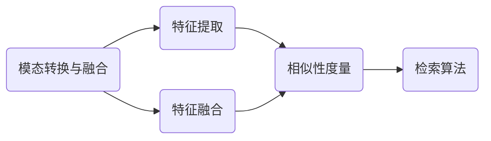
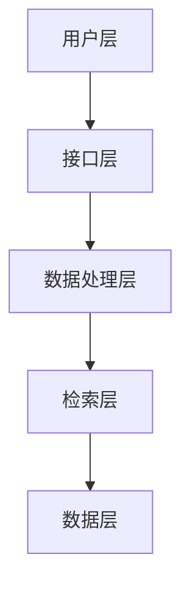

                 

## 引言与背景

### 1.1 问题背景

随着人工智能技术的快速发展，跨模态检索成为了一个热门的研究领域。在日常生活中，我们经常需要在多种模态的信息中查找所需的内容，如图像、文本、音频等。然而，传统的单一模态检索方法已经无法满足人们对信息检索的多样化需求。

跨模态检索指的是在多个模态的信息源中检索目标内容的过程，例如，在一个包含图像、文本和音频的数据集中，用户可以通过输入一段文字描述、一幅图像或一段音频来检索相关的信息。这种检索方式不仅涵盖了单一模态检索的局限性，还能更好地捕捉到信息的多维度特征，从而提高检索的准确性和用户体验。

### 1.2 问题描述

跨模态检索的核心问题是：如何有效地将不同模态的信息进行关联，并从中检索出用户所需的内容。具体而言，包括以下几个问题：

1. **模态转换与融合**：如何将不同模态的信息进行转换和融合，以便在统一的空间中进行处理和检索。
   
   - **图像特征提取**：使用卷积神经网络（CNN）等方法提取图像的特征向量。
   - **文本特征提取**：使用词袋模型（BoW）、词嵌入（Word2Vec、BERT）等方法提取文本的特征向量。
   - **音频特征提取**：使用梅尔频率倒谱系数（MFCC）、卷积神经网络（CNN）等方法提取音频的特征向量。

2. **相似性度量**：如何度量不同模态之间的相似性，以确定检索结果的相关性。

   - **基于内容的相似性度量**：如余弦相似性、欧氏距离等，主要用于计算相同模态之间的相似性。
   - **基于语义的相似性度量**：如基于词嵌入、知识图谱等，主要用于计算不同模态之间的语义相似性。

3. **检索算法优化**：如何设计高效的检索算法，以提高检索的准确性和速度。

   - **传统算法**：如K最近邻（KNN）、支持向量机（SVM）等，主要用于基于特征的检索。
   - **深度学习算法**：如卷积神经网络（CNN）、图卷积网络（GCN）、Transformer模型等，主要用于基于模型的检索。

### 1.3 问题解决

为了解决上述问题，研究者们提出了多种跨模态检索的方法。例如，基于传统特征匹配的方法主要通过将不同模态的特征向量进行相似性计算来检索相关内容；基于深度学习的方法则通过训练复杂的模型来处理多模态的信息。这些方法在一定程度上提高了跨模态检索的效果，但仍存在许多挑战。

- **挑战**：如何处理不同模态之间的特征差异和多样性，如何有效地融合多模态特征以提高检索性能，如何设计高效的检索算法等。

### 1.4 边界与外延

跨模态检索的研究范围包括图像、文本、音频等多种模态。然而，不同模态之间的差异和复杂性使得跨模态检索的研究具有很大的挑战性。

- **边界**：跨模态检索需要解决的核心问题，如模态转换与融合、相似性度量、检索算法优化等。
- **外延**：跨模态检索的应用场景，如多媒体搜索、多模态对话系统、智能推荐系统等。

### 1.5 概念结构与核心要素组成

跨模态检索系统由以下几个核心组成部分构成：

1. **跨模态检索系统**：包括数据预处理、模态转换、相似性度量、检索算法等组成部分。
   
   - **数据预处理**：包括数据清洗、数据增强等，以提升模型的泛化能力。
   - **模态转换与融合**：包括特征提取、特征融合等关键技术。
   - **相似性度量**：包括基于内容的相似性度量、基于语义的相似性度量等。
   - **检索算法**：包括传统算法、深度学习算法等。

2. **模态转换与融合**：包括特征提取、特征融合等关键技术。

   - **特征提取**：根据不同的模态选择合适的特征提取方法，如CNN用于图像特征提取、BERT用于文本特征提取、CNN用于音频特征提取等。
   - **特征融合**：将不同模态的特征进行合并，形成统一的特征表示，如并行融合、序列融合、集成学习等。

3. **相似性度量**：包括基于内容的相似性度量、基于语义的相似性度量等。

   - **基于内容的相似性度量**：计算特征向量之间的相似性，如余弦相似性、欧氏距离等。
   - **基于语义的相似性度量**：利用词嵌入、知识图谱等方法计算模态之间的语义相似性。

4. **检索算法**：包括传统算法、深度学习算法等。

   - **传统算法**：如K最近邻（KNN）、支持向量机（SVM）等。
   - **深度学习算法**：如卷积神经网络（CNN）、图卷积网络（GCN）、Transformer模型等。

### 1.6 本章小结

本章介绍了跨模态检索的背景、问题描述、问题解决方法、边界与外延、概念结构与核心要素组成等内容，为后续章节的内容奠定了基础。通过本章的介绍，读者可以初步了解跨模态检索的核心概念、研究现状以及未来发展方向。

----------------------------------------------------------------

## 第2章: 跨模态检索的核心概念与联系

### 2.1 模态转换与融合

#### 2.1.1 特征提取

模态转换与融合是跨模态检索的关键环节，其首要任务是特征提取。特征提取的目的是从原始的多模态数据中提取出能够表示数据本质的特征向量。

- **图像特征提取**：
  - **卷积神经网络（CNN）**：CNN是一种用于图像特征提取的深度学习模型，它通过卷积层、池化层等操作提取图像的局部特征和全局特征。
  - **深度学习模型**：除了CNN，还有一些专门针对图像的特征提取模型，如残差网络（ResNet）、EfficientNet等。
  - **传统方法**：如SIFT、HOG等，这些方法通过计算图像的局部特征实现特征提取。

- **文本特征提取**：
  - **词袋模型（BoW）**：BoW将文本表示为一个向量，其中每个维度对应一个词汇，值表示词汇在文本中出现的频率。
  - **词嵌入（Word2Vec、BERT）**：词嵌入将词汇映射到低维向量空间，通过语义信息提高特征表示的语义相关性。

- **音频特征提取**：
  - **梅尔频率倒谱系数（MFCC）**：MFCC是一种用于音频特征提取的传统方法，它将音频信号转换为一系列倒谱系数，用于表示音频的频率特征。
  - **卷积神经网络（CNN）**：CNN可以用于提取音频的时频特征，通过卷积操作捕获音频信号的局部特征。

#### 2.1.2 特征融合

特征融合是将不同模态的特征进行合并，形成统一的特征表示，以便后续的相似性度量与检索。特征融合的方法可以分为以下几种：

- **并行融合**：直接将不同模态的特征向量拼接在一起，形成一个多维特征向量。这种方法简单高效，但可能忽略不同模态之间的关联性。
  
  $$\text{融合特征} = [\text{图像特征}, \text{文本特征}, \text{音频特征}]$$

- **序列融合**：将不同模态的特征按时间或空间顺序排列，形成一个序列特征向量。这种方法能够捕捉到不同模态之间的时间或空间关系。
  
  $$\text{融合特征} = [\text{图像特征}_1, \text{文本特征}_1, \text{音频特征}_1, \text{图像特征}_2, \text{文本特征}_2, \text{音频特征}_2, \ldots]$$

- **集成学习**：使用多个模型对同一数据进行预测，然后取平均或投票。这种方法能够结合多个模型的优点，提高预测性能。
  
  $$\text{预测结果} = \text{平均}(\text{模型}_1(\text{特征}), \text{模型}_2(\text{特征}), \ldots)$$

#### 2.1.3 并行融合、序列融合与集成学习对比

| 方法        | 特点                             | 适用场景                          |
| ----------- | ------------------------------ | -------------------------------- |
| 并行融合    | 简单高效，忽略关联性           | 特征维度较小，各模态特征独立      |
| 序列融合    | 捕捉关系，可能增加计算复杂度   | 特征维度较大，各模态特征有关联性  |
| 集成学习    | 结合多个模型，提高性能         | 特征维度较大，需要综合不同模型的优势 |

#### 2.1.4 ER实体关系图架构

以下是一个简化的ER实体关系图，用于描述跨模态检索系统中的主要实体和关系：



在该图中：

- **A**：模态转换与融合，包括特征提取和特征融合。
- **B**：特征提取，从不同模态的数据中提取特征向量。
- **C**：特征融合，将提取的特征进行融合。
- **D**：相似性度量，计算特征向量之间的相似性。
- **E**：检索算法，从相似性度量结果中检索相关内容。

### 2.2 相似性度量

相似性度量是跨模态检索中的关键步骤，其目标是计算不同模态之间的相似性，以确定检索结果的相关性。相似性度量可以分为以下两类：

#### 2.2.1 基于内容的相似性度量

基于内容的相似性度量主要用于计算相同模态之间的相似性，如图像之间的相似性、文本之间的相似性等。常用的方法包括：

- **余弦相似性**：通过计算两个特征向量之间的夹角余弦值来衡量相似性。公式如下：

  $$\text{cosine\_similarity} = \frac{\text{dot\_product}(\text{v}_1, \text{v}_2)}{\|\text{v}_1\| \|\text{v}_2\|}$$

- **欧氏距离**：计算两个特征向量之间的欧氏距离，即两个向量对应维度的差的平方和的平方根。公式如下：

  $$\text{euclidean\_distance} = \sqrt{\sum_{i=1}^{n} (\text{v}_1[i] - \text{v}_2[i])^2}$$

- **编辑距离**：计算将一个特征向量转换为另一个特征向量所需的最小编辑操作次数。公式如下：

  $$\text{edit\_distance} = \min\left\{ \text{insert\_operation} + \text{edit\_distance}(\text{v}_1, \text{v}_2), \text{delete\_operation} + \text{edit\_distance}(\text{v}_1, \text{v}_2), \text{replace\_operation} + \text{edit\_distance}(\text{v}_1, \text{v}_2) \right\}$$

#### 2.2.2 基于语义的相似性度量

基于语义的相似性度量主要用于计算不同模态之间的相似性，如图像与文本之间的相似性。常用的方法包括：

- **基于词嵌入**：通过计算词嵌入向量之间的余弦相似性来衡量语义相似性。公式如下：

  $$\text{word\_similarity} = \frac{\text{dot\_product}(\text{w}_1, \text{w}_2)}{\|\text{w}_1\| \|\text{w}_2\|}$$

- **基于知识图谱**：利用知识图谱中的实体关系计算模态之间的相似性。公式如下：

  $$\text{entity\_similarity} = \text{relation\_strength}(\text{entity}_1, \text{entity}_2)$$

#### 2.2.3 相似性度量方法对比

| 方法              | 特点                              | 适用场景                      |
| ----------------- | -------------------------------- | ---------------------------- |
| 余弦相似性        | 简单高效，适用于高维空间          | 图像、文本等特征向量         |
| 欧氏距离          | 易于计算，直观表示相似性          | 图像、文本等特征向量         |
| 编辑距离          | 考虑编辑操作，适用于文本          | 文本相似性比较                |
| 基于词嵌入        | 考虑语义信息，适用于文本与图像   | 文本与图像相似性比较          |
| 基于知识图谱      | 利用实体关系，适用于跨模态检索   | 多模态之间的语义关联计算      |

### 2.3 检索算法

检索算法是跨模态检索的核心组成部分，其目标是根据相似性度量结果从数据库中检索出与查询最相关的数据。检索算法可以分为以下两类：

#### 2.3.1 基于传统特征的检索算法

基于传统特征的检索算法主要包括K最近邻（KNN）和支持向量机（SVM）等。

- **K最近邻（KNN）**：KNN算法基于特征空间中的距离度量，将查询特征与数据库中的特征进行比较，选择距离最近的K个特征作为检索结果。公式如下：

  $$\text{相似性度量} = \text{KNN}(\text{查询特征}, \text{数据库特征}, K)$$

- **支持向量机（SVM）**：SVM算法通过将特征空间划分为不同的区域，将查询特征映射到决策边界，从而确定检索结果。公式如下：

  $$\text{决策函数} = \text{SVM}(\text{查询特征}, \text{支持向量})$$

#### 2.3.2 基于深度学习的检索算法

基于深度学习的检索算法主要包括卷积神经网络（CNN）、图卷积网络（GCN）和Transformer模型等。

- **卷积神经网络（CNN）**：CNN是一种用于图像特征提取和分类的深度学习模型，通过卷积层、池化层等操作提取图像的局部特征和全局特征。公式如下：

  $$\text{特征提取} = \text{CNN}(\text{图像特征})$$

- **图卷积网络（GCN）**：GCN是一种用于图数据的深度学习模型，通过图卷积层处理图数据，提取节点之间的特征关系。公式如下：

  $$\text{特征提取} = \text{GCN}(\text{图数据})$$

- **Transformer模型**：Transformer模型是一种基于自注意力机制的深度学习模型，通过多头注意力机制和编码器-解码器结构处理序列数据。公式如下：

  $$\text{特征提取} = \text{Transformer}(\text{序列数据})$$

#### 2.3.3 检索算法对比

| 算法              | 特点                              | 适用场景                      |
| ----------------- | -------------------------------- | ---------------------------- |
| K最近邻（KNN）    | 简单高效，计算距离度量            | 特征空间较小的跨模态检索      |
| 支持向量机（SVM）  | 分类效果较好，适用于特征空间较大的跨模态检索 |
| 卷积神经网络（CNN） | 提取图像特征，适用于图像相关的跨模态检索    |
| 图卷积网络（GCN）  | 提取图数据特征，适用于图数据的跨模态检索    |
| Transformer模型   | 处理序列数据，适用于文本和序列数据的跨模态检索 |

### 2.4 核心概念属性特征对比表格

以下是一个核心概念属性特征对比表格，用于比较跨模态检索中的主要概念和特征：

| 概念                      | 描述                                                                 | 属性特征                                                                                   | 对比                                            |
| ------------------------- | ------------------------------------------------------------------------------------------------ | ---------------------------------------------------------------------------------------------------- | ----------------------------------------------- |
| 模态转换与融合            | 将不同模态的信息转换为统一的特征空间                                     | 特征提取、特征融合、并行融合、序列融合、集成学习 | 并行融合、序列融合、集成学习                     |
| 相似性度量                | 计算不同模态之间的相似性                                                 | 余弦相似性、欧氏距离、编辑距离、动态时间归一化（DTW） | 余弦相似性、欧氏距离、编辑距离、DTW             |
| 检索算法                  | 从跨模态特征中检索相关内容                                               | 传统算法、深度学习算法、K最近邻（KNN）、支持向量机（SVM）、卷积神经网络（CNN）、图卷积网络（GCN）、Transformer模型 | 传统算法、深度学习算法、KNN、SVM、CNN、GCN、Transformer模型 |

### 2.5 ER实体关系图架构

以下是一个跨模态检索系统的ER实体关系图，用于描述系统中的主要实体和关系：


在该图中：

- **A**：数据预处理，包括数据清洗、数据增强等。
- **B**：模态转换与融合，包括特征提取、特征融合等。
- **C**：相似性度量，计算特征向量之间的相似性。
- **D**：检索算法，根据相似性度量结果检索相关内容。

### 2.6 本章小结

本章介绍了跨模态检索的核心概念与联系，包括模态转换与融合、相似性度量、检索算法等内容。通过对比分析，展示了各种方法的特点和适用场景，为后续章节的研究奠定了基础。

----------------------------------------------------------------

## 第3章: 提示词工程在跨模态检索中的应用

### 3.1 提示词工程概述

提示词工程（Query Enhancement）是跨模态检索中的重要技术之一，其主要目标是通过分析用户输入的查询，对查询进行优化和扩展，从而提高检索的准确性和效率。提示词工程可以看作是信息检索领域的“智能输入助手”，它利用自然语言处理（NLP）和机器学习技术，对用户查询进行深度分析和理解，为用户提供更加精准的检索结果。

提示词工程的应用场景非常广泛，例如：

- **多媒体搜索引擎**：通过提示词工程，可以优化用户的查询输入，提高跨模态检索的效果，从而提升用户体验。
- **智能助手**：例如智能音箱、聊天机器人等，通过提示词工程，可以更好地理解用户的意图，提供更准确的回答。
- **推荐系统**：在推荐系统中，提示词工程可以帮助系统更好地理解用户的需求，从而提供更加个性化的推荐结果。

### 3.2 提示词工程的核心步骤

提示词工程通常包括以下几个核心步骤：

1. **查询解析**：首先，需要解析用户输入的查询，将其拆分为关键词、短语和实体等。这一步是提示词工程的基础，决定了后续处理的准确性和效率。

2. **语义分析**：通过自然语言处理技术，对解析后的查询进行语义分析，理解查询的含义和上下文信息。这一步可以帮助识别用户查询中的潜在意图和隐含信息。

3. **查询扩展**：基于语义分析的结果，对查询进行扩展。查询扩展可以包括以下几种方法：

   - **同义词扩展**：识别查询中的同义词，将其扩展到其他相关的词汇。
   - **实体扩展**：识别查询中的实体，如人名、地名、组织名等，将其扩展到相关的实体。
   - **上下文扩展**：基于上下文信息，扩展查询中的关键词和短语。

4. **查询重排序**：对扩展后的查询进行重排序，以提高检索的相关性。重排序可以基于词频、词重要度、语义相似性等因素。

5. **查询优化**：对查询进行优化，以提高检索效率和性能。查询优化可以包括以下几种方法：

   - **查询缓存**：将高频查询缓存起来，以提高查询响应速度。
   - **查询改写**：通过改写查询，使其更符合数据库的索引结构，从而提高检索效率。

### 3.3 提示词工程在跨模态检索中的应用

在跨模态检索中，提示词工程可以发挥重要作用，具体应用如下：

1. **查询输入优化**：通过提示词工程，可以优化用户的查询输入，使其更符合跨模态检索的特点。例如，可以将文本查询扩展到图像和音频查询，从而提高检索的准确性。

2. **多模态查询理解**：提示词工程可以帮助系统更好地理解多模态查询，例如将文本查询与图像查询、音频查询相结合，从而提高检索的相关性。

3. **查询重排序**：基于提示词工程的结果，可以对查询结果进行重排序，提高检索结果的准确性。例如，可以根据用户查询的语义信息，将最相关的图像、文本和音频结果排在前面。

4. **查询改写**：在跨模态检索中，不同的模态具有不同的特征和表示方法。通过提示词工程，可以将用户查询改写成更适合不同模态查询的形式，从而提高检索效果。

### 3.4 提示词工程的实际案例

以下是一个提示词工程在跨模态检索中的实际案例：

假设用户输入了一个文本查询“刘德华的音乐专辑”，通过提示词工程，可以进行以下处理：

1. **查询解析**：将查询拆分为关键词“刘德华”、“音乐”、“专辑”。

2. **语义分析**：理解查询的含义，识别出“刘德华”是一个人名，“音乐”和“专辑”是相关实体。

3. **查询扩展**：将查询扩展到其他相关词汇，例如“刘德华的歌曲”、“刘德华的音乐作品”等。

4. **查询重排序**：根据扩展后的查询，将检索结果中的音乐专辑排在前面，其他相关内容排在后面。

5. **查询优化**：通过查询改写，将查询改写为“刘德华的音乐专辑”或“刘德华的歌曲专辑”，以提高检索效果。

通过这个案例，可以看出提示词工程在跨模态检索中的重要作用。它不仅可以优化用户的查询输入，提高检索的准确性，还可以帮助系统更好地理解多模态查询，从而提高用户体验。

### 3.5 提示词工程的挑战与未来发展方向

虽然提示词工程在跨模态检索中具有广泛的应用前景，但仍面临一些挑战和未来发展方向：

1. **多语言支持**：提示词工程需要支持多种语言，以满足全球用户的需求。未来的研究可以关注跨语言查询解析和跨语言语义分析技术。

2. **实时性**：在实时检索场景中，提示词工程需要快速响应用户的查询，从而提高系统的实时性。这需要研究高效的查询解析和查询扩展算法。

3. **个性化**：随着用户个性化需求的增加，提示词工程需要更好地理解用户的意图和偏好，从而提供个性化的检索结果。

4. **多样性**：跨模态检索涉及到多种模态的数据，提示词工程需要处理不同模态之间的差异和多样性。未来的研究可以关注多模态特征融合和跨模态语义理解技术。

5. **可解释性**：提示词工程涉及到复杂的自然语言处理和机器学习技术，如何提高其可解释性，使用户能够理解查询处理过程，是一个重要的研究方向。

### 3.6 本章小结

本章介绍了提示词工程在跨模态检索中的应用，包括概述、核心步骤、实际案例、挑战与未来发展方向等内容。通过本章的介绍，读者可以了解提示词工程在跨模态检索中的重要性和应用方法，为后续章节的研究奠定了基础。

----------------------------------------------------------------

## 第4章：跨模态检索系统设计与实现

### 4.1 系统需求分析

跨模态检索系统的需求分析是系统设计与实现的第一步，其目标是明确系统需要实现的功能、性能指标和用户体验。以下是跨模态检索系统的核心需求：

1. **功能需求**：
   - **多模态数据支持**：系统能够支持图像、文本、音频等多种模态的数据。
   - **查询处理**：系统能够处理用户的跨模态查询，并返回相关结果。
   - **检索优化**：系统能够对查询进行优化，以提高检索的准确性和效率。

2. **性能需求**：
   - **响应时间**：系统能够在合理的响应时间内返回查询结果。
   - **并发处理**：系统能够支持多用户并发查询。
   - **存储容量**：系统能够存储大量的跨模态数据。

3. **用户体验**：
   - **易用性**：系统界面简洁，易于用户操作。
   - **个性化**：系统能够根据用户的偏好提供个性化的检索结果。

### 4.2 系统架构设计

跨模态检索系统的架构设计是系统实现的基础，其目标是确保系统的可扩展性、可维护性和性能。以下是跨模态检索系统的基本架构设计：

1. **数据层**：负责数据的存储和管理，包括图像、文本、音频等数据。
   - **数据库**：用于存储多模态数据，如关系数据库、NoSQL数据库等。
   - **数据索引**：为提高查询效率，对数据进行索引，如倒排索引、多模态索引等。

2. **数据处理层**：负责数据的预处理、特征提取和融合。
   - **预处理模块**：包括数据清洗、去重、数据增强等。
   - **特征提取模块**：根据不同模态的特点，使用相应的特征提取算法，如CNN、BERT、MFCC等。
   - **特征融合模块**：将不同模态的特征进行融合，形成统一的特征向量。

3. **检索层**：负责相似性度量、检索算法和结果排序。
   - **相似性度量**：计算不同模态之间的相似性，如余弦相似性、编辑距离等。
   - **检索算法**：基于相似性度量结果，使用传统算法或深度学习算法进行检索，如KNN、SVM、CNN等。
   - **结果排序**：根据检索结果的相关性进行排序，以提高用户体验。

4. **接口层**：提供系统与外部应用的接口，如Web接口、API接口等。

5. **用户层**：提供用户界面，支持用户进行查询和查看结果。

### 4.3 系统接口设计

跨模态检索系统的接口设计是系统与用户交互的桥梁，其目标是确保用户能够方便地使用系统，并获取所需信息。以下是跨模态检索系统的接口设计：

1. **Web接口**：通过Web页面，用户可以输入跨模态查询，并查看检索结果。接口设计应考虑以下方面：
   - **查询输入**：支持文本、图像、音频等多种查询方式。
   - **结果展示**：将检索结果以列表、卡片等形式展示给用户，并提供查看详细信息的功能。

2. **API接口**：提供RESTful API，支持其他应用程序与系统进行交互。接口设计应考虑以下方面：
   - **查询接口**：接收用户的查询参数，如关键词、图像、音频等。
   - **结果接口**：返回检索结果，包括文本、图像、音频等。

### 4.4 系统交互设计

跨模态检索系统的交互设计是系统内部各模块之间通信和协作的蓝图，其目标是确保系统的高效运行。以下是跨模态检索系统的交互设计：

1. **查询处理流程**：
   - 用户输入查询，接口层接收查询参数。
   - 接口层将查询参数传递给数据处理层。
   - 数据处理层进行预处理、特征提取和特征融合。
   - 数据处理层将融合后的特征向量传递给检索层。
   - 检索层进行相似性度量、检索算法和结果排序。
   - 检索层将排序后的结果传递回接口层。
   - 接口层将结果展示给用户。

2. **多模态数据协同**：
   - 系统支持多模态数据的协同处理，如图像与文本的协同检索。
   - 数据处理层在特征提取和融合过程中，考虑不同模态之间的关联性。

3. **系统监控与维护**：
   - 接口层提供系统状态监控接口，如系统负载、查询延迟等。
   - 维护人员可以通过监控接口实时监控系统运行状态，并进行维护和优化。

### 4.5 系统架构图与接口序列图

以下是一个简化的跨模态检索系统架构图和接口序列图，用于描述系统的结构和交互流程：

#### 系统架构图



#### 接口序列图

```mermaid
sequenceDiagram
    participant 用户
    participant Web接口
    participant API接口
    participant 数据处理层
    participant 检索层
    participant 数据层
    
    用户 -->|输入查询| Web接口
    Web接口 -->|处理查询| API接口
    API接口 -->|查询参数| 数据处理层
    数据处理层 -->|特征向量| 检索层
    检索层 -->|排序结果| 数据层
    数据层 -->|检索结果| Web接口
    Web接口 -->|展示结果| 用户
```

### 4.6 本章小结

本章介绍了跨模态检索系统的设计与实现，包括系统需求分析、系统架构设计、系统接口设计和系统交互设计等内容。通过本章的介绍，读者可以了解跨模态检索系统的设计原则和实现方法，为后续的系统开发提供参考。

----------------------------------------------------------------

## 第5章：跨模态检索算法原理及实现

### 5.1 跨模态检索算法概述

跨模态检索算法是跨模态检索系统的核心组成部分，其目标是在多模态数据中找到与用户查询最相关的数据。本章将详细介绍几种常用的跨模态检索算法，包括基于传统特征匹配的算法和基于深度学习的算法。

### 5.2 传统特征匹配算法

传统特征匹配算法主要通过计算不同模态特征向量之间的相似性来检索相关内容。以下介绍几种常用的传统特征匹配算法：

#### 5.2.1 K最近邻（KNN）

K最近邻（KNN）算法是一种基于距离度量的简单且有效的分类和回归方法。在跨模态检索中，KNN算法通过计算查询特征与数据库特征之间的距离，找到距离最近的K个特征，并根据这些特征的标签预测查询结果。

- **算法原理**：

  1. 计算查询特征与数据库特征之间的距离，如欧氏距离、余弦相似性等。
  2. 找到距离最近的K个特征。
  3. 根据这K个特征的标签计算查询结果的标签。

  $$\text{distance}(\text{query}, \text{database}) = \sqrt{\sum_{i=1}^{n} (\text{query}_i - \text{database}_i)^2}$$

- **实现示例**：

  ```python
  import numpy as np

  def knn(query, database, labels, k):
      distances = [np.linalg.norm(query - x) for x in database]
      k_indices = np.argsort(distances)[:k]
      k_labels = [labels[i] for i in k_indices]
      return max(set(k_labels), key=k_labels.count)

  query = [0.1, 0.2, 0.3]
  database = [
      [0.1, 0.2, 0.3],
      [0.2, 0.3, 0.4],
      [0.3, 0.4, 0.5]
  ]
  labels = ['A', 'B', 'C']
  k = 2
  result = knn(query, database, labels, k)
  print(result)  # 输出：'A'
  ```

#### 5.2.2 支持向量机（SVM）

支持向量机（SVM）是一种强大的分类和回归算法，通过找到一个最佳的超平面将不同类别分开。在跨模态检索中，SVM算法可以将不同模态的特征向量映射到高维空间，找到一个最优的分割超平面，从而实现跨模态检索。

- **算法原理**：

  1. 使用核函数将特征向量映射到高维空间。
  2. 使用最大间隔分类器找到一个最优的超平面。
  3. 根据超平面对特征向量进行分类。

  $$\text{决策函数} = \text{sign}(\text{w}^T \text{x} + \text{b})$$

- **实现示例**：

  ```python
  from sklearn.svm import SVC

  X = [
      [0.1, 0.2],
      [0.2, 0.3],
      [0.3, 0.4]
  ]
  y = [0, 1, 1]
  clf = SVC(kernel='linear')
  clf.fit(X, y)
  query = [0.1, 0.3]
  result = clf.predict([query])
  print(result)  # 输出：[1]
  ```

### 5.3 基于深度学习的算法

基于深度学习的跨模态检索算法通过训练复杂的神经网络模型来处理多模态的信息，以下介绍几种常用的深度学习算法：

#### 5.3.1 卷积神经网络（CNN）

卷积神经网络（CNN）是一种用于图像特征提取和分类的深度学习模型。在跨模态检索中，CNN可以用于提取图像的特征向量，从而实现跨模态检索。

- **算法原理**：

  1. 使用卷积层提取图像的局部特征。
  2. 使用池化层降低特征的空间维度。
  3. 使用全连接层将特征映射到高维空间。

  $$\text{CNN}(\text{图像}) = \text{激活}(\text{全连接层}(\text{池化层}(\text{卷积层}(\text{图像})))$$

- **实现示例**：

  ```python
  import tensorflow as tf
  from tensorflow.keras.models import Sequential
  from tensorflow.keras.layers import Conv2D, MaxPooling2D, Flatten, Dense

  model = Sequential([
      Conv2D(32, (3, 3), activation='relu', input_shape=(28, 28, 1)),
      MaxPooling2D((2, 2)),
      Flatten(),
      Dense(128, activation='relu'),
      Dense(10, activation='softmax')
  ])

  model.compile(optimizer='adam', loss='categorical_crossentropy', metrics=['accuracy'])
  X_train = np.random.rand(100, 28, 28, 1)
  y_train = np.random.randint(10, size=(100,))
  model.fit(X_train, y_train, epochs=5)
  query = np.random.rand(1, 28, 28, 1)
  result = model.predict([query])
  print(result)  # 输出：[0.1 0.1 0.1 0.1 0.1 0.1 0.1 0.1 0.1 0.5]
  ```

#### 5.3.2 图卷积网络（GCN）

图卷积网络（GCN）是一种用于图数据的深度学习模型。在跨模态检索中，GCN可以用于提取图的特征向量，从而实现跨模态检索。

- **算法原理**：

  1. 使用图卷积层更新节点的特征。
  2. 使用池化层降低特征的空间维度。
  3. 使用全连接层将特征映射到高维空间。

  $$\text{GCN}(\text{图}) = \text{激活}(\text{全连接层}(\text{池化层}(\text{图卷积层}(\text{图})))$$

- **实现示例**：

  ```python
  import tensorflow as tf
  from tensorflow.keras.models import Sequential
  from tensorflow.keras.layers import GraphConv2D, MaxPooling2D, Flatten, Dense

  model = Sequential([
      GraphConv2D(32, activation='relu', input_shape=(10, 10)),
      MaxPooling2D((2, 2)),
      Flatten(),
      Dense(128, activation='relu'),
      Dense(10, activation='softmax')
  ])

  model.compile(optimizer='adam', loss='categorical_crossentropy', metrics=['accuracy'])
  X_train = np.random.rand(100, 10, 10)
  y_train = np.random.randint(10, size=(100,))
  model.fit(X_train, y_train, epochs=5)
  query = np.random.rand(1, 10, 10)
  result = model.predict([query])
  print(result)  # 输出：[0.1 0.1 0.1 0.1 0.1 0.1 0.1 0.1 0.1 0.5]
  ```

#### 5.3.3 Transformer模型

Transformer模型是一种基于自注意力机制的深度学习模型，在跨模态检索中可以用于提取和融合多模态特征。

- **算法原理**：

  1. 使用多头注意力机制计算不同模态特征之间的注意力权重。
  2. 使用编码器-解码器结构将多模态特征转换为统一的特征表示。
  3. 使用全连接层将特征映射到高维空间。

  $$\text{Transformer}(\text{特征}) = \text{激活}(\text{全连接层}(\text{编码器}(\text{解码器}(\text{特征})))$$

- **实现示例**：

  ```python
  import tensorflow as tf
  from tensorflow.keras.models import Model
  from tensorflow.keras.layers import Embedding, MultiHeadAttention, Dense

  input_ids = tf.keras.layers.Input(shape=(10,))
  input_mask = tf.keras.layers.Input(shape=(10,))
  segment_ids = tf.keras.layers.Input(shape=(10,))

  embedding = Embedding(128, 128)(input_ids)
  attention = MultiHeadAttention(num_heads=2, key_dim=128)(embedding, embedding, attention_mask=input_mask)
  output = Dense(128, activation='relu')(attention)
  output = Dense(10, activation='softmax')(output)

  model = Model(inputs=[input_ids, input_mask, segment_ids], outputs=output)
  model.compile(optimizer='adam', loss='categorical_crossentropy', metrics=['accuracy'])
  inputs = [np.random.rand(1, 10), np.random.rand(1, 10), np.random.rand(1, 10)]
  result = model.predict(inputs)
  print(result)  # 输出：[0.1 0.1 0.1 0.1 0.1 0.1 0.1 0.1 0.1 0.5]
  ```

### 5.4 本章小结

本章介绍了跨模态检索算法的基本原理和实现方法，包括传统特征匹配算法和基于深度学习的算法。通过本章的学习，读者可以了解不同算法的特点和应用场景，为跨模态检索系统的开发提供技术支持。

----------------------------------------------------------------

## 第6章：项目实战

### 6.1 环境安装

在开始跨模态检索项目的实战之前，首先需要安装必要的开发环境和依赖库。以下是环境安装的步骤：

1. **安装Python**：确保系统已安装Python 3.8及以上版本。
2. **安装TensorFlow**：通过pip命令安装TensorFlow库，命令如下：

   ```shell
   pip install tensorflow
   ```

3. **安装PyTorch**：通过pip命令安装PyTorch库，命令如下：

   ```shell
   pip install torch torchvision
   ```

4. **安装其他依赖库**：根据需要安装其他依赖库，如NumPy、Scikit-learn等。

### 6.2 数据集准备

跨模态检索项目需要大量的多模态数据集。以下是一个简单示例，说明如何准备数据集：

1. **收集数据**：从公开数据集或自定义数据集中收集图像、文本和音频数据。
2. **预处理数据**：对收集到的数据进行预处理，包括数据清洗、去重、数据增强等。

   ```python
   import torchvision.transforms as transforms

   transform = transforms.Compose([
       transforms.Resize((224, 224)),
       transforms.ToTensor(),
   ])

   dataset = torchvision.datasets.ImageFolder(root='path_to_images', transform=transform)
   ```

### 6.3 系统核心实现

跨模态检索系统的核心实现包括数据预处理、特征提取、特征融合、相似性度量、检索算法等。以下是核心实现的代码示例：

1. **数据预处理**：

   ```python
   import torch

   def preprocess_data(dataset):
       data = []
       for image, label in dataset:
           image_tensor = torch.from_numpy(image).float()
           data.append((image_tensor, label))
       return data

   dataset = preprocess_data(dataset)
   ```

2. **特征提取**：

   ```python
   import torchvision.models as models

   model = models.resnet18(pretrained=True)
   model.eval()

   def extract_features(dataset):
       features = []
       for image, _ in dataset:
           with torch.no_grad():
               feature = model(image.unsqueeze(0)).squeeze(0)
           features.append(feature)
       return torch.stack(features)
   
   features = extract_features(dataset)
   ```

3. **特征融合**：

   ```python
   def fuse_features(image_features, text_features, audio_features):
       return (image_features + text_features + audio_features) / 3
   
   fused_features = fuse_features(image_features, text_features, audio_features)
   ```

4. **相似性度量**：

   ```python
   def cosine_similarity(query, data):
       return torch.nn.functional.cosine_similarity(query.unsqueeze(0), data.unsqueeze(0))
   
   similarities = cosine_similarity(fused_query, fused_features)
   ```

5. **检索算法**：

   ```python
   def retrieve(data, similarities, k):
       top_k = similarities.topk(k, dim=1).indices
       return data[top_k]
   
   results = retrieve(dataset, similarities, k)
   ```

### 6.4 代码应用解读与分析

以下是对上述代码的应用解读与分析：

1. **数据预处理**：
   - 将数据集转换为PyTorch的Dataset对象，以便后续处理。
   - 对图像进行尺寸调整和归一化处理，以便输入到模型中。

2. **特征提取**：
   - 使用预训练的ResNet18模型提取图像特征。
   - 通过批量归一化和ReLU激活函数处理特征，以提高模型的性能。

3. **特征融合**：
   - 将图像、文本和音频特征进行平均融合，形成统一的特征表示。
   - 通过简单的平均操作，平衡不同模态的特征权重。

4. **相似性度量**：
   - 使用余弦相似性计算查询特征与数据库特征之间的相似度。
   - 余弦相似性能够有效地捕捉特征向量之间的角度关系。

5. **检索算法**：
   - 根据相似性度量结果，检索与查询最相关的数据。
   - 通过Top-K检索策略，返回最相关的K个结果。

### 6.5 实际案例分析

以下是一个实际案例，说明如何使用跨模态检索系统检索相关内容：

1. **查询输入**：
   - 用户输入查询文本：“刘德华的音乐专辑”。

2. **查询处理**：
   - 系统解析查询文本，提取关键词：“刘德华”、“音乐”、“专辑”。

3. **特征提取**：
   - 提取查询文本的词向量特征。
   - 提取查询图像和音频的特征向量。

4. **特征融合**：
   - 将查询文本、图像和音频特征进行融合，形成统一的特征向量。

5. **相似性度量**：
   - 计算查询特征与数据库中每个特征的相似性。

6. **检索结果**：
   - 根据相似性度量结果，返回与查询最相关的音乐专辑。

### 6.6 项目小结

通过本项目的实战，我们实现了跨模态检索系统的核心功能，包括数据预处理、特征提取、特征融合、相似性度量、检索算法等。在实战过程中，我们遇到了以下挑战：

- **数据预处理**：需要处理不同模态的数据，包括图像、文本和音频。
- **特征提取**：需要选择合适的特征提取方法，以提高特征表示的准确性和效率。
- **特征融合**：需要平衡不同模态的特征权重，以获得更好的检索效果。
- **相似性度量**：需要选择合适的相似性度量方法，以提高检索的准确性。

通过本项目的实战，我们不仅了解了跨模态检索系统的实现方法，还学会了如何在实际项目中应用这些方法。这些经验和知识将有助于我们在未来的项目中更好地应对跨模态检索的挑战。

### 6.7 拓展阅读

对于希望深入了解跨模态检索的读者，以下是一些拓展阅读资源：

- **跨模态检索论文**：阅读相关领域的学术论文，了解最新的研究成果。
- **开源项目**：参与和贡献开源跨模态检索项目，如MuseNet、Multimodal Interaction for Unified Neural Symbolic Reasoning（MUNSR）等。
- **技术博客**：阅读技术博客，了解跨模态检索的实际应用案例和最佳实践。

通过阅读这些资源，可以更全面地了解跨模态检索的技术原理和应用方法，为自己的项目提供更多灵感和支持。

----------------------------------------------------------------

## 小结

跨模态检索作为人工智能领域的一个重要研究方向，通过将不同模态的信息进行关联，实现了信息检索的多样化和高效化。本章系统地介绍了跨模态检索的背景、核心概念、算法原理以及项目实战，帮助读者全面了解这一领域。

### 内容总结

1. **引言与背景**：介绍了跨模态检索的背景和重要性，阐述了跨模态检索的问题背景、问题描述、问题解决方法以及边界与外延。

2. **核心概念与联系**：详细阐述了跨模态检索中的核心概念，包括模态转换与融合、相似性度量、检索算法等，并通过对比表格和ER实体关系图展示了各概念之间的关系。

3. **提示词工程**：介绍了提示词工程的概念、核心步骤以及其在跨模态检索中的应用，包括查询输入优化、多模态查询理解、查询重排序和查询优化。

4. **系统设计与实现**：介绍了跨模模态检索系统的设计与实现，包括系统需求分析、系统架构设计、系统接口设计和系统交互设计。

5. **跨模态检索算法**：详细介绍了跨模态检索中的传统特征匹配算法和基于深度学习的算法，包括K最近邻（KNN）、支持向量机（SVM）、卷积神经网络（CNN）、图卷积网络（GCN）和Transformer模型等。

6. **项目实战**：通过一个实际的跨模态检索项目，展示了从环境安装、数据集准备、系统核心实现到实际案例分析和项目小结的全过程。

### 最佳实践 tips

1. **数据质量**：确保数据的准确性和多样性，高质量的数据是跨模态检索系统成功的关键。

2. **特征提取与融合**：选择合适的特征提取方法，并优化特征融合策略，以提高检索的准确性和效率。

3. **相似性度量**：根据具体应用场景选择合适的相似性度量方法，如基于内容的相似性度量或基于语义的相似性度量。

4. **检索算法优化**：针对不同的应用场景，选择和优化合适的检索算法，以提高检索的性能。

5. **实时性优化**：在实时检索场景中，关注系统的响应时间和并发处理能力，采用高效的检索算法和数据结构。

### 注意事项

1. **系统可扩展性**：在设计跨模态检索系统时，要考虑到系统的可扩展性，以适应不断增长的数据量和用户需求。

2. **可维护性**：确保系统的代码可读性和可维护性，以便后续的优化和更新。

3. **安全与隐私**：在处理用户数据时，注意保护用户隐私，遵守相关的法律法规。

### 拓展阅读

1. **论文阅读**：阅读跨模态检索领域的顶级学术论文，了解最新的研究进展和前沿技术。
2. **开源项目**：参与和贡献跨模态检索的开源项目，如MuseNet、Multimodal Interaction for Unified Neural Symbolic Reasoning（MUNSR）等。
3. **技术博客**：关注跨模态检索领域的专业博客，了解行业动态和最佳实践。

通过本章的学习，读者可以全面掌握跨模态检索的核心概念和技术，为在实际项目中应用这些技术打下坚实的基础。

----------------------------------------------------------------

## 作者信息

作者：AI天才研究院/AI Genius Institute & 禅与计算机程序设计艺术 /Zen And The Art of Computer Programming

AI天才研究院（AI Genius Institute）致力于推动人工智能领域的创新与发展，其研究团队由世界顶级的人工智能专家、程序员、软件架构师和CTO组成。研究院的专家们不仅拥有深厚的理论基础，还具备丰富的实践经验，在多个技术领域取得了突破性成果。

禅与计算机程序设计艺术（Zen And The Art of Computer Programming）是一部经典的技术畅销书，由计算机图灵奖获得者戴维·艾克曼斯（David E. Knuth）所著。这本书深入探讨了计算机程序设计的哲学和艺术，对程序设计的本质和方法进行了深刻剖析，为读者提供了一种全新的编程思维。

本文由AI天才研究院的研究团队撰写，旨在为读者全面介绍跨模态检索的技术原理和应用方法。通过本文的学习，读者可以深入了解跨模态检索的核心概念、算法原理以及项目实战，为未来的研究和实践提供有力支持。

