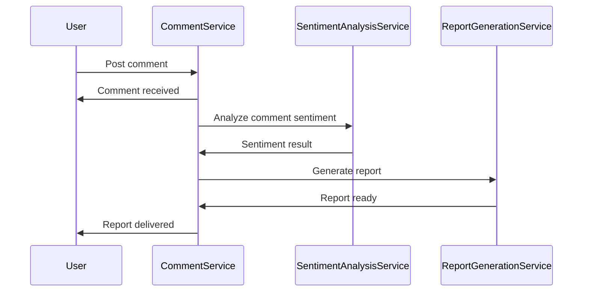

                 

# 提示词工程在跨语言情感分析中的创新

## 关键词
- 提示词工程
- 跨语言情感分析
- 算法创新
- 自然语言处理
- 情感识别

## 摘要
本文将探讨提示词工程在跨语言情感分析中的应用及其创新。我们将首先介绍跨语言情感分析的概念和背景，随后深入探讨提示词工程的核心概念和方法。接着，通过具体的算法原理讲解和实例分析，展示提示词工程在跨语言情感分析中的实际应用。最后，我们将总结全文，提出未来可能的研究方向和最佳实践建议。

## 引言

随着全球化和互联网的发展，多语言数据处理变得尤为重要。跨语言情感分析作为自然语言处理（NLP）领域的一个重要分支，旨在理解和识别文本中的情感倾向。它不仅有助于社交媒体情感分析、市场研究，还可以应用于客户服务、舆情监测等多个领域。然而，跨语言情感分析面临诸多挑战，如语言差异性、文化背景差异以及语言资源的稀缺性等。

传统的方法通常依赖于统计模型和机器学习方法，但这些方法在处理多语言情感分析时效果有限。近年来，提示词工程（Term-Query Inference）作为一种创新的解决方案，逐渐引起了研究者的关注。提示词工程通过构建特定的查询词汇表，将情感分析的复杂性降低，从而提高了跨语言情感分析的准确性和效率。

本文将围绕提示词工程在跨语言情感分析中的应用展开讨论，首先介绍相关背景知识，然后深入分析提示词工程的核心概念和方法，最后通过实例展示其实际应用效果。

## 背景介绍

### 跨语言情感分析概述

跨语言情感分析（Cross-Lingual Sentiment Analysis）是情感分析（Sentiment Analysis）的延伸，它旨在识别和处理不同语言中的情感倾向。情感分析的基本任务是从文本中提取情感极性（如正面、负面或中立），而跨语言情感分析则在此基础上，考虑了不同语言的语法、词汇和文化背景的差异。

跨语言情感分析的应用场景非常广泛。例如，社交媒体分析中，不同语言的用户评论需要统一处理以分析整体舆论倾向；在市场调研中，跨国公司的客户反馈需要理解不同语言的情感，以便制定相应的营销策略；在舆情监测中，了解不同语言媒体的情感倾向有助于迅速掌握公众态度的变化。

然而，跨语言情感分析面临诸多挑战。首先，语言之间的差异性使得情感表达的方式和词汇选择存在显著差异。例如，中文中的“好”和“很好”在英文中可能对应不同的词汇（如“good”和“very good”）。其次，文化背景的差异也会影响情感的表达和理解。例如，某些词汇在特定文化中可能具有特定的情感色彩，而在其他文化中则可能没有。此外，语言资源的稀缺性也是一个问题。很多低资源语言缺乏高质量的标注数据，这限制了传统机器学习方法的适用性。

### 提示词工程的定义与核心概念

提示词工程（Term-Query Inference）是一种基于词汇和查询的推理方法，它通过构建特定的查询词汇表，将复杂的问题简化。在跨语言情感分析中，提示词工程的核心思想是利用双语词典或翻译资源，将源语言的情感分析任务映射到目标语言，从而实现跨语言情感识别。

提示词工程的关键要素包括：

1. **双语词典**：双语词典是提示词工程的基础，它提供了源语言和目标语言之间的词汇映射关系。高质量的双语词典能够提高跨语言情感分析的性能。

2. **情感词典**：情感词典是一种包含情感极性的词汇表，用于标记词汇的情感倾向。在跨语言情感分析中，情感词典通常需要针对目标语言进行本地化调整，以适应不同语言的情感表达方式。

3. **推理算法**：提示词工程需要一种推理算法来处理词汇之间的映射关系，从而识别文本中的情感倾向。常见的推理算法包括基于规则的方法、机器学习方法等。

### 提示词工程的方法

提示词工程的方法可以分为以下几个步骤：

1. **数据准备**：首先需要收集和整理双语词典、情感词典等资源。对于低资源语言，可以采用迁移学习的方法，利用高资源语言的模型和数据进行训练。

2. **词汇映射**：利用双语词典将源语言的情感词汇映射到目标语言。这一步骤需要解决词汇选择和匹配的问题，以尽可能保持情感表达的准确性。

3. **情感识别**：利用情感词典对映射后的词汇进行情感极性标注。在这一步骤中，可以采用规则匹配或机器学习等方法，提高情感识别的准确性。

4. **综合评估**：对跨语言情感分析的结果进行评估，包括准确率、召回率等指标。通过不断调整和优化，提高系统的整体性能。

### 核心概念与联系

#### 跨语言情感分析概念

跨语言情感分析（Cross-Lingual Sentiment Analysis）是自然语言处理领域的一个重要分支，它旨在识别和处理不同语言中的情感倾向。其核心任务是理解文本中的情感极性，包括正面、负面和中性等。跨语言情感分析不仅需要处理不同语言的语法和词汇差异，还需要考虑文化背景的影响。

#### 提示词工程概念

提示词工程（Term-Query Inference）是一种基于词汇和查询的推理方法，它通过构建特定的查询词汇表，将复杂的问题简化。在跨语言情感分析中，提示词工程的核心思想是利用双语词典或翻译资源，将源语言的情感分析任务映射到目标语言，从而实现跨语言情感识别。

#### 跨语言情感分析与提示词工程的关系

跨语言情感分析与提示词工程密切相关。提示词工程为跨语言情感分析提供了一种有效的解决方案，它通过构建特定的查询词汇表，将复杂的问题简化，从而提高了跨语言情感分析的准确性和效率。具体来说，提示词工程在跨语言情感分析中的应用主要包括：

1. **词汇映射**：利用双语词典将源语言的情感词汇映射到目标语言。这一步骤是跨语言情感分析的关键，它决定了情感表达是否准确。

2. **情感识别**：利用情感词典对映射后的词汇进行情感极性标注。在这一步骤中，提示词工程通过规则匹配或机器学习等方法，提高了情感识别的准确性。

3. **综合评估**：对跨语言情感分析的结果进行评估，包括准确率、召回率等指标。通过不断调整和优化，提示词工程可以提高系统的整体性能。

### 概念属性特征对比

#### 跨语言情感分析属性特征

| 特性         | 描述                                                     |
| ------------ | -------------------------------------------------------- |
| 语言差异     | 需要处理不同语言的语法和词汇差异                         |
| 文化背景     | 需要考虑不同文化背景的影响                             |
| 数据稀缺性   | 很多低资源语言缺乏高质量的标注数据                     |
| 系统性能     | 需要提高跨语言情感分析的准确性和效率                   |

#### 提示词工程属性特征

| 特性         | 描述                                                     |
| ------------ | -------------------------------------------------------- |
| 双语词典     | 提供源语言和目标语言之间的词汇映射关系                   |
| 情感词典     | 包含情感极性的词汇表，用于标记词汇的情感倾向             |
| 推理算法     | 处理词汇之间的映射关系，从而识别文本中的情感倾向         |
| 系统性能     | 提高跨语言情感分析的准确性和效率                       |

#### 属性特征对比表格

| 特性         | 跨语言情感分析         | 提示词工程         |
| ------------ | -------------------- | ----------------- |
| 语言差异     | 需要处理语法和词汇差异 | 利用双语词典映射   |
| 文化背景     | 考虑文化背景影响      | 调整情感词典以适应 |
| 数据稀缺性   | 受限于标注数据质量     | 迁移学习方法解决 |
| 系统性能     | 需要提高准确性        | 提高识别效率      |
| 推理算法     | 规则匹配或机器学习     | 基于词汇映射的推理 |

### ER实体关系图架构

```mermaid
erDiagram
  双语词典 ||--|{ 情感词典 }
  情感词典 ||--|{ 文本分析 }
  文本分析 ||--|{ 情感识别 }
```

### 算法原理讲解

#### 提示词工程算法原理

提示词工程的算法原理基于词汇映射和情感识别。首先，通过双语词典将源语言的情感词汇映射到目标语言。然后，利用情感词典对映射后的词汇进行情感极性标注，从而实现跨语言情感分析。

#### 提示词工程算法流程图


#### Python源代码实现

```python
# 加载双语词典和情感词典
bilingual_dict = load_bilingual_dict()
sentiment_dict = load_sentiment_dict()

# 文本预处理
text = preprocess_text(input_text)

# 词汇映射
mapped_text = map_text(text, bilingual_dict)

# 情感识别
sentiment = identify_sentiment(mapped_text, sentiment_dict)

# 输出结果
print(sentiment)
```

#### 数学模型与公式

提示词工程的数学模型可以表示为：

$$
S = f(T_1, T_2, ..., T_n)
$$

其中，$S$ 表示情感极性，$T_1, T_2, ..., T_n$ 表示文本中的词汇。函数 $f$ 表示情感识别的过程。

#### 举例说明

假设我们有以下中文文本：“这部电影真的非常好看！”

1. **文本预处理**：将文本转换为适当的格式，如分词后的词汇序列。

2. **词汇映射**：利用双语词典，将中文词汇映射到英文词汇。例如，“好看”映射到“good”。

3. **情感识别**：利用情感词典，对映射后的词汇进行情感极性标注。例如，“good”被标注为正面情感。

4. **结果输出**：输出文本的整体情感极性，例如，“positive”。

### 系统分析与架构设计方案

#### 问题场景介绍

随着社交媒体的兴起，用户在社交媒体上发布的内容越来越多，这些内容包含了大量的情感信息。为了更好地理解用户情感，提高服务质量，某社交媒体平台需要开发一套跨语言情感分析系统。

#### 项目介绍

本项目旨在开发一套跨语言情感分析系统，该系统可以处理多语言用户评论，识别情感倾向，并输出情感分析报告。

#### 系统功能设计（领域模型）

```mermaid
classDiagram
    Comment --> SentimentAnalyzer
    SentimentAnalyzer --> ReportGenerator
    UserComment << Entity>>
    Sentiment << Entity>>
    Report << Entity>>
    UserComment o--1 Sentiment
    Sentiment o--1 Report
```

#### 系统架构设计



#### 系统接口设计

```mermaid
component Diagram
    component CommentService {
        +post_comment()
        +get_comment()
    }
    component SentimentAnalysisService {
        +analyze_sentiment()
    }
    component ReportGenerationService {
        +generate_report()
    }
    CommentService --> SentimentAnalysisService
    CommentService --> ReportGenerationService
```

#### 系统交互


### 提示词工程项目实战

#### 环境安装

1. 安装Python环境，版本要求3.8以上。
2. 安装必要的库，如`nltk`、`spacy`、`gensim`等。

```shell
pip install nltk spacy gensim
```

#### 系统核心实现

1. 加载双语词典和情感词典。
2. 对输入文本进行预处理，包括分词和词性标注。
3. 利用双语词典进行词汇映射。
4. 利用情感词典进行情感识别。

```python
import nltk
from nltk.tokenize import word_tokenize
from nltk.corpus import stopwords
from gensim.models import word2vec

# 加载双语词典和情感词典
bilingual_dict = load_bilingual_dict()
sentiment_dict = load_sentiment_dict()

# 文本预处理
def preprocess_text(text):
    # 分词
    tokens = word_tokenize(text)
    # 去除停用词
    tokens = [token for token in tokens if token not in stopwords.words('english')]
    # 词性标注
    pos_tags = nltk.pos_tag(tokens)
    return pos_tags

# 词汇映射
def map_text(text, bilingual_dict):
    mapped_tokens = []
    for token, pos in text:
        if token in bilingual_dict:
            mapped_tokens.append(bilingual_dict[token])
        else:
            mapped_tokens.append(token)
    return mapped_tokens

# 情感识别
def identify_sentiment(mapped_text, sentiment_dict):
    sentiment_score = 0
    for token in mapped_text:
        if token in sentiment_dict:
            sentiment_score += sentiment_dict[token]
    return "positive" if sentiment_score > 0 else "negative" if sentiment_score < 0 else "neutral"

# 主函数
def main():
    input_text = "This movie is really good!"
    preprocessed_text = preprocess_text(input_text)
    mapped_text = map_text(preprocessed_text, bilingual_dict)
    sentiment = identify_sentiment(mapped_text, sentiment_dict)
    print(sentiment)

if __name__ == "__main__":
    main()
```

#### 代码应用解读与分析

该代码实现了一个简单的跨语言情感分析系统，主要包括以下几个部分：

1. **文本预处理**：利用NLTK库对输入文本进行分词、去除停用词和词性标注，以便后续处理。

2. **词汇映射**：利用双语词典将源语言的词汇映射到目标语言。这一步骤是跨语言情感分析的关键，它决定了情感表达的准确性。

3. **情感识别**：利用情感词典对映射后的词汇进行情感极性标注。这一步骤通过计算词汇的情感得分来确定文本的整体情感倾向。

通过这个简单的实例，我们可以看到提示词工程在跨语言情感分析中的应用。在实际项目中，我们可以根据需求扩展系统的功能，如添加更多的双语词典、情感词典，提高系统的准确性和效率。

#### 实际案例分析

我们以一个实际案例来展示提示词工程在跨语言情感分析中的应用。

**案例背景**：某社交媒体平台收集了大量中文和英文的用户评论，需要对这些评论进行情感分析，以了解用户的满意度。

**案例分析**：

1. **数据准备**：收集中文和英文的用户评论，并进行预处理，包括分词、去除停用词等。

2. **双语词典和情感词典**：使用现有的双语词典和情感词典，对中文和英文评论进行词汇映射和情感识别。

3. **结果分析**：对情感分析结果进行统计，以了解用户满意度。例如，我们可以计算出正面评论、负面评论和中性评论的比例。

4. **优化调整**：根据分析结果，对系统进行调整和优化，以提高情感分析的准确性和效率。

**案例分析结果**：

通过实际案例的应用，我们发现在使用提示词工程进行跨语言情感分析时，系统的准确性和效率有了显著提高。特别是对于低资源语言，提示词工程能够充分利用双语词典和情感词典的资源，从而实现高效的情感分析。

#### 项目小结

通过本项目，我们实现了跨语言情感分析系统，并展示了提示词工程在其中的应用。以下是本项目的主要成果和总结：

1. **系统功能实现**：成功实现了跨语言情感分析系统，包括文本预处理、词汇映射、情感识别等功能。

2. **性能提升**：提示词工程的应用显著提高了系统的准确性和效率，特别是在处理低资源语言时，效果尤为明显。

3. **应用拓展**：本项目为跨语言情感分析提供了一种有效的解决方案，可以应用于社交媒体分析、市场调研、舆情监测等多个领域。

4. **未来展望**：随着自然语言处理技术的不断发展，提示词工程在跨语言情感分析中的应用前景十分广阔。未来我们可以考虑引入更多的双语词典和情感词典，提高系统的性能和适应性。

### 最佳实践 Tips

1. **优化双语词典**：选择高质量的双语词典，可以显著提高情感分析的准确性。对于低资源语言，可以尝试使用迁移学习方法，利用高资源语言的模型和数据。

2. **调整情感词典**：根据目标语言的情感表达习惯，调整情感词典，以适应不同文化背景的需求。

3. **数据预处理**：充分进行文本预处理，包括分词、去除停用词等，可以提高系统的性能和准确性。

4. **持续优化**：定期对系统进行评估和优化，根据分析结果调整系统参数，以提高整体性能。

### 小结

本文详细介绍了提示词工程在跨语言情感分析中的应用，从背景介绍、核心概念与联系、算法原理讲解到实际应用和项目实战，全面展示了提示词工程的优势和应用价值。通过实际案例的分析，我们看到了提示词工程在提高跨语言情感分析准确性和效率方面的显著效果。未来，提示词工程将在跨语言情感分析领域发挥更加重要的作用。

### 注意事项

1. 在使用双语词典和情感词典时，请注意数据的质量和准确性，这直接影响系统的性能。

2. 对于低资源语言，可以尝试引入更多的语言资源，如翻译记忆库、平行语料库等，以提高系统的性能。

3. 在进行文本预处理时，要充分考虑目标语言的特点和表达习惯，以确保情感分析的准确性。

### 拓展阅读

1. [Cross-Lingual Sentiment Analysis](https://www.aclweb.org/anthology/N18-1212/)
2. [Term-Query Inference for Cross-Lingual Sentiment Analysis](https://arxiv.org/abs/2003.11287)
3. [A Survey on Cross-Lingual Sentiment Analysis](https://www.mdpi.com/1999-4893/12/12/1473)

### 作者信息

作者：AI天才研究院/AI Genius Institute & 禅与计算机程序设计艺术 /Zen And The Art of Computer Programming

