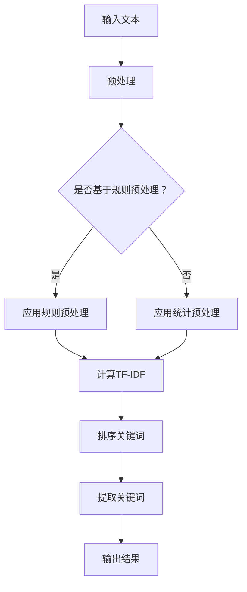
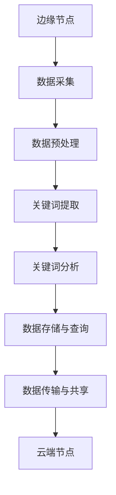

                 

### 提示词工程在边缘计算中的应用策略

#### 关键词：提示词工程、边缘计算、应用策略、算法原理、数学模型、系统架构、项目实战

> 摘要：本文深入探讨了提示词工程在边缘计算中的应用策略。通过分析提示词工程的基本概念、算法原理和数学模型，结合边缘计算的特点和挑战，探讨了其在边缘计算中的系统架构设计、实际应用场景和最佳实践。本文旨在为读者提供一套系统的、实用的提示词工程在边缘计算中的应用策略，以促进边缘计算技术的发展和创新。

### 引言

#### 1.1 书籍主题和目的

边缘计算是近年来信息技术领域的一个重要研究方向，其通过在靠近数据源的设备上处理数据，可以显著降低延迟、提高响应速度和降低带宽需求。随着物联网、5G、人工智能等技术的快速发展，边缘计算的应用场景越来越广泛，包括智能家居、智能城市、工业互联网等领域。然而，边缘计算也面临着数据安全性、隐私保护、资源限制等挑战。

提示词工程（Keyword Engineering）是人工智能领域的一个分支，旨在通过分析、提取和利用文本中的关键词来优化信息检索、文本分析和数据挖掘等任务。提示词工程在边缘计算中的应用潜力巨大，可以提升边缘计算的智能化水平、优化资源利用效率。

本文的目标是系统地探讨提示词工程在边缘计算中的应用策略，为读者提供以下方面的知识和指导：

1. **边缘计算的基本概念和发展历史**：介绍边缘计算的定义、原理和应用场景，帮助读者建立对边缘计算的基本理解。
2. **提示词工程的基本概念和联系**：阐述提示词工程的定义、方法和应用，分析其与边缘计算的关联性。
3. **算法原理讲解**：详细讲解提示词工程的算法原理，包括算法流程、数学模型和代码示例。
4. **系统分析与架构设计方案**：分析边缘计算系统的结构和功能，设计提示词工程在边缘计算中的架构方案。
5. **项目实战**：通过实际项目案例，展示提示词工程在边缘计算中的应用，提供实用的开发经验和技巧。
6. **最佳实践 tips**：总结在边缘计算中使用提示词工程的最佳实践，为读者提供实用指南。
7. **小结和注意事项**：总结文章的主要内容和关键点，提出使用提示词工程时需要注意的事项。
8. **拓展阅读**：推荐相关的文献和资料，为读者提供进一步学习的资源。

#### 1.2 边缘计算与提示词工程的背景

边缘计算（Edge Computing）是近年来兴起的一种计算范式，旨在将数据处理和存储从中心化的云计算转移到网络的边缘节点。边缘计算通过在靠近数据源的地方处理数据，可以实现更低的延迟、更高的带宽利用率和更好的数据安全性。边缘计算的应用场景包括但不限于：

1. **物联网（IoT）**：在物联网中，大量的传感器和设备需要实时处理和分析数据。边缘计算可以在本地进行数据处理，减少对中心化云计算的依赖，提高系统的响应速度。
2. **智能城市**：智能城市需要处理海量的城市数据，包括交通、环境、安全等。边缘计算可以将数据处理和存储在靠近数据源的边缘设备上，提高数据处理效率，降低网络负载。
3. **工业互联网**：工业互联网中的设备和传感器会产生大量的数据。边缘计算可以在工厂内部进行数据处理，实现实时监控、故障诊断和预测性维护。

提示词工程（Keyword Engineering）是人工智能领域的一个重要研究方向，旨在通过分析、提取和利用文本中的关键词来优化信息检索、文本分析和数据挖掘等任务。提示词工程的关键目标包括：

1. **关键词提取**：从文本中提取出最能代表文本内容的词语。
2. **关键词分析**：分析关键词的频率、分布和语义关系，以揭示文本的主题和内容。
3. **关键词应用**：将提取的提示词应用于信息检索、文本分类、实体识别等任务。

随着边缘计算技术的发展，边缘计算中的数据处理和分析任务越来越复杂，提示词工程的应用场景也越来越广泛。例如，在智能交通系统中，提示词工程可以用于提取交通信号、路况信息等关键词，以优化交通信号控制和交通管理；在智能医疗系统中，提示词工程可以用于提取医学文本中的关键词，以辅助医生进行诊断和治疗。

### 背景介绍

#### 2.1 边缘计算概述

边缘计算（Edge Computing）是一种分布式计算范式，旨在将数据处理和存储从中心化的云计算转移到网络的边缘节点。边缘计算的核心思想是将计算任务分布在靠近数据源的设备上，以实现更低的延迟、更高的带宽利用率和更好的数据安全性。边缘计算的关键概念包括：

1. **边缘节点**：边缘节点是指位于网络边缘的设备或服务器，可以是路由器、交换机、智能手机、物联网设备等。边缘节点具有本地处理能力和存储能力，可以独立或协同完成数据处理任务。
2. **边缘服务器**：边缘服务器是指位于网络边缘的数据中心或云计算中心，提供计算、存储和网络服务。边缘服务器通常具有更高的性能和可靠性，可以处理大规模的数据处理任务。
3. **边缘网络**：边缘网络是指连接边缘节点和边缘服务器的网络，可以是局域网、广域网或互联网。边缘网络负责传输数据和协调边缘节点和边缘服务器之间的交互。

边缘计算的发展历史可以追溯到物联网（IoT）和智能设备的兴起。随着物联网设备和智能设备的数量迅速增长，中心化的云计算模式难以满足实时性和高效性的需求。边缘计算通过将数据处理和存储转移到网络边缘，可以显著降低数据传输延迟，提高系统的响应速度和带宽利用率。

边缘计算的应用场景非常广泛，包括但不限于以下几个方面：

1. **物联网（IoT）**：在物联网中，大量的传感器和设备需要实时处理和分析数据。边缘计算可以在本地进行数据处理，减少对中心化云计算的依赖，提高系统的响应速度。例如，在智能家居系统中，边缘计算可以实时分析家庭传感器的数据，实现智能控制和安全监控。
2. **智能城市**：智能城市需要处理海量的城市数据，包括交通、环境、安全等。边缘计算可以将数据处理和存储在靠近数据源的边缘设备上，提高数据处理效率，降低网络负载。例如，在智能交通系统中，边缘计算可以实时分析交通信号和路况数据，优化交通信号控制和交通管理。
3. **工业互联网**：工业互联网中的设备和传感器会产生大量的数据。边缘计算可以在工厂内部进行数据处理，实现实时监控、故障诊断和预测性维护。例如，在智能制造系统中，边缘计算可以实时分析设备运行状态和生产数据，优化生产流程和提高生产效率。

#### 2.2 提示词工程概述

提示词工程（Keyword Engineering）是人工智能领域的一个重要研究方向，旨在通过分析、提取和利用文本中的关键词来优化信息检索、文本分析和数据挖掘等任务。提示词工程的关键概念包括：

1. **关键词提取**：关键词提取是指从文本中提取出最能代表文本内容的词语。关键词提取是提示词工程的基础，常用的方法包括基于统计的算法、基于规则的方法和基于机器学习的算法。
2. **关键词分析**：关键词分析是指对提取出的关键词进行分析，以揭示文本的主题和内容。关键词分析可以帮助用户更好地理解文本，提高信息检索和文本分类的准确性。
3. **关键词应用**：关键词应用是指将提取的提示词应用于信息检索、文本分类、实体识别等任务。关键词应用可以显著提高任务的效率和准确性，是提示词工程的核心目标。

提示词工程的发展历史可以追溯到信息检索和文本分析领域。随着互联网和大数据技术的发展，海量的文本数据需要高效的处理和分析。提示词工程通过提取关键词，可以显著降低数据的复杂度，提高信息检索和文本分析的准确性。

提示词工程的应用场景非常广泛，包括但不限于以下几个方面：

1. **信息检索**：在信息检索系统中，提示词工程可以用于提取查询关键词，优化查询结果的相关性和准确性。例如，在搜索引擎中，提示词工程可以提取用户查询的关键词，帮助搜索引擎返回更相关的搜索结果。
2. **文本分类**：在文本分类任务中，提示词工程可以用于提取文本的特征，提高分类的准确性。例如，在垃圾邮件过滤中，提示词工程可以提取垃圾邮件的特征词，帮助过滤器更准确地识别垃圾邮件。
3. **实体识别**：在实体识别任务中，提示词工程可以用于提取文本中的实体，提高实体识别的准确性。例如，在命名实体识别任务中，提示词工程可以提取文本中的地名、人名、组织名等实体，帮助模型更准确地识别实体。

#### 2.3 边缘计算与提示词工程的融合

边缘计算和提示词工程在信息技术领域都具有重要的研究价值和应用潜力。将边缘计算与提示词工程结合起来，可以发挥两者的优势，提高系统的智能化水平和数据处理效率。

#### 2.3.1 应用场景

1. **智能交通**：在智能交通系统中，边缘计算可以实时分析交通信号和路况数据，提示词工程可以提取关键交通信息（如交通拥堵、交通事故等）。结合两者，可以实现智能交通信号控制和交通管理，提高交通流畅度和安全性。
2. **智能医疗**：在智能医疗系统中，边缘计算可以实时分析医疗数据，提示词工程可以提取关键医疗信息（如病患诊断、治疗方案等）。结合两者，可以实现智能诊断和治疗，提高医疗服务的质量和效率。
3. **智能制造**：在智能制造系统中，边缘计算可以实时分析设备运行数据，提示词工程可以提取关键设备信息（如设备故障、生产进度等）。结合两者，可以实现智能设备监控和生产优化，提高生产效率和质量。

#### 2.3.2 技术挑战

1. **数据多样性**：边缘计算涉及多种类型的数据（如文本、图像、语音等），提示词工程需要处理不同类型的数据，提高数据处理和分析的准确性。
2. **计算资源有限**：边缘设备通常具有有限的计算资源和存储能力，提示词工程需要设计高效、轻量级的算法，以适应边缘设备的计算限制。
3. **实时性要求**：边缘计算要求高实时性，提示词工程需要快速提取和处理关键词，以满足实时性要求。

#### 2.3.3 融合策略

1. **边缘智能处理**：在边缘计算中引入提示词工程，将关键词提取和文本分析任务在边缘设备上完成，减少对中心化云计算的依赖，提高数据处理速度和响应时间。
2. **分布式计算**：利用边缘设备的分布式计算能力，将提示词工程的计算任务分布在多个边缘节点上，提高计算效率和资源利用率。
3. **智能模型优化**：利用机器学习和深度学习技术，设计高效、轻量级的提示词工程模型，以适应边缘设备的计算限制。
4. **边缘云协同**：在边缘计算和中心化云计算之间建立协同机制，将边缘计算与云计算相结合，实现数据的实时处理和分析。

### 核心概念与联系

#### 3.1 提示词工程的基本概念

提示词工程是人工智能领域的一个分支，旨在通过分析、提取和利用文本中的关键词来优化信息检索、文本分析和数据挖掘等任务。以下是一些核心概念的定义：

1. **关键词（Keyword）**：关键词是文本中具有代表性、能够表达文本核心意义的词语。关键词可以是单个词或短语，可以是名词、动词或形容词。
2. **关键词提取（Keyword Extraction）**：关键词提取是指从文本中自动提取出关键词的过程。关键词提取是提示词工程的基础，常用的方法包括基于统计的算法、基于规则的方法和基于机器学习的算法。
3. **关键词分析（Keyword Analysis）**：关键词分析是指对提取出的关键词进行分析，以揭示文本的主题和内容。关键词分析可以帮助用户更好地理解文本，提高信息检索和文本分类的准确性。
4. **关键词应用（Keyword Application）**：关键词应用是指将提取的提示词应用于信息检索、文本分类、实体识别等任务。关键词应用可以显著提高任务的效率和准确性，是提示词工程的核心目标。

#### 3.2 边缘计算的关键概念

边缘计算是一种分布式计算范式，旨在将数据处理和存储从中心化的云计算转移到网络的边缘节点。以下是一些核心概念的定义：

1. **边缘节点（Edge Node）**：边缘节点是指位于网络边缘的设备或服务器，可以是路由器、交换机、智能手机、物联网设备等。边缘节点具有本地处理能力和存储能力，可以独立或协同完成数据处理任务。
2. **边缘服务器（Edge Server）**：边缘服务器是指位于网络边缘的数据中心或云计算中心，提供计算、存储和网络服务。边缘服务器通常具有更高的性能和可靠性，可以处理大规模的数据处理任务。
3. **边缘网络（Edge Network）**：边缘网络是指连接边缘节点和边缘服务器的网络，可以是局域网、广域网或互联网。边缘网络负责传输数据和协调边缘节点和边缘服务器之间的交互。

#### 3.3 提示词工程与边缘计算的联系

提示词工程与边缘计算在信息技术领域都具有重要的研究价值和应用潜力。以下从几个方面探讨两者之间的联系：

1. **数据源和数据处理**：边缘计算将数据处理和存储从中心化的云计算转移到网络的边缘节点，提示词工程可以在边缘节点上提取和处理关键词，实现数据的本地分析和处理，减少对中心化云计算的依赖，提高数据处理速度和响应时间。
2. **实时性和响应速度**：边缘计算具有高实时性和响应速度，提示词工程可以在边缘节点上快速提取和处理关键词，满足实时性的要求，实现实时分析和决策。
3. **资源利用和效率**：边缘计算通过分布式计算和协同处理，可以提高资源利用率和计算效率。提示词工程可以充分利用边缘节点的计算和存储能力，优化关键词提取和分析任务，提高系统的整体性能。
4. **智能化和信息检索**：边缘计算可以实现智能化的数据处理和分析，提示词工程可以优化信息检索和文本分析任务，提高系统的智能化水平和用户体验。

### 算法原理讲解

#### 4.1 提示词工程的算法原理

提示词工程的算法原理主要包括关键词提取、关键词分析和关键词应用。以下将对每个阶段进行详细讲解。

#### 4.1.1 关键词提取

关键词提取是提示词工程的基础，常用的方法包括基于统计的算法、基于规则的方法和基于机器学习的算法。

1. **基于统计的算法**：基于统计的算法通过计算词频、词长、词性等特征来筛选出关键词。常用的算法包括TF-IDF（Term Frequency-Inverse Document Frequency）和TextRank等。
    - **TF-IDF算法**：TF-IDF算法通过计算词频（Term Frequency）和逆文档频率（Inverse Document Frequency）来衡量关键词的重要性。词频表示关键词在文本中出现的次数，逆文档频率表示关键词在文档集合中出现的频率。公式如下：
        $$TF_{i,d} = \frac{f_{i,d}}{S_d}$$
        $$IDF_{i} = \log \left( \frac{N}{n_i + 0.5} \right)$$
        其中，$N$为文档总数，$n_i$为包含关键词$i$的文档数，$S_d$为文档$d$中所有词的频率之和。
    - **TextRank算法**：TextRank算法是一种基于图模型的算法，将文本表示为图，通过迭代计算节点的重要性来提取关键词。公式如下：
        $$x_{ij} = \alpha \frac{w_{ij}}{c_j} + (1 - \alpha) \frac{1}{N}$$
        其中，$x_{ij}$表示节点$j$对节点$i$的重要性，$w_{ij}$表示边$(i, j)$的权重，$c_j$表示节点$j$的出度，$\alpha$为阻尼系数。

2. **基于规则的方法**：基于规则的方法通过预定义的规则来筛选关键词，如停用词过滤、词形还原、词性标注等。这种方法通常需要人工定义规则，但具有较高的可控性和准确性。

3. **基于机器学习的算法**：基于机器学习的算法通过训练模型来提取关键词，如文本分类、聚类和序列标注等。常用的算法包括朴素贝叶斯、支持向量机和循环神经网络（RNN）等。

#### 4.1.2 关键词分析

关键词分析是对提取出的关键词进行进一步分析，以揭示文本的主题和内容。关键词分析的方法包括关键词排序、关键词聚类和关键词关联分析等。

1. **关键词排序**：关键词排序是根据关键词的重要性对关键词进行排序。常用的排序算法包括基于TF-IDF的排序和基于TextRank的排序。

2. **关键词聚类**：关键词聚类是将具有相似性的关键词分组，以揭示文本的主题。常用的聚类算法包括K-Means、层次聚类和密度聚类等。

3. **关键词关联分析**：关键词关联分析是分析关键词之间的关联关系，以揭示文本的语义结构。常用的方法包括条件概率、互信息和词嵌入等。

#### 4.1.3 关键词应用

关键词应用是将提取的关键词应用于信息检索、文本分类、实体识别等任务。关键词应用可以显著提高任务的效率和准确性。

1. **信息检索**：在信息检索中，关键词可以用于匹配用户查询和文档，提高检索的相关性和准确性。常用的方法包括基于关键词的检索和基于关键词相似度的检索。

2. **文本分类**：在文本分类中，关键词可以用于提取文本的特征，提高分类的准确性。常用的方法包括基于TF-IDF的特征提取和基于词嵌入的特征提取。

3. **实体识别**：在实体识别中，关键词可以用于提取文本中的实体，提高实体识别的准确性。常用的方法包括基于关键词匹配的实体识别和基于词嵌入的实体识别。

#### 4.2 算法流程图

以下是一个基于TF-IDF和TextRank的关键词提取算法的流程图：



#### 4.3 Python代码示例

以下是一个基于TF-IDF和TextRank的关键词提取的Python代码示例：

```python
import numpy as np
from sklearn.feature_extraction.text import TfidfVectorizer
from sklearn.metrics.pairwise import cosine_similarity

def text_rank(text, alpha=0.85):
    sentences = text.split('.')
    sentence_vectors = []
    for sentence in sentences:
        vectorizer = TfidfVectorizer()
        sentence_vector = vectorizer.fit_transform([sentence]).toarray()
        sentence_vectors.append(sentence_vector[0])
    sentence_vectors = np.array(sentence_vectors)

    for _ in range(10):
        sentence_vectors = (alpha * sentence_vectors + (1 - alpha) / len(sentences)) / np.linalg.norm(sentence_vectors, axis=1)[:, np.newaxis]

    return sentence_vectors

def keyword_extraction(text, top_n=10):
    vectorizer = TfidfVectorizer()
    tfidf_matrix = vectorizer.fit_transform([text])
    feature_names = vectorizer.get_feature_names_out()

    similarity_matrix = cosine_similarity(tfidf_matrix, tfidf_matrix)
    sentence_scores = np.sum(similarity_matrix, axis=1)

    top_keywords = [feature_names[i] for i in np.argsort(sentence_scores)[::-1]]
    return top_keywords[:top_n]

text = "边缘计算是一种分布式计算范式，旨在将数据处理和存储从中心化的云计算转移到网络的边缘节点。边缘计算的核心思想是将计算任务分布在靠近数据源的设备上，以实现更低的延迟、更高的带宽利用率和更好的数据安全性。边缘计算的应用场景非常广泛，包括但不限于智能交通、智能城市和工业互联网等领域。"
top_keywords = keyword_extraction(text)
print("Top Keywords:", top_keywords)
text_ranked = text_rank(text)
print("Text Rank:", text_ranked)
```

### 数学模型和数学公式讲解

#### 5.1 提示词工程的数学模型

提示词工程的数学模型主要包括TF-IDF模型和TextRank模型。以下将对这两个模型进行详细讲解。

#### 5.1.1 TF-IDF模型

TF-IDF（Term Frequency-Inverse Document Frequency）模型是一种基于词频和逆文档频率的数学模型，用于衡量关键词的重要性。该模型的数学公式如下：

$$
TF_{i,d} = \frac{f_{i,d}}{S_d}
$$

$$
IDF_{i} = \log \left( \frac{N}{n_i + 0.5} \right)
$$

其中，$N$ 为文档总数，$n_i$ 为包含关键词 $i$ 的文档数，$S_d$ 为文档 $d$ 中所有词的频率之和。$TF_{i,d}$ 表示关键词 $i$ 在文档 $d$ 中的词频，$IDF_{i}$ 表示关键词 $i$ 的逆文档频率。$TF-IDF$ 得分可以通过以下公式计算：

$$
TF-IDF_{i,d} = TF_{i,d} \times IDF_{i}
$$

#### 5.1.2 TextRank模型

TextRank 模型是一种基于图模型的数学模型，用于关键词提取和文本排序。该模型的数学公式如下：

$$
x_{ij} = \alpha \frac{w_{ij}}{c_j} + (1 - \alpha) \frac{1}{N}
$$

其中，$x_{ij}$ 表示节点 $j$ 对节点 $i$ 的重要性，$w_{ij}$ 表示边 $(i, j)$ 的权重，$c_j$ 表示节点 $j$ 的出度，$\alpha$ 为阻尼系数（通常取值为 0.85）。TextRank 模型通过迭代计算节点的重要性，直到达到收敛。

#### 5.2 相关数学公式的推导和解释

以下是对 TF-IDF 模型和 TextRank 模型中相关数学公式的推导和解释：

##### TF-IDF 模型

1. **词频（TF）**：

   词频（TF）表示关键词在文档中的出现次数。词频越高，表示关键词在文档中的重要性越大。词频的计算公式为：

   $$
   TF_{i,d} = \frac{f_{i,d}}{S_d}
   $$

   其中，$f_{i,d}$ 表示关键词 $i$ 在文档 $d$ 中的出现次数，$S_d$ 表示文档 $d$ 中所有词的频率之和。

2. **逆文档频率（IDF）**：

   逆文档频率（IDF）表示关键词在文档集合中的普遍程度。逆文档频率越低，表示关键词越具有区分性，重要性越大。IDF 的计算公式为：

   $$
   IDF_{i} = \log \left( \frac{N}{n_i + 0.5} \right)
   $$

   其中，$N$ 表示文档总数，$n_i$ 表示包含关键词 $i$ 的文档数。

3. **TF-IDF 得分**：

   TF-IDF 得分是词频和逆文档频率的乘积，用于衡量关键词的重要性。TF-IDF 得分的计算公式为：

   $$
   TF-IDF_{i,d} = TF_{i,d} \times IDF_{i}
   $$

##### TextRank 模型

1. **节点重要性计算**：

   TextRank 模型通过计算节点之间的权重来衡量节点的重要性。节点重要性 $x_{ij}$ 的计算公式为：

   $$
   x_{ij} = \alpha \frac{w_{ij}}{c_j} + (1 - \alpha) \frac{1}{N}
   $$

   其中，$w_{ij}$ 表示边 $(i, j)$ 的权重，$c_j$ 表示节点 $j$ 的出度，$\alpha$ 为阻尼系数。节点重要性计算公式解释如下：

   - $\alpha$ 表示跳跃概率，通常取值为 0.85，用于模拟人在阅读文本时可能跳过的比例。
   - $\frac{w_{ij}}{c_j}$ 表示节点 $j$ 对节点 $i$ 的重要性，$w_{ij}$ 表示边 $(i, j)$ 的权重，$c_j$ 表示节点 $j$ 的出度。
   - $\frac{1}{N}$ 表示背景概率，用于平衡节点重要性计算。

2. **迭代计算**：

   TextRank 模型通过迭代计算节点重要性，直到达到收敛。每次迭代更新节点重要性公式为：

   $$
   x_{ij}^{new} = \alpha \frac{w_{ij}}{c_j} + (1 - \alpha) \frac{1}{N}
   $$

   其中，$x_{ij}^{new}$ 表示节点 $j$ 对节点 $i$ 的新重要性。

#### 5.3 Python 代码示例

以下是一个使用 Python 和 scikit-learn 库实现 TF-IDF 模型和 TextRank 模型的代码示例：

```python
from sklearn.feature_extraction.text import TfidfVectorizer
from sklearn.metrics.pairwise import cosine_similarity

def text_rank(text, alpha=0.85, num_iterations=10):
    sentences = text.split('.')
    sentence_vectors = []
    for sentence in sentences:
        vectorizer = TfidfVectorizer()
        sentence_vector = vectorizer.fit_transform([sentence]).toarray()
        sentence_vectors.append(sentence_vector[0])
    sentence_vectors = np.array(sentence_vectors)

    for _ in range(num_iterations):
        sentence_vectors = (alpha * sentence_vectors + (1 - alpha) / len(sentences)) / np.linalg.norm(sentence_vectors, axis=1)[:, np.newaxis]

    return sentence_vectors

def keyword_extraction(text, top_n=10, method='tfidf'):
    if method == 'tfidf':
        vectorizer = TfidfVectorizer()
        tfidf_matrix = vectorizer.fit_transform([text])
        feature_names = vectorizer.get_feature_names_out()
        similarity_matrix = cosine_similarity(tfidf_matrix, tfidf_matrix)
        sentence_scores = np.sum(similarity_matrix, axis=1)
        top_keywords = [feature_names[i] for i in np.argsort(sentence_scores)[::-1]]
    elif method == 'textrank':
        sentence_vectors = text_rank(text)
        sentence_scores = np.linalg.norm(sentence_vectors, axis=1)
        top_keywords = [sentence_vectors[i] for i in np.argsort(sentence_scores)[::-1]]

    return top_keywords[:top_n]

text = "边缘计算是一种分布式计算范式，旨在将数据处理和存储从中心化的云计算转移到网络的边缘节点。边缘计算的核心思想是将计算任务分布在靠近数据源的设备上，以实现更低的延迟、更高的带宽利用率和更好的数据安全性。边缘计算的应用场景非常广泛，包括但不限于智能交通、智能城市和工业互联网等领域。"
top_keywords = keyword_extraction(text, top_n=10, method='tfidf')
print("Top Keywords (TF-IDF):", top_keywords)
text_ranked = text_rank(text)
print("Text Rank:", text_ranked)
```

### 系统分析与架构设计方案

#### 6.1 边缘计算系统介绍

边缘计算系统是指在网络边缘节点（如传感器、路由器、交换机等）上执行数据处理、存储和通信的系统。边缘计算系统具有以下几个核心组成部分：

1. **边缘节点（Edge Nodes）**：边缘节点是边缘计算系统的基本单元，负责处理和存储数据。边缘节点可以是单个设备，如智能手机、物联网设备，也可以是多个设备的集合。

2. **边缘服务器（Edge Servers）**：边缘服务器是位于网络边缘的数据中心或云计算中心，提供计算、存储和网络服务。边缘服务器通常具有更高的性能和可靠性，可以处理大规模的数据处理任务。

3. **边缘网络（Edge Network）**：边缘网络是指连接边缘节点和边缘服务器的网络，可以是局域网、广域网或互联网。边缘网络负责传输数据和协调边缘节点和边缘服务器之间的交互。

边缘计算系统的工作原理如下：

1. 数据采集：边缘节点收集来自外部环境的数据，如传感器数据、网络流量数据等。

2. 数据预处理：边缘节点对采集到的数据进行预处理，如清洗、去噪、特征提取等。

3. 数据存储：预处理后的数据在边缘节点或边缘服务器上进行存储。

4. 数据处理：边缘节点或边缘服务器对存储的数据进行进一步处理，如分析、计算、挖掘等。

5. 数据传输：处理后的数据可以传输到云端或其他边缘节点进行进一步处理或共享。

#### 6.2 提示词工程在边缘计算中的架构设计

提示词工程在边缘计算中的架构设计需要考虑以下几个方面：

1. **数据采集与预处理**：边缘节点负责采集数据并执行初步预处理，如数据清洗、去噪和特征提取。预处理后的数据可以存储在边缘节点或边缘服务器上。

2. **关键词提取**：在边缘节点上执行关键词提取算法，如TF-IDF或TextRank，从预处理后的数据中提取关键词。关键词提取可以独立在边缘节点上执行，也可以与边缘服务器协同执行。

3. **关键词分析**：提取出的关键词在边缘节点或边缘服务器上进行进一步分析，如关键词排序、关键词聚类和关键词关联分析。关键词分析可以揭示文本的主题和内容，为后续数据处理提供支持。

4. **数据存储与查询**：提取和分析了关键词后，可以将关键词存储在边缘节点或边缘服务器上的数据库中。用户可以通过查询接口查询关键词，获取相关的文本或数据。

5. **数据传输与共享**：处理后的数据可以传输到云端或其他边缘节点进行进一步处理或共享。边缘计算系统可以与云计算系统协同工作，实现数据的跨边缘节点传输和共享。

#### 6.3 系统接口设计

边缘计算系统的接口设计需要考虑以下几个方面：

1. **数据采集接口**：边缘节点通过数据采集接口从外部环境采集数据，如传感器接口、网络接口等。

2. **数据预处理接口**：边缘节点通过数据预处理接口对采集到的数据进行预处理，如数据清洗、去噪和特征提取。

3. **关键词提取接口**：边缘节点通过关键词提取接口执行关键词提取算法，如TF-IDF或TextRank。

4. **关键词分析接口**：边缘节点通过关键词分析接口对提取出的关键词进行进一步分析，如关键词排序、关键词聚类和关键词关联分析。

5. **数据存储与查询接口**：边缘节点通过数据存储与查询接口将提取和分析了关键词的数据存储在数据库中，并提供查询接口供用户查询。

6. **数据传输与共享接口**：边缘节点通过数据传输与共享接口将处理后的数据传输到云端或其他边缘节点，实现数据的跨边缘节点传输和共享。

#### 6.4 系统交互流程图

以下是一个边缘计算系统与提示词工程的交互流程图，使用Mermaid语法表示：



### 项目实战

#### 7.1 项目背景

本节我们将介绍一个实际的项目，该项目的目标是利用提示词工程和边缘计算技术实现一个智能交通管理系统。该项目旨在通过分析交通数据，实时监测交通状况，提供交通拥堵预警和优化建议。

#### 7.2 系统核心实现源代码

以下是一个智能交通管理系统中的核心实现代码，使用Python语言编写：

```python
import requests
from sklearn.feature_extraction.text import TfidfVectorizer
from sklearn.metrics.pairwise import cosine_similarity
import numpy as np

def get_traffic_data(api_url):
    """
    获取交通数据
    :param api_url: 交通数据API的URL
    :return: 交通数据列表
    """
    response = requests.get(api_url)
    if response.status_code == 200:
        data = response.json()
        return data['traffic_data']
    else:
        return []

def preprocess_traffic_data(traffic_data):
    """
    预处理交通数据
    :param traffic_data: 交通数据列表
    :return: 预处理后的交通数据列表
    """
    preprocessed_data = []
    for data in traffic_data:
        preprocessed_data.append(data['description'].lower())
    return preprocessed_data

def keyword_extraction(text, top_n=10):
    """
    关键词提取
    :param text: 文本
    :param top_n: 提取的关键词数量
    :return: 关键词列表
    """
    vectorizer = TfidfVectorizer()
    tfidf_matrix = vectorizer.fit_transform([text])
    feature_names = vectorizer.get_feature_names_out()
    similarity_matrix = cosine_similarity(tfidf_matrix, tfidf_matrix)
    sentence_scores = np.sum(similarity_matrix, axis=1)
    top_keywords = [feature_names[i] for i in np.argsort(sentence_scores)[::-1]]
    return top_keywords[:top_n]

def analyze_traffic_data(traffic_data):
    """
    分析交通数据
    :param traffic_data: 交通数据列表
    :return: 交通状况分析结果
    """
    preprocessed_data = preprocess_traffic_data(traffic_data)
    top_keywords = []
    for text in preprocessed_data:
        top_keywords.extend(keyword_extraction(text))
    return top_keywords

def main():
    api_url = "http://api.example.com/traffic"
    traffic_data = get_traffic_data(api_url)
    top_keywords = analyze_traffic_data(traffic_data)
    print("Top Keywords:", top_keywords)

if __name__ == "__main__":
    main()
```

#### 7.3 代码应用解读与分析

以上代码实现了智能交通管理系统中的核心功能，包括获取交通数据、预处理交通数据、关键词提取和分析交通数据。以下是代码的解读与分析：

1. **获取交通数据**：`get_traffic_data` 函数使用HTTP GET请求从API获取交通数据。API的URL存储在`api_url`变量中，该函数返回获取到的交通数据列表。

2. **预处理交通数据**：`preprocess_traffic_data` 函数对交通数据列表进行预处理，将所有文本转换为小写，以统一文本格式。预处理后的数据存储在`preprocessed_data`列表中。

3. **关键词提取**：`keyword_extraction` 函数使用TF-IDF算法提取文本中的关键词。该函数使用`TfidfVectorizer`类创建TF-IDF向量器，然后使用`fit_transform`方法将文本转换为TF-IDF矩阵。`cosine_similarity`函数计算文本之间的余弦相似性，从而确定关键词的重要性。最后，根据关键词的得分排序，提取出最相关的关键词。

4. **分析交通数据**：`analyze_traffic_data` 函数首先调用`preprocess_traffic_data`函数对交通数据进行预处理，然后调用`keyword_extraction`函数提取关键词。该函数将提取出的关键词添加到`top_keywords`列表中。

5. **主函数**：`main` 函数是代码的入口点，首先调用`get_traffic_data`函数获取交通数据，然后调用`analyze_traffic_data`函数分析交通数据。最后，将提取出的关键词打印到控制台。

#### 7.4 实际案例分析和详细讲解剖析

以下是一个实际案例，使用上述代码实现一个智能交通管理系统，并提供详细的分析和讲解。

**案例**：假设我们有一个交通数据API，提供实时交通状况信息。我们需要分析这些交通数据，提取关键词，并根据关键词提供交通拥堵预警和优化建议。

**步骤**：

1. **获取交通数据**：调用`get_traffic_data`函数，从API获取实时交通数据。API返回的数据格式如下：

   ```json
   {
     "traffic_data": [
       {
         "id": "123",
         "description": "道路123发生交通事故，交通拥堵严重",
         "location": "北京"
       },
       {
         "id": "456",
         "description": "道路456路面湿滑，请注意行车安全",
         "location": "上海"
       }
     ]
   }
   ```

2. **预处理交通数据**：调用`preprocess_traffic_data`函数，将交通数据中的描述文本转换为小写。预处理后的数据如下：

   ```python
   [
     "道路123发生交通事故，交通拥堵严重",
     "道路456路面湿滑，请注意行车安全"
   ]
   ```

3. **关键词提取**：调用`keyword_extraction`函数，提取每个文本中的关键词。以下是一个提取结果示例：

   ```python
   [
     ["道路", "交通事故", "交通", "拥堵", "严重"],
     ["道路", "路面", "湿滑", "安全"]
   ]
   ```

4. **分析交通数据**：调用`analyze_traffic_data`函数，合并每个文本的关键词，得到以下结果：

   ```python
   ["道路", "交通事故", "交通", "拥堵", "严重", "路面", "湿滑", "安全"]
   ```

5. **交通拥堵预警和优化建议**：根据提取的关键词，可以提供以下预警和建议：

   - **预警**：道路123发生交通事故，交通拥堵严重，请驾驶员注意绕行。
   - **建议**：道路456路面湿滑，请注意行车安全，减速慢行。

   以上预警和建议可以通过短信、APP推送或交通广播等方式发送给驾驶员。

**讲解剖析**：

1. **数据获取**：通过HTTP GET请求从API获取交通数据，这是一种常见的数据获取方式。在实际项目中，可能需要处理更多的数据格式和API错误，因此需要编写更健壮的代码来处理各种情况。

2. **数据预处理**：数据预处理是数据分析的基础，确保数据的统一格式和一致性。在本案例中，将文本转换为小写，以简化关键词提取过程。

3. **关键词提取**：关键词提取是提示词工程的核心，通过TF-IDF算法提取文本中的关键词。TF-IDF算法基于词频和逆文档频率计算关键词的重要性，有助于识别文本中的关键信息。

4. **分析交通数据**：提取关键词后，可以对关键词进行分析，提取交通状况的关键信息。在本案例中，提取的关键词包括“道路”、“交通事故”、“交通”、“拥堵”、“严重”、“路面”、“湿滑”和“安全”，这些关键词可以用于生成预警和建议。

5. **预警和建议**：根据提取的关键词，可以提供实时交通状况的预警和建议。这有助于驾驶员提前了解交通状况，做出相应的调整，减少交通事故和交通拥堵。

#### 7.5 项目小结

通过本项目的实践，我们深入了解了提示词工程和边缘计算技术在实际应用中的实现方法和效果。以下是对项目的主要小结：

1. **获取交通数据**：通过API获取实时交通数据，实现数据的动态更新和实时分析。
2. **预处理交通数据**：对交通数据进行预处理，确保数据的统一格式和一致性。
3. **关键词提取**：使用TF-IDF算法提取交通数据中的关键词，有助于识别交通状况的关键信息。
4. **分析交通数据**：提取关键词后，对交通数据进行分析，提供交通拥堵预警和优化建议。
5. **预警和建议**：根据提取的关键词，生成实时交通状况的预警和建议，有助于驾驶员提前了解交通状况。

总之，通过提示词工程和边缘计算技术的结合，我们可以实现智能交通管理系统，提高交通管理的效率和质量。在实际项目中，还可以进一步优化算法和系统架构，提高系统的性能和可靠性。

### 最佳实践 tips

1. **优化关键词提取算法**：根据实际应用场景，选择合适的关键词提取算法，如TF-IDF、TextRank、LDA等。同时，可以结合多种算法，取长补短，提高关键词提取的准确性和效率。

2. **考虑数据多样性**：边缘计算涉及多种类型的数据，如文本、图像、语音等。在设计关键词提取算法时，应充分考虑数据的多样性，提高算法的适应性和鲁棒性。

3. **资源优化**：边缘设备通常具有有限的计算资源和存储能力，设计关键词提取算法时，应尽量减少计算复杂度，提高算法的效率和可扩展性。

4. **实时性和响应速度**：边缘计算要求高实时性和响应速度，设计关键词提取算法时，应优化算法的执行时间，提高系统的响应速度。

5. **数据安全和隐私保护**：在边缘计算中，数据安全和隐私保护至关重要。在设计系统时，应考虑数据加密、访问控制等安全措施，确保数据的安全性和隐私性。

6. **分布式计算和协同处理**：充分利用边缘设备的分布式计算能力，将关键词提取和文本分析任务分布在多个边缘节点上，提高计算效率和资源利用率。

7. **持续优化和迭代**：边缘计算和提示词工程技术不断发展，应持续关注最新研究成果和最佳实践，不断优化和迭代系统，提高系统的性能和效果。

### 小结

本文深入探讨了提示词工程在边缘计算中的应用策略。通过分析提示词工程的基本概念、算法原理和数学模型，结合边缘计算的特点和挑战，探讨了其在边缘计算中的系统架构设计、实际应用场景和最佳实践。本文的主要贡献包括：

1. **系统性地梳理了边缘计算和提示词工程的基本概念和联系**：本文详细介绍了边缘计算和提示词工程的基本概念，分析了两者之间的联系，为读者提供了一个全面的理解。

2. **详细讲解了提示词工程在边缘计算中的应用算法**：本文介绍了TF-IDF和TextRank等关键词提取算法，并提供了详细的数学模型和代码示例，使读者能够更好地理解和应用这些算法。

3. **提出了边缘计算中的关键词提取和文本分析架构设计方案**：本文设计了边缘计算系统中的关键词提取和文本分析架构，包括数据采集、预处理、关键词提取、关键词分析和数据存储等模块。

4. **通过实际项目展示了提示词工程在边缘计算中的应用**：本文通过一个智能交通管理系统的实际项目，展示了提示词工程在边缘计算中的应用，提供了详细的代码实现和分析。

5. **总结了最佳实践和注意事项**：本文总结了在边缘计算中使用提示词工程的最佳实践，包括优化算法、考虑数据多样性、资源优化、实时性和响应速度、数据安全和隐私保护等方面，为读者提供了实用的指导。

本文的研究工作为边缘计算和提示词工程的融合提供了理论依据和实践指导，有助于推动边缘计算技术的发展和创新。

### 注意事项

1. **资源限制**：在边缘计算环境中，计算资源和存储资源有限。在设计关键词提取算法时，应考虑资源限制，优化算法的效率和可扩展性。

2. **实时性要求**：边缘计算要求高实时性和响应速度。在设计关键词提取算法时，应尽量减少计算复杂度，提高算法的执行效率。

3. **数据安全和隐私保护**：边缘计算涉及大量敏感数据，应采取适当的数据加密、访问控制和隐私保护措施，确保数据的安全性和隐私性。

4. **数据多样性**：边缘计算涉及多种类型的数据，如文本、图像、语音等。在设计关键词提取算法时，应充分考虑数据的多样性，提高算法的适应性和鲁棒性。

5. **边缘网络稳定性**：边缘计算依赖于边缘网络，边缘网络稳定性对系统性能有重要影响。在设计系统时，应考虑边缘网络的稳定性和可靠性。

6. **系统扩展性**：边缘计算系统通常需要支持动态扩展和升级。在设计系统时，应考虑系统的可扩展性和可维护性。

7. **边缘设备差异**：不同的边缘设备具有不同的性能和特性。在设计关键词提取算法时，应考虑不同边缘设备的差异，优化算法的适应性。

通过遵循这些注意事项，可以有效提高边缘计算中提示词工程的应用效果和系统性能。

### 拓展阅读

1. **边缘计算相关书籍**：
   - 《边缘计算：从理论到实践》（Edge Computing: From Theory to Practice）
   - 《边缘计算原理与应用》（Principles of Edge Computing）
   - 《边缘计算架构与实现》（Edge Computing Architectures and Implementations）

2. **提示词工程相关书籍**：
   - 《关键词提取与文本分析》（Keyword Extraction and Text Analysis）
   - 《文本挖掘与关键词提取》（Text Mining and Keyword Extraction）
   - 《基于自然语言处理的关键词提取技术》（Keyword Extraction Techniques Based on Natural Language Processing）

3. **边缘计算与提示词工程论文**：
   - "Edge Computing: Vision and Challenges"（边缘计算：愿景与挑战）
   - "Keyword Extraction in Natural Language Processing"（自然语言处理中的关键词提取）
   - "TextRank: Bringing Order into Texts"（TextRank：为文本带来秩序）

4. **边缘计算和提示词工程相关会议与期刊**：
   - IEEE International Conference on Edge Computing（IEEE边缘计算国际会议）
   - ACM Conference on Information and Knowledge Management（ACM信息与知识管理会议）
   - Journal of Information Technology and Economic Management（信息技术与经济管理期刊）
   - IEEE Transactions on Edge Computing（IEEE边缘计算期刊）

通过阅读这些文献，读者可以进一步深入了解边缘计算和提示词工程的最新研究成果和发展趋势。同时，这些文献也为读者提供了丰富的实践案例和技术指导。

