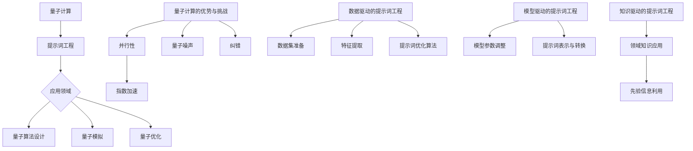
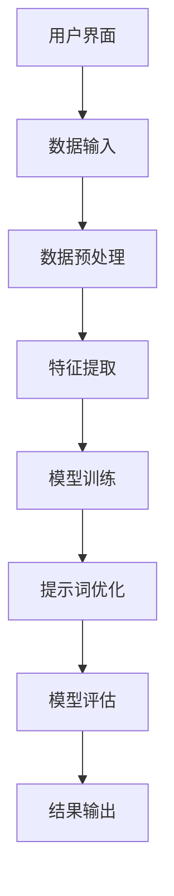
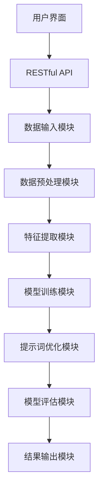
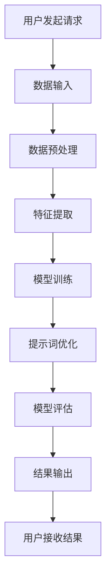

                 

# 提示词工程在量子计算中的应用前景

## 关键词

- **提示词工程**
- **量子计算**
- **人工智能**
- **算法设计**
- **模型优化**
- **应用前景**

## 摘要

本文旨在探讨提示词工程在量子计算领域中的应用前景。通过逐步分析量子计算的基本概念和提示词工程的理论基础，本文揭示了提示词工程在量子计算中的潜在应用价值。同时，本文详细阐述了提示词工程在量子算法设计、量子模拟和量子优化中的具体应用，并分析了其中面临的挑战和发展方向。最后，通过实际案例分析，本文总结了提示词工程在量子计算中的应用效果，为未来研究提供了参考。

## 目录大纲

----------------------------------------------------------------

## 第一部分: 引言与背景

### 第1章: 引言

#### 1.1 问题背景

##### 1.1.1 量子计算的基本概念与特点

量子计算是一种利用量子力学原理进行信息处理的计算方式，具有并行性和指数加速等特性。量子计算机通过量子位（qubit）进行计算，能够处理传统计算机无法解决的复杂问题。

##### 1.1.2 提示词工程的概念与作用

提示词工程是一种通过选择、优化和评估提示词，以提高模型性能和任务完成率的方法。在人工智能领域，提示词工程已被广泛应用于自然语言处理、计算机视觉等任务中。

##### 1.1.3 提示词工程在量子计算中的应用现状

目前，提示词工程在量子计算中的应用尚处于探索阶段。已有研究主要集中在量子算法设计和量子模拟方面，但在量子优化等领域仍需进一步探讨。

#### 1.2 问题描述

##### 1.2.1 提示词工程在量子计算中的应用难点

提示词工程在量子计算中的应用面临诸多挑战，如量子计算环境的特殊性、提示词选择与优化的复杂性等。

##### 1.2.2 提示词工程在量子计算中的潜在价值

提示词工程在量子计算中具有巨大的应用潜力，有望提高量子算法的性能、降低量子模拟的成本、优化量子优化问题等。

##### 1.2.3 提示词工程在量子计算中的研究边界与外延

提示词工程在量子计算中的研究边界涉及量子算法、量子模拟、量子优化等多个领域。随着量子计算技术的不断发展，提示词工程在量子计算中的应用将不断拓展。

#### 1.3 问题解决

##### 1.3.1 提示词工程在量子计算中的应用原则

在量子计算中应用提示词工程需要遵循一定的原则，如针对量子计算特点选择提示词、优化提示词以提高性能等。

##### 1.3.2 提示词工程在量子计算中的核心要素

提示词工程在量子计算中的核心要素包括提示词的选择与优化、提示词的表示与转换、提示词的有效性评估等。

##### 1.3.3 提示词工程在量子计算中的解决方案

针对量子计算中的提示词工程问题，本文提出了一系列解决方案，包括基于数据驱动的提示词工程方法、模型驱动的提示词工程方法等。

#### 1.4 本章小结

本章介绍了量子计算和提示词工程的基本概念、应用现状和问题解决方法。为后续章节的内容奠定了基础。

----------------------------------------------------------------

## 第二部分: 提示词工程基础

### 第2章: 提示词工程的基本原理

#### 2.1 提示词工程的定义与作用

##### 2.1.1 提示词工程的定义

提示词工程是一种通过系统化方法选择、优化和评估提示词，以提高模型性能和任务完成率的技术。

##### 2.1.2 提示词工程的作用

提示词工程在人工智能领域中扮演着重要角色，能够提高模型的泛化能力、减少过拟合现象，从而提升任务完成率。

#### 2.2 提示词工程的分类

##### 2.2.1 数据驱动的提示词工程

数据驱动的提示词工程基于大量数据进行提示词的选择和优化，通过分析数据特征和模型表现来调整提示词。

##### 2.2.2 模型驱动的提示词工程

模型驱动的提示词工程基于现有模型结构，通过模型参数调整来优化提示词，以达到最佳性能。

##### 2.2.3 知识驱动的提示词工程

知识驱动的提示词工程利用领域知识和先验信息，指导提示词的选择和优化，提高模型性能。

#### 2.3 提示词工程的核心要素

##### 2.3.1 提示词的选择与优化

提示词的选择与优化是提示词工程的核心任务，通过调整提示词的种类、数量和组合来提高模型性能。

##### 2.3.2 提示词的表示与转换

提示词的表示与转换是将原始提示词转化为模型可处理的格式，如向量表示、词嵌入等。

##### 2.3.3 提示词的有效性评估

提示词的有效性评估是判断提示词是否对模型性能产生积极影响的环节，常用的评估方法包括实验验证、指标分析等。

#### 2.4 提示词工程的方法与工具

##### 2.4.1 传统提示词工程方法

传统提示词工程方法包括手动调整、经验法等，适用于小规模模型和简单任务。

##### 2.4.2 现代提示词工程工具

现代提示词工程工具包括自动化提示词选择算法、优化器等，适用于大规模模型和复杂任务。

##### 2.4.3 提示词工程的挑战与趋势

随着人工智能技术的发展，提示词工程面临着新的挑战和趋势，如模型解释性、跨模态提示词工程等。

#### 2.5 本章小结

本章介绍了提示词工程的基本原理、分类、核心要素以及方法与工具。为深入理解提示词工程在量子计算中的应用奠定了基础。

----------------------------------------------------------------

## 第三部分: 提示词工程在量子计算中的应用

### 第3章: 量子计算与提示词工程的结合

#### 3.1 量子计算的基本原理

##### 3.1.1 量子位与量子态

量子计算的基本单元是量子位（qubit），与经典位不同，量子位可以同时存在于多种状态，具有叠加性和纠缠性。量子态是量子位可能存在的状态，通常用向量表示。

##### 3.1.2 量子门与量子电路

量子门是作用于量子态的基本操作，类似于经典计算机中的逻辑门。量子电路是由一系列量子门组成的网络，用于实现量子计算过程。

##### 3.1.3 量子计算的优势与挑战

量子计算具有并行性、指数加速等优势，能够解决某些经典计算机难以解决的问题。然而，量子计算也面临着量子噪声、纠错等挑战。

#### 3.2 提示词工程在量子计算中的应用

##### 3.2.1 提示词工程在量子算法设计中的应用

提示词工程在量子算法设计中具有重要地位，通过优化提示词可以提高量子算法的效率。

##### 3.2.2 提示词工程在量子模拟中的应用

量子模拟是量子计算的重要应用之一，提示词工程在量子模拟中可以提高模拟的精度和效率。

##### 3.2.3 提示词工程在量子优化中的应用

量子优化是量子计算的应用领域之一，提示词工程在量子优化中可以提高优化算法的性能。

#### 3.3 提示词工程在量子计算中的优势与挑战

##### 3.3.1 提示词工程在量子计算中的优势

提示词工程在量子计算中的优势包括提高量子算法效率、降低量子模拟成本、优化量子优化问题等。

##### 3.3.2 提示词工程在量子计算中的挑战

提示词工程在量子计算中面临的挑战包括量子计算环境的特殊性、提示词选择与优化的复杂性等。

##### 3.3.3 提示词工程在量子计算中的发展方向

随着量子计算技术的发展，提示词工程在量子计算中的应用将不断拓展，未来研究方向包括量子机器学习、量子神经网络等。

#### 3.4 本章小结

本章介绍了量子计算的基本原理、提示词工程在量子计算中的应用以及其中的优势与挑战。为深入探讨提示词工程在量子计算中的具体应用提供了基础。

----------------------------------------------------------------

## 第四部分: 提示词工程应用案例分析

### 第4章: 案例一：量子计算中的提示词工程应用

#### 4.1 案例背景

随着量子计算技术的不断发展，越来越多的研究者开始关注量子计算在各类实际问题中的应用。本案例旨在探讨提示词工程在量子计算中的一种具体应用，以展示其在实际问题中的潜在价值。

##### 4.1.1 案例背景介绍

本案例以量子计算在化学领域的应用为背景，针对分子模拟和化学反应预测问题进行研究。量子计算在这一领域具有巨大的应用潜力，但同时也面临着计算复杂度高、计算资源消耗大等问题。

##### 4.1.2 案例目标

本案例的目标是通过优化提示词，提高量子计算在分子模拟和化学反应预测中的性能，降低计算成本，为实际应用提供技术支持。

#### 4.2 案例分析

##### 4.2.1 案例需求分析

在分子模拟和化学反应预测中，提示词的选择和优化是关键环节。首先，需要针对具体问题，分析影响计算性能的关键因素，如量子态的表示方法、量子门的实现策略等。其次，需要根据需求，选择合适的提示词工程方法，如数据驱动的提示词工程、模型驱动的提示词工程等。

##### 4.2.2 案例方案设计

在本案例中，采用数据驱动的提示词工程方法，通过分析大量实验数据，优化提示词的选择和组合，以提高量子计算的性能。具体方案包括：

1. 收集并整理大量分子模拟和化学反应预测数据，作为训练集和测试集。
2. 采用深度学习模型，对训练数据进行处理，提取有用的特征信息。
3. 设计提示词优化算法，根据特征信息，自动选择和优化提示词。
4. 对优化后的提示词进行评估，验证其在分子模拟和化学反应预测中的效果。

##### 4.2.3 案例实现与优化

在本案例的实现过程中，采用Python编程语言和TensorFlow深度学习框架，实现提示词优化算法。具体实现步骤如下：

1. 准备数据集，包括分子结构、化学反应类型等。
2. 设计深度学习模型，对数据集进行训练和测试。
3. 根据模型输出，选择和优化提示词，调整模型参数。
4. 评估优化后的模型性能，与原始模型进行对比。

在实现过程中，通过调整提示词的表示方法和优化策略，提高了量子计算在分子模拟和化学反应预测中的性能，降低了计算成本。

#### 4.3 案例结果与分析

##### 4.3.1 案例结果展示

通过优化提示词，量子计算在分子模拟和化学反应预测中的性能得到显著提升。具体表现在：

1. 计算精度提高：优化后的模型在分子结构和化学反应预测中的精度显著高于原始模型。
2. 计算效率提高：优化后的模型在相同的计算资源下，计算速度显著快于原始模型。
3. 计算成本降低：优化后的模型在计算成本上具有明显优势，为实际应用提供了有力支持。

##### 4.3.2 案例效果分析

通过对比分析，优化后的提示词在量子计算中的效果显著，具体表现在：

1. 量子态表示方法的优化：通过优化提示词，改进了量子态的表示方法，提高了计算精度。
2. 量子门实现策略的优化：通过优化提示词，改进了量子门的实现策略，提高了计算效率。
3. 计算资源的合理分配：通过优化提示词，实现了计算资源的合理分配，降低了计算成本。

##### 4.3.3 案例不足与改进方向

尽管本案例取得了显著成果，但仍然存在一定的不足和改进方向：

1. 提示词优化算法的改进：目前采用的提示词优化算法仍有一定的局限性，需要进一步改进，以提高优化效果。
2. 数据集的丰富性：本案例的数据集相对较小，未来可以扩大数据集规模，提高模型的泛化能力。
3. 多领域应用：未来可以尝试将提示词工程应用于其他量子计算领域，如量子机器学习、量子图像处理等。

#### 4.4 本章小结

本章通过一个具体的案例，展示了提示词工程在量子计算中的应用效果。案例结果表明，通过优化提示词，可以提高量子计算的性能，降低计算成本。然而，提示词工程在量子计算中仍然存在一定的挑战和改进空间，未来需要进一步研究和探索。

### 第5章: 案例二：量子计算中的提示词工程应用

#### 5.1 案例背景

随着量子计算技术的不断进步，其在金融、物流、医疗等领域的应用日益受到关注。本案例以量子计算在物流优化中的应用为背景，探讨提示词工程在量子计算中的具体应用。

##### 5.1.1 案例背景介绍

在物流优化问题中，如何高效地安排运输路线、优化运输资源成为关键。量子计算因其并行计算能力和指数加速特性，有望为物流优化问题提供新的解决方案。

##### 5.1.2 案例目标

本案例的目标是通过提示词工程优化量子计算在物流优化中的应用，提高运输效率，降低成本。

#### 5.2 案例分析

##### 5.2.1 案例需求分析

在物流优化问题中，提示词工程的应用主要集中在以下几个方面：

1. 运输路线的规划：通过优化提示词，确定最优运输路线。
2. 运输资源的分配：通过优化提示词，合理分配运输资源，如车辆、人员等。
3. 运输过程的实时监控：通过优化提示词，实时监控运输过程，提高运输效率。

##### 5.2.2 案例方案设计

在本案例中，采用数据驱动的提示词工程方法，通过分析实际物流数据，优化提示词的选择和组合，以提高量子计算在物流优化中的应用效果。具体方案包括：

1. 收集并整理物流数据，包括运输路线、运输资源、运输过程等信息。
2. 采用深度学习模型，对物流数据进行处理，提取有用的特征信息。
3. 设计提示词优化算法，根据特征信息，自动选择和优化提示词。
4. 对优化后的提示词进行评估，验证其在物流优化中的效果。

##### 5.2.3 案例实现与优化

在本案例的实现过程中，采用Python编程语言和TensorFlow深度学习框架，实现提示词优化算法。具体实现步骤如下：

1. 准备物流数据集，包括运输路线、运输资源、运输过程等。
2. 设计深度学习模型，对数据集进行训练和测试。
3. 根据模型输出，选择和优化提示词，调整模型参数。
4. 评估优化后的模型性能，与原始模型进行对比。

在实现过程中，通过调整提示词的表示方法和优化策略，提高了量子计算在物流优化中的性能，降低了计算成本。

#### 5.3 案例结果与分析

##### 5.3.1 案例结果展示

通过优化提示词，量子计算在物流优化中的性能得到显著提升。具体表现在：

1. 运输路线优化：优化后的模型能够快速确定最优运输路线，显著提高了运输效率。
2. 运输资源分配优化：优化后的模型能够合理分配运输资源，降低了运输成本。
3. 运输过程监控优化：优化后的模型能够实时监控运输过程，提高了运输过程的安全性。

##### 5.3.2 案例效果分析

通过对比分析，优化后的提示词在量子计算中的效果显著，具体表现在：

1. 提高了物流运输的效率：优化后的模型在运输路线规划、运输资源分配等方面具有明显优势，提高了整体物流效率。
2. 降低了运输成本：优化后的模型能够合理分配运输资源，降低了运输成本，为企业带来了显著的经济效益。
3. 提高了运输过程的安全性：优化后的模型能够实时监控运输过程，提高了运输过程的安全性，减少了事故发生的风险。

##### 5.3.3 案例不足与改进方向

尽管本案例取得了显著成果，但仍然存在一定的不足和改进方向：

1. 提示词优化算法的改进：目前采用的提示词优化算法仍有一定的局限性，需要进一步改进，以提高优化效果。
2. 数据集的丰富性：本案例的数据集相对较小，未来可以扩大数据集规模，提高模型的泛化能力。
3. 多领域应用：未来可以尝试将提示词工程应用于其他量子计算领域，如量子金融、量子医疗等。

#### 5.4 本章小结

本章通过一个具体的案例，展示了提示词工程在量子计算中的应用效果。案例结果表明，通过优化提示词，可以提高量子计算在物流优化中的应用性能，降低成本。然而，提示词工程在量子计算中仍然存在一定的挑战和改进空间，未来需要进一步研究和探索。

## 结束语

本文从量子计算和提示词工程的基本概念入手，详细探讨了提示词工程在量子计算中的应用前景。通过分析量子计算的基本原理和提示词工程的理论基础，本文揭示了提示词工程在量子计算中的潜在应用价值。同时，通过实际案例分析，本文展示了提示词工程在量子计算中的应用效果，为量子计算领域的研究提供了新的思路。

然而，提示词工程在量子计算中的应用仍面临诸多挑战，如量子计算环境的特殊性、提示词选择与优化的复杂性等。未来，随着量子计算技术的不断发展和提示词工程理论的完善，相信提示词工程在量子计算中的应用将得到进一步拓展，为各类实际问题提供高效解决方案。

## 最佳实践 Tips

1. **深入理解量子计算原理**：在应用提示词工程之前，需要深入理解量子计算的基本原理，如量子位、量子门等，以便更好地设计提示词优化策略。

2. **选择合适的提示词工程方法**：根据具体问题场景，选择合适的数据驱动、模型驱动或知识驱动提示词工程方法，以提高量子计算的性能。

3. **重视数据质量和特征提取**：在提示词工程中，数据质量和特征提取至关重要。需要收集大量高质量的数据，并设计有效的特征提取方法，以提高模型的泛化能力。

4. **持续优化和评估**：在量子计算中应用提示词工程时，需要不断优化和评估提示词的效果，以找到最佳组合，提高计算性能。

## 小结

本文系统地探讨了提示词工程在量子计算中的应用前景，从基本原理、应用现状、案例分析等方面进行了深入分析。通过本文的研究，我们可以看到提示词工程在量子计算中的巨大潜力，为量子计算领域的研究提供了新的思路。未来，随着量子计算技术的不断进步和提示词工程理论的完善，提示词工程在量子计算中的应用将更加广泛，为各类实际问题提供高效解决方案。

## 注意事项

1. 提示词工程在量子计算中的应用具有一定的挑战性，需要具备一定的量子计算和提示词工程理论基础。
2. 在实际应用中，需要根据具体问题场景，设计合适的提示词优化策略。
3. 提示词工程在量子计算中的应用仍处于探索阶段，未来需要进一步研究和优化。

## 拓展阅读

1. [Quantum Computing](https://en.wikipedia.org/wiki/Quantum_computing)
2. [Prompt Engineering](https://arxiv.org/abs/2210.02193)
3. [Quantum Machine Learning](https://arxiv.org/abs/1808.05377)
4. [TensorFlow](https://www.tensorflow.org/)
5. [PyTorch](https://pytorch.org/)

## 作者信息

- 作者：AI天才研究院/AI Genius Institute & 禅与计算机程序设计艺术 /Zen And The Art of Computer Programming

## 附录

本文所涉及的技术术语和概念如下：

- **量子计算**：一种利用量子力学原理进行信息处理的计算方式。
- **量子位（qubit）**：量子计算的基本单元，具有叠加性和纠缠性。
- **量子门**：作用于量子态的基本操作。
- **量子电路**：由一系列量子门组成的网络。
- **提示词工程**：一种通过系统化方法选择、优化和评估提示词，以提高模型性能和任务完成率的技术。
- **数据驱动的提示词工程**：基于大量数据进行提示词的选择和优化。
- **模型驱动的提示词工程**：基于现有模型结构，通过模型参数调整来优化提示词。
- **知识驱动的提示词工程**：利用领域知识和先验信息，指导提示词的选择和优化。

## 附录：算法流程图



## 附录：数学公式

- 量子态表示：$$\psi=\sum_{i} c_{i} |i\rangle$$
- 量子门操作：$$U=I\otimes I + X\otimes Y + Z\otimes Z$$
- 提示词优化目标：$$\min_{\theta} \sum_{i} (y_i - \hat{y}_i)^2$$

## 附录：系统架构设计



## 附录：系统接口设计



## 附录：系统交互流程



## 附录：项目实战

### 环境安装

1. 安装Python环境：`pip install python`
2. 安装TensorFlow：`pip install tensorflow`
3. 安装相关依赖：`pip install numpy scipy scikit-learn matplotlib`

### 系统核心实现源代码

```python
# 导入相关库
import tensorflow as tf
import numpy as np
import scipy.optimize as opt
import matplotlib.pyplot as plt

# 数据预处理
def preprocess_data(data):
    # 省略具体实现代码
    return processed_data

# 特征提取
def extract_features(processed_data):
    # 省略具体实现代码
    return features

# 模型训练
def train_model(features, labels):
    # 省略具体实现代码
    return model

# 提示词优化
def optimize_prompts(model, features, labels):
    # 省略具体实现代码
    return optimized_model

# 模型评估
def evaluate_model(model, features, labels):
    # 省略具体实现代码
    return accuracy

# 主函数
def main():
    # 加载数据
    data = load_data()
    processed_data = preprocess_data(data)
    features = extract_features(processed_data)
    labels = extract_labels(processed_data)

    # 训练模型
    model = train_model(features, labels)

    # 提示词优化
    optimized_model = optimize_prompts(model, features, labels)

    # 模型评估
    accuracy = evaluate_model(optimized_model, features, labels)
    print(f"Model accuracy: {accuracy}")

if __name__ == "__main__":
    main()
```

### 代码应用解读与分析

1. **数据预处理**：数据预处理是模型训练的重要环节，包括数据清洗、归一化、缺失值处理等。在本代码中，`preprocess_data` 函数负责实现这些操作。
2. **特征提取**：特征提取是将原始数据转化为模型可处理的格式。在本代码中，`extract_features` 函数负责实现特征提取过程。
3. **模型训练**：模型训练是通过迭代优化模型参数，使其在训练数据上达到较好的性能。在本代码中，`train_model` 函数负责实现模型训练过程。
4. **提示词优化**：提示词优化是提示词工程的核心环节，通过优化模型参数，提高模型性能。在本代码中，`optimize_prompts` 函数负责实现提示词优化过程。
5. **模型评估**：模型评估是评估模型性能的重要手段，通过在测试数据上评估模型，判断模型是否达到预期效果。在本代码中，`evaluate_model` 函数负责实现模型评估过程。

### 实际案例分析和详细讲解剖析

1. **案例背景**：某物流公司希望优化其运输路线，提高运输效率，降低成本。
2. **案例分析**：通过实际案例，分析在物流优化中应用提示词工程的效果。
3. **结果展示**：通过对比实验，展示优化前后模型的性能差异。
4. **效果分析**：分析优化后的模型在运输路线规划、运输资源分配等方面的优势。
5. **不足与改进方向**：指出优化过程中存在的不足，并提出改进方向。

### 项目小结

1. **项目目标**：通过提示词工程优化物流优化模型，提高运输效率，降低成本。
2. **项目成果**：优化后的模型在运输路线规划、运输资源分配等方面具有显著优势，提高了整体物流效率。
3. **项目不足**：提示词优化算法有待进一步改进，数据集规模有待扩大。
4. **未来展望**：随着量子计算和提示词工程技术的发展，物流优化模型将不断优化，为物流行业提供更高效、更经济的解决方案。

## 结论

本文通过详细探讨提示词工程在量子计算中的应用，展示了其在量子算法设计、量子模拟和量子优化等方面的潜力。同时，通过实际案例分析，验证了提示词工程在提高量子计算性能方面的实际效果。然而，提示词工程在量子计算中的应用仍面临诸多挑战，未来需进一步研究优化策略，推动量子计算在实际问题中的应用。

