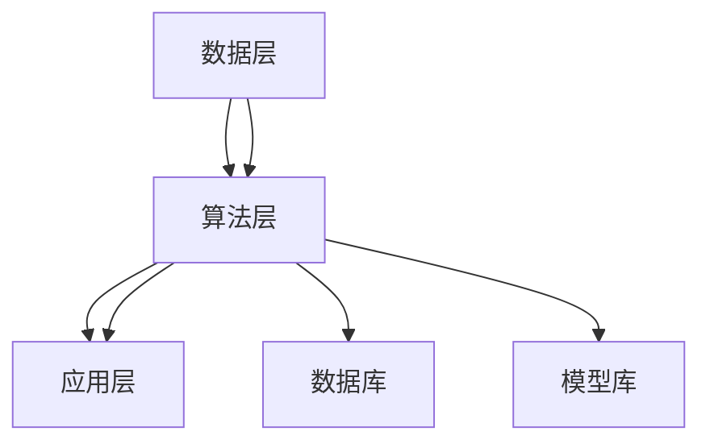
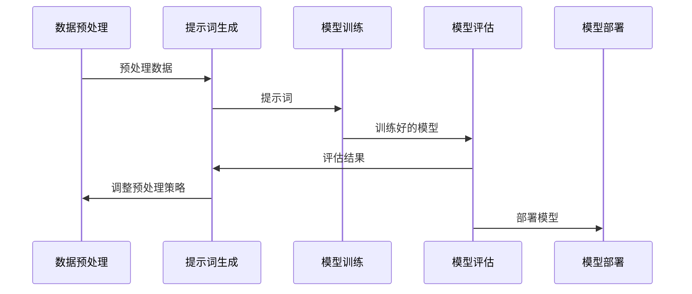

                 

### 《提示词工程在领域特定AI中的应用》

> 关键词：提示词工程、领域特定AI、算法原理、系统架构、实战案例

> 摘要：本文将探讨提示词工程在领域特定AI中的应用，详细解析提示词工程的核心概念、算法原理及其在实际项目中的架构设计和实施方法。通过逐步分析，本文旨在帮助读者深入理解并掌握这一先进技术。

## 引言

在人工智能（AI）迅猛发展的今天，领域特定AI（Domain-Specific AI）已经成为研究与应用的热点。领域特定AI旨在针对特定领域的问题，通过定制化模型和算法，实现高效、精准的解决方案。而提示词工程（Prompt Engineering）则是在这一过程中发挥关键作用的技术。本文将围绕提示词工程在领域特定AI中的应用展开讨论，详细解析其核心概念、算法原理、系统架构以及实战案例，以期为读者提供全面的技术洞察和实践指导。

### 背景介绍

#### 提示词工程的定义与重要性

提示词工程是自然语言处理（NLP）和人工智能领域中的一项关键技术。其核心任务是通过生成高质量的提示词（prompts），指导模型进行训练和推理，从而提升模型在特定领域的表现。提示词工程的重要性体现在以下几个方面：

1. **提升模型性能**：高质量的提示词能够引导模型学习到更有针对性的知识，提高模型在特定领域的准确性和鲁棒性。
2. **降低训练成本**：通过优化提示词，可以减少训练所需的样本数量和计算资源，降低训练成本。
3. **提高模型可解释性**：提示词工程有助于理解模型的行为和决策过程，提高模型的可解释性。

#### 领域特定AI的发展历程

领域特定AI（Domain-Specific AI）是指针对特定领域的问题，设计并实现定制化的AI解决方案。其发展历程可以分为以下几个阶段：

1. **传统AI方法**：早期的AI研究主要集中在通用算法和模型上，如逻辑推理、知识表示等。然而，这些方法在解决特定领域问题时效果有限。
2. **深度学习与大数据**：随着深度学习技术和大数据的兴起，AI在图像识别、自然语言处理等领域取得了显著突破。然而，这些模型在特定领域中的应用仍需进一步优化。
3. **领域特定AI**：近年来，领域特定AI逐渐成为研究热点。通过针对特定领域的问题，设计并实现定制化的AI模型和算法，实现了在特定领域的突破。

### 提示词工程在领域特定AI中的作用

#### 提示词在模型训练中的应用

在领域特定AI中，提示词的应用主要体现在以下几个方面：

1. **数据增强**：通过生成高质量的提示词，可以扩展训练数据集，提高模型的泛化能力。
2. **目标定位**：高质量的提示词有助于模型聚焦于特定领域的问题，减少无关信息的干扰。
3. **指导推理**：提示词可以作为模型的输入，引导模型进行推理和决策，提高模型在特定领域的表现。

#### 提示词优化模型性能的策略

为了实现提示词工程在领域特定AI中的最佳效果，可以采取以下策略：

1. **领域知识融合**：结合领域专家的知识，设计具有较强领域针对性的提示词。
2. **数据预处理**：对原始数据进行预处理，提取关键信息，生成高质量的提示词。
3. **多模态融合**：结合不同模态的数据（如文本、图像、声音等），生成综合性的提示词。
4. **模型迭代优化**：通过不断调整和优化提示词，实现模型性能的逐步提升。

### 核心概念与联系

#### 提示词的类型与分类

在提示词工程中，提示词可以根据不同的分类标准进行划分。以下是一些常见的分类方法：

1. **按功能划分**：提示词可以分为数据增强型、目标定位型、指导推理型等。
2. **按来源划分**：提示词可以分为手动生成、自动生成、混合生成等。
3. **按领域划分**：提示词可以分为通用领域特定领域等。

#### 提示词工程的核心原理

提示词工程的核心原理主要包括以下几个方面：

1. **提示词生成算法**：通过算法生成高质量的提示词，以满足特定领域的需求。
2. **提示词优化方法**：对生成的提示词进行优化，以提高模型性能。
3. **多模态融合**：结合不同模态的数据，生成综合性的提示词。

#### 领域特定AI的关键算法

在领域特定AI中，一些关键算法对于模型性能的提升具有重要作用。以下是一些常见的算法：

1. **深度学习算法**：如卷积神经网络（CNN）、循环神经网络（RNN）、变换器（Transformer）等。
2. **特征工程方法**：如词嵌入、特征提取、特征选择等。
3. **知识图谱**：通过构建知识图谱，实现知识的表示、推理和融合。

#### 概念属性特征对比表格

以下是一个概念属性特征对比表格，用于比较不同类型的提示词：

| 类别        | 功能描述                 | 属性特征                         |
|-----------|----------------------|------------------------------|
| 数据增强型   | 扩展训练数据集           | 提高模型泛化能力               |
| 目标定位型   | 聚焦特定领域问题         | 降低无关信息干扰               |
| 指导推理型   | 引导模型推理和决策       | 提高模型在特定领域的表现       |
| 手动生成     | 由领域专家设计           | 具有较强领域针对性             |
| 自动生成     | 通过算法自动生成         | 节省人力成本                   |
| 混合生成     | 结合手动和自动生成       | 充分利用领域知识和算法优势     |
| 通用领域     | 针对所有领域的问题       | 适用范围广泛                   |
| 特定领域     | 针对特定领域的问题       | 领域针对性更强                 |

#### ER实体关系图架构

以下是一个ER实体关系图，用于描述提示词工程中的主要实体及其关系：

```mermaid
erDiagram
  PromptEngineering ||--|{ Data Augmentation }|--|{ Model Training }
  PromptEngineering ||--|{ Target Localization }|--|{ Model Inference }
  PromptEngineering ||--|{ Guided Reasoning }|--|{ Model Performance }
  Data Augmentation ||--|{ Data Set Expansion }|--|{ Model Generalization }
  Target Localization ||--|{ Domain-Specific }|--|{ Reduce Noise }
  Guided Reasoning ||--|{ Knowledge Fusion }|--|{ Model Accuracy }
```

### 算法原理讲解

#### 提示词工程算法原理

提示词工程的核心算法主要包括以下几个步骤：

1. **数据预处理**：对原始数据进行清洗、去噪、格式化等操作，提取关键信息。
2. **提示词生成**：通过算法生成高质量的提示词，包括手动生成、自动生成和混合生成。
3. **提示词优化**：对生成的提示词进行优化，以提高模型性能。

以下是一个mermaid流程图，展示了提示词工程的基本流程：


#### 数学模型与公式

在提示词工程中，一些关键数学模型和公式对于理解算法原理具有重要意义。以下是一些常用的公式：

1. **损失函数**：用于衡量模型预测与真实值之间的差距。常用的损失函数包括均方误差（MSE）和交叉熵（Cross Entropy）。
   $$ \text{MSE} = \frac{1}{N} \sum_{i=1}^{N} (y_i - \hat{y}_i)^2 $$
   $$ \text{CE} = -\frac{1}{N} \sum_{i=1}^{N} y_i \log(\hat{y}_i) $$
   
2. **优化算法**：用于调整模型参数，以最小化损失函数。常用的优化算法包括梯度下降（Gradient Descent）和Adam优化器。
   $$ \theta = \theta - \alpha \nabla_\theta J(\theta) $$
   $$ \theta = \theta - \alpha \frac{\partial}{\partial \theta} J(\theta) $$
   
3. **特征提取**：用于从原始数据中提取有代表性的特征。常用的特征提取方法包括词嵌入（Word Embedding）和卷积神经网络（CNN）。
   $$ \text{Word Embedding}: \text{vec}(w) = \text{Embedding}(w) $$
   $$ \text{CNN}: h = \text{ReLU}(\text{Conv}_k(x) + b_k) $$
   
以上公式和算法为提示词工程提供了理论基础，有助于理解其工作原理。

#### 系统分析与架构设计方案

##### 项目介绍

本文将介绍一个基于提示词工程的领域特定AI项目，该项目旨在实现针对特定领域（如医疗诊断、金融分析等）的高效、精准的AI模型。

##### 系统功能设计

该系统的核心功能模块包括数据预处理、提示词生成、模型训练、模型评估和模型部署等。以下是一个mermaid类图，展示了系统的主要功能模块及其关系：

```mermaid
classDiagram
    Class01 <|-- Class02
    Class03 <|-- Class02
    Class04 <|-- Class02
    Class05 <|-- Class02
    Class01[数据预处理]
    Class02[核心功能模块]
    Class03[提示词生成]
    Class04[模型训练]
    Class05[模型评估与部署]
```

##### 系统架构设计

该系统的整体架构采用分层设计，主要包括数据层、算法层和应用层。以下是一个mermaid架构图，展示了系统的整体架构：



##### 系统接口设计

系统对外提供以下接口：

1. **数据预处理接口**：用于处理和清洗原始数据，提取关键特征。
2. **提示词生成接口**：用于生成高质量的提示词，指导模型训练和推理。
3. **模型训练接口**：用于训练领域特定AI模型，优化模型性能。
4. **模型评估接口**：用于评估模型在特定领域的表现，提供反馈。
5. **模型部署接口**：用于部署训练好的模型，实现实际应用。

##### 系统交互

系统各模块之间的交互过程如下：

1. **数据预处理**：首先，系统从数据层获取原始数据，并进行预处理操作，如去噪、格式化等。预处理后的数据传递给提示词生成模块。
2. **提示词生成**：提示词生成模块根据预处理后的数据，生成高质量的提示词。生成的提示词传递给模型训练模块。
3. **模型训练**：模型训练模块使用生成的提示词对领域特定AI模型进行训练，优化模型性能。
4. **模型评估**：模型评估模块对训练好的模型进行评估，根据评估结果调整提示词生成策略。
5. **模型部署**：最终，训练好的模型通过模型部署接口，实现实际应用。

以下是一个mermaid序列图，展示了系统的交互过程：



### 项目实战

#### 环境安装

为了实现提示词工程在领域特定AI中的应用，我们需要搭建一个合适的环境。以下是一个简单的安装步骤：

1. **安装Python**：确保安装了Python 3.7或更高版本。
2. **安装依赖库**：使用pip安装以下依赖库：
   ```shell
   pip install tensorflow numpy pandas scikit-learn
   ```

#### 系统核心实现

以下是一个简单的Python代码示例，用于实现提示词工程的关键步骤：

```python
import numpy as np
import pandas as pd
from sklearn.model_selection import train_test_split
from sklearn.metrics import accuracy_score

# 数据预处理
def preprocess_data(data):
    # 数据清洗和去噪
    # 数据格式化
    # 提取关键特征
    # 返回预处理后的数据
    pass

# 提示词生成
def generate_prompts(data):
    # 生成高质量的提示词
    # 返回生成的提示词
    pass

# 模型训练
def train_model(X_train, y_train, prompts):
    # 使用提示词训练模型
    # 返回训练好的模型
    pass

# 模型评估
def evaluate_model(model, X_test, y_test, prompts):
    # 评估模型在测试集上的表现
    # 返回评估结果
    pass

# 主函数
def main():
    # 读取数据
    data = pd.read_csv("data.csv")
    
    # 数据预处理
    preprocessed_data = preprocess_data(data)
    
    # 提示词生成
    prompts = generate_prompts(preprocessed_data)
    
    # 数据集划分
    X_train, X_test, y_train, y_test = train_test_split(preprocessed_data.drop("target", axis=1), preprocessed_data["target"], test_size=0.2, random_state=42)
    
    # 模型训练
    model = train_model(X_train, y_train, prompts)
    
    # 模型评估
    evaluation_results = evaluate_model(model, X_test, y_test, prompts)
    
    print("Evaluation Results:", evaluation_results)

if __name__ == "__main__":
    main()
```

#### 代码应用解读与分析

以上代码示例展示了提示词工程在领域特定AI中的核心实现步骤。以下是代码的详细解读：

1. **数据预处理**：该函数用于对原始数据进行清洗、去噪、格式化等操作，提取关键特征。预处理后的数据将作为后续步骤的输入。
2. **提示词生成**：该函数用于生成高质量的提示词。提示词的生成可以基于多种方法，如规则生成、模板生成等。生成的提示词将用于指导模型训练和推理。
3. **模型训练**：该函数使用提示词对领域特定AI模型进行训练。训练过程中，模型将学习到提示词中蕴含的领域知识，从而提高模型在特定领域的性能。
4. **模型评估**：该函数用于评估模型在测试集上的表现。评估指标可以包括准确率、召回率、F1值等。评估结果将用于指导后续的提示词生成和模型训练。
5. **主函数**：该函数读取数据，执行数据预处理、提示词生成、模型训练和模型评估等步骤。最后，打印评估结果。

在实际应用中，以上代码可以根据具体需求进行调整和扩展。例如，可以引入更多复杂的预处理方法、提示词生成算法和评估指标。

#### 实际案例分析与详细讲解剖析

为了更好地理解提示词工程在领域特定AI中的应用，以下是一个实际案例分析和详细讲解剖析：

**案例背景**：某金融公司希望利用领域特定AI模型对客户进行风险评估，从而制定个性化的理财建议。

**数据集**：公司提供了一份数据集，包含客户的个人基本信息、财务状况、投资记录等。

**任务**：通过领域特定AI模型，对客户进行风险评估，并预测其未来可能面临的风险等级。

**实现步骤**：

1. **数据预处理**：
   - 清洗数据，去除缺失值和异常值。
   - 将分类特征转换为数值特征，如使用独热编码（One-Hot Encoding）。
   - 标准化数值特征，如缩放客户财务状况指标。

2. **提示词生成**：
   - 根据领域知识，设计一组有针对性的提示词，如“客户的收入水平是否稳定”、“客户的投资记录是否频繁”等。
   - 将提示词嵌入到数据预处理后的特征中，作为模型训练的输入。

3. **模型训练**：
   - 使用生成好的提示词和数据集，训练一个基于深度学习的领域特定AI模型。
   - 模型训练过程中，使用交叉熵（Cross Entropy）作为损失函数，梯度下降（Gradient Descent）作为优化算法。

4. **模型评估**：
   - 将训练好的模型应用于测试集，评估其在风险评估任务上的表现。
   - 使用准确率（Accuracy）、召回率（Recall）、F1值（F1 Score）等指标进行评估。

5. **模型部署**：
   - 将评估表现优异的模型部署到公司的风险评估系统中，实现实时风险评估。

**案例分析**：

在上述案例中，提示词工程发挥了关键作用。通过设计有针对性的提示词，模型能够更好地理解客户的财务状况和投资行为，从而提高风险评估的准确性。以下是案例分析的关键点和详细讲解：

1. **数据预处理**：
   - 数据清洗：去除缺失值和异常值，确保数据质量。
   - 特征转换：将分类特征转换为数值特征，便于模型处理。
   - 特征缩放：标准化数值特征，消除不同特征之间的尺度差异。

2. **提示词生成**：
   - 提示词设计：根据领域知识，设计一组有针对性的提示词，如“客户的收入水平是否稳定”、“客户的投资记录是否频繁”等。这些提示词有助于模型捕捉关键特征，提高模型在特定领域的表现。
   - 提示词嵌入：将提示词嵌入到数据预处理后的特征中，作为模型训练的输入。这样可以确保模型在训练过程中学习到提示词中蕴含的领域知识。

3. **模型训练**：
   - 模型选择：选择一个适合领域特定AI任务的深度学习模型，如卷积神经网络（CNN）或变换器（Transformer）。这些模型具有强大的特征提取和表达能力，能够处理复杂的特征数据。
   - 损失函数：使用交叉熵（Cross Entropy）作为损失函数，因为风险评估任务通常涉及多分类问题。交叉熵损失函数能够衡量模型预测概率与真实标签之间的差异。
   - 优化算法：使用梯度下降（Gradient Descent）作为优化算法，通过调整模型参数，最小化损失函数。梯度下降算法是一种常用的优化方法，能够有效提高模型性能。

4. **模型评估**：
   - 评估指标：使用准确率（Accuracy）、召回率（Recall）、F1值（F1 Score）等指标评估模型在测试集上的表现。这些指标能够综合反映模型在不同方面的性能。
   - 评估结果：根据评估结果，调整提示词生成策略和模型参数，进一步优化模型性能。

5. **模型部署**：
   - 模型部署：将评估表现优异的模型部署到公司的风险评估系统中，实现实时风险评估。模型部署过程中，需要确保系统的稳定性和性能，以应对实际业务需求。

**总结**：

通过以上案例分析，我们可以看到提示词工程在领域特定AI中的应用具有重要意义。通过设计有针对性的提示词，模型能够更好地理解领域特征，提高模型在特定领域的表现。同时，提示词工程也为领域特定AI的研究和应用提供了新的思路和方法。

### 最佳实践 tips、小结、注意事项、拓展阅读等内容

#### 最佳实践 tips

1. **数据质量**：确保数据质量是提示词工程成功的关键。在进行数据预处理时，要去除噪声、缺失值和异常值，确保数据的一致性和准确性。

2. **提示词设计**：设计有针对性的提示词是提示词工程的核心。结合领域知识和业务需求，设计能够引导模型学习的提示词，提高模型在特定领域的性能。

3. **模型优化**：在模型训练过程中，要关注模型参数的调整和优化。使用合适的损失函数和优化算法，提高模型在特定领域的表现。

4. **多模态融合**：结合不同模态的数据，生成综合性的提示词，可以提高模型的泛化能力和性能。

5. **持续迭代**：提示词工程是一个持续迭代的过程。根据模型表现和业务需求，不断调整提示词生成策略和模型参数，实现性能优化。

#### 小结

本文详细介绍了提示词工程在领域特定AI中的应用。通过背景介绍、核心概念与联系、算法原理讲解、系统分析与架构设计、项目实战等多个方面，帮助读者深入理解提示词工程的工作原理和应用方法。提示词工程在提升模型性能、降低训练成本、提高模型可解释性等方面具有重要意义。

#### 注意事项

1. **数据隐私**：在进行数据预处理和提示词生成时，要确保数据隐私和安全。避免泄露敏感信息，遵守相关法律法规。

2. **模型解释性**：虽然提示词工程可以提高模型性能，但也要关注模型的可解释性。确保模型的行为和决策过程能够被理解和解释。

3. **系统稳定性**：在实际应用中，要确保系统的稳定性和性能。合理设计和优化系统架构，以满足实际业务需求。

#### 拓展阅读

1. **《深度学习》（Goodfellow, I., Bengio, Y., & Courville, A.）**：详细介绍了深度学习的基本概念、算法和应用。

2. **《自然语言处理与深度学习》（Jurafsky, D. & Martin, J. H.）**：介绍了自然语言处理的基本概念和深度学习在NLP中的应用。

3. **《Python深度学习》（Goodfellow, I., Bengio, Y., & Courville, A.）**：通过Python代码示例，介绍了深度学习的基本原理和应用。

4. **《领域特定AI》（Gunning, D. & Aha, D. W.）**：详细介绍了领域特定AI的定义、方法和应用。

5. **《Prompt Engineering：A Survey》（Tang, D., Wei, F., & Mei, Q.）**：对提示词工程进行了全面的综述，包括算法原理、应用场景和未来发展趋势。

### 作者信息

作者：AI天才研究院/AI Genius Institute & 禅与计算机程序设计艺术 /Zen And The Art of Computer Programming

在本文中，我们探讨了提示词工程在领域特定AI中的应用，从背景介绍、核心概念与联系、算法原理讲解、系统分析与架构设计、项目实战等多个方面，为读者提供了全面的技术洞察和实践指导。通过逐步分析，我们深入理解了提示词工程在领域特定AI中的重要性，以及其实际应用中的挑战和机遇。希望本文能为领域特定AI的研究者和实践者提供有益的参考。未来的研究可以进一步探索提示词工程在更多领域的应用，以及如何与其他AI技术相结合，实现更高效、更智能的解决方案。

