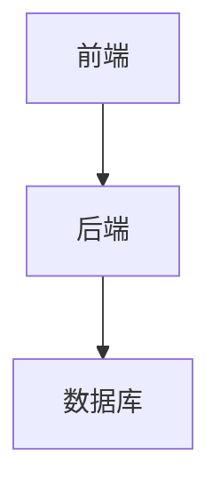
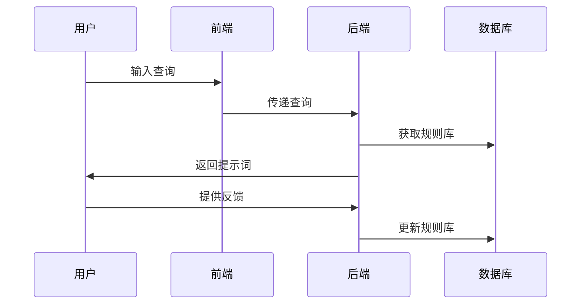

                 


### 关键词

AI时代、提示词工程师、职业前景、算法原理、系统架构设计、项目实战、案例分析、优化策略、职业发展

### 摘要

随着人工智能技术的飞速发展，提示词工程师成为AI时代最热门的职业之一。本文将深入探讨提示词工程师的职业背景、核心概念、算法原理、系统架构设计以及实战案例，帮助读者全面了解这一领域，并为其未来的职业发展提供指导。

---

## 第一部分：背景介绍

### 第1章：AI时代的到来与提示词工程师职业

#### 1.1 AI时代的定义与发展历程

人工智能（AI）是指计算机系统模拟人类智能行为的技术。AI的发展历程可以追溯到20世纪50年代，当时图灵提出了图灵测试这一概念，旨在判断机器是否具有智能。从那时起，AI经历了多个发展阶段，从最初的符号主义、连接主义，到现代的深度学习和强化学习，每一次进步都带来了革命性的变化。

#### 1.2 AI在各个领域的应用

AI技术的应用已经渗透到各个行业，从医疗、金融、交通到娱乐，都取得了显著的成果。特别是在自然语言处理（NLP）领域，AI的应用极大地提升了信息处理效率，使得智能客服、智能翻译、智能写作等成为现实。

#### 1.3 提示词工程师的职业定义与职责

提示词工程师是专门负责生成和优化提示词的专业人士。提示词是AI系统理解用户意图的关键，因此，提示词工程师需要具备强大的语言理解和文本处理能力，以及系统设计和优化能力。

#### 1.4 提示词工程师的职业前景

随着AI技术的不断进步，提示词工程师的职业前景十分广阔。根据市场研究机构的预测，未来几年内，AI领域的就业机会将大幅增长，提示词工程师将成为最热门的职业之一。

---

## 第二部分：核心概念与原理

### 第2章：提示词工程师的核心概念

#### 2.1 提示词的定义与类型

提示词是指用于引导AI系统理解用户意图的关键词语。根据用途，提示词可以分为以下几种类型：

- **通用提示词**：适用于各种场景的通用词语，如“帮助”、“搜索”等。
- **场景提示词**：针对特定场景的专用词语，如“航班查询”、“股票分析”等。

#### 2.2 提示词的生成方法

提示词的生成方法主要有以下几种：

- **基于规则的方法**：根据既定的规则生成提示词。
- **基于机器学习的方法**：通过训练数据集，让模型自动生成提示词。

#### 2.3 提示词的优化策略

提示词的优化策略包括以下几个方面：

- **质量优化**：提升提示词的准确性和相关性。
- **多样性优化**：增加提示词的多样性，以满足不同用户的需求。

---

### 第3章：提示词生成与优化算法原理

#### 3.1 提示词生成算法

提示词生成算法主要包括以下几种：

- **规则匹配算法**：通过匹配用户输入与规则库中的规则，生成提示词。
- **模板匹配算法**：将用户输入与模板进行匹配，生成提示词。

#### 3.2 提示词优化算法

提示词优化算法主要包括以下几种：

- **基于深度学习的优化算法**：使用神经网络模型对提示词进行优化。
- **基于强化学习的优化算法**：通过学习用户的反馈，不断优化提示词。

#### 3.3 提示词生成与优化的综合应用

在实际应用中，提示词生成与优化算法常常结合使用，以达到更好的效果。以下是一个简单的示例：

- **场景**：智能客服系统
- **过程**：首先使用规则匹配算法生成初步提示词，然后通过用户反馈和深度学习算法对提示词进行优化。

---

## 第三部分：系统设计与实战

### 第4章：提示词工程师的系统架构设计

#### 4.1 系统设计概述

提示词工程师的系统架构设计主要包括以下几个模块：

- **前端**：负责与用户交互，接收用户输入。
- **后端**：负责处理用户输入，生成和优化提示词。
- **数据库**：存储规则库、用户反馈等信息。

#### 4.2 系统架构设计

以下是一个简单的系统架构图：



#### 4.3 系统接口设计

系统接口设计主要包括以下接口：

- **用户输入接口**：接收用户输入。
- **提示词生成接口**：生成提示词。
- **提示词优化接口**：优化提示词。

#### 4.4 系统交互

以下是一个简单的系统交互序列图：



---

### 第5章：提示词工程的项目实战

#### 5.1 项目背景

本次项目是一个智能客服系统，旨在通过AI技术提高客服效率。

#### 5.2 环境安装与配置

- **操作系统**：Ubuntu 18.04
- **编程语言**：Python 3.8
- **框架**：TensorFlow 2.4

#### 5.3 系统核心实现

- **用户输入处理**：使用TensorFlow处理用户输入。
- **提示词生成**：使用神经网络模型生成提示词。
- **提示词优化**：使用强化学习算法优化提示词。

#### 5.4 代码应用解读与分析

以下是系统核心实现的部分代码：

```python
import tensorflow as tf

# 用户输入处理
def process_input(input_data):
    # ...处理输入数据...
    return processed_data

# 提示词生成
def generate_hint(processed_data):
    # ...生成提示词...
    return hint

# 提示词优化
def optimize_hint(hint, feedback):
    # ...优化提示词...
    return optimized_hint
```

#### 5.5 实际案例分析和详细讲解剖析

本次项目的一个实际案例是处理用户查询“航班延误”。

- **案例背景**：用户在智能客服系统中查询航班状态，提示词为“航班延误”。
- **分析**：系统通过用户输入和处理，生成提示词“航班延误”，然后根据用户反馈，对提示词进行优化，以提高用户的满意度。

#### 5.6 项目小结

通过本次项目，我们了解了智能客服系统的工作原理，以及提示词工程师在实际工作中的角色和职责。

---

### 第四部分：总结与拓展

### 第6章：提示词工程师的职业发展

#### 6.1 职业发展路径

- **初级提示词工程师**：负责提示词的生成和优化。
- **中级提示词工程师**：负责系统架构设计和项目实施。
- **高级提示词工程师**：负责技术指导和团队管理。

#### 6.2 职业规划建议

- **持续学习**：关注AI技术的最新动态，不断学习新知识。
- **实践经验**：参与实际项目，积累经验。

#### 6.3 拓展阅读资源

- **书籍**：《人工智能：一种现代方法》、《深度学习》
- **学术论文**：关注顶级会议和期刊，如AAAI、NeurIPS等。
- **行业报告**：了解行业趋势和市场动态。

---

## 参考文献

- Russell, S., & Norvig, P. (2016). 《人工智能：一种现代方法》. 清华大学出版社。
- Goodfellow, I., Bengio, Y., & Courville, A. (2016). 《深度学习》. 人民邮电出版社。

## 作者信息

作者：AI天才研究院/AI Genius Institute & 禅与计算机程序设计艺术 /Zen And The Art of Computer Programming

