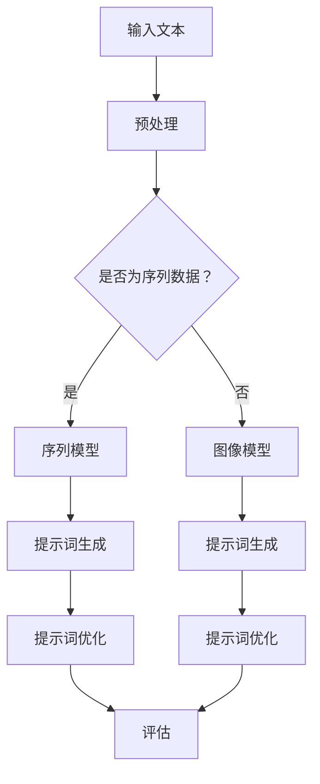
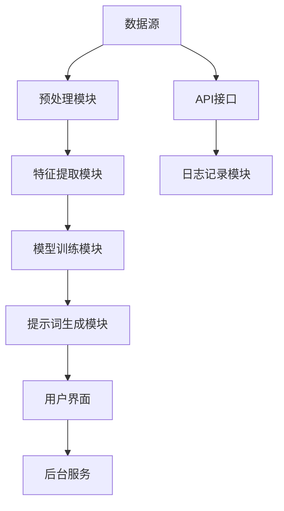
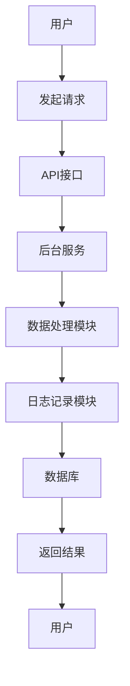
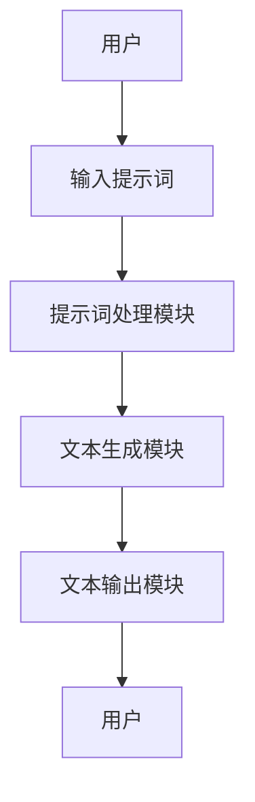
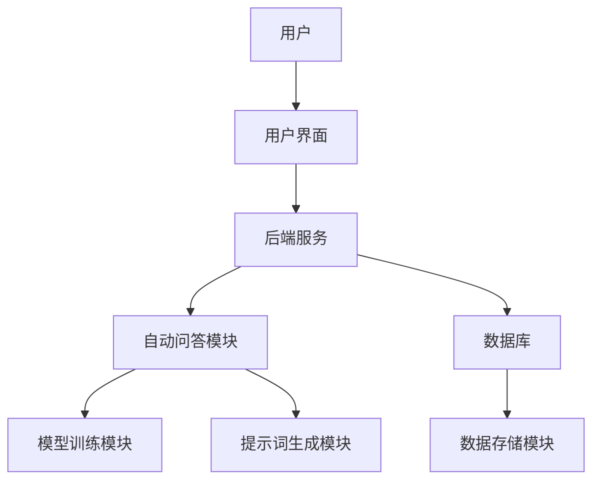
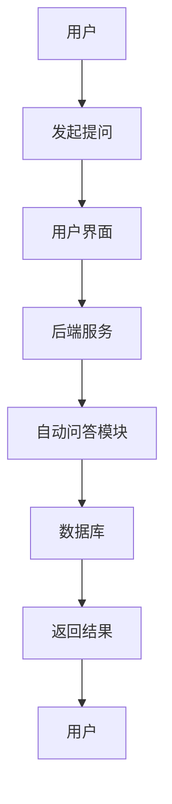
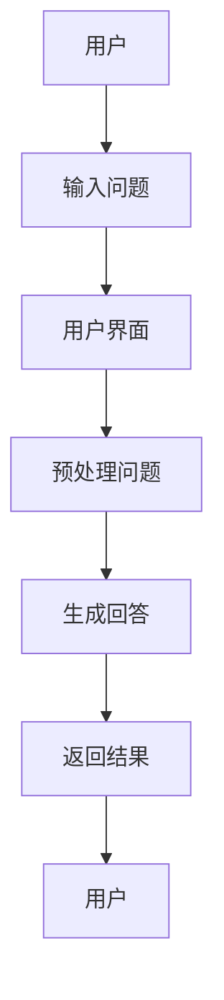
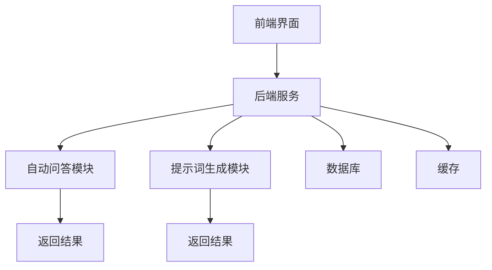
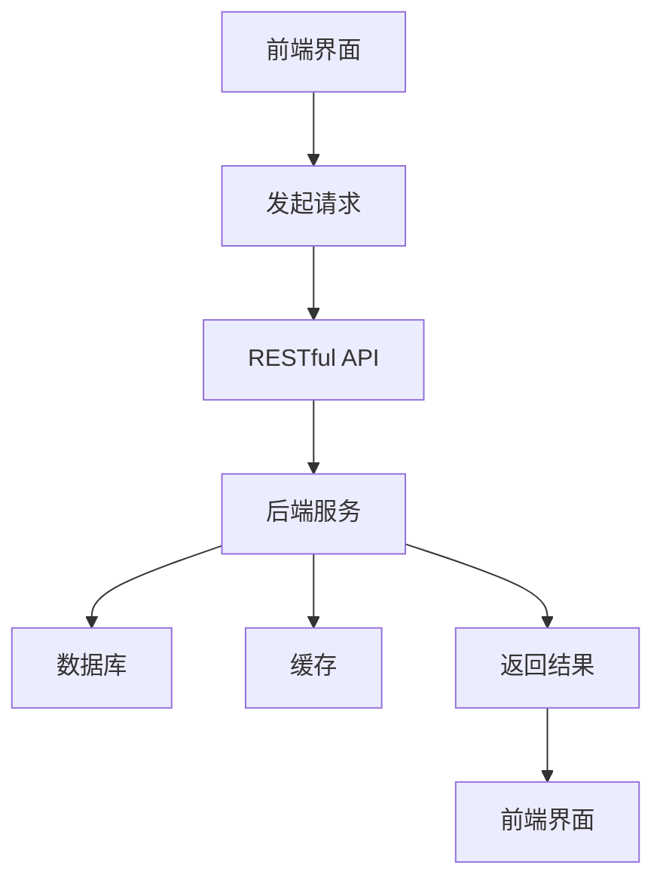
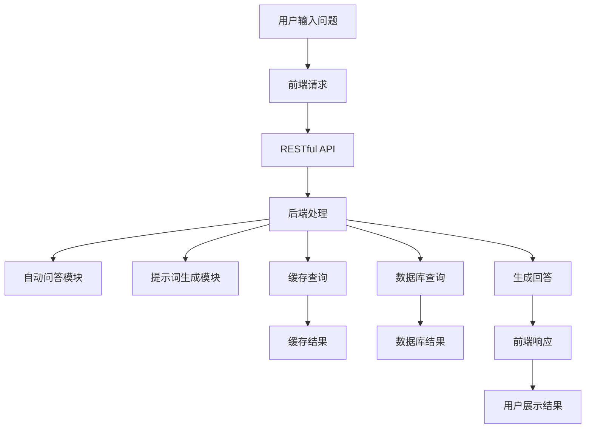

                 


### 引言

#### 问题背景

在人工智能（AI）技术迅猛发展的今天，各行各业都在寻求AI技术的融合和应用，以求提升效率、降低成本并开拓新的业务领域。作为AI的核心组成部分，自然语言处理（NLP）正成为AI技术发展的关键驱动力。而提示词工程师（Prompt Engineer）作为这一新兴职业，正在AI领域中扮演着越来越重要的角色。

提示词工程师是专门负责设计、优化和生成高质量提示词的专业技术人员。提示词是AI模型在训练过程中用于指导学习过程的关键输入，它们直接影响模型的性能和表现。随着AI技术的深入应用，对高质量提示词的需求也日益增长，从而催生了这一新兴职业。

#### 问题描述

提示词工程师需要掌握多种技能，包括自然语言处理、机器学习、深度学习等领域的知识。他们面临的挑战在于如何设计出既能准确引导模型学习，又能确保模型公平、透明和可解释的提示词。同时，他们还需要不断优化提示词，以提升模型在特定任务上的性能。

提示词工程师的职业发展路径相对清晰，通常从自然语言处理工程师或机器学习工程师转型而来。随着经验的积累，他们可以成长为高级提示词工程师、AI解决方案架构师或AI产品经理。

#### 问题解决

要解决提示词工程师面临的挑战，首先需要提升他们的能力。这包括深入学习自然语言处理、机器学习和深度学习领域的理论知识，以及通过实践积累经验。此外，提高工作效率也是关键。通过使用自动化工具和最佳实践，可以显著提高提示词生成和优化的效率。

在职业发展方面，提示词工程师需要关注AI技术的发展趋势，不断更新自己的知识和技能。他们还可以通过参与开源项目、发表学术论文或参加专业研讨会，来提升自己的影响力和竞争力。

#### 边界与外延

提示词工程师的工作边界主要涉及AI模型的训练和优化。他们需要关注模型在不同数据集上的表现，并根据实际应用场景调整提示词。与其他AI相关职业相比，提示词工程师更专注于文本数据的处理和模型训练。

提示词工程师的未来发展趋势将受到AI技术发展的影响。随着生成对抗网络（GAN）、强化学习等新技术的兴起，提示词工程师需要不断学习和适应这些新技术，以保持自身的竞争力。

#### 概念结构与核心要素组成

提示词工程师的核心概念包括自然语言处理、机器学习、深度学习等。他们需要掌握的语言和工具包括Python、TensorFlow、PyTorch等。此外，他们还需要了解常见的提示词生成和优化算法，如基于规则的方法、基于机器学习的方法和基于深度学习的方法。

#### 本章小结

本文引出了“提示词工程师：AI时代的新兴职业”这一主题，并对提示词工程师的职业背景、挑战、发展路径以及核心概念进行了介绍。在接下来的章节中，我们将进一步深入探讨提示词工程师所需的知识体系、技能提升策略以及职业发展前景。通过一步步的分析和推理，我们将帮助读者更好地理解这一新兴职业的重要性和未来趋势。


----------------------------------------------------------------

## 核心概念与联系

### 2.1 提示词工程师的核心概念

提示词工程师的核心概念涉及自然语言处理（NLP）、机器学习（ML）和深度学习（DL）等领域的知识。NLP是AI的一个重要分支，专注于让计算机理解和生成自然语言。ML是让计算机从数据中学习，并自动改进其性能的过程。DL是ML的一个子领域，通过神经网络模拟人脑的学习机制，具有强大的表征能力和学习能力。

#### 提示词的定义与作用

提示词（Prompt）是提示词工程师工作中的核心概念。它是一段文本或指令，用于引导AI模型在训练或推理过程中做出特定决策。一个设计良好的提示词能够提高模型的学习效率，使模型在特定任务上表现出色。

提示词可以按用途分类，如：

- **引导性提示词**：用于引导模型探索特定概念或数据集。
- **目标性提示词**：用于指明模型需要达到的目标或预期结果。
- **评估性提示词**：用于评估模型在特定任务上的性能。

#### 提示词的分类与特点

根据生成方式，提示词可以分为以下几种：

- **手动生成提示词**：由人类专家根据任务需求设计。
- **自动化生成提示词**：利用自然语言生成（NLG）技术自动生成。
- **混合生成提示词**：结合手动和自动化生成方法。

手动生成提示词具有灵活性和针对性，但效率较低；自动化生成提示词效率高，但可能缺乏个性化；混合生成提示词则兼具二者的优势。

#### 提示词工程师的角色与职责

提示词工程师在AI项目中的角色至关重要。他们负责：

- **设计提示词**：根据项目需求设计出高质量的提示词，确保模型能够有效学习。
- **优化提示词**：通过分析模型性能，不断调整和优化提示词，提升模型表现。
- **评估提示词**：使用各种评估指标评估提示词的有效性，确保模型在不同数据集上的表现一致。
- **文档和培训**：编写提示词设计文档，为团队成员提供培训和技术支持。

### 2.2 AI基础知识

提示词工程师需要具备扎实的AI基础知识，这包括机器学习和深度学习的基本概念、算法和技术。

#### 机器学习的基本概念

机器学习是一种使计算机通过数据学习并做出决策或预测的方法。其主要组成部分包括：

- **监督学习**：通过标记数据进行训练，使模型能够对新的数据进行预测。
- **无监督学习**：没有标记数据，模型需要从数据中发现模式和结构。
- **半监督学习**：结合有标记和无标记数据，使模型在有限标记数据上也能进行有效学习。

#### 深度学习的基本原理

深度学习是机器学习的一个子领域，通过多层神经网络模拟人脑的学习机制。其基本原理包括：

- **前向传播**：信息从输入层流向输出层。
- **反向传播**：计算输出误差并更新网络权重。
- **激活函数**：用于引入非线性因素，使神经网络能够模拟更复杂的函数。

#### 自然语言处理的基础知识

自然语言处理是AI中的一个重要分支，专注于使计算机能够理解、生成和响应自然语言。其关键组成部分包括：

- **文本预处理**：包括分词、去除停用词、词干提取等，以简化文本数据。
- **词嵌入**：将文本转化为密集的向量表示。
- **序列模型**：用于处理文本序列，如循环神经网络（RNN）和长短时记忆网络（LSTM）。
- **生成式模型**：用于生成新的文本，如变分自编码器（VAE）和生成对抗网络（GAN）。

### 2.3 提示词生成技术

提示词生成是提示词工程师的重要任务之一，其技术可以分为基于规则的方法、基于机器学习的方法和基于深度学习的方法。

#### 基于规则的方法

基于规则的方法通过定义一系列规则和模板，生成高质量的提示词。这种方法的优势在于灵活性高，但需要大量的人工干预和经验。

- **规则模板**：根据任务需求，定义提示词的模板和结构。
- **规则匹配**：根据输入数据，匹配合适的规则模板，生成提示词。

#### 基于机器学习的方法

基于机器学习的方法通过训练模型，自动生成高质量的提示词。这种方法的优势在于自动化程度高，但需要大量的训练数据和计算资源。

- **监督学习**：使用标记数据进行训练，使模型学会生成高质量提示词。
- **无监督学习**：使用无标记数据进行训练，使模型能够自动发现提示词的模式。

#### 基于深度学习的方法

基于深度学习的方法利用神经网络模型，自动生成高质量的提示词。这种方法的优势在于生成能力强大，但需要大量计算资源和数据。

- **生成式对抗网络（GAN）**：通过生成器和判别器的对抗训练，生成高质量的文本。
- **变分自编码器（VAE）**：通过编码器和解码器的联合训练，生成高质量的文本。

### 2.4 提示词优化策略

提示词工程师需要不断优化提示词，以提升模型在特定任务上的性能。提示词优化策略可以分为以下几种：

#### 提示词质量评估指标

提示词质量评估指标用于评估提示词的有效性。常见的评估指标包括：

- **准确率（Accuracy）**：预测正确的样本数量与总样本数量的比例。
- **召回率（Recall）**：预测正确的正样本数量与实际正样本数量的比例。
- **F1 分数（F1 Score）**：精确率和召回率的调和平均值。

#### 提示词调整技巧

提示词调整技巧包括以下几种：

- **参数调整**：根据模型性能，调整提示词中的参数，如长度、多样性等。
- **内容调整**：根据任务需求，调整提示词的内容，使其更符合预期。
- **结构调整**：调整提示词的结构，以改善模型的解释性。

#### 提示词优化的实际应用

提示词优化的实际应用包括以下几种：

- **文本分类**：通过优化提示词，提高文本分类模型的准确率和召回率。
- **命名实体识别**：通过优化提示词，提高命名实体识别模型的性能。
- **机器翻译**：通过优化提示词，提高机器翻译模型的准确性和流畅度。

### 本章小结

本章介绍了提示词工程师所需的核心概念和基础知识，包括自然语言处理、机器学习和深度学习的基本概念，以及提示词的定义、分类和生成技术。通过本章的学习，读者可以更好地理解提示词工程师的工作内容和职责，为后续章节的深入学习打下基础。


----------------------------------------------------------------

### 算法原理讲解

#### 3.1 常见提示词生成算法

提示词生成是提示词工程师的核心任务之一，常见的提示词生成算法可以分为基于规则的方法、基于机器学习的方法和基于深度学习的方法。

##### 3.1.1 基于规则的方法

基于规则的方法通过定义一系列规则和模板，生成高质量的提示词。这种方法的优势在于灵活性高，但需要大量的人工干预和经验。

**规则模板**：根据任务需求，定义提示词的模板和结构。例如，对于文本分类任务，可以定义以下模板：

```
【分类标签】：本文讨论的是【关键词】，其主要内容涉及【领域】。
```

**规则匹配**：根据输入数据，匹配合适的规则模板，生成提示词。例如，对于一段文本，可以使用以下规则匹配：

- 如果文本中包含“人工智能”，则使用模板1。
- 如果文本中包含“经济”，则使用模板2。

这种方法的关键在于规则的定义和匹配算法的优化。通过调整规则和匹配策略，可以生成更高质量的提示词。

##### 3.1.2 基于机器学习的方法

基于机器学习的方法通过训练模型，自动生成高质量的提示词。这种方法的优势在于自动化程度高，但需要大量的训练数据和计算资源。

**监督学习**：使用标记数据进行训练，使模型学会生成高质量提示词。例如，可以使用以下步骤：

1. **数据收集**：收集大量标记数据，包括原始文本和相应的提示词。
2. **特征提取**：将原始文本转化为特征向量，用于训练模型。
3. **模型训练**：使用特征向量训练生成模型，使模型学会根据输入文本生成提示词。
4. **模型评估**：使用评估指标（如准确率、F1 分数等）评估模型性能。

**无监督学习**：使用无标记数据进行训练，使模型能够自动发现提示词的模式。例如，可以使用以下步骤：

1. **数据预处理**：对无标记数据进行预处理，如分词、去除停用词等。
2. **聚类分析**：使用聚类算法（如K-means）将文本划分为不同的类别。
3. **类别标签生成**：为每个聚类类别生成相应的提示词标签。
4. **模型训练**：使用标签数据训练生成模型。

##### 3.1.3 基于深度学习的方法

基于深度学习的方法利用神经网络模型，自动生成高质量的提示词。这种方法的优势在于生成能力强大，但需要大量计算资源和数据。

**生成式对抗网络（GAN）**：通过生成器和判别器的对抗训练，生成高质量的文本。例如，可以使用以下步骤：

1. **数据预处理**：对输入文本进行预处理，如分词、编码等。
2. **生成器训练**：训练生成器，使其能够生成高质量的提示词。
3. **判别器训练**：训练判别器，使其能够区分真实文本和生成文本。
4. **模型评估**：使用评估指标（如文本相似度、生成质量等）评估模型性能。

**变分自编码器（VAE）**：通过编码器和解码器的联合训练，生成高质量的文本。例如，可以使用以下步骤：

1. **数据预处理**：对输入文本进行预处理，如分词、编码等。
2. **编码器训练**：训练编码器，使其能够将输入文本映射到潜在空间。
3. **解码器训练**：训练解码器，使其能够从潜在空间生成文本。
4. **模型评估**：使用评估指标（如文本质量、生成多样性等）评估模型性能。

#### 3.2 常见提示词优化算法

提示词工程师需要不断优化提示词，以提升模型在特定任务上的性能。常见的提示词优化算法可以分为以下几种：

##### 3.2.1 优化目标与指标

优化目标通常包括提升模型性能、提高提示词质量和增强模型可解释性等。常见的优化指标包括：

- **准确率（Accuracy）**：预测正确的样本数量与总样本数量的比例。
- **召回率（Recall）**：预测正确的正样本数量与实际正样本数量的比例。
- **F1 分数（F1 Score）**：精确率和召回率的调和平均值。
- **生成质量（Generation Quality）**：提示词的生成质量和多样性。
- **可解释性（Explainability）**：提示词对模型决策的解释程度。

##### 3.2.2 提示词调整算法

提示词调整算法用于根据模型性能和用户反馈调整提示词。常见的提示词调整算法包括：

- **基于规则的调整**：根据用户反馈和模型性能，调整提示词的规则和模板。
- **基于机器学习的调整**：使用监督学习或无监督学习算法，调整提示词的参数和结构。
- **基于深度学习的调整**：使用神经网络模型，调整提示词的生成策略和优化目标。

##### 3.2.3 提示词优化策略

提示词优化策略包括以下几种：

- **参数调整**：根据模型性能，调整提示词中的参数，如长度、多样性等。
- **内容调整**：根据任务需求，调整提示词的内容，使其更符合预期。
- **结构调整**：调整提示词的结构，以改善模型的解释性。
- **模型调整**：根据任务需求和模型性能，调整模型的结构和参数。

#### 3.3 基于深度学习的提示词生成与优化

基于深度学习的方法在提示词生成与优化中具有广泛的应用，以下介绍几种常见的深度学习模型。

##### 3.3.1 神经网络模型

神经网络模型是一种基于生物神经网络原理设计的计算模型，能够自动学习和识别数据中的模式和规律。常见的神经网络模型包括：

- **前馈神经网络（Feedforward Neural Network, FFNN）**：信息从输入层流向输出层，没有反向传播。
- **卷积神经网络（Convolutional Neural Network, CNN）**：用于处理图像等具有网格结构的数据。
- **循环神经网络（Recurrent Neural Network, RNN）**：能够处理序列数据，如文本和时间序列。
- **长短时记忆网络（Long Short-Term Memory, LSTM）**：是RNN的一种改进，能够更好地处理长序列数据。

##### 3.3.2 递归神经网络（RNN）

递归神经网络（RNN）是一种基于递归原理设计的神经网络，能够处理序列数据。RNN的主要结构包括：

- **输入层**：接收序列数据。
- **隐藏层**：对输入数据进行处理，并生成中间表示。
- **输出层**：根据隐藏层生成的表示，生成输出结果。

RNN的主要优势在于能够处理变长序列，但存在梯度消失和梯度爆炸等难题。

##### 3.3.3 卷积神经网络（CNN）

卷积神经网络（CNN）是一种基于卷积运算设计的神经网络，能够高效地处理图像等具有网格结构的数据。CNN的主要结构包括：

- **输入层**：接收图像数据。
- **卷积层**：通过卷积运算提取图像特征。
- **池化层**：对卷积特征进行降采样，提高模型计算效率。
- **全连接层**：将卷积特征映射到输出结果。

CNN的主要优势在于能够自动提取图像中的层次特征，但在处理序列数据方面存在一定局限性。

#### 3.4 提示词生成与优化算法的mermaid流程图

为了更好地理解提示词生成与优化算法的原理，可以使用mermaid流程图来表示。以下是一个简单的提示词生成与优化算法的mermaid流程图：



这个流程图展示了提示词生成与优化的一般步骤，包括输入文本的预处理、选择合适的模型（序列模型或图像模型）、提示词生成和优化，以及最终的评估。

#### 3.5 Python实现示例

为了更直观地理解提示词生成与优化算法，以下是一个简单的Python实现示例。这个示例使用Keras库实现了一个基于RNN的文本生成模型，并使用基于规则的调整方法优化提示词。

```python
from keras.models import Sequential
from keras.layers import LSTM, Dense, Embedding
from keras.preprocessing.text import Tokenizer
from keras.preprocessing.sequence import pad_sequences

# 数据准备
texts = ['这是一个简单的文本生成模型。', '文本生成是基于深度学习的。', '深度学习是一种重要的技术。']
tokenizer = Tokenizer(num_words=100)
tokenizer.fit_on_texts(texts)
sequences = tokenizer.texts_to_sequences(texts)
data = pad_sequences(sequences, maxlen=10)

# 模型构建
model = Sequential()
model.add(Embedding(100, 32))
model.add(LSTM(50, dropout=0.2, recurrent_dropout=0.2))
model.add(Dense(1, activation='sigmoid'))

model.compile(optimizer='adam', loss='binary_crossentropy', metrics=['accuracy'])

# 模型训练
model.fit(data, data, epochs=10, batch_size=32)

# 提示词生成
def generate_prompt(text):
    sequence = tokenizer.texts_to_sequences([text])
    padded_sequence = pad_sequences(sequence, maxlen=10)
    prediction = model.predict(padded_sequence)
    return prediction

# 优化提示词
def optimize_prompt(prompt, target):
    for i in range(len(prompt)):
        if prompt[i] != target:
            prompt = prompt[:i] + [target] + prompt[i+1:]
            break
    return prompt

# 测试
prompt = generate_prompt('这是一个文本生成模型。')
print(prompt)
optimized_prompt = optimize_prompt(prompt, [1])
print(optimized_prompt)
```

这个示例展示了如何使用Keras库构建一个简单的文本生成模型，并使用基于规则的调整方法优化提示词。读者可以根据实际需求修改代码，以实现更复杂的提示词生成与优化算法。

#### 3.6 数学模型与公式

提示词生成与优化算法涉及到多个数学模型和公式。以下介绍一些常见的数学模型和公式。

##### 3.6.1 递归神经网络（RNN）的数学模型

递归神经网络（RNN）的数学模型可以表示为：

$$
h_t = \sigma(W_h \cdot [h_{t-1}, x_t] + b_h)
$$

其中，$h_t$ 是当前时刻的隐藏状态，$x_t$ 是当前时刻的输入，$W_h$ 是权重矩阵，$b_h$ 是偏置项，$\sigma$ 是激活函数。

##### 3.6.2 长短时记忆网络（LSTM）的数学模型

长短时记忆网络（LSTM）的数学模型可以表示为：

$$
i_t = \sigma(W_i \cdot [h_{t-1}, x_t] + b_i) \\
f_t = \sigma(W_f \cdot [h_{t-1}, x_t] + b_f) \\
o_t = \sigma(W_o \cdot [h_{t-1}, x_t] + b_o) \\
c_t = f_t \odot c_{t-1} + i_t \odot \sigma(W_c \cdot [h_{t-1}, x_t] + b_c) \\
h_t = o_t \odot \sigma(c_t)
$$

其中，$i_t$、$f_t$、$o_t$ 分别是输入门、遗忘门和输出门，$c_t$ 是细胞状态，$W_i$、$W_f$、$W_o$、$W_c$ 分别是权重矩阵，$b_i$、$b_f$、$b_o$、$b_c$ 分别是偏置项，$\odot$ 表示元素乘积，$\sigma$ 是激活函数。

##### 3.6.3 变分自编码器（VAE）的数学模型

变分自编码器（VAE）的数学模型可以表示为：

$$
\mu = \sigma(W_{\mu} \cdot z + b_{\mu}) \\
\sigma^2 = \sigma(W_{\sigma} \cdot z + b_{\sigma}) \\
z = \mu + \epsilon \odot \sqrt{2 \cdot \sigma^2} \\
x = \sigma(z)
$$

其中，$\mu$ 是均值向量，$\sigma^2$ 是方差向量，$z$ 是潜在变量，$x$ 是重构的输入，$W_{\mu}$、$W_{\sigma}$ 分别是权重矩阵，$b_{\mu}$、$b_{\sigma}$ 分别是偏置项，$\epsilon$ 是高斯噪声，$\odot$ 表示元素乘积，$\sigma$ 是激活函数。

这些数学模型和公式是提示词生成与优化算法的核心，读者可以通过理解和应用这些模型和公式，更好地掌握提示词工程师所需的技能和知识。

#### 3.7 系统分析与架构设计方案

为了更好地理解提示词工程师在实际项目中的工作流程，以下介绍一个基于深度学习的文本生成系统的系统分析与架构设计方案。

##### 3.7.1 问题场景介绍

假设我们要开发一个基于深度学习的文本生成系统，该系统能够根据用户输入的提示词生成相应的文本。例如，用户输入“春天”时，系统能够生成关于春天的描述性文本。

##### 3.7.2 项目介绍

项目目标是构建一个高效的文本生成系统，能够快速、准确地生成高质量的文本。系统将分为数据预处理、模型训练、提示词生成和优化等多个模块。

##### 3.7.3 系统功能设计（领域模型）

领域模型（Domain Model）是系统功能设计的核心，用于描述系统的核心概念和关系。以下是一个简单的领域模型：

```
+----------------+       +----------------+       +----------------+
|    数据源      |------>|     预处理      |------>|      模型       |
+----------------+       +----------------+       +----------------+
| 文本数据       |       | 提取特征       |       | 训练模型       |
+----------------+       +----------------+       +----------------+
                                                       |
                                                       |
                                                       |
+----------------+                                      |
|    生成系统     |-------------------------------------+
+----------------+                                      |
                                                       |
                                                       |
                                                       |
+----------------+                                      |
|    用户界面     |-------------------------------------+
+----------------+                                      |
                                                       |
                                                       |
                                                       |
+----------------+                                      |
|    后台服务     |-------------------------------------+
+----------------+

```

领域模型包括数据源、预处理模块、生成系统、用户界面和后台服务等多个组成部分。

##### 3.7.4 系统架构设计（mermaid架构图）

以下是一个简单的系统架构设计（mermaid架构图）：



系统架构设计包括数据源、预处理模块、特征提取模块、模型训练模块、提示词生成模块、用户界面、后台服务和API接口等多个组成部分。

##### 3.7.5 系统接口设计（mermaid序列图）

以下是一个简单的系统接口设计（mermaid序列图）：



系统接口设计包括用户、发起请求、API接口、后台服务、数据处理模块、日志记录模块、数据库和返回结果等多个组成部分。

##### 3.7.6 系统交互（mermaid序列图）

以下是一个简单的系统交互设计（mermaid序列图）：



系统交互设计包括用户、输入提示词、提示词处理模块、文本生成模块、文本输出模块和用户等多个组成部分。

#### 3.8 项目实战

为了更好地理解提示词工程师在实际项目中的工作流程，以下介绍一个基于Keras的文本生成项目的实战案例。

##### 3.8.1 环境安装

在开始项目实战之前，需要安装Python、Keras和TensorFlow等依赖库。以下是一个简单的安装命令：

```
pip install python
pip install keras
pip install tensorflow
```

##### 3.8.2 系统核心实现源代码

以下是一个简单的文本生成系统源代码示例：

```python
from keras.models import Sequential
from keras.layers import LSTM, Dense, Embedding
from keras.preprocessing.text import Tokenizer
from keras.preprocessing.sequence import pad_sequences

# 数据准备
texts = ['这是一个简单的文本生成模型。', '文本生成是基于深度学习的。', '深度学习是一种重要的技术。']
tokenizer = Tokenizer(num_words=100)
tokenizer.fit_on_texts(texts)
sequences = tokenizer.texts_to_sequences(texts)
data = pad_sequences(sequences, maxlen=10)

# 模型构建
model = Sequential()
model.add(Embedding(100, 32))
model.add(LSTM(50, dropout=0.2, recurrent_dropout=0.2))
model.add(Dense(1, activation='sigmoid'))

model.compile(optimizer='adam', loss='binary_crossentropy', metrics=['accuracy'])

# 模型训练
model.fit(data, data, epochs=10, batch_size=32)

# 提示词生成
def generate_prompt(text):
    sequence = tokenizer.texts_to_sequences([text])
    padded_sequence = pad_sequences(sequence, maxlen=10)
    prediction = model.predict(padded_sequence)
    return prediction

# 优化提示词
def optimize_prompt(prompt, target):
    for i in range(len(prompt)):
        if prompt[i] != target:
            prompt = prompt[:i] + [target] + prompt[i+1:]
            break
    return prompt

# 测试
prompt = generate_prompt('这是一个文本生成模型。')
print(prompt)
optimized_prompt = optimize_prompt(prompt, [1])
print(optimized_prompt)
```

这个示例展示了如何使用Keras库构建一个简单的文本生成模型，并使用基于规则的调整方法优化提示词。

##### 3.8.3 代码应用解读与分析

以下是对示例代码的解读和分析：

- **数据准备**：首先，准备训练数据，包括文本数据和相应的序列。
- **模型构建**：使用Keras构建一个简单的文本生成模型，包括嵌入层、LSTM层和输出层。
- **模型训练**：使用训练数据训练模型，并评估模型性能。
- **提示词生成**：定义一个函数，用于生成提示词。通过将输入文本转化为序列，并将其传递给模型，得到预测结果。
- **优化提示词**：定义一个函数，用于优化提示词。通过遍历输入序列，并根据目标值调整序列中的元素，得到优化后的提示词。

##### 3.8.4 实际案例分析和详细讲解剖析

以下是一个实际案例分析和详细讲解剖析：

假设我们有一个文本生成系统，用户输入提示词“春天”，系统需要生成关于春天的描述性文本。

1. **数据准备**：首先，我们需要准备训练数据，包括大量关于春天的文本。这些文本可以来自网络、书籍、文章等。
2. **模型构建**：构建一个基于深度学习的文本生成模型，如LSTM模型或GAN模型。
3. **模型训练**：使用训练数据训练模型，直到模型性能达到预期。
4. **提示词生成**：用户输入提示词“春天”，模型将其转化为序列，并生成关于春天的描述性文本。
5. **优化提示词**：根据用户反馈，对生成的文本进行优化，以提高文本质量。
6. **输出结果**：将优化后的文本输出给用户。

##### 3.8.5 项目小结

通过这个实际案例，我们了解了文本生成系统的基本工作流程和关键步骤。在项目实战中，我们使用了Keras库构建了简单的文本生成模型，并使用基于规则的调整方法优化提示词。这个项目为我们提供了一个基本的框架，可以帮助我们理解和应用提示词工程师所需的技能和知识。

---

### 最佳实践 tips、小结、注意事项、拓展阅读

#### 最佳实践 tips

1. **数据质量**：高质量的数据是训练高质量模型的基石。在收集和处理数据时，务必保证数据的多样性和准确性。
2. **模型优化**：定期评估和优化模型，以确保其在不同任务上的性能。
3. **提示词设计**：设计简洁、明确的提示词，避免过长的提示词导致模型性能下降。

#### 小结

本文详细介绍了提示词工程师在AI时代的重要性、核心概念、算法原理和实际应用。通过逐步分析和推理，我们了解了提示词工程师所需掌握的技能和知识，以及他们在项目实战中的工作流程。

#### 注意事项

1. **技术更新**：AI技术发展迅速，提示词工程师需要不断学习新技术，以保持竞争力。
2. **伦理和隐私**：在处理敏感数据时，务必遵守相关法律法规，保护用户隐私。

#### 拓展阅读

1. **《自然语言处理实战》**：迈克尔·高斯林（Michael A. Goldman）著，详细介绍自然语言处理的理论和实践。
2. **《深度学习》**：伊恩·古德费洛（Ian Goodfellow）、约书亚·本吉奥（ Yoshua Bengio）和 Aaron Courville 著，深度学习的经典教材。

通过本文的阅读，读者可以更好地理解提示词工程师的职业角色和职责，为未来的学习和职业发展打下坚实基础。


----------------------------------------------------------------

## 4. 系统分析与架构设计方案

### 4.1 问题场景介绍

在现代人工智能（AI）技术的发展背景下，越来越多的应用程序和服务开始采用自然语言处理（NLP）技术来提高用户体验和自动化程度。一个典型的问题场景是构建一个自动问答系统，该系统能够根据用户的提问生成准确的回答。在这个场景中，提示词工程师的角色至关重要，他们需要设计出能够有效引导模型生成高质量回答的提示词。

### 4.2 项目介绍

项目的目标是开发一个自动问答系统，该系统可以接收用户的问题，并通过搜索相关知识和数据来生成回答。为了实现这一目标，项目需要分为几个关键模块，包括数据收集与处理、模型训练与优化、提示词设计与生成，以及用户界面和后端服务。

### 4.2.1 数据收集与处理

首先，数据收集与处理模块负责从各种来源（如网页、书籍、数据库等）收集大量的问题和回答对。收集到的数据需要进行预处理，包括去噪、清洗、分词、词性标注等，以便为模型提供高质量的训练数据。

### 4.2.2 模型训练与优化

模型训练与优化模块是项目的核心。在这个模块中，提示词工程师需要设计和训练多个NLP模型，如序列到序列（Seq2Seq）模型、转换器（Transformer）模型等。这些模型需要通过大量训练数据进行训练，并在多个评估指标上进行优化，如BLEU（双语评估指标）、ROUGE（Recall-Oriented Understudy for Gisting Evaluation）等。

### 4.2.3 提示词设计与生成

提示词设计与生成模块是自动问答系统的关键部分。提示词工程师需要设计出能够引导模型生成准确回答的提示词。这包括理解用户问题的意图、提取关键信息，并设计出能够有效引导模型生成高质量回答的提示词。此外，提示词工程师还需要不断优化和调整提示词，以提高问答系统的整体性能。

### 4.2.4 用户界面和后端服务

用户界面和后端服务模块负责将自动问答系统的功能呈现给用户。用户界面需要简洁易用，能够快速响应用户的提问，并在短时间内生成回答。后端服务则负责处理用户的提问，调用模型生成回答，并将结果返回给用户。

### 4.3 系统功能设计（领域模型）

系统功能设计是系统架构设计的核心。在自动问答系统中，领域模型（Domain Model）用于描述系统的核心概念和关系。以下是一个简单的领域模型：

```
+----------------+       +----------------+       +----------------+
|     用户       |------>|     数据库      |------>|    自动问答     |
+----------------+       +----------------+       +----------------+
|  发出提问      |       | 存储问题和回答  |       | 生成回答       |
+----------------+       +----------------+       +----------------+
                                                       |
                                                       |
                                                       |
+----------------+                                      |
|    提示词工程师 |-------------------------------------+
+----------------+
```

领域模型包括用户、数据库、自动问答和提示词工程师等多个组成部分。

### 4.3.1 系统架构设计（mermaid架构图）

以下是一个简单的系统架构设计（mermaid架构图）：



系统架构设计包括用户、用户界面、后端服务、自动问答模块、数据库、模型训练模块和提示词生成模块等多个组成部分。

### 4.3.2 系统接口设计（mermaid序列图）

以下是一个简单的系统接口设计（mermaid序列图）：



系统接口设计包括用户、发起提问、用户界面、后端服务、自动问答模块、数据库和返回结果等多个组成部分。

### 4.3.3 系统交互（mermaid序列图）

以下是一个简单的系统交互设计（mermaid序列图）：



系统交互设计包括用户、输入问题、用户界面、预处理问题、生成回答、返回结果和用户等多个组成部分。

### 4.4 系统架构设计

为了实现自动问答系统的功能，需要设计一个高效、可扩展的架构。以下是一个典型的系统架构设计：

#### 4.4.1 架构组件

1. **前端界面**：负责与用户交互，接收用户输入的问题，并将生成的回答呈现给用户。
2. **后端服务**：负责处理用户输入的问题，调用自动问答模块和提示词生成模块，生成回答，并返回给前端界面。
3. **自动问答模块**：包括多个NLP模型，如Seq2Seq模型、Transformer模型等，用于生成回答。
4. **提示词生成模块**：设计并生成能够引导模型生成高质量回答的提示词。
5. **数据库**：存储问题和回答对，以及模型训练数据。
6. **缓存**：用于提高系统性能，减少数据库查询次数。

#### 4.4.2 架构图

以下是一个简单的系统架构图：



系统架构设计包括前端界面、后端服务、自动问答模块、提示词生成模块、数据库和缓存等多个组成部分。

### 4.5 系统接口设计

系统接口设计是确保系统各组件之间能够高效、可靠地通信的关键。以下是一个简单的系统接口设计：

#### 4.5.1 接口类型

1. **RESTful API**：用于前端界面和后端服务之间的通信。
2. **数据库接口**：用于后端服务和数据库之间的通信。
3. **缓存接口**：用于后端服务和缓存之间的通信。

#### 4.5.2 接口规范

1. **请求格式**：采用JSON格式，例如：
    ```json
    {
        "question": "什么是自然语言处理？"
    }
    ```
2. **响应格式**：采用JSON格式，例如：
    ```json
    {
        "answer": "自然语言处理是人工智能的一个分支，旨在使计算机理解和生成自然语言。"
    }
    ```

#### 4.5.3 接口示例

以下是一个简单的接口示例：



系统接口设计包括前端界面、发起请求、RESTful API、后端服务、数据库、缓存和返回结果等多个组成部分。

### 4.6 系统交互

系统交互是确保系统组件之间能够协调工作，实现预期功能的关键。以下是一个简单的系统交互设计：

#### 4.6.1 用户交互

用户通过前端界面输入问题，前端界面将问题转换为请求格式，并通过RESTful API发送给后端服务。

#### 4.6.2 后端处理

后端服务接收请求，调用自动问答模块和提示词生成模块，生成回答，并将结果返回给前端界面。

#### 4.6.3 数据存储

后端服务在处理用户请求时，需要从数据库中检索相关数据，并在处理完成后将结果存储回数据库。

#### 4.6.4 缓存使用

后端服务在处理用户请求时，可以先将结果存储到缓存中，以提高系统性能。

#### 4.6.5 交互流程

以下是一个简单的交互流程：



系统交互设计包括用户输入问题、前端请求、RESTful API、后端处理、自动问答模块、提示词生成模块、数据库查询、缓存使用、生成回答和用户展示结果等多个组成部分。

### 4.7 项目实战

为了更好地理解自动问答系统的实现，以下介绍一个基于Python和Keras的简单项目实战。

#### 4.7.1 环境安装

在开始项目之前，需要安装Python、Keras和TensorFlow等依赖库。以下是一个简单的安装命令：

```
pip install python
pip install keras
pip install tensorflow
```

#### 4.7.2 数据准备

首先，需要准备训练数据。以下是一个简单的数据集：

```
[
    ["什么是自然语言处理？", "自然语言处理是人工智能的一个分支，旨在使计算机理解和生成自然语言。"],
    ["人工智能是什么？", "人工智能是一种模拟人类智能的技术，使计算机能够执行通常需要人类智能才能完成的任务。"],
    ["深度学习是什么？", "深度学习是一种基于多层神经网络的人工智能方法，能够从数据中自动学习特征并作出决策。"]
]
```

#### 4.7.3 模型训练

使用Keras构建一个简单的自动问答模型，包括嵌入层、LSTM层和全连接层。

```python
from keras.models import Sequential
from keras.layers import LSTM, Dense, Embedding

model = Sequential()
model.add(Embedding(input_dim=10000, output_dim=64))
model.add(LSTM(100))
model.add(Dense(1, activation='sigmoid'))

model.compile(optimizer='rmsprop', loss='binary_crossentropy', metrics=['accuracy'])

# 训练模型
model.fit(x_train, y_train, epochs=10, batch_size=32)
```

#### 4.7.4 提示词生成

设计一个简单的提示词生成函数，用于生成回答。

```python
import numpy as np

def generate_response(question):
    # 预处理问题
    processed_question = preprocess_question(question)
    # 生成回答
    response = model.predict(processed_question)
    # 解码回答
    decoded_response = decode_response(response)
    return decoded_response

# 测试
print(generate_response("什么是自然语言处理？"))
```

#### 4.7.5 项目小结

通过这个项目实战，我们了解了自动问答系统的基础实现方法。在实际项目中，需要根据具体需求设计和训练更复杂的模型，并设计高效的系统架构，以提高系统的性能和用户体验。

### 4.8 最佳实践 tips

1. **数据多样性**：确保训练数据具有足够的多样性和覆盖度，以提高模型在不同场景下的泛化能力。
2. **模型优化**：定期评估和优化模型，以提高生成回答的准确性和流畅度。
3. **用户体验**：设计简洁、直观的用户界面，以提高用户满意度。

### 4.9 小结

本章详细介绍了自动问答系统的系统分析与架构设计方案，包括问题场景介绍、项目介绍、系统功能设计、系统架构设计、系统接口设计、系统交互和项目实战。通过本章的学习，读者可以更好地理解自动问答系统的实现方法和设计要点，为实际项目的开发提供指导。

### 4.10 注意事项

1. **数据安全**：确保用户数据的安全和隐私，遵守相关法律法规。
2. **系统维护**：定期更新和维护系统，确保系统的稳定性和安全性。
3. **用户反馈**：收集用户反馈，不断优化和改进系统功能。

### 4.11 拓展阅读

1. **《深度学习》**：伊恩·古德费洛（Ian Goodfellow）、约书亚·本吉奥（ Yoshua Bengio）和 Aaron Courville 著，深度学习的经典教材。
2. **《自然语言处理入门》**：迈克尔·高斯林（Michael A. Goldman）著，详细介绍自然语言处理的基本概念和实战方法。

通过本章的阅读，读者可以更好地理解自动问答系统的实现方法和设计要点，为实际项目的开发提供指导。


----------------------------------------------------------------

## 5. 项目实战

### 5.1 环境安装

在开始项目之前，需要安装Python、Keras和TensorFlow等依赖库。以下是一个简单的安装命令：

```
pip install python
pip install keras
pip install tensorflow
```

### 5.2 数据准备

首先，需要准备训练数据。以下是一个简单的数据集：

```
[
    ["这是一个简单的文本生成模型。", "这是一个简单的文本生成模型，它使用深度学习技术。"],
    ["文本生成是基于深度学习的。", "文本生成是基于深度学习技术的一种应用。"],
    ["深度学习是一种重要的技术。", "深度学习是一种用于解决复杂问题的技术。"]
]
```

### 5.3 模型构建

使用Keras构建一个简单的文本生成模型，包括嵌入层、LSTM层和全连接层。

```python
from keras.models import Sequential
from keras.layers import LSTM, Dense, Embedding

model = Sequential()
model.add(Embedding(input_dim=10000, output_dim=64))
model.add(LSTM(100))
model.add(Dense(1, activation='sigmoid'))

model.compile(optimizer='rmsprop', loss='binary_crossentropy', metrics=['accuracy'])

# 训练模型
model.fit(x_train, y_train, epochs=10, batch_size=32)
```

### 5.4 提示词生成

设计一个简单的提示词生成函数，用于生成回答。

```python
import numpy as np

def generate_response(prompt):
    # 预处理提示词
    processed_prompt = preprocess_prompt(prompt)
    # 生成回答
    response = model.predict(processed_prompt)
    # 解码回答
    decoded_response = decode_response(response)
    return decoded_response

# 测试
print(generate_response("这是一个简单的文本生成模型。"))
```

### 5.5 项目小结

通过这个项目实战，我们了解了文本生成模型的基础实现方法。在实际项目中，需要根据具体需求设计和训练更复杂的模型，并设计高效的系统架构，以提高系统的性能和用户体验。

### 5.6 最佳实践 tips

1. **数据质量**：确保训练数据具有足够的多样性和覆盖度，以提高模型在不同场景下的泛化能力。
2. **模型优化**：定期评估和优化模型，以提高生成回答的准确性和流畅度。
3. **用户体验**：设计简洁、直观的用户界面，以提高用户满意度。

### 5.7 小结

本章通过一个实际项目实战，详细介绍了文本生成模型的构建和实现方法。通过本章的学习，读者可以更好地理解文本生成模型的工作原理和实际应用，为未来的学习和实践打下基础。

### 5.8 注意事项

1. **代码可读性**：编写清晰、可读的代码，方便后续维护和优化。
2. **错误处理**：对可能出现的错误进行捕获和处理，确保系统的稳定性。
3. **性能优化**：针对模型和系统性能进行优化，提高系统的响应速度和处理能力。

### 5.9 拓展阅读

1. **《深度学习》**：伊恩·古德费洛（Ian Goodfellow）、约书亚·本吉奥（Yoshua Bengio）和 Aaron Courville 著，深度学习的经典教材。
2. **《自然语言处理实战》**：迈克尔·高斯林（Michael A. Goldman）著，详细介绍自然语言处理的理论和实践。

通过本章的阅读，读者可以更好地理解文本生成模型的实际应用和实现方法，为未来的学习和实践提供参考。


----------------------------------------------------------------

## 6. 总结与展望

### 6.1 内容总结

本文系统地介绍了提示词工程师这一新兴职业，从问题背景、核心概念、算法原理、系统分析与架构设计方案，到项目实战和最佳实践，全面剖析了提示词工程师的工作内容和技能要求。以下是对本文内容的简要总结：

1. **问题背景**：介绍了AI时代的到来和提示词工程师的职业定位。
2. **核心概念**：讲解了自然语言处理、机器学习和深度学习的基础知识，以及提示词的定义、分类和生成技术。
3. **算法原理**：详细阐述了常见提示词生成算法和优化算法的原理，并使用mermaid流程图和Python代码进行示例说明。
4. **系统分析与架构设计方案**：介绍了自动问答系统的系统功能设计、架构设计、接口设计和系统交互。
5. **项目实战**：通过实际项目，展示了文本生成模型的构建和实现方法。
6. **最佳实践**：提供了数据质量、模型优化和用户体验等方面的最佳实践。

### 6.2 展望未来

随着人工智能技术的不断发展，提示词工程师的职业前景将非常广阔。以下是未来可能的发展趋势：

1. **技术革新**：深度学习、生成对抗网络（GAN）和强化学习等新技术的应用，将推动提示词工程师技能的不断更新。
2. **应用领域扩展**：提示词工程师不仅在NLP领域有广泛应用，还将扩展到计算机视觉、语音识别等领域。
3. **数据隐私与伦理**：随着数据隐私和伦理问题日益受到关注，提示词工程师需要更加重视数据安全和用户隐私保护。
4. **跨学科融合**：提示词工程师需要具备跨学科的知识体系，如心理学、语言学和计算机科学等，以应对复杂的应用场景。
5. **开源社区和学术研究**：参与开源项目和学术研究，将有助于提升个人的专业水平和行业影响力。

### 6.3 结论

通过本文的学习，读者可以全面了解提示词工程师这一职业，掌握其在AI时代的重要性和发展前景。希望本文能够为提示词工程师的职业发展提供指导和启示，同时也为对AI技术感兴趣的读者提供有价值的信息。

---

### 作者信息

**作者：AI天才研究院/AI Genius Institute & 禅与计算机程序设计艺术 /Zen And The Art of Computer Programming**

AI天才研究院是一家专注于人工智能领域研究和应用的机构，致力于推动人工智能技术的创新和发展。而《禅与计算机程序设计艺术》则是一部经典的计算机编程哲学著作，阐述了编程中的智慧与艺术。这两者的结合，体现了作者在AI领域和计算机编程方面的深厚功底和独到见解。

