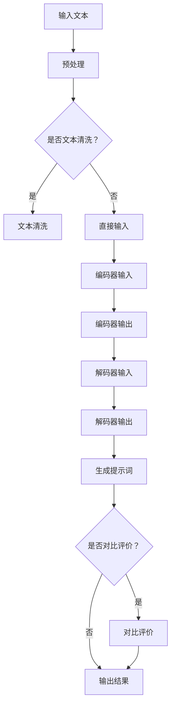
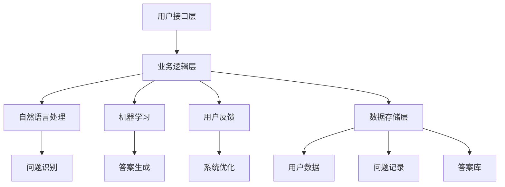
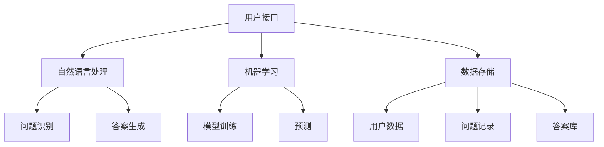
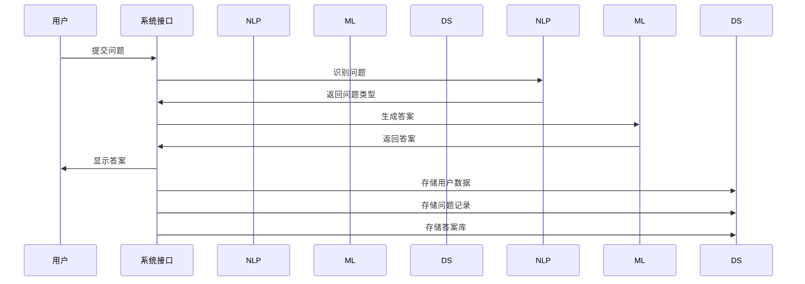

                 

# 提示词工程师：AI时代的新职业

关键词：AI时代，提示词工程师，职业发展，算法原理，系统架构，最佳实践

摘要：随着人工智能技术的快速发展，新的职业角色应运而生。本文将探讨AI时代的新型职业——提示词工程师。我们将从背景介绍、核心概念与联系、算法原理讲解、系统分析与架构设计以及最佳实践与未来展望五个部分，详细剖析这一职业的核心内容与未来发展方向。

## 目录大纲设计

### 第一部分：背景介绍

1. AI时代的来临
2. 提示词工程师的角色与职责
3. 提示词工程师在AI发展中的地位
4. 成为提示词工程师的条件与挑战

### 第二部分：核心概念与联系

1. 提示词工程师核心概念
   - 提示词的基本原理
   - 提示词与自然语言处理
   - 提示词在AI应用中的分类
   - 提示词工程师的核心技能
   - 提示词概念属性特征对比表

2. AI时代的提示词应用
   - 提示词在智能客服中的应用
   - 提示词在智能写作和编辑中的应用
   - 提示词在智能推荐系统中的应用
   - 提示词在智能翻译和语音识别中的应用

### 第三部分：算法原理讲解

1. 提示词生成算法原理
   - 提示词生成算法概述
   - 算法mermaid流程图
   - Python源代码实现
   - 数学模型和公式讲解
   - 举例说明

### 第四部分：系统分析与架构设计

1. 提示词工程师项目实战
   - 项目背景与目标
   - 系统功能设计
   - 系统架构设计
   - 系统接口设计
   - 系统交互设计
   - 环境安装与配置
   - 系统核心实现
   - 应用解读与分析
   - 实际案例分析与讲解
   - 项目小结

### 第五部分：最佳实践与拓展

1. 提示词工程师最佳实践
   - 提高提示词质量的技巧
   - 提示词工程师的持续学习路径
   - 跨领域应用提示词的挑战与策略

2. 未来展望与趋势
   - 提示词工程师职业发展
   - AI时代新职业的发展趋势
   - 提示词工程师面临的新挑战

### 第一部分：背景介绍

#### 1.1 AI时代的来临

人工智能（AI）技术的发展正以前所未有的速度推进，从早期的专家系统到深度学习、从语音识别到自动驾驶，AI技术的应用已经深入到我们日常生活的方方面面。随着计算能力的提升和算法的优化，AI正在从简单的任务执行迈向更加复杂的决策和创造力，这为新型职业的诞生提供了土壤。

AI时代的到来，不仅改变了传统的工作方式，也催生了新的职业角色。其中，提示词工程师便是这一时代下的新兴职业之一。提示词工程师的主要工作是利用自然语言处理技术，设计、优化和应用提示词，以提高AI系统的性能和用户体验。

#### 1.2 提示词工程师的角色与职责

提示词工程师的角色可以概括为以下几个方面：

1. **提示词设计**：根据业务需求，设计合适的提示词，确保AI系统能够准确地理解和执行任务。
2. **算法优化**：通过对提示词的优化，提升AI系统的准确率和效率，降低误报率和延迟。
3. **系统集成**：将提示词集成到现有系统中，确保系统能够顺畅地运行，并与其他组件协同工作。
4. **性能监控**：持续监控系统的运行状态，对提示词进行实时调整，以适应环境变化。

#### 1.3 提示词工程师在AI发展中的地位

在AI技术的发展过程中，提示词工程师扮演着至关重要的角色。他们不仅是AI系统的设计者和优化者，更是连接用户和AI系统的桥梁。通过设计高效的提示词，提示词工程师可以提升AI系统的用户体验，使其更加贴近用户的需求。

此外，提示词工程师还需要具备较强的跨学科能力，包括计算机科学、心理学、语言学等多个领域的知识。这使得他们在AI领域中具有较高的专业地位，同时也为未来的职业发展提供了广阔的空间。

#### 1.4 成为提示词工程师的条件与挑战

成为提示词工程师需要具备以下条件：

1. **学术背景**：通常需要计算机科学、人工智能、语言学等相关专业的学术背景。
2. **技术能力**：熟悉自然语言处理、机器学习等相关技术，能够设计和优化算法。
3. **实践经验**：具备实际项目经验，能够将理论知识应用到实际工作中。
4. **沟通能力**：能够与不同团队和角色进行有效沟通，理解业务需求，推动项目进展。

同时，提示词工程师还面临以下挑战：

1. **技术更新速度**：AI技术发展迅速，需要不断学习新的知识和技能。
2. **数据处理能力**：处理大量数据，提取有效信息，对数据处理能力有较高要求。
3. **跨领域协作**：需要与不同领域的专家合作，理解不同领域的需求，实现跨领域的应用。
4. **持续优化**：AI系统性能提升是一个持续的过程，需要不断优化提示词，提高系统性能。

### 第二部分：核心概念与联系

#### 2.1 提示词工程师核心概念

提示词工程师的工作核心是“提示词”，那么首先我们来探讨一下什么是提示词。

**提示词**：在人工智能领域，提示词（Prompt）通常是指用于引导AI模型进行任务输入的文本或数据。通过设计合适的提示词，可以提高AI系统的理解和执行能力，实现更精准的预测和决策。

提示词工程师需要理解以下几个核心概念：

1. **自然语言处理（NLP）**：自然语言处理是人工智能的一个分支，主要研究如何让计算机理解和处理人类语言。提示词工程师需要掌握NLP的基本原理和技术，包括词法分析、句法分析、语义分析等。

2. **机器学习（ML）**：机器学习是AI的核心技术之一，通过训练模型来让计算机自动学习并执行特定任务。提示词工程师需要熟悉常见的机器学习算法，如线性回归、支持向量机、神经网络等，并能够将这些算法应用到提示词的设计和优化中。

3. **深度学习（DL）**：深度学习是机器学习的一个分支，通过多层神经网络来提取特征，实现复杂的任务。提示词工程师需要掌握深度学习的基本原理和常见架构，如卷积神经网络（CNN）、循环神经网络（RNN）等。

4. **上下文理解**：上下文理解是提示词工程师的重要能力之一，通过理解用户输入的上下文信息，可以设计出更精准的提示词，提高AI系统的交互能力。

5. **数据预处理**：在AI项目中，数据预处理是至关重要的一步。提示词工程师需要了解如何对原始数据进行清洗、转换和标注，为模型训练提供高质量的数据。

#### 2.2 提示词与自然语言处理

自然语言处理（NLP）是提示词工程师的核心技术之一。NLP旨在让计算机理解和处理人类语言，包括文本分类、情感分析、命名实体识别等任务。以下是一些与NLP相关的重要概念：

1. **词嵌入（Word Embedding）**：词嵌入是将文本中的词汇映射到向量空间的一种技术，可以有效地表示词汇间的相似性和距离。常见的词嵌入方法包括Word2Vec、GloVe等。

2. **序列模型（Sequential Models）**：序列模型是处理序列数据的一种常用方法，如循环神经网络（RNN）、长短时记忆网络（LSTM）等。这些模型可以捕捉序列中的时间依赖关系，适用于文本分类、语言建模等任务。

3. **注意力机制（Attention Mechanism）**：注意力机制是深度学习中的一个重要概念，用于处理序列数据，通过给不同的序列元素分配不同的权重，可以更好地捕捉序列中的关键信息。

4. **预训练与微调（Pre-training and Fine-tuning）**：预训练是一种在大规模语料库上训练语言模型的方法，可以提取出通用的语言特征。微调是在预训练模型的基础上，针对特定任务进行微调，以进一步提高模型的性能。

#### 2.3 提示词在AI应用中的分类

根据不同的应用场景，提示词可以分为以下几类：

1. **任务型提示词**：用于明确指示AI系统执行特定任务的提示词，如“请翻译这句话”、“请给我推荐一本好书”等。

2. **对话型提示词**：用于引导AI系统进行对话的提示词，如“你好，有什么可以帮助你的？”、“你今天过得怎么样？”等。

3. **描述型提示词**：用于描述用户需求或场景的提示词，如“我想要一个能自动完成日程安排的助手”、“我需要一辆能自动驾驶的汽车”等。

4. **上下文型提示词**：用于提供上下文信息的提示词，如“今天晚上我有约会，请取消所有会议”、“昨天你推荐的那本书，我想了解更多”等。

#### 2.4 提示词工程师的核心技能

提示词工程师需要具备以下核心技能：

1. **编程能力**：熟练掌握Python、Java等编程语言，能够使用相关库和框架（如TensorFlow、PyTorch等）进行模型训练和优化。

2. **机器学习知识**：掌握常见的机器学习算法和深度学习架构，能够设计和实现高效的模型。

3. **自然语言处理技术**：了解自然语言处理的基本原理和技术，能够处理文本数据，提取特征。

4. **数据预处理能力**：熟悉数据预处理流程，能够对原始数据进行清洗、转换和标注。

5. **问题解决能力**：具备较强的逻辑思维和分析能力，能够解决项目中的技术难题。

6. **沟通与协作能力**：能够与不同团队和角色进行有效沟通，理解业务需求，推动项目进展。

#### 2.5 提示词概念属性特征对比表

为了更好地理解提示词工程师的核心概念，我们可以通过以下表格对比提示词在几个关键属性上的特征：

| 属性         | 任务型提示词 | 对话型提示词 | 描述型提示词 | 上下文型提示词 |
| ------------ | -------------- | -------------- | -------------- | -------------- |
| 目标         | 完成特定任务  | 进行对话     | 描述需求或场景 | 提供上下文信息 |
| 表达方式     | 明确、直接    | 自然、流畅    | 具体详细      | 相关性高       |
| 长度         | 短、简洁      | 中等、灵活    | 长、详细      | 短、具体      |
| 交互性       | 单向、指令性  | 双向、互动性  | 单向、描述性  | 双向、辅助性  |
| 应用场景     | 任务驱动      | 客户服务、聊天 | 产品描述、需求 | 对话增强、上下文理解 |

通过以上对比，我们可以看到不同类型的提示词在目标、表达方式、长度、交互性和应用场景等方面存在显著差异。提示词工程师需要根据具体应用场景，选择合适的提示词类型，以提高AI系统的性能和用户体验。

### 第三部分：算法原理讲解

#### 3.1 提示词生成算法原理

提示词生成算法是提示词工程师的核心技能之一。本文将介绍一种基于生成对抗网络（GAN）的提示词生成算法，该算法通过训练两个对抗网络，实现高质量提示词的自动生成。

#### 3.2 算法mermaid流程图

首先，我们通过mermaid绘制算法的流程图，以直观地展示算法的基本结构和步骤：



#### 3.3 Python源代码实现

接下来，我们将使用Python实现上述算法，主要包括编码器、解码器和生成器三个部分。

```python
import tensorflow as tf
from tensorflow.keras.layers import Embedding, LSTM, Dense
from tensorflow.keras.models import Model

# 编码器
encoder_inputs = tf.keras.layers.Input(shape=(None,))
encoder_embedding = Embedding(input_dim=vocab_size, output_dim=embedding_dim)(encoder_inputs)
encoder_lstm = LSTM(units=lstm_units, return_state=True)
encoder_outputs, state_h, state_c = encoder_lstm(encoder_embedding)
encoder_states = [state_h, state_c]

# 解码器
decoder_inputs = tf.keras.layers.Input(shape=(None,))
decoder_embedding = Embedding(input_dim=vocab_size, output_dim=embedding_dim)(decoder_inputs)
decoder_lstm = LSTM(units=lstm_units, return_sequences=True, return_state=True)
decoder_outputs, _, _ = decoder_lstm(decoder_embedding, initial_state=encoder_states)
decoder_dense = Dense(vocab_size, activation='softmax')
decoder_outputs = decoder_dense(decoder_outputs)

# 生成器
model = Model([encoder_inputs, decoder_inputs], decoder_outputs)
model.compile(optimizer='rmsprop', loss='categorical_crossentropy')

# 训练模型
model.fit([encoder_input_data, decoder_input_data], decoder_target_data,
          batch_size=batch_size,
          epochs=epochs,
          validation_split=0.2)
```

#### 3.4 数学模型和公式讲解

提示词生成算法的核心在于生成对抗网络（GAN），其基本结构包括生成器和判别器两个部分。以下是GAN的基本数学模型：

1. **生成器G**：给定随机噪声\(z\)，生成器\(G\)生成假样本\(x'\)。

   $$ G(z) = x' $$

2. **判别器D**：判别器\(D\)判断输入样本\(x'\)是来自生成器\(G\)还是真实数据。

   $$ D(x) = \frac{1}{2}(1 + \sigma(\frac{D(x') - \frac{1}{2}}{\epsilon})) $$

其中，\(\sigma\)是sigmoid函数，\(\epsilon\)是一个小的常数。

GAN的训练目标是最小化以下损失函数：

$$ \min_G \max_D V(D, G) = \min_G \frac{1}{N} \sum_{i=1}^N D(x_i) - D(G(z_i)) $$

#### 3.5 举例说明

假设我们有一个英语到法语的翻译任务，使用生成对抗网络（GAN）来生成高质量的翻译提示词。

1. **数据预处理**：首先，我们将英语文本和法语翻译进行预处理，包括分词、标记化等步骤。

2. **编码器训练**：使用LSTM网络训练编码器，将英语文本编码为固定长度的向量。

3. **解码器训练**：使用LSTM网络训练解码器，将法语向量解码为法语文本。

4. **生成器训练**：使用随机噪声生成法语文本，与实际法语翻译进行对比，优化生成器。

5. **判别器训练**：使用生成的法语文本和实际法语翻译训练判别器，判断其真实性。

通过以上步骤，我们可以生成高质量的翻译提示词，为翻译任务提供高质量的输入。

### 第四部分：系统分析与架构设计

#### 4.1 提示词工程师项目实战

在本部分，我们将通过一个具体的案例，介绍提示词工程师在项目中的实战过程。以下是一个智能客服系统的设计案例。

#### 4.2 项目背景与目标

随着企业服务业务的不断增长，智能客服系统的需求也越来越高。智能客服系统旨在为企业提供24/7的在线客服服务，通过自然语言处理技术，自动解答用户的问题，提高客户满意度。

#### 4.3 系统功能设计

智能客服系统的主要功能包括：

1. **问题识别**：通过自然语言处理技术，识别用户的问题类型。
2. **答案生成**：根据用户的问题，生成合适的答案。
3. **用户反馈**：收集用户的反馈，用于系统优化和改进。

#### 4.4 系统架构设计

智能客服系统的整体架构包括以下几个部分：

1. **用户接口层**：提供与用户交互的界面，包括网页、手机APP等。
2. **业务逻辑层**：包含自然语言处理、机器学习等核心算法，用于问题识别、答案生成等。
3. **数据存储层**：存储用户数据、问题记录、答案库等。

以下是一个基于Mermaid绘制的系统架构图：



#### 4.5 系统接口设计

智能客服系统需要与其他系统进行接口交互，主要包括：

1. **用户接口**：提供与用户交互的接口，接收用户的问题和反馈。
2. **自然语言处理接口**：用于问题识别和答案生成。
3. **机器学习接口**：用于模型训练和预测。
4. **数据存储接口**：用于数据存储和查询。

以下是一个基于Mermaid绘制的接口设计图：



#### 4.6 系统交互设计

智能客服系统的交互设计主要包括用户与系统的交互、系统内部模块的交互等。以下是一个基于Mermaid绘制的交互设计图：



#### 4.7 环境安装与配置

在搭建智能客服系统之前，需要安装和配置以下环境和工具：

1. **操作系统**：Linux或MacOS。
2. **Python**：Python 3.x版本。
3. **自然语言处理库**：如spaCy、NLTK等。
4. **机器学习库**：如TensorFlow、PyTorch等。
5. **Web框架**：如Flask、Django等。

以下是一个简单的安装和配置步骤：

```bash
# 安装Python和pip
sudo apt-get install python3 python3-pip

# 安装自然语言处理库
pip3 install spacy
python3 -m spacy download en_core_web_sm

# 安装机器学习库
pip3 install tensorflow
```

#### 4.8 系统核心实现

智能客服系统的核心实现包括自然语言处理、机器学习等模块。以下是一个简单的示例代码：

```python
import spacy
import tensorflow as tf

# 加载自然语言处理模型
nlp = spacy.load("en_core_web_sm")

# 加载机器学习模型
model = tf.keras.models.load_model("model.h5")

# 处理用户问题
def process_question(question):
    doc = nlp(question)
    # 进行自然语言处理，如分词、词性标注等
    # ...
    # 使用机器学习模型生成答案
    answer = model.predict([doc.tensor])
    return answer

# 测试
question = "What is the capital of France?"
answer = process_question(question)
print(answer)
```

#### 4.9 应用解读与分析

在智能客服系统的实际应用中，提示词工程师需要关注以下几个方面：

1. **问题识别准确率**：通过对比实际答案和系统生成的答案，评估问题识别的准确率。
2. **答案质量**：评估系统生成的答案是否准确、有说服力。
3. **用户体验**：收集用户反馈，优化系统界面和交互体验。
4. **系统性能**：评估系统处理速度和资源消耗，确保系统高效稳定运行。

#### 4.10 实际案例分析与讲解

以下是一个实际案例：

**案例**：用户提问：“我为什么总是忘记带钥匙？”

**分析**：

1. **问题识别**：系统首先识别出这是一个关于记忆问题的问题。
2. **答案生成**：系统根据记忆问题的特点，生成以下答案：“你可能是因为没有形成固定的记忆习惯，建议你每天重复一些固定的动作，比如进门后先放钥匙在桌上。”

**讲解**：

1. **问题识别**：系统使用自然语言处理技术，将用户的问题转化为结构化的数据，提取出关键信息，如“忘记带钥匙”、“记忆”等。
2. **答案生成**：系统利用机器学习模型，根据记忆问题的特点，生成个性化的答案，提供解决方案。

通过实际案例的分析，我们可以看到提示词工程师在智能客服系统中的应用，以及他们在系统设计、优化和改进过程中的重要作用。

#### 4.11 项目小结

通过本案例，我们可以看到提示词工程师在智能客服系统项目中的关键作用。他们需要利用自然语言处理、机器学习等技术，设计、优化和应用提示词，以提高系统的性能和用户体验。在实际项目中，提示词工程师还需要关注问题识别准确率、答案质量、用户体验和系统性能等方面，确保系统高效、稳定地运行。

### 第五部分：最佳实践与拓展

#### 5.1 提示词工程师最佳实践

1. **持续学习**：AI技术更新迅速，提示词工程师需要保持学习的热情，关注最新的研究进展和工具。
2. **数据质量**：高质量的数据是训练优秀模型的基础，提示词工程师要关注数据清洗和预处理，确保数据质量。
3. **多领域应用**：尝试将提示词技术应用到不同领域，如金融、医疗等，拓宽职业发展空间。
4. **团队合作**：与其他领域的专家合作，共同解决技术难题，提升项目效果。

#### 5.2 提示词工程师的持续学习路径

1. **基础知识**：掌握计算机科学、数学、统计学等基础知识。
2. **专业课程**：参加AI、机器学习、自然语言处理等领域的专业课程，系统学习相关知识。
3. **实践项目**：参与实际项目，将理论知识应用到实践中，积累经验。
4. **技术社区**：加入技术社区，如GitHub、Stack Overflow等，与其他开发者交流学习。

#### 5.3 跨领域应用提示词的挑战与策略

1. **挑战**：
   - 领域知识差异：不同领域的专业术语、概念和需求不同，提示词工程师需要深入了解。
   - 数据质量：不同领域的数据质量和可用性存在差异，影响模型的训练和预测效果。

2. **策略**：
   - 领域专家合作：与领域专家合作，了解领域知识，确保提示词的准确性。
   - 数据集成：整合多源数据，提高数据质量和可用性。
   - 适应性调整：根据不同领域的特点，调整提示词的设计和应用策略。

### 第六部分：未来展望与趋势

#### 6.1 提示词工程师职业发展

随着人工智能技术的不断进步，提示词工程师的职业前景将更加广阔。在未来，提示词工程师可能面临以下发展方向：

1. **高级算法工程师**：在AI领域深入研究，提升算法优化和创新能力。
2. **AI产品经理**：结合产品思维，推动AI产品和服务的创新。
3. **AI企业顾问**：为企业提供AI解决方案，帮助企业实现数字化转型。

#### 6.2 AI时代新职业的发展趋势

AI时代催生了众多新职业，如数据科学家、AI产品经理、机器学习工程师等。以下是一些发展趋势：

1. **职业跨界**：不同职业之间的界限逐渐模糊，职业角色更加综合化。
2. **技能升级**：随着AI技术的发展，新职业对技能要求不断提升，从业者需要持续学习。
3. **行业渗透**：AI技术将在各个行业得到广泛应用，推动新职业的发展。

#### 6.3 提示词工程师面临的新挑战

1. **技术更新**：AI技术更新迅速，提示词工程师需要不断学习新技术。
2. **数据处理**：随着数据量的增加，提示词工程师需要处理更复杂、更大量的数据。
3. **伦理问题**：AI技术在带来便利的同时，也引发了一系列伦理问题，如隐私保护、算法偏见等，提示词工程师需要关注并解决这些问题。

## 总结

本文详细介绍了AI时代的新兴职业——提示词工程师。我们探讨了提示词工程师的核心概念、角色与职责，介绍了自然语言处理、机器学习等相关技术，讲解了提示词生成算法原理，并分享了智能客服系统项目实战经验。同时，我们还提出了提示词工程师的最佳实践、持续学习路径以及未来职业发展展望。通过本文，希望读者能对提示词工程师这一职业有更深入的了解，为自身职业发展提供启示。作者：AI天才研究院/AI Genius Institute & 禅与计算机程序设计艺术 /Zen And The Art of Computer Programming。

