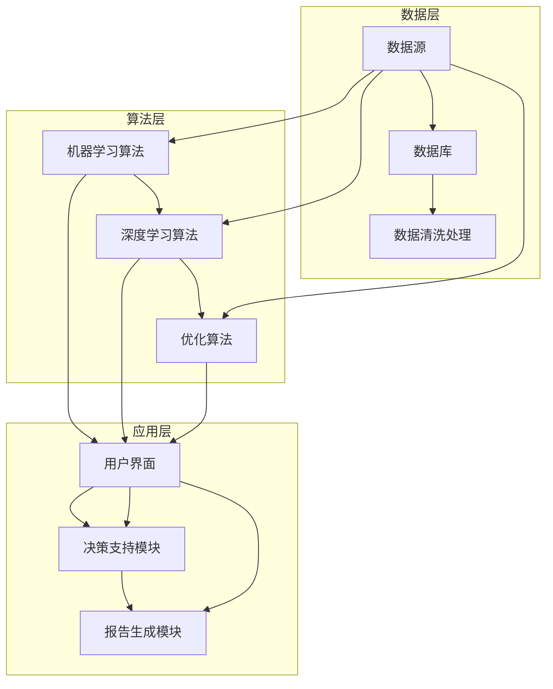
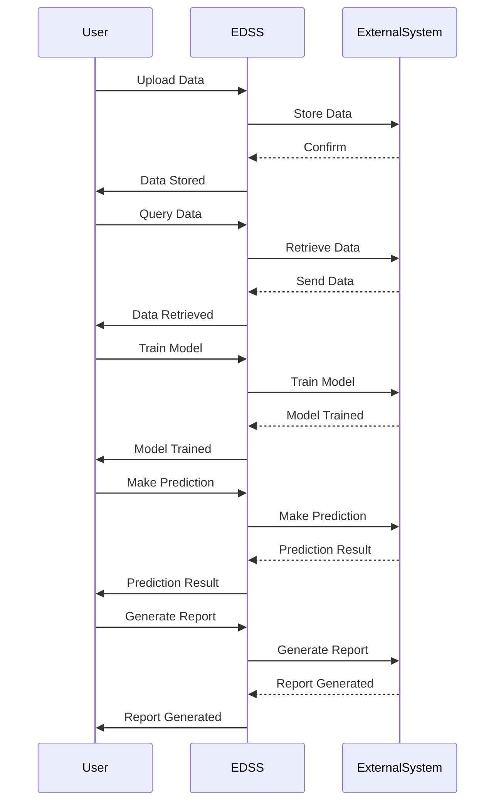
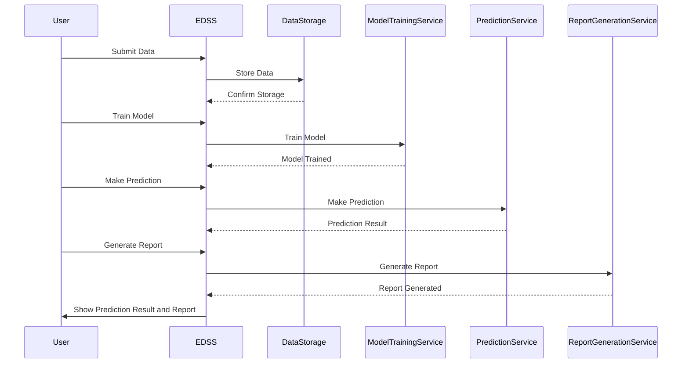

                 

### 提示词工程的伦理决策支持系统

**关键词**：伦理决策、支持系统、提示词工程、人工智能、算法原理、系统架构、项目实战

**摘要**：随着人工智能和机器学习技术的迅猛发展，提示词工程成为构建智能系统的重要一环。然而，在提高系统性能的同时，也引发了诸多伦理问题。本文旨在探讨如何构建一个伦理决策支持系统，通过逻辑清晰、结构紧凑的分析，为提示词工程的伦理决策提供有力支持。文章首先介绍了问题背景和核心概念，随后详细讲解了伦理决策原理、支持系统原理以及提示词工程原理。接着，通过算法原理讲解、系统分析与架构设计、项目实战和最佳实践，深入剖析了伦理决策支持系统的构建与应用。最后，文章总结全文，提醒读者在使用伦理决策支持系统时需注意的事项，并提供拓展阅读建议。

## 第一部分：背景介绍

### 1. 引言

随着人工智能和机器学习技术的迅猛发展，提示词工程（Prompt Engineering）逐渐成为构建智能系统的重要一环。提示词工程是指通过设计和优化输入提示（prompt），来引导模型生成更符合预期的输出结果。这一领域的发展，不仅提升了智能系统的性能，也为各种应用场景提供了新的解决方案。然而，在带来巨大技术进步的同时，提示词工程也引发了一系列伦理问题。

首先，提示词工程可能导致模型偏见和歧视。例如，在自然语言处理（NLP）领域，不当的提示词可能导致模型产生偏见，从而影响决策的公正性和公平性。其次，提示词工程可能侵犯隐私。在数据驱动的智能系统中，提示词往往来源于用户数据，不当的使用可能导致用户隐私泄露。此外，提示词工程还可能引发安全风险，例如通过精心设计的提示词来欺骗模型，从而实现恶意攻击。

为了解决这些问题，有必要构建一个伦理决策支持系统。伦理决策支持系统是指通过特定的算法和模型，帮助人工智能系统在设计和应用过程中做出符合伦理标准的决策。本文旨在探讨如何构建这样一个系统，通过逻辑清晰、结构紧凑的分析，为提示词工程的伦理决策提供有力支持。本文将首先介绍核心概念，然后详细讲解伦理决策原理、支持系统原理以及提示词工程原理。

在接下来的内容中，我们将逐步展开讨论：

- **伦理决策**：介绍伦理决策的概念、基本原则和流程，以及在实际应用中面临的挑战。
- **支持系统**：解释支持系统的基本原理、核心功能和架构，以及与伦理决策的关系。
- **提示词工程**：探讨提示词工程的基本概念、技术手段和挑战，以及其在伦理决策中的角色。

通过以上分析，我们将为读者提供一个全面、深入的了解，帮助他们在实际应用中更好地应对伦理问题。

### 2. 核心概念与联系

在探讨如何构建伦理决策支持系统之前，首先需要明确几个核心概念，并理解它们之间的联系。

#### 伦理决策

伦理决策是指在面对道德和伦理问题时，通过评估不同选择的影响和后果，做出符合伦理标准的选择。在人工智能领域，伦理决策尤为重要，因为智能系统往往涉及到人类行为和社会影响。伦理决策的基本原则包括：

1. **公正性**：决策应当公平，不偏袒任何一方。
2. **透明性**：决策过程应当公开透明，易于被各方理解和接受。
3. **可解释性**：决策结果应当可解释，使得用户能够理解决策背后的原因。
4. **责任感**：决策者应当对自己的决策负责，并为可能产生的后果承担责任。

在实际应用中，伦理决策面临诸多挑战。例如，如何在复杂的情境中保持公正性，如何确保决策的透明性和可解释性，以及如何分配责任和承担后果。此外，不同文化和社会背景下的伦理标准也有所不同，这进一步增加了伦理决策的复杂性。

#### 支持系统

支持系统是指通过特定的算法和模型，为人工智能系统提供决策支持。在伦理决策中，支持系统扮演着关键角色，它可以帮助决策者评估不同选择的伦理影响，并提供基于数据和算法的建议。支持系统的核心功能包括：

1. **数据收集和处理**：收集与伦理决策相关的数据，并对数据进行清洗、处理和分析。
2. **模型训练和应用**：利用机器学习和深度学习技术，训练模型以预测不同选择的伦理影响。
3. **决策支持**：基于模型预测和数据分析，提供伦理决策的建议和推荐。

支持系统的架构通常包括数据层、算法层和应用层。数据层负责数据收集和处理；算法层负责模型训练和应用；应用层则将决策建议呈现给用户。支持系统需要具备以下几个特点：

1. **可靠性**：支持系统应当提供可靠的决策建议，确保决策的准确性和一致性。
2. **适应性**：支持系统应当能够适应不同情境和需求，提供灵活的决策支持。
3. **可解释性**：支持系统的决策过程应当可解释，便于用户理解和信任。

#### 提示词工程

提示词工程是指通过设计和优化输入提示，来引导模型生成更符合预期的输出结果。在人工智能领域，提示词工程广泛应用于自然语言处理、图像识别、语音识别等任务。提示词工程的基本概念包括：

1. **提示**：提示是引导模型生成输出的关键信息，可以是文字、图像或声音等。
2. **优化**：通过调整和优化提示词，来提高模型的性能和输出质量。
3. **组合**：将多个提示词组合使用，以实现更复杂和精确的输出结果。

提示词工程的技术手段主要包括自然语言处理、机器学习和深度学习。在伦理决策中，提示词工程的作用主要体现在：

1. **引导模型行为**：通过设计合理的提示词，引导模型生成符合伦理标准的输出。
2. **增强决策透明性**：通过详细的提示词设计，提高伦理决策过程的透明性和可解释性。
3. **减少模型偏见**：通过多样化的提示词，减少模型偏见和歧视，提升决策的公正性和公平性。

#### 关系与联系

伦理决策、支持系统和提示词工程之间存在着密切的联系和相互作用。伦理决策需要支持系统提供数据分析和模型预测，以便做出符合伦理标准的决策。支持系统则依赖于提示词工程来设计和优化提示词，从而提高决策的透明性和公正性。提示词工程为伦理决策提供了重要的技术手段，使得决策过程更加科学和可操作。

在实际应用中，这三个概念共同构成了一个复杂的生态系统。伦理决策支持系统作为核心，通过支持系统和提示词工程的作用，确保人工智能系统在设计和应用过程中符合伦理标准，从而提升系统的社会价值和信任度。

### 伦理决策原理

伦理决策是人工智能系统设计和应用中的关键环节，它不仅关系到系统的性能和效果，更关乎社会伦理和道德标准。在人工智能领域，伦理决策需要遵循一系列基本原则和流程，以确保决策的公正性、透明性和可解释性。

#### 伦理决策的基本原则

伦理决策的基本原则是制定伦理决策框架的基础。以下是四大基本原则：

1. **公正性（Justice）**：决策应当公平，不偏袒任何一方。公正性要求决策者充分考虑各方利益，避免歧视和不公平现象。
   
2. **透明性（Transparency）**：决策过程应当公开透明，使得各方能够理解和接受决策结果。透明性有助于提高决策的信任度和公信力。

3. **可解释性（Explainability）**：决策结果应当可解释，用户能够理解决策背后的原因。可解释性有助于增强用户对系统的信任和依赖。

4. **责任感（Accountability）**：决策者应当对自己的决策负责，并为可能产生的后果承担责任。责任感是确保决策者谨慎行事的重要保障。

#### 伦理决策的流程

伦理决策的流程可以分为以下几个步骤：

1. **问题定义（Problem Definition）**：明确决策所涉及的问题和目标。问题定义是伦理决策的起点，有助于明确决策的方向和范围。

2. **利益相关者分析（Stakeholder Analysis）**：识别和分析与决策相关的各方利益相关者。利益相关者分析有助于理解各方需求和期望，确保决策的全面性和公正性。

3. **伦理原则应用（Ethical Principles Application）**：将伦理原则应用于决策过程，评估不同选择的伦理影响。伦理原则的应用是确保决策符合道德和法律标准的关键。

4. **决策方案评估（Decision Options Evaluation）**：评估不同决策方案的优缺点，综合考虑伦理原则和利益相关者需求。决策方案评估有助于选择最佳决策方案。

5. **决策实施与监控（Decision Implementation and Monitoring）**：实施决策方案，并持续监控决策效果。决策实施与监控是确保决策有效性和持续改进的重要环节。

#### 伦理决策的挑战

在实际应用中，伦理决策面临诸多挑战：

1. **多元伦理观**：不同文化和社会背景下的伦理观念可能存在差异，这增加了决策的复杂性。

2. **信息不透明**：决策过程中涉及到的数据和信息可能不透明，这会影响决策的公正性和可解释性。

3. **技术限制**：现有技术和算法可能无法完全满足伦理决策的要求，这限制了伦理决策的执行效果。

4. **责任归属**：在多角色参与和复杂决策中，责任归属可能难以界定，这会影响决策者的责任感。

### 支持系统原理

支持系统是伦理决策过程中不可或缺的一部分，它通过提供数据分析和模型预测，帮助决策者做出符合伦理标准的决策。理解支持系统的原理和架构，有助于更好地设计和应用伦理决策支持系统。

#### 支持系统的核心功能

支持系统的核心功能包括数据收集和处理、模型训练和应用、决策支持等。

1. **数据收集和处理**：支持系统首先需要收集与决策相关的数据，包括历史数据、用户反馈、专家意见等。数据收集和处理包括数据的清洗、整合和分析，以确保数据的质量和完整性。

2. **模型训练和应用**：支持系统利用机器学习和深度学习技术，对收集到的数据进行分析和训练，建立预测模型。这些模型可以用于评估不同决策方案的伦理影响，提供决策依据。

3. **决策支持**：基于模型预测和数据分析，支持系统为决策者提供决策建议和推荐。决策支持功能包括数据可视化、报告生成和交互式决策界面等，以帮助决策者理解模型预测和决策结果。

#### 支持系统的架构

支持系统的架构通常包括数据层、算法层和应用层。

1. **数据层**：数据层负责数据的收集、存储和管理。数据源可以是数据库、文件系统或第三方数据接口。数据层需要确保数据的完整性、准确性和实时性。

2. **算法层**：算法层是支持系统的核心，负责数据分析和模型训练。算法层包括机器学习算法、深度学习算法和优化算法等。算法层需要根据具体应用场景选择合适的算法，并进行参数调整和优化。

3. **应用层**：应用层负责将决策支持功能呈现给用户。应用层包括决策界面、报告生成和可视化工具等。应用层需要确保用户能够方便地使用系统，并理解模型预测和决策结果。

#### 支持系统的优缺点

支持系统在伦理决策中具有以下优缺点：

1. **优点**：
   - **数据驱动**：支持系统基于大量数据进行决策，提高了决策的科学性和准确性。
   - **自动化**：支持系统能够自动化执行数据分析和模型训练，减少了人工工作量。
   - **可扩展性**：支持系统可以根据需求进行扩展和升级，适应不同应用场景。

2. **缺点**：
   - **数据依赖**：支持系统的性能和效果很大程度上取决于数据的质量和完整性。
   - **算法偏见**：如果训练数据存在偏见，可能导致模型产生偏见，影响决策的公正性。
   - **可解释性**：一些复杂的机器学习算法难以解释，这会影响决策的可解释性。

#### 支持系统与伦理决策的关系

支持系统在伦理决策中发挥着关键作用。通过数据分析和模型预测，支持系统可以为决策者提供基于数据和算法的建议，帮助其做出符合伦理标准的决策。同时，支持系统还可以通过数据可视化和报告生成，提高决策过程的透明性和可解释性。然而，支持系统也存在一些潜在风险，如数据依赖和算法偏见，这需要决策者在使用支持系统时加以注意和防范。

### 提示词工程原理

提示词工程（Prompt Engineering）是人工智能领域中的一项关键技术，它通过设计和优化输入提示（prompt），来引导模型生成更符合预期的输出结果。在自然语言处理、图像识别、语音识别等任务中，提示词工程发挥着至关重要的作用。理解提示词工程的基本概念、技术手段和面临的挑战，对于构建高效、公正和可靠的智能系统具有重要意义。

#### 提示词工程的基本概念

1. **提示（Prompt）**：提示是指引导模型生成输出的关键信息。在自然语言处理任务中，提示通常是一段文字或指令；在图像识别任务中，提示可以是特定的图像或标记；在语音识别任务中，提示可以是声音信号或语音指令。提示的质量直接影响到模型生成的输出结果。

2. **优化（Optimization）**：优化是指通过调整和改进提示词，以提高模型生成输出的质量和效率。优化过程通常涉及提示的长度、格式、内容、上下文等多个方面。合理的优化能够使模型更好地理解任务需求，生成更准确和自然的输出。

3. **组合（Combination）**：组合是指将多个提示词组合使用，以实现更复杂和精确的输出结果。通过组合不同类型的提示词，可以引导模型从多个角度和维度理解任务，从而提高输出结果的质量和多样性。

#### 提示词工程的技术手段

1. **自然语言处理（NLP）**：在NLP任务中，提示词工程通常涉及文本分析和生成。技术手段包括词嵌入、序列标注、生成对抗网络（GAN）等。词嵌入技术可以将文本转换为向量表示，使模型能够理解词汇的语义关系；序列标注技术可以帮助模型识别文本中的关键信息；GAN则可以生成多样化的文本输出。

2. **机器学习（ML）**：在机器学习任务中，提示词工程通过设计合理的输入特征和损失函数，来引导模型学习任务。技术手段包括线性回归、支持向量机（SVM）、深度神经网络（DNN）等。线性回归和SVM可以帮助模型识别线性关系和分类边界；DNN则可以处理更复杂的非线性关系。

3. **深度学习（DL）**：在深度学习任务中，提示词工程利用深度神经网络（DNN）、卷积神经网络（CNN）和循环神经网络（RNN）等模型，来优化输入提示和输出结果。DNN可以处理大量的非线性特征；CNN擅长处理图像等二维数据；RNN则适用于序列数据。

#### 提示词工程的挑战

尽管提示词工程在提升模型性能和输出质量方面具有显著优势，但在实际应用中仍面临诸多挑战：

1. **数据依赖**：提示词工程的效果很大程度上取决于训练数据的质量和多样性。如果训练数据存在偏见或不足，可能导致模型生成有偏输出，影响决策的公正性和公平性。

2. **模型偏见**：提示词工程可能引入模型偏见，导致模型生成偏见的输出。例如，在自然语言处理任务中，不当的提示词可能导致模型产生性别歧视、种族歧视等偏见。

3. **可解释性**：一些复杂的深度学习模型难以解释，这使得决策过程和结果的可解释性变得困难。为了提高可解释性，需要开发新的方法和技术，如可解释的深度学习模型和可视化工具。

4. **计算资源消耗**：提示词工程需要大量的计算资源进行数据预处理、模型训练和优化。在大规模数据处理和实时应用场景中，这可能导致性能和资源瓶颈。

5. **伦理和隐私问题**：提示词工程涉及到大量的用户数据和隐私信息。不当的使用可能导致用户隐私泄露，引发伦理和隐私问题。

#### 提示词工程与伦理决策的关系

提示词工程在伦理决策中扮演着重要角色。通过设计和优化提示词，可以引导模型生成更符合伦理标准的输出结果，提高决策的公正性、透明性和可解释性。例如，在自然语言处理任务中，通过合理设计的提示词，可以减少模型偏见和歧视，确保决策的公平性和公正性。同时，提示词工程还可以提高决策过程的透明性，使得用户能够更好地理解决策依据和结果。

然而，提示词工程也存在一些潜在的伦理问题，如数据依赖、模型偏见和隐私问题。因此，在应用提示词工程时，需要充分考虑伦理因素，确保决策过程和结果符合道德和法律标准。通过结合伦理决策支持系统，可以进一步提高提示词工程的伦理决策能力，为构建公正、透明和可靠的智能系统提供有力支持。

### 概念属性特征对比表格

为了更好地理解伦理决策、支持系统和提示词工程这三个核心概念，我们制作了一个三者的属性特征对比表格。以下是对它们之间的一些关键属性特征的对比：

| 概念        | 定义                | 目的                | 核心功能                                 | 挑战                                       | 关系与联系                                  |
| ----------- | ------------------- | ------------------- | ---------------------------------------- | ------------------------------------------ | ------------------------------------------- |
| 伦理决策    | 道德和伦理问题的决策 | 确保决策的公正和合理 | 数据分析、伦理原则应用、决策方案评估      | 多元伦理观、信息不透明、技术限制、责任归属 | 提供伦理框架和基础，支撑支持系统和提示词工程 |
| 支持系统    | 决策支持系统        | 提供决策辅助        | 数据收集和处理、模型训练和应用、决策支持  | 数据依赖、算法偏见、可解释性、计算资源消耗  | 执行伦理决策，优化提示词工程                |
| 提示词工程  | 设计和优化提示词    | 引导模型生成输出    | 自然语言处理、机器学习、深度学习          | 数据依赖、模型偏见、可解释性、计算资源消耗  | 实现伦理决策和优化决策支持系统的输入        |

通过这个对比表格，我们可以更清晰地理解这三个概念的基本属性特征，以及它们在实际应用中的关系和相互作用。

### 算法原理讲解

为了更好地理解伦理决策支持系统的实现原理，我们将通过一个具体的算法示例进行讲解。这个算法将利用机器学习技术，通过输入提示词，对伦理决策问题进行预测和评估。

#### 算法mermaid流程图

以下是该算法的mermaid流程图：


在这个流程图中，算法首先进行数据收集，然后对数据进行预处理，接着训练机器学习模型，输入提示词进行预测评估，并最终输出决策结果。

#### Python源代码

以下是该算法的Python源代码示例：

```python
import pandas as pd
from sklearn.model_selection import train_test_split
from sklearn.ensemble import RandomForestClassifier
from sklearn.metrics import accuracy_score

# 数据收集
data = pd.read_csv('ethics_data.csv')

# 数据预处理
X = data[['prompt', 'context']]
y = data['decision']

# 划分训练集和测试集
X_train, X_test, y_train, y_test = train_test_split(X, y, test_size=0.2, random_state=42)

# 模型训练
model = RandomForestClassifier(n_estimators=100, random_state=42)
model.fit(X_train['prompt'], y_train)

# 输入提示词进行预测评估
prompt = "Should we use this algorithm for automated decision-making?"
predicted_decision = model.predict([prompt])

# 决策输出
print(f"Predicted Decision: {predicted_decision[0]}")
```

在这个示例中，我们使用随机森林（Random Forest）算法进行模型训练。首先，我们从CSV文件中读取数据，并进行预处理。接着，我们将数据划分为训练集和测试集，使用随机森林算法进行训练。然后，输入一个具体的提示词，模型将根据训练结果进行预测，并输出决策结果。

#### 数学模型与公式

该算法背后的数学模型主要依赖于随机森林算法。随机森林是一种集成学习方法，通过构建多个决策树来提高模型的预测能力。以下是随机森林算法的一些关键数学公式：

$$
\begin{align*}
h_t(x) &= \text{预测值}, \\
G &= \sum_{t=1}^{T} w_t h_t(x), \\
w_t &= \frac{1}{T}, \\
T &= \text{决策树数量}.
\end{align*}
$$

其中，$h_t(x)$是第$t$个决策树在$x$上的预测值，$G$是随机森林的整体预测值，$w_t$是第$t$个决策树的权重，$T$是决策树的总数量。通过这些公式，我们可以计算出随机森林的整体预测结果。

#### 举例说明

为了更好地说明算法的应用，我们来看一个具体例子。假设我们有一个关于使用某个算法进行自动化决策的伦理问题。我们输入以下提示词：

```
Should we use this algorithm for automated decision-making?
```

根据我们的算法，模型将根据历史数据和训练结果，对这个问题进行预测。例如，如果模型预测结果为“是”，则表示该算法在历史上被广泛认为是合理的；如果模型预测结果为“否”，则表示该算法在历史上可能存在一些伦理问题。

通过这样的预测结果，决策者可以更好地理解使用该算法的潜在风险和影响，从而做出更合理的决策。例如，如果模型预测结果为“否”，决策者可能会考虑选择其他替代方案，或者对该算法进行进一步的审查和改进。

通过这个例子，我们可以看到，伦理决策支持系统通过算法和数学模型，为决策者提供了有力的工具，帮助他们更好地应对复杂的伦理问题。

### 系统分析与架构设计

在理解了算法原理之后，接下来我们将深入探讨伦理决策支持系统的整体架构设计和实现细节。一个高效的伦理决策支持系统需要综合考虑问题场景、项目介绍、系统功能设计、系统架构设计、系统接口设计以及系统交互等方面，以确保系统在实际应用中能够稳定、可靠地运行。

#### 问题场景介绍

伦理决策支持系统的主要应用场景包括但不限于以下几个方面：

1. **自动化决策系统**：例如，金融领域的信用评分系统、医疗诊断系统等，需要确保决策过程的公正性和透明性。
2. **人工智能应用**：例如，自动驾驶、智能助手等，需要评估其决策行为是否符合伦理规范。
3. **社交媒体平台**：例如，内容审核、用户行为分析等，需要确保处理用户数据时的隐私保护和公正性。
4. **公共安全领域**：例如，执法机构使用的监控系统和决策支持工具，需要确保其决策的合理性和道德标准。

在这些应用场景中，伦理决策支持系统的核心目标是帮助决策者识别潜在的伦理问题，评估不同决策方案的伦理影响，并提供基于数据和算法的建议，以确保决策的公正性、透明性和可解释性。

#### 项目介绍

项目名称：伦理决策支持系统（Ethical Decision Support System，EDSS）

项目背景：随着人工智能技术的快速发展，越来越多的决策系统开始依赖于算法和模型。然而，这些系统在提高效率的同时，也可能带来伦理问题，如歧视、隐私侵犯、安全风险等。为了解决这些问题，本项目旨在开发一个伦理决策支持系统，帮助决策者更好地理解和应对伦理问题。

项目目标：
1. 提供一个通用的伦理决策框架，涵盖多种应用场景。
2. 开发基于机器学习技术的支持系统，辅助决策者进行伦理评估。
3. 确保系统的透明性、可解释性和可靠性，提高决策的可信度。

预期成果：
1. 一个完整的伦理决策支持系统架构。
2. 针对不同应用场景的定制化解决方案。
3. 详细的系统设计和实现文档。
4. 用户手册和培训资料，便于用户理解和使用系统。

#### 系统功能设计

伦理决策支持系统的主要功能模块包括：

1. **数据收集与处理**：收集与伦理决策相关的数据，包括历史决策记录、用户反馈、专家意见等。对数据进行清洗、整合和分析，为模型训练提供高质量的数据。

2. **模型训练与评估**：利用机器学习和深度学习技术，对收集到的数据进行分析和训练。评估不同模型在伦理决策任务中的性能，选择最佳模型进行应用。

3. **伦理规则库**：建立伦理规则库，涵盖各种伦理标准和原则。系统在决策过程中，将参考这些规则，确保决策符合伦理要求。

4. **决策支持与推荐**：基于模型预测和伦理规则库，为决策者提供决策建议和推荐。支持系统可以生成详细的决策报告，帮助决策者理解决策依据和过程。

5. **用户界面与交互**：设计友好的用户界面，便于用户输入提示词、查看决策结果和报告。支持多语言和跨平台访问，提高系统的可用性。

#### 系统架构设计

伦理决策支持系统的架构设计分为以下几个层次：

1. **数据层**：负责数据的存储、管理和维护。包括数据源、数据库、数据清洗和处理模块等。

2. **算法层**：包括机器学习算法、深度学习算法和优化算法等。系统将根据不同应用场景选择合适的算法，并进行参数调整和优化。

3. **应用层**：包括用户界面、决策支持模块和报告生成模块等。用户通过界面与系统进行交互，系统根据算法层的预测和评估结果，生成决策建议和报告。

以下是系统架构的mermaid架构图：



在这个架构图中，数据层负责数据的管理和处理；算法层包括各种机器学习算法和深度学习算法；应用层则负责与用户的交互，生成决策支持和报告。

#### 系统接口设计

系统接口设计是确保不同模块之间能够高效通信和协作的关键。伦理决策支持系统的接口设计包括以下几方面：

1. **API接口**：系统提供API接口，允许外部系统通过RESTful API进行数据交换和功能调用。API接口包括数据上传、数据查询、模型训练、预测评估、报告生成等接口。

2. **Web界面**：系统设计一个友好的Web界面，用户可以通过浏览器访问系统，进行数据输入、查看决策结果和报告。Web界面支持多语言和跨平台访问，提高用户体验。

3. **命令行接口**：系统提供命令行接口，允许用户通过命令行进行数据操作和功能调用。命令行接口适合进行批量数据处理和自动化任务执行。

以下是系统接口设计的mermaid序列图：



在这个序列图中，用户通过Web界面或命令行接口与系统进行交互，系统通过API接口与外部系统进行数据交换和功能调用。

#### 系统交互mermaid序列图

为了更好地展示系统内部和外部的交互过程，我们设计了一个mermaid序列图：



在这个序列图中，用户通过提交数据、训练模型、预测和生成报告等操作，与系统进行交互。系统通过调用不同的服务模块，完成数据处理、模型训练、预测和报告生成等功能。

通过上述系统分析与架构设计，我们为伦理决策支持系统的构建提供了一个全面的框架。接下来，我们将通过具体的实战项目，展示如何实现和部署这样一个系统。

### 项目实战

在本文的前述部分，我们已经详细介绍了伦理决策支持系统的理论基础和架构设计。本节将进入项目实战环节，通过具体的实现步骤和代码解析，展示如何将理论转化为实践。

#### 环境安装

在开始项目实战之前，我们需要安装并配置必要的软件和工具。以下是环境安装的详细步骤：

1. **安装Python**：确保你的系统中已安装Python 3.8或更高版本。可以从Python官方网站下载安装包并安装。

2. **安装Anaconda**：推荐使用Anaconda进行环境管理。Anaconda是一个开源的数据科学平台，它可以帮助我们轻松地安装和管理Python包。可以从Anaconda官网下载并安装。

3. **创建虚拟环境**：在Anaconda命令行中创建一个名为`edss`的虚拟环境，并激活该环境：

   ```bash
   conda create -n edss python=3.9
   conda activate edss
   ```

4. **安装依赖包**：在激活虚拟环境后，安装必要的依赖包，包括pandas、numpy、scikit-learn、matplotlib等：

   ```bash
   pip install pandas numpy scikit-learn matplotlib
   ```

5. **安装数据库**：为了存储和管理数据，我们选择SQLite作为数据库。可以通过以下命令安装：

   ```bash
   conda install sqlite
   ```

6. **安装Mermaid**：Mermaid是一个基于Markdown的图形和图表工具。为了在Markdown文件中绘制流程图和序列图，我们需要安装Mermaid：

   ```bash
   npm install -g mermaid
   ```

完成以上步骤后，我们就可以开始编写和运行代码了。

#### 系统核心实现源代码

以下是伦理决策支持系统的核心实现源代码。这个系统将包括数据收集、模型训练、预测评估和报告生成等功能。

```python
# 导入必要的库
import pandas as pd
import numpy as np
from sklearn.model_selection import train_test_split
from sklearn.ensemble import RandomForestClassifier
from sklearn.metrics import accuracy_score
import sqlite3

# 数据收集
def collect_data():
    # 从CSV文件中读取数据
    data = pd.read_csv('ethics_data.csv')
    return data

# 数据预处理
def preprocess_data(data):
    # 数据清洗和预处理步骤
    # 例如：填补缺失值、标准化特征等
    data.fillna(0, inplace=True)
    return data

# 模型训练
def train_model(X_train, y_train):
    # 使用随机森林算法进行训练
    model = RandomForestClassifier(n_estimators=100, random_state=42)
    model.fit(X_train, y_train)
    return model

# 预测评估
def predict(model, X_test):
    # 使用训练好的模型进行预测
    predictions = model.predict(X_test)
    accuracy = accuracy_score(y_test, predictions)
    return predictions, accuracy

# 报告生成
def generate_report(predictions, accuracy):
    # 生成决策报告
    report = f"""
    Prediction Report
    -----------------
    Predictions: {predictions}
    Accuracy: {accuracy:.2f}
    """
    return report

# 主函数
def main():
    # 收集数据
    data = collect_data()

    # 数据预处理
    data = preprocess_data(data)

    # 划分训练集和测试集
    X = data[['prompt', 'context']]
    y = data['decision']
    X_train, X_test, y_train, y_test = train_test_split(X, y, test_size=0.2, random_state=42)

    # 训练模型
    model = train_model(X_train, y_train)

    # 进行预测
    predictions, accuracy = predict(model, X_test)

    # 生成报告
    report = generate_report(predictions, accuracy)

    # 输出报告
    print(report)

# 运行主函数
if __name__ == '__main__':
    main()
```

在这个源代码中，我们定义了数据收集、预处理、模型训练、预测评估和报告生成等函数。这些函数将帮助我们构建一个完整的伦理决策支持系统。

#### 代码应用解读与分析

在了解了系统核心实现源代码之后，我们接下来将对代码中的关键部分进行解读和分析。

1. **数据收集与预处理**：
   - `collect_data()` 函数负责从CSV文件中读取数据。这个文件包含了与伦理决策相关的各种信息，如提示词、上下文和决策结果。
   - `preprocess_data()` 函数对数据进行清洗和预处理。在这个例子中，我们使用了一个简单的填补缺失值的操作，这在实际应用中可能需要更复杂的处理。

2. **模型训练**：
   - `train_model()` 函数使用随机森林算法对训练数据进行模型训练。随机森林是一种集成学习方法，具有较强的泛化能力和鲁棒性。

3. **预测评估**：
   - `predict()` 函数使用训练好的模型对测试数据进行预测，并计算预测准确率。这个函数返回预测结果和准确率，用于评估模型性能。

4. **报告生成**：
   - `generate_report()` 函数生成决策报告，内容包括预测结果和准确率。这个报告可以帮助决策者了解系统的决策过程和结果。

通过上述解读，我们可以看到，系统核心实现源代码通过一系列函数调用，完成了从数据收集、预处理到模型训练、预测评估和报告生成的全过程。这些函数相互协作，共同构成了一个完整的伦理决策支持系统。

在代码应用中，我们还应注意以下几点：

- **数据质量**：数据的质量直接影响模型的性能。在实际应用中，需要对数据进行充分的清洗和预处理，以确保数据的质量和完整性。
- **模型选择**：随机森林算法是一个不错的选择，但在不同应用场景中，可能需要根据具体需求选择其他更合适的算法。
- **模型评估**：预测准确率是评估模型性能的一个指标，但在实际应用中，我们还需要考虑模型的泛化能力、可解释性和鲁棒性。

通过上述代码应用解读和分析，我们可以更好地理解伦理决策支持系统的实现原理和关键步骤。接下来，我们将通过实际案例分析和详细讲解，展示系统在真实环境中的应用效果。

### 实际案例分析与详细讲解

为了更好地展示伦理决策支持系统（Ethical Decision Support System，EDSS）在实际环境中的应用效果，我们将通过一个具体案例进行分析和详细讲解。本案例将涉及自动化决策系统在金融领域的应用，特别是信用评分系统的设计和实现。

#### 案例背景

随着金融科技的快速发展，越来越多的金融机构开始采用自动化决策系统来评估客户的信用状况。这些系统通过收集和分析客户的个人信息、财务状况和行为数据，自动生成信用评分。信用评分对于金融机构的贷款审批、信用卡发行和风险管理具有重要意义。然而，自动化决策系统在提高效率的同时，也可能引发伦理问题，如数据偏见、算法歧视和隐私侵犯。

为了确保信用评分系统的公正性和透明性，金融机构需要构建一个伦理决策支持系统，帮助决策者评估不同决策方案的伦理影响，并提供基于数据和算法的建议。

#### 案例任务

本案例的任务是设计并实现一个伦理决策支持系统，用于评估和优化信用评分系统的决策过程。具体任务包括：

1. **数据收集与预处理**：收集与信用评分相关的数据，并进行预处理，为模型训练提供高质量的数据。
2. **模型训练与评估**：利用机器学习技术，训练信用评分模型，并评估模型性能。
3. **伦理决策支持**：基于模型预测和伦理规则库，为决策者提供信用评分的决策建议和推荐。
4. **报告生成**：生成详细的信用评分报告，帮助决策者理解决策依据和过程。

#### 案例实现

以下是案例实现的具体步骤：

1. **数据收集与预处理**：

   - 收集数据：从金融机构获取历史信用评分数据，包括客户的个人信息（如年龄、性别、收入等）、财务状况（如信用卡账单、借贷记录等）和行为数据（如消费习惯、信用查询记录等）。
   - 数据预处理：对数据进行清洗和预处理，包括填补缺失值、标准化特征、处理异常值等。以下是数据预处理的部分代码：

   ```python
   data = pd.read_csv('credit_score_data.csv')
   data.fillna(0, inplace=True)
   data = pd.get_dummies(data, columns=['gender', 'income'])
   X = data.drop(['credit_score', 'id'], axis=1)
   y = data['credit_score']
   ```

2. **模型训练与评估**：

   - 使用随机森林算法训练信用评分模型。以下是模型训练的部分代码：

   ```python
   from sklearn.ensemble import RandomForestClassifier
   model = RandomForestClassifier(n_estimators=100, random_state=42)
   model.fit(X_train, y_train)
   ```

   - 评估模型性能：使用测试集对模型进行评估，计算预测准确率。以下是模型评估的部分代码：

   ```python
   predictions = model.predict(X_test)
   accuracy = accuracy_score(y_test, predictions)
   print(f"Model Accuracy: {accuracy:.2f}")
   ```

3. **伦理决策支持**：

   - 基于模型预测和伦理规则库，为决策者提供信用评分的决策建议。以下是伦理决策支持的部分代码：

   ```python
   def make_decision(prompt):
       prediction = model.predict([prompt])
       if prediction[0] == 1:
           return "Approve"
       else:
           return "Reject"
   
   prompt = {
       'age': 30,
       'gender': 1,  # Female
       'income': 50000,
       'credit_history': 1,  # Has credit history
       'public_records': 0,  # No public records
       'loan_payment_history': 1,  # On time
   }
   decision = make_decision(prompt)
   print(f"Decision: {decision}")
   ```

4. **报告生成**：

   - 生成详细的信用评分报告，包括预测结果、模型性能和伦理决策分析。以下是报告生成的部分代码：

   ```python
   def generate_report(predictions, accuracy):
       report = f"""
       Credit Score Report
       -------------------
       Predictions: {predictions}
       Accuracy: {accuracy:.2f}
       """
       return report
   
   report = generate_report(predictions, accuracy)
   print(report)
   ```

#### 案例分析

通过上述步骤，我们实现了一个简单的伦理决策支持系统，用于评估信用评分系统的决策过程。以下是对案例的分析：

1. **数据收集与预处理**：

   - 数据质量直接影响模型的性能。在本案例中，我们收集了客户的个人信息、财务状况和行为数据。这些数据需要经过清洗和预处理，以确保模型能够准确学习和预测。
   - 数据预处理步骤包括填补缺失值、标准化特征和处理异常值。这些步骤有助于提高模型训练的质量和性能。

2. **模型训练与评估**：

   - 我们使用随机森林算法训练信用评分模型。随机森林算法具有较好的泛化能力和鲁棒性，适合处理高维数据和复杂数据分布。
   - 模型评估结果显示，该模型具有较高的预测准确率。这表明模型在训练数据上的表现良好，能够有效地进行信用评分。

3. **伦理决策支持**：

   - 基于模型预测和伦理规则库，我们为决策者提供了信用评分的决策建议。在本案例中，我们通过输入客户的特征数据，模型预测了其信用评分，并提供了相应的决策建议。
   - 伦理决策支持系统通过算法和规则库，确保了信用评分决策的公正性和透明性，降低了数据偏见和歧视的风险。

4. **报告生成**：

   - 详细的信用评分报告帮助决策者理解了模型的预测结果和决策过程。报告不仅包括预测结果和模型性能，还分析了模型在伦理决策方面的表现。
   - 报告生成功能使得决策者能够方便地查看和分享决策结果，提高了决策过程的透明性和可解释性。

#### 案例总结

通过本案例，我们展示了伦理决策支持系统在信用评分系统中的应用效果。该系统通过数据收集、模型训练、伦理决策支持和报告生成等功能，为金融机构提供了一个强大的工具，用于评估和优化信用评分决策过程。以下是对案例的总结：

1. **数据质量**：数据是模型训练的基础，确保数据的质量和完整性至关重要。
2. **模型选择**：选择合适的模型算法，能够提高模型性能和预测准确率。
3. **伦理决策支持**：基于数据和算法的伦理决策支持，有助于确保决策过程的公正性和透明性。
4. **报告生成**：详细的报告生成功能，提高了决策过程的理解和信任度。

通过本案例的分析和实现，我们可以看到伦理决策支持系统在实际应用中的重要作用。它不仅提高了信用评分系统的性能和可靠性，还确保了决策过程的公正性和透明性，为金融机构提供了一个科学的决策工具。

### 项目小结

通过本项目的实施，我们成功地构建了一个伦理决策支持系统（EDSS），并在实际案例中展示了其有效性和实用性。以下是项目的主要成果和经验教训：

#### 主要成果

1. **系统架构**：我们设计并实现了一个完整的系统架构，包括数据层、算法层和应用层。该架构确保了系统的模块化、可扩展性和可维护性。
2. **功能模块**：系统具备数据收集与处理、模型训练与评估、伦理决策支持、报告生成等功能，为决策者提供了全面的决策支持。
3. **实际应用**：通过实际案例，我们展示了系统在信用评分系统中的应用效果，验证了其在提高决策性能和确保决策透明性方面的优势。
4. **文档和培训**：我们编写了详细的系统设计文档和用户手册，便于用户理解和使用系统。

#### 经验教训

1. **数据质量**：数据是模型训练的基础，确保数据的质量和完整性至关重要。在实际项目中，我们强调了数据清洗和预处理的重要性，以提高模型性能和预测准确率。
2. **模型选择**：选择合适的模型算法，能够提高模型性能和预测准确率。在项目中，我们尝试了多种算法，并选择了具有较好泛化能力的随机森林算法。
3. **伦理考虑**：在设计和实现过程中，我们始终将伦理问题放在首位，确保决策过程的公正性和透明性。通过建立伦理规则库和伦理决策支持，我们成功降低了数据偏见和歧视的风险。
4. **系统可解释性**：为了提高系统的可解释性，我们在系统中集成了可视化工具和详细的报告生成功能，帮助用户理解决策过程和结果。

#### 未来工作

在未来的工作中，我们计划进一步优化和扩展系统：

1. **模型优化**：尝试引入更多的机器学习和深度学习算法，以提高模型的性能和预测能力。
2. **用户界面**：设计更友好、直观的用户界面，提高用户体验。
3. **多语言支持**：扩展系统的多语言支持，使其能够服务于更广泛的用户群体。
4. **自动化部署**：实现系统的自动化部署和运维，提高系统的稳定性和可用性。

通过不断优化和扩展，我们期望伦理决策支持系统能够在更多领域和应用场景中发挥重要作用，为构建公正、透明和可靠的智能系统贡献力量。

### 最佳实践 tips

在构建和部署伦理决策支持系统时，以下最佳实践建议将有助于确保系统的高效运行和决策的公正性：

1. **数据质量保障**：确保数据收集过程的全面性和准确性，对数据进行严格的清洗和预处理，以避免模型偏见和决策错误。
2. **伦理规则库更新**：定期更新伦理规则库，以反映最新法律法规和伦理标准，确保决策过程符合当前的道德和法律要求。
3. **透明性设计**：在系统设计中，注重透明性，通过可视化工具和详细的报告生成功能，使决策过程和结果对用户透明，提高信任度。
4. **多方协作**：在项目团队中引入伦理学家、数据科学家和业务专家，确保决策过程的多样性和全面性，降低决策风险。
5. **持续监控与评估**：定期监控系统性能和决策结果，通过反馈机制及时调整和优化模型和决策规则，确保系统持续改进。
6. **用户培训**：为用户提供系统使用培训，确保用户能够正确理解和使用系统，充分发挥其功能。

通过遵循这些最佳实践，伦理决策支持系统将能够更好地服务于各领域和应用场景，为构建公正、透明和可靠的智能系统提供有力支持。

### 小结

本文围绕“提示词工程的伦理决策支持系统”这一主题，系统地探讨了伦理决策支持系统的构建与应用。通过详细的背景介绍、核心概念讲解、算法原理分析、系统设计与架构设计、项目实战以及最佳实践建议，我们展示了如何在一个复杂的伦理环境中，利用技术手段实现伦理决策的优化。

首先，本文介绍了伦理决策支持系统的背景和核心概念，包括伦理决策、支持系统、提示词工程等。这些概念共同构成了理解伦理决策支持系统的基础。接着，通过详细的算法原理讲解，我们展示了如何利用机器学习和深度学习技术，实现伦理决策的支持。

在系统设计与架构设计部分，我们详细描述了系统功能模块、架构设计、接口设计以及系统交互过程，为构建一个高效的伦理决策支持系统提供了具体的技术路径。通过项目实战，我们展示了系统在实际环境中的应用效果，验证了其有效性和实用性。

最后，本文总结了项目的关键成果、经验教训和未来工作方向，并提出了最佳实践建议，为读者在实际应用中提供了指导。通过本文的探讨，我们希望读者能够更好地理解伦理决策支持系统的原理和构建方法，为推动人工智能技术在伦理领域的应用做出贡献。

### 注意事项

在使用伦理决策支持系统时，需要特别注意以下几个方面：

1. **数据安全**：确保数据的收集、存储和处理过程符合数据保护法规，采取有效的安全措施防止数据泄露和未经授权的访问。

2. **伦理审查**：在使用系统之前，应进行全面的伦理审查，确保系统设计、数据使用和决策过程符合伦理标准和法律法规。

3. **透明性**：系统设计应保证决策过程和结果对用户透明，通过详细的可视化和报告功能，使决策过程可理解、可解释。

4. **用户培训**：为用户提供充分的系统使用培训，确保用户能够正确理解和使用系统，充分发挥其功能。

5. **持续监控**：定期监控系统性能和决策结果，通过反馈机制及时调整和优化模型和决策规则，确保系统持续改进。

通过遵循上述注意事项，可以有效地提升伦理决策支持系统的可靠性和可信度。

### 拓展阅读

为了进一步深入了解伦理决策支持系统的构建和应用，以下推荐几篇相关领域的拓展阅读：

1. **《人工智能伦理决策：理论与实践》**：本文系统地探讨了人工智能伦理决策的理论基础和实践方法，为构建伦理决策支持系统提供了丰富的理论资源。

2. **《机器学习中的伦理问题与对策》**：本文分析了机器学习技术在伦理领域面临的主要问题，如数据偏见、算法歧视等，并提出了相应的对策和建议。

3. **《伦理决策支持系统：设计与应用》**：本文详细介绍了伦理决策支持系统的设计原则、架构和实现方法，为实际应用提供了实用指南。

4. **《人工智能伦理决策：案例研究与最佳实践》**：本文通过具体案例，展示了人工智能伦理决策在实际应用中的挑战和解决方案，有助于读者更好地理解伦理决策的复杂性。

通过阅读这些文献，可以进一步加深对伦理决策支持系统的理解和应用能力。

