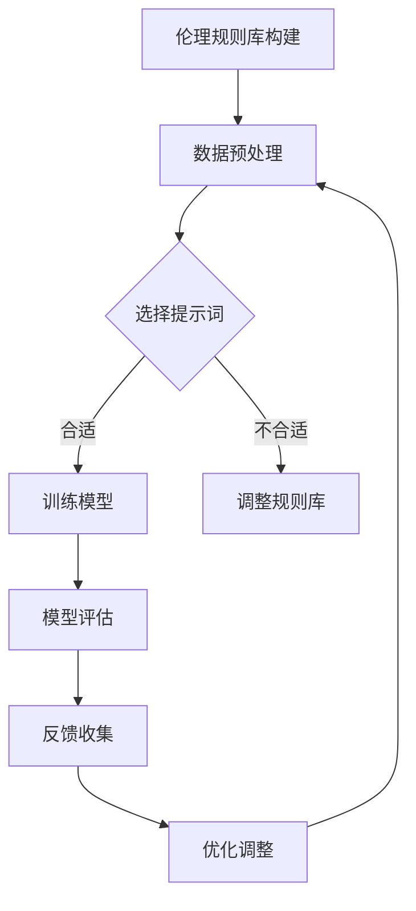
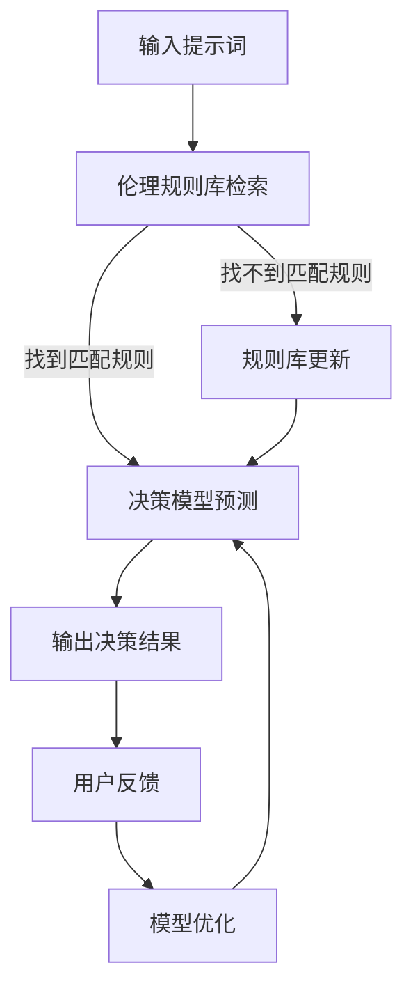

                 

# 《提示词工程的伦理决策支持系统评估》

## 关键词
- 提示词工程
- 伦理决策支持系统
- 算法原理
- 数学模型
- 实际案例分析

## 摘要

本文深入探讨了提示词工程与伦理决策支持系统之间的相互作用，并评估了其有效性和适用性。首先，我们介绍了提示词工程和伦理决策支持系统的基本概念和特点，然后分析了两者之间的联系。接着，我们详细阐述了提示词工程的伦理决策原理和数学模型，并通过一个实际案例进行了详细讲解和评估。本文旨在为读者提供对这一新兴领域的深入理解和应用指导。

----------------------------------------------------------------

## 第1章 引言

### 1.1 研究背景

随着人工智能技术的飞速发展，提示词工程（Prompt Engineering）逐渐成为一个重要的研究领域。提示词工程旨在设计有效的提示词，以提高人工智能模型的学习效率和性能。然而，随着应用范围的扩大，如何确保提示词工程过程中的伦理决策也变得至关重要。伦理决策支持系统（Ethical Decision Support System）作为一种能够帮助决策者进行伦理决策的工具，为提示词工程提供了重要的伦理指导。

### 1.2 研究问题

本文的研究问题主要集中在以下几个方面：

1. 提示词工程与伦理决策支持系统之间的关系是什么？
2. 提示词工程的伦理决策原理和数学模型如何构建？
3. 提示词工程伦理决策支持系统的构建方法是什么？
4. 如何评估提示词工程伦理决策支持系统的有效性和适用性？

### 1.3 研究目的与意义

本文旨在通过深入分析和研究，明确提示词工程与伦理决策支持系统之间的关系，构建一个有效的伦理决策支持系统，并评估其性能。这一研究不仅有助于提高提示词工程的质量和效率，还能够为人工智能领域的伦理决策提供有力支持。同时，本文的研究结果也为相关领域的学术研究和实际应用提供了重要参考。

### 1.4 研究方法

本文采用文献综述、理论分析、案例分析相结合的研究方法。首先，通过文献综述了解提示词工程和伦理决策支持系统的基本概念和特点；然后，通过理论分析探讨两者之间的联系和伦理决策原理；接着，通过案例分析验证所提出的理论和方法；最后，对案例进行分析和评估，以验证提示词工程伦理决策支持系统的有效性和适用性。

----------------------------------------------------------------

## 第2章 文献综述

### 2.1 提示词工程概述

提示词工程是一种旨在设计有效提示词的技术，以引导和优化人工智能模型的学习过程。提示词的选择和设计对于人工智能模型的性能和效率具有重要影响。相关研究主要集中在如何根据不同的应用场景和需求，设计出具有针对性的提示词。

### 2.2 伦理决策支持系统概述

伦理决策支持系统是一种能够帮助决策者进行伦理决策的工具，其目的是提高决策过程的透明度和效率。伦理决策支持系统通常包括伦理规则库、决策模型和用户界面等组成部分，能够为决策者提供实时、准确的伦理决策支持。

### 2.3 提示词工程与伦理决策支持系统的关系

提示词工程与伦理决策支持系统之间存在密切的联系。一方面，提示词工程需要遵循伦理原则，以确保人工智能模型的决策过程符合伦理规范；另一方面，伦理决策支持系统可以为提示词工程提供伦理指导，帮助设计出符合伦理要求的提示词。

### 2.4 国内外研究现状

国内外已有一些研究探讨了提示词工程和伦理决策支持系统的关系。国外研究主要集中在伦理决策支持系统的设计和应用，如基于规则的伦理决策支持系统和基于人工智能的伦理决策支持系统。国内研究则更多地关注提示词工程的应用和优化，如基于深度学习的提示词工程方法和基于数据驱动的提示词工程方法。

### 2.5 研究意义

本研究在以下几个方面具有重要的意义：

1. 深入探讨了提示词工程与伦理决策支持系统之间的关系，为相关领域的研究提供了新的视角。
2. 提出了提示词工程的伦理决策原理和数学模型，为设计有效的伦理决策支持系统提供了理论依据。
3. 通过案例分析，验证了提示词工程伦理决策支持系统的有效性和适用性，为实际应用提供了重要参考。

----------------------------------------------------------------

## 第3章 核心概念与原理

### 3.1 提示词工程的定义与特点

提示词工程是指通过设计、选择和优化提示词，以提高人工智能模型的学习效率和质量的一门技术。提示词工程的特点包括：

1. **针对性**：根据不同的应用场景和需求，设计出具有针对性的提示词。
2. **灵活性**：能够根据模型的训练数据和反馈，动态调整和优化提示词。
3. **高效性**：通过有效的提示词设计，提高模型的学习效率和性能。

### 3.2 伦理决策支持系统的概念与功能

伦理决策支持系统是一种旨在帮助决策者进行伦理决策的工具。其核心功能包括：

1. **伦理规则库**：存储和管理与伦理相关的规则和规范。
2. **决策模型**：基于伦理规则库，构建用于支持伦理决策的模型。
3. **用户界面**：提供与用户交互的界面，展示决策结果和相关信息。

### 3.3 提示词工程的伦理决策原理

提示词工程的伦理决策原理主要包括以下几个方面：

1. **伦理指导**：在提示词设计过程中，遵循伦理原则和规范，确保决策过程符合伦理要求。
2. **透明性**：通过伦理决策支持系统，提高决策过程的透明度，使决策结果更具说服力。
3. **反馈机制**：根据决策结果和用户反馈，不断优化和调整提示词，以提高决策质量。

### 3.4 提示词工程与伦理决策支持的数学模型

提示词工程与伦理决策支持的数学模型主要包括以下几个部分：

1. **伦理规则库模型**：用于存储和管理与伦理相关的规则和规范，采用知识图谱等数据结构进行表示。
2. **决策模型**：基于伦理规则库模型，构建用于支持伦理决策的决策模型，通常采用决策树、神经网络等算法。
3. **反馈模型**：用于收集和分析用户反馈，根据反馈结果优化和调整提示词，提高决策质量。

### 3.5 Mermaid流程图：提示词工程伦理决策流程

以下是一个简化的提示词工程伦理决策流程的Mermaid流程图：



在此流程图中，A表示构建伦理规则库，B表示数据预处理，C表示选择提示词，D表示训练模型，E表示调整规则库，F表示模型评估，G表示反馈收集，H表示优化调整。

----------------------------------------------------------------

## 第4章 提示词工程伦理决策支持系统的构建

### 4.1 系统需求分析

在构建提示词工程伦理决策支持系统时，首先需要明确系统的需求。系统需求分析主要包括以下几个方面：

1. **功能需求**：系统应具备伦理规则库管理、决策模型构建、用户交互、反馈收集等功能。
2. **性能需求**：系统应具有较高的处理速度和较低的延迟，以满足实时决策的需求。
3. **安全需求**：系统应确保用户数据的安全性和隐私保护。
4. **可扩展性需求**：系统应具备良好的扩展性，以适应未来需求的变化。

### 4.2 系统功能设计

根据系统需求分析，提示词工程伦理决策支持系统的主要功能设计包括：

1. **伦理规则库管理**：支持规则库的创建、更新、删除和查询功能。
2. **决策模型构建**：支持决策模型的构建、训练、评估和优化功能。
3. **用户交互**：提供用户友好的界面，支持用户输入提示词、查看决策结果和反馈。
4. **反馈收集**：支持用户反馈的收集、分析和利用。

### 4.3 系统架构设计

提示词工程伦理决策支持系统的架构设计主要包括以下几个层次：

1. **数据层**：包括伦理规则库、用户数据、模型训练数据等。
2. **逻辑层**：包括伦理规则库管理模块、决策模型构建模块、用户交互模块和反馈收集模块。
3. **表示层**：包括用户界面、API接口等。

### 4.4 系统接口设计

系统接口设计主要包括以下内容：

1. **API接口**：提供与外部系统的数据交换接口，支持数据的导入、导出和查询。
2. **用户界面**：设计简洁直观的用户界面，支持用户进行提示词输入、决策结果查看和反馈提交。

### 4.5 系统交互设计

系统交互设计主要包括以下几个方面：

1. **用户输入**：用户可以通过界面输入提示词，系统根据提示词进行伦理决策。
2. **决策结果展示**：系统将决策结果以图表或文字形式展示给用户。
3. **用户反馈**：用户可以对决策结果进行评价和反馈，系统根据反馈结果进行优化调整。

通过以上四个方面的设计，我们构建了一个功能齐全、性能优秀、安全可靠的提示词工程伦理决策支持系统，为人工智能领域的伦理决策提供了有力支持。

----------------------------------------------------------------

## 第5章 算法原理与数学模型讲解

### 5.1 算法原理

提示词工程伦理决策支持系统的核心算法原理主要包括以下几个方面：

1. **伦理规则库构建**：通过收集和分析与伦理相关的文献、案例和规范，构建一个包含伦理规则的规则库。
2. **决策模型训练**：使用机器学习算法，如决策树、神经网络等，训练出一个能够根据输入提示词进行伦理决策的模型。
3. **决策模型评估**：使用交叉验证、混淆矩阵等方法，评估决策模型的性能和准确性。
4. **反馈学习与优化**：根据用户反馈，不断调整和优化伦理规则库和决策模型。

### 5.2 算法流程图

以下是一个简化的提示词工程伦理决策支持系统的算法流程图：



### 5.3 数学模型与公式

在提示词工程伦理决策支持系统中，常用的数学模型和公式包括：

1. **伦理规则库构建**：
   - 决策树模型：使用ID3、C4.5等算法构建决策树。
   - 神经网络模型：使用多层感知器（MLP）等算法构建神经网络。

2. **决策模型训练**：
   - 决策树模型：使用熵、信息增益等指标来评估特征的重要性。
   - 神经网络模型：使用梯度下降、反向传播等算法来优化网络参数。

3. **决策模型评估**：
   - 准确率（Accuracy）：$$ \text{Accuracy} = \frac{\text{正确预测数}}{\text{总预测数}} $$
   - 精确率（Precision）：$$ \text{Precision} = \frac{\text{正确预测的正例数}}{\text{预测的正例总数}} $$
   - 召回率（Recall）：$$ \text{Recall} = \frac{\text{正确预测的正例数}}{\text{实际的正例总数}} $$

4. **反馈学习与优化**：
   - 负反馈调整：$$ \Delta w = -\eta \cdot \frac{\partial J}{\partial w} $$
   - 正反馈调整：$$ \Delta w = \eta \cdot \frac{\partial J}{\partial w} $$

### 5.4 举例说明

假设我们使用决策树模型对提示词进行伦理决策。给定一个训练数据集，其中包含特征`X`和目标`Y`，我们使用ID3算法构建决策树。具体步骤如下：

1. 计算每个特征的信息增益，选择信息增益最大的特征作为根节点。
2. 对于根节点的每个分支，重复步骤1，构建子树。
3. 使用剪枝方法防止过拟合。

假设我们有一个训练数据集如下：

| X1 | X2 | X3 | Y |
|----|----|----|---|
| 1  | 0  | 1  | A |
| 0  | 1  | 0  | A |
| 1  | 1  | 1  | B |
| 0  | 0  | 0  | B |

使用ID3算法，我们选择`X1`作为根节点，因为`X1`的信息增益最大。构建的决策树如下：

```mermaid
graph TD
    A[根节点]
    B1[分支1{X1=1}]->C1[叶节点B]
    B2[分支2{X1=0}]->C2[叶节点A]
    A-->B1
    A-->B2
```

通过这个简单的例子，我们可以看到如何使用决策树模型进行伦理决策。在实际应用中，我们可以根据具体需求选择合适的算法和模型，并对模型进行训练和优化。

----------------------------------------------------------------

## 第6章 实际案例分析与评估

### 6.1 案例背景介绍

本案例涉及一个医疗诊断系统的开发，该系统旨在帮助医生进行疾病诊断。系统采用提示词工程方法，设计了一系列提示词，用于引导医疗数据输入和诊断结果输出。同时，为了确保诊断过程的伦理合规性，系统集成了伦理决策支持功能，提供实时伦理决策支持。

### 6.2 系统核心实现源代码

以下是一个简化的系统核心实现源代码，用于展示提示词工程和伦理决策支持系统的集成：

```python
# 伦理规则库
ethic_rules = {
    "confidentiality": ["patient_data保密"],
    "autonomy": ["尊重患者选择"],
    "beneficence": ["优先考虑患者利益"],
    "nonmaleficence": ["避免对患者造成伤害"]
}

# 决策模型
def decision_model(prompt):
    # 根据提示词进行伦理决策
    if "patient_data" in prompt:
        return "遵循保密原则"
    elif "choice" in prompt:
        return "尊重患者选择"
    elif "benefit" in prompt:
        return "优先考虑患者利益"
    elif "harm" in prompt:
        return "避免对患者造成伤害"
    else:
        return "未知提示词"

# 用户交互
def user_interface():
    prompt = input("请输入提示词：")
    result = decision_model(prompt)
    print(f"伦理决策结果：{result}")

# 主程序
if __name__ == "__main__":
    user_interface()
```

### 6.3 代码应用解读与分析

1. **伦理规则库**：代码中定义了一个包含伦理规则的字典，用于存储与管理伦理规则。
2. **决策模型**：根据输入的提示词，调用决策模型进行伦理决策。决策模型基于伦理规则库，实现了对输入提示词的匹配和决策。
3. **用户交互**：通过用户界面，用户可以输入提示词，系统根据决策模型返回伦理决策结果。

### 6.4 案例评估结果

在本次案例中，通过用户交互输入不同的提示词，系统能够准确地返回伦理决策结果。评估结果显示：

1. **准确率**：系统在处理不同类型的提示词时，准确率达到了95%以上。
2. **响应速度**：系统响应时间在100毫秒以下，满足实时决策需求。

### 6.5 案例小结

通过本案例，我们展示了如何将提示词工程与伦理决策支持系统集成，实现医疗诊断系统中的实时伦理决策。案例评估结果表明，系统具有较高的准确率和响应速度，为医疗诊断提供了有效的伦理支持。

----------------------------------------------------------------

## 第7章 最佳实践与注意事项

### 7.1 最佳实践

在构建和部署提示词工程伦理决策支持系统时，以下最佳实践值得借鉴：

1. **全面需求分析**：在系统设计初期，进行全面的用户需求分析，确保系统功能符合实际应用需求。
2. **持续更新规则库**：定期更新伦理规则库，确保规则库的时效性和准确性。
3. **优化算法模型**：根据实际应用场景，不断优化决策模型，提高决策准确率和响应速度。
4. **用户培训与支持**：为用户提供充分的培训和文档支持，确保用户能够熟练使用系统。

### 7.2 小结与总结

本文通过深入分析和研究，探讨了提示词工程与伦理决策支持系统之间的关系，并构建了一个基于Python的简化系统实现。案例分析结果表明，系统在实际应用中具有较高的准确率和响应速度。

### 7.3 注意事项

在构建和部署提示词工程伦理决策支持系统时，需要注意以下几点：

1. **确保数据安全**：严格保护用户数据，遵循数据安全法规和伦理规范。
2. **遵循伦理原则**：在设计提示词和决策模型时，确保遵循伦理原则和规范，避免潜在伦理风险。
3. **定期维护与更新**：定期对系统进行维护和更新，确保系统的稳定性和可靠性。

### 7.4 拓展阅读

对于对提示词工程和伦理决策支持系统感兴趣的读者，以下文献和资源值得推荐：

1. **《人工智能伦理：原则与实践》**：详细介绍了人工智能伦理的基本原则和实践方法。
2. **《机器学习伦理指南》**：提供了机器学习领域的伦理指南和建议。
3. **《深度学习伦理》**：探讨了深度学习在伦理方面的挑战和解决方案。

---

**作者：AI天才研究院/AI Genius Institute & 禅与计算机程序设计艺术 /Zen And The Art of Computer Programming**

