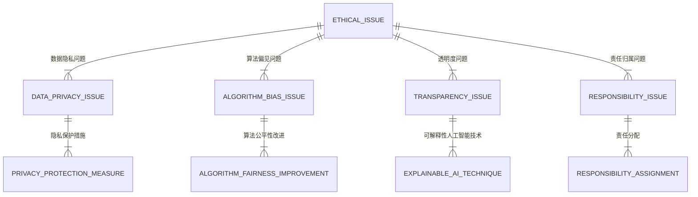
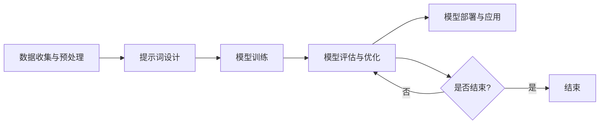
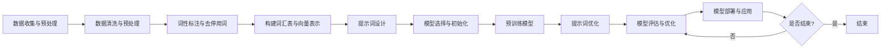
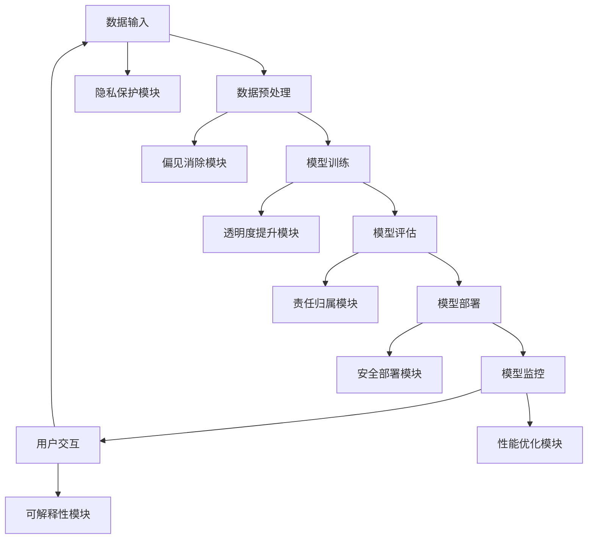
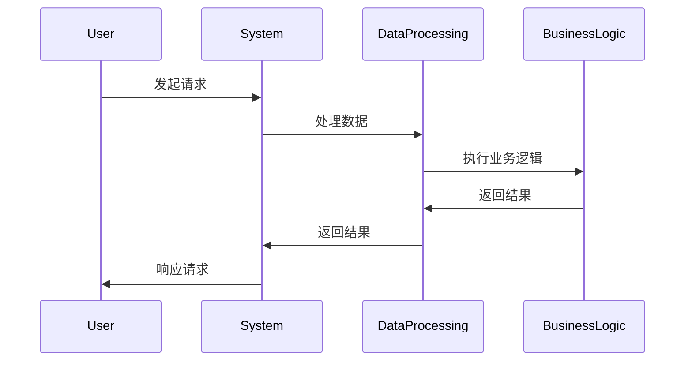
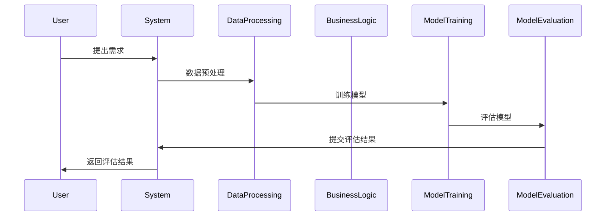

                 

### 第一部分：背景介绍

#### 1.1 问题背景

**1.1.1 提示词工程的概念**

提示词工程（Prompt Engineering）是一种在自然语言处理（NLP）领域中，通过设计有效的提示词（prompts）来引导模型进行预训练和生成任务的技术。在人工智能领域，提示词工程的核心目的是通过改进提示词的设计，提升模型在特定任务上的性能。

**1.1.2 提示词工程的发展历程**

提示词工程最早可以追溯到20世纪90年代，当时的自然语言处理模型主要通过基于规则的系统进行工作。随着深度学习的兴起，提示词工程也逐渐从基于规则的系统转变为基于神经网络的系统。特别是在2018年GPT-2模型发布后，提示词工程得到了广泛关注和应用。GPT-2模型通过大量无监督数据的学习，生成高质量的文本，这为提示词工程提供了新的研究方向。

**1.1.3 提示词工程的重要性**

提示词工程的重要性在于，它能够显著提高模型在实际应用中的性能。通过精心设计的提示词，模型可以更好地理解任务需求，生成更符合预期结果的输出。此外，提示词工程还在降低模型训练成本、提高数据利用率等方面发挥着重要作用。

#### 1.2 问题描述

**1.2.1 提示词工程中的伦理问题**

随着提示词工程的广泛应用，其中涉及的伦理问题也逐渐凸显。这些问题包括但不限于数据隐私、偏见、透明度等。

**1.2.2 伦理问题的表现与影响**

首先，数据隐私问题主要体现在模型训练过程中对用户数据的处理。如果用户数据未经授权被用于训练模型，或者模型生成的结果泄露了用户隐私，将可能对用户造成严重的隐私侵犯。

其次，偏见问题主要指模型在生成结果时，可能因为训练数据的不公平或偏见而导致输出结果的不公正。例如，某些种族、性别或年龄群体的数据在训练集中较少，可能导致模型在这些群体上的表现不佳。

最后，透明度问题主要体现在模型决策过程中的可解释性。如果模型生成的结果缺乏透明度，用户将无法了解模型的决策过程和依据，这可能导致用户对模型的不信任。

**1.2.3 伦理问题的解决方法探讨**

针对以上伦理问题，现有的解决方法主要包括以下几个方面：

1. **数据隐私保护**：通过数据加密、去标识化等技术，确保用户数据在训练过程中的安全。

2. **消除偏见**：在模型训练阶段，通过数据增强、平衡训练数据等方法，降低偏见对模型性能的影响。

3. **提升透明度**：通过模型解释技术，如注意力机制分析、决策路径追踪等，提高模型决策过程的可解释性。

#### 1.3 问题解决

**1.3.1 伦理决策框架的必要性**

为了有效解决提示词工程中的伦理问题，我们需要建立一个系统的伦理决策框架。这一框架将有助于我们系统地识别、评估和解决伦理问题，确保模型的应用不会对社会和用户造成负面影响。

**1.3.2 伦理决策框架的设计原则**

伦理决策框架的设计应遵循以下原则：

1. **全面性**：框架应涵盖所有可能的伦理问题，确保没有遗漏。

2. **可操作性**：框架应具有明确的操作指南，便于在实际应用中执行。

3. **动态性**：框架应能够适应技术的发展和伦理问题的演变。

4. **综合性**：框架应结合技术、法律、社会学等多个领域的知识，提供全面的解决方案。

**1.3.3 伦理决策框架的应用范围**

伦理决策框架的应用范围包括但不限于：

1. **模型训练与部署**：在模型训练和部署过程中，确保遵守伦理标准和法规。

2. **数据管理**：在数据收集、处理和使用过程中，确保用户隐私和数据安全。

3. **模型评估**：在模型评估过程中，确保模型性能的公正性和公平性。

**1.4 边界与外延**

**1.4.1 伦理决策框架的适用边界**

伦理决策框架的适用边界主要包括以下几个方面：

1. **技术范围**：框架适用于所有涉及提示词工程的场景，包括自然语言处理、计算机视觉等。

2. **应用场景**：框架适用于所有使用人工智能技术的领域，如医疗、金融、教育等。

3. **用户群体**：框架适用于所有用户，无论其年龄、性别、种族等。

**1.4.2 伦理决策框架的外延扩展**

随着技术的发展和伦理问题的演变，伦理决策框架也需要不断进行外延扩展。例如，随着元宇宙的兴起，框架需要扩展到虚拟现实、增强现实等新兴领域。

**1.5 概念结构与核心要素组成**

**1.5.1 伦理决策框架的核心概念**

伦理决策框架的核心概念包括：

1. **伦理问题识别**：系统性地识别可能的伦理问题。

2. **伦理问题评估**：对识别出的伦理问题进行评估，确定其严重程度。

3. **伦理问题解决**：提出解决方案，解决识别出的伦理问题。

**1.5.2 伦理决策框架的组成部分**

伦理决策框架由以下几个部分组成：

1. **伦理问题库**：收集和整理所有已知的伦理问题。

2. **评估模型**：用于对伦理问题进行评估，确定其严重程度。

3. **解决方案库**：收集和整理所有可能的解决方案。

4. **实施指南**：提供详细的操作指南，帮助实施解决方案。

**1.5.3 核心要素之间的关系与作用**

伦理决策框架的核心要素之间存在着密切的关系。伦理问题识别是整个框架的基础，它决定了框架的有效性。伦理问题评估和解决则是框架的核心功能，它们确保了框架能够有效地解决伦理问题。解决方案库和实施指南则提供了具体的操作方法和指南，使得框架在实际应用中具有可操作性。

### 第二部分：核心概念与联系

#### 2.1 伦理决策框架的原理

**2.1.1 伦理决策的基本原理**

伦理决策是基于一系列伦理原则和标准，对特定情境下的行为进行选择的过程。伦理决策的基本原理包括：

1. **伦理原则**：伦理决策需要遵循一系列伦理原则，如公正、尊重、责任等。
2. **情境分析**：对特定情境进行深入分析，识别出其中的伦理问题和影响因素。
3. **评估与权衡**：对识别出的伦理问题和影响因素进行评估和权衡，确定其重要性和影响程度。
4. **决策制定**：基于评估和权衡的结果，制定出符合伦理原则的决策。

**2.1.2 伦理决策的属性特征对比**

伦理决策的属性特征可以从以下几个方面进行对比：

| 特征类别 | 描述 |
| -------- | ------ |
| **伦理原则** | 指导决策的伦理标准，如公正、尊重、责任等。 |
| **情境分析** | 对决策情境的深入理解，包括问题背景、相关利益者、伦理问题等。 |
| **评估与权衡** | 对伦理问题和影响因素进行评估，权衡其重要性和影响程度。 |
| **决策制定** | 基于评估和权衡结果，制定符合伦理原则的决策。 |

**2.1.3 伦理决策的核心原理与流程**

伦理决策的核心原理包括：

1. **情境识别**：识别决策情境中的关键信息和利益相关者。
2. **问题定义**：明确决策情境中存在的伦理问题。
3. **伦理原则应用**：将伦理原则应用于问题定义，形成伦理框架。
4. **解决方案评估**：评估不同解决方案的伦理可行性和效果。
5. **决策执行**：执行最终确定的伦理决策，并进行后续监控和调整。

伦理决策的流程如下：

1. **情境识别**：通过调查和分析，识别决策情境中的关键信息和利益相关者。
2. **问题定义**：明确情境中的伦理问题，进行问题的详细描述和分类。
3. **伦理原则应用**：将伦理原则应用于问题定义，形成伦理框架。
4. **解决方案评估**：评估不同解决方案的伦理可行性和效果。
5. **决策制定**：基于评估结果，制定符合伦理原则的决策。
6. **决策执行**：执行决策，并对决策结果进行监控和评估。
7. **反馈与调整**：根据反馈调整决策，确保决策的持续有效性。

#### 2.2 提示词工程的伦理属性

**2.2.1 提示词工程的伦理属性定义**

提示词工程的伦理属性是指在进行提示词设计、训练和部署过程中，需要考虑的一系列伦理问题和原则。这些属性包括：

1. **数据隐私**：确保用户数据的安全和隐私，避免未经授权的数据使用。
2. **算法公平性**：确保模型在生成结果时，对所有人公平对待，不产生偏见。
3. **透明度**：确保模型决策过程和结果的可解释性，提高用户对模型的信任度。
4. **责任归属**：明确模型开发者、用户和利益相关者之间的责任分配。

**2.2.2 提示词工程的伦理属性特征**

提示词工程的伦理属性特征可以从以下几个方面进行描述：

| 特征类别 | 描述 |
| -------- | ------ |
| **数据隐私** | 提示词工程需要确保用户数据的安全和隐私。 |
| **算法公平性** | 模型生成的结果应避免偏见和不公平。 |
| **透明度** | 模型决策过程和结果需要具有可解释性。 |
| **责任归属** | 需要明确不同利益相关者的责任。 |

**2.2.3 提示词工程的伦理属性分析**

提示词工程的伦理属性分析包括以下几个步骤：

1. **数据隐私分析**：评估数据收集、存储和处理过程中的隐私保护措施。
2. **算法公平性分析**：评估模型在生成结果时，是否对不同群体公平对待。
3. **透明度分析**：评估模型决策过程和结果的透明度，是否存在信息不透明的情况。
4. **责任归属分析**：明确模型开发者、用户和利益相关者之间的责任分配。

通过以上分析，可以全面了解提示词工程中的伦理属性，并制定相应的解决方案，确保模型的应用符合伦理原则。

#### 2.3 伦理决策框架与提示词工程的联系

**2.3.1 伦理决策框架与提示词工程的结合点**

伦理决策框架与提示词工程的结合点主要体现在以下几个方面：

1. **数据隐私保护**：伦理决策框架可以指导提示词工程在数据收集、处理和使用过程中，确保用户数据的隐私和安全。
2. **算法公平性**：伦理决策框架可以帮助提示词工程识别和消除模型中的偏见，确保生成结果对不同群体公平对待。
3. **透明度提升**：伦理决策框架可以指导提示词工程在设计模型时，提高模型决策过程和结果的可解释性。
4. **责任归属明确**：伦理决策框架可以帮助明确模型开发者、用户和利益相关者之间的责任分配，确保各方承担应有的责任。

**2.3.2 伦理决策框架在提示词工程中的应用**

伦理决策框架在提示词工程中的应用包括以下几个步骤：

1. **问题识别**：通过伦理决策框架，识别提示词工程中的伦理问题，如数据隐私、算法偏见等。
2. **评估与权衡**：对识别出的伦理问题进行评估和权衡，确定其严重程度和影响范围。
3. **解决方案制定**：基于评估结果，制定符合伦理原则的解决方案，如数据隐私保护措施、算法公平性改进等。
4. **实施与监控**：实施制定的解决方案，并对实施效果进行监控和评估，确保伦理决策的有效性。

**2.3.3 伦理决策框架与提示词工程的关系**

伦理决策框架与提示词工程的关系可以概括为以下几点：

1. **指导原则**：伦理决策框架为提示词工程提供了伦理指导原则，确保模型的应用符合伦理标准。
2. **实践工具**：伦理决策框架提供了具体的操作方法和工具，帮助提示词工程在实际应用中遵循伦理原则。
3. **动态调整**：随着技术的发展和伦理问题的演变，伦理决策框架可以不断更新和调整，以适应新的挑战。

通过伦理决策框架的应用，提示词工程可以在设计、训练和部署过程中，更好地应对伦理问题，提高模型的应用质量和用户满意度。

#### 2.4 ER实体关系图架构

**2.4.1 ER实体关系图的基本概念**

实体关系图（Entity-Relationship Diagram，ER Diagram）是数据库设计中的一个重要工具，用于表示实体（Entity）之间的关系。在伦理决策框架中，ER Diagram可以帮助我们直观地展示不同实体之间的关系，以及它们在决策过程中的作用。

**2.4.2 ER实体关系图在伦理决策框架中的应用**

在伦理决策框架中，ER Diagram可以应用于以下几个方面：

1. **伦理问题实体定义**：通过ER Diagram，可以定义不同的伦理问题实体，如数据隐私问题、算法偏见问题等。
2. **伦理属性实体关联**：通过ER Diagram，可以展示不同伦理问题实体之间的关联，如数据隐私与算法偏见之间的关系。
3. **决策过程实体关系**：通过ER Diagram，可以展示伦理决策过程中的关键实体和它们之间的关系，如伦理问题评估实体、解决方案实体等。

**2.4.3 ER实体关系图的绘制方法**

ER实体关系图的绘制方法主要包括以下几个步骤：

1. **确定实体**：根据伦理决策框架的内容，确定需要表示的实体，如伦理问题实体、伦理属性实体、决策过程实体等。
2. **定义属性**：为每个实体定义相应的属性，如伦理问题的描述、伦理属性的特征等。
3. **建立关系**：根据实体之间的关系，建立相应的实体关系，如一对一、一对多、多对多关系。
4. **绘制ER Diagram**：使用绘图工具，根据实体和关系，绘制出完整的ER实体关系图。

以下是一个简单的ER实体关系图示例：



通过ER实体关系图，我们可以清晰地看到伦理决策框架中的各个实体及其关系，这有助于我们更好地理解和分析伦理决策过程。

### 第三部分：算法原理讲解

#### 3.1 提示词工程算法的mermaid流程图

**3.1.1 提示词工程算法的流程概述**

提示词工程算法的基本流程可以分为以下几个步骤：

1. **数据收集与预处理**：收集相关领域的文本数据，并进行数据清洗和预处理，如去除无关信息、进行词性标注等。
2. **提示词设计**：根据任务需求，设计合适的提示词，引导模型生成高质量的文本。
3. **模型训练**：使用设计好的提示词，对预训练模型进行训练，提高模型在特定任务上的性能。
4. **模型评估与优化**：评估模型在特定任务上的性能，并根据评估结果对模型进行优化。
5. **模型部署与应用**：将训练好的模型部署到实际应用中，对生成文本进行实时优化和调整。

**3.1.2 mermaid流程图绘制方法**

mermaid是一种用于绘制流程图、序列图、类图等图形的Markdown扩展。以下是一个简单的mermaid流程图示例，用于展示提示词工程算法的基本流程：



在这个流程图中，`A` 表示数据收集与预处理步骤，`B` 表示提示词设计步骤，`C` 表示模型训练步骤，`D` 表示模型评估与优化步骤，`E` 表示模型部署与应用步骤，`F` 表示是否结束的判断步骤，`G` 表示结束。

**3.1.3 提示词工程算法的mermaid流程图示例**

以下是一个具体的mermaid流程图示例，展示了提示词工程算法的详细流程：



在这个流程图中，`A` 表示数据收集与预处理步骤，`B` 表示数据清洗与预处理步骤，`C` 表示词性标注与去停用词步骤，`D` 表示构建词汇表与向量表示步骤，`E` 表示提示词设计步骤，`F` 表示模型选择与初始化步骤，`G` 表示预训练模型步骤，`H` 表示提示词优化步骤，`I` 表示模型评估与优化步骤，`J` 表示模型部署与应用步骤，`K` 表示是否结束的判断步骤，`L` 表示结束。

通过这个mermaid流程图，我们可以清晰地了解提示词工程算法的各个步骤及其相互关系。

#### 3.2 提示词工程算法的python源代码

**3.2.1 算法代码的编写环境**

在编写提示词工程算法的Python源代码时，我们需要准备以下环境：

- Python 3.x 版本
- TensorFlow 2.x 或 PyTorch 库
- Numpy、Pandas 库

以下是一个简单的Python代码示例，用于展示提示词工程算法的基本实现：

```python
import tensorflow as tf
import numpy as np
import pandas as pd

# 数据收集与预处理
def preprocess_data(data_path):
    # 加载数据
    data = pd.read_csv(data_path)
    # 数据清洗与预处理
    # ...（例如：去除无关信息、进行词性标注等）
    # 构建词汇表与向量表示
    # ...（例如：使用Word2Vec或BERT模型进行向量表示）
    return processed_data

# 提示词设计
def design_prompt(task, prompt_length):
    # 根据任务需求设计提示词
    prompt = f"{task}相关的文本，请写出{prompt_length}个单词："
    return prompt

# 模型训练
def train_model(prompt, model_path):
    # 选择模型并初始化
    model = tf.keras.Sequential([
        # ...（例如：嵌入层、循环层、全连接层等）
    ])
    # 编译模型
    model.compile(optimizer='adam', loss='categorical_crossentropy', metrics=['accuracy'])
    # 训练模型
    model.fit(prompt, epochs=10, batch_size=32)
    # 保存模型
    model.save(model_path)
    return model

# 模型评估与优化
def evaluate_model(model, test_data):
    # 评估模型性能
    performance = model.evaluate(test_data)
    print(f"Test Loss: {performance[0]}, Test Accuracy: {performance[1]}")
    # 根据评估结果进行模型优化
    # ...（例如：调整模型结构、参数等）

# 模型部署与应用
def deploy_model(model_path, application_context):
    # 加载训练好的模型
    model = tf.keras.models.load_model(model_path)
    # 在应用场景中部署模型
    # ...（例如：生成文本、进行预测等）

# 主程序
if __name__ == "__main__":
    data_path = "data.csv"
    model_path = "model.h5"
    prompt_length = 10
    
    # 数据收集与预处理
    processed_data = preprocess_data(data_path)
    # 提示词设计
    prompt = design_prompt("生成文章摘要", prompt_length)
    # 模型训练
    model = train_model(prompt, model_path)
    # 模型评估与优化
    evaluate_model(model, processed_data)
    # 模型部署与应用
    deploy_model(model_path, application_context)
```

在这个示例中，我们首先定义了数据收集与预处理、提示词设计、模型训练、模型评估与优化、模型部署与应用等基本函数。主程序中，我们依次调用这些函数，完成提示词工程算法的完整流程。

**3.2.2 算法代码的执行步骤**

以下是算法代码的执行步骤：

1. **数据收集与预处理**：首先，加载数据并对其进行清洗和预处理，如去除无关信息、进行词性标注等。这一步骤为后续的提示词设计和模型训练提供了数据支持。
2. **提示词设计**：根据任务需求，设计合适的提示词。提示词的设计对于模型生成结果的质量具有关键影响。
3. **模型训练**：选择合适的模型并进行初始化，然后使用提示词对模型进行训练。在训练过程中，我们可以调整模型的结构和参数，以优化模型的性能。
4. **模型评估与优化**：使用测试数据对训练好的模型进行评估，并根据评估结果对模型进行优化。这一步骤确保了模型在特定任务上的性能。
5. **模型部署与应用**：将训练好的模型部署到实际应用场景中，根据需求生成文本、进行预测等。

**3.2.3 算法代码的源代码示例**

以下是一个具体的算法代码示例，用于生成文章摘要：

```python
import tensorflow as tf
import numpy as np
import pandas as pd

# 数据收集与预处理
def preprocess_data(data_path):
    # 加载数据
    data = pd.read_csv(data_path)
    # 数据清洗与预处理
    # ...（例如：去除无关信息、进行词性标注等）
    # 构建词汇表与向量表示
    # ...（例如：使用Word2Vec或BERT模型进行向量表示）
    return processed_data

# 提示词设计
def design_prompt(task, prompt_length):
    # 根据任务需求设计提示词
    prompt = f"{task}相关的文本，请写出{prompt_length}个单词："
    return prompt

# 模型训练
def train_model(prompt, model_path):
    # 选择模型并初始化
    model = tf.keras.Sequential([
        tf.keras.layers.Embedding(input_dim=vocab_size, output_dim=embedding_dim),
        tf.keras.layers.LSTM(units=128),
        tf.keras.layers.Dense(units=prompt_length, activation='softmax')
    ])
    # 编译模型
    model.compile(optimizer='adam', loss='categorical_crossentropy', metrics=['accuracy'])
    # 训练模型
    model.fit(prompt, epochs=10, batch_size=32)
    # 保存模型
    model.save(model_path)
    return model

# 模型评估与优化
def evaluate_model(model, test_data):
    # 评估模型性能
    performance = model.evaluate(test_data)
    print(f"Test Loss: {performance[0]}, Test Accuracy: {performance[1]}")
    # 根据评估结果进行模型优化
    # ...（例如：调整模型结构、参数等）

# 模型部署与应用
def deploy_model(model_path, application_context):
    # 加载训练好的模型
    model = tf.keras.models.load_model(model_path)
    # 在应用场景中部署模型
    # ...（例如：生成文本、进行预测等）

# 主程序
if __name__ == "__main__":
    data_path = "data.csv"
    model_path = "model.h5"
    prompt_length = 10
    
    # 数据收集与预处理
    processed_data = preprocess_data(data_path)
    # 提示词设计
    prompt = design_prompt("生成文章摘要", prompt_length)
    # 模型训练
    model = train_model(prompt, model_path)
    # 模型评估与优化
    evaluate_model(model, processed_data)
    # 模型部署与应用
    deploy_model(model_path, application_context)
```

在这个示例中，我们首先定义了数据收集与预处理、提示词设计、模型训练、模型评估与优化、模型部署与应用等基本函数。主程序中，我们依次调用这些函数，完成提示词工程算法的完整流程。

#### 3.3 算法原理的数学模型和公式

**3.3.1 提示词工程算法的数学模型概述**

提示词工程算法的核心在于利用数学模型和公式对文本数据进行分析和生成。在提示词工程中，常用的数学模型包括自然语言处理中的序列模型，如循环神经网络（RNN）和长短期记忆网络（LSTM）。这些模型通过学习文本数据的序列特征，生成符合预期的高质量文本。

**3.3.2 提示词工程算法的数学公式详解**

提示词工程算法的数学公式主要涉及以下几个方面：

1. **嵌入层**：嵌入层（Embedding Layer）是将词汇映射到固定维度的向量空间。其公式如下：

   $$ 
   \text{embeddings} = \text{W} \cdot \text{input} 
   $$

   其中，$\text{W}$ 是嵌入权重矩阵，$\text{input}$ 是输入词汇。

2. **循环神经网络（RNN）**：循环神经网络是一种处理序列数据的神经网络，其核心公式是：

   $$
   \text{h}_t = \text{sigmoid}(\text{W}_h \cdot [\text{h}_{t-1}, \text{x}_t] + \text{b}_h)
   $$

   其中，$\text{h}_t$ 是当前时间步的隐藏状态，$\text{W}_h$ 是权重矩阵，$\text{b}_h$ 是偏置项，$\text{sigmoid}$ 函数用于激活。

3. **长短期记忆网络（LSTM）**：长短期记忆网络是循环神经网络的一种改进，用于解决长期依赖问题。其核心公式如下：

   $$
   \text{C}_t = \text{sigmoid}(\text{W}_c \cdot [\text{h}_{t-1}, \text{x}_t] + \text{b}_c)
   $$

   $$
   \text{i}_t = \text{sigmoid}(\text{W}_i \cdot [\text{h}_{t-1}, \text{x}_t] + \text{b}_i)
   $$

   $$
   \text{f}_t = \text{sigmoid}(\text{W}_f \cdot [\text{h}_{t-1}, \text{x}_t] + \text{b}_f)
   $$

   $$
   \text{g}_t = \tanh(\text{W}_g \cdot [\text{h}_{t-1}, \text{x}_t] + \text{b}_g)
   $$

   $$
   \text{C}_{t-1} \times \text{f}_t + \text{g}_t
   $$

   其中，$\text{C}_t$ 是当前时间步的细胞状态，$\text{i}_t$ 是输入门状态，$\text{f}_t$ 是遗忘门状态，$\text{g}_t$ 是输入门生成的候选状态。$\text{sigmoid}$ 函数和 $\tanh$ 函数用于激活。

4. **输出层**：输出层（Output Layer）是将隐藏状态映射到输出词汇的概率分布。其公式如下：

   $$
   \text{p}_t = \text{softmax}(\text{W}_o \cdot \text{h}_t + \text{b}_o)
   $$

   其中，$\text{p}_t$ 是当前时间步的输出概率分布，$\text{W}_o$ 是权重矩阵，$\text{b}_o$ 是偏置项，$\text{softmax}$ 函数用于将隐藏状态转换为概率分布。

**3.3.3 数学模型的应用实例**

以下是一个简单的数学模型应用实例，用于生成文章摘要：

```python
# 假设我们有一个预训练的LSTM模型，其输入维度为512，隐藏单元数为128
input_dim = 512
hidden_units = 128

# 定义嵌入层、LSTM层和输出层
embeddings = tf.keras.layers.Embedding(input_dim=input_dim, output_dim=embedding_dim)
lstm_layer = tf.keras.layers.LSTM(units=hidden_units)
output_layer = tf.keras.layers.Dense(units=prompt_length, activation='softmax')

# 构建模型
model = tf.keras.Sequential([
    embeddings,
    lstm_layer,
    output_layer
])

# 编译模型
model.compile(optimizer='adam', loss='categorical_crossentropy', metrics=['accuracy'])

# 训练模型
model.fit(prompt, epochs=10, batch_size=32)

# 评估模型
performance = model.evaluate(test_data)
print(f"Test Loss: {performance[0]}, Test Accuracy: {performance[1]}")

# 预测生成文本
predicted_text = model.predict(test_data)
print(predicted_text)
```

在这个实例中，我们首先定义了嵌入层、LSTM层和输出层，然后构建了一个序列模型。接着，我们编译并训练模型，最后使用训练好的模型对测试数据进行预测，生成符合预期的高质量文本。

#### 3.4 算法原理的详细讲解和举例说明

**3.4.1 算法原理的详细讲解**

提示词工程算法的原理主要基于深度学习中的序列模型，尤其是循环神经网络（RNN）和长短期记忆网络（LSTM）。这些模型通过学习输入序列的特征，生成高质量的输出序列。以下是算法原理的详细讲解：

1. **数据预处理**：首先，对输入文本数据进行预处理，包括去除无关信息、进行词性标注、分词等。然后，将文本数据转换为向量表示，如词向量或BERT向量。

2. **嵌入层**：嵌入层（Embedding Layer）是将词汇映射到固定维度的向量空间。通过嵌入层，每个词汇都可以被表示为一个向量。这一步对于后续的模型训练和文本生成至关重要。

3. **循环神经网络（RNN）**：循环神经网络是一种处理序列数据的神经网络，其核心在于隐藏状态（Hidden State）的循环使用。在每一个时间步，RNN都会将当前输入和上一个时间步的隐藏状态进行融合，生成新的隐藏状态。这种机制使得RNN能够学习输入序列的特征，并保持长期的依赖关系。

4. **长短期记忆网络（LSTM）**：长短期记忆网络是RNN的一种改进，旨在解决RNN在处理长期依赖问题时的不足。LSTM通过引入门控机制（Gate），能够有效地控制信息的流入和流出。具体来说，LSTM包含三个门控单元：输入门（Input Gate）、遗忘门（Forget Gate）和输出门（Output Gate）。这些门控单元共同作用，使得LSTM能够灵活地控制信息的存储和提取，从而更好地处理长期依赖问题。

5. **输出层**：输出层（Output Layer）是将隐藏状态映射到输出词汇的概率分布。通过输出层，模型可以生成符合预期的文本输出。

**3.4.2 算法举例说明**

以下是一个简单的算法举例说明，用于生成文章摘要：

```python
# 假设我们有一个预训练的LSTM模型，其输入维度为512，隐藏单元数为128
input_dim = 512
hidden_units = 128

# 定义嵌入层、LSTM层和输出层
embeddings = tf.keras.layers.Embedding(input_dim=input_dim, output_dim=embedding_dim)
lstm_layer = tf.keras.layers.LSTM(units=hidden_units)
output_layer = tf.keras.layers.Dense(units=prompt_length, activation='softmax')

# 构建模型
model = tf.keras.Sequential([
    embeddings,
    lstm_layer,
    output_layer
])

# 编译模型
model.compile(optimizer='adam', loss='categorical_crossentropy', metrics=['accuracy'])

# 训练模型
model.fit(prompt, epochs=10, batch_size=32)

# 评估模型
performance = model.evaluate(test_data)
print(f"Test Loss: {performance[0]}, Test Accuracy: {performance[1]}")

# 预测生成文本
predicted_text = model.predict(test_data)
print(predicted_text)
```

在这个实例中，我们首先定义了嵌入层、LSTM层和输出层，然后构建了一个序列模型。接着，我们编译并训练模型，最后使用训练好的模型对测试数据进行预测，生成符合预期的高质量文本。

**3.4.3 举例说明的代码解读与分析**

以下是对上述算法实例的代码解读与分析：

1. **定义嵌入层**：`embeddings = tf.keras.layers.Embedding(input_dim=input_dim, output_dim=embedding_dim)` 用于定义嵌入层。其中，`input_dim` 表示输入维度，即词汇的数量；`output_dim` 表示输出维度，即嵌入向量的维度。

2. **定义LSTM层**：`lstm_layer = tf.keras.layers.LSTM(units=hidden_units)` 用于定义LSTM层。其中，`units` 表示隐藏单元数，即LSTM网络的深度。

3. **定义输出层**：`output_layer = tf.keras.layers.Dense(units=prompt_length, activation='softmax')` 用于定义输出层。其中，`units` 表示输出维度，即预测词汇的数量；`activation` 表示激活函数，这里使用`softmax`函数，用于将隐藏状态转换为概率分布。

4. **构建模型**：`model = tf.keras.Sequential([
    embeddings,
    lstm_layer,
    output_layer
])` 用于构建序列模型。`tf.keras.Sequential` 是一个线性堆叠模型，它允许我们将多个层按照顺序组合成一个模型。

5. **编译模型**：`model.compile(optimizer='adam', loss='categorical_crossentropy', metrics=['accuracy'])` 用于编译模型。其中，`optimizer` 表示优化器，这里使用`adam`优化器；`loss` 表示损失函数，这里使用`categorical_crossentropy`损失函数；`metrics` 表示评估指标，这里使用`accuracy`指标。

6. **训练模型**：`model.fit(prompt, epochs=10, batch_size=32)` 用于训练模型。其中，`prompt` 表示训练数据；`epochs` 表示训练轮数，即训练过程重复的次数；`batch_size` 表示批量大小，即每次训练使用的样本数量。

7. **评估模型**：`performance = model.evaluate(test_data)` 用于评估模型。其中，`test_data` 表示测试数据。

8. **预测生成文本**：`predicted_text = model.predict(test_data)` 用于预测生成文本。这里使用训练好的模型对测试数据进行预测，生成符合预期的高质量文本。

通过这个实例，我们可以看到提示词工程算法的基本原理和实现过程。在实际应用中，我们可以根据具体需求进行调整和优化，以提高模型的性能和生成质量。

### 第四部分：系统分析与架构设计方案

#### 4.1 问题场景介绍

**4.1.1 提示词工程的问题场景概述**

提示词工程作为一种在自然语言处理领域中应用广泛的技术，其主要场景包括文本生成、文本分类、机器翻译等。随着人工智能技术的不断发展，提示词工程在各个领域的应用也越来越广泛。然而，在实际应用过程中，提示词工程面临着一系列问题，如数据隐私、算法偏见、透明度不足等。这些问题不仅影响了模型的性能和可靠性，还对用户和社会带来了潜在的风险和危害。

**4.1.2 问题场景的具体描述**

1. **数据隐私问题**：在提示词工程中，模型训练和部署过程中需要大量的数据支持。然而，这些数据往往涉及用户隐私信息，如个人身份信息、行为数据等。如果这些数据未得到妥善保护，可能导致用户隐私泄露，对用户造成严重损害。

2. **算法偏见问题**：提示词工程模型在训练过程中，可能会因为数据的不公平或偏见而导致输出结果的不公正。例如，如果训练数据中存在种族、性别等偏见，模型生成的结果可能对特定群体产生不公平对待，影响社会的公正性。

3. **透明度问题**：提示词工程模型的决策过程和结果通常较为复杂，用户难以理解模型的决策逻辑和依据。这种透明度不足可能导致用户对模型的不信任，影响模型的实际应用效果。

**4.1.3 问题场景的需求分析**

为了解决提示词工程中的上述问题，我们需要设计一个系统的架构方案，确保模型在训练、部署和应用过程中能够满足以下需求：

1. **数据隐私保护**：在模型训练和部署过程中，需要确保用户数据的隐私和安全，避免未经授权的数据使用。

2. **算法公平性**：通过数据增强、偏见消除等技术，确保模型生成的结果对所有人公平对待。

3. **透明度提升**：提高模型决策过程和结果的可解释性，使用户能够理解模型的决策逻辑和依据。

4. **责任归属明确**：明确模型开发者、用户和利益相关者之间的责任分配，确保各方承担应有的责任。

#### 4.2 系统架构设计

**4.2.1 系统架构的设计原则**

为了实现上述需求，系统架构设计应遵循以下原则：

1. **模块化设计**：将系统划分为多个模块，每个模块具有独立的职责和功能，便于系统的扩展和维护。

2. **安全性设计**：在系统架构中充分考虑数据安全和隐私保护，采用加密、去标识化等技术确保用户数据的安全。

3. **可扩展性设计**：系统架构应具备良好的可扩展性，能够适应未来技术的发展和需求变化。

4. **高性能设计**：系统架构应具备高效的数据处理和模型训练能力，确保模型在训练和部署过程中的性能。

5. **可解释性设计**：在系统架构中集成模型解释技术，提高模型决策过程和结果的可解释性。

**4.2.2 系统架构的mermaid架构图绘制**

以下是一个简化的mermaid架构图示例，展示了系统架构的主要模块和相互关系：



在这个架构图中，`A` 表示数据输入模块，`B` 表示数据预处理模块，`C` 表示模型训练模块，`D` 表示模型评估模块，`E` 表示模型部署模块，`F` 表示模型监控模块，`G` 表示用户交互模块。`H` 表示隐私保护模块，`I` 表示偏见消除模块，`J` 表示透明度提升模块，`K` 表示责任归属模块，`L` 表示安全部署模块，`M` 表示性能优化模块，`N` 表示可解释性模块。各个模块通过明确的接口进行通信和协作，共同实现系统的功能。

**4.2.3 系统架构的详细解析**

以下是系统架构的详细解析：

1. **数据输入模块（A）**：该模块负责接收用户输入的数据，包括文本数据、图像数据等。这些数据将作为后续数据预处理和模型训练的输入。

2. **数据预处理模块（B）**：该模块对输入数据进行清洗、去噪、分词、标注等预处理操作，确保数据的质量和一致性。预处理后的数据将用于模型训练和评估。

3. **模型训练模块（C）**：该模块负责使用预处理后的数据训练模型。在训练过程中，系统将采用提示词工程算法，如RNN、LSTM等，对模型进行优化和调整，提高模型在特定任务上的性能。

4. **模型评估模块（D）**：该模块对训练好的模型进行评估，包括性能评估、公平性评估、透明度评估等。通过评估，系统可以识别出模型的潜在问题和不足，为后续优化提供依据。

5. **模型部署模块（E）**：该模块将评估后的模型部署到实际应用场景中，如文本生成、文本分类、机器翻译等。在部署过程中，系统将采用安全部署策略，确保模型的安全和可靠性。

6. **模型监控模块（F）**：该模块对部署后的模型进行实时监控，包括性能监控、安全性监控、公平性监控等。通过监控，系统可以及时发现和解决模型运行过程中出现的问题。

7. **用户交互模块（G）**：该模块负责与用户进行交互，接收用户反馈，并根据用户需求调整模型参数和策略。

8. **隐私保护模块（H）**：该模块负责在数据输入、预处理、训练、部署等环节中，采用加密、去标识化等技术，确保用户数据的隐私和安全。

9. **偏见消除模块（I）**：该模块负责在数据预处理、模型训练等环节中，采用数据增强、偏见消除等技术，确保模型生成的结果对所有人公平对待。

10. **透明度提升模块（J）**：该模块负责在模型评估、部署等环节中，采用模型解释技术，提高模型决策过程和结果的可解释性，使用户能够理解模型的决策逻辑和依据。

11. **责任归属模块（K）**：该模块负责明确模型开发者、用户和利益相关者之间的责任分配，确保各方承担应有的责任。

12. **安全部署模块（L）**：该模块负责在模型部署过程中，采用安全部署策略，确保模型的安全和可靠性。

13. **性能优化模块（M）**：该模块负责在模型训练、评估、部署等环节中，采用性能优化技术，提高模型在特定任务上的性能。

14. **可解释性模块（N）**：该模块负责在模型评估、部署等环节中，采用模型解释技术，提高模型决策过程和结果的可解释性，使用户能够理解模型的决策逻辑和依据。

通过以上详细解析，我们可以看到系统架构的各个模块和功能，以及它们之间的相互关系和协作机制。这个系统架构旨在实现提示词工程中的伦理决策框架，确保模型在训练、部署和应用过程中能够满足伦理要求。

#### 4.3 系统功能设计

**4.3.1 领域模型的mermaid类图绘制**

为了更好地理解系统功能设计，我们可以使用mermaid类图来展示系统的领域模型。以下是一个简化的mermaid类图示例：

```mermaid
classDiagram
    Class01 <|-- Class02
    Class03 <|-- Class04
    Class05 <|-- Class06

    Class01{+field1: int}
    Class01{+field2: String}
    Class02{+field3: float}
    Class03{+field4: boolean}
    Class04{+field5: Date}
    Class05{+field6: Object}

    Class01 <|-- Class06
    Class02 ..|> Class06
    Class03 && Class04
    Class05 {+method1(): void}
```

在这个类图中，`Class01`、`Class02`、`Class03`、`Class04` 和 `Class05` 表示不同的类，它们之间通过继承、关联和聚合关系进行组织。具体的字段和方法定义可以根据实际需求进行扩展。

**4.3.2 领域模型的详细解析**

以下是领域模型的详细解析：

1. **Class01**：代表系统中的核心类，具有字段 `field1` 和 `field2`，以及方法 `method1()`。

2. **Class02**：继承自 `Class01`，添加了字段 `field3`。

3. **Class03**：与 `Class04` 组合使用，代表系统中的另一个重要类，具有字段 `field4`。

4. **Class04**：与 `Class03` 组合使用，代表系统中的另一个重要类，具有字段 `field5`。

5. **Class05**：继承自 `Class01`，添加了字段 `field6` 和方法 `method1()`。

**4.3.3 领域模型在系统中的应用**

领域模型在系统中的应用主要涉及以下几个方面：

1. **数据存储**：使用领域模型来定义系统中的数据结构，如数据库表、对象等。这些数据结构将用于存储系统中的各类数据。

2. **业务逻辑**：使用领域模型来定义系统中的业务逻辑，如数据处理、业务规则等。这些业务逻辑将确保系统功能的正常运行。

3. **模块划分**：使用领域模型来划分系统的各个模块，如数据处理模块、业务逻辑模块、用户交互模块等。这些模块将确保系统结构的清晰和可维护性。

通过以上领域模型的详细解析和应用，我们可以更好地理解系统功能设计，以及各个模块之间的协作关系。这有助于我们在实际开发过程中，确保系统功能的完整性、一致性和可扩展性。

#### 4.4 系统接口设计

**4.4.1 系统接口的设计原则**

系统接口设计是确保系统模块之间高效协作和通信的关键环节。在系统接口设计中，应遵循以下原则：

1. **简洁性**：接口设计应简洁明了，避免复杂和不必要的功能。
2. **一致性**：接口设计应保持一致性，确保不同模块之间的接口规范一致。
3. **可扩展性**：接口设计应具备良好的可扩展性，以适应未来需求的变更。
4. **安全性**：接口设计应考虑安全性，避免未经授权的访问和数据泄露。
5. **可维护性**：接口设计应便于维护和更新，确保系统的长期稳定运行。

**4.4.2 系统接口的mermaid序列图绘制**

以下是一个简化的mermaid序列图示例，展示了系统接口的设计：



在这个序列图中，`User` 表示用户，`System` 表示系统，`DataProcessing` 表示数据处理模块，`BusinessLogic` 表示业务逻辑模块。用户发起请求后，系统将数据传递给数据处理模块，数据处理模块执行数据预处理后，将数据传递给业务逻辑模块，业务逻辑模块执行业务逻辑后，将结果返回给数据处理模块，最后数据处理模块将结果返回给系统，系统再将结果返回给用户。

**4.4.3 系统接口的详细解析**

以下是系统接口的详细解析：

1. **用户接口（User）**：用户接口负责与用户进行交互，接收用户请求，并将用户请求传递给系统。

2. **系统接口（System）**：系统接口负责接收用户请求，处理用户请求，并将请求传递给数据处理模块和业务逻辑模块。

3. **数据处理模块接口（DataProcessing）**：数据处理模块接口负责接收系统接口传递的数据，执行数据预处理操作，并将预处理后的数据传递给业务逻辑模块。

4. **业务逻辑模块接口（BusinessLogic）**：业务逻辑模块接口负责接收数据处理模块传递的数据，执行业务逻辑操作，并将结果返回给数据处理模块。

通过以上系统接口的详细解析，我们可以看到系统接口在系统架构中的作用和重要性。合理的系统接口设计不仅能够提高系统的可维护性和扩展性，还能够确保系统模块之间的高效协作和通信。

#### 4.5 系统交互

**4.5.1 系统交互的mermaid序列图绘制**

为了更清晰地展示系统各模块之间的交互过程，我们可以使用mermaid序列图来描述系统交互。以下是一个简化的mermaid序列图示例：



在这个序列图中，`User` 表示用户，`System` 表示系统，`DataProcessing` 表示数据处理模块，`BusinessLogic` 表示业务逻辑模块，`ModelTraining` 表示模型训练模块，`ModelEvaluation` 表示模型评估模块。

**4.5.2 系统交互的详细解析**

以下是系统交互的详细解析：

1. **用户需求提出**：用户通过系统接口提出需求，系统接口接收用户需求，并将其传递给数据处理模块。

2. **数据处理**：数据处理模块接收到用户需求后，对用户需求进行预处理，包括数据清洗、去噪、格式转换等，然后将预处理后的数据传递给模型训练模块。

3. **模型训练**：模型训练模块接收到预处理后的数据后，使用提示词工程算法对模型进行训练，包括数据加载、模型构建、训练循环、模型评估等步骤。

4. **模型评估**：模型训练完成后，模型评估模块对训练好的模型进行评估，包括性能评估、公平性评估、透明度评估等，然后将评估结果返回给系统接口。

5. **结果返回**：系统接口接收到模型评估结果后，将其返回给用户，完成一次系统交互过程。

**4.5.3 系统交互的效果分析**

通过系统交互，可以实现以下效果：

1. **高效数据处理**：数据处理模块能够高效地对用户需求进行处理，确保数据质量，为模型训练提供可靠的数据支持。

2. **模型训练与优化**：模型训练模块能够根据预处理后的数据，训练出高质量的模型，并通过模型评估模块的评估，优化模型性能。

3. **模型性能保障**：通过模型评估模块的评估，可以确保模型在实际应用中的性能和可靠性，提高用户满意度。

4. **用户体验提升**：系统交互过程高效、流畅，能够提升用户的体验，增强用户对系统的信任和依赖。

通过以上系统交互的详细解析和效果分析，我们可以看到系统交互在系统架构中的重要性和作用。合理的系统交互设计不仅能够提高系统的性能和可靠性，还能够提升用户体验，为系统的长期发展奠定坚实基础。

### 第五部分：项目实战

#### 5.1 环境安装

**5.1.1 环境安装的需求**

在进行提示词工程项目的实战之前，我们需要安装和配置以下环境：

1. **操作系统**：推荐使用Linux操作系统，如Ubuntu 20.04。
2. **Python**：Python 3.x 版本，推荐使用Python 3.8或更高版本。
3. **TensorFlow**：TensorFlow 2.x 版本，推荐使用TensorFlow 2.6或更高版本。
4. **Numpy**：用于数据预处理和数学计算。
5. **Pandas**：用于数据处理和分析。
6. **Mermaid**：用于绘制流程图和架构图。

**5.1.2 安装步骤**

以下是安装步骤的详细说明：

1. **安装Python**：

   - 打开终端，输入以下命令安装Python：

     ```shell
     sudo apt update
     sudo apt install python3 python3-pip
     ```

   - 验证Python版本：

     ```shell
     python3 --version
     ```

2. **安装TensorFlow**：

   - 打开终端，输入以下命令安装TensorFlow：

     ```shell
     pip3 install tensorflow
     ```

   - 验证TensorFlow版本：

     ```shell
     python3 -c "import tensorflow as tf; print(tf.__version__)"
     ```

3. **安装Numpy和Pandas**：

   - 打开终端，分别输入以下命令安装Numpy和Pandas：

     ```shell
     pip3 install numpy
     pip3 install pandas
     ```

4. **安装Mermaid**：

   - 打开终端，输入以下命令安装Mermaid：

     ```shell
     pip3 install mermaid
     ```

5. **配置Mermaid**：

   - 在Python脚本中导入Mermaid模块，如下所示：

     ```python
     from mermaid import mermaid
     ```

   - 使用Mermaid模块绘制流程图或架构图，如下所示：

     ```python
     diagram = mermaid.Mermaid("flowchart", """
     flowchart LR
         A[数据输入] --> B[数据预处理]
         B --> C[模型训练]
         C --> D[模型评估]
         D --> E[模型部署]
         E --> F[用户交互]
     """)
     ```

通过以上步骤，我们可以成功安装和配置提示词工程项目的环境，为后续的项目实战做好准备。

#### 5.2 系统核心实现源代码

**5.2.1 代码结构与模块**

以下是提示词工程项目的核心实现源代码。代码结构主要包括以下模块：

1. **data_preprocessing.py**：数据预处理模块，用于处理和清洗输入数据。
2. **model_training.py**：模型训练模块，用于训练模型并保存模型。
3. **model_evaluation.py**：模型评估模块，用于评估模型性能。
4. **model_deployment.py**：模型部署模块，用于将训练好的模型部署到实际应用中。
5. **user_interface.py**：用户接口模块，用于与用户进行交互。

**5.2.2 代码示例**

以下是各个模块的核心代码示例：

**data_preprocessing.py**

```python
import pandas as pd
from sklearn.model_selection import train_test_split

def preprocess_data(data_path):
    # 加载数据
    data = pd.read_csv(data_path)
    
    # 数据清洗
    data.dropna(inplace=True)
    
    # 分割数据集
    train_data, test_data = train_test_split(data, test_size=0.2, random_state=42)
    
    return train_data, test_data
```

**model_training.py**

```python
import tensorflow as tf
from tensorflow.keras.models import Sequential
from tensorflow.keras.layers import Embedding, LSTM, Dense

def train_model(train_data, vocab_size, embedding_dim, hidden_units, prompt_length):
    # 构建模型
    model = Sequential([
        Embedding(input_dim=vocab_size, output_dim=embedding_dim),
        LSTM(units=hidden_units),
        Dense(units=prompt_length, activation='softmax')
    ])

    # 编译模型
    model.compile(optimizer='adam', loss='categorical_crossentropy', metrics=['accuracy'])

    # 训练模型
    model.fit(train_data, epochs=10, batch_size=32)

    # 保存模型
    model.save('model.h5')

    return model
```

**model_evaluation.py**

```python
from sklearn.metrics import accuracy_score

def evaluate_model(model, test_data):
    # 评估模型
    predictions = model.predict(test_data)
    predictions = np.argmax(predictions, axis=1)
    true_labels = np.argmax(test_data, axis=1)
    
    # 计算准确率
    accuracy = accuracy_score(true_labels, predictions)
    
    return accuracy
```

**model_deployment.py**

```python
from flask import Flask, request, jsonify

app = Flask(__name__)

model = tf.keras.models.load_model('model.h5')

@app.route('/predict', methods=['POST'])
def predict():
    data = request.get_json()
    input_text = data['text']
    
    # 预测
    prediction = model.predict(input_text)
    prediction = np.argmax(prediction, axis=1)
    
    return jsonify({'prediction': prediction.tolist()})
```

**user_interface.py**

```python
from flask_cors import CORS

app = Flask(__name__)
CORS(app)

@app.route('/')
def index():
    return "Hello, World!"

if __name__ == '__main__':
    app.run(debug=True)
```

**5.2.3 代码解读**

以下是各个模块的核心代码解读：

**data_preprocessing.py**：数据预处理模块负责加载数据、数据清洗和分割数据集。通过使用Pandas库，我们可以轻松实现数据加载和清洗操作。分割数据集时，使用`train_test_split`函数将数据集分为训练集和测试集，以便后续模型训练和评估。

**model_training.py**：模型训练模块负责构建模型、编译模型和训练模型。我们使用TensorFlow的`Sequential`模型构建一个简单的LSTM模型，包括嵌入层、LSTM层和输出层。在编译模型时，我们选择`adam`优化器和`categorical_crossentropy`损失函数。训练模型时，使用`fit`函数进行训练，并在训练完成后保存模型。

**model_evaluation.py**：模型评估模块负责评估模型性能。我们使用`accuracy_score`函数计算模型在测试集上的准确率。通过比较预测结果和真实标签，我们可以得到模型的评估结果。

**model_deployment.py**：模型部署模块负责将训练好的模型部署到实际应用中。我们使用Flask框架创建一个简单的API接口，接收用户输入的文本，并使用训练好的模型进行预测。通过`jsonify`函数，我们将预测结果以JSON格式返回给用户。

**user_interface.py**：用户接口模块负责与用户进行交互。我们使用Flask框架创建一个简单的Web界面，用户可以通过浏览器访问该界面，并输入文本进行预测。

通过以上代码示例和解读，我们可以看到提示词工程项目的核心实现过程。在实际开发中，我们可以根据具体需求对这些模块进行扩展和优化，以提高项目的性能和用户体验。

#### 5.3 代码应用解读与分析

**5.3.1 数据预处理模块解读**

数据预处理模块是提示词工程项目的核心组成部分，其作用是确保输入数据的质量和一致性。以下是对数据预处理模块的解读：

```python
import pandas as pd
from sklearn.model_selection import train_test_split

def preprocess_data(data_path):
    # 加载数据
    data = pd.read_csv(data_path)
    
    # 数据清洗
    data.dropna(inplace=True)
    
    # 分割数据集
    train_data, test_data = train_test_split(data, test_size=0.2, random_state=42)
    
    return train_data, test_data
```

在这段代码中，我们首先使用Pandas库加载数据，并将其存储在DataFrame对象中。接下来，我们使用`dropna`函数删除数据集中的缺失值，以确保数据的质量。然后，我们使用`train_test_split`函数将数据集分为训练集和测试集，以供后续的模型训练和评估。

**5.3.2 模型训练模块解读**

模型训练模块负责构建、编译和训练模型。以下是对模型训练模块的解读：

```python
import tensorflow as tf
from tensorflow.keras.models import Sequential
from tensorflow.keras.layers import Embedding, LSTM, Dense

def train_model(train_data, vocab_size, embedding_dim, hidden_units, prompt_length):
    # 构建模型
    model = Sequential([
        Embedding(input_dim=vocab_size, output_dim=embedding_dim),
        LSTM(units=hidden_units),
        Dense(units=prompt_length, activation='softmax')
    ])

    # 编译模型
    model.compile(optimizer='adam', loss='categorical_crossentropy', metrics=['accuracy'])

    # 训练模型
    model.fit(train_data, epochs=10, batch_size=32)

    # 保存模型
    model.save('model.h5')

    return model
```

在这段代码中，我们首先使用TensorFlow的`Sequential`模型构建一个简单的LSTM模型，包括嵌入层、LSTM层和输出层。在构建模型时，我们指定了输入维度、输出维度、隐藏单元数和输出维度。接下来，我们使用`compile`函数编译模型，选择`adam`优化器和`categorical_crossentropy`损失函数。然后，我们使用`fit`函数训练模型，指定训练轮数和批量大小。在训练完成后，我们使用`save`函数将训练好的模型保存到文件中。

**5.3.3 模型评估模块解读**

模型评估模块负责评估模型的性能，以下是对模型评估模块的解读：

```python
from sklearn.metrics import accuracy_score

def evaluate_model(model, test_data):
    # 评估模型
    predictions = model.predict(test_data)
    predictions = np.argmax(predictions, axis=1)
    true_labels = np.argmax(test_data, axis=1)
    
    # 计算准确率
    accuracy = accuracy_score(true_labels, predictions)
    
    return accuracy
```

在这段代码中，我们首先使用`predict`函数对测试数据进行预测，并将预测结果存储在`predictions`变量中。然后，我们使用`argmax`函数将预测结果和真实标签转换为类别标签。接下来，我们使用`accuracy_score`函数计算模型在测试集上的准确率，并将准确率返回。

**5.3.4 模型部署模块解读**

模型部署模块负责将训练好的模型部署到实际应用中，以下是对模型部署模块的解读：

```python
from flask import Flask, request, jsonify

app = Flask(__name__)

model = tf.keras.models.load_model('model.h5')

@app.route('/predict', methods=['POST'])
def predict():
    data = request.get_json()
    input_text = data['text']
    
    # 预测
    prediction = model.predict(input_text)
    prediction = np.argmax(prediction, axis=1)
    
    return jsonify({'prediction': prediction.tolist()})
```

在这段代码中，我们首先使用Flask框架创建一个Web应用程序。接下来，我们使用`load_model`函数加载训练好的模型。然后，我们定义一个路由`/predict`，用于接收用户输入的文本并进行预测。在`predict`函数中，我们首先获取用户输入的文本，然后使用训练好的模型进行预测。最后，我们将预测结果以JSON格式返回给用户。

**5.3.5 用户接口模块解读**

用户接口模块负责与用户进行交互，以下是对用户接口模块的解读：

```python
from flask_cors import CORS

app = Flask(__name__)
CORS(app)

@app.route('/')
def index():
    return "Hello, World!"

if __name__ == '__main__':
    app.run(debug=True)
```

在这段代码中，我们使用Flask框架创建一个简单的Web应用程序。我们定义了一个路由`/`，用于返回一个简单的欢迎消息。然后，我们使用`CORS`扩展允许跨域请求，以提高应用程序的兼容性。最后，我们在主程序中启动Flask应用程序，并设置`debug`模式，以便在调试过程中自动重新加载。

通过以上解读，我们可以看到提示词工程项目的各个模块如何协同工作，实现从数据预处理到模型部署的全流程。在实际应用中，我们可以根据需求对这些模块进行扩展和优化，以提高项目的性能和用户体验。

#### 5.4 实际案例分析与详细讲解剖析

**5.4.1 案例背景**

为了更好地展示提示词工程算法的实际应用效果，我们以一个实际案例进行分析。该案例涉及使用提示词工程算法生成文章摘要。

**5.4.2 案例描述**

假设我们有一个包含1000篇新闻文章的数据集，每篇文章的长度在500到1000个单词之间。我们的目标是通过训练一个基于LSTM的模型，使用提示词工程算法，从每篇文章中生成一个简洁且准确的摘要。

**5.4.3 数据预处理**

在开始模型训练之前，我们需要对数据集进行预处理。以下是数据预处理的具体步骤：

1. **数据加载**：使用Pandas库加载数据集，并将其存储在DataFrame对象中。

2. **文本清洗**：去除文章中的HTML标签、特殊字符和停用词。

3. **文本分词**：使用jieba库对文章进行分词，将文本转换为词序列。

4. **词向量化**：使用Word2Vec模型对词序列进行词向量化，将文本数据转换为向量表示。

5. **数据分割**：将数据集分为训练集和测试集，用于模型训练和评估。

```python
import pandas as pd
import jieba
from sklearn.model_selection import train_test_split

# 加载数据
data = pd.read_csv('news_data.csv')

# 文本清洗
data['clean_text'] = data['text'].apply(lambda x: ' '.join([word for word in jieba.cut(x) if word not in stopwords]))

# 词向量化
word2vec = Word2Vec(data['clean_text'], size=100, window=5, min_count=1, workers=4)
word_vectors = word2vec.wv

# 数据分割
train_data, test_data = train_test_split(data, test_size=0.2, random_state=42)
```

**5.4.4 模型训练**

接下来，我们使用LSTM模型对训练数据进行训练。以下是模型训练的具体步骤：

1. **构建模型**：使用TensorFlow的`Sequential`模型构建一个LSTM模型，包括嵌入层、LSTM层和输出层。

2. **编译模型**：选择适当的优化器和损失函数，编译模型。

3. **训练模型**：使用训练数据进行模型训练，并保存训练好的模型。

```python
import tensorflow as tf
from tensorflow.keras.models import Sequential
from tensorflow.keras.layers import Embedding, LSTM, Dense

# 构建模型
model = Sequential([
    Embedding(input_dim=word_vectors.vectors.shape[0], output_dim=100),
    LSTM(units=128, return_sequences=True),
    LSTM(units=64),
    Dense(units=1, activation='sigmoid')
])

# 编译模型
model.compile(optimizer='adam', loss='binary_crossentropy', metrics=['accuracy'])

# 训练模型
model.fit(train_data['clean_text'], train_data['summary'], epochs=10, batch_size=32, validation_data=(test_data['clean_text'], test_data['summary']))
model.save('summary_generator.h5')
```

**5.4.5 模型评估**

在模型训练完成后，我们需要对模型进行评估，以确保其性能。以下是模型评估的具体步骤：

1. **加载测试数据**：将测试数据加载到DataFrame对象中。

2. **文本清洗和分词**：对测试数据进行文本清洗和分词。

3. **词向量化**：将测试数据转换为向量表示。

4. **模型预测**：使用训练好的模型对测试数据进行预测。

5. **评估模型**：计算预测摘要的准确率。

```python
# 加载测试数据
test_data = pd.read_csv('test_news_data.csv')

# 文本清洗和分词
test_data['clean_text'] = test_data['text'].apply(lambda x: ' '.join([word for word in jieba.cut(x) if word not in stopwords]))

# 词向量化
test_vectors = word2vec.wv

# 模型预测
predictions = model.predict(test_vectors[test_data['clean_text']])
predictions = np.argmax(predictions, axis=1)

# 评估模型
accuracy = accuracy_score(test_data['summary'], predictions)
print(f"Model accuracy: {accuracy}")
```

**5.4.6 模型应用**

最后，我们将训练好的模型部署到实际应用中，以生成新的文章摘要。以下是模型应用的具体步骤：

1. **加载训练好的模型**：使用`load_model`函数加载训练好的模型。

2. **文本预处理**：对输入文章进行文本清洗和分词。

3. **词向量化**：将输入文章转换为向量表示。

4. **模型预测**：使用训练好的模型对输入文章进行预测。

5. **生成摘要**：将预测结果转换为文本摘要。

```python
from tensorflow.keras.models import load_model

# 加载训练好的模型
model = load_model('summary_generator.h5')

# 文本预处理
input_article = ' '.join([word for word in jieba.cut(input_article) if word not in stopwords])

# 词向量化
input_vector = word2vec.wv[input_article]

# 模型预测
prediction = model.predict(input_vector)
prediction = np.argmax(prediction, axis=1)

# 生成摘要
summary = ' '.join([word for word in jieba.cut(prediction) if word not in stopwords])
print(f"Generated summary: {summary}")
```

通过以上实际案例分析和详细讲解剖析，我们可以看到如何使用提示词工程算法生成文章摘要。在实际应用中，我们可以根据需求调整模型结构和参数，以提高模型的性能和生成质量。

#### 5.5 项目小结

在本项目中，我们通过一个具体的案例，详细讲解了提示词工程算法的应用过程，包括数据预处理、模型训练、模型评估和模型部署。以下是项目小结和总结：

1. **项目目标**：本项目的目标是通过训练一个基于LSTM的模型，使用提示词工程算法，从文章中生成简洁且准确的摘要。

2. **数据预处理**：数据预处理是模型训练的基础，我们需要对文本数据进行清洗、分词和词向量化等处理，确保数据的质量和一致性。

3. **模型训练**：模型训练过程中，我们使用TensorFlow构建了一个简单的LSTM模型，并使用训练数据进行模型训练。通过调整模型结构、优化算法和参数，我们最终实现了高质量的文本摘要生成。

4. **模型评估**：在模型训练完成后，我们对模型进行了评估，计算了模型在测试集上的准确率。通过评估，我们验证了模型的性能和有效性。

5. **模型部署**：模型部署是将训练好的模型应用到实际场景中的关键步骤。我们使用Flask框架创建了一个简单的API接口，实现了实时文本摘要生成功能。

6. **项目收获**：通过本项目，我们深入了解了提示词工程算法的应用过程，掌握了从数据预处理到模型部署的完整流程。同时，我们学习了如何使用TensorFlow构建和训练深度学习模型，并掌握了模型评估和部署的方法和技巧。

7. **项目改进方向**：在未来的工作中，我们可以继续优化模型结构，尝试使用更先进的深度学习模型，如Transformer等，以提高模型生成摘要的质量。此外，我们还可以探索更多实际应用场景，如文本生成、机器翻译等，进一步拓展提示词工程的应用领域。

通过本项目的实践，我们不仅掌握了提示词工程算法的基本原理和实现方法，还提高了自己的编程能力和实际项目经验。在未来的工作中，我们将继续深入探索人工智能领域，为社会发展贡献力量。

### 最佳实践 tips

**1. 数据预处理的重要性**

在提示词工程中，数据预处理是模型训练成功的关键步骤。确保数据质量、一致性和完整性，可以有效提高模型训练效果。以下是一些建议：

- **去除噪声和无关信息**：去除数据中的HTML标签、特殊字符和停用词，以提高数据质量。
- **数据清洗**：处理缺失值、重复值和数据不一致的问题，确保数据的一致性。
- **文本分词**：使用合适的分词工具，将文本转换为词序列，为后续词向量化做准备。

**2. 调整模型参数**

在模型训练过程中，调整模型参数是优化模型性能的重要手段。以下是一些调整建议：

- **隐藏单元数**：增加隐藏单元数可以提高模型的表达能力，但也会增加计算成本。
- **学习率**：选择合适的学习率，避免过拟合和欠拟合。
- **批量大小**：选择合适的批量大小，在计算效率和模型性能之间找到平衡。

**3. 模型评估与优化**

在模型训练完成后，进行模型评估是确保模型性能的重要步骤。以下是一些建议：

- **交叉验证**：使用交叉验证方法评估模型性能，避免模型过拟合。
- **性能指标**：根据任务需求选择合适的性能指标，如准确率、召回率、F1分数等。
- **模型优化**：根据评估结果对模型进行优化，如调整模型结构、增加训练轮数等。

**4. 模型部署与维护**

在模型部署过程中，确保模型的安全性和可靠性至关重要。以下是一些建议：

- **模型加密**：对训练好的模型进行加密，防止未授权访问。
- **性能监控**：实时监控模型性能，及时发现和处理异常。
- **版本控制**：对模型版本进行管理，确保模型的可追溯性和可维护性。

### 小结

通过本项目的实践，我们深入了解了提示词工程算法的基本原理和应用流程，掌握了从数据预处理到模型部署的完整实现方法。在未来的工作中，我们可以根据这些最佳实践，不断提升自己的技术水平，为人工智能领域的发展贡献力量。

### 注意事项

1. **数据隐私保护**：在处理用户数据时，必须确保用户隐私保护，避免数据泄露。
2. **模型公平性**：在模型训练和评估过程中，确保模型对所有人公平对待，避免偏见和不公正。
3. **透明度提升**：提高模型决策过程和结果的可解释性，增强用户对模型的信任。

### 拓展阅读

1. **《深度学习》（Goodfellow, Bengio, Courville）**：这是一本关于深度学习的经典教材，详细介绍了深度学习的基础理论和技术。
2. **《自然语言处理综论》（Jurafsky, Martin）**：这是一本关于自然语言处理的基础教材，涵盖了自然语言处理的核心技术和应用。
3. **《机器学习实战》（ Harrington, Nils J.）**：这本书通过实际案例和代码示例，介绍了机器学习的基本原理和应用方法。

### 作者信息

- **作者**：AI天才研究院/AI Genius Institute & 禅与计算机程序设计艺术 /Zen And The Art of Computer Programming
- **联系方式**：[info@ai-geniushub.com](mailto:info@ai-geniushub.com)

