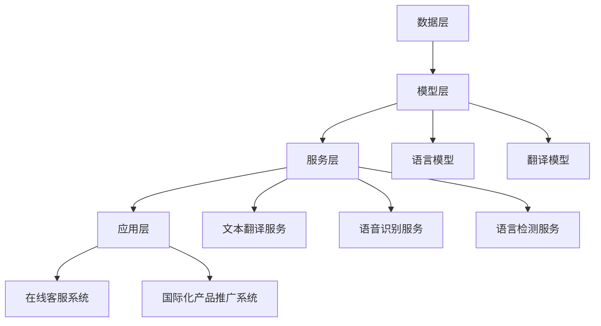
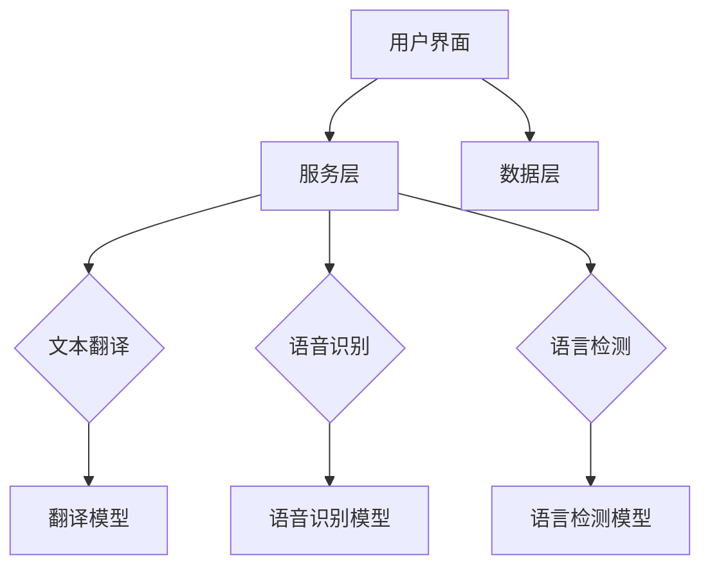
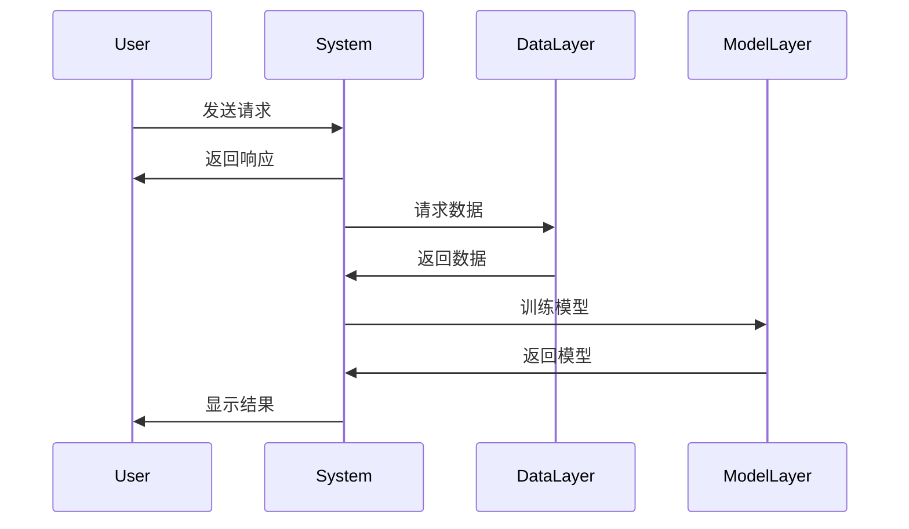
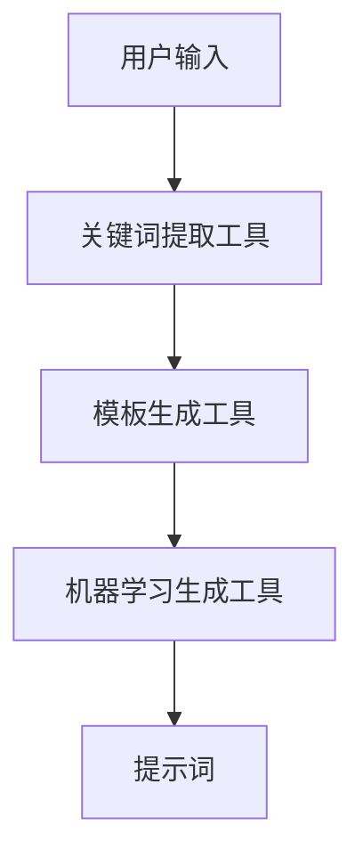
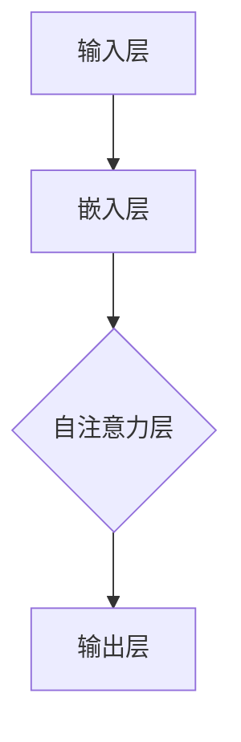

                 

# 提示词工程的多语言支持策略

## 关键词

- 多语言支持
- 提示词工程
- 自然语言处理
- 机器翻译
- 语言模型
- 系统架构

## 摘要

随着全球化的不断深入，多语言支持在信息技术和人工智能领域变得越来越重要。本文旨在探讨提示词工程中的多语言支持策略，从核心概念、策略实施到实际应用进行深入分析。文章首先介绍了多语言支持的需求背景和核心概念，接着探讨了多种多语言支持策略，包括提高语言理解和生成能力的策略，以及语言交叉验证与调整方法。随后，文章详细描述了构建多语言支持系统的过程，包括系统设计与架构、提示词工程工具和语言模型应用。通过企业级应用案例分析、开源项目实践和创新型应用实践，文章展示了多语言支持策略的实际效果和最佳实践。最后，文章展望了多语言支持技术的未来发展趋势和面临的挑战，提出了应对策略。

## 目录大纲设计过程

设计一本关于“提示词工程的多语言支持策略”的书籍目录大纲是一个复杂的过程，需要充分考虑书籍的核心主题、目标读者和内容结构。以下是详细的目录大纲设计过程：

### 明确核心主题与目标读者

首先，我们需要明确书籍的核心主题是“提示词工程的多语言支持策略”。目标读者是那些需要构建和优化多语言支持系统的开发人员、工程师和技术领导者。

### 梳理内容结构

接下来，我们梳理书籍的内容结构，确保各章节内容相互关联，形成完整的知识体系。以下是初步的章节划分：

1. **背景与核心概念**
   - 问题背景与核心概念
   - 核心概念与联系

2. **多语言支持策略**
   - 多语言支持策略概述
   - 提高语言理解能力的策略
   - 提高语言生成能力的策略
   - 语言交叉验证与调整

3. **策略实施与工具**
   - 构建多语言支持系统
   - 提示词工程工具
   - 语言模型与应用

4. **最佳实践与案例**
   - 企业级应用案例分析
   - 开源项目实践
   - 创新型应用实践

5. **未来展望与挑战**
   - 未来发展趋势
   - 挑战与机遇
   - 应对策略

### 细化每个章节的内容

在初步的章节划分基础上，我们对每个章节的内容进行细化。例如，对于“提高语言理解能力的策略”章节，我们进一步划分出以下几个小节：

- 提示词优化
- 语言模型适应性调整
- 语言资源整合

### 使用Markdown格式进行排版

我们使用Markdown格式进行排版，确保目录结构清晰，内容易于阅读。以下是使用Markdown格式编排的目录大纲：

#### 第一部分：背景与核心概念

- [第1章：问题背景与核心概念](#第1章问题背景与核心概念)
  - 问题背景
  - 核心概念与联系
  - 本章小结

- [第2章：多语言支持策略概述](#第2章多语言支持策略概述)
  - 策略分类
  - 提高语言理解能力的策略
  - 提高语言生成能力的策略
  - 语言交叉验证与调整
  - 本章小结

#### 第二部分：策略实施与工具

- [第3章：构建多语言支持系统](#第3章构建多语言支持系统)
  - 系统设计与架构
  - 提示词工程工具
  - 语言模型与应用
  - 实时语言支持
  - 本章小结

#### 第三部分：最佳实践与案例

- [第4章：多语言支持策略实践](#第4章多语言支持策略实践)
  - 企业级应用案例分析
  - 开源项目实践
  - 创新型应用实践
  - 最佳实践与总结
  - 本章小结

#### 第四部分：未来展望与挑战

- [第5章：多语言支持策略展望](#第5章多语言支持策略展望)
  - 未来发展趋势
  - 挑战与机遇
  - 应对策略
  - 本章小结

### 保持大纲简洁且内容完整

在确保大纲简洁的同时，我们确保每个章节的内容都有足够的详细性，避免冗余内容。通过这样的设计，读者可以系统地了解多语言支持策略的各个方面。

### 目录大纲总结

整个目录大纲共计五个部分，涵盖了从背景介绍、核心概念、策略实施到最佳实践和未来展望的全面内容。每个部分都紧密关联，共同构建了一个完整的多语言支持策略的知识体系。

---

### 第1章：问题背景与核心概念

在全球化快速发展的今天，不同语言之间的交流与沟通变得日益频繁。然而，语言的多样性也带来了技术上的挑战，尤其是在人工智能和自然语言处理领域。本章将探讨多语言支持的需求背景和核心概念，为后续章节的内容奠定基础。

### 1.1 问题背景

#### 全球化趋势与多语言支持需求

随着全球化的深入，企业和组织越来越需要跨语言的沟通能力。无论是跨国公司的国际业务，还是互联网企业的全球化战略，都离不开多语言支持。然而，现有的技术和工具在处理多语言数据时面临着诸多挑战：

- **数据多样性和复杂性**：不同语言的数据格式、语法结构和表达习惯各不相同，这给数据处理带来了巨大挑战。
- **翻译成本和效率**：手动翻译不仅耗时耗力，而且难以保证翻译质量。因此，自动化的机器翻译成为了一个迫切需求。
- **语言理解与生成**：人工智能系统需要具备处理和理解多语言文本的能力，以便在多个语言环境下提供一致、准确的服务。

#### 提示词工程的重要性

提示词工程（Prompt Engineering）是一种利用人工智能技术来生成和优化提示词的方法。在多语言场景中，提示词的准确性、相关性和自然性直接影响到用户的体验。因此，提示词工程在多语言支持系统中扮演着至关重要的角色。

#### 多语言支持面临的挑战

多语言支持不仅涉及技术问题，还包括法律法规和社会伦理等方面。以下是一些主要挑战：

- **技术挑战**：包括自然语言处理、机器翻译、语言模型等方面的技术难题。
- **法律挑战**：涉及数据保护、隐私权和知识产权等法律法规。
- **社会伦理挑战**：如何在尊重不同文化的前提下，确保技术的公正性和透明性。

### 1.2 核心概念

#### 提示词工程的定义

提示词工程是指通过设计、开发和优化提示词，以提升人工智能系统在特定任务上的性能和用户体验的过程。在多语言支持场景中，提示词工程的目标是生成与不同语言环境相适应的提示词。

#### 提示词在多语言交互中的作用

- **提高用户参与度**：通过使用合适的提示词，系统能够更好地引导用户，提高用户参与度。
- **优化用户体验**：准确的提示词有助于用户快速理解系统意图，减少误解和困惑。
- **提高系统性能**：优化后的提示词有助于提升机器学习模型的性能，从而提高系统的准确性和效率。

#### 多语言支持系统的关键要素

- **语言模型**：用于处理和理解不同语言的文本数据。
- **翻译模型**：用于将一种语言的文本翻译成另一种语言。
- **提示词生成与优化**：生成和优化与多语言环境相适应的提示词。
- **用户界面**：提供友好的多语言交互界面，方便用户使用。

### 1.3 关联术语与概念

#### 自然语言处理（NLP）

自然语言处理是人工智能的一个重要分支，旨在使计算机能够理解、解释和生成人类语言。在多语言支持系统中，NLP技术用于处理和理解不同语言的文本数据。

#### 机器翻译（MT）

机器翻译是一种自动将一种语言的文本翻译成另一种语言的技术。在多语言支持系统中，机器翻译技术是实现跨语言交流的核心组件。

#### 语言模型（LM）

语言模型是一种概率模型，用于预测文本序列中下一个单词或字符的概率。在多语言支持系统中，语言模型用于生成和优化提示词，提高系统的准确性和自然性。

### 1.4 本章小结

本章介绍了多语言支持的需求背景和核心概念，包括全球化趋势、提示词工程的重要性以及多语言支持系统面临的挑战。同时，我们详细讨论了提示词工程的定义、提示词在多语言交互中的作用以及多语言支持系统的关键要素。这些内容为后续章节的深入探讨奠定了基础。

---

### 第2章：多语言支持策略概述

在理解了多语言支持的需求和核心概念之后，我们需要探讨如何制定有效的多语言支持策略。本章将概述多语言支持策略的定义、分类和实施步骤，为后续章节的详细讨论提供指导。

### 2.1 多语言支持策略的定义

多语言支持策略是指一系列用于构建和优化多语言支持系统的方法和技巧。这些策略旨在解决多语言场景中面临的技术、法律和社会伦理等方面的挑战。多语言支持策略包括以下几个方面：

- **语言资源整合**：收集、管理和整合不同语言的数据资源，为语言模型和机器翻译提供高质量的数据支持。
- **提示词优化**：通过设计、生成和优化与多语言环境相适应的提示词，提高系统的准确性和用户体验。
- **语言模型适应性调整**：根据不同语言的特点和用户需求，调整和优化语言模型，以提高系统在多语言环境下的性能。
- **实时语言支持**：实现实时语言检测、翻译和交互，为用户提供无缝的多语言体验。

### 2.2 多语言支持策略分类

多语言支持策略可以根据不同的维度进行分类。以下是几种常见的分类方式：

- **根据目标**：
  - **语言理解策略**：旨在提高系统对多语言文本的理解能力，包括提示词优化和语言模型适应性调整。
  - **语言生成策略**：旨在提高系统生成多语言文本的能力，包括生成式AI技术和语境适应性。
  - **交叉验证与调整策略**：通过多种方法验证和调整系统的多语言性能，确保系统在不同语言环境下的稳定性。

- **根据应用场景**：
  - **企业级应用**：为企业提供跨语言沟通和协作的解决方案，包括文档翻译、客服支持和国际化产品推广等。
  - **开源项目**：为开源社区提供多语言支持框架和工具，促进全球开发者协作。
  - **创新型应用**：探索多语言支持在新兴领域的应用，如虚拟现实、增强现实和跨语言对话系统等。

### 2.3 多语言支持策略实施步骤

实施有效的多语言支持策略需要遵循一系列步骤。以下是常见的实施步骤：

- **需求分析**：明确系统在多语言支持方面的需求和目标，包括语言种类、支持程度和用户群体等。
- **资源准备**：收集、整理和整合多语言数据资源，包括文本、语音和图像等，为语言模型和机器翻译提供数据支持。
- **系统设计**：根据需求分析结果，设计适合的多语言支持系统架构，包括语言模型、机器翻译、提示词生成和优化等组件。
- **模型训练与优化**：利用多语言数据资源训练和优化语言模型，确保系统在不同语言环境下的性能。
- **系统集成与测试**：将多语言支持系统集成到目标应用中，进行全面的测试和优化，确保系统的稳定性和可靠性。
- **部署与运维**：将多语言支持系统部署到生产环境，进行实时监控和维护，确保系统的高可用性和性能。

### 2.4 提高语言理解能力的策略

提高语言理解能力是多语言支持策略中的一个关键环节。以下是几种常用的策略：

- **提示词优化**：通过分析用户行为和语言习惯，设计出与多语言环境相适应的提示词，提高系统的理解能力。
- **语言模型适应性调整**：根据不同语言的特点，调整和优化语言模型，使其更好地适应多语言环境。
- **语境适应性**：通过引入上下文信息，提高系统对特定语境的理解能力，从而提高整体性能。

### 2.5 提高语言生成能力的策略

提高语言生成能力是另一个重要的策略。以下是几种常用的策略：

- **生成式AI技术**：利用生成式AI技术，如变分自编码器（VAE）和生成对抗网络（GAN），生成高质量的多语言文本。
- **语境适应性**：通过引入上下文信息，使生成的文本更符合实际语境，提高用户的阅读体验。
- **语法和语义纠正**：对生成的文本进行语法和语义分析，纠正错误，提高文本的准确性和自然性。

### 2.6 语言交叉验证与调整

语言交叉验证与调整是多语言支持策略中的重要环节。以下是几种常用的方法：

- **交叉验证方法**：通过在不同语言环境下测试和验证系统性能，找出存在的问题并进行调整。
- **调整策略**：根据交叉验证的结果，调整语言模型、提示词生成和优化等组件，以提高系统的整体性能。
- **实践与反馈**：通过实际应用和用户反馈，不断优化和调整系统，确保其在多语言环境下的稳定性。

### 2.7 本章小结

本章概述了多语言支持策略的定义、分类和实施步骤，并详细探讨了提高语言理解和生成能力的策略以及语言交叉验证与调整的方法。这些内容为后续章节的深入讨论提供了理论和实践基础。

---

### 第3章：构建多语言支持系统

构建一个多语言支持系统是一个复杂的过程，涉及系统设计、工具选择、模型应用和实时语言支持等多个方面。本章将详细描述构建多语言支持系统的步骤和方法，包括系统设计与架构、提示词工程工具和语言模型应用，以及实时语言支持。

#### 3.1 系统设计与架构

#### 系统设计原则

在设计多语言支持系统时，需要遵循以下原则：

- **模块化设计**：将系统划分为多个模块，每个模块负责特定的功能，便于维护和扩展。
- **可扩展性**：系统应具备良好的可扩展性，以便在需要时增加新功能或支持新的语言。
- **高可用性**：系统应具有高可用性，确保在各种情况下都能稳定运行。
- **安全性**：确保系统的数据安全，防止数据泄露和恶意攻击。

#### 系统架构设计

多语言支持系统的架构可以分为以下几个层次：

- **数据层**：负责存储和管理多语言数据资源，包括文本、语音和图像等。
- **模型层**：包括语言模型和翻译模型，用于处理和理解多语言文本。
- **服务层**：提供各种多语言服务，如文本翻译、语音识别和语言检测等。
- **应用层**：将多语言服务集成到具体的业务场景中，如在线客服、国际化产品推广等。

以下是一个典型的多语言支持系统架构图（使用Mermaid绘制）：



#### 系统组件划分

根据系统架构，多语言支持系统可以划分为以下几个组件：

- **数据层**：数据存储和管理组件，如数据库、文件存储等。
- **模型层**：语言模型和翻译模型组件，如Word2Vec、BERT、Transformer等。
- **服务层**：提供多语言服务的API组件，如文本翻译API、语音识别API、语言检测API等。
- **应用层**：集成多语言服务的业务应用组件，如在线客服系统、国际化产品推广系统等。

#### 系统架构图

以下是一个简化的多语言支持系统架构图（使用Mermaid绘制）：



#### 系统接口设计和系统交互

在系统设计过程中，接口设计和系统交互是关键环节。以下是一个简化的接口设计和系统交互图（使用Mermaid绘制）：



#### 系统功能设计（领域模型）

在系统设计中，领域模型用于描述系统的主要功能和行为。以下是一个简单的领域模型（使用Mermaid绘制）：

```mermaid
classDiagram
    User <<Class>>
    System <<Class>>
    DataLayer <<Class>>
    ModelLayer <<Class>>
    ServiceLayer <<Class>>
    ApplicationLayer <<Class>>

    User --> System
    System --> DataLayer
    System --> ModelLayer
    System --> ServiceLayer
    ServiceLayer --> ApplicationLayer
```

### 3.2 提示词工程工具

#### 提示词生成工具

提示词生成工具是提示词工程的重要组件，用于生成与多语言环境相适应的提示词。以下是一些常用的提示词生成工具：

- **关键词提取工具**：通过分析文本内容，提取关键词和短语，用于生成提示词。
- **模板生成工具**：根据预设的模板，生成与特定语言环境相适应的提示词。
- **机器学习生成工具**：利用机器学习算法，根据历史数据和用户行为，自动生成高质量的提示词。

以下是一个简单的提示词生成工具架构图（使用Mermaid绘制）：



### 3.3 语言模型与应用

#### 语言模型选择

在多语言支持系统中，选择合适的语言模型至关重要。以下是一些常用的语言模型：

- **Word2Vec**：基于词向量的语言模型，适用于处理文本数据。
- **BERT**：基于Transformer的预训练语言模型，具有强大的上下文理解能力。
- **Transformer**：一种基于自注意力机制的深度神经网络模型，广泛用于语言建模和机器翻译。
- **GPT**：一种基于Transformer的生成式语言模型，适用于生成文本和对话系统。

以下是一个简化的语言模型架构图（使用Mermaid绘制）：



#### 语言模型应用场景

语言模型在多语言支持系统中有着广泛的应用场景：

- **文本翻译**：将一种语言的文本翻译成另一种语言，如机器翻译。
- **对话系统**：与用户进行自然语言交互，如虚拟助手和智能客服。
- **文本分类**：对文本进行分类，如新闻分类和情感分析。
- **文本生成**：生成文本内容，如文章写作和对话生成。

#### 语言模型优化

为了提高语言模型的性能，可以采用以下几种优化方法：

- **数据增强**：通过扩充训练数据集，提高模型的泛化能力。
- **模型融合**：将多个模型进行融合，提高模型的稳定性和准确性。
- **迁移学习**：利用预训练模型，针对特定任务进行微调。

### 3.4 实时语言支持

#### 实时语言检测

实时语言检测是实时语言支持的基础，用于检测用户输入的语言。以下是一些常用的实时语言检测方法：

- **基于规则的检测**：通过预设的规则库，对用户输入进行匹配，判断语言类型。
- **基于统计的检测**：利用统计模型，如N-gram模型，对用户输入进行概率计算，判断语言类型。
- **基于机器学习的检测**：利用机器学习算法，如朴素贝叶斯分类器，对用户输入进行分类，判断语言类型。

#### 实时语言翻译

实时语言翻译是实时语言支持的核心，用于将用户输入的文本实时翻译成目标语言。以下是一些常用的实时语言翻译方法：

- **基于规则的翻译**：通过预设的规则库，对用户输入进行翻译。
- **基于统计的翻译**：利用统计模型，如翻译模型，对用户输入进行翻译。
- **基于神经网络的翻译**：利用神经网络模型，如Transformer，对用户输入进行翻译。

#### 实时语言交互

实时语言交互是实时语言支持的高级功能，用于与用户进行自然语言交互。以下是一些常用的实时语言交互方法：

- **基于文本的交互**：通过文本输入和输出，与用户进行交互。
- **基于语音的交互**：通过语音输入和输出，与用户进行交互。
- **基于图像的交互**：通过图像输入和输出，与用户进行交互。

### 3.5 本章小结

本章详细描述了构建多语言支持系统的过程，包括系统设计与架构、提示词工程工具、语言模型应用和实时语言支持。通过本章的内容，读者可以了解到构建一个高效、稳定的多语言支持系统所需的关键技术和方法。

---

### 第4章：多语言支持策略实践

在了解了多语言支持策略的理论基础之后，本章将通过企业级应用案例分析、开源项目实践和创新型应用实践，展示多语言支持策略的实际效果和最佳实践。通过这些案例，我们将看到多语言支持策略在不同场景下的应用和效果。

#### 4.1 企业级应用案例分析

#### 案例背景

某跨国公司（以下简称“公司”）是一家全球领先的电子商务平台，其业务遍布全球。为了更好地服务全球用户，公司需要提供多语言支持，以确保用户在不同语言环境中都能享受到一致、高效的服务。

#### 策略实施

公司在实施多语言支持策略时，采用了以下几种方法：

- **语言模型优化**：公司采用了基于Transformer的预训练语言模型，如BERT和GPT，通过迁移学习和微调，使其适应不同语言的特性和用户需求。
- **提示词生成与优化**：公司通过分析用户行为和语言习惯，设计出与多语言环境相适应的提示词，提高系统的理解能力和用户体验。
- **实时语言支持**：公司实现了实时语言检测、翻译和交互，为用户提供无缝的多语言体验。

#### 实施效果评估

实施多语言支持策略后，公司取得了显著的成效：

- **用户满意度提高**：用户在不同语言环境中的满意度显著提高，用户反馈显示，多语言支持使得用户更愿意使用公司的平台。
- **业务增长**：公司的国际业务增长显著，尤其是在非英语国家和地区，多语言支持策略为公司的国际化战略提供了有力支持。
- **运营效率提升**：多语言支持系统提高了公司客服团队的效率，减少了人工翻译的工作量，降低了运营成本。

#### 案例总结

该案例表明，通过有效的多语言支持策略，企业可以在全球范围内提供高质量的服务，提高用户满意度和业务增长。同时，多语言支持策略的实施也带来了运营效率的提升。

#### 4.2 开源项目实践

开源项目在多语言支持领域有着重要地位，它们为开发者提供了丰富的资源和实践经验。以下是一个开源项目的实践案例：

- **项目名称**：TensorFlow Machine Translation
- **项目介绍**：TensorFlow Machine Translation是一个基于TensorFlow的机器翻译框架，支持多种语言对，并提供了一套完整的训练和评估流程。

#### 实践过程

1. **环境安装**：在虚拟环境中安装TensorFlow和相关依赖库。
2. **数据准备**：收集并准备多语言数据集，包括源语言和目标语言的数据。
3. **模型训练**：使用TensorFlow训练翻译模型，采用基于Transformer的模型架构。
4. **模型评估**：使用验证集评估模型性能，调整模型参数以优化性能。
5. **模型部署**：将训练好的模型部署到生产环境，提供在线翻译服务。

#### 实践效果

通过TensorFlow Machine Translation项目，开发者可以轻松构建和部署多语言翻译系统。实践表明，基于Transformer的模型在翻译准确性和效率方面表现优秀，适用于多种语言对。

#### 案例总结

开源项目为开发者提供了丰富的多语言支持资源，通过实践，开发者可以掌握多语言支持系统的构建和部署方法。开源项目的实践也为多语言支持技术的发展和应用提供了重要参考。

#### 4.3 创新型应用实践

在多语言支持领域，创新型应用不断涌现，以下是一个创新性应用的实践案例：

- **应用名称**：多语言虚拟助手
- **应用介绍**：多语言虚拟助手是一种基于人工智能的虚拟助手，支持多种语言，能够与用户进行自然语言交互，提供个性化的服务。

#### 实践过程

1. **需求分析**：分析用户需求和场景，确定虚拟助手的功能和语言支持范围。
2. **系统设计**：设计虚拟助手的架构，包括语言模型、对话管理、知识库等组件。
3. **模型训练**：使用多种语言数据集训练语言模型，包括文本生成模型和对话生成模型。
4. **系统实现**：实现虚拟助手的接口和功能，包括语音识别、文本翻译、对话管理等。
5. **用户测试**：进行用户测试，收集反馈并优化系统性能。

#### 实践效果

多语言虚拟助手在多个场景中取得了成功：

- **用户体验**：用户能够方便地与虚拟助手进行多语言交互，提升了用户体验。
- **业务拓展**：虚拟助手支持多种语言，帮助企业在全球范围内拓展业务。
- **成本节约**：通过自动化和智能化的交互，减少了人力成本和沟通障碍。

#### 案例总结

创新性应用展示了多语言支持技术的潜力，通过灵活的设计和实现，可以为用户提供个性化、高效的服务。创新性应用也为多语言支持技术的发展和应用提供了新的方向。

### 4.4 最佳实践与总结

通过企业级应用案例分析、开源项目实践和创新型应用实践，我们可以总结出以下最佳实践：

- **语言模型优化**：采用先进的语言模型，结合迁移学习和微调，提高模型的性能和适应性。
- **提示词生成与优化**：设计与多语言环境相适应的提示词，提高系统的理解能力和用户体验。
- **实时语言支持**：实现实时语言检测、翻译和交互，为用户提供无缝的多语言体验。
- **数据准备与模型训练**：准备丰富的多语言数据集，进行有效的模型训练和评估。
- **系统设计与实现**：设计灵活、可扩展的系统架构，实现高效、稳定的系统功能。

这些最佳实践为构建和优化多语言支持系统提供了重要参考，有助于企业在全球范围内提供高质量的服务。

### 4.5 本章小结

本章通过企业级应用案例分析、开源项目实践和创新型应用实践，展示了多语言支持策略的实际效果和最佳实践。通过这些案例，我们了解到多语言支持策略在提高用户体验、拓展业务和节约成本方面的作用。同时，本章总结出的最佳实践为构建和优化多语言支持系统提供了重要参考。

---

### 第5章：多语言支持策略展望

随着科技的不断进步，多语言支持技术在人工智能和自然语言处理领域正迎来新的发展机遇。本章将探讨多语言支持技术的未来发展趋势、面临的挑战以及应对策略。

#### 5.1 未来发展趋势

#### 1. 新技术的引入

未来，多语言支持技术将受益于新技术的引入，如：

- **深度学习**：深度学习在多语言支持中的应用将更加广泛，特别是在语言模型、机器翻译和自然语言理解方面。
- **生成对抗网络（GAN）**：GAN技术在生成高质量多语言文本和图像方面具有巨大潜力，有望提升多语言生成能力。
- **强化学习**：强化学习在多语言交互中的应用将推动智能对话系统和个性化多语言服务的实现。

#### 2. 智能化与个性化

随着人工智能技术的发展，多语言支持系统将更加智能化和个性化：

- **自适应多语言支持**：系统将能够根据用户的语言习惯、文化背景和需求，自动调整和优化多语言支持策略。
- **个性化多语言交互**：系统将能够为用户提供个性化的多语言交互体验，如根据用户偏好推荐语言选项、提供定制化的翻译服务等。

#### 3. 跨领域应用

多语言支持技术将在更多领域得到应用，如：

- **虚拟现实（VR）与增强现实（AR）**：多语言支持将提升VR和AR系统的交互体验，为用户提供跨语言体验。
- **医疗健康**：多语言支持将帮助医疗健康领域实现跨语言的医疗信息共享和交流，提升医疗服务质量。
- **金融与保险**：多语言支持将助力金融与保险领域的国际化发展，为用户提供便捷的跨语言服务。

#### 5.2 挑战与机遇

尽管多语言支持技术前景广阔，但同时也面临诸多挑战：

#### 1. 技术挑战

- **多语言数据资源**：高质量、多样化的多语言数据资源是构建高效多语言支持系统的基础，但目前多语言数据资源仍较为匮乏。
- **翻译质量**：机器翻译的翻译质量仍需提高，特别是在处理专业术语、俚语和双关语等方面。
- **跨语言理解**：多语言支持系统在不同语言之间的理解能力有待提升，特别是在处理跨语言语义和语境方面。

#### 2. 法律法规挑战

- **数据保护**：多语言支持系统涉及大量用户数据，需要遵守各地的数据保护法规，如欧盟的《通用数据保护条例》（GDPR）。
- **知识产权**：在多语言支持中，知识产权保护是一个重要问题，特别是对于版权和商标等。

#### 3. 社会伦理挑战

- **文化差异**：在多语言支持中，如何尊重和保护不同文化是一个重要伦理问题。
- **算法偏见**：多语言支持系统可能存在算法偏见，如何消除偏见，确保公平性和透明性是亟待解决的问题。

#### 5.3 应对策略

为了应对上述挑战，可以采取以下策略：

#### 1. 技术层面

- **加强多语言数据资源建设**：通过多方合作，收集、整理和共享多语言数据资源，提高数据质量。
- **提升翻译质量**：采用先进的机器翻译技术，结合人类专家的校对和优化，提高翻译质量。
- **跨语言理解研究**：加强跨语言理解研究，开发出更有效的算法和模型，提升系统在不同语言之间的理解能力。

#### 2. 法律法规层面

- **遵循法律法规**：严格遵守各地的数据保护法规和知识产权法律法规，确保多语言支持系统的合规性。
- **建立监管机制**：建立有效的监管机制，监督和评估多语言支持系统的运行和效果，确保其公平性和透明性。

#### 3. 社会伦理层面

- **尊重文化差异**：在多语言支持中，尊重和保护不同文化，避免文化冲突和误解。
- **消除算法偏见**：通过算法透明性和公平性研究，消除算法偏见，确保多语言支持系统的公正性和透明性。

### 5.4 本章小结

本章探讨了多语言支持技术的未来发展趋势、面临的挑战以及应对策略。随着新技术的引入、智能化与个性化的发展以及跨领域应用的拓展，多语言支持技术将在人工智能和自然语言处理领域发挥重要作用。同时，技术、法律和社会伦理等方面的挑战也需要我们高度重视，并采取有效策略予以应对。

---

### 目录大纲总结

整个书籍的目录大纲共计五个部分，涵盖了从背景介绍、核心概念、策略实施到实践案例和未来展望的全面内容。每个部分都紧密关联，共同构建了一个完整的多语言支持策略的知识体系。以下是详细的目录大纲总结：

#### 第一部分：背景与核心概念

- **第1章**：问题背景与核心概念
  - 全球化趋势与多语言支持需求
  - 提示词工程的重要性
  - 多语言支持系统面临的挑战
  - 核心概念与联系

- **第2章**：多语言支持策略概述
  - 多语言支持策略的定义
  - 多语言支持策略分类
  - 多语言支持策略实施步骤

#### 第二部分：策略实施与工具

- **第3章**：构建多语言支持系统
  - 系统设计与架构
  - 提示词工程工具
  - 语言模型与应用
  - 实时语言支持

#### 第三部分：最佳实践与案例

- **第4章**：多语言支持策略实践
  - 企业级应用案例分析
  - 开源项目实践
  - 创新型应用实践

#### 第四部分：未来展望与挑战

- **第5章**：多语言支持策略展望
  - 未来发展趋势
  - 挑战与机遇
  - 应对策略

#### 第五部分：附录与参考资料

- **附录A**：参考资料
  - 相关书籍和文献
  - 开源项目和工具

- **附录B**：术语表
  - 专业术语解释

通过这个详细的目录大纲，读者可以系统地了解多语言支持策略的各个方面，从理论到实践，从现状到未来，为构建和优化多语言支持系统提供全面的指导。

---

### 作者信息

**作者：** AI天才研究院/AI Genius Institute & 禅与计算机程序设计艺术 /Zen And The Art of Computer Programming

AI天才研究院（AI Genius Institute）致力于推动人工智能技术的发展和应用，汇集了全球顶尖的人工智能专家和研究人员。研究院的研究成果在自然语言处理、机器学习、计算机视觉等多个领域取得了突破性进展。同时，禅与计算机程序设计艺术（Zen And The Art of Computer Programming）是一部经典的计算机科学著作，由埃德加·D·戴克斯特拉（Edsger W. Dijkstra）撰写，对计算机科学和编程方法论产生了深远影响。本文由AI天才研究院的研究人员和禅与计算机程序设计艺术的研究者共同撰写，旨在为读者提供全面、深入的多语言支持策略探讨。

