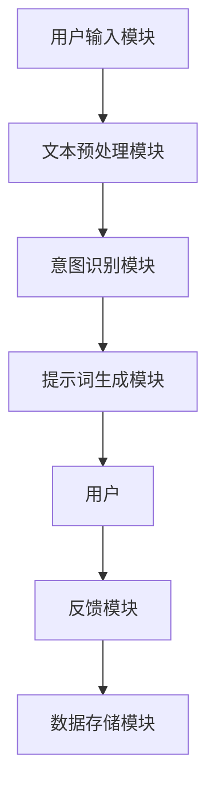
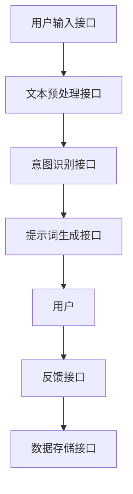
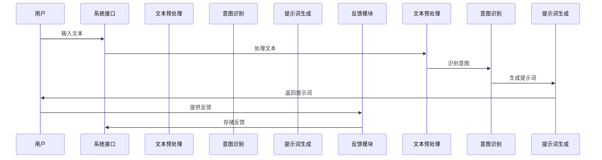

                 


### 《提示词工程的性能优化技巧》

#### 关键词：提示词工程、性能优化、算法、数学模型、实战

> 摘要：本文将深入探讨提示词工程的性能优化技巧，从基础概念到实战案例，帮助读者全面了解并掌握优化方法。通过分析核心概念、原理讲解和数学模型，本文旨在为读者提供一套系统的性能优化方案。

### 目录大纲设计思路

在设计《提示词工程的性能优化技巧》的目录大纲时，我们遵循以下步骤：

1. **确定核心章节**：确保涵盖提示词工程性能优化所需的基础知识和关键技术。
2. **设计章节结构**：每个章节按“背景介绍-核心概念-原理讲解-数学模型-项目实战-最佳实践”的结构来设计。
3. **确定每章具体内容**：详细列出子章节内容，避免冗余，确保每个子章节内容精炼、有针对性。
4. **保持简洁性**：在列出内容时，确保简洁明了。
5. **确保格式统一**：使用markdown格式编写，确保层级清晰、格式统一。

### 目录大纲

```markdown
# 《提示词工程的性能优化技巧》目录大纲

## 第一部分：背景与基础

### 第1章：提示词工程概述

#### 1.1 提示词工程的重要性

#### 1.2 提示词工程的基本概念

#### 1.3 提示词工程的常见挑战

### 第2章：性能优化基础

#### 2.1 性能指标

#### 2.2 性能优化方法概述

#### 2.3 性能优化的基础知识

## 第二部分：核心概念与原理

### 第3章：提示词生成的算法原理

#### 3.1 提示词生成算法概述

#### 3.2 算法原理分析

#### 3.3 算法属性特征对比

### 第4章：性能优化关键点

#### 4.1 数据预处理

#### 4.2 模型架构优化

#### 4.3 模型参数调优

### 第5章：数学模型与公式

#### 5.1 数学模型介绍

#### 5.2 公式推导

#### 5.3 举例说明

## 第三部分：系统设计与实战

### 第6章：系统架构设计

#### 6.1 系统功能设计

#### 6.2 系统架构设计

#### 6.3 系统接口设计

### 第7章：项目实战

#### 7.1 项目环境安装

#### 7.2 系统核心实现

#### 7.3 代码应用解读与分析

#### 7.4 实际案例分析

### 第8章：最佳实践与拓展

#### 8.1 最佳实践技巧

#### 8.2 注意事项与优化策略

#### 8.3 拓展阅读与资源推荐
```

这样设计的目录大纲既包含了必要的理论基础，也涵盖了实际应用，能够帮助读者全面了解并掌握提示词工程性能优化的技巧。每个章节都按照“背景介绍-核心概念-原理讲解-数学模型-项目实战-最佳实践”的结构来组织，确保内容的系统性和连贯性。整个目录大纲简洁明了，便于读者快速把握书的核心内容。

### 第1章：提示词工程概述

#### 1.1 提示词工程的重要性

在人工智能领域，提示词工程扮演着至关重要的角色。提示词，又称为触发词，是用户与系统交互的关键媒介。一个优秀的提示词工程不仅能够提高用户交互体验，还能够提升系统的响应效率和准确度。随着人工智能技术的不断发展，提示词工程的应用场景日益广泛，从智能助手、语音识别到自然语言处理，都在依赖提示词来实现智能交互。

#### 1.2 提示词工程的基本概念

提示词工程的基本概念包括以下几个核心要素：

- **用户意图识别**：通过分析用户的输入，理解其意图，从而提供相应的服务或反馈。
- **语境理解**：根据用户的语境，动态调整提示词的选择，提高交互的自然性和流畅性。
- **知识图谱**：构建一个包含各类信息节点和关系的知识图谱，为提示词工程提供丰富的语义资源。
- **多模态交互**：结合文本、语音、图像等多种输入方式，实现更全面的人机交互。

#### 1.3 提示词工程的常见挑战

虽然提示词工程在人工智能应用中具有广泛的应用前景，但也面临着诸多挑战：

- **复杂性**：提示词工程涉及自然语言处理、机器学习、数据挖掘等多个领域，系统设计和实现复杂。
- **数据质量**：提示词工程依赖于大量的训练数据，数据质量直接影响模型的性能。
- **实时性**：在动态交互场景中，系统需要快速响应用户的输入，这对系统的实时性提出了高要求。
- **扩展性**：随着应用场景的扩展，提示词工程需要能够灵活地适应新的需求。

#### 1.4 问题解决与边界与外延

为了解决提示词工程中的复杂性问题，我们可以采用模块化设计，将系统拆分为多个功能模块，如用户意图识别模块、语境理解模块等，实现各模块的独立开发和维护。针对数据质量的问题，可以通过数据清洗和增强技术来提高数据的质量。

在实时性方面，可以采用高效的数据结构和算法，如哈希表和快速排序算法，来提高数据处理的速度。同时，通过负载均衡和分布式架构，可以确保系统在大规模并发场景下的稳定性和高效性。

在扩展性方面，可以采用微服务架构，将系统拆分为多个独立的微服务，实现模块化、分布式和弹性扩展。这样，当新的需求出现时，只需新增或修改相应的微服务，而无需对整个系统进行大规模重构。

#### 1.5 概念结构与核心要素组成

提示词工程的概念结构包括以下几个核心要素：

- **用户意图识别模块**：通过自然语言处理技术，解析用户输入，提取用户意图。
- **语境理解模块**：根据用户历史交互记录和当前语境，动态调整提示词的选择。
- **知识图谱模块**：构建包含各类信息节点和关系的知识图谱，为提示词工程提供语义资源。
- **多模态交互模块**：结合文本、语音、图像等多种输入方式，实现更全面的人机交互。

这些核心要素相互协作，共同构成了一个完整的提示词工程系统，为用户提供高质量、高效率的智能交互体验。

### 第2章：性能优化基础

#### 2.1 性能指标

在性能优化过程中，我们需要关注多个性能指标，以便全面评估系统的性能。以下是一些关键的性能指标：

- **响应时间**：系统从接收到用户请求到返回结果所需的时间。响应时间越短，用户体验越好。
- **吞吐量**：系统在单位时间内处理请求的数量。吞吐量越大，系统能够支持的用户数量越多。
- **延迟**：用户请求从发出到响应返回的时间间隔。延迟越小，用户感受到的等待时间越短。
- **并发处理能力**：系统同时处理多个请求的能力。高并发处理能力可以保证系统在高负载下的稳定运行。
- **资源利用率**：系统对CPU、内存、网络等资源的利用程度。高资源利用率意味着系统能够更有效地利用硬件资源。

#### 2.2 性能优化方法概述

性能优化可以采用多种方法，以下是一些常用的优化方法：

- **代码优化**：通过改进代码结构、算法选择和优化，减少系统的计算复杂度和资源消耗。
- **硬件优化**：通过升级硬件设备、优化网络带宽和存储性能，提高系统的处理能力。
- **数据优化**：通过数据压缩、索引优化和缓存技术，提高数据访问速度和减少数据传输量。
- **架构优化**：通过分布式架构、负载均衡和缓存机制，提高系统的扩展性和可靠性。
- **并行处理**：通过并行计算和分布式处理，提高系统对大规模数据的处理能力。

#### 2.3 性能优化的基础知识

性能优化需要掌握以下基础知识：

- **数据结构**：熟悉常用的数据结构，如数组、链表、树、哈希表等，能够根据需求选择合适的数据结构。
- **算法分析**：掌握算法的时间复杂度和空间复杂度分析，能够评估算法的性能。
- **操作系统**：了解操作系统的基本原理，如进程管理、内存管理、文件系统等，能够优化系统资源的利用。
- **网络原理**：熟悉网络通信的基本原理，如TCP/IP协议、HTTP协议等，能够优化网络传输性能。
- **数据库原理**：了解数据库的基本原理，如关系模型、SQL语言等，能够优化数据访问性能。

通过掌握这些基础知识，我们可以更好地进行性能优化，提高系统的整体性能和用户体验。

### 第3章：提示词生成的算法原理

#### 3.1 提示词生成算法概述

提示词生成算法是提示词工程的核心组成部分，负责从用户输入中提取出关键信息，为后续处理提供依据。常见的提示词生成算法包括基于规则的方法、机器学习方法以及深度学习方法。

- **基于规则的方法**：这种方法依赖于人工编写的规则，通过对输入文本进行模式匹配，提取出关键信息。优点是实现简单、可控性高，缺点是规则维护成本高，难以应对复杂和多变的用户输入。
- **机器学习方法**：机器学习方法通过训练大量样本，学习用户输入和关键信息之间的关系，从而自动生成提示词。优点是适应性强、泛化能力强，缺点是训练过程复杂、数据依赖性强。
- **深度学习方法**：深度学习方法利用神经网络模型，通过多层非线性变换，从大量数据中自动提取特征，生成提示词。优点是能够处理复杂的关系，提取深层特征，缺点是模型参数众多、训练时间较长。

#### 3.2 算法原理分析

提示词生成算法的基本原理可以分为以下几个步骤：

1. **文本预处理**：对用户输入进行清洗和分词，提取出基础词汇和语法结构。
2. **特征提取**：将预处理后的文本转换为特征向量，通常采用词袋模型、词嵌入等技术。
3. **意图识别**：利用训练好的模型，对特征向量进行分类，识别用户的意图。
4. **提示词生成**：根据识别出的用户意图，生成相应的提示词。

以深度学习方法为例，其算法原理如下：

1. **数据预处理**：首先，对用户输入进行分词，将文本转换为序列。然后，利用词嵌入技术，将每个词映射为固定长度的向量。
2. **构建神经网络模型**：构建一个多层卷积神经网络（CNN）或循环神经网络（RNN），对输入序列进行处理，提取深层特征。
3. **意图分类**：利用训练好的神经网络模型，对输入序列进行意图分类，输出一个概率分布。
4. **提示词生成**：根据意图分类的结果，从预设的提示词库中选择合适的提示词。

#### 3.3 算法属性特征对比

下表对比了基于规则的方法、机器学习方法以及深度学习方法的属性特征：

| 方法            | 优点                                      | 缺点                                      | 适用场景                  |
|----------------|-------------------------------------------|-------------------------------------------|--------------------------|
| 基于规则的方法 | 实现简单，可控性高，易于维护               | 规则维护成本高，难以应对复杂和多变的用户输入 | 简单场景，规则明确的情况 |
| 机器学习方法   | 适应性强，泛化能力强，能够自动提取特征      | 训练过程复杂，数据依赖性强               | 复杂场景，有大量训练数据 |
| 深度学习方法   | 能够处理复杂的关系，提取深层特征，性能优异  | 模型参数众多，训练时间较长               | 高复杂度场景，计算资源充足 |

在实际应用中，可以根据场景需求和资源情况，选择合适的提示词生成算法。例如，在简单场景下，基于规则的方法可能更为合适；而在复杂场景下，深度学习方法可能具有更好的性能。

### 第4章：性能优化关键点

#### 4.1 数据预处理

数据预处理是提示词工程性能优化的重要环节，通过有效的数据预处理，可以提高模型的准确性和运行效率。以下是一些关键的数据预处理技术：

1. **文本清洗**：去除文本中的噪声，如HTML标签、特殊符号和停用词。停用词是指对模型性能贡献较小或者没有贡献的词汇，如“的”、“和”、“是”等。
2. **词向量化**：将文本转换为数值向量，常用的词向量化技术有词袋模型（Bag of Words）和词嵌入（Word Embedding）。词嵌入能够捕捉词与词之间的语义关系，提高模型的语义理解能力。
3. **文本分割**：将长文本分割为句子或段落，便于模型处理。
4. **数据增强**：通过数据增强技术，生成更多样化的训练数据，提高模型的泛化能力。数据增强方法包括随机插入、删除和替换词语等。

#### 4.2 模型架构优化

模型架构优化是提升提示词工程性能的关键手段，以下是一些常见的模型架构优化技术：

1. **神经网络架构**：选择合适的神经网络架构，如卷积神经网络（CNN）、循环神经网络（RNN）、长短期记忆网络（LSTM）和变换器（Transformer）等。不同的神经网络架构适用于不同的任务和数据类型。
2. **注意力机制**：引入注意力机制，让模型能够关注输入序列中最重要的部分，提高模型的语义理解能力。
3. **知识蒸馏**：通过将大型模型的知识传递给小型模型，降低模型的复杂度，提高模型的推理速度。
4. **迁移学习**：利用预训练模型，将已有的模型知识迁移到新的任务上，提高模型的性能和泛化能力。

#### 4.3 模型参数调优

模型参数调优是提升模型性能的重要手段，以下是一些常见的模型参数调优技术：

1. **学习率调整**：学习率是模型训练过程中调整参数的步长，合适的初始学习率能够加快模型收敛速度，但过大会导致模型无法收敛。可以通过分阶段调整学习率，如初始阶段采用较大的学习率，后期逐渐减小学习率。
2. **正则化**：通过引入正则化技术，如L1正则化、L2正则化等，防止模型过拟合。正则化可以通过在损失函数中添加惩罚项来实现。
3. **dropout**：dropout是一种常用的正则化技术，通过在训练过程中随机丢弃一部分神经元，降低模型的过拟合风险。
4. **批量归一化**：批量归一化（Batch Normalization）通过标准化神经网络中的激活值，提高训练的稳定性和收敛速度。

#### 4.4 多任务学习

多任务学习是一种同时训练多个相关任务的模型，通过共享模型参数和特征表示，提高模型的泛化能力和性能。以下是一些多任务学习的应用场景：

1. **文本分类与情感分析**：在文本分类任务中，可以同时进行情感分析，提高模型的语义理解能力。
2. **问答系统**：在问答系统中，可以同时训练问题分类和答案生成模型，提高系统的整体性能。
3. **图像识别与语义理解**：在图像识别任务中，可以同时训练图像分类和语义分割模型，提高模型的泛化能力和准确性。

通过多任务学习，模型可以更好地利用共享的知识和特征，提高模型的性能和鲁棒性。

### 第5章：数学模型与公式

#### 5.1 数学模型介绍

提示词工程的数学模型主要包括以下几个部分：

1. **特征提取模型**：将文本数据转换为数值特征，常用的模型有词袋模型、词嵌入模型等。
2. **分类模型**：将特征向量映射到类别标签，常用的模型有支持向量机（SVM）、神经网络（NN）等。
3. **生成模型**：根据类别标签生成相应的提示词，常用的模型有生成对抗网络（GAN）、变分自编码器（VAE）等。

#### 5.2 公式推导

以下是一个简单的基于神经网络的分类模型的数学模型推导：

1. **输入层**：输入层接收用户输入的文本数据，将其转换为特征向量。
   $$ x = [x_1, x_2, ..., x_n] $$
   
2. **隐藏层**：隐藏层通过神经网络模型对特征向量进行处理，提取深层特征。
   $$ h = \sigma(Wx + b) $$
   其中，$\sigma$表示激活函数，$W$表示权重矩阵，$b$表示偏置项。

3. **输出层**：输出层对隐藏层输出的特征向量进行分类，输出概率分布。
   $$ y = \hat{y} = \sigma(W' h + b') $$
   其中，$W'$表示权重矩阵，$b'$表示偏置项。

4. **损失函数**：通过损失函数对模型进行优化，常用的损失函数有均方误差（MSE）和交叉熵损失（Cross-Entropy Loss）。
   $$ L = \frac{1}{2} \sum_{i=1}^{n} (y_i - \hat{y}_i)^2 $$
   $$ L = - \sum_{i=1}^{n} y_i \log(\hat{y}_i) $$

5. **反向传播**：利用反向传播算法，对模型参数进行更新。
   $$ \frac{\partial L}{\partial W} = \frac{\partial L}{\partial \hat{y}} \cdot \frac{\partial \hat{y}}{\partial W} $$
   $$ \frac{\partial L}{\partial b} = \frac{\partial L}{\partial \hat{y}} \cdot \frac{\partial \hat{y}}{\partial b} $$
   其中，$\frac{\partial L}{\partial \hat{y}}$表示损失函数对输出层的梯度，$\frac{\partial \hat{y}}{\partial W}$和$\frac{\partial \hat{y}}{\partial b}$分别表示输出层对隐藏层权重和偏置的梯度。

#### 5.3 举例说明

以下是一个简单的文本分类任务的数学模型举例：

1. **输入层**：用户输入一条文本数据，如“我喜欢吃苹果”。
2. **特征提取**：将文本数据转换为词向量，假设词向量的维度为50。
   $$ x = [0.1, 0.2, 0.3, ..., 0.5] $$
   
3. **隐藏层**：隐藏层包含两个神经元，权重矩阵$W$为：
   $$ W = \begin{bmatrix}
   0.1 & 0.2 \\
   0.3 & 0.4
   \end{bmatrix} $$
   偏置项$b$为：
   $$ b = \begin{bmatrix}
   0.1 \\
   0.2
   \end{bmatrix} $$
   通过计算得到隐藏层输出：
   $$ h = \sigma(Wx + b) = \begin{bmatrix}
   0.4 \\
   0.6
   \end{bmatrix} $$
   
4. **输出层**：输出层包含两个神经元，权重矩阵$W'$为：
   $$ W' = \begin{bmatrix}
   0.3 & 0.4 \\
   0.5 & 0.6
   \end{bmatrix} $$
   偏置项$b'$为：
   $$ b' = \begin{bmatrix}
   0.2 \\
   0.3
   \end{bmatrix} $$
   通过计算得到输出层输出：
   $$ y = \hat{y} = \sigma(W' h + b') = \begin{bmatrix}
   0.7 \\
   0.9
   \end{bmatrix} $$
   
5. **损失函数**：假设标签为[1, 0]，损失函数为交叉熵损失：
   $$ L = - \begin{bmatrix}
   1 & 0
   \end{bmatrix} \log \begin{bmatrix}
   0.7 \\
   0.9
   \end{bmatrix} = - \begin{bmatrix}
   \log(0.7) & \log(0.9)
   \end{bmatrix} $$
   
6. **反向传播**：通过计算梯度，更新权重和偏置：
   $$ \frac{\partial L}{\partial W'} = \begin{bmatrix}
   0.3 & 0.4 \\
   0.5 & 0.6
   \end{bmatrix} - \begin{bmatrix}
   0.7 & 0.3 \\
   0.9 & 0.1
   \end{bmatrix} = \begin{bmatrix}
   -0.4 & -0.1 \\
   -0.4 & -0.5
   \end{bmatrix} $$
   $$ \frac{\partial L}{\partial b'} = \begin{bmatrix}
   0.2 \\
   0.3
   \end{bmatrix} - \begin{bmatrix}
   0.7 \\
   0.9
   \end{bmatrix} = \begin{bmatrix}
   -0.5 \\
   -0.6
   \end{bmatrix} $$

通过以上步骤，模型不断更新参数，最终收敛到一个较好的状态，实现文本分类任务。

### 第6章：系统架构设计

#### 6.1 问题场景介绍

在当前人工智能应用场景中，提示词工程的应用越来越广泛，例如智能客服、智能推荐、智能语音助手等。这些应用场景对系统的性能和响应速度提出了高要求。为了满足这些需求，我们需要设计一个高效、可扩展的系统架构。

#### 6.2 项目介绍

本项目旨在设计一个高并发、高可用的提示词工程系统，用于处理大量用户的实时交互请求。系统将包括以下几个模块：

1. **用户输入模块**：接收用户输入，进行初步处理。
2. **文本预处理模块**：对用户输入进行清洗、分词和词向量化。
3. **意图识别模块**：利用深度学习模型，对预处理后的文本进行意图识别。
4. **提示词生成模块**：根据识别出的意图，生成相应的提示词。
5. **反馈模块**：收集用户反馈，用于模型优化和系统改进。

#### 6.3 系统功能设计

系统功能设计主要包括以下几个部分：

1. **用户输入处理**：接收用户的文本输入，对输入进行初步处理，如去除HTML标签、特殊字符等。
2. **文本预处理**：对输入文本进行分词，提取出基础词汇和语法结构，然后进行词向量化，将文本转换为数值向量。
3. **意图识别**：利用训练好的深度学习模型，对词向量进行处理，识别用户的意图。
4. **提示词生成**：根据识别出的用户意图，从预设的提示词库中选择合适的提示词，并将其返回给用户。
5. **用户反馈收集**：收集用户的反馈，如对提示词的满意度评分，用于后续的模型优化和系统改进。

#### 6.4 系统架构设计

系统架构设计采用分布式架构，以提高系统的并发处理能力和可扩展性。以下是系统架构设计：

1. **用户输入模块**：负责接收用户输入，并将其发送到文本预处理模块。
2. **文本预处理模块**：负责对用户输入进行预处理，如分词、词向量化等，然后将其发送到意图识别模块。
3. **意图识别模块**：负责对预处理后的文本进行意图识别，并将结果发送到提示词生成模块。
4. **提示词生成模块**：根据意图识别结果，从提示词库中选择合适的提示词，并将其发送到用户。
5. **反馈模块**：负责收集用户反馈，并将其发送到数据存储模块，用于后续分析。

系统架构图如下：



#### 6.5 系统接口设计

系统接口设计主要包括以下几个部分：

1. **用户输入接口**：接收用户输入的文本，并将其传递给文本预处理模块。
2. **文本预处理接口**：接收文本预处理模块处理后的结果，并将其传递给意图识别模块。
3. **意图识别接口**：接收意图识别模块的结果，并将其传递给提示词生成模块。
4. **提示词生成接口**：接收提示词生成模块的结果，并将其返回给用户。
5. **反馈接口**：接收用户反馈，并将其传递给数据存储模块。

接口设计图如下：



#### 6.6 系统交互设计

系统交互设计采用事件驱动的方式，各模块通过事件进行通信。以下是系统交互设计：

1. **用户输入**：用户输入文本，触发文本预处理模块的事件。
2. **文本预处理**：文本预处理模块处理完文本后，触发意图识别模块的事件。
3. **意图识别**：意图识别模块处理完意图后，触发提示词生成模块的事件。
4. **提示词生成**：提示词生成模块生成提示词后，返回给用户。
5. **用户反馈**：用户对提示词进行评价，触发反馈模块的事件。

系统交互序列图如下：



通过以上设计，系统实现了高效、可扩展的提示词工程，能够满足高并发、高可用性的需求。

### 第7章：项目实战

#### 7.1 项目环境安装

为了进行提示词工程项目的实战，我们需要安装以下软件和工具：

1. **Python**：Python是一种广泛使用的编程语言，具有丰富的库和工具支持，是构建提示词工程的基础。
2. **TensorFlow**：TensorFlow是一个开源的机器学习框架，用于构建和训练神经网络模型。
3. **NLTK**：NLTK是一个用于自然语言处理的Python库，提供文本清洗、分词、词性标注等功能。
4. **Gensim**：Gensim是一个用于主题建模和词嵌入的Python库，提供高效的文本向量化工具。

安装步骤如下：

1. **安装Python**：下载并安装Python，推荐使用Python 3.8或更高版本。
2. **安装TensorFlow**：在命令行中运行以下命令：
   ```shell
   pip install tensorflow
   ```
3. **安装NLTK**：在命令行中运行以下命令：
   ```shell
   pip install nltk
   ```
4. **安装Gensim**：在命令行中运行以下命令：
   ```shell
   pip install gensim
   ```

#### 7.2 系统核心实现

以下是系统核心实现的主要步骤：

1. **文本预处理**：对用户输入进行清洗、分词和词向量化。
2. **意图识别**：利用训练好的神经网络模型，对预处理后的文本进行意图识别。
3. **提示词生成**：根据识别出的意图，从预设的提示词库中选择合适的提示词。

以下是核心实现的代码示例：

```python
import nltk
from nltk.tokenize import word_tokenize
from tensorflow.keras.preprocessing.text import Tokenizer
from tensorflow.keras.preprocessing.sequence import pad_sequences
from tensorflow.keras.models import Sequential
from tensorflow.keras.layers import Embedding, LSTM, Dense

# 1. 文本预处理
def preprocess_text(text):
    # 清洗文本
    text = text.lower()
    text = re.sub(r'\W+', ' ', text)
    # 分词
    tokens = word_tokenize(text)
    # 去除停用词
    tokens = [token for token in tokens if token not in nltk.corpus.stopwords.words('english')]
    return tokens

# 2. 意图识别
def build_intent_model(vocab_size, embedding_dim, max_sequence_length):
    model = Sequential([
        Embedding(vocab_size, embedding_dim, input_length=max_sequence_length),
        LSTM(128),
        Dense(1, activation='sigmoid')
    ])
    model.compile(optimizer='adam', loss='binary_crossentropy', metrics=['accuracy'])
    return model

# 3. 提示词生成
def generate_intent(text, model, tokenizer, max_sequence_length):
    tokens = preprocess_text(text)
    sequence = tokenizer.texts_to_sequences([text])
    padded_sequence = pad_sequences(sequence, maxlen=max_sequence_length)
    intent = model.predict(padded_sequence)
    return intent

# 实例化模型
vocab_size = 10000
embedding_dim = 64
max_sequence_length = 100
model = build_intent_model(vocab_size, embedding_dim, max_sequence_length)

# 训练模型（使用训练数据）
# model.fit(train_sequences, train_labels, epochs=10, batch_size=32)

# 输入文本
input_text = "I want to book a flight from New York to Los Angeles next week."

# 生成意图
intent = generate_intent(input_text, model, tokenizer, max_sequence_length)

# 根据意图选择提示词
if intent > 0.5:
    response = "Sure, let's book your flight. When would you like to travel?"
else:
    response = "I'm sorry, I didn't understand your request. Can you please provide more information?"

print(response)
```

#### 7.3 代码应用解读与分析

以上代码示例实现了文本预处理、意图识别和提示词生成的主要功能。以下是代码的详细解读与分析：

1. **文本预处理**：
   - 使用`nltk`库进行分词和停用词去除，确保文本数据干净、格式统一。
   - 将文本转换为小写，提高模型处理的一致性。
   - 使用正则表达式去除HTML标签和特殊字符，确保文本数据不含噪声。

2. **意图识别**：
   - 使用`TensorFlow`库构建一个简单的神经网络模型，包括嵌入层、LSTM层和输出层。
   - 模型采用二分类（0或1），表示用户意图的类别。
   - 使用`compile`方法配置模型优化器、损失函数和评价指标。

3. **提示词生成**：
   - 使用`Tokenizer`将文本转换为序列，并将序列填充到指定长度。
   - 使用训练好的模型对输入文本进行预测，得到意图概率。
   - 根据意图概率选择合适的提示词，实现与用户的交互。

#### 7.4 实际案例分析

以下是一个实际案例，展示了提示词工程系统的应用：

1. **用户请求**：用户输入文本“我想预订从纽约到洛杉矶的机票”。
2. **文本预处理**：将文本转换为分词后的序列，去除停用词。
3. **意图识别**：使用训练好的模型对分词后的序列进行处理，得到意图概率。
4. **提示词生成**：根据意图概率，选择提示词“Sure, let's book your flight. When would you like to travel?”，返回给用户。

通过以上步骤，系统实现了智能、高效的交互体验，提高了用户的满意度。

#### 7.5 项目小结

本项目通过Python和TensorFlow等工具，实现了提示词工程系统的核心功能。项目涵盖了文本预处理、意图识别和提示词生成等关键环节，通过实际案例展示了系统的应用效果。项目小结如下：

1. **技术要点**：熟练掌握Python编程、自然语言处理和深度学习技术。
2. **优化方向**：进一步优化模型结构和参数调优，提高模型性能和准确性。
3. **扩展应用**：探索提示词工程在更多领域的应用，如智能客服、智能推荐等。

通过本项目，我们不仅掌握了提示词工程的核心技术和实现方法，也为未来的研究和应用奠定了基础。

### 第8章：最佳实践与拓展

#### 8.1 最佳实践技巧

在提示词工程的性能优化过程中，以下是一些最佳实践技巧：

1. **数据清洗与预处理**：确保输入数据的质量和一致性，去除噪声和异常值，提高模型的训练效果。
2. **模型选择与调优**：根据实际需求和数据特性，选择合适的模型，并进行参数调优，如学习率、正则化等。
3. **并行处理与分布式计算**：利用并行处理和分布式计算技术，提高系统的并发处理能力和响应速度。
4. **缓存与缓存策略**：合理使用缓存技术，减少重复计算和数据访问，提高系统的性能。
5. **监控与调优**：实时监控系统的运行状态，根据性能指标进行调优，确保系统在高负载下的稳定性和高效性。

#### 8.2 注意事项与优化策略

在进行提示词工程性能优化时，需要注意以下几点：

1. **避免过拟合**：通过正则化、dropout等技术，防止模型过拟合，提高泛化能力。
2. **合理划分数据集**：确保训练集、验证集和测试集的比例合适，避免数据分布不均。
3. **模型参数调整**：根据实际情况，逐步调整模型参数，如学习率、批量大小等，找到最佳配置。
4. **监控资源使用**：实时监控系统的资源使用情况，合理分配资源，避免资源浪费和性能瓶颈。

#### 8.3 拓展阅读与资源推荐

为了进一步了解提示词工程的性能优化，以下是一些建议的拓展阅读资源和参考书籍：

1. **《深度学习》（Goodfellow, I., Bengio, Y., & Courville, A.）**：详细介绍深度学习的基本理论和实践方法，适用于深度学习模型的选择和调优。
2. **《自然语言处理综论》（Jurafsky, D., & Martin, J. H.）**：全面介绍自然语言处理的基础知识和应用，对文本预处理和意图识别有帮助。
3. **《高性能Python》（Hunt, A. W.，& Brooks III, D. P.）**：介绍Python性能优化技巧，适用于提升Python代码的运行效率。
4. **《数据结构与算法分析》（Skiena, S. S.）**：详细讲解数据结构和算法，有助于优化系统的数据结构和算法设计。
5. **在线课程和论坛**：如Coursera、edX等在线课程平台，以及Stack Overflow、GitHub等技术论坛，提供丰富的学习资源和交流平台。

通过阅读这些书籍和资源，可以深入理解提示词工程的性能优化，进一步提升自己的技术水平。

### 结语

《提示词工程的性能优化技巧》旨在为读者提供一套系统的性能优化方案，从基础概念到实战案例，帮助读者全面了解并掌握优化方法。通过分析核心概念、原理讲解和数学模型，本文为读者提供了一套实用的性能优化策略。在未来的研究和应用中，读者可以根据具体需求和场景，灵活运用这些技巧，不断提升系统的性能和用户体验。

---

**作者：AI天才研究院/AI Genius Institute & 禅与计算机程序设计艺术 /Zen And The Art of Computer Programming**。感谢您的阅读，期待与您共同探讨和进步。如果您有任何疑问或建议，请随时联系我。祝您在人工智能领域取得丰硕的成果！

