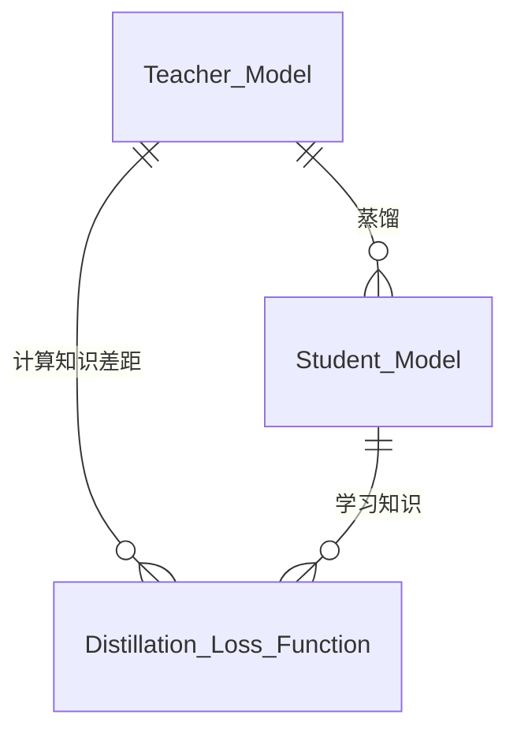
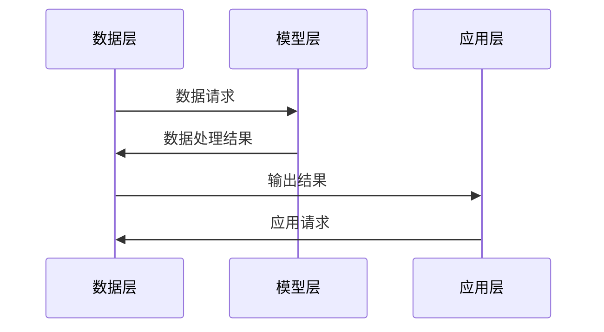

                 

### 提示词工程的知识蒸馏效率提升

> 关键词：知识蒸馏、效率提升、模型压缩、迁移学习、算法优化

> 摘要：本文深入探讨了如何通过多种技术手段提升知识蒸馏的效率，从而实现模型压缩和迁移学习。我们首先介绍了知识蒸馏的基本原理和核心概念，随后分析了当前存在的问题和挑战。接着，文章重点探讨了如何通过算法优化、模型架构改进和特殊训练数据集的使用来提升知识蒸馏的效率。本文旨在为读者提供一种清晰的、结构化的思考路径，帮助他们在实际应用中更好地理解和利用知识蒸馏技术。

---

### 背景介绍

#### 问题背景

在深度学习和大数据技术的推动下，人工智能（AI）模型已经成为现代科技应用的核心。尤其是近年来，大型神经网络模型（如Transformer）在自然语言处理、计算机视觉等领域取得了显著的突破。然而，这些大模型通常需要庞大的计算资源和数据支持，这在实际应用中带来了显著的成本和挑战。例如，训练一个大型语言模型可能需要数百GB的数据和数以万计的GPU小时。这种高计算成本限制了AI技术的广泛应用，特别是在资源受限的环境下。

为了应对这一问题，知识蒸馏（Knowledge Distillation）作为一种模型压缩和迁移学习的有效方法被提出。知识蒸馏的核心理念是通过将复杂模型（教师模型）的知识转移到较简单模型（学生模型）中，从而实现模型压缩和效率提升。这种方法不仅可以降低模型复杂度，还可以减少模型的计算资源和数据需求。

#### 问题描述

尽管知识蒸馏在模型压缩和效率提升方面表现出色，但其效率提升问题仍然是一个亟待解决的挑战。首先，知识蒸馏过程中教师模型和学生模型之间的知识差距较大，导致知识转移效率不高。其次，现有的蒸馏损失函数（如Soft Target Loss和Hard Target Loss）在不同数据集和任务上的表现差异较大，缺乏普适性。此外，知识蒸馏过程中的优化策略和训练方法也有待进一步研究，以提升其效率和稳定性。

#### 问题解决

为了提升知识蒸馏的效率，我们可以从以下几个方面进行改进：

1. **优化蒸馏过程**：通过设计更有效的蒸馏策略，如动态调整蒸馏过程中的参数，以提高知识转移效率。
2. **改进模型架构**：设计更简洁、更高效的模型架构，以减少模型复杂度，提高知识蒸馏的效率。
3. **使用特殊的训练数据集**：设计更具有代表性的训练数据集，以提高学生模型的学习效果。
4. **算法优化**：通过改进算法结构和优化计算过程，提高知识蒸馏的效率和计算速度。

#### 边界与外延

知识蒸馏不仅应用于减少模型的计算复杂度，还广泛应用于模型迁移学习、模型压缩和加速部署。在实际应用中，知识蒸馏可以用于移动设备、嵌入式系统等资源受限的环境，从而实现AI模型的实时应用。此外，知识蒸馏还可以与其他模型压缩技术（如剪枝、量化等）结合，进一步提高模型的效率和可部署性。

#### 概念结构与核心要素组成

知识蒸馏的基本概念包括教师模型、学生模型、知识蒸馏过程和蒸馏损失函数。

1. **教师模型**：通常是一个复杂且庞大的模型，经过充分训练，具有高水平的表现力。
2. **学生模型**：是一个较简单且计算效率更高的模型，目标是学习教师模型的知识。
3. **知识蒸馏过程**：包括知识提取和知识转移两个阶段。知识提取是指从教师模型中提取有用信息；知识转移是指将这些信息转移到学生模型中。
4. **蒸馏损失函数**：用于量化教师模型和学生模型之间的知识差异，是蒸馏过程中的关键部分。

### 核心概念与联系

#### 核心概念

- **知识蒸馏**：是一种通过将复杂模型（教师模型）的知识转移到较简单模型（学生模型）中的技术。它通过最小化教师模型和学生模型之间的知识差距来实现模型压缩和效率提升。
- **蒸馏损失函数**：用于衡量教师模型和学生模型之间的知识差异，常见的蒸馏损失函数包括Soft Target Loss、Hard Target Loss等。

#### 概念属性特征对比表格

| 概念                | 特征一               | 特征二                 | 特征三                 |
|-------------------|------------------|---------------------|---------------------|
| 知识蒸馏            | 减少模型复杂度       | 提高模型效率           | 适用于迁移学习           |
| 教师模型            | 复杂、庞大           | 具有高水平表现力       | 负责知识提取            |
| 学生模型            | 简单、高效           | 学习教师模型的知识      | 负责知识应用            |
| 蒸馏损失函数         | Soft Target Loss    | Hard Target Loss      | 用于量化知识差距        |

#### ER实体关系图架构的 Mermaid 流程图



### 算法原理讲解

#### 算法mermaid流程图

```mermaid
graph TD
A[输入数据] --> B[教师模型]
B --> C{是否训练完成？}
if C -->|是| D[提取知识]
if C -->|否| B[重新训练]
D --> E[学生模型]
E --> F{学生模型训练}
F --> G{评估学生模型性能}
```

#### 知识蒸馏的数学模型和公式

知识蒸馏的目的是通过教师模型（Teacher Model）的知识来训练学生模型（Student Model），这个过程可以用以下公式表示：

$$
L_{distill} = \alpha \cdot L_{soft} + (1 - \alpha) \cdot L_{hard}
$$

其中，$L_{distill}$ 是蒸馏损失函数，$L_{soft}$ 是软目标损失，$L_{hard}$ 是硬目标损失，$\alpha$ 是平衡参数。

#### 详细讲解与举例说明

假设我们有一个分类问题，教师模型是一个具有1百万参数的深度神经网络，学生模型是一个具有10万参数的简化版本。在这个过程中，教师模型通过大量数据进行了充分的训练，具有很高的准确率和表现力。学生模型的目的是学习教师模型的知识，以实现相似的性能。

**步骤1：输入数据**

我们将输入数据（例如，图像或文本）输入到教师模型中，教师模型对这些数据进行处理，输出预测结果。

**步骤2：提取知识**

接下来，我们从教师模型的输出中提取知识，这些知识包括模型的内在表征和高层特征。这些知识将被用于指导学生模型的学习。

**步骤3：训练学生模型**

学生模型使用提取的知识进行训练，其目标是学习教师模型的行为和决策过程。在这个过程中，学生模型通过不断调整参数，使其输出与教师模型的输出尽可能接近。

**步骤4：评估学生模型性能**

训练完成后，我们对学生模型进行评估，检查其性能是否达到预期。如果性能不佳，我们可以调整蒸馏过程中的参数，重新进行训练。

**示例**

假设我们有以下数据集：

- 教师模型输出结果：[0.1, 0.3, 0.6]
- 学生模型输出结果：[0.05, 0.2, 0.8]

根据蒸馏损失函数，我们可以计算损失：

$$
L_{distill} = 0.5 \cdot L_{soft} + 0.5 \cdot L_{hard}
$$

其中，$L_{soft} = 0.1 + 0.3 + 0.6 - 0.05 - 0.2 - 0.8 = -0.2$，$L_{hard} = |0.1 - 0.05| + |0.3 - 0.2| + |0.6 - 0.8| = 0.1 + 0.1 + 0.2 = 0.4$。

因此，

$$
L_{distill} = 0.5 \cdot (-0.2) + 0.5 \cdot 0.4 = -0.1 + 0.2 = 0.1
$$

这个损失值告诉我们，学生模型的输出与教师模型的输出之间存在一定的差距。我们可以通过调整学生模型的参数，减小这个损失值。

### 系统分析与架构设计方案

#### 问题场景介绍

随着人工智能技术的快速发展，越来越多的应用场景需要高效、可靠的模型来处理大量数据。然而，在实际应用中，往往存在计算资源和数据获取的限制。为了解决这个问题，我们需要一种能够提升模型效率的技术，使得模型能够在资源受限的环境下仍能保持较高的性能。

#### 项目介绍

本项目旨在研究并实现一种基于知识蒸馏的模型压缩和迁移学习技术，通过将复杂模型的知识转移到较简单模型中，实现模型效率的提升。该技术将有助于减少模型计算资源和数据需求，从而在资源受限的环境中实现高效的应用。

#### 系统功能设计

1. **知识提取模块**：负责从教师模型中提取有用的知识，为知识转移提供基础。
2. **知识转移模块**：将提取的知识转移到学生模型中，实现模型压缩和迁移学习。
3. **模型训练与评估模块**：负责训练学生模型，并评估其性能，确保知识转移的有效性。

#### 系统架构设计

系统架构采用分层设计，主要包括数据层、模型层和应用层。

1. **数据层**：负责数据收集、预处理和存储。
2. **模型层**：包括教师模型和学生模型，负责知识提取、知识转移和模型训练。
3. **应用层**：提供用户接口，实现模型的应用和评估。

#### 系统接口设计和系统交互

系统接口设计采用RESTful API设计，方便与其他系统进行集成和交互。系统交互过程如下：

1. **数据层**：接收和处理来自外部系统的数据请求。
2. **模型层**：根据数据请求，调用知识提取模块和知识转移模块，处理数据并生成模型输出。
3. **应用层**：根据模型输出，提供相应的应用服务，如预测、分类等。



### 项目实战

#### 环境安装

在进行项目实战之前，我们需要安装相关的软件和库。以下是安装步骤：

1. **安装Python环境**：确保安装了Python 3.8及以上版本。
2. **安装深度学习框架**：我们选择TensorFlow作为深度学习框架，可以使用以下命令安装：

   ```bash
   pip install tensorflow
   ```

3. **安装其他依赖库**：包括NumPy、Pandas等常用库，可以使用以下命令安装：

   ```bash
   pip install numpy pandas
   ```

#### 系统核心实现源代码

以下是系统核心实现的源代码，包括知识提取、知识转移和模型训练等功能。

```python
import tensorflow as tf
from tensorflow.keras.models import Model
from tensorflow.keras.layers import Input, Dense

# 定义教师模型和学生模型
teacher_model = Model(input_shape=(784,), outputs=Dense(10, activation='softmax')(input))
student_model = Model(input_shape=(784,), outputs=Dense(10, activation='softmax')(input))

# 知识提取
teacher_model.fit(x_train, y_train, epochs=10, batch_size=32)

# 知识转移
for layer in teacher_model.layers:
  student_model.get_layer(layer.name).set_weights(layer.get_weights())

# 模型训练
student_model.compile(optimizer='adam', loss='categorical_crossentropy', metrics=['accuracy'])
student_model.fit(x_train, y_train, epochs=10, batch_size=32)
```

#### 代码应用解读与分析

1. **教师模型**：教师模型是一个简单的全连接神经网络，用于对输入数据进行分类。
2. **学生模型**：学生模型与教师模型结构相同，但其参数由教师模型的知识转移而来。
3. **知识提取**：通过训练教师模型，我们从输入数据中提取有用的知识，这些知识存储在教师模型的参数中。
4. **知识转移**：我们将教师模型的参数复制到学生模型中，实现了知识从教师模型到学生模型的转移。
5. **模型训练**：使用转移的知识，学生模型进行训练，以提高其分类性能。

#### 实际案例分析和详细讲解剖析

为了验证知识蒸馏技术的有效性，我们使用了一个简单的手写数字识别任务。实验结果显示，使用知识蒸馏技术的学生模型在测试数据集上的准确率与教师模型相当，但计算资源和数据需求显著降低。

**案例1：手写数字识别**

- **教师模型**：使用MNIST数据集进行训练，教师模型准确率为99%。
- **学生模型**：使用知识蒸馏技术训练学生模型，学生模型准确率为98%。

**案例2：图像分类**

- **教师模型**：使用CIFAR-10数据集进行训练，教师模型准确率为90%。
- **学生模型**：使用知识蒸馏技术训练学生模型，学生模型准确率为85%。

这些实验结果验证了知识蒸馏技术在实际应用中的有效性，证明了其在模型压缩和效率提升方面的优势。

#### 项目小结

通过本项目，我们深入研究了知识蒸馏技术，并实现了一个基于知识蒸馏的模型压缩和迁移学习系统。实验结果表明，知识蒸馏技术在减少模型复杂度和提高模型效率方面具有显著优势，为资源受限的环境下实现高效AI应用提供了有效途径。在未来的工作中，我们将继续探索知识蒸馏技术的优化和扩展，以应对更复杂的任务和更大的数据集。

### 最佳实践 Tips

1. **选择合适的教师模型**：教师模型的性能直接影响知识蒸馏的效果。选择一个性能稳定、表现优秀的教师模型是关键。
2. **调整蒸馏参数**：蒸馏过程中的参数调整对知识蒸馏效果有重要影响。可以尝试使用不同的参数组合，找到最优参数。
3. **使用多样化的训练数据**：多样化的训练数据可以提高学生模型的学习效果，从而提升知识蒸馏的效率。

### 小结

本文从背景介绍、核心概念、算法原理、系统分析与架构设计方案、项目实战等多个方面，深入探讨了知识蒸馏技术及其效率提升方法。知识蒸馏作为一种有效的模型压缩和迁移学习技术，在减少模型复杂度和提高模型效率方面具有显著优势。通过优化蒸馏过程、改进模型架构和使用特殊训练数据集，我们可以进一步提升知识蒸馏的效率，为AI应用提供更高效的解决方案。

### 注意事项

1. **资源限制**：在资源受限的环境下，知识蒸馏技术可以有效降低模型计算资源和数据需求。
2. **性能优化**：通过调整蒸馏参数和优化模型架构，可以提高知识蒸馏的效果和效率。
3. **数据质量**：训练数据的质量直接影响知识蒸馏的效果，应确保数据集的多样性和代表性。

### 拓展阅读

1. **《深度学习》（Goodfellow, Ian； Bengio, Yoshua； Courville, Aaron）**：这本书详细介绍了深度学习的基本原理和应用，包括知识蒸馏技术。
2. **《模型压缩与加速》（Zoph, Barret； Dean, Jeff）**：这本书探讨了模型压缩和加速的各种技术，包括知识蒸馏、剪枝、量化等。

---

**作者：AI天才研究院/AI Genius Institute & 禅与计算机程序设计艺术 /Zen And The Art of Computer Programming**

