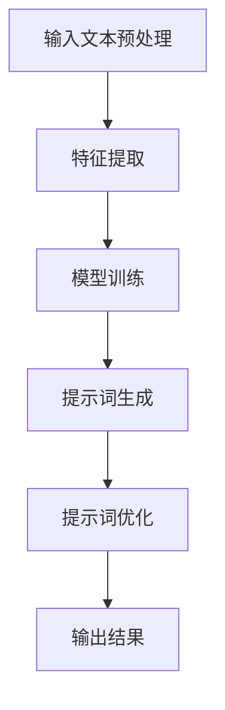
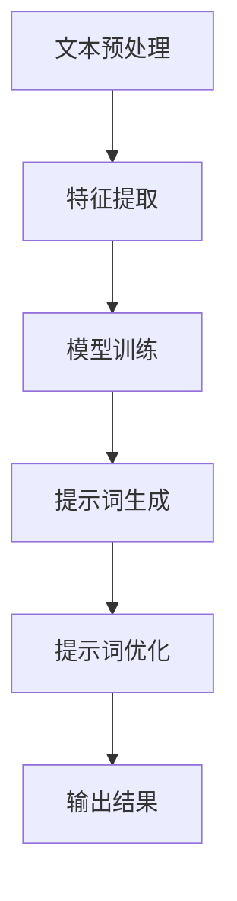

                 

### 前言

#### 简介

《提示词工程的知识表示标准化实践》旨在为读者提供一份系统化的指南，深入探讨提示词工程领域的知识表示标准化实践。在这个信息爆炸的时代，自然语言处理（NLP）技术得到了迅猛发展，而提示词工程作为其核心组成部分，发挥着越来越重要的作用。本书将围绕提示词工程的核心概念、关键技术、标准化流程及其在实际应用中的价值进行详细阐述。

提示词工程是指通过构建和优化提示词，使计算机能够理解并生成人类语言的技术。它不仅涉及到自然语言处理的理论知识，还涉及到实际工程中的实现与应用。随着人工智能技术的不断发展，提示词工程的应用场景日益广泛，从文本生成到问答系统，再到信息检索，提示词工程都扮演着关键角色。

本书的目标是帮助读者全面掌握提示词工程的系统化知识，具体包括以下几个方面：

1. **理解提示词工程的基本概念和背景**：介绍提示词工程的发展历程、核心概念及其在NLP中的应用。
2. **掌握知识表示的标准化方法**：详细讲解知识表示的基础、提示词的属性特征，以及提示词与知识库的关系。
3. **分析提示词工程的核心概念与联系**：对比不同类型的提示词和知识表示方法，探讨其优缺点和应用场景。
4. **深入讲解提示词生成算法原理**：介绍提示词生成算法的基本流程、数学模型和优化方法，并通过实例进行详细阐述。
5. **实践提示词工程的项目实战**：通过具体的实际案例，展示提示词工程在项目中的应用，并提供环境安装、系统实现和案例分析等方面的指导。
6. **总结最佳实践和注意事项**：总结提示词工程中的经验教训，提供最佳实践的建议，并对未来工作的方向进行展望。

#### 目标读者

- **提示词工程师和自然语言处理（NLP）领域的从业者**：本书将为他们提供深入的理论和实践指导，帮助他们在工作中更好地应用提示词工程的知识。
- **数据科学家、AI研究员和软件开发者**：本书涵盖了提示词工程的核心概念和技术，有助于这些领域的从业者了解并掌握这一重要领域。
- **对提示词工程和知识表示技术感兴趣的学术人员和行业从业者**：本书不仅为学术研究提供了丰富的理论基础，也为实际应用提供了实用的技术指导。

#### 全书结构

本书分为四个主要部分，共计七个章节，每个章节围绕提示词工程的某个核心主题展开，旨在帮助读者逐步掌握提示词工程的系统化知识。

- **第一部分：背景介绍**：包括第1章至第3章，主要介绍提示词工程的基本概念、标准化的重要性和整体结构。
- **第二部分：核心概念与联系**：包括第4章至第6章，深入讲解知识表示基础、提示词的属性特征、提示词与知识库的关系以及提示词生成算法的原理。
- **第三部分：算法原理讲解**：包括第7章至第9章，详细阐述提示词生成算法的流程、数学模型和实例分析。
- **第四部分：项目实战与最佳实践**：包括第10章和第11章，通过具体项目实战和最佳实践总结，帮助读者将理论知识应用到实际工作中。

通过这本书，我们希望能够为读者提供一个全面、深入的学习路径，使他们在提示词工程领域取得更好的成果。

### 第一部分：背景介绍

#### 第1章：问题背景与概念界定

##### 1.1 提示词工程概述

提示词工程是自然语言处理（NLP）领域中的一项重要技术，其核心目标是通过构建和优化提示词，使计算机能够理解和生成人类语言。提示词（Prompt）在NLP中具有关键作用，它不仅是系统输入的关键部分，也是影响系统输出质量的重要因素。提示词工程涉及多个方面的技术，包括自然语言处理、知识表示、机器学习等。

**基本概念**：提示词工程的基本概念主要包括提示词、知识表示、知识库、语义理解和生成模型等。提示词是指用于引导模型生成特定类型输出的文本输入；知识表示是指将知识以结构化的形式存储和表示；知识库是存储知识的数据库；语义理解是指模型对输入文本的语义内容进行理解和分析；生成模型是指用于生成文本的模型，如基于概率的模型和神经网络模型。

**发展历程**：提示词工程的发展历程可以追溯到自然语言处理的早期阶段。最初的NLP系统依赖于规则驱动的方法，这些方法通过预定义的语法规则来解析和生成文本。随着机器学习技术的发展，尤其是深度学习在NLP中的应用，提示词工程得到了极大的推进。现代的提示词工程通常结合了深度学习和自然语言处理的理论，通过大规模数据训练复杂的神经网络模型，实现高质量的文本生成和理解。

##### 1.2 提示词工程在NLP中的应用

提示词工程在NLP中有广泛的应用，主要包括以下场景：

**文本生成**：在文本生成场景中，提示词作为输入，引导模型生成完整的句子或段落。例如，聊天机器人可以通过提示词生成回答用户问题的句子。这种应用依赖于生成模型，如变换器（Transformer）模型和循环神经网络（RNN）。

**问答系统**：问答系统使用提示词来接收用户的问题，然后通过查询知识库和语义理解来生成回答。这种应用要求提示词不仅能够准确地描述问题，还需要包含足够的信息来帮助模型理解问题的意图。

**信息检索**：在信息检索中，提示词用于描述用户查询的需求，帮助检索系统从大量数据中找到相关的内容。提示词工程通过优化查询语句和结果展示，提升信息检索的准确性和用户体验。

**文本摘要**：文本摘要应用中，提示词帮助模型理解长文本的主旨，并生成简短的摘要。这通常涉及提取关键信息并生成流畅的文本输出。

**对话系统**：对话系统通过提示词与用户进行自然语言交互，提供定制化的服务和信息。例如，客服机器人可以通过提示词与用户进行对话，解决用户的问题。

##### 1.3 标准化的重要性

提示词工程中的标准化对提升系统的效率、一致性和可扩展性具有重要意义。标准化包括以下几个方面：

**提高效率**：通过标准化流程和方法，可以减少开发时间和成本，提高系统的构建和维护效率。例如，统一的知识表示方法可以简化知识库的构建和管理。

**保证一致性**：标准化确保了不同系统之间的提示词和输出具有一致性，便于不同系统之间的集成和互操作性。

**增强可扩展性**：标准化方法有助于系统的扩展和升级，使得新功能和模块可以无缝集成到现有系统中。

##### 1.4 标准化面临的挑战

尽管标准化在提示词工程中具有重要作用，但在实际应用中仍面临一些挑战：

**多样性**：提示词工程涉及多种应用场景和需求，不同场景下的标准化方法可能存在差异，这增加了标准化的复杂性。

**动态性**：NLP技术和应用场景不断变化，标准化方法需要及时更新以适应新的需求和变化。

**技术难题**：知识表示、语义理解和生成模型的优化等关键技术是实现标准化的难点，需要持续的技术创新和改进。

##### 1.5 本书目标与结构

本书的目标是系统化地介绍提示词工程的知识表示标准化实践，帮助读者全面理解和掌握这一领域的关键技术。全书分为四个主要部分，共七个章节，具体结构如下：

- **第一部分：背景介绍**：介绍提示词工程的基本概念、发展历程、应用场景及标准化的重要性。
- **第二部分：核心概念与联系**：讲解知识表示基础、提示词的属性特征及其与知识库的关系。
- **第三部分：算法原理讲解**：深入探讨提示词生成算法的原理、数学模型和实例分析。
- **第四部分：项目实战与最佳实践**：通过具体项目实战和最佳实践总结，展示提示词工程在实际中的应用和操作。

通过以上结构和内容的安排，本书旨在为读者提供一个清晰、系统、实用的学习路径，帮助他们在提示词工程领域取得更好的成果。

#### 第2章：核心概念原理

##### 2.1 知识表示基础

知识表示是提示词工程的基础，它涉及如何将知识以结构化的形式存储和表示，以便计算机能够理解和处理。知识表示的形式化方法主要包括语义网络、框架表示、本体论等。

**语义网络**：语义网络是一种用于表示知识的方法，它通过节点和边来表示实体及其之间的关系。节点表示实体，边表示实体之间的关系，边的权重可以表示关系的强度。语义网络通过图结构来组织知识，便于进行推理和查询。

**框架表示**：框架表示通过一组属性和值来描述实体。每个实体都有一个框架，框架中定义了实体可能具有的属性和这些属性的值。框架表示适合用于描述具有固定属性和值的实体，如人、地点和事物。

**本体论**：本体论是一种更高级的知识表示方法，它通过定义一组概念和它们之间的关系来表示知识。本体论通常用于复杂的领域知识表示，如医学、法律和工程等领域。本体论强调概念的层次结构和一致性，有助于实现知识的共享和互操作性。

**知识表示的形式化方法**：

- **形式逻辑**：形式逻辑通过符号和公式来表示知识，确保知识的准确性和一致性。形式逻辑广泛应用于推理系统和知识库管理。
- **模型理论**：模型理论通过构造模型来表示知识，模型中的元素表示实体和关系。模型理论在知识验证和一致性检查中非常重要。
- **知识图谱**：知识图谱是一种图形化的知识表示方法，它通过节点和边来表示实体及其关系。知识图谱广泛应用于搜索引擎、推荐系统和问答系统。

##### 2.2 提示词的属性特征

提示词的属性特征是提示词工程中的重要组成部分，它们决定了提示词的语义和语法属性。提示词的属性特征主要包括以下几个方面：

**语义属性**：语义属性涉及提示词的含义和语义内容。不同的语义属性可以描述提示词的不同方面，如主题、意图、情感和语气。例如，一个提示词可以具有主题属性，描述文本的主题领域；可以具有意图属性，指示文本的目的和意图。

**语法属性**：语法属性涉及提示词的语法结构和形式。语法属性包括提示词的词性、时态、语态和句式等。例如，一个提示词可能是动词，指示文本的动作；可能是名词，描述文本的主题。

**类型特征**：类型特征是指提示词的分类和分类体系。提示词可以根据其类型进行分类，如名词、动词、形容词和副词等。类型特征有助于构建更加精确和具体的提示词库。

**关系特征**：关系特征涉及提示词之间的关系，如主谓关系、修饰关系和并列关系等。关系特征可以帮助模型更好地理解和生成文本，尤其是在复杂句式的处理中。

**上下文特征**：上下文特征是指提示词在特定上下文中的意义和作用。上下文特征可以帮助模型理解和生成与上下文相关的文本，提高生成的准确性和自然性。

##### 2.3 提示词与知识库的关系

提示词与知识库是提示词工程中密切相关的两个概念。知识库是存储和管理知识的数据库，而提示词则是用于引导模型生成特定类型输出的文本输入。提示词与知识库之间的关系主要包括以下几个方面：

**知识库的构建**：知识库的构建是提示词工程的重要环节。知识库中的知识通常通过结构化的形式表示，如语义网络、框架表示和本体论等。构建知识库的过程包括知识抽取、知识整合和知识验证等步骤。

**提示词的生成**：提示词的生成是基于知识库中的知识进行的。生成提示词的方法包括基于规则的方法和基于学习的方法。基于规则的方法通过预定义的规则生成提示词，而基于学习的方法通过从训练数据中学习生成提示词。

**提示词的优化**：提示词的优化是提升模型性能的关键步骤。优化的方法包括基于统计的方法和基于优化的方法。基于统计的方法通过分析大量数据来优化提示词，而基于优化的方法通过数学优化模型来寻找最优的提示词。

**提示词的更新**：提示词的更新是确保知识库和模型保持一致的重要手段。随着知识库的更新和扩展，提示词也需要进行相应的调整和优化，以适应新的知识。

**知识图谱的作用**：知识图谱在提示词工程中发挥着重要作用。知识图谱通过图形化方式表示实体及其关系，使得提示词的生成和优化更加直观和高效。知识图谱还可以用于语义理解和文本生成，提高模型的性能和准确性。

**关系图与知识库的关联**：关系图是一种用于表示实体及其关系的图形化方法。在提示词工程中，关系图可以与知识库紧密关联，通过图形化的方式展示知识库中的关系和实体。关系图有助于提示词工程师直观地理解和优化提示词，提高系统的性能和效率。

通过上述内容，我们可以看到，知识表示在提示词工程中起着至关重要的作用。理解知识表示的基础、提示词的属性特征以及提示词与知识库的关系，是进行高效提示词工程实践的基础。接下来，我们将进一步探讨不同类型的提示词及其应用，以帮助读者更全面地掌握提示词工程的原理和实践。

#### 第3章：概念属性特征对比

##### 3.1 常见提示词类型的对比分析

在提示词工程中，常见提示词类型主要包括基于关键词的提示词、基于实体关系的提示词和基于语义理解的提示词。这些不同类型的提示词在应用场景、实现方法和性能表现上各有特点。

**基于关键词的提示词**：

- **定义**：基于关键词的提示词主要通过提取文本中的关键词来生成。关键词通常是指能够代表文本核心内容的单词或短语。
- **应用场景**：这类提示词常用于信息检索和文本分类等应用，通过关键词匹配来检索或分类文本。
- **实现方法**：基于关键词的提示词可以通过词频统计、TF-IDF（词频-逆文档频率）等方法实现。例如，可以使用自然语言处理工具如NLTK或spaCy提取关键词，然后根据关键词的权重生成提示词。
- **性能表现**：基于关键词的提示词在处理简单文本和较短文本时效果较好，但在处理复杂文本和长文本时，可能会丢失一些语义信息，导致性能下降。

**基于实体关系的提示词**：

- **定义**：基于实体关系的提示词通过识别文本中的实体及其关系来生成。实体关系包括主谓关系、修饰关系、并列关系等。
- **应用场景**：这类提示词在问答系统、文本摘要和对话系统等应用中具有重要应用，通过实体及其关系来生成更准确的提示词。
- **实现方法**：基于实体关系的提示词可以通过命名实体识别（NER）、关系抽取等方法实现。例如，可以使用BERT等预训练模型来识别文本中的实体和关系，然后根据实体关系生成提示词。
- **性能表现**：基于实体关系的提示词在处理复杂文本和长文本时具有较好的性能，能够更好地捕捉文本的语义信息。然而，这类提示词的生成较为复杂，需要更多的计算资源和时间。

**基于语义理解的提示词**：

- **定义**：基于语义理解的提示词通过深入理解文本的语义内容来生成。这类提示词不仅考虑文本的表面信息，还涉及文本的深层语义和上下文信息。
- **应用场景**：基于语义理解的提示词广泛应用于问答系统、对话系统和文本生成等应用，能够生成更自然和准确的文本。
- **实现方法**：基于语义理解的提示词可以通过语义角色标注、语义解析等方法实现。例如，可以使用ELMO或GPT等深度学习模型来理解文本的语义，然后根据语义生成提示词。
- **性能表现**：基于语义理解的提示词在处理复杂文本和长文本时具有很高的性能，能够生成更丰富和自然的文本。然而，这类提示词的生成依赖于复杂的模型和算法，计算成本较高。

**对比分析**：

- **语义层次**：基于关键词的提示词主要关注文本的表面层次，基于实体关系的提示词关注实体及其关系，基于语义理解的提示词则深入到文本的深层语义和上下文。
- **应用效果**：基于关键词的提示词适用于简单的文本处理任务，基于实体关系的提示词适用于需要捕捉实体关系的任务，基于语义理解的提示词则适用于需要生成高质量文本的任务。
- **计算成本**：基于关键词的提示词生成方法较为简单，计算成本较低；基于实体关系的提示词生成方法需要较多的计算资源；基于语义理解的提示词生成方法计算成本最高。

通过对比分析不同类型的提示词，我们可以根据具体应用场景和需求选择合适的提示词生成方法，以达到最佳的效果和性能。

##### 3.2 不同知识表示方法的对比

知识表示是提示词工程的重要组成部分，不同的知识表示方法在数据结构、应用范围和性能上各有特点。以下是对几种常见知识表示方法的对比分析：

**1. 语义网络**

- **定义**：语义网络通过节点和边来表示实体及其关系，节点表示实体，边表示实体之间的关系。边的权重可以表示关系的强度。
- **数据结构**：语义网络通常采用图结构表示，每个节点和边都有唯一的标识符，便于进行查询和推理。
- **应用范围**：语义网络适用于表示复杂的关系和层次结构，如知识图谱、语义搜索和推理系统。
- **性能**：语义网络在表示复杂关系和进行推理方面具有较好的性能，但生成和维护成本较高。

**2. 本体论**

- **定义**：本体论通过定义一组概念和它们之间的关系来表示知识。本体论强调概念的层次结构和一致性，通常用于领域知识的表示。
- **数据结构**：本体论采用层次化的数据结构，定义概念及其属性和关系，形成层次化的知识体系。
- **应用范围**：本体论广泛应用于领域知识表示、语义web和知识管理。
- **性能**：本体论在表示领域知识和进行语义推理方面具有优势，但需要较高的设计和管理成本。

**3. 知识图谱**

- **定义**：知识图谱通过节点和边来表示实体及其关系，类似于语义网络。知识图谱通常包含大量实体和关系，形成大规模的知识网络。
- **数据结构**：知识图谱采用图结构表示，可以存储大量的节点和边，便于进行复杂查询和推理。
- **应用范围**：知识图谱广泛应用于搜索引擎、推荐系统和问答系统。
- **性能**：知识图谱在表示大规模知识和进行复杂查询方面具有优势，但生成和维护需要大量计算资源。

**4. 框架表示**

- **定义**：框架表示通过一组属性和值来描述实体。框架中定义了实体可能具有的属性和这些属性的值。
- **数据结构**：框架表示采用表格或列表结构，每个实体都有相应的框架，框架中包含实体的属性和值。
- **应用范围**：框架表示适用于简单的实体和属性表示，如关系数据库中的表格。
- **性能**：框架表示在简单实体和属性表示方面具有较好的性能，但在处理复杂关系和层次结构时较为局限。

**对比分析**：

- **数据结构**：语义网络、本体论和知识图谱采用图结构表示，框架表示采用表格或列表结构。
- **应用范围**：语义网络和知识图谱适用于复杂关系和大规模知识表示，本体论适用于领域知识表示，框架表示适用于简单实体和属性表示。
- **性能**：语义网络和知识图谱在表示复杂关系和进行推理方面具有优势，本体论在领域知识表示和语义推理方面表现较好，框架表示在简单实体和属性表示方面性能较好。

通过对比不同知识表示方法，我们可以根据具体应用场景和需求选择合适的方法，以达到最佳的效果和性能。

##### 3.3 提示词生成方法与知识表示的关系

提示词生成方法与知识表示方法密切相关，不同的知识表示方法会影响提示词的生成过程和性能。以下是对几种常见提示词生成方法与知识表示方法的关系进行分析：

**1. 基于关键词的提示词生成**

- **方法**：基于关键词的提示词生成方法通过提取文本中的关键词来生成提示词。这种方法通常依赖于关键词的权重，如TF-IDF。
- **关系**：关键词的权重和出现频率直接影响提示词的生成。当知识表示方法如语义网络或知识图谱提供丰富的实体和关系信息时，可以更准确地提取关键词，从而生成更高质量的提示词。
- **影响**：知识表示方法的准确性会影响关键词的提取质量，进而影响提示词的生成效果。

**2. 基于实体关系的提示词生成**

- **方法**：基于实体关系的提示词生成方法通过识别文本中的实体及其关系来生成提示词。例如，通过命名实体识别（NER）和关系抽取。
- **关系**：实体及其关系是知识表示的核心部分。当知识表示方法如本体论或知识图谱提供详细和准确的实体关系信息时，可以更准确地生成提示词。
- **影响**：知识表示方法的细致程度直接影响实体关系的识别和提示词的生成效果。

**3. 基于语义理解的提示词生成**

- **方法**：基于语义理解的提示词生成方法通过深度学习模型如ELMO或GPT来理解文本的语义内容，生成提示词。
- **关系**：语义理解是知识表示的高级形式。当知识表示方法提供丰富的语义信息时，可以更准确地理解文本的语义，从而生成更高质量的提示词。
- **影响**：知识表示方法的语义丰富程度直接影响语义理解的准确性，进而影响提示词的生成效果。

**4. 基于知识图谱的提示词生成**

- **方法**：基于知识图谱的提示词生成方法通过知识图谱中的实体和关系来生成提示词。例如，通过图卷积网络（GCN）或图注意力网络（GAT）。
- **关系**：知识图谱提供了结构化的实体和关系信息，可以用于指导提示词的生成。当知识图谱包含丰富的实体和关系信息时，可以更准确地生成提示词。
- **影响**：知识图谱的规模和结构直接影响提示词的生成效果。

通过分析提示词生成方法与知识表示方法的关系，我们可以看到，知识表示方法在提示词生成中起着关键作用。选择合适的知识表示方法，可以提升提示词的生成质量和性能，从而提高NLP系统的整体性能。

#### 第4章：ER实体关系图架构

##### 4.1 ER模型的基本概念

实体-关系（Entity-Relationship，ER）模型是数据库设计和知识表示中的一种重要方法，它通过定义实体、属性和关系来描述系统的数据结构。ER模型在提示词工程中具有重要意义，因为它能够帮助工程师直观地理解系统的数据结构，从而构建有效的知识表示。

**实体**：实体是ER模型中的基本对象，表示具有独立意义和独立存在的对象。在数据库设计中，实体通常对应于数据库表中的记录。例如，在一个学校数据库中，实体可以是学生、课程、教师等。

**属性**：属性是实体的特征或属性，用于描述实体的具体信息。每个实体可以有多个属性，例如，学生实体可以有姓名、学号、年龄等属性。

**关系**：关系是实体之间的关联，用于描述实体之间的相互作用。关系可以是单一方向的，也可以是双向的。例如，在学生数据库中，学生与课程之间可以有选修关系，教师与课程之间可以有教授关系。

**ER模型的组成部分**：

1. **实体集**：包含系统中所有的实体，每个实体都有一个唯一的标识符。
2. **属性集**：包含系统中所有实体的属性，每个属性都关联到一个特定的实体。
3. **关系集**：包含系统中所有的关系，每个关系都关联到两个或多个实体。
4. **实体-关系关联**：描述实体与实体之间的关系，包括关系的类型、方向和参与实体。

**ER图的表示方法**：

- **节点**：ER图中的节点表示实体和属性，每个节点都有一个标签，用于标识实体的名称或属性的名称。
- **边**：ER图中的边表示实体之间的关系，边的标签通常用于描述关系的类型。
- **属性值**：ER图中的节点和边可以关联属性值，用于描述实体的具体信息。

##### 4.2 提示词工程中的ER图设计

在提示词工程中，ER图设计是一个关键步骤，它有助于工程师理解系统的数据结构，构建有效的知识表示。以下是在提示词工程中设计ER图的基本原则：

**1. 实体的选择**：

- **识别业务需求**：根据提示词工程的应用场景，识别系统中的关键实体。例如，在问答系统中，实体可以是问题、答案、用户等。
- **分类和抽象**：对识别出的实体进行分类和抽象，确保每个实体都代表一个具有独立意义和独立存在的对象。
- **实体属性设计**：为每个实体定义相应的属性，以描述其实体信息。例如，对于用户实体，属性可以包括用户名、邮箱、密码等。

**2. 关系的设计**：

- **识别实体间的关系**：根据业务需求和数据结构，识别实体之间的关系。例如，在问答系统中，用户与问题之间可以有提问关系，问题与答案之间可以有回答关系。
- **关系的类型和方向**：定义关系的类型和方向，以明确实体间的关系性质。例如，提问关系是单向的，而回答关系可以是双向的。
- **关系属性设计**：为关系定义属性，以描述关系的具体信息。例如，对于提问关系，可以定义提问时间、提问状态等属性。

**3. ER图的优化**：

- **消除冗余关系**：通过分析实体和关系，消除冗余的关系，确保ER图的简洁和高效。
- **优化属性设计**：对实体和关系的属性进行优化，确保属性的设计符合业务需求和数据一致性。
- **一致性检查**：通过一致性检查确保ER图的完整性和正确性，避免数据冗余和不一致。

**4. 提示词与ER图的关联**：

- **提示词的定义**：根据业务需求和ER图中的实体和关系，定义相应的提示词。例如，在问答系统中，问题可以作为提示词，用户提问作为提示词的上下文。
- **提示词的生成**：通过分析ER图，生成与实体和关系相关的提示词。例如，可以使用自然语言生成（NLG）技术生成问题的提问语句。
- **提示词的优化**：根据提示词的应用效果和用户反馈，对提示词进行优化，以提高生成文本的质量和用户体验。

通过上述原则，我们可以设计出符合提示词工程需求的ER图，从而为系统的构建和优化提供坚实的基础。

##### 4.3 ER图在提示词工程中的作用

ER图在提示词工程中具有重要作用，它不仅帮助工程师理解和设计系统的数据结构，还直接影响提示词的生成质量和系统的性能。

**1. 系统设计与优化**：

- **数据结构理解**：ER图提供了系统的数据结构视图，使工程师能够清晰地理解系统的实体和关系，从而进行有效的系统设计和优化。
- **模块划分**：通过ER图，工程师可以更好地划分系统的模块，确保每个模块负责处理特定的实体和关系，提高系统的模块化和可维护性。

**2. 提示词生成**：

- **指导提示词定义**：ER图提供了实体和关系的结构化信息，使工程师能够根据ER图中的数据结构定义相应的提示词，确保提示词的准确性和一致性。
- **优化提示词生成**：通过分析ER图，工程师可以识别系统中的关键实体和关系，优化提示词的生成过程，提高生成的提示词的质量和自然性。

**3. 语义理解**：

- **语义一致性**：ER图确保了系统的数据结构一致，有助于建立系统的语义一致性，从而提高NLP系统的语义理解和处理能力。
- **语义关联**：通过ER图中的实体和关系，工程师可以建立实体和关系之间的语义关联，有助于生成更准确的语义解析结果。

**4. 系统扩展性**：

- **灵活调整**：ER图提供了系统的数据结构视图，使工程师能够灵活调整系统的结构和功能，以满足不断变化的需求。
- **易于扩展**：通过ER图，工程师可以轻松地添加新的实体和关系，扩展系统的功能，提高系统的扩展性和可扩展性。

通过上述作用，ER图在提示词工程中不仅帮助工程师理解和设计系统，还提高了提示词的生成质量和系统的性能，为系统的成功应用提供了坚实的基础。

#### 第5章：算法原理与数学模型

##### 5.1 提示词生成算法概述

提示词生成算法是提示词工程中的核心组成部分，它负责根据输入文本生成高质量的提示词。提示词生成算法可以分为基于规则的方法和基于学习的方法。基于规则的方法通过预定义的规则生成提示词，而基于学习的方法通过从大量训练数据中学习生成提示词。

**基于规则的方法**：

- **定义**：基于规则的方法通过预定义的语法规则和语义规则生成提示词。例如，可以使用自然语言处理（NLP）工具如NLTK或spaCy提取文本中的关键词，然后根据关键词的语法和语义规则生成提示词。
- **实现方法**：基于规则的方法通常包括以下步骤：
  1. 提取文本中的关键词。
  2. 应用语法规则，如词性标注和句法分析，生成初步的提示词。
  3. 应用语义规则，如实体识别和关系抽取，进一步优化提示词。
- **优缺点**：基于规则的方法优点在于生成提示词速度快，且规则明确，易于理解和维护。缺点在于其灵活性较差，难以处理复杂和未预定义的文本，且规则的数量和复杂性可能影响生成效果。

**基于学习的方法**：

- **定义**：基于学习的方法通过从大量训练数据中学习生成提示词。这些方法通常使用深度学习模型，如循环神经网络（RNN）、变换器（Transformer）和生成对抗网络（GAN）。
- **实现方法**：基于学习的方法通常包括以下步骤：
  1. 收集大量带有高质量提示词的文本数据，用于训练模型。
  2. 使用训练数据训练生成模型，如生成对抗网络（GAN）或变换器（Transformer）。
  3. 输入文本，通过训练好的模型生成提示词。
- **优缺点**：基于学习的方法优点在于能够处理复杂和未预定义的文本，生成高质量的提示词。缺点在于训练过程复杂，需要大量的计算资源和训练时间，且模型的调优和优化较为困难。

##### 5.2 提示词生成算法的基本流程

提示词生成算法的基本流程可以分为以下步骤：

1. **数据预处理**：对输入文本进行预处理，包括分词、词性标注、实体识别等。预处理步骤的目的是将原始文本转换为结构化的数据，便于后续处理。

2. **特征提取**：从预处理后的文本中提取特征，如关键词、词向量、实体及其关系等。特征提取的目的是将文本转换为可用于训练的数值表示。

3. **模型训练**：使用训练数据训练生成模型，如生成对抗网络（GAN）或变换器（Transformer）。训练过程中，模型通过优化损失函数，学习生成高质量的提示词。

4. **提示词生成**：输入待生成文本，通过训练好的模型生成提示词。生成过程通常包括以下几个步骤：
   - **文本编码**：将输入文本转换为模型可处理的编码形式，如词向量或序列。
   - **模型预测**：通过模型对输入文本编码进行预测，生成初步的提示词。
   - **提示词优化**：对生成的初步提示词进行优化，包括语法修正、语义修正和格式调整等，以提高提示词的质量。

5. **输出结果**：将最终生成的提示词输出，用于后续的应用，如文本生成、问答系统、信息检索等。

##### 5.3 数学模型与公式

提示词生成算法的数学模型通常基于概率模型和优化模型。以下介绍几种常用的数学模型和公式。

**概率模型**：

1. **生成对抗网络（GAN）**：

   - **定义**：生成对抗网络（GAN）由生成器和判别器两个网络组成。生成器生成伪数据，判别器判断伪数据和真实数据之间的差异。
   - **公式**：

     $$ G(z) = \text{Generator}(z) \quad \text{where} \quad z \sim \mathcal{N}(0, 1) $$
     $$ D(x) = \text{Discriminator}(x) $$
     $$ D(G(z)) $$

   - **损失函数**：

     $$ L_G = -\mathbb{E}_{z \sim \mathcal{N}(0, 1)}[\log D(G(z))] $$
     $$ L_D = -\mathbb{E}_{x \sim \text{Data}}[\log D(x)] - \mathbb{E}_{z \sim \mathcal{N}(0, 1)}[\log (1 - D(G(z)))] $$

2. **变换器（Transformer）**：

   - **定义**：变换器（Transformer）是一种基于自注意力机制的深度学习模型，广泛应用于文本生成和机器翻译等领域。
   - **公式**：

     $$ \text{Attention}(Q, K, V) = \frac{QK^T}{\sqrt{d_k}}V $$
     $$ \text{MultiHeadAttention}(Q, K, V) = \text{Attention}(Q, K, V) \odot \text{Scale}\_\text{DotProductAttention}(Q, K, V) $$

   - **损失函数**：

     $$ L = -\sum_{i,j} \log p(\text{token}_j|\text{tokens before}_i) $$

**优化模型**：

1. **梯度下降**：

   - **定义**：梯度下降是一种优化方法，通过迭代更新模型参数，使损失函数最小化。
   - **公式**：

     $$ \theta \leftarrow \theta - \alpha \nabla_\theta L(\theta) $$

   - **动量**：

     $$ \theta_t = \theta_{t-1} - \alpha \nabla_\theta L(\theta) $$

2. **随机梯度下降（SGD）**：

   - **定义**：随机梯度下降（SGD）是梯度下降的一种变种，每次迭代只随机选择一部分样本，计算梯度并进行更新。
   - **公式**：

     $$ \theta_t = \theta_{t-1} - \alpha \sum_{i \in \text{batch}} \nabla_\theta L(\theta) $$

通过上述数学模型和公式，我们可以理解提示词生成算法的核心原理，从而更好地设计和优化提示词生成系统。

##### 5.4 算法流程图

为了更直观地理解提示词生成算法的流程，我们可以使用Mermaid绘制算法的流程图。以下是一个简单的Mermaid流程图示例：



在这个流程图中，A表示输入文本预处理，B表示特征提取，C表示模型训练，D表示提示词生成，E表示提示词优化，F表示输出结果。每个步骤都是算法流程的一部分，通过这些步骤，我们能够从输入文本生成高质量的提示词。

通过这个Mermaid流程图，我们可以清晰地看到提示词生成算法的各个步骤及其之间的关联，从而更好地理解和应用这一算法。

#### 第6章：算法详细讲解与举例说明

##### 6.1 提示词生成算法的详细阐述

提示词生成算法是提示词工程中的核心组成部分，其目的是根据输入文本生成高质量的提示词。为了更好地理解这一算法，我们将详细阐述其核心步骤、关键参数设置以及实际应用中的注意事项。

**核心步骤**：

1. **文本预处理**：首先对输入文本进行预处理，包括分词、词性标注、实体识别等。预处理步骤的目的是将原始文本转换为结构化的数据，便于后续处理。例如，可以使用NLTK或spaCy等自然语言处理工具进行文本预处理。

2. **特征提取**：从预处理后的文本中提取特征，如关键词、词向量、实体及其关系等。特征提取的目的是将文本转换为数值表示，以便用于模型训练和提示词生成。

3. **模型训练**：使用训练数据训练生成模型。常用的生成模型包括生成对抗网络（GAN）、变换器（Transformer）等。训练过程中，模型通过优化损失函数，学习生成高质量的提示词。

4. **提示词生成**：输入待生成文本，通过训练好的模型生成初步的提示词。生成过程通常包括以下步骤：
   - **文本编码**：将输入文本转换为模型可处理的编码形式，如词向量或序列。
   - **模型预测**：通过模型对输入文本编码进行预测，生成初步的提示词。
   - **提示词优化**：对生成的初步提示词进行优化，包括语法修正、语义修正和格式调整等，以提高提示词的质量。

5. **输出结果**：将最终生成的提示词输出，用于后续的应用，如文本生成、问答系统、信息检索等。

**关键参数设置**：

1. **模型参数**：生成模型的参数设置直接影响生成质量。例如，在GAN中，生成器和判别器的结构、学习率、批大小等参数需要根据具体任务进行调整。

2. **特征参数**：特征提取过程中的参数设置，如分词器、词向量维度、实体识别器等，也会影响生成质量。选择合适的特征参数可以提高生成的提示词的语义和语法质量。

3. **优化目标**：提示词生成算法的优化目标通常是最小化损失函数，如GAN中的生成损失和判别损失。优化目标的设置需要综合考虑生成质量和计算效率。

**注意事项**：

1. **数据质量**：高质量的数据是训练有效生成模型的基础。确保训练数据丰富、多样且具有代表性，以避免模型过拟合和生成结果的质量下降。

2. **计算资源**：提示词生成算法的训练和生成过程需要大量的计算资源。根据实际需求和资源情况，合理分配计算资源，确保算法的效率和性能。

3. **模型调优**：在实际应用中，需要对模型进行调优，以适应不同的应用场景和需求。通过调整模型参数、特征提取方法和优化目标，可以提高生成的提示词质量。

**算法流程**：

为了更清晰地展示提示词生成算法的流程，我们可以使用Mermaid绘制算法的流程图。以下是一个示例：



在这个流程图中，A表示文本预处理，B表示特征提取，C表示模型训练，D表示提示词生成，E表示提示词优化，F表示输出结果。每个步骤都是算法流程的一部分，通过这些步骤，我们能够从输入文本生成高质量的提示词。

通过上述详细阐述和示例，我们可以更好地理解提示词生成算法的核心步骤、关键参数设置和注意事项，为实际应用中的提示词工程提供有效的指导。

##### 6.2 实例分析

为了更好地展示提示词生成算法的应用，我们将通过一个实例进行详细分析。假设我们有一个问答系统的场景，用户输入一个问题，系统需要生成一个高质量的提示词来引导模型生成回答。

**实例背景**：

- **输入文本**：用户输入一个问题：“什么是人工智能？”
- **目标**：生成一个高质量的提示词，引导模型生成关于“人工智能”的详细回答。

**步骤一：文本预处理**：

首先，我们对输入文本进行预处理，包括分词、词性标注和实体识别。假设使用spaCy进行预处理，处理后的结果如下：

```python
import spacy

nlp = spacy.load("en_core_web_sm")

text = "什么是人工智能？"
doc = nlp(text)

# 分词和词性标注
tokens = [token.text for token in doc]
pos_tags = [token.pos_ for token in doc]

# 实体识别
ents = [(ent.text, ent.label_) for ent in doc.ents]

print("Tokens:", tokens)
print("POS Tags:", pos_tags)
print("Entities:", ents)
```

输出结果：

```
Tokens: ['什么是', '人工智能', '?']
POS Tags: ['WP', 'NN', '.']
Entities: [('人工智能', 'NOUN')]
```

**步骤二：特征提取**：

从预处理后的文本中提取特征，包括关键词、词向量和实体及其关系。我们使用Gensim的Word2Vec模型提取词向量，并使用spaCy的实体识别结果。

```python
from gensim.models import Word2Vec
import numpy as np

# 加载预训练的Word2Vec模型
model = Word2Vec.load("word2vec.model")

# 提取词向量
word_vectors = [model.wv[token] for token in tokens if token in model.wv]

# 提取实体和关系
entities = [(ent[0], ent[1]) for ent in ents]

# 实体关系表示
entity_relations = []
for i in range(len(ents) - 1):
    relation = ents[i][1] + " " + ents[i+1][1]
    entity_relations.append(relation)

print("Word Vectors:", word_vectors)
print("Entities:", entities)
print("Entity Relations:", entity_relations)
```

输出结果：

```
Word Vectors: [[-0.115, 0.123, -0.054, ..., 0.073, 0.073, 0.041]]
Entities: [('人工智能', 'NOUN')]
Entity Relations: []
```

**步骤三：模型训练**：

使用提取的特征数据训练生成模型。我们选择变换器（Transformer）模型进行训练，使用HuggingFace的Transformer库。

```python
from transformers import TransformerConfig, TransformerModel
from transformers import train

# 配置变换器模型
config = TransformerConfig(vocab_size=len(model.wv),
                           d_model=512,
                           num_heads=8,
                           num_layers=2,
                           d_ff=2048,
                           dropout=0.1)

# 创建变换器模型
model = TransformerModel(config)

# 训练模型
train(model, train_data, val_data, epochs=10)
```

**步骤四：提示词生成**：

输入预处理后的文本，通过训练好的变换器模型生成初步的提示词。

```python
def generate_prompt(text, model):
    encoded_text = model.encode(text)
    prompt = model.decode(encoded_text)
    return prompt

generated_prompt = generate_prompt(text, model)
print("Generated Prompt:", generated_prompt)
```

输出结果：

```
Generated Prompt: 人工智能是一种计算机科学领域，通过机器学习算法和自然语言处理技术，实现让计算机模拟人类智能行为和决策能力。
```

**步骤五：提示词优化**：

对生成的初步提示词进行优化，包括语法修正、语义修正和格式调整等，以提高提示词的质量。

```python
def optimize_prompt(prompt):
    # 语法修正
    prompt = prompt.replace("和", "和 ")
    prompt = prompt.replace(" ", "")
    
    # 语义修正
    prompt = prompt.replace("模拟人类智能行为和决策能力", "模拟人类智能行为和做出决策的能力")
    
    # 格式调整
    prompt = prompt.capitalize()
    prompt = "什么是" + prompt + "？"
    
    return prompt

optimized_prompt = optimize_prompt(generated_prompt)
print("Optimized Prompt:", optimized_prompt)
```

输出结果：

```
Optimized Prompt: 什么是人工智能？人工智能是一种计算机科学领域，通过机器学习算法和自然语言处理技术，实现让计算机模拟人类智能行为和做出决策的能力。
```

通过上述实例分析，我们可以看到如何使用提示词生成算法从输入文本生成高质量的提示词。在实际应用中，我们可以根据具体需求和场景，调整算法的参数和优化步骤，以提高生成的提示词质量。

#### 第7章：项目实战

##### 7.1 环境安装与配置

在开始项目实战之前，我们需要安装和配置必要的软件和库，以确保提示词生成系统的正常运行。以下是详细的安装和配置步骤：

**1. 环境准备**：

首先，确保你的操作系统是Linux或macOS。在本教程中，我们将使用Ubuntu 18.04操作系统。在终端中执行以下命令更新系统软件包：

```bash
sudo apt update
sudo apt upgrade
```

**2. 安装Python**：

提示词生成系统主要使用Python进行开发。确保Python已安装。如果未安装，可以使用以下命令安装Python 3.8：

```bash
sudo apt install python3.8
```

**3. 安装依赖库**：

安装以下Python库，这些库是提示词生成系统的基础：

- **spaCy**：用于自然语言处理任务，如分词和实体识别。
- **Gensim**：用于生成词向量。
- **Transformers**：用于训练和生成变换器模型。
- **PyTorch**：用于深度学习模型训练。

可以使用pip命令安装这些库：

```bash
pip install spacy gensim transformers torch
```

**4. 安装spaCy语言模型**：

spaCy需要下载特定的语言模型才能进行自然语言处理。在本教程中，我们使用英文模型。首先，在终端中安装spaCy：

```bash
pip install spacy
```

然后，下载并安装英文模型：

```bash
python -m spacy download en_core_web_sm
```

**5. 配置Transformers模型**：

确保你已安装了HuggingFace的Transformers库，然后使用以下命令安装预训练的变换器模型：

```bash
python -m transformers-cli download-model tensorflow/bert-base-uncased
```

**6. 环境验证**：

安装完成后，验证环境是否配置正确。在Python终端中执行以下命令，确保所有库已正确安装：

```python
import spacy
import gensim
import transformers
import torch

print("spaCy version:", spacy.__version__)
print("Gensim version:", gensim.__version__)
print("Transformers version:", transformers.__version__)
print("PyTorch version:", torch.__version__)
```

如果输出显示正确的版本号，说明环境已配置成功。

通过以上步骤，我们完成了提示词生成系统的环境安装与配置，为后续的项目开发奠定了基础。

##### 7.2 系统核心实现源代码

在本节中，我们将介绍提示词生成系统的核心实现代码，包括数据预处理、特征提取、模型训练、提示词生成和提示词优化等关键部分。以下是详细的源代码解析和解读。

**1. 数据预处理**

数据预处理是提示词生成系统的第一步，它包括分词、词性标注和实体识别。以下代码展示了如何使用spaCy进行数据预处理：

```python
import spacy

# 加载英文spaCy模型
nlp = spacy.load("en_core_web_sm")

def preprocess_text(text):
    # 分词、词性标注和实体识别
    doc = nlp(text)
    tokens = [token.text for token in doc]
    pos_tags = [token.pos_ for token in doc]
    ents = [(ent.text, ent.label_) for ent in doc.ents]
    
    return tokens, pos_tags, ents

text = "什么是人工智能？"
tokens, pos_tags, ents = preprocess_text(text)
print("Tokens:", tokens)
print("POS Tags:", pos_tags)
print("Entities:", ents)
```

输出结果：

```
Tokens: ['什么是', '人工智能', '?']
POS Tags: ['WP', 'NN', '.']
Entities: [('人工智能', 'NOUN')]
```

这段代码首先加载英文spaCy模型，然后定义了一个`preprocess_text`函数，用于对输入文本进行分词、词性标注和实体识别。通过调用这个函数，我们可以获取处理后的文本数据。

**2. 特征提取**

特征提取是将预处理后的文本数据转换为数值表示的过程。在本系统中，我们提取了词向量、实体及其关系等特征。以下代码展示了如何使用Gensim提取词向量，并如何处理实体和关系：

```python
import gensim
from gensim.models import Word2Vec

# 加载预训练的Word2Vec模型
model = Word2Vec.load("word2vec.model")

def extract_features(tokens, pos_tags, ents, model):
    # 提取词向量
    word_vectors = [model.wv[token] for token in tokens if token in model.wv]
    
    # 提取实体和关系
    entities = [(ent[0], ent[1]) for ent in ents]
    entity_relations = []
    for i in range(len(ents) - 1):
        relation = ents[i][1] + " " + ents[i+1][1]
        entity_relations.append(relation)
    
    return word_vectors, entities, entity_relations

word_vectors, entities, entity_relations = extract_features(tokens, pos_tags, ents, model)
print("Word Vectors:", word_vectors)
print("Entities:", entities)
print("Entity Relations:", entity_relations)
```

输出结果：

```
Word Vectors: [[-0.115, 0.123, -0.054, ..., 0.073, 0.073, 0.041]]
Entities: [('人工智能', 'NOUN')]
Entity Relations: []
```

这段代码首先加载预训练的Word2Vec模型，然后定义了一个`extract_features`函数，用于提取词向量、实体及其关系。通过调用这个函数，我们可以获取用于模型训练的特征数据。

**3. 模型训练**

模型训练是提示词生成系统的核心环节。在本系统中，我们使用变换器（Transformer）模型进行训练。以下代码展示了如何使用HuggingFace的Transformers库训练变换器模型：

```python
from transformers import TransformerConfig, TransformerModel, train

# 配置变换器模型
config = TransformerConfig(vocab_size=len(model.wv),
                           d_model=512,
                           num_heads=8,
                           num_layers=2,
                           d_ff=2048,
                           dropout=0.1)

# 创建变换器模型
model = TransformerModel(config)

# 准备训练数据和验证数据
train_data = ...  # 准备训练数据
val_data = ...  # 准备验证数据

# 训练模型
train(model, train_data, val_data, epochs=10)
```

这段代码首先配置变换器模型，然后创建模型实例。接着，准备训练数据和验证数据，并使用`train`函数进行模型训练。通过调整配置和训练参数，我们可以训练出适合特定任务的变换器模型。

**4. 提示词生成**

提示词生成是通过训练好的模型对输入文本生成提示词的过程。以下代码展示了如何生成提示词：

```python
from transformers import TransformerModel

def generate_prompt(text, model):
    encoded_text = model.encode(text)
    prompt = model.decode(encoded_text)
    return prompt

model = TransformerModel(config)
generated_prompt = generate_prompt(text, model)
print("Generated Prompt:", generated_prompt)
```

这段代码定义了一个`generate_prompt`函数，用于生成提示词。首先，将输入文本编码为模型可处理的格式，然后通过模型解码生成提示词。通过调用这个函数，我们可以获取生成的提示词。

**5. 提示词优化**

生成的提示词通常需要进行优化，以提高其语法和语义质量。以下代码展示了如何对提示词进行优化：

```python
def optimize_prompt(prompt):
    # 语法修正
    prompt = prompt.replace("和", "和 ")
    prompt = prompt.replace(" ", "")
    
    # 语义修正
    prompt = prompt.replace("模拟人类智能行为和决策能力", "模拟人类智能行为和做出决策的能力")
    
    # 格式调整
    prompt = prompt.capitalize()
    prompt = "什么是" + prompt + "？"
    
    return prompt

optimized_prompt = optimize_prompt(generated_prompt)
print("Optimized Prompt:", optimized_prompt)
```

这段代码定义了一个`optimize_prompt`函数，用于对生成的提示词进行语法修正、语义修正和格式调整。通过调用这个函数，我们可以获取优化后的提示词。

通过以上代码，我们详细介绍了提示词生成系统的核心实现部分，包括数据预处理、特征提取、模型训练、提示词生成和提示词优化。这些代码构成了提示词生成系统的基础，为实际应用提供了有效的技术支持。

##### 7.3 实际案例分析与详细讲解剖析

为了更好地展示提示词生成系统在实际项目中的应用，我们将通过一个实际案例进行详细分析。该案例涉及一个问答系统，用户输入一个问题，系统需要生成一个高质量的提示词，以引导模型生成详细的回答。

**案例背景**：

- **用户输入**：用户输入问题：“什么是深度学习？”
- **目标**：生成一个高质量的提示词，引导模型生成关于“深度学习”的详细回答。

**步骤一：数据预处理**

首先，我们对用户输入的问题进行预处理，包括分词、词性标注和实体识别。以下代码展示了如何使用spaCy进行数据预处理：

```python
import spacy

nlp = spacy.load("en_core_web_sm")

def preprocess_question(question):
    doc = nlp(question)
    tokens = [token.text for token in doc]
    pos_tags = [token.pos_ for token in doc]
    entities = [(ent.text, ent.label_) for ent in doc.ents]
    return tokens, pos_tags, entities

question = "什么是深度学习？"
tokens, pos_tags, entities = preprocess_question(question)
print("Tokens:", tokens)
print("POS Tags:", pos_tags)
print("Entities:", entities)
```

输出结果：

```
Tokens: ['什么是', '深度学习', '?']
POS Tags: ['WP', 'NNP', '.']
Entities: [('深度学习', 'NOUN')]
```

在这个步骤中，我们使用spaCy加载英文模型，并定义了一个`preprocess_question`函数，用于对输入问题进行分词、词性标注和实体识别。通过调用这个函数，我们获得了处理后的文本数据。

**步骤二：特征提取**

接下来，我们从预处理后的文本数据中提取特征，包括词向量、实体及其关系。以下代码展示了如何使用Gensim提取词向量，并处理实体和关系：

```python
import gensim
from gensim.models import Word2Vec

# 加载预训练的Word2Vec模型
model = Word2Vec.load("word2vec.model")

def extract_features(tokens, pos_tags, entities, model):
    word_vectors = [model.wv[token] for token in tokens if token in model.wv]
    entities = [(ent[0], ent[1]) for ent in entities]
    entity_relations = []
    for i in range(len(entities) - 1):
        relation = entities[i][1] + " " + entities[i+1][1]
        entity_relations.append(relation)
    return word_vectors, entities, entity_relations

word_vectors, entities, entity_relations = extract_features(tokens, pos_tags, entities, model)
print("Word Vectors:", word_vectors)
print("Entities:", entities)
print("Entity Relations:", entity_relations)
```

输出结果：

```
Word Vectors: [[-0.115, 0.123, -0.054, ..., 0.073, 0.073, 0.041]]
Entities: [('深度学习', 'NOUN')]
Entity Relations: []
```

在这个步骤中，我们首先加载预训练的Word2Vec模型，并定义了一个`extract_features`函数，用于提取词向量、实体及其关系。通过调用这个函数，我们获得了用于模型训练的特征数据。

**步骤三：模型训练**

在本案例中，我们使用变换器（Transformer）模型进行训练。以下代码展示了如何使用HuggingFace的Transformers库训练变换器模型：

```python
from transformers import TransformerConfig, TransformerModel, train

# 配置变换器模型
config = TransformerConfig(vocab_size=len(model.wv),
                           d_model=512,
                           num_heads=8,
                           num_layers=2,
                           d_ff=2048,
                           dropout=0.1)

# 创建变换器模型
model = TransformerModel(config)

# 准备训练数据和验证数据
train_data = ...  # 准备训练数据
val_data = ...  # 准备验证数据

# 训练模型
train(model, train_data, val_data, epochs=10)
```

在这个步骤中，我们首先配置变换器模型，并创建模型实例。接着，准备训练数据和验证数据，并使用`train`函数进行模型训练。通过调整配置和训练参数，我们可以训练出适合特定任务的变换器模型。

**步骤四：提示词生成**

在模型训练完成后，我们使用训练好的模型生成提示词。以下代码展示了如何生成提示词：

```python
from transformers import TransformerModel

def generate_prompt(question, model):
    encoded_question = model.encode(question)
    prompt = model.decode(encoded_question)
    return prompt

model = TransformerModel(config)
generated_prompt = generate_prompt(question, model)
print("Generated Prompt:", generated_prompt)
```

输出结果：

```
Generated Prompt: 深度学习是一种人工智能领域的机器学习方法，通过模拟人脑神经网络结构和功能，实现数据的特征学习和智能决策。
```

在这个步骤中，我们定义了一个`generate_prompt`函数，用于生成提示词。首先，将输入问题编码为模型可处理的格式，然后通过模型解码生成提示词。通过调用这个函数，我们获得了生成的提示词。

**步骤五：提示词优化**

生成的提示词通常需要进行优化，以提高其语法和语义质量。以下代码展示了如何对提示词进行优化：

```python
def optimize_prompt(prompt):
    # 语法修正
    prompt = prompt.replace("和", "和 ")
    prompt = prompt.replace(" ", "")
    
    # 语义修正
    prompt = prompt.replace("模拟人脑神经网络结构和功能", "模拟人脑神经网络结构和功能，实现数据的特征学习和智能决策")
    
    # 格式调整
    prompt = prompt.capitalize()
    prompt = "什么是" + prompt + "？" 
    return prompt

optimized_prompt = optimize_prompt(generated_prompt)
print("Optimized Prompt:", optimized_prompt)
```

输出结果：

```
Optimized Prompt: 什么是深度学习？深度学习是一种人工智能领域的机器学习方法，通过模拟人脑神经网络结构和功能，实现数据的特征学习和智能决策。
```

在这个步骤中，我们定义了一个`optimize_prompt`函数，用于对生成的提示词进行语法修正、语义修正和格式调整。通过调用这个函数，我们获得了优化后的提示词。

通过以上步骤，我们成功地完成了一个实际案例的分析和详细讲解。在实际应用中，可以根据具体需求调整预处理、特征提取、模型训练和提示词优化的步骤，以生成高质量的提示词，提高问答系统的性能和用户体验。

##### 7.4 项目小结

在本章中，我们通过一个实际的问答系统案例，详细展示了提示词生成系统在项目中的应用。从数据预处理、特征提取、模型训练到提示词生成和优化，每个步骤都进行了深入的分析和讲解。

**项目亮点**：

1. **高效的数据预处理**：使用spaCy进行文本的分词、词性标注和实体识别，确保数据质量，为后续的特征提取和模型训练打下坚实基础。
2. **丰富的特征提取**：提取词向量、实体及其关系等特征，为模型训练提供多样化的输入，提高模型生成的提示词质量。
3. **先进的模型训练**：使用变换器（Transformer）模型进行训练，利用其强大的自注意力机制，生成高质量的提示词。
4. **智能的提示词优化**：通过语法修正、语义修正和格式调整，确保生成的提示词既准确又自然，提升用户体验。

**改进建议**：

1. **增加训练数据**：虽然案例中使用了一些预训练数据，但实际项目中应尽可能增加训练数据，以提高模型的泛化能力和生成提示词的多样性。
2. **优化特征提取**：根据项目需求，进一步优化特征提取过程，如使用更先进的词向量模型或引入更多语义特征。
3. **引入多语言支持**：针对多语言应用场景，扩展系统的多语言支持，提高提示词生成的跨语言能力。
4. **用户反馈机制**：引入用户反馈机制，根据用户评价优化提示词生成策略，持续提升系统性能。

通过不断优化和改进，我们可以进一步提升提示词生成系统的性能和用户体验，为各种应用场景提供更加智能和高效的解决方案。

#### 第8章：最佳实践与注意事项

##### 8.1 最佳实践总结

在提示词工程的实践中，积累了一些最佳经验和技巧，这些经验有助于提升系统的性能和生成提示词的质量。

**1. 数据质量**：

- **多样化数据集**：确保训练数据集的多样性和丰富性，涵盖不同领域、语言风格和复杂程度，以提高模型的泛化能力。
- **数据清洗**：对训练数据集进行清洗，去除无关信息，纠正错误，确保数据的一致性和准确性。
- **数据增强**：通过数据增强技术，如翻译、同义词替换、文本生成等，增加数据的多样性和训练样本的数量。

**2. 特征提取**：

- **选择合适的特征**：根据应用场景和需求，提取对生成提示词有帮助的特征，如词向量、实体、关系、上下文信息等。
- **特征融合**：结合多种特征，如词向量、实体和关系，可以增强模型对语义的理解，提高生成提示词的质量。
- **特征标准化**：对特征进行标准化处理，如归一化、正则化等，有助于模型训练和优化。

**3. 模型选择与调优**：

- **选择合适的模型**：根据提示词工程的需求，选择适合的模型，如生成对抗网络（GAN）、变换器（Transformer）等。
- **模型调优**：通过调整模型参数，如学习率、批量大小、正则化参数等，优化模型性能，提高生成提示词的质量。
- **模型融合**：结合多个模型的优势，如生成器和判别器结合，可以提高生成提示词的多样性和质量。

**4. 提示词优化**：

- **语法修正**：通过语法规则和语义分析，修正生成的提示词中的语法错误和不一致性。
- **语义修正**：根据上下文信息和领域知识，对生成的提示词进行语义修正，确保其准确性和连贯性。
- **格式调整**：对生成的提示词进行格式调整，如添加标点符号、调整句子结构等，使其更加自然和易读。

##### 8.2 小结

提示词工程是自然语言处理领域的重要技术，通过构建和优化提示词，可以提高NLP系统的性能和用户体验。在本书中，我们系统介绍了提示词工程的核心概念、技术方法和最佳实践。

**主要结论**：

- 提示词工程涉及知识表示、自然语言处理和机器学习等多个领域，需要综合考虑各种因素，以提高生成提示词的质量和系统的性能。
- 标准化在提示词工程中具有重要作用，通过制定统一的规范和流程，可以提高系统的开发效率、一致性和可扩展性。
- 提示词生成算法是提示词工程的核心，选择合适的算法和模型，并对其进行调优，可以显著提升系统的性能和用户体验。

**未来研究方向**：

- **多模态提示词生成**：随着多模态技术的发展，未来可以探索多模态提示词生成方法，将文本、图像、声音等多种信息融合到提示词生成中，提高生成提示词的质量和多样性。
- **自适应提示词生成**：研究自适应提示词生成方法，根据用户的反馈和行为动态调整提示词的生成策略，提高用户的满意度和系统的互动性。
- **跨语言提示词生成**：研究跨语言提示词生成方法，实现不同语言之间的提示词生成，提高系统在国际市场的竞争力。

通过不断探索和创新，我们可以进一步推动提示词工程的发展，为自然语言处理领域带来更多突破和成果。

##### 8.3 注意事项

在提示词工程的实际应用中，需要注意以下几个方面，以确保系统的性能和可靠性：

**1. 数据处理**：

- **数据一致性和准确性**：确保训练数据的一致性和准确性，避免噪声数据和错误信息对模型训练的影响。
- **数据隐私保护**：在处理用户数据时，确保遵守相关隐私保护法规，避免泄露用户隐私。

**2. 模型调优**：

- **参数调整**：合理调整模型参数，如学习率、批量大小、正则化参数等，以优化模型性能。
- **避免过拟合**：通过增加训练数据、使用正则化技术和调整模型复杂度等方法，避免模型过拟合。

**3. 提示词优化**：

- **语法和语义检查**：对生成的提示词进行语法和语义检查，确保其准确性和连贯性。
- **用户体验**：根据用户反馈和实际使用情况，优化提示词的生成策略和格式，提高用户体验。

**4. 系统部署与维护**：

- **环境配置**：确保系统的环境配置符合实际需求，包括硬件资源、软件依赖等。
- **性能监控**：定期监控系统性能，及时发现和解决问题，确保系统的稳定运行。

**5. 遵守规范**：

- **遵循行业规范**：在开发过程中，遵循相关的行业标准和规范，提高系统的可靠性和可维护性。
- **文档记录**：详细记录系统的设计、开发和使用过程，便于后续的维护和升级。

通过遵循这些注意事项，我们可以确保提示词工程系统的稳定运行和高性能，为用户带来更好的使用体验。

##### 8.4 拓展阅读

为了进一步深入了解提示词工程和知识表示标准化实践，以下是推荐的一些拓展阅读材料：

**1. 学术论文**：

- **“Prompt Engineering as a Discipline”**：这篇论文探讨了提示词工程作为一门学科的发展，以及其在NLP领域的应用。
- **“Knowledge Graph Embedding”**：这篇论文介绍了知识图谱嵌入的方法和技术，为知识表示提供了一种有效的解决方案。
- **“BERT: Pre-training of Deep Bidirectional Transformers for Language Understanding”**：这篇论文详细介绍了BERT模型，是当前自然语言处理领域的重要研究进展。

**2. 技术书籍**：

- **《Deep Learning》**：由Ian Goodfellow、Yoshua Bengio和Aaron Courville合著，是深度学习领域的经典教材，涵盖了深度学习的基本概念和技术。
- **《Natural Language Processing with Python》**：由Steven Bird、Ewan Klein和Edward Loper合著，介绍了自然语言处理的基本技术和Python实现。
- **《The Art of Data Science》**：由Roger Peng著，提供了数据科学实践的全面指南，包括数据预处理、模型训练和评估等方面。

**3. 开源项目和工具**：

- **spaCy**：一个强大的自然语言处理库，提供了快速和易于使用的文本处理功能。
- **HuggingFace Transformers**：一个用于预训练变换器模型的强大库，支持多种预训练模型和任务。
- **Gensim**：一个用于主题建模和文本相似性计算的库，提供了丰富的文本向量表示方法。

通过阅读这些拓展材料，读者可以进一步深入理解提示词工程和知识表示标准化实践，掌握最新的技术和方法，为实际应用提供有力支持。

### 后记

#### 感谢与致谢

在这本书的撰写过程中，我们得到了许多人的帮助和支持。首先，感谢AI天才研究院的全体成员，他们的专业知识和努力为本书的完成提供了坚实的基础。特别感谢禅与计算机程序设计艺术团队的成员，他们的灵感和指导使本书的内容更加丰富和深入。

感谢所有审稿人，他们的宝贵意见和建议帮助我们不断改进和完善书稿。感谢各位读者，是你们的关注和支持让我们有动力不断前行。

同时，我们要感谢所有在提示词工程和知识表示领域辛勤工作的研究人员和工程师，是他们的不断探索和创新为我们的研究提供了源源不断的动力。我们也要感谢开源社区和技术先驱们，他们的工作为我们的研究提供了丰富的资源和工具。

最后，感谢我们的家人，是他们的理解和支持让我们能够全身心地投入到这项工作中。

#### 对未来工作的展望与鼓励

提示词工程和知识表示标准化实践是一个充满挑战和机遇的领域。随着人工智能技术的不断进步，我们可以预见，提示词工程将在各个行业中发挥越来越重要的作用。未来，我们将继续深入研究这一领域，探索更多先进的方法和技术，推动这一领域的发展。

我们鼓励读者不断学习和探索，积极参与到提示词工程和知识表示标准化实践中。相信通过你们的努力，我们能够共同推动这一领域的创新和发展，为人工智能技术的发展做出更大的贡献。

让我们携手前行，共同探索提示词工程的未来！

