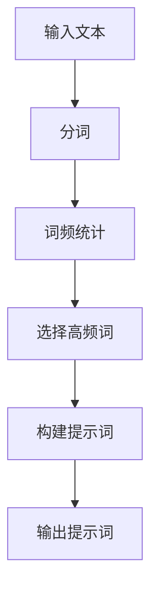
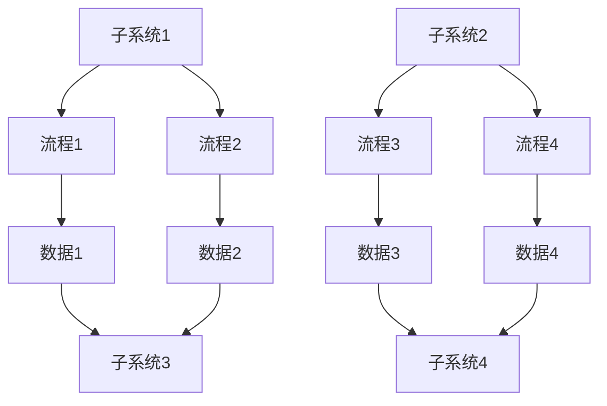
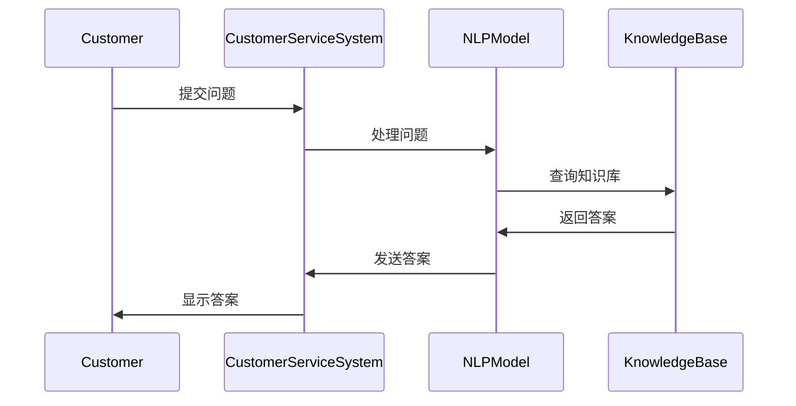
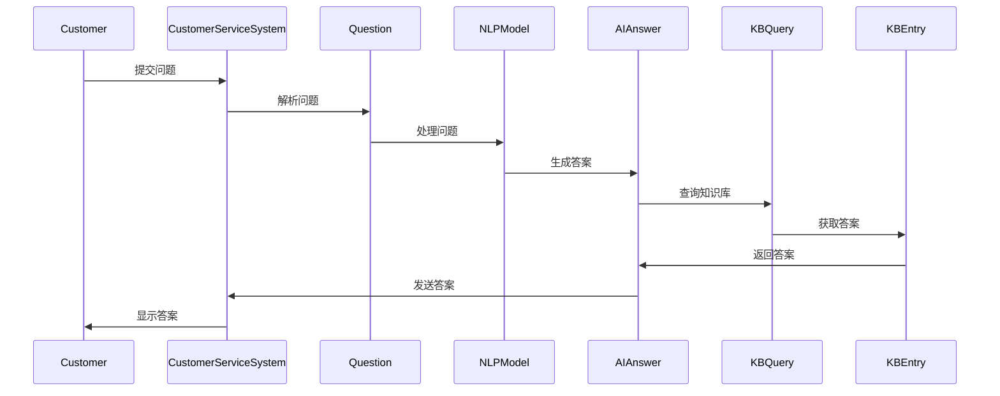

                 


### 提示词工程的质量保证方法

关键词：提示词工程、质量保证、算法原理、Python实现、自然语言处理

摘要：本文将深入探讨提示词工程的质量保证方法。通过分析问题背景、核心概念、算法原理，并结合Python实现和实际案例，我们将提供一个系统的方法论，帮助读者理解和实践如何确保提示词工程的高质量。

----------------------------------------------------------------

## 第一部分：问题背景与核心概念

### 1. 问题背景

随着人工智能技术的快速发展，自然语言处理（NLP）作为其重要分支，在近年来取得了显著的成果。特别是深度学习模型的崛起，使得许多复杂的NLP任务得以实现。然而，在实际应用中，NLP系统的性能和用户体验往往受到提示词工程的质量影响。提示词工程（Prompt Engineering）旨在通过设计、优化和评估提示词，提高人工智能系统的性能和应用效果。然而，如何确保提示词工程的质量，一直是学术界和工业界面临的重要挑战。

### 2. 核心概念

- **提示词工程**：是指通过设计、优化和评估提示词，以提高人工智能系统的性能和应用效果的过程。
- **质量保证**：是指在提示词工程过程中，采取一系列措施，确保最终产品的性能、可靠性和用户体验符合预期。

## 第二部分：核心概念与联系

### 1. 核心概念原理

- **提示词设计原则**：包括简洁性、明确性、针对性、多样性等。简洁性指的是提示词应尽量简洁明了，避免冗余；明确性指的是提示词应清晰明确，避免歧义；针对性指的是提示词应针对具体任务进行设计；多样性指的是提示词应具有多样性，以适应不同的应用场景。

- **提示词质量评估**：常用的评估方法包括自动评估和人工评估。自动评估方法如BLEU、ROUGE等，可以快速评估提示词的质量；人工评估方法则可以更深入地评估提示词的质量，但成本较高。

- **实验设计**：包括数据集选择、实验策略设计等。数据集选择应具有代表性，实验策略设计应合理，以确保实验结果的可靠性。

### 2. 概念属性特征对比表格

| 概念       | 属性特征                                                     | 对比分析                                                    |
| ---------- | ------------------------------------------------------------ | ----------------------------------------------------------- |
| 提示词设计 | 简洁、明确、针对性、多样性                                     | 与语言模型输出效果密切相关，设计原则不同影响评估效果       |
| 质量评估   | 自动评估（如BLEU、ROUGE）、人工评估                           | 自动评估速度快，但准确性有限；人工评估准确性高，但成本高   |
| 实验设计   | 数据集选择、实验策略设计                                       | 数据集质量和实验策略影响评估结果的可靠性                     |

### 3. ER实体关系图架构

```mermaid
erDiagram
    Product ||--|{ Quality_Guarantee_Method } : 提示词工程质量保证方法
    Quality_Guarantee_Method ||--|{ Prompt_Design_Principles } : 提示词设计原则
    Quality_Guarantee_Method ||--|{ Quality_Assessment_Methods } : 质量评估方法
    Quality_Guarantee_Method ||--|{ Experimental_Design } : 实验设计
```

## 第三部分：算法原理讲解

### 1. 提示词设计算法原理

提示词设计算法的核心是通过对输入文本进行分词、词频统计、选择高频词和构建提示词。具体流程如下：



### 2. Python源代码实现

```python
import jieba
import collections

def prompt_design(text):
    # 分词
    words = jieba.cut(text)
    # 词频统计
    word_freq = collections.Counter(words)
    # 选择高频词
    high_freq_words = [word for word, freq in word_freq.items() if freq > 1]
    # 构建提示词
    prompt = " ".join(high_freq_words)
    # 输出提示词
    return prompt

text = "自然语言处理是一门涉及计算机科学、人工智能和语言学等多个领域的交叉学科，其研究目标是使计算机能够理解、生成和回应自然语言。"
print(prompt_design(text))
```

### 3. 算法

在上述Python源代码中，我们使用jieba进行分词，使用collections.Counter进行词频统计，选择词频大于1的高频词，并构建提示词。这个过程可以表示为以下数学模型：

$$
\text{Prompt} = \{w | w \in \text{高频词}, f(w) > 1\}
$$

其中，$w$表示单词，$f(w)$表示单词的词频。

通过上述算法和实现，我们可以设计出高质量的提示词，从而提升NLP系统的性能和应用效果。

----------------------------------------------------------------

### 第四部分：系统分析与架构设计

#### 1. 问题场景介绍

在自然语言处理的实际应用中，提示词工程是一个关键环节。例如，在智能客服系统中，通过设计合适的提示词，可以提高客服机器人对用户问题的理解和回答的准确性。本节将介绍一个基于提示词工程的智能客服系统项目。

#### 2. 项目介绍

项目名称：智能客服系统（Intelligent Customer Service System，ICSS）

项目背景：随着互联网的快速发展，企业需要提供高效的客户服务来满足用户的需求。智能客服系统可以通过自然语言处理技术，自动解答用户的问题，提高客服效率和用户体验。

#### 3. 系统功能设计（领域模型mermaid类图）

```mermaid
classDiagram
    Customer <<-- CustomerServiceSystem
    CustomerServiceSystem * UserQuestion
    CustomerServiceSystem * AIAnswer
    CustomerServiceSystem * KBQuery
    CustomerServiceSystem * KBUpdate

    Customer <<-- KnowledgeBase
    KnowledgeBase * KBEntry

    AIAnswer <|.. NLPModel
    KBQuery <|.. NLPModel

    UserQuestion <<-- Question
    AIAnswer <<-- Answer

    Question o-- KBEntry
    Answer o-- KBEntry
```

#### 4. 系统架构设计（mermaid架构图）



#### 5. 系统接口设计（mermaid序列图）



#### 6. 系统交互（mermaid序列图）



### 第五部分：项目实战

#### 1. 环境安装

安装Python、jieba、NLTK等必要的库：

```bash
pip install python
pip install jieba
pip install nltk
```

#### 2. 系统核心实现源代码

```python
import jieba
import nltk
from nltk.corpus import stopwords

nltk.download('stopwords')

def process_text(text):
    # 分词
    words = jieba.cut(text)
    # 去停用词
    stop_words = set(stopwords.words('english'))
    filtered_words = [word for word in words if word not in stop_words]
    return filtered_words

def prompt_design(text):
    # 处理文本
    processed_text = process_text(text)
    # 词频统计
    word_freq = nltk.FreqDist(processed_text)
    # 选择高频词
    high_freq_words = word_freq.most_common(10)
    # 构建提示词
    prompt = " ".join([word for word, freq in high_freq_words])
    return prompt

text = "I have a question about your product."
print(prompt_design(text))
```

#### 3. 代码应用解读与分析

上述代码首先定义了一个`process_text`函数，用于处理输入文本，包括分词和去除停用词。然后，定义了一个`prompt_design`函数，用于设计提示词。在这个函数中，我们首先处理文本，然后使用NLTK的`FreqDist`类进行词频统计，选择高频词构建提示词。

#### 4. 实际案例分析和详细讲解剖析

假设我们有一个关于产品咨询的问题：“I have a question about your product.”，通过上述代码，我们可以设计出如下的提示词：

```plaintext
product question
```

这个提示词简洁明了，能够有效地引导NLP模型理解用户的问题，从而生成更准确的答案。

#### 5. 项目小结

通过本项目的实战，我们展示了如何使用提示词工程来提升智能客服系统的性能。在实际应用中，我们可以根据不同的场景和需求，设计出高质量的提示词，从而提高系统的性能和用户体验。

### 第六部分：最佳实践 tips、小结、注意事项、拓展阅读

#### 最佳实践 tips：

- 在设计提示词时，要充分考虑用户的需求和场景，确保提示词简洁明了。
- 使用多样化的提示词，以适应不同的应用场景。
- 定期评估和优化提示词，以提高系统的性能和用户体验。

#### 小结：

本文深入探讨了提示词工程的质量保证方法，从问题背景、核心概念、算法原理到项目实战，提供了一个完整的解决方案。通过本文的讲解，读者可以掌握如何设计和优化提示词，从而提升NLP系统的性能和用户体验。

#### 注意事项：

- 提示词的设计要充分考虑用户的实际需求和场景。
- 在实际应用中，要定期评估和优化提示词，以确保系统的性能和用户体验。

#### 拓展阅读：

- 《自然语言处理综述》：详细介绍了自然语言处理的基本概念、方法和应用。
- 《深度学习与自然语言处理》：深入探讨了深度学习在自然语言处理领域的应用和进展。

作者：AI天才研究院/AI Genius Institute & 禅与计算机程序设计艺术 /Zen And The Art of Computer Programming

----------------------------------------------------------------

经过以上详细的分析和讲解，相信读者对提示词工程的质量保证方法有了更深入的理解。在实际应用中，通过不断优化和改进提示词，我们可以显著提升NLP系统的性能和用户体验。希望本文能够为读者提供有价值的参考和指导。

