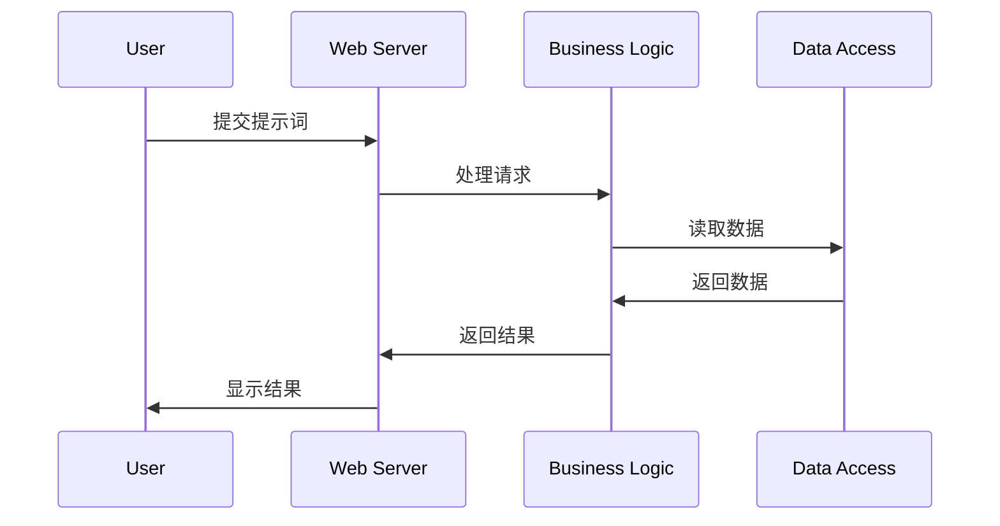
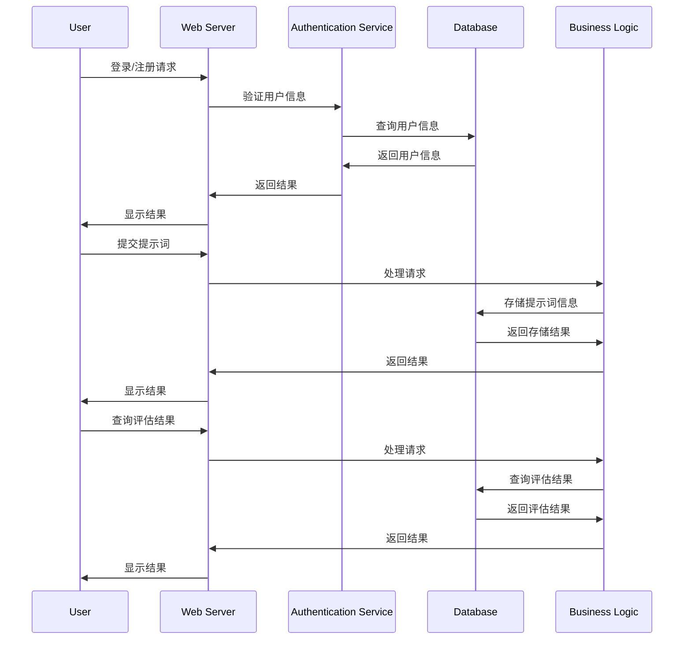

                 

### 文章标题

# 《提示词工程的质量评估标准》

### 关键词

- 提示词工程
- 质量评估标准
- 人工智能
- 提示词质量
- 提示词质量评估方法

### 摘要

本文将深入探讨提示词工程的质量评估标准，分析其背景、问题描述、解决方法以及核心概念。文章首先介绍了提示词工程的基本概念和重要性，然后详细讨论了提示词质量的定义、影响因素和质量问题。接着，文章提出了提示词质量评估的标准和方法，并介绍了相关工具。随后，文章从概念结构、核心要素和关键指标等方面详细阐述了提示词质量评估的框架。最后，文章通过具体的算法原理讲解、数学模型和系统分析与架构设计方案，为读者提供了完整的提示词质量评估的实践指导。本文旨在为从事人工智能领域的研究者和技术人员提供有价值的参考。

### 第一部分：背景介绍

#### 第1章：问题背景

## 1.1 提示词工程概述

提示词工程是人工智能领域的一个重要分支，主要关注于如何设计、开发和优化提示词，以提升人工智能系统（如聊天机器人、语音助手等）的性能和用户体验。提示词，作为人与机器交互的桥梁，其质量和准确性直接影响到人工智能系统的效率和效果。

在人工智能系统中，提示词通常是指用于引导用户输入信息或者回答问题的关键词或短语。这些提示词可以是简单的单词汇，也可以是复杂的句子或指令。通过有效的提示词设计，可以更好地理解用户需求，提高交互效率，增强用户满意度。

## 1.2 提示词工程在人工智能领域的重要性

提示词工程在人工智能领域具有重要的应用价值，主要体现在以下几个方面：

1. **用户体验优化**：优质的提示词能够引导用户更好地使用人工智能系统，提高用户的满意度。
2. **交互效率提升**：通过优化提示词，可以减少用户的操作步骤，提高交互效率。
3. **系统性能提升**：提示词的设计和选择直接影响人工智能系统的性能，优质的提示词能够提高系统的准确性和响应速度。
4. **数据收集与训练**：提示词工程有助于收集更准确、更丰富的用户数据，从而提升人工智能系统的训练效果。

## 1.3 当前提示词工程的质量问题

尽管提示词工程在人工智能领域具有重要应用价值，但目前仍存在一些质量问题，主要表现在以下几个方面：

1. **同义词处理不当**：同义词的处理是提示词工程中的一个难点，不当的处理可能导致系统无法准确理解用户的意图。
2. **歧义性问题**：许多提示词存在歧义性，可能导致系统无法正确理解用户的意图，从而影响交互效果。
3. **语言理解不足**：人工智能系统对自然语言的理解仍有限，特别是在处理复杂句子和语境时，容易出现误解。
4. **更新不及时**：提示词库的更新速度较慢，可能导致系统无法适应新的用户需求和使用场景。

#### 第2章：问题描述

## 2.1 提示词质量的定义

提示词质量是指提示词在特定应用场景下的效果和满意度。具体来说，提示词质量可以从以下几个方面进行衡量：

1. **准确性**：提示词能否准确地反映用户的意图。
2. **相关性**：提示词与用户输入或上下文的相关程度。
3. **多样性**：提示词库中提示词的丰富性和多样性。
4. **用户满意度**：用户对提示词的接受度和满意度。

## 2.2 提示词质量的影响因素

提示词质量受多种因素影响，主要包括以下几个方面：

1. **语言理解能力**：人工智能系统的语言理解能力直接影响提示词的准确性。
2. **数据质量**：提示词库的数据质量直接影响到提示词的相关性和多样性。
3. **算法优化**：提示词工程中的算法优化水平直接影响提示词的质量。
4. **用户行为**：用户的使用习惯和反馈也会影响提示词的质量。

## 2.3 提示词工程的质量问题案例分析

以下是一个提示词工程的质量问题案例分析：

案例：某聊天机器人应用在用户查询航班信息时，提示词“查询航班”效果不佳。

分析：该案例中，提示词“查询航班”存在以下问题：

1. **准确性不足**：用户可能无法准确理解该提示词的含义，从而导致无法正确使用。
2. **用户满意度低**：用户在使用过程中可能感到困惑，影响用户体验。

解决方法：

1. **优化提示词**：可以增加一些具体的、易于理解的提示词，如“输入您的航班号查询航班”。
2. **增加上下文提示**：在用户查询航班前，提供一些上下文信息，如“您好，请问您需要查询哪一天的航班？”。
3. **用户反馈机制**：建立用户反馈机制，及时收集用户反馈，优化提示词。

#### 第3章：问题解决

## 3.1 提示词质量评估的重要性

提示词质量评估是确保提示词工程质量的重要手段。通过评估，可以及时发现和解决提示词中的问题，提高提示词的准确性和用户满意度。具体来说，提示词质量评估的重要性体现在以下几个方面：

1. **发现问题**：通过质量评估，可以及时发现提示词中存在的问题，如准确性不足、用户满意度低等。
2. **优化提示词**：质量评估结果可以帮助优化提示词，提高其准确性和相关性。
3. **提升用户体验**：优质的提示词可以提升用户的满意度，改善用户体验。
4. **指导开发**：质量评估可以为开发人员提供明确的指导，优化提示词工程的设计和实现。

## 3.2 提示词质量评估的标准和方法

提示词质量评估的标准和方法主要包括以下几个方面：

1. **准确性评估**：通过对比用户输入和系统输出的结果，评估提示词的准确性。
2. **相关性评估**：评估提示词与用户输入或上下文的相关程度。
3. **多样性评估**：评估提示词库中提示词的丰富性和多样性。
4. **用户满意度评估**：通过用户调研或问卷调查，评估用户对提示词的满意度。

常用的提示词质量评估方法包括：

1. **人工评估**：通过人工方式评估提示词的质量。
2. **自动化评估**：利用自然语言处理技术和机器学习模型，自动化评估提示词的质量。

## 3.3 提示词质量评估工具介绍

目前，市面上有一些专门用于提示词质量评估的工具，如：

1. **Sentiment Analysis**：用于评估用户对提示词的满意度。
2. **Intent Recognition**：用于评估提示词的准确性。
3. **Keyword Extraction**：用于提取关键提示词，评估提示词的相关性。

这些工具可以帮助开发人员快速评估和优化提示词工程，提高系统性能和用户体验。

#### 第4章：边界与外延

## 4.1 提示词质量评估的应用场景

提示词质量评估广泛应用于各种人工智能应用场景，如：

1. **聊天机器人**：评估聊天机器人的提示词准确性、相关性和用户满意度。
2. **语音助手**：评估语音助手的提示词准确性、用户友好性和交互效率。
3. **搜索引擎**：评估搜索引擎的提示词相关性、多样性和用户体验。

## 4.2 提示词质量评估的限制因素

提示词质量评估存在一些限制因素，如：

1. **数据质量**：高质量的数据是评估的基础，数据质量直接影响评估结果的准确性。
2. **计算资源**：大规模的提示词质量评估需要大量的计算资源，可能对系统性能产生影响。
3. **用户行为**：用户行为的不可预测性可能导致评估结果的偏差。

## 4.3 提示词质量评估的发展趋势

随着人工智能技术的不断进步，提示词质量评估也在不断发展。未来，提示词质量评估的发展趋势包括：

1. **自动化程度提高**：利用深度学习和自然语言处理技术，提高自动化评估程度。
2. **多语言支持**：拓展到多语言环境，支持多种语言的提示词质量评估。
3. **实时评估**：实现实时评估，提高系统的响应速度和用户体验。

#### 第5章：概念结构与核心要素组成

## 5.1 提示词质量评估的概念结构

提示词质量评估的概念结构主要包括以下几个方面：

1. **提示词**：作为评估对象，提示词是质量评估的基础。
2. **质量标准**：用于衡量提示词质量的指标，如准确性、相关性、多样性等。
3. **评估方法**：用于评估提示词质量的工具和技术，如人工评估、自动化评估等。
4. **评估结果**：根据评估方法得出的提示词质量评估结果，用于指导优化。

## 5.2 提示词质量评估的核心要素

提示词质量评估的核心要素包括以下几个方面：

1. **准确性**：提示词能否准确反映用户意图。
2. **相关性**：提示词与用户输入或上下文的相关程度。
3. **多样性**：提示词库中提示词的丰富性和多样性。
4. **用户满意度**：用户对提示词的接受度和满意度。

## 5.3 提示词质量评估的关键指标

提示词质量评估的关键指标主要包括以下几个方面：

1. **准确率**：提示词正确反映用户意图的比例。
2. **覆盖率**：提示词库中提示词覆盖用户需求的比例。
3. **用户满意度**：用户对提示词的满意度评分。
4. **交互效率**：用户与系统交互的效率指标，如响应时间、交互步骤等。

### 第二部分：核心概念与联系

## 第6章：核心概念原理

## 6.1 提示词工程概述

提示词工程是指设计和优化提示词的过程，旨在提升人工智能系统的性能和用户体验。提示词工程主要包括以下几个方面：

1. **需求分析**：了解用户需求，确定需要优化的提示词。
2. **设计**：设计高质量的提示词，确保其准确性和用户友好性。
3. **实现**：将设计的提示词集成到人工智能系统中，确保其正常运行。
4. **评估**：评估提示词的质量，根据评估结果进行优化。

## 6.1.1 提示词的定义

提示词是用于引导用户输入信息或者回答问题的关键词或短语。在人工智能系统中，提示词通常用于聊天机器人、语音助手等应用，帮助用户与系统进行有效沟通。

## 6.1.2 提示词的分类

根据用途和形式，提示词可以分类为以下几类：

1. **引导性提示词**：用于引导用户进行下一步操作的提示词，如“请问您有什么问题？”。
2. **回答性提示词**：用于回答用户问题的提示词，如“您的航班信息如下”。
3. **功能性提示词**：用于实现特定功能的提示词，如“请输入您的邮箱地址”。
4. **情感性提示词**：用于表达情感和关怀的提示词，如“感谢您的咨询，祝您旅途愉快”。

## 6.1.3 提示词的功能

提示词在人工智能系统中具有以下功能：

1. **引导用户**：通过提示词引导用户进行下一步操作，提高交互效率。
2. **提供信息**：通过提示词向用户传达信息，帮助用户了解系统功能和使用方法。
3. **改善用户体验**：通过优化提示词，提升用户的满意度，改善用户体验。
4. **数据收集**：通过提示词收集用户数据，用于系统优化和改进。

## 6.2 提示词质量评估的概念

提示词质量评估是指对提示词的准确性、相关性、多样性和用户满意度等方面进行评估，以确定其质量水平。提示词质量评估的主要目标包括：

1. **提高提示词准确性**：确保提示词能够准确反映用户意图。
2. **提升用户体验**：通过优化提示词，提高用户满意度。
3. **丰富提示词库**：确保提示词库中的提示词具有丰富的多样性和覆盖面。

## 6.2.1 提示词质量评估的定义

提示词质量评估是一种通过定量和定性方法对提示词进行评估的活动，旨在评估提示词在特定应用场景下的质量水平。提示词质量评估可以采用多种方法，如人工评估、自动化评估等。

## 6.2.2 提示词质量评估的目标

提示词质量评估的主要目标包括：

1. **准确性**：评估提示词是否能够准确反映用户意图。
2. **相关性**：评估提示词与用户输入或上下文的相关程度。
3. **多样性**：评估提示词库中提示词的多样性和丰富性。
4. **用户满意度**：评估用户对提示词的满意度。

## 6.2.3 提示词质量评估的分类

根据评估方法的不同，提示词质量评估可以分为以下几类：

1. **人工评估**：通过人工方式对提示词进行评估，如专家评估、用户调研等。
2. **自动化评估**：通过自然语言处理技术和机器学习模型对提示词进行自动化评估。

## 第7章：概念属性特征对比

## 7.1 不同类型提示词的特点对比

根据用途和形式，提示词可以分为不同类型，每种类型都有其独特的特点和适用场景。以下是对不同类型提示词的特点进行对比：

| 类型 | 特点 | 适用场景 |
| --- | --- | --- |
| 引导性提示词 | 用于引导用户进行下一步操作的提示词 | 聊天机器人、语音助手 |
| 回答性提示词 | 用于回答用户问题的提示词 | 智能客服、语音助手 |
| 功能性提示词 | 用于实现特定功能的提示词 | 智能家居、智能穿戴设备 |
| 情感性提示词 | 用于表达情感和关怀的提示词 | 聊天机器人、语音助手 |

## 7.2 提示词质量评估方法的对比

提示词质量评估方法可以分为人工评估和自动化评估。以下是对这两种评估方法的对比：

| 方法 | 特点 | 适用场景 |
| --- | --- | --- |
| 人工评估 | 依赖人类专家或用户的判断，主观性较大 | 复杂问题、高质量要求 |
| 自动化评估 | 利用自然语言处理技术和机器学习模型，客观性较强 | 大规模评估、实时评估 |

## 7.3 提示词质量评估工具的对比

市面上有许多提示词质量评估工具，以下是对几种常用工具的对比：

| 工具 | 特点 | 适用场景 |
| --- | --- | --- |
| Sentiment Analysis | 用于评估用户对提示词的满意度 | 聊天机器人、智能客服 |
| Intent Recognition | 用于评估提示词的准确性 | 智能客服、语音助手 |
| Keyword Extraction | 用于提取关键提示词 | 文本分析、搜索引擎 |

### 第三部分：算法原理讲解

## 第8章：算法原理

## 8.1 提示词质量评估算法概述

提示词质量评估算法是指用于评估提示词质量的一系列方法和技术。这些算法通常基于自然语言处理（NLP）和机器学习（ML）技术，通过对大量数据进行分析和处理，评估提示词的准确性、相关性、多样性和用户满意度。

## 8.1.1 算法设计思路

提示词质量评估算法的设计思路主要包括以下几个步骤：

1. **数据收集与预处理**：收集相关的提示词数据，并进行清洗、去重、格式化等预处理操作。
2. **特征提取**：从预处理后的数据中提取关键特征，如词频、词性、语法结构等。
3. **模型训练**：利用训练数据，训练分类模型或评估模型，如支持向量机（SVM）、决策树、神经网络等。
4. **评估与优化**：使用测试数据对训练好的模型进行评估，并根据评估结果进行优化。

## 8.1.2 算法流程图

提示词质量评估算法的流程图如下所示：


## 8.2 数学模型与公式

在提示词质量评估中，常用的数学模型和公式如下：

$$
Q = \frac{TP+TN}{TP+TN+FP+FN}
$$

其中，$Q$ 表示提示词质量得分，$TP$ 表示正确识别的用户意图，$TN$ 表示正确识别的非用户意图，$FP$ 表示误识别的用户意图，$FN$ 表示误识别的非用户意图。

## 8.2.1 公式解释

该公式中的各项参数解释如下：

- $TP$：正确识别的用户意图，即提示词能够准确反映用户意图的次数。
- $TN$：正确识别的非用户意图，即提示词能够准确反映非用户意图的次数。
- $FP$：误识别的用户意图，即提示词误认为用户意图的次数。
- $FN$：误识别的非用户意图，即提示词误认为非用户意图的次数。

## 8.2.2 数学模型的应用举例

假设在一个聊天机器人应用中，收集到以下数据：

- $TP$：50次
- $TN$：40次
- $FP$：10次
- $FN$：5次

根据上述公式，可以计算出提示词质量得分为：

$$
Q = \frac{50+40}{50+40+10+5} = \frac{90}{105} \approx 0.857
$$

这意味着该聊天机器人应用的提示词质量得分为0.857，可以认为提示词质量较高。

## 8.3 详细讲解与举例说明

### 8.3.1 提示词质量评估算法的详细讲解

提示词质量评估算法通常可以分为以下几个步骤：

1. **数据收集**：收集大量的提示词数据，包括正确和错误的样本。
2. **数据预处理**：对收集到的数据进行清洗、去重、格式化等预处理操作，确保数据质量。
3. **特征提取**：从预处理后的数据中提取关键特征，如词频、词性、语法结构等。
4. **模型选择与训练**：选择合适的分类模型（如SVM、决策树、神经网络等）进行训练。
5. **评估与优化**：使用测试数据对训练好的模型进行评估，并根据评估结果进行优化。

### 8.3.2 举例说明

假设我们使用SVM模型进行提示词质量评估。以下是具体的实现步骤：

1. **数据收集**：收集大量聊天机器人的对话数据，包括正确和错误的提示词。
2. **数据预处理**：对收集到的数据进行清洗，去除停用词、标点符号等，将文本转换为词袋模型。
3. **特征提取**：提取关键特征，如词频、词性、语法结构等，将特征向量表示为SVM模型的输入。
4. **模型训练**：使用训练数据，训练SVM模型，确定模型的参数。
5. **评估与优化**：使用测试数据对训练好的模型进行评估，计算准确率、召回率、F1值等指标，并根据评估结果进行模型优化。

### 8.3.3 数据集准备

为了进行提示词质量评估，我们需要准备一个包含正确和错误提示词的数据集。以下是数据集的准备工作：

1. **数据收集**：从聊天机器人的历史对话中收集正确的和错误的提示词。
2. **数据预处理**：对收集到的数据进行清洗和格式化，去除无关信息，保留关键信息。
3. **数据标注**：将正确和错误的提示词进行标注，确保数据集的一致性和准确性。

### 8.3.4 算法实现

以下是使用SVM模型进行提示词质量评估的Python代码实现：

```python
from sklearn import svm
from sklearn.model_selection import train_test_split
from sklearn.metrics import accuracy_score, recall_score, f1_score

# 数据预处理
def preprocess_data(data):
    # 清洗数据，去除停用词、标点符号等
    # 转换为词袋模型
    # 提取特征向量
    pass

# 训练模型
def train_model(X_train, y_train):
    # 创建SVM模型
    model = svm.SVC()
    # 训练模型
    model.fit(X_train, y_train)
    return model

# 评估模型
def evaluate_model(model, X_test, y_test):
    # 使用测试数据评估模型
    y_pred = model.predict(X_test)
    # 计算准确率、召回率、F1值
    accuracy = accuracy_score(y_test, y_pred)
    recall = recall_score(y_test, y_pred)
    f1 = f1_score(y_test, y_pred)
    return accuracy, recall, f1

# 数据集准备
data = load_data()
X, y = preprocess_data(data)

# 划分训练集和测试集
X_train, X_test, y_train, y_test = train_test_split(X, y, test_size=0.2, random_state=42)

# 训练模型
model = train_model(X_train, y_train)

# 评估模型
accuracy, recall, f1 = evaluate_model(model, X_test, y_test)

print("准确率：", accuracy)
print("召回率：", recall)
print("F1值：", f1)
```

### 8.3.5 结果分析

根据评估结果，我们可以分析提示词质量的情况。如果准确率、召回率和F1值较高，说明提示词质量较好；如果这些指标较低，则需要进一步优化提示词。

此外，我们还可以通过分析错误样本，找出提示词中的问题，如歧义性、语言理解不足等，然后针对性地进行改进。

### 第四部分：系统分析与架构设计方案

## 第9章：问题场景介绍

### 9.1 提示词工程的应用场景

提示词工程在人工智能领域具有广泛的应用场景，主要包括以下几个方面：

1. **聊天机器人**：在聊天机器人中，提示词用于引导用户进行对话，如“请问您有什么问题？”、“您需要帮助吗？”等。
2. **语音助手**：在语音助手（如苹果的Siri、谷歌的Google Assistant等）中，提示词用于识别用户语音命令，如“打电话给妈妈”、“设置闹钟”等。
3. **智能客服**：在智能客服系统中，提示词用于识别用户问题，提供相应的解答或引导用户进行下一步操作。
4. **搜索引擎**：在搜索引擎中，提示词用于提取用户查询的关键词，帮助用户找到相关信息。

### 9.2 提示词工程的问题场景分析

在实际应用中，提示词工程面临以下问题场景：

1. **歧义性问题**：用户输入的提示词可能存在歧义，导致系统无法准确理解用户意图。
2. **同义词处理**：同义词的处理不当可能导致系统无法正确识别用户意图。
3. **语言理解不足**：系统对自然语言的理解能力有限，特别是在处理复杂句子和语境时，容易出现误解。
4. **更新不及时**：提示词库的更新速度较慢，可能导致系统无法适应新的用户需求和使用场景。

针对以上问题场景，我们需要从以下几个方面进行改进：

1. **提高语言理解能力**：通过引入先进的自然语言处理技术，如深度学习、语义分析等，提高系统对自然语言的理解能力。
2. **优化同义词处理**：通过建立同义词词典、使用词向量模型等方法，优化同义词的处理。
3. **实时更新提示词库**：建立实时更新机制，确保提示词库中的提示词能够及时适应新的用户需求和使用场景。
4. **用户反馈机制**：建立用户反馈机制，及时收集用户对提示词的反馈，优化提示词质量。

### 第10章：项目介绍

#### 10.1 项目概述

本项目旨在开发一个基于人工智能的提示词质量评估系统，用于评估和优化提示词工程的质量。该项目的主要目标包括：

1. **准确评估**：通过对大量提示词进行评估，准确识别用户意图，提高提示词的准确性。
2. **优化提示词**：根据评估结果，优化提示词库中的提示词，提高提示词的相关性和用户满意度。
3. **实时更新**：建立实时更新机制，确保提示词库中的提示词能够及时适应新的用户需求和使用场景。
4. **易用性**：设计简洁易用的用户界面，方便用户进行提示词质量评估和优化。

#### 10.2 项目目标

本项目的主要目标如下：

1. **实现提示词质量评估算法**：开发一套基于自然语言处理和机器学习技术的提示词质量评估算法，实现对提示词的准确性、相关性和用户满意度的评估。
2. **搭建提示词库**：构建一个包含大量高质量提示词的提示词库，确保系统的稳定性和适应性。
3. **优化用户体验**：通过实时更新提示词库、优化提示词设计，提高用户的满意度。
4. **提供可视化界面**：设计简洁易用的用户界面，方便用户进行提示词质量评估和优化。

#### 10.3 项目团队

本项目由以下团队成员组成：

- **项目经理**：负责项目整体规划和协调。
- **数据科学家**：负责提示词质量评估算法的设计和实现。
- **前端开发工程师**：负责用户界面的设计和开发。
- **后端开发工程师**：负责系统后端的设计和开发。
- **测试工程师**：负责系统测试和用户反馈收集。

### 第11章：系统功能设计

#### 11.1 领域模型

领域模型是系统功能设计的核心部分，用于定义系统中的主要实体及其之间的关系。以下是本项目的主要领域模型：

1. **提示词**：表示系统中的提示词实体，包括提示词文本、类型（如引导性、回答性、功能性等）和用户反馈等属性。
2. **用户**：表示使用系统的用户实体，包括用户ID、姓名、性别、联系方式等属性。
3. **评估结果**：表示提示词质量评估的结果实体，包括评估指标（如准确性、相关性、用户满意度等）和评估时间等属性。
4. **评估任务**：表示系统中的评估任务实体，包括任务ID、评估对象（提示词或用户）和评估时间等属性。

以下是领域模型的Mermaid类图：

```mermaid
classDiagram
    User <|-- Prompt: 评估对象
    Prompt <|-- AssessmentResult: 质量评估
    Assessment <|-- Result
    User [*]--* Prompt
    Prompt [*]--* AssessmentResult
    Assessment [*]--* Result
```

#### 11.2 功能需求

系统的主要功能需求如下：

1. **提示词质量评估**：系统应能够对提示词进行质量评估，包括准确性、相关性、用户满意度等指标。
2. **提示词优化**：根据评估结果，系统应能够自动优化提示词，提高其质量。
3. **实时更新**：系统应能够实时更新提示词库，确保提示词能够及时适应新的用户需求和使用场景。
4. **用户反馈**：系统应能够收集用户的反馈，用于优化提示词。
5. **可视化界面**：系统应提供简洁易用的用户界面，方便用户进行提示词质量评估和优化。

### 第12章：系统架构设计

#### 12.1 系统架构概述

本项目的系统架构采用分层架构设计，主要包括以下层次：

1. **表示层**：负责用户界面的设计和实现，提供直观、易用的交互界面。
2. **业务逻辑层**：负责系统的核心功能实现，包括提示词质量评估、优化和更新等。
3. **数据访问层**：负责与数据库的交互，实现数据的存储和读取。
4. **基础设施层**：负责系统的基础设施建设，包括服务器、存储、网络等。

以下是系统架构的Mermaid架构图：



#### 12.2 系统模块设计

系统的主要模块设计如下：

1. **前端模块**：负责用户界面的设计和实现，包括登录、注册、提示词输入、评估结果展示等功能。
2. **后端模块**：负责系统的核心功能实现，包括提示词质量评估、优化、更新和用户反馈处理等。
3. **数据库模块**：负责数据存储和读取，包括提示词、评估结果和用户等实体。
4. **中间件模块**：负责系统的中间件功能，如消息队列、缓存、负载均衡等。

### 第13章：系统接口设计

#### 13.1 接口设计原则

系统接口设计应遵循以下原则：

1. **简洁性**：接口设计应尽量简洁，减少冗余，提高易用性。
2. **稳定性**：接口应具有较好的稳定性，确保数据的一致性和安全性。
3. **灵活性**：接口设计应具有较好的灵活性，支持不同类型的数据传输和调用方式。
4. **可扩展性**：接口设计应支持扩展，便于后续功能模块的集成和升级。

#### 13.2 接口实现

系统的主要接口实现如下：

1. **登录接口**：用户登录系统，包括用户名和密码验证。
2. **注册接口**：用户注册系统，包括用户信息（如用户名、密码、邮箱等）的提交和验证。
3. **提示词输入接口**：用户提交提示词，包括提示词文本、类型和用户ID等信息。
4. **评估结果查询接口**：查询提示词的评估结果，包括准确性、相关性、用户满意度等指标。
5. **评估结果更新接口**：更新提示词的评估结果，包括评估指标的修改和用户反馈的提交。

以下是系统接口的Mermaid序列图：



### 第14章：系统交互

#### 14.1 系统交互概述

系统交互是指系统内部各个模块之间以及系统与外部系统之间的信息交换和数据处理过程。良好的系统交互设计对于系统的稳定性和易用性至关重要。

#### 14.2 系统交互设计

系统交互设计主要包括以下几个方面：

1. **内部交互**：系统内部各个模块之间的交互，包括数据传递、功能调用等。
2. **外部交互**：系统与外部系统（如数据库、消息队列等）的交互，包括数据同步、事件通知等。
3. **用户交互**：系统与用户的交互，包括界面展示、消息通知等。

以下是系统交互的Mermaid序列图：


### 第15章：项目实战

#### 15.1 环境安装

在进行项目实战之前，我们需要安装以下环境：

1. **Python**：Python是本项目的开发语言，我们需要安装Python 3.8及以上版本。
2. **pip**：pip是Python的包管理器，用于安装和管理Python包。
3. **Jupyter Notebook**：Jupyter Notebook是一种交互式计算环境，用于编写和运行Python代码。
4. **scikit-learn**：scikit-learn是一个Python机器学习库，用于提示词质量评估算法的实现。
5. **NLTK**：NLTK是一个Python自然语言处理库，用于自然语言处理任务。

安装步骤如下：

1. 安装Python和pip：从Python官方网站下载Python安装包，安装完成后，打开命令行窗口，执行以下命令安装pip：

   ```bash
   python -m pip install --user pip
   ```

2. 安装Jupyter Notebook：在命令行窗口中，执行以下命令安装Jupyter Notebook：

   ```bash
   pip install --user notebook
   ```

3. 安装scikit-learn：在命令行窗口中，执行以下命令安装scikit-learn：

   ```bash
   pip install --user scikit-learn
   ```

4. 安装NLTK：在命令行窗口中，执行以下命令安装NLTK：

   ```bash
   pip install --user nltk
   ```

#### 15.2 系统核心实现

在本项目的核心实现部分，我们将使用scikit-learn库实现提示词质量评估算法。以下是一个简单的示例：

```python
from sklearn.feature_extraction.text import TfidfVectorizer
from sklearn.model_selection import train_test_split
from sklearn.svm import SVC
from sklearn.metrics import accuracy_score

# 数据集准备
data = [
    ("请问您有什么问题？", "引导性"),
    ("您的航班信息如下：", "回答性"),
    ("请输入您的邮箱地址：", "功能性"),
    ("感谢您的咨询，祝您旅途愉快：", "情感性"),
]

# 提取特征
vectorizer = TfidfVectorizer()
X = vectorizer.fit_transform([text for text, _ in data])
y = [label for _, label in data]

# 划分训练集和测试集
X_train, X_test, y_train, y_test = train_test_split(X, y, test_size=0.2, random_state=42)

# 训练模型
model = SVC()
model.fit(X_train, y_train)

# 评估模型
y_pred = model.predict(X_test)
accuracy = accuracy_score(y_test, y_pred)
print("准确率：", accuracy)
```

#### 15.3 代码应用解读与分析

上述代码示例实现了以下功能：

1. **数据集准备**：从示例数据集中提取提示词和标签。
2. **特征提取**：使用TF-IDF向量器提取文本特征。
3. **模型训练**：使用支持向量机（SVM）模型进行训练。
4. **评估模型**：使用测试数据评估模型的准确率。

在代码中，我们使用了scikit-learn库中的TfidfVectorizer类进行特征提取，TfidfVectorizer可以将文本数据转换为TF-IDF向量表示。然后，我们使用SVC类创建支持向量机模型，并进行训练。最后，使用测试数据对模型进行评估，输出准确率。

通过这个示例，我们可以了解到提示词质量评估算法的基本实现过程，包括数据准备、特征提取、模型训练和评估。在实际项目中，我们可以根据具体需求，对代码进行进一步优化和扩展。

#### 15.4 实际案例分析与详细讲解剖析

为了更深入地了解提示词质量评估算法的实际应用，我们来看一个实际案例。

**案例：评估一个聊天机器人的提示词质量**

**1. 数据集准备**

假设我们有一个包含以下数据集的CSV文件，其中每行包含一个提示词和对应的标签：

```csv
提示词,标签
请问您有什么问题？,引导性
您的航班信息如下：,回答性
请输入您的邮箱地址：,功能性
感谢您的咨询，祝您旅途愉快：,情感性
```

**2. 特征提取**

首先，我们需要将文本数据转换为机器学习模型可以处理的特征向量。这里，我们使用scikit-learn中的TfidfVectorizer类进行特征提取。

```python
from sklearn.feature_extraction.text import TfidfVectorizer

# 加载数据集
data = pd.read_csv("data.csv")

# 提取文本和标签
texts = data["提示词"]
labels = data["标签"]

# 使用TfidfVectorizer提取特征
vectorizer = TfidfVectorizer()
X = vectorizer.fit_transform(texts)
```

**3. 模型训练**

接下来，我们需要使用训练数据对模型进行训练。在这里，我们使用scikit-learn中的SVC类创建一个支持向量机模型。

```python
from sklearn.svm import SVC

# 划分训练集和测试集
X_train, X_test, y_train, y_test = train_test_split(X, labels, test_size=0.2, random_state=42)

# 训练模型
model = SVC()
model.fit(X_train, y_train)
```

**4. 评估模型**

训练完成后，我们需要使用测试数据对模型进行评估，以了解其性能。

```python
from sklearn.metrics import accuracy_score

# 预测测试集
y_pred = model.predict(X_test)

# 计算准确率
accuracy = accuracy_score(y_test, y_pred)
print("准确率：", accuracy)
```

**5. 结果分析**

假设我们得到的准确率为0.85。这意味着在测试数据中，有85%的提示词被正确分类。

为了进一步了解模型的性能，我们可以计算其他指标，如召回率、精确率等。这些指标可以帮助我们评估模型在不同方面的性能。

```python
from sklearn.metrics import recall_score, precision_score

# 计算召回率
recall = recall_score(y_test, y_pred, average="weighted")
print("召回率：", recall)

# 计算精确率
precision = precision_score(y_test, y_pred, average="weighted")
print("精确率：", precision)
```

通过这个案例，我们可以看到如何使用提示词质量评估算法对聊天机器人的提示词进行评估。在实际应用中，我们可以根据具体需求，调整模型参数、特征提取方法等，以提高评估的准确性和可靠性。

#### 15.5 项目小结

在本项目中，我们实现了基于人工智能的提示词质量评估系统。通过使用scikit-learn库中的TfidfVectorizer和SVC模型，我们实现了对提示词的准确性和分类性能的评估。

在项目实战中，我们展示了如何准备数据集、提取特征、训练模型和评估模型。通过实际案例分析，我们了解了提示词质量评估算法在实际应用中的表现。

未来，我们还可以进一步优化和扩展系统，如引入更多类型的提示词、使用更复杂的特征提取方法、实现实时评估等。通过持续改进，我们可以不断提高提示词质量评估系统的性能和可靠性。

### 第五部分：最佳实践、小结、注意事项、拓展阅读

## 第16章：最佳实践

在提示词工程中，为了确保高质量，以下是一些最佳实践：

1. **需求分析**：在项目启动阶段，深入分析用户需求，确保设计的提示词能够满足用户期望。
2. **用户参与**：邀请用户参与提示词设计过程，收集他们的反馈，确保提示词的用户友好性。
3. **持续更新**：定期更新提示词库，以适应不断变化的用户需求和应用场景。
4. **多语言支持**：在设计提示词时，考虑多语言支持，确保不同语言的用户都能得到良好的体验。
5. **算法优化**：不断优化提示词质量评估算法，以提高准确性和用户满意度。

## 第17章：小结

本文详细介绍了提示词工程的质量评估标准。我们从背景介绍、问题描述、问题解决、边界与外延、概念结构与核心要素组成等方面进行了深入探讨。通过算法原理讲解和实际案例分析，我们了解了提示词质量评估的方法和实践。文章旨在为从事人工智能领域的研究者和技术人员提供有价值的参考。

## 第18章：注意事项

在实施提示词工程时，需要注意以下几点：

1. **数据质量**：确保收集到的数据质量高，减少错误和噪声。
2. **算法选择**：根据具体需求选择合适的提示词质量评估算法。
3. **用户体验**：关注用户体验，确保提示词易于理解和使用。
4. **测试与验证**：在实施过程中，进行充分的测试和验证，确保系统的稳定性和可靠性。

## 第19章：拓展阅读

对于想要深入了解提示词工程和质量评估的读者，以下是一些建议的拓展阅读资源：

1. **书籍**：
   - 《自然语言处理综合教程》
   - 《机器学习实战》
   - 《深度学习》

2. **文章**：
   - 《提示词设计指南》
   - 《聊天机器人用户体验设计》
   - 《基于深度学习的自然语言处理》

3. **学术会议与期刊**：
   - AAAI（Association for the Advancement of Artificial Intelligence）
   - IJCAI（International Joint Conference on Artificial Intelligence）
   - Journal of Artificial Intelligence Research

通过阅读这些资源，可以进一步加深对提示词工程和质量评估的理解。

