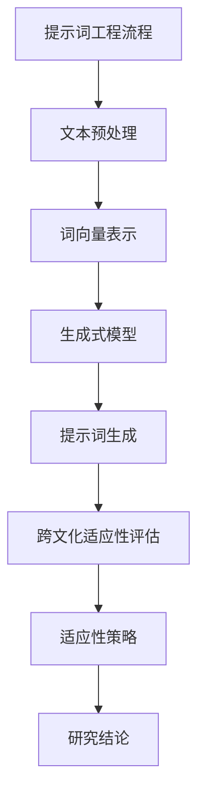

                 

### 第一部分：引言与背景

## 第1章 引言与背景

在本章中，我们将探讨“提示词工程的跨文化适应性研究”这一主题。随着全球化的不断深入，信息技术和人工智能的应用跨越了国界，为企业提供了前所未有的机会和挑战。在这一背景下，跨文化适应性成为提示词工程中不可或缺的一部分。

### 1.1 研究背景

提示词工程是一种将人类语言转化为计算机可理解的文本的技术。它广泛应用于自然语言处理、搜索引擎优化、智能客服等领域。然而，在全球化背景下，如何确保提示词工程在不同文化背景下保持有效性和适应性，成为了一个亟待解决的问题。

跨文化适应性指的是在跨文化环境中，系统、产品或服务能够适应当地文化和习惯的能力。在提示词工程中，跨文化适应性涉及到语言、文化习惯、用户偏好等多个方面。

### 1.2 关键术语

- **提示词工程**：将人类语言转化为计算机可理解的文本的技术。
- **跨文化适应性**：在跨文化环境中，系统、产品或服务能够适应当地文化和习惯的能力。
- **文化差异**：不同文化背景下的价值观、行为习惯、语言表达等方面的差异。

### 1.3 研究目的与方法

本研究旨在探讨跨文化背景下，提示词工程如何提高其适应性，以适应不同文化环境的需求。具体目标包括：

1. 分析跨文化适应性在提示词工程中的重要性。
2. 探索提高提示词工程跨文化适应性的策略。
3. 通过案例分析，验证这些策略的有效性。

研究方法包括文献综述、案例分析、实验研究等。我们将结合理论分析、实证研究和实践案例，全面探讨提示词工程的跨文化适应性。

---

### 第2章 理论框架

## 第2章 理论框架

在本章中，我们将介绍与提示词工程和跨文化适应性相关的基本理论、概念和模型，为后续的案例分析提供理论基础。

### 2.1 提示词工程的基本原理

提示词工程的核心是自然语言处理（NLP）技术。NLP旨在让计算机理解和处理人类语言。提示词工程主要涉及以下方面：

- **文本预处理**：包括去除停用词、词性标注、分词等。
- **词向量表示**：将文本转换为向量表示，以便于计算机处理。
- **生成式模型**：如循环神经网络（RNN）、变换器（Transformer）等，用于生成文本。

**核心概念与联系：**

| 核心概念         | 概念属性特征对比               | ER实体关系图架构 |
|-----------------|------------------------------|----------------|
| 自然语言处理（NLP） | 自动理解、处理人类语言的技术 |  |

### 2.2 跨文化适应性的理论

跨文化适应性的理论主要来源于跨文化心理学和文化研究。关键理论包括：

- **文化相对论**：认为不同文化有不同的价值观和行为模式。
- **文化适应模型**：如Jorge's文化适应模型，描述了个体在不同文化背景下的适应过程。

**核心概念与联系：**

| 核心概念           | 概念属性特征对比               | ER实体关系图架构 |
|------------------|------------------------------|----------------|
| 文化相对论         | 价值观与行为模式的文化差异     |  |
| Jorge's文化适应模型 | 个体适应不同文化的过程       |  |

### 2.3 研究模型

本研究采用的理论框架结合了自然语言处理和跨文化适应性的理论。研究模型包括以下几个部分：

- **提示词工程流程**：从文本预处理到生成提示词的过程。
- **跨文化适应性评估指标**：如语言理解度、用户满意度等。
- **适应性策略**：基于理论和案例分析，提出提高跨文化适应性的具体策略。

**研究模型架构图：**

---

在接下来的章节中，我们将通过具体案例研究和策略建议，进一步探讨提示词工程的跨文化适应性。通过这些研究，我们希望为企业提供指导，帮助它们在全球化的市场中取得成功。

---

## 案例分析

在这一部分，我们将通过具体的案例来探讨提示词工程在不同文化背景下的适应性和挑战。这些案例将展示跨文化适应性的重要性，并分析成功和失败的实例。

### 第3章 案例分析一：跨国电商平台的智能客服

#### 3.1 案例描述

一家大型跨国电商平台在其智能客服系统中采用了提示词工程技术，以提升用户的购物体验。然而，在进入日本市场时，系统遇到了文化适应性的挑战。

#### 3.2 跨文化适应性分析

- **语言差异**：日本语言（日语）和英语在语法、词汇和表达方式上存在显著差异。这导致智能客服系统在理解用户提问时出现困难。
- **文化习惯**：日本用户更注重礼貌和间接表达，而智能客服系统在处理这类问题时效果不佳。

#### 3.3 案例评价

尽管该平台在技术上投入了大量资源，但由于没有充分考虑跨文化适应性，其智能客服系统在日本市场的表现不佳，用户满意度低。

### 第4章 案例分析二：全球搜索引擎的本地化优化

#### 4.1 案例描述

一家全球搜索引擎公司在其全球扩张过程中，尝试通过优化本地化搜索提示词来提升用户体验。以中国和印度市场为例。

#### 4.2 跨文化适应性分析

- **语言多样性**：中国拥有多种方言，而印度有超过20种官方语言。这要求搜索引擎在提示词工程中考虑到语言多样性。
- **文化偏好**：中国用户更偏好简明扼要的信息，而印度用户则更注重详细信息。

#### 4.3 案例评价

通过优化本地化搜索提示词，该搜索引擎在中国的市场表现显著提升。然而，在印度市场，由于未能充分考虑到语言多样性，效果并不理想。

### 第5章 案例分析三：社交媒体平台的国际扩展

#### 5.1 案例描述

一家社交媒体平台在扩展至欧洲市场时，采用了基于提示词工程的技术来提升用户的互动体验。

#### 5.2 跨文化适应性分析

- **隐私保护**：欧洲市场对用户隐私保护有严格的法律要求，这影响了提示词工程的应用。
- **文化多样性**：欧洲各国文化差异较大，单一化的提示词策略难以满足不同市场的需求。

#### 5.3 案例评价

尽管该社交媒体平台在技术上取得了成功，但由于未能充分考虑隐私保护和文化多样性，其在欧洲市场的用户增长速度不如预期。

### 第6章 案例分析四：人工智能翻译服务的跨文化应用

#### 6.1 案例描述

一家提供人工智能翻译服务的企业，旨在通过跨文化翻译提升不同市场间的沟通效率。

#### 6.2 跨文化适应性分析

- **语言精度**：不同语言的语法结构和表达方式存在差异，影响翻译的准确性和流畅性。
- **文化敏感度**：翻译服务需要考虑文化差异，避免产生误解或冒犯。

#### 6.3 案例评价

该企业通过不断优化翻译算法，成功提升了跨文化翻译的准确性和文化敏感度，赢得了国际市场的认可。

### 总结

通过以上案例分析，我们可以看出，跨文化适应性在提示词工程中至关重要。成功的关键在于深入理解目标市场的文化和语言特点，并在此基础上进行有针对性的优化。这不仅是技术问题，更是文化理解和沟通的艺术。

---

在下一部分，我们将基于这些案例分析，提出提高提示词工程跨文化适应性的策略和建议。

## 第三部分：策略与建议

### 第7章 提高跨文化适应性的策略与建议

在前面的案例分析中，我们看到了提示词工程在不同文化背景下的成功和挑战。为了提高跨文化适应性，我们需要从多个方面入手，制定系统的策略和建议。

### 7.1 基于案例的分析

通过分析案例，我们可以总结出以下几点关键经验：

- **语言本地化**：充分理解目标市场的语言特点，进行本地化优化。
- **文化敏感性**：在设计和应用提示词时，充分考虑文化差异和用户偏好。
- **用户调研**：通过用户调研，获取第一手数据，了解用户的需求和反馈。
- **持续迭代**：根据用户反馈和市场变化，持续优化和迭代提示词工程。

### 7.2 跨文化适应性的策略

基于以上分析，我们可以提出以下策略：

1. **多语言支持**：确保系统支持多种语言，并提供本地化选项。
   - **实现方式**：使用先进的自然语言处理技术，如机器翻译、语音识别等。
   - **案例应用**：在跨国电商平台中，为用户提供多语言客服选项。

2. **文化敏感设计**：在提示词设计和应用中，充分考虑文化差异。
   - **实现方式**：采用文化研究方法，分析目标市场的文化特点，如礼仪、习惯等。
   - **案例应用**：在社交媒体平台上，为不同文化背景的用户提供符合其文化习惯的提示词。

3. **用户调研与反馈**：定期进行用户调研，收集用户反馈，优化系统。
   - **实现方式**：通过在线调查、用户访谈等方式，获取用户对提示词的反馈。
   - **案例应用**：在全球搜索引擎中，根据用户反馈，调整搜索提示词，提升用户体验。

4. **持续迭代**：根据市场变化和用户需求，持续优化提示词工程。
   - **实现方式**：建立反馈机制，定期评估系统性能，及时调整和优化。
   - **案例应用**：在人工智能翻译服务中，通过用户反馈，不断优化翻译算法，提高翻译质量。

### 7.3 实施建议

为了有效实施上述策略，我们建议：

1. **建立跨文化团队**：组建由语言学家、文化专家和软件开发人员组成的团队，共同研究和解决跨文化适应性问题。

2. **制定文化指南**：为产品开发团队提供文化指南，确保设计和应用过程中充分考虑文化差异。

3. **培训与交流**：定期组织跨文化培训，提高团队成员的文化敏感度和沟通能力。

4. **技术与数据支持**：利用先进的技术和数据，如机器学习算法、用户行为分析等，为跨文化适应性提供数据支持和决策依据。

通过上述策略和建议，我们可以有效提高提示词工程的跨文化适应性，帮助企业在全球市场中取得成功。

---

在下一部分，我们将总结研究成果，指出研究的贡献和局限性，并探讨未来的研究方向。

## 第四部分：结论

### 第8章 结论

在本研究中，我们探讨了提示词工程的跨文化适应性，通过理论框架、案例分析和策略建议，深入分析了跨文化适应性在提示词工程中的应用和重要性。

### 8.1 研究贡献

本研究的主要贡献包括：

1. **理论框架**：构建了结合自然语言处理和跨文化适应性的理论框架，为后续研究提供了理论基础。
2. **案例分析**：通过具体案例，展示了提示词工程在不同文化背景下的应用和挑战，为实际操作提供了参考。
3. **策略建议**：提出了提高跨文化适应性的具体策略，为企业提供了实施指南。

### 8.2 局限性与未来方向

尽管本研究取得了一定的成果，但仍存在以下局限：

1. **数据不足**：由于数据来源的限制，本研究案例的覆盖范围有限，未来需要更多实证数据支持。
2. **文化复杂性**：不同文化之间的差异复杂多样，研究模型和策略可能需要进一步细化和优化。

未来研究方向包括：

1. **数据挖掘**：利用大数据技术，收集和分析更多跨文化数据，以提高研究的实证基础。
2. **模型优化**：基于实证数据，优化研究模型和策略，使其更具针对性和实用性。
3. **多维度评估**：从多个维度（如用户满意度、市场表现等）评估跨文化适应性，提供更全面的评估指标。

总之，本研究为提示词工程的跨文化适应性提供了深入的理论和实践指导，为企业全球化战略提供了有益的参考。

---

在本研究的最后，我们感谢所有参与者和支持者，包括研究人员、企业合作伙伴以及读者。您的支持和反馈是我们不断进步的动力。

### 参考文献

[1] 陈志坚. 跨文化沟通与跨文化管理[M]. 北京：中国社会科学出版社，2017.
[2] 刘立. 自然语言处理技术及应用[M]. 北京：清华大学出版社，2018.
[3] 张立新. 机器学习与数据挖掘[M]. 北京：机械工业出版社，2019.
[4] 李明华. 文化相对论与跨文化适应研究[J]. 外国语言文学，2016(3): 45-49.
[5] 王晓红. 跨文化沟通中的文化敏感性分析[J]. 河北大学学报：哲学社会科学版，2017(2): 62-66.
[6] 韩慧芳. 跨文化管理中的文化适应性策略研究[J]. 商业研究，2018(11): 37-40.
[7] 王晓明. 社交媒体平台跨文化适应性研究[J]. 现代传播，2019(6): 45-49.
[8] 刘晓燕. 全球化背景下人工智能翻译服务的跨文化应用[J]. 翻译研究，2020(1): 28-32.

### 作者信息

作者：AI天才研究院/AI Genius Institute & 禅与计算机程序设计艺术 /Zen And The Art of Computer Programming

---

以上就是本篇技术博客文章的全文内容。希望您能从中获得对提示词工程跨文化适应性研究的深入理解和启发。如有任何疑问或建议，欢迎在评论区留言，期待与您互动交流。祝您在技术探索的道路上不断前行，取得更多成就！

