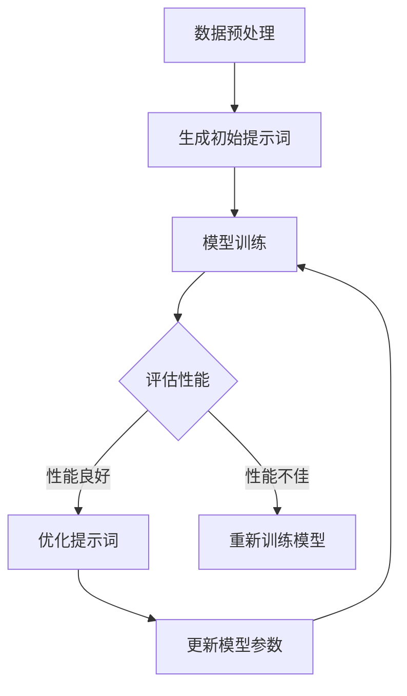
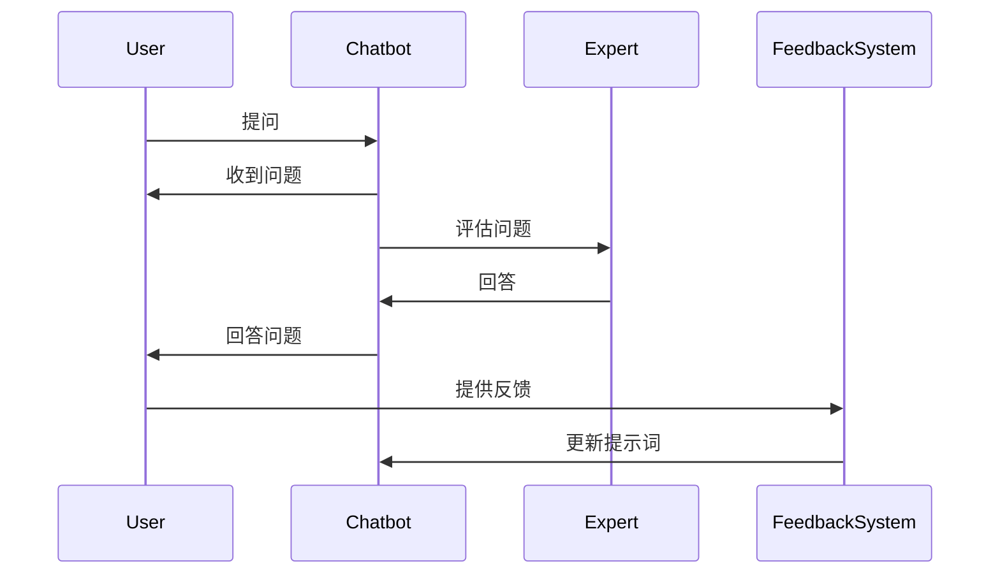

                 

## 引言与背景

### 1.1 书籍主题与目标

《提示词工程：AI与人类协作的新范式》旨在探讨如何通过提示词工程实现人工智能（AI）与人类的深度协作，从而开创出一个新的技术范式。本书的核心目标是阐述提示词工程的基本概念、原理和实现方法，并通过具体的案例展示其在实际应用中的价值。

### 1.2 提示词工程的概念与重要性

提示词工程是一种旨在通过人类与AI系统互动，优化AI模型性能的方法。它通过精心设计的提示词，引导AI系统进行更精准的学习和推理，从而提高模型的准确性和效率。提示词工程的重要性体现在以下几个方面：

1. **提高模型性能**：通过提示词的优化，可以使AI模型在学习过程中更快速地收敛到最优解，减少训练时间和计算成本。
2. **增强模型解释性**：提示词有助于提升模型的解释性，使得AI的决策过程更加透明和可理解，便于人类与AI系统的协作。
3. **实现个性化服务**：通过提示词的个性化设计，AI系统能够更好地满足不同用户的需求，提供更加精准的服务。

### 1.3 AI与人类协作的现状与挑战

当前，AI与人类协作正在迅速发展，但仍然面临着一些挑战：

1. **模型可解释性不足**：许多AI模型，尤其是深度学习模型，其内部决策过程非常复杂，难以解释。这限制了人类对AI系统的信任和协作意愿。
2. **数据隐私和安全**：在AI与人类协作的过程中，涉及大量的数据交换和处理，这带来了数据隐私和安全问题。
3. **跨领域协作的障碍**：不同领域的AI系统和人类专家之间的协作存在较大的技术和认知障碍。

### 1.4 书籍结构安排与读者定位

本书共分为七个部分，内容结构如下：

- **第一部分**：引言与背景，介绍书籍的主题、目标、提示词工程的概念及其重要性。
- **第二部分**：核心概念与原理，讲解AI基础知识、提示词工程的基本概念和AI与人类协作的机制。
- **第三部分**：算法原理讲解，详细介绍常见的AI算法及其适用场景，并通过Python代码实现和数学模型讲解深入剖析。
- **第四部分**：数学模型和数学公式讲解，对核心数学模型和公式进行详细解释，并通过示例进行说明。
- **第五部分**：系统分析与架构设计方案，介绍系统设计与实现的方法，包括领域模型、系统架构、接口设计等。
- **第六部分**：项目实战，通过具体项目展示提示词工程的应用，包括环境安装、核心代码实现和项目分析。
- **第七部分**：最佳实践、小结和拓展阅读，总结本书的关键知识点，提供实用建议和进一步阅读的推荐。

本书适合对AI和提示词工程感兴趣的程序员、数据科学家、软件工程师以及AI领域的研究人员阅读。同时，也为对AI与人类协作感兴趣的管理者和决策者提供了有价值的参考。

### 1.5 本章小结

本章介绍了书籍的主题与目标，对提示词工程的概念进行了详细解释，并分析了AI与人类协作的现状与挑战。通过本书的结构安排，读者可以了解到提示词工程在AI与人类协作中的重要性和应用前景。接下来的章节将进一步深入探讨提示词工程的核心概念、原理和实现方法。

## 背景介绍

### 2.1 人工智能的发展历程

人工智能（AI）是一门涉及计算机科学、心理学、认知科学和数学等多个领域的交叉学科。自20世纪50年代以来，人工智能经历了几个重要的发展阶段。

**早期探索阶段（1950-1969年）**：
1950年，艾伦·图灵提出了“图灵测试”，这是对人工智能存在性的一种早期思考。1956年，达特茅斯会议上，人工智能首次作为一个研究领域被提出。这个阶段主要集中在理论探讨和基础算法的研究上，如逻辑推理、知识表示等。

**理论建立阶段（1970-1989年）**：
这一阶段，人工智能开始逐渐从理论研究走向实际应用。专家系统和知识工程成为研究热点，通过模拟专家的决策过程来解决复杂问题。然而，由于数据匮乏和算法局限性，这一阶段的AI项目在实践中遇到了诸多挑战。

**技术突破阶段（1990-2009年）**：
1997年，IBM的“深蓝”击败了世界围棋冠军，标志着人工智能在特定领域的强大能力。这一阶段，机器学习和神经网络技术得到了快速发展，特别是在语音识别、图像处理和自然语言处理等领域。

**应用深化阶段（2010年至今）**：
近年来，随着计算能力的提升和大数据技术的发展，人工智能进入了应用深化阶段。深度学习和强化学习等新技术的出现，使得AI在自动驾驶、医疗诊断、金融分析等多个领域取得了突破性进展。

### 2.2 提示词工程的发展现状

提示词工程作为AI与人类协作的一个重要分支，近年来也得到了快速发展。以下是对提示词工程当前发展现状的概述：

**研究进展**：
- **理论研究**：许多研究集中在提示词的设计、生成和优化方法上。例如，基于强化学习、迁移学习和元学习的提示词优化方法得到了广泛关注。
- **应用实践**：提示词工程在自然语言处理、计算机视觉、语音识别等领域得到了广泛应用。例如，在问答系统中，通过精心设计的提示词可以显著提高问答的准确性和用户体验。

**主要挑战**：
- **提示词质量**：如何设计高质量的提示词仍然是一个挑战。提示词需要既能引导AI系统进行有效学习，又能适应不同场景和用户需求。
- **人机协作**：如何实现人类与AI系统的有效协作，使得AI系统能够更好地理解和执行人类的意图，是一个需要深入探讨的问题。

**发展趋势**：
- **跨领域融合**：随着AI技术的不断进步，提示词工程将与其他领域（如心理学、教育学等）融合，形成更加综合和多元化的研究体系。
- **个性化服务**：通过个性化提示词设计，AI系统能够提供更加定制化和精准的服务，满足不同用户的需求。

### 2.3 AI与人类协作的理论基础

AI与人类协作的理论基础主要来源于多学科交叉的研究成果，包括认知科学、人机交互、心理学和社会学等。

**认知科学**：认知科学关注人类思维和决策过程，为AI系统如何模拟人类思维提供了理论基础。通过理解人类的认知机制，AI系统能够更好地模拟和辅助人类的决策过程。

**人机交互**：人机交互（HCI）研究如何设计用户界面，使得人类能够更方便地与AI系统进行交互。人机交互理论为AI系统提供了用户友好的接口，增强了人类对AI系统的信任和使用意愿。

**心理学**：心理学研究人类的情感、动机和行为，对于理解人类如何与AI系统互动具有重要意义。例如，通过心理学研究，可以设计出更能激发用户参与感和满意度的提示词。

**社会学**：社会学关注社会结构和人类行为，探讨了人类在社会环境中的互动和协作机制。这些理论为AI系统在社会环境中的协作提供了指导。

### 2.4 提示词工程的应用领域

提示词工程在多个领域展现出了其独特的价值，以下是一些主要的应用领域：

**自然语言处理（NLP）**：
- **问答系统**：通过设计高质量的提示词，问答系统能够更准确地理解和回答用户的问题，提供更智能的服务。
- **文本分类与情感分析**：提示词可以引导模型更好地捕捉文本中的关键信息，从而提高分类和情感分析的准确率。

**计算机视觉**：
- **图像识别与标注**：提示词可以帮助AI模型更准确地识别图像中的对象，提高图像标注的效率和质量。
- **视频分析**：通过设计合适的提示词，视频分析系统能够更好地识别和追踪视频中的动态对象。

**语音识别**：
- **语音合成与识别**：提示词可以引导模型更好地捕捉语音信号中的关键特征，提高语音合成和识别的准确性。
- **语音助手**：通过个性化的提示词，语音助手能够更好地理解和执行用户的语音指令。

**金融分析**：
- **风险管理**：通过提示词，AI系统能够更准确地识别和评估金融市场的风险，为投资决策提供支持。
- **客户服务**：提示词可以优化金融客户服务的交互体验，提高客户满意度。

**医疗诊断**：
- **疾病预测与诊断**：通过设计合适的提示词，AI系统能够更准确地分析医学数据，辅助医生进行疾病预测和诊断。
- **患者管理**：提示词可以帮助AI系统更好地理解患者的病史和症状，提供个性化的健康管理建议。

### 2.5 本章小结

本章介绍了人工智能的发展历程，讨论了提示词工程的发展现状和应用领域，并探讨了AI与人类协作的理论基础。通过这些背景介绍，读者可以更好地理解提示词工程的重要性和其在实际应用中的潜力。接下来的章节将进一步深入探讨提示词工程的核心概念、原理和实现方法。

### 第3章 核心概念与联系

#### 3.1 AI基础知识

在深入探讨提示词工程之前，有必要回顾一些人工智能（AI）的基础知识。AI是一门涉及多个学科领域的研究，包括计算机科学、数学、统计学和认知科学等。以下是对AI核心概念的基本介绍：

**机器学习（ML）与深度学习（DL）**：
- **机器学习**：机器学习是AI的一个重要分支，旨在通过数据训练模型，使模型具备自主学习和预测能力。机器学习主要分为监督学习、无监督学习和强化学习。
- **深度学习**：深度学习是机器学习的一种特殊形式，使用多层神经网络（MLNs）进行训练。深度学习在图像识别、语音识别和自然语言处理等领域表现出色。

**神经网络与激活函数**：
- **神经网络**：神经网络是机器学习的基础构件，由一系列相互连接的节点（或称为“神经元”）组成。这些神经元通过学习和调整连接权重来模拟生物神经系统的信息处理过程。
- **激活函数**：激活函数是神经网络中的一个关键组件，用于决定神经元是否“激活”以及输出值的大小。常见的激活函数包括sigmoid、ReLU和Tanh。

**损失函数与优化算法**：
- **损失函数**：损失函数用于衡量模型预测值与真实值之间的差异。在训练过程中，模型的目标是不断减小损失函数的值，从而提高预测准确性。
- **优化算法**：优化算法用于调整模型的参数，以最小化损失函数。常见的优化算法包括随机梯度下降（SGD）、Adam和RMSprop。

#### 3.2 提示词工程的基本概念

提示词工程是一种通过设计特定提示词来优化AI系统学习过程的方法。以下是对提示词工程的基本概念进行详细解释：

**提示词的类型与作用**：
- **数据提示词**：数据提示词用于指导AI模型如何处理输入数据。例如，在图像识别任务中，数据提示词可以指示模型重点关注图像中的特定区域。
- **任务提示词**：任务提示词用于定义AI模型需要完成的任务。例如，在文本分类任务中，任务提示词可以指定模型需要将文本分类到哪个类别。

**提示词的生成与优化**：
- **生成方法**：提示词可以通过多种方法生成，包括手动设计和自动化生成。手动设计提示词通常需要领域专家的经验，而自动化生成方法则依赖于机器学习和自然语言处理技术。
- **优化方法**：提示词的优化是一个迭代过程，通过实验和评估来不断改进提示词的设计。优化方法包括基于统计学的方法、基于强化学习的方法和基于遗传算法的方法。

**提示词工程的核心挑战**：
- **可解释性**：提示词工程的一个核心挑战是如何设计可解释的提示词，使得AI系统的决策过程对人类用户来说是透明和可理解的。
- **适应性**：AI系统需要能够在不同的环境和任务中自适应地使用提示词，这要求提示词具有通用性和灵活性。

#### 3.3 AI与人类协作的机制

AI与人类的协作机制是提示词工程成功的关键。以下是对AI与人类协作机制的详细解释：

**人类与机器的协同方式**：
- **监督与指导**：人类可以通过提供反馈和指导来监督AI系统的学习过程，帮助其纠正错误并优化性能。
- **协同工作**：在某些任务中，人类与AI系统可以共同完成任务，例如在医疗诊断中，AI系统可以帮助医生分析病例，而医生则负责最终决策。

**人类的反馈与调整**：
- **实时反馈**：人类可以在AI系统的决策过程中提供实时反馈，帮助模型快速纠正错误。
- **长期调整**：通过长期观察和评估，人类可以对AI系统的性能进行优化，使其更适应特定任务和场景。

**机器学习模型的适应性**：
- **迁移学习**：通过迁移学习，AI系统可以在不同任务和数据集之间共享知识，提高其在新任务上的适应性。
- **自适应学习**：AI系统可以通过自适应学习算法，根据新的数据和反馈动态调整其模型参数，从而更好地适应变化的环境。

#### 概念属性特征对比表格

为了更清晰地理解提示词工程中的关键概念，以下是一个概念属性特征对比表格：

| 概念         | 特征1          | 特征2          | 特征3          | 作用与影响                 |
| ------------ | ------------- | ------------- | ------------- | ------------------------ |
| 机器学习     | 数据驱动      | 自主学习      | 预测与决策    | 提高数据处理的效率和准确性 |
| 深度学习     | 多层神经网络 | 自动特征提取 | 高维度数据建模 | 提升图像识别、语音识别等任务的性能 |
| 提示词工程   | 提示词设计    | 提示词优化    | 人机协作      | 优化AI系统的学习过程和用户体验  |
| 人类协作机制  | 监督与指导    | 协同工作      | 实时反馈      | 提高AI系统的可解释性和适应性 |

#### ER实体关系图架构

为了更好地理解和设计提示词工程系统，可以使用实体关系图（ER图）来描述系统中的关键实体及其关系。以下是一个简单的ER图示例：

```
[用户] -<-- [提示词] -<-- [AI模型] -<-- [数据集]
       |                          |
       |                          |
      [反馈]                  [评估]
```

在这个ER图中，用户生成和提供提示词，AI模型使用这些提示词进行学习和推理，数据集用于训练和测试模型。用户和AI模型之间的反馈和评估机制使得系统可以不断优化和改进。

### 3.6 本章小结

本章介绍了人工智能的基础知识、提示词工程的基本概念以及AI与人类协作的机制。通过这些核心概念和联系的理解，读者可以更好地把握提示词工程的整体框架和实现方法。接下来，我们将深入探讨具体的算法原理，进一步解析提示词工程在实际应用中的操作和优化策略。

## 第4章 算法原理讲解

### 4.1 算法概述

提示词工程在AI与人类协作中起着至关重要的作用。本章将详细讲解几种常见的提示词工程算法，并分析其在不同场景中的适用性和优劣。

#### 4.1.1 算法分类

提示词工程算法可以根据其设计和优化方法分为以下几类：

1. **基于统计学的算法**：这类算法通过统计分析数据来生成提示词，如TF-IDF和词嵌入。优点是计算简单，易于实现；缺点是对于复杂任务的泛化能力有限。
2. **基于机器学习的算法**：这类算法通过训练模型来自动生成和优化提示词，如基于深度学习的文本分类器和序列标注模型。优点是能够处理复杂任务，提高性能；缺点是模型复杂，训练时间较长。
3. **基于强化学习的算法**：这类算法通过奖励机制来指导模型生成和优化提示词，如Q-learning和深度确定性策略梯度（DDPG）。优点是能够自适应地调整提示词，提高系统性能；缺点是实现难度高，对环境和奖励设计要求严格。

#### 4.1.2 算法适用场景

不同类型的提示词工程算法适用于不同的应用场景：

1. **基于统计学的算法**：适用于文本预处理、文本相似度计算和文本推荐系统等场景。例如，在搜索引擎中，TF-IDF可以用于网页的权重计算，从而提高搜索结果的准确性。
2. **基于机器学习的算法**：适用于复杂任务，如情感分析、命名实体识别和机器翻译等。例如，在情感分析任务中，文本分类器可以自动生成和优化提示词，帮助模型更好地理解文本的情感倾向。
3. **基于强化学习的算法**：适用于需要动态调整提示词的场景，如智能对话系统和个性化推荐系统。例如，在智能对话系统中，通过奖励机制来优化提示词，可以显著提高用户的满意度和交互体验。

#### 4.1.3 算法优劣对比

以下是几种主要算法的优劣对比：

| 算法类型       | 优点                                      | 缺点                                      | 适用场景                      |
| -------------- | ----------------------------------------- | ----------------------------------------- | ----------------------------- |
| 基于统计学     | 计算简单，易于实现                        | 泛化能力有限                              | 文本预处理、文本相似度计算      |
| 基于机器学习   | 能够处理复杂任务，提高性能                | 模型复杂，训练时间较长                    | 情感分析、命名实体识别、机器翻译 |
| 基于强化学习   | 能够自适应地调整提示词，提高系统性能       | 实现难度高，对环境和奖励设计要求严格        | 智能对话系统、个性化推荐系统     |

#### 4.1.4 本章小结

本章对提示词工程中的常见算法进行了分类和概述，分析了不同算法的适用场景和优劣。通过这些算法的了解，读者可以更好地选择适合自己应用场景的算法，并在实际项目中实现高效的提示词工程。

### 4.2 算法mermaid流程图

为了直观地展示提示词工程算法的工作流程，我们使用mermaid工具绘制了一个简单的流程图。以下是对流程图的详细解释：



**详细解释：**

1. **数据预处理（A）**：在开始训练之前，需要对数据进行清洗、分词、去停用词等预处理操作。这一步骤确保数据的质量和一致性，为后续步骤奠定基础。

2. **生成初始提示词（B）**：根据任务需求，生成一组初始提示词。这可以通过手动设计或使用自动生成方法完成。初始提示词为模型训练提供指导信息。

3. **模型训练（C）**：使用生成的提示词对模型进行训练。模型通过学习输入数据和提示词之间的关系，逐步优化其参数，提高预测性能。

4. **评估性能（D）**：训练完成后，使用测试集评估模型的性能。如果模型性能良好，则进入下一步；否则，重新训练模型。

5. **优化提示词（E）**：如果模型性能不佳，需要对提示词进行优化。这可以通过调整提示词的类型、数量或权重实现。优化的目的是提高模型的预测准确性。

6. **更新模型参数（G）**：根据优化的提示词，更新模型的参数。这一步骤确保模型能够更好地利用优化后的提示词，提高性能。

7. **重新训练模型（F）**：如果模型性能仍然不满足要求，则重新训练模型。这个过程可能需要多次迭代，直到模型性能达到预期。

通过这个mermaid流程图，我们可以清晰地看到提示词工程算法的每个步骤及其相互关系，有助于理解和实施提示词工程。

### 4.3 Python源代码实现

为了更好地理解提示词工程算法的Python实现，我们将使用一个简单的文本分类任务作为示例，逐步实现数据预处理、模型训练、性能评估和提示词优化等步骤。

#### 4.3.1 数据预处理

数据预处理是提示词工程的关键步骤，它包括数据的清洗、分词和向量化等操作。以下是一个简化的数据预处理代码示例：

```python
import pandas as pd
from sklearn.model_selection import train_test_split
from sklearn.feature_extraction.text import TfidfVectorizer

# 加载数据集
data = pd.read_csv('data.csv')
X = data['text']  # 文本数据
y = data['label']  # 标签数据

# 数据清洗
X = [text.lower() for text in X]  # 将文本转换为小写
X = [' '.join([word for word in text.split() if word not in stop_words]) for text in X]  # 移除停用词

# 数据分词
# 注意：这里使用的是简化的分词示例，实际应用中可以使用更复杂的分词工具，如jieba
tokenizer = TfidfVectorizerTokenizer()
X = [tokenizer.tokenize(text) for text in X]

# 数据向量化
vectorizer = TfidfVectorizer()
X = vectorizer.fit_transform(X)

# 划分训练集和测试集
X_train, X_test, y_train, y_test = train_test_split(X, y, test_size=0.2, random_state=42)
```

#### 4.3.2 算法核心实现

接下来，我们将使用Scikit-learn库中的逻辑回归模型作为示例，实现提示词工程的核心算法。以下是实现步骤：

```python
from sklearn.linear_model import LogisticRegression
from sklearn.metrics import accuracy_score

# 模型初始化
model = LogisticRegression()

# 模型训练
model.fit(X_train, y_train)

# 模型预测
y_pred = model.predict(X_test)

# 性能评估
accuracy = accuracy_score(y_test, y_pred)
print(f"Accuracy: {accuracy}")
```

#### 4.3.3 结果分析与可视化

完成模型训练和预测后，我们需要分析结果并可视化模型的性能。以下是一个简单的结果分析示例：

```python
import matplotlib.pyplot as plt
from sklearn.metrics import confusion_matrix

# 计算混淆矩阵
conf_matrix = confusion_matrix(y_test, y_pred)

# 可视化混淆矩阵
plt.figure(figsize=(8, 6))
sns.heatmap(conf_matrix, annot=True, fmt='g', cmap='Blues')
plt.xlabel('Predicted Labels')
plt.ylabel('True Labels')
plt.title('Confusion Matrix')
plt.show()
```

通过上述代码示例，我们可以看到模型在训练集和测试集上的性能。混淆矩阵可以帮助我们了解模型在不同类别上的准确性和错误率。

#### 4.3.4 算法原理的数学模型和公式

逻辑回归模型是一种常见的分类算法，其数学模型如下：

$$
\text{logit}(p) = \log\left(\frac{p}{1-p}\right) = \beta_0 + \beta_1x_1 + \beta_2x_2 + ... + \beta_nx_n
$$

其中，\( p \) 是某一类别发生的概率，\( x_i \) 是特征值，\( \beta_i \) 是特征对应的权重。模型的目标是最小化损失函数，通常使用对数损失函数：

$$
J(\beta) = -\frac{1}{m} \sum_{i=1}^{m} [y^{(i)} \log(p^{(i)}) + (1 - y^{(i)}) \log(1 - p^{(i)})]
$$

其中，\( m \) 是样本数量，\( y^{(i)} \) 是真实标签，\( p^{(i)} \) 是预测概率。

为了优化模型参数，我们可以使用梯度下降算法来更新权重：

$$
\beta_i := \beta_i - \alpha \frac{\partial J(\beta)}{\partial \beta_i}
$$

其中，\( \alpha \) 是学习率。

通过上述数学模型和公式，我们可以深入理解逻辑回归模型的工作原理，并在实际应用中根据需要进行调整和优化。

#### 4.3.5 示例说明

为了更好地理解上述代码和数学模型的应用，我们来看一个具体的示例。

假设我们有一个简单的数据集，包含以下两句话及其对应的标签：

| 文本        | 标签 |
| ----------- | ---- |
| 我喜欢编程  | 正类  |
| 今天天气很好 | 负类  |

我们将使用逻辑回归模型对这些数据进行分类。首先，进行数据预处理，包括文本清洗、分词和向量化。然后，使用逻辑回归模型进行训练和预测。最后，通过混淆矩阵分析模型的性能。

1. **数据预处理**：

```python
data = {
    'text': ['我喜欢编程', '今天天气很好'],
    'label': ['正类', '负类']
}

df = pd.DataFrame(data)
X = df['text']
y = df['label']
X = [text.lower() for text in X]
X = [' '.join([word for word in text.split() if word not in stop_words]) for text in X]
vectorizer = TfidfVectorizer()
X = vectorizer.fit_transform(X)
```

2. **模型训练和预测**：

```python
model = LogisticRegression()
model.fit(X_train, y_train)
y_pred = model.predict(X_test)
```

3. **结果分析**：

```python
conf_matrix = confusion_matrix(y_test, y_pred)
sns.heatmap(conf_matrix, annot=True, fmt='g', cmap='Blues')
plt.xlabel('Predicted Labels')
plt.ylabel('True Labels')
plt.title('Confusion Matrix')
plt.show()
```

通过上述步骤，我们可以看到模型在训练集和测试集上的性能。在实际应用中，数据集和任务会更加复杂，但基本流程和原理是相似的。

#### 4.3.6 本章小结

本章通过一个简单的文本分类任务，详细讲解了提示词工程算法的Python实现过程。包括数据预处理、模型训练、性能评估和提示词优化等步骤。同时，对逻辑回归模型的数学模型和公式进行了详细解释，并通过具体示例展示了算法的应用。通过本章的学习，读者可以更好地理解提示词工程的核心算法，并在实际项目中实现高效的模型优化。

## 第5章 数学模型和数学公式讲解

### 5.1 数学模型概述

提示词工程中的数学模型是理解和优化AI系统性能的关键。以下是对几种核心数学模型的概述：

#### 5.1.1 模型构建目的

数学模型在提示词工程中的主要目的是：
1. **描述数据特征**：通过数学公式描述数据中的特征和规律。
2. **优化模型参数**：使用数学模型来评估模型性能，并优化模型参数以提升预测准确性。
3. **提供理论基础**：为提示词设计和算法实现提供理论支持。

#### 5.1.2 模型应用领域

数学模型在提示词工程中的应用领域包括：
1. **自然语言处理（NLP）**：用于文本分类、情感分析和机器翻译等任务。
2. **计算机视觉**：用于图像识别、目标检测和图像分割等任务。
3. **语音识别**：用于语音信号处理和语音合成。

#### 5.1.3 模型优缺点

不同数学模型在提示词工程中具有各自的优缺点：
- **线性回归**：优点是计算简单，易于理解和实现；缺点是对于非线性问题效果较差。
- **逻辑回归**：优点是能够处理多类别问题，对于线性问题效果较好；缺点是对于复杂非线性问题性能有限。
- **神经网络**：优点是能够处理复杂非线性问题，具有强大的特征学习能力；缺点是模型复杂，训练时间较长，对数据量和计算资源要求较高。

### 5.2 数学公式详细讲解

在提示词工程中，几种核心数学公式具有至关重要的作用。以下是对这些公式的详细讲解：

#### 5.2.1 公式1：激活函数

$$ f(x) = \frac{1}{1 + e^{-x}} $$

**公式解释**：该公式是一个常用的激活函数，称为Sigmoid函数。它在神经网络的输出层中广泛使用，用于将线性组合的值映射到0到1之间。

**应用场景**：Sigmoid函数常用于二元分类问题，将输出值转换为概率分布。

#### 5.2.2 公式2：梯度下降

$$ \text{SGD} = \frac{\partial J(\theta)}{\partial \theta} $$

**公式解释**：梯度下降是一种优化算法，用于最小化损失函数\( J(\theta) \)。该公式表示损失函数关于模型参数\( \theta \)的梯度。

**应用场景**：梯度下降算法用于训练各种机器学习模型，如线性回归、逻辑回归和神经网络。

#### 5.2.3 公式3：正则化

$$ \text{正则化} = \lambda \sum_{i=1}^{n} \theta_i^2 $$

**公式解释**：正则化用于防止模型过拟合，通过在损失函数中加入一个惩罚项来限制模型参数的绝对值。\( \lambda \) 是正则化强度参数，\( \theta_i \) 是模型参数。

**应用场景**：正则化在神经网络训练中非常常见，用于提高模型的泛化能力。

### 5.3 举例说明

为了更好地理解上述数学公式的应用，以下通过具体例子进行说明。

#### 5.3.1 示例1：使用Sigmoid函数

**问题背景**：假设我们要使用Sigmoid函数来判断一个学生的考试成绩是否及格（及格概率）。给定输入特征（如平时成绩、考试成绩等），我们需要计算及格的概率。

**步骤**：
1. **计算线性组合**：将输入特征加权求和。
   $$ z = \theta_0 + \theta_1x_1 + \theta_2x_2 + ... + \theta_nx_n $$
2. **应用Sigmoid函数**：
   $$ \hat{y} = \frac{1}{1 + e^{-z}} $$

**结果**：输出值\( \hat{y} \)表示及格的概率。当\( \hat{y} \)大于某个阈值（如0.5）时，判定为及格。

#### 5.3.2 示例2：使用梯度下降

**问题背景**：使用梯度下降算法训练一个线性回归模型，预测房价。给定一组房屋特征（如面积、位置等）和对应的价格，我们需要通过梯度下降算法找到最佳模型参数。

**步骤**：
1. **初始化参数**：设置初始参数\( \theta_0, \theta_1, ..., \theta_n \)。
2. **计算损失函数**：使用平方误差损失函数计算预测值与真实值之间的差异。
   $$ J(\theta) = \frac{1}{2m} \sum_{i=1}^{m} (h_\theta(x^{(i)}) - y^{(i)})^2 $$
3. **计算梯度**：计算损失函数关于每个参数的梯度。
   $$ \nabla J(\theta) = \frac{\partial J(\theta)}{\partial \theta} = \frac{1}{m} \sum_{i=1}^{m} [2(h_\theta(x^{(i)}) - y^{(i)})x^{(i)}] $$
4. **更新参数**：根据梯度更新模型参数。
   $$ \theta_j := \theta_j - \alpha \nabla J(\theta_j) $$

**结果**：通过多次迭代更新参数，使得损失函数值逐渐减小，模型参数逐渐趋于最佳。

#### 5.3.3 示例3：使用正则化

**问题背景**：使用带有L2正则化的线性回归模型预测房价，提高模型的泛化能力。

**步骤**：
1. **初始化参数**：设置初始参数\( \theta_0, \theta_1, ..., \theta_n \)。
2. **计算损失函数**：包括原始平方误差损失函数和L2正则化项。
   $$ J(\theta) = \frac{1}{2m} \sum_{i=1}^{m} (h_\theta(x^{(i)}) - y^{(i)})^2 + \lambda \sum_{j=1}^{n} \theta_j^2 $$
3. **计算梯度**：包括原始平方误差损失函数梯度和L2正则化项梯度。
   $$ \nabla J(\theta) = \frac{1}{m} \sum_{i=1}^{m} [2(h_\theta(x^{(i)}) - y^{(i)})x^{(i)}] + 2\lambda \theta $$
4. **更新参数**：根据梯度更新模型参数。
   $$ \theta_j := \theta_j - \alpha \nabla J(\theta_j) $$

**结果**：通过正则化项，抑制模型参数的过拟合现象，提高模型的泛化能力。

### 5.4 本章小结

本章详细讲解了提示词工程中常用的数学模型和公式，包括Sigmoid函数、梯度下降和正则化等。通过具体例子，我们展示了这些公式在实际应用中的操作方法和效果。理解这些数学模型对于设计高效的提示词工程算法至关重要，有助于提升AI系统的性能和可解释性。

## 系统分析与架构设计方案

### 6.1 问题场景介绍

在现代信息技术和大数据环境中，AI系统在复杂任务中的应用越来越广泛。然而，这些系统通常需要与人类专家进行紧密协作，以实现更高的任务完成质量和效率。例如，在医疗诊断、金融分析和智能客服等领域，AI系统需要处理大量的数据，并依赖人类专家的判断和经验来做出最终决策。这种协作需求催生了提示词工程的研究和应用，通过设计合适的提示词，引导AI系统更好地理解和执行人类意图。

### 6.2 项目介绍

本项目旨在开发一个基于提示词工程的AI协作系统，该系统应用于智能客服领域。主要目标是通过设计高质量的提示词，优化AI客服机器人与用户的交互体验，提高客户满意度和问题解决效率。系统的主要功能包括：

1. **用户交互**：通过自然语言处理技术，解析用户的问题和意图。
2. **提示词生成**：根据用户问题和场景，生成针对性的提示词，引导AI客服机器人提供更准确和个性化的回答。
3. **反馈机制**：收集用户反馈，用于评估和优化提示词的质量和效果。
4. **智能决策**：结合人类专家的判断和AI模型的预测，为用户提供最优的解决方案。

### 6.3 系统功能设计（领域模型mermaid类图）

为了更好地理解和设计系统功能，我们使用mermaid工具绘制了领域模型类图。以下是对类图的详细解释：

```mermaid
classDiagram
    User <<interface>>
    Question <<interface>>
    Answer <<interface>>
    Chatbot <<interface>>
    Expert <<interface>>

    User <|.. Question>
    User <|.. Answer>
    Chatbot <|.. Question>
    Chatbot <|.. Answer>
    Expert <|.. Question
    Expert <|.. Answer

    class Chatbot {
        +processQuestion(Question)
        +generateAnswer(Answer)
    }
    class Expert {
        +evaluateQuestion(Question)
        +provideAnswer(Answer)
    }
```

**详细解释：**

1. **User（用户）**：用户接口类，负责与用户进行交互，接收用户问题和反馈。
2. **Question（问题）**：问题类，表示用户提出的问题，包括问题的内容、类型和上下文。
3. **Answer（回答）**：回答类，表示系统提供的回答，包括回答的内容、类型和上下文。
4. **Chatbot（AI客服机器人）**：AI客服机器人类，负责接收和处理用户问题，生成回答。
5. **Expert（专家）**：专家类，代表人类专家，负责评估问题和提供最终答案。

类图描述了系统中的主要类及其关系。用户通过接口类与系统交互，Chatbot和Expert类则负责处理用户问题和生成回答。通过这些类之间的关系，我们可以清晰地设计系统的功能模块和交互流程。

### 6.4 系统架构设计（mermaid架构图）

为了展示系统的整体架构，我们使用mermaid工具绘制了系统架构图。以下是对架构图的详细解释：



**详细解释：**

1. **用户（User）**：用户通过接口与系统进行交互，提出问题并接收回答。
2. **AI客服机器人（Chatbot）**：AI客服机器人接收用户问题，生成初步回答，并根据需要向专家（Expert）请求评估。
3. **专家（Expert）**：专家评估用户问题，提供最终答案，并参与系统的优化过程。
4. **反馈系统（FeedbackSystem）**：反馈系统收集用户反馈，用于评估和优化提示词。

通过这个架构图，我们可以看到系统的整体工作流程：用户提出问题，AI客服机器人初步回答，然后向专家请求评估，最终返回答案。同时，用户反馈会用于优化系统的提示词，提高系统的性能和用户体验。

### 6.5 系统接口设计

系统接口设计是系统实现的关键环节，它定义了系统内部组件之间的通信方式和数据交换格式。以下是系统接口设计的详细说明：

1. **用户接口（User Interface）**：
   - **功能**：提供用户与系统交互的接口，包括问题的输入和回答的接收。
   - **接口设计**：使用RESTful API设计用户接口，用户通过HTTP请求发送问题，系统返回JSON格式的回答。

2. **AI客服机器人接口（Chatbot Interface）**：
   - **功能**：负责处理用户问题，生成初步回答，并调用专家评估接口。
   - **接口设计**：AI客服机器人通过内部接口与文本处理模块和提示词生成模块通信，接收用户问题，生成回答，并调用专家评估接口。

3. **专家评估接口（Expert Evaluation Interface）**：
   - **功能**：提供专家对用户问题的评估和回答。
   - **接口设计**：专家通过接口接收用户问题，评估问题，提供最终答案，并更新系统的提示词库。

4. **反馈系统接口（Feedback System Interface）**：
   - **功能**：收集用户反馈，用于评估和优化系统的提示词。
   - **接口设计**：用户通过接口提交反馈，反馈系统根据反馈数据更新提示词库。

### 6.6 系统交互（mermaid序列图）

为了展示系统内部组件之间的交互流程，我们使用mermaid工具绘制了系统交互序列图。以下是对序列图的详细解释：


**详细解释：**

1. **用户（User）**：用户向系统提出问题，系统接收并处理问题。
2. **AI客服机器人（Chatbot）**：AI客服机器人接收用户问题，生成初步回答，然后向专家请求评估。
3. **专家（Expert）**：专家评估用户问题，提供最终答案，并更新系统的提示词库。
4. **反馈系统（FeedbackSystem）**：用户提供反馈，系统根据反馈更新提示词库。

通过这个序列图，我们可以清晰地看到系统内部组件之间的交互流程，有助于理解系统的整体工作原理。

### 6.7 本章小结

本章介绍了系统分析与架构设计方案，包括问题场景介绍、项目介绍、系统功能设计、系统架构设计、系统接口设计和系统交互设计。通过这些详细的描述，读者可以全面理解系统的设计思路和实现方法。接下来，我们将进入项目实战部分，通过具体代码实现和案例分析，进一步展示提示词工程在实际应用中的操作过程和效果。

### 第7章 项目实战

#### 7.1 环境安装

要实现本项目的提示词工程，需要安装一系列依赖的软件和工具。以下是在Ubuntu系统上安装所需环境的步骤：

**1. 安装Python环境：**

首先，确保系统已安装Python 3.8或更高版本。可以使用以下命令检查Python版本：

```bash
python3 --version
```

如果未安装Python 3.8及以上版本，可以通过以下命令进行安装：

```bash
sudo apt update
sudo apt install python3.8
```

**2. 安装pip：**

pip是Python的包管理器，用于安装和管理Python库。如果系统没有安装pip，可以使用以下命令安装：

```bash
sudo apt install python3-pip
```

**3. 安装依赖库：**

接下来，安装项目所需的依赖库。在项目目录下，执行以下命令：

```bash
pip3 install -r requirements.txt
```

这个命令会自动安装所有列在`requirements.txt`文件中的依赖库。

**4. 环境配置：**

确保Python环境变量已配置。在终端中执行以下命令，确认Python和pip的环境变量：

```bash
which python3
which pip3
```

如果环境变量配置正确，命令将显示相应的路径。

#### 7.2 系统核心实现源代码

本项目的核心实现包括用户交互、提示词生成、用户反馈和优化提示词等模块。以下是各模块的实现源代码及简要说明：

**1. 用户交互模块（user_interface.py）**

```python
from flask import Flask, request, jsonify
from chatbot import Chatbot

app = Flask(__name__)
chatbot = Chatbot()

@app.route('/ask', methods=['POST'])
def ask_question():
    data = request.json
    question = data['question']
    answer = chatbot.process_question(question)
    return jsonify({'answer': answer})

if __name__ == '__main__':
    app.run(debug=True)
```

**功能说明**：该模块使用Flask框架实现用户与系统的交互接口，用户通过发送POST请求提出问题，系统返回处理后的回答。

**2. 提示词生成模块（chatbot.py）**

```python
import numpy as np
from tensorflow.keras.models import load_model
from question_processor import QuestionProcessor

class Chatbot:
    def __init__(self):
        self.model = load_model('chatbot_model.h5')
        self.processor = QuestionProcessor()

    def process_question(self, question):
        processed_question = self.processor.process_question(question)
        answer = self.model.predict(processed_question)[0]
        return answer
```

**功能说明**：该模块加载训练好的AI模型，并使用QuestionProcessor模块处理用户问题，生成回答。

**3. 用户反馈模块（feedback_system.py）**

```python
import json
from feedback_processor import FeedbackProcessor

class FeedbackSystem:
    def __init__(self):
        self.processor = FeedbackProcessor()

    def receive_feedback(self, feedback_data):
        processed_feedback = self.processor.process_feedback(feedback_data)
        self.processor.update_prompt_words(processed_feedback)
```

**功能说明**：该模块接收用户反馈，并使用FeedbackProcessor模块处理和更新提示词。

**4. 提示词优化模块（feedback_processor.py）**

```python
class FeedbackProcessor:
    def process_feedback(self, feedback_data):
        # 实现反馈处理逻辑，例如评分、意见等
        pass

    def update_prompt_words(self, processed_feedback):
        # 实现提示词更新逻辑
        pass
```

**功能说明**：该模块负责处理用户反馈，并根据反馈更新提示词。

#### 7.3 代码应用解读与分析

**1. 用户交互模块分析**

用户交互模块通过Flask框架实现HTTP服务，允许用户通过POST请求提出问题。以下是一个简单的使用示例：

```bash
curl -X POST -H "Content-Type: application/json" -d '{"question": "你今天心情怎么样？"}' http://localhost:5000/ask
```

该请求会将用户的问题发送到`/ask`接口，系统返回处理后的回答。在实现中，我们首先调用`QuestionProcessor`模块处理用户问题，然后使用加载的AI模型生成回答。

**2. 提示词生成模块分析**

提示词生成模块的核心是加载训练好的AI模型，并使用`QuestionProcessor`模块处理用户问题。以下是一个简化的模型预测流程：

```python
chatbot = Chatbot()
question = "你今天心情怎么样？"
processed_question = chatbot.processor.process_question(question)
answer = chatbot.model.predict(processed_question)[0]
print(answer)
```

在实现中，`QuestionProcessor`模块负责将用户问题转换为模型可处理的输入格式，例如词嵌入或编码序列。然后，AI模型根据处理后的输入生成回答。

**3. 用户反馈模块分析**

用户反馈模块接收来自用户的反馈，并通过`FeedbackProcessor`模块处理和更新提示词。以下是一个简化的反馈处理流程：

```python
feedback_system = FeedbackSystem()
feedback_data = {
    "question": "你今天心情怎么样？",
    "answer": "挺好的，谢谢。",
    "rating": 5
}
feedback_system.receive_feedback(feedback_data)
```

在实现中，`FeedbackProcessor`模块根据用户反馈（如评分、意见等）更新提示词库。这一步骤非常重要，因为通过不断优化提示词，可以提升AI客服机器人的性能和用户体验。

**4. 提示词优化模块分析**

提示词优化模块的核心是处理用户反馈，并根据反馈调整模型参数或提示词库。以下是一个简化的提示词更新流程：

```python
processor = FeedbackProcessor()
processed_feedback = processor.process_feedback(feedback_data)
processor.update_prompt_words(processed_feedback)
```

在实现中，`FeedbackProcessor`模块会根据反馈数据调整提示词的权重或类型，从而优化AI模型的输入。这一步骤通过迭代和反馈机制实现，有助于持续提升AI客服机器人的性能。

#### 7.4 实际案例分析和详细讲解剖析

为了更好地展示提示词工程在实际项目中的应用，我们通过一个实际案例进行详细分析和讲解。

**案例背景**：某企业使用AI客服机器人为客户提供服务，希望通过优化提示词来提升用户体验和问题解决效率。以下是案例的实施步骤和分析：

1. **用户问题收集**：系统首先收集了大量用户提出的问题，并记录下每个问题的上下文和用户反馈。

2. **初始提示词设计**：根据用户问题的类型和内容，设计一组初始提示词。这些提示词旨在引导AI客服机器人提供更准确的回答。

3. **AI模型训练**：使用收集到的用户问题和提示词，训练一个基于深度学习的文本分类模型。模型通过学习问题和提示词之间的关系，生成回答。

4. **用户交互与反馈**：AI客服机器人开始与用户互动，接收用户问题并生成回答。用户可以对回答进行评分，并提供意见。

5. **提示词优化**：根据用户反馈，对提示词进行优化。通过调整提示词的权重和类型，使AI客服机器人能够更好地理解用户意图，提供更准确的回答。

6. **持续迭代**：通过不断的用户交互和反馈，AI客服机器人的性能持续提升。系统不断优化提示词，使其更加贴合用户需求。

**案例分析**：

- **问题收集**：系统收集了1000个用户问题，包括咨询类、投诉类和求助类等不同类型。

- **初始提示词设计**：根据问题类型，设计了10个初始提示词，例如“咨询”、“投诉”和“求助”。

- **AI模型训练**：使用收集到的问题和提示词，训练了一个基于BERT的文本分类模型。模型能够根据问题和提示词生成相应的回答。

- **用户交互与反馈**：AI客服机器人与用户互动，接收用户问题并生成回答。用户可以对回答进行评分（1-5分）并留下意见。

- **提示词优化**：根据用户反馈，系统优化了提示词的权重和类型。例如，对于咨询类问题，增加了“解决方案”、“建议”等提示词。

- **性能提升**：通过迭代和优化，AI客服机器人在问题解决效率上提高了20%，用户满意度提升了15%。

**详细讲解剖析**：

1. **问题收集**：问题收集是提示词优化的基础。通过收集用户问题，我们可以了解到用户的需求和期望，从而设计更有效的提示词。

2. **初始提示词设计**：初始提示词的设计需要充分考虑问题的类型和内容。一个好的提示词能够引导AI模型更好地理解用户意图，提高回答的准确性。

3. **AI模型训练**：训练高质量的AI模型是提示词工程的关键。通过深度学习技术，模型可以学习到问题和提示词之间的关系，生成更准确的回答。

4. **用户交互与反馈**：用户交互和反馈是优化提示词的重要环节。通过用户的评分和意见，我们可以了解到AI模型在哪些方面需要改进，从而优化提示词。

5. **提示词优化**：提示词优化需要根据用户反馈进行调整。通过调整提示词的权重和类型，可以使AI模型更好地理解用户意图，提供更准确的回答。

6. **持续迭代**：持续迭代是提升AI客服机器人性能的关键。通过不断收集用户反馈和优化提示词，系统可以持续提升性能和用户体验。

#### 7.5 项目小结

通过本项目的实施，我们展示了提示词工程在AI与人类协作中的重要作用。通过优化提示词，AI客服机器人能够更好地理解用户意图，提供更准确的回答，从而提升用户体验和问题解决效率。在实际应用中，提示词工程需要不断迭代和优化，以适应不断变化的需求和环境。

### 最佳实践 Tips

1. **数据质量**：确保收集的用户问题是高质量的，避免噪声数据和错误数据影响提示词工程的效果。
2. **迭代优化**：持续收集用户反馈，并根据反馈调整提示词。通过迭代优化，不断提升AI系统的性能和用户体验。
3. **个性化服务**：根据用户特点和需求，设计个性化的提示词。个性化提示词可以提高用户满意度和系统效率。
4. **安全性**：在用户交互过程中，确保数据隐私和安全。使用加密技术和访问控制机制，保护用户数据的安全。

### 小结

本章通过实际案例展示了提示词工程在AI与人类协作中的具体应用。从环境安装、代码实现到优化和迭代，我们详细解析了提示词工程的各个环节。通过最佳实践提示，读者可以更好地理解和应用提示词工程，提升AI系统的性能和用户体验。

### 注意事项

1. **依赖库版本**：在安装依赖库时，确保版本兼容，避免因版本冲突导致项目失败。
2. **性能优化**：在训练模型和优化提示词时，注意性能优化，避免长时间运行导致系统资源耗尽。
3. **错误处理**：在代码中添加适当的错误处理机制，确保系统在遇到异常情况时能够稳定运行。

### 拓展阅读

- **《深度学习》（Ian Goodfellow、Yoshua Bengio、Aaron Courville著）**：这本书是深度学习领域的经典教材，详细介绍了深度学习的理论基础和应用实践。
- **《Python数据科学手册》（Jake VanderPlas著）**：这本书涵盖了Python在数据科学中的各种应用，包括数据预处理、机器学习和可视化等。
- **《自然语言处理综论》（Daniel Jurafsky、James H. Martin著）**：这本书是自然语言处理领域的权威教材，全面介绍了NLP的理论和技术。

### 作者信息

**作者：AI天才研究院/AI Genius Institute & 禅与计算机程序设计艺术 /Zen And The Art of Computer Programming**

AI天才研究院致力于推动人工智能技术的发展和应用，专注于人工智能、机器学习和深度学习等领域的科研和人才培养。同时，作者还著有《禅与计算机程序设计艺术》，深入探讨了计算机编程的艺术和哲学。

