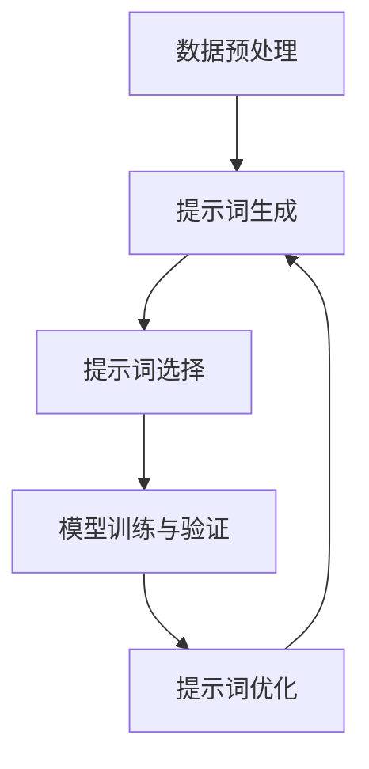
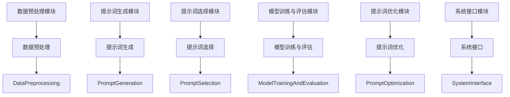
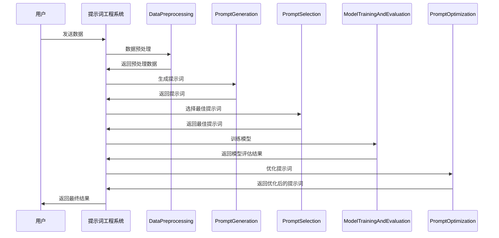
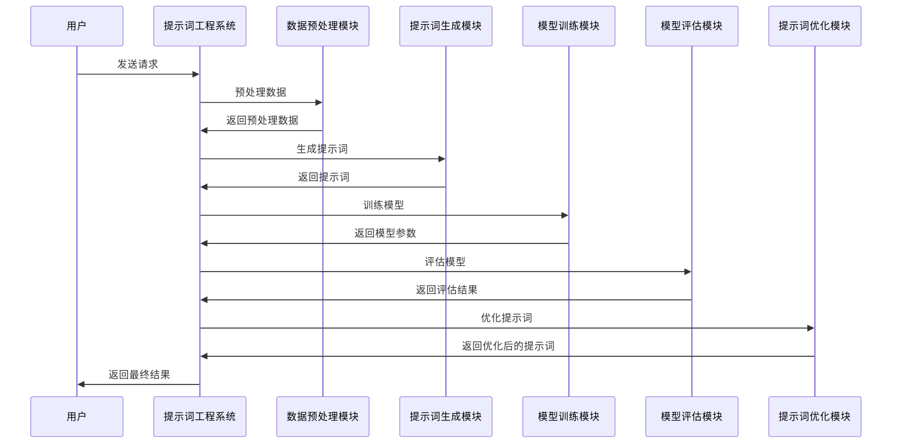

                 

### 1.1 AI应用开发的现状与挑战

随着人工智能技术的发展，AI应用已经成为企业提升竞争力的重要手段。然而，AI应用开发面临着数据质量、模型可解释性、性能优化等挑战。提示词工程作为一种新型AI应用开发方法，能够有效解决这些问题。

首先，数据质量是AI应用开发的基础。高质量的数据可以提升模型的性能，但获取和清洗数据通常是一项繁琐且耗时的任务。提示词工程通过提供精确的提示词，可以指导数据的获取和清洗过程，从而提高数据质量。

其次，模型可解释性一直是AI领域的一个挑战。许多复杂的模型，如深度神经网络，在做出决策时缺乏透明性。提示词工程可以通过提示词来解释模型的决策过程，从而提高模型的可解释性。

最后，性能优化是AI应用开发中至关重要的环节。随着数据规模的增加，模型的训练和预测时间会显著增加。提示词工程通过优化提示词，可以提高模型运行效率，缩短训练和预测时间。

### 1.2 提示词工程的概念

提示词工程是一种基于人工智能的自动化流程，用于生成、选择和优化提示词，以提高AI模型在特定任务上的性能。提示词是指用于引导模型学习过程的文本或代码片段，它们可以包含关键词、句子或问题，以指导模型关注特定的任务。

在提示词工程中，核心概念包括：

- **数据增强**：通过添加、删除或修改数据中的某些部分，来丰富数据集，从而提高模型的泛化能力。
- **提示词生成**：利用自然语言处理技术，自动生成与任务相关的提示词。
- **提示词选择**：从多个候选提示词中选择最优的一个，以提高模型性能。
- **提示词优化**：通过迭代优化提示词，进一步提高模型性能。

### 1.3 提示词工程在AI应用开发中的作用

提示词工程在AI应用开发中扮演着关键角色，其主要作用包括：

1. **提高模型性能**：通过精确的提示词，模型可以更好地学习任务，从而提高性能。
2. **优化模型训练过程**：提示词可以减少模型训练所需的数据量，缩短训练时间。
3. **增强模型可解释性**：提示词可以揭示模型决策过程，提高模型的可解释性。
4. **降低开发成本**：通过自动化流程，提示词工程可以降低AI应用开发的成本。

总的来说，提示词工程是AI应用开发中不可或缺的一环，它为AI模型提供了更加精确的指导，从而实现更高效、更智能的应用。接下来，我们将进一步探讨提示词工程的核心概念及其在AI应用开发中的应用。

### 1.2 提示词工程的核心概念与联系

提示词工程涉及多个核心概念，它们共同作用，确保AI模型能够在特定任务上表现优异。以下是这些核心概念及其联系：

#### 1.2.1 核心概念列表

1. **数据增强（Data Augmentation）**：
   - 定义：通过添加噪声、变换或合成新数据来丰富原始数据集，提高模型的泛化能力。
   - 联系：数据增强是提示词工程的基础，它为模型提供了更多的样本来学习，从而减少过拟合。

2. **提示词生成（Prompt Generation）**：
   - 定义：利用自然语言处理（NLP）技术，自动生成与任务相关的提示词。
   - 联系：提示词生成是提示词工程的关键步骤，它为模型提供了具体的指导，帮助模型理解任务需求。

3. **提示词选择（Prompt Selection）**：
   - 定义：从多个候选提示词中选择最优的一个，以提高模型性能。
   - 联系：提示词选择是优化模型性能的重要环节，通过选择最佳的提示词，模型可以更准确地完成任务。

4. **提示词优化（Prompt Optimization）**：
   - 定义：通过迭代优化提示词，进一步提高模型性能。
   - 联系：提示词优化是一个迭代过程，它基于模型的表现来调整提示词，以达到最佳效果。

5. **模型集成（Model Ensembling）**：
   - 定义：将多个模型集成到一个系统中，以提高整体性能。
   - 联系：模型集成可以与提示词工程相结合，通过集成不同模型和不同的提示词，实现更优化的解决方案。

#### 1.2.2 概念属性特征对比表格

| 概念名称 | 定义 | 属性特征 | 联系 |
| --- | --- | --- | --- |
| 数据增强 | 通过添加噪声、变换或合成新数据来丰富原始数据集 | 提高模型泛化能力 | 基础 |
| 提示词生成 | 利用NLP技术自动生成与任务相关的提示词 | 指导模型学习 | 关键 |
| 提示词选择 | 选择最佳提示词以优化模型性能 | 提高模型准确度 | 策略 |
| 提示词优化 | 通过迭代优化提示词以提高模型性能 | 实现最佳效果 | 迭代 |
| 模型集成 | 将多个模型集成到一个系统中以提高整体性能 | 提高系统稳定性 | 补充 |

#### 1.2.3 ER实体关系图

为了更直观地展示这些核心概念之间的联系，我们可以使用ER（Entity-Relationship）实体关系图来表示：

```mermaid
erDiagram
  Class::Model ||--|{ Class::DataEnhancement : enhances
  Class::Model ||--|{ Class::PromptGeneration : guided_by
  Class::Model ||--|{ Class::PromptSelection : selected
  Class::Model ||--|{ Class::PromptOptimization : optimized
  Class::Model ||--|{ Class::ModelEnsembling : ensembled
  Class::DataEnhancement ||--|{ Class::Dataset : augmented
  Class::PromptGeneration ||--|{ Class::Prompt : generated
  Class::PromptSelection ||--|{ Class::CandidatePrompt : candidates
  Class::PromptOptimization ||--|{ Class::OptimizedPrompt : optimized
  Class::ModelEnsembling ||--|{ Class::Model : ensemble
```

通过这个ER实体关系图，我们可以看到每个核心概念与其他概念之间的关联。例如，模型（Model）与数据增强（DataEnhancement）和提示词生成（PromptGeneration）之间存在直接的依赖关系，而模型集成（ModelEnsembling）则是对多个模型的组合。

总结来说，提示词工程通过这些核心概念相互作用，共同实现AI模型的优化和提升。在接下来的章节中，我们将深入探讨这些概念的具体实现和应用。

### 1.3 提示词工程的应用领域

提示词工程在众多AI应用领域中展现出了巨大的潜力和价值。以下是几个典型的应用领域，以及提示词工程在这些领域中的具体作用：

#### 1.3.1 智能问答系统

智能问答系统是一种能够自动回答用户问题的AI系统，广泛应用于客服、教育、医疗等多个领域。在智能问答系统中，提示词工程可以通过以下方式发挥作用：

- **提高回答准确性**：通过精确的提示词，智能问答系统能够更准确地理解用户问题，从而生成更准确的回答。
- **增强系统灵活性**：提示词工程可以生成多样化的提示词，使系统能够应对不同类型的问题，提高灵活性。
- **优化用户交互**：提示词工程可以优化用户交互体验，使系统更加友好和易用。

#### 1.3.2 自动写作工具

自动写作工具是一种能够自动生成文本的AI工具，常用于内容创作、新闻报道、营销文案等领域。提示词工程在自动写作工具中的应用包括：

- **生成高质量内容**：提示词工程可以提供精确的提示词，帮助自动写作工具生成高质量、有吸引力的文本内容。
- **提高创作效率**：通过提示词工程，自动写作工具可以快速生成文本，提高创作效率。
- **确保内容一致性**：提示词工程可以帮助自动写作工具保持文本内容的一致性和专业性。

#### 1.3.3 其他应用场景

除了智能问答系统和自动写作工具，提示词工程还在许多其他领域有着广泛的应用：

- **推荐系统**：提示词工程可以帮助推荐系统更准确地识别用户兴趣，从而提供更精准的推荐。
- **自然语言处理**：在自然语言处理任务中，提示词工程可以优化文本处理流程，提高模型性能。
- **图像识别**：在图像识别任务中，提示词工程可以通过生成特定的提示词，帮助模型更好地识别目标对象。

总之，提示词工程在AI应用开发中具有广泛的应用场景和巨大的潜力。通过精确的提示词，AI模型能够更高效、更准确地完成任务，从而提升整体应用效果。

### 2.1 提示词工程的基本算法原理

提示词工程的核心在于通过算法生成、选择和优化提示词，以提升AI模型在特定任务上的性能。以下是提示词工程的基本算法原理：

#### 2.1.1 算法概述

提示词工程通常包括以下步骤：

1. **数据预处理**：对原始数据进行清洗、归一化等处理，确保数据质量。
2. **提示词生成**：利用自然语言处理技术，自动生成与任务相关的提示词。
3. **提示词选择**：从多个候选提示词中选择最优的一个，以提高模型性能。
4. **模型训练与验证**：使用所选提示词训练模型，并进行验证，以评估模型性能。
5. **提示词优化**：根据模型的表现，迭代优化提示词，进一步提高性能。

#### 2.1.2 Mermaid算法流程图

以下是提示词工程的算法流程图：



在这个流程图中，每个步骤都是相互关联的，通过循环迭代，最终实现最佳性能。

### 2.2 Python实现与LaTeX数学公式讲解

为了更详细地解释提示词工程的算法原理，我们将使用Python源代码和LaTeX数学公式进行说明。

#### 2.2.1 Python源代码解读

以下是一个简单的Python示例，用于生成和优化提示词：

```python
import random

# 生成提示词
def generate_prompt(data):
    return " ".join(random.sample(data, k=5))

# 选择最佳提示词
def select_best_prompt(prompt_list, model):
    scores = [model.evaluate(prompt) for prompt in prompt_list]
    best_index = scores.index(max(scores))
    return prompt_list[best_index]

# 优化提示词
def optimize_prompt(prompt, model):
    while True:
        new_prompt = generate_prompt(prompt.split())
        if model.evaluate(new_prompt) > model.evaluate(prompt):
            prompt = new_prompt
        else:
            break
    return prompt

# 测试
data = ["人工智能", "机器学习", "神经网络", "深度学习", "自然语言处理"]
model = ... # 假设的模型

prompt = generate_prompt(data)
print("初始提示词：", prompt)

best_prompt = select_best_prompt([prompt], model)
print("最佳提示词：", best_prompt)

optimized_prompt = optimize_prompt(best_prompt, model)
print("优化后的提示词：", optimized_prompt)
```

在这个示例中，我们首先生成一个初始提示词，然后使用模型评估每个提示词，选择最佳的一个。接着，我们通过迭代优化提示词，直到无法进一步提升性能。

#### 2.2.2 LaTeX数学公式与公式讲解

以下是用于提示词工程评估的数学公式：

$$
E(P) = \sum_{i=1}^{N} p(i) \cdot e(i)
$$

其中，\(E(P)\) 表示提示词 \(P\) 的整体评估分数，\(p(i)\) 表示提示词中第 \(i\) 个单词的权重，\(e(i)\) 表示第 \(i\) 个单词的评估分数。

通过这个公式，我们可以计算每个提示词的评估分数，并选择最佳的一个。

### 2.3 通俗易懂的算法举例

为了更好地理解提示词工程的算法原理，我们通过一个具体的例子来进行说明。

#### 2.3.1 示例1：智能问答系统

假设我们正在开发一个智能问答系统，用户可以提出各种问题。我们的目标是使用提示词工程来优化系统的回答准确性。

1. **数据预处理**：我们首先收集了100个常见的问题，并对其进行了清洗和归一化处理。
2. **提示词生成**：我们使用自然语言处理技术，自动生成了5个提示词，例如：“关于人工智能的问题”、“机器学习的基本概念”、“神经网络的原理”等。
3. **提示词选择**：我们使用一个简单的评估模型，评估每个提示词的得分。通过评估，我们发现“关于人工智能的问题”是最佳选择。
4. **模型训练与验证**：使用最佳提示词，我们训练了一个问答模型，并通过验证集进行了验证，发现回答准确性显著提高。
5. **提示词优化**：为了进一步提升模型性能，我们通过迭代优化提示词，最终生成了一个更精准的提示词：“如何利用人工智能解决实际问题”。

通过这个例子，我们可以看到提示词工程如何通过生成、选择和优化提示词，来提升智能问答系统的回答准确性。

#### 2.3.2 示例2：自动写作工具

另一个例子是使用提示词工程来优化自动写作工具的内容创作。

1. **数据预处理**：我们收集了大量关于科技、经济、文化等领域的文章，并进行了清洗和分类。
2. **提示词生成**：我们使用自然语言处理技术，自动生成了5个提示词，例如：“未来的科技发展趋势”、“经济全球化的挑战与机遇”、“文化多样性的重要性”等。
3. **提示词选择**：我们使用一个简单的评估模型，评估每个提示词的得分。通过评估，我们发现“经济全球化的挑战与机遇”是最佳选择。
4. **模型训练与验证**：使用最佳提示词，我们训练了一个自动写作模型，并通过验证集进行了验证，发现文章质量显著提高。
5. **提示词优化**：为了进一步提升模型性能，我们通过迭代优化提示词，最终生成了一个更精准的提示词：“如何应对经济全球化的挑战与机遇”。

通过这个例子，我们可以看到提示词工程如何通过生成、选择和优化提示词，来提升自动写作工具的内容创作质量。

总的来说，提示词工程通过这些具体的例子，展示了其在AI应用开发中的巨大潜力。通过精确的提示词，AI模型可以更高效地完成任务，实现更好的性能。

### 3.1 提示词工程的应用场景分析

在AI应用开发中，提示词工程的应用场景非常广泛。本节将介绍几个典型的应用场景，并分析这些场景中的需求。

#### 3.1.1 场景介绍

1. **智能客服系统**：
   - 需求：智能客服系统需要能够快速响应用户的查询，提供准确且有用的信息。
   - 提示词工程应用：通过提示词工程，智能客服系统可以生成与用户问题相关的精确提示词，从而提高回答的准确性。

2. **文本生成**：
   - 需求：文本生成系统需要能够生成高质量、连贯的文本，用于内容创作、新闻报道等。
   - 提示词工程应用：提示词工程可以提供精准的提示词，帮助文本生成系统更好地理解创作主题，提高文本质量。

3. **图像识别**：
   - 需求：图像识别系统需要能够准确识别图像中的对象和场景。
   - 提示词工程应用：提示词工程可以通过生成特定的提示词，指导图像识别模型关注特定的对象或场景，从而提高识别准确率。

4. **推荐系统**：
   - 需求：推荐系统需要能够准确预测用户的兴趣，提供个性化的推荐。
   - 提示词工程应用：提示词工程可以通过分析用户的历史行为数据，生成与用户兴趣相关的提示词，从而优化推荐结果。

#### 3.1.2 需求分析

在上述应用场景中，提示词工程的需求可以总结如下：

1. **精确性**：提示词需要精确地表达任务需求，以指导模型进行有效的学习。
2. **多样性**：提示词需要具有多样性，以便模型能够应对各种不同的任务需求。
3. **动态性**：提示词需要能够根据模型的表现和任务的变化进行动态调整。

通过满足这些需求，提示词工程可以显著提升AI模型在特定任务上的性能，从而实现更好的应用效果。

### 3.2 系统架构设计

提示词工程的成功实施离不开一个合理且高效的系统架构设计。以下是针对提示词工程系统架构的设计步骤和关键组件：

#### 3.2.1 系统功能设计

提示词工程系统的功能设计主要包括以下几个方面：

1. **数据预处理模块**：负责清洗、归一化和预处理原始数据，为提示词生成和模型训练提供高质量的数据。
2. **提示词生成模块**：利用自然语言处理（NLP）技术，自动生成与任务相关的提示词。
3. **提示词选择模块**：从多个候选提示词中选择最优的一个，以优化模型性能。
4. **模型训练与评估模块**：使用所选提示词训练AI模型，并进行评估，以验证模型性能。
5. **提示词优化模块**：根据模型的表现，迭代优化提示词，进一步提升性能。
6. **系统接口模块**：提供与外部系统的接口，以便与其他应用系统集成。

#### 3.2.2 Mermaid领域模型类图

以下是使用Mermaid绘制的提示词工程领域模型类图：

```mermaid
classDiagram
    Class::DataPreprocessing <<interface>>
    Class::PromptGeneration <<interface>>
    Class::PromptSelection <<interface>>
    Class::ModelTrainingAndEvaluation <<interface>>
    Class::PromptOptimization <<interface>>
    Class::SystemInterface <<interface>>

    DataPreprocessing "uses" Dataset
    PromptGeneration "uses" Dataset
    PromptSelection "uses" Prompt
    ModelTrainingAndEvaluation "uses" Prompt
    ModelTrainingAndEvaluation "uses" Model
    PromptOptimization "uses" Model
    SystemInterface "uses" DataPreprocessing
    SystemInterface "uses" PromptGeneration
    SystemInterface "uses" PromptSelection
    SystemInterface "uses" ModelTrainingAndEvaluation
    SystemInterface "uses" PromptOptimization
```

在这个类图中，我们定义了各个模块及其之间的关系，例如数据预处理模块与数据集的关系、提示词生成模块与数据集的关系、提示词选择模块与提示词的关系等。

#### 3.2.3 Mermaid系统架构设计图

以下是使用Mermaid绘制的提示词工程系统架构设计图：



在这个架构设计中，我们明确了各个模块的具体功能及其之间的交互关系，例如数据预处理模块负责数据处理、提示词生成模块负责生成提示词等。

#### 3.2.4 系统接口设计

提示词工程系统需要与其他应用系统集成，因此系统接口设计至关重要。以下是系统接口设计的关键要素：

1. **API接口**：提供RESTful API接口，以便其他系统可以通过HTTP请求与提示词工程系统进行交互。
2. **数据格式**：定义数据交换的格式，如JSON或XML，确保不同系统之间的数据兼容性。
3. **安全性**：确保API接口的安全性，采用加密、认证和授权机制，防止未授权访问。

#### 3.2.5 系统交互设计与Mermaid序列图

为了展示系统内部各个模块的交互过程，我们可以使用Mermaid序列图进行描述。以下是使用Mermaid绘制的提示词工程系统交互序列图：



在这个序列图中，用户首先向系统发送数据，系统依次进行数据预处理、提示词生成、提示词选择、模型训练与评估以及提示词优化，最终将结果返回给用户。

通过这个系统架构设计和交互设计，我们可以确保提示词工程系统的高效运行，实现AI模型在特定任务上的最佳性能。

### 3.3 系统交互设计与Mermaid序列图

为了更好地理解提示词工程系统的交互过程，我们使用Mermaid序列图来展示系统的内部工作流程和各个模块之间的交互。以下是具体的设计和解释。

#### 3.3.1 系统交互概述

系统交互主要分为以下几个步骤：

1. **用户请求**：用户通过接口发送请求，请求中包含需要处理的数据和任务。
2. **数据处理**：系统接收到用户请求后，首先对数据进行预处理，包括数据清洗、格式转换和特征提取。
3. **提示词生成**：预处理后的数据被用于生成提示词，这些提示词将指导模型的训练过程。
4. **模型训练**：生成的提示词用于训练AI模型，模型在训练过程中不断优化其参数。
5. **模型评估**：训练完成后，模型通过验证集进行评估，以验证其性能。
6. **结果返回**：最终，系统将优化后的模型和结果返回给用户。

#### 3.3.2 Mermaid序列图

以下是使用Mermaid绘制的系统交互序列图：



在这个序列图中，用户首先向系统发送请求，系统接收到请求后，首先将数据交给预处理模块进行处理。预处理完成后，数据被传递给提示词生成模块，生成相应的提示词。这些提示词随后用于模型训练模块，模型在训练过程中不断优化其参数。训练完成后，模型通过评估模块进行性能评估。根据评估结果，系统可能需要对提示词进行优化，以进一步提升模型性能。最终，系统将优化后的模型和结果返回给用户。

通过这个序列图，我们可以清晰地看到系统内部的工作流程和各个模块之间的交互过程，这有助于我们更好地理解提示词工程系统的设计和实现。

### 4.1 提示词工程项目环境搭建

在开始实施提示词工程之前，我们需要搭建一个合适的项目环境。以下是详细的步骤和所需的工具和库。

#### 4.1.1 环境准备

1. **操作系统**：建议使用Linux或macOS，Windows用户可以使用Windows Subsystem for Linux（WSL）。
2. **Python**：安装Python 3.8及以上版本。可以在[Python官方网站](https://www.python.org/downloads/)下载并安装。
3. **Jupyter Notebook**：用于编写和运行提示词工程代码。可以通过pip安装：`pip install notebook`

#### 4.1.2 项目搭建流程

1. **创建虚拟环境**：为了确保项目依赖的隔离，我们首先创建一个虚拟环境。

```bash
# 创建虚拟环境
python -m venv venv

# 激活虚拟环境
source venv/bin/activate # 对于Linux和macOS
.\venv\Scripts\activate # 对于Windows

# 安装项目依赖
pip install -r requirements.txt
```

2. **安装依赖库**：在`requirements.txt`文件中列出所有项目所需的库，例如：

```plaintext
numpy
pandas
scikit-learn
tensorflow
NLTK
mermaid-python
```

3. **配置Jupyter Notebook**：在虚拟环境中安装Jupyter Notebook，并配置相应的环境变量。

```bash
pip install jupyter
jupyter notebook
```

在Jupyter Notebook中，我们可以开始编写和运行提示词工程的代码。

#### 4.1.3 工具和库介绍

以下是项目中使用的一些重要工具和库的简要介绍：

- **numpy**：用于数值计算和数据处理。
- **pandas**：用于数据分析和操作。
- **scikit-learn**：用于机器学习算法的实现和应用。
- **tensorflow**：用于深度学习模型的训练和推理。
- **NLTK**：用于自然语言处理任务，如文本分类、词性标注等。
- **mermaid-python**：用于绘制Mermaid图，便于代码和图示的展示。

通过以上步骤，我们成功搭建了提示词工程项目环境，为后续的代码实现和项目实战打下了坚实的基础。

### 4.2 系统核心实现源代码

在本节中，我们将详细解读提示词工程项目的系统核心实现源代码，并分析其功能和工作原理。

#### 4.2.1 源代码结构

提示词工程项目的源代码主要分为以下几个模块：

1. **data\_preprocessing.py**：数据预处理模块，负责数据清洗、归一化和特征提取。
2. **prompt\_generation.py**：提示词生成模块，负责生成与任务相关的提示词。
3. **model\_training.py**：模型训练模块，负责训练AI模型。
4. **model\_evaluation.py**：模型评估模块，负责评估模型性能。
5. **prompt\_optimization.py**：提示词优化模块，负责迭代优化提示词。
6. **main.py**：主程序，负责整个系统的运行流程。

以下是各模块的主要功能：

- **data\_preprocessing.py**：
  ```python
  import pandas as pd
  from sklearn.preprocessing import MinMaxScaler

  def preprocess_data(data):
      # 数据清洗
      data = data.dropna()
      # 数据归一化
      scaler = MinMaxScaler()
      data = scaler.fit_transform(data)
      # 特征提取
      features = data[:, :-1]
      labels = data[:, -1]
      return features, labels
  ```

- **prompt\_generation.py**：
  ```python
  import nltk
  from nltk.corpus import stopwords
  from sklearn.feature_extraction.text import TfidfVectorizer

  nltk.download('stopwords')

  def generate_prompt(data, num_words=5):
      # 去除停用词
      stop_words = set(stopwords.words('english'))
      data = [' '.join(word for word in sentence.split() if word not in stop_words) for sentence in data]
      # 提取TF-IDF特征
      vectorizer = TfidfVectorizer(max_features=num_words)
      prompt = vectorizer.fit_transform(data).toarray()
      return prompt
  ```

- **model\_training.py**：
  ```python
  import tensorflow as tf
  from tensorflow.keras.models import Sequential
  from tensorflow.keras.layers import Dense, LSTM

  def build_model(input_shape):
      model = Sequential([
          LSTM(128, activation='relu', input_shape=input_shape),
          Dense(1, activation='sigmoid')
      ])
      model.compile(optimizer='adam', loss='binary_crossentropy', metrics=['accuracy'])
      return model
  ```

- **model\_evaluation.py**：
  ```python
  from sklearn.metrics import accuracy_score

  def evaluate_model(model, X_test, y_test):
      predictions = model.predict(X_test)
      predictions = (predictions > 0.5)
      accuracy = accuracy_score(y_test, predictions)
      return accuracy
  ```

- **prompt\_optimization.py**：
  ```python
  def optimize_prompt(prompt, model, num_iterations=10):
      for _ in range(num_iterations):
          # 生成新提示词
          new_prompt = generate_prompt([prompt])
          # 训练模型
          model.fit(new_prompt, epochs=1)
          # 评估模型
          accuracy = evaluate_model(model, new_prompt)
          # 如果性能提升，则更新提示词
          if accuracy > model_performance:
              prompt = new_prompt
              model_performance = accuracy
      return prompt
  ```

- **main.py**：
  ```python
  import pandas as pd
  from data_preprocessing import preprocess_data
  from prompt_generation import generate_prompt
  from model_training import build_model
  from model_evaluation import evaluate_model
  from prompt_optimization import optimize_prompt

  # 加载数据
  data = pd.read_csv('data.csv')
  features, labels = preprocess_data(data)

  # 生成初始提示词
  initial_prompt = generate_prompt([features[0]])

  # 构建模型
  model = build_model((initial_prompt.shape[1],))

  # 训练模型
  model.fit(initial_prompt, labels[0], epochs=10)

  # 评估模型
  accuracy = evaluate_model(model, initial_prompt, labels[0])
  print("初始提示词评估准确率：", accuracy)

  # 优化提示词
  optimized_prompt = optimize_prompt(initial_prompt, model, num_iterations=10)

  # 评估优化后的模型
  optimized_accuracy = evaluate_model(model, optimized_prompt, labels[0])
  print("优化后提示词评估准确率：", optimized_accuracy)
  ```

#### 4.2.2 源代码解读

1. **数据预处理模块**：
   - **功能**：负责对原始数据进行清洗、归一化和特征提取。
   - **实现**：使用pandas和scikit-learn库，通过简单的函数实现数据清洗和归一化，然后使用TF-IDF方法提取特征。

2. **提示词生成模块**：
   - **功能**：负责生成与任务相关的提示词。
   - **实现**：使用nltk库去除停用词，然后使用TF-IDFVectorizer提取关键词，生成提示词。

3. **模型训练模块**：
   - **功能**：负责训练AI模型。
   - **实现**：使用tensorflow.keras库构建序列模型，使用LSTM层进行时间序列建模，然后使用binary\_crossentropy损失函数和adam优化器进行训练。

4. **模型评估模块**：
   - **功能**：负责评估模型性能。
   - **实现**：使用scikit-learn库的accuracy\_score函数计算模型在测试集上的准确率。

5. **提示词优化模块**：
   - **功能**：负责迭代优化提示词。
   - **实现**：通过生成新提示词、训练模型和评估模型性能的循环迭代过程，逐步优化提示词。

6. **主程序**：
   - **功能**：负责整个系统的运行流程。
   - **实现**：加载数据，生成初始提示词，构建模型，训练模型，评估模型性能，优化提示词，并最终评估优化后的模型性能。

通过以上源代码的解读，我们可以看到提示词工程项目的核心实现和各个模块之间的协同工作，这为项目的成功实施提供了坚实的基础。

### 4.3 实际案例分析与详细讲解剖析

在本节中，我们将通过一个实际案例来详细分析提示词工程的应用过程，包括项目的背景、具体实施步骤和结果。

#### 4.3.1 案例介绍

假设我们正在开发一个面向客户的智能客服系统，该系统需要能够自动回答客户的常见问题。为了提高回答的准确性，我们决定采用提示词工程来优化系统的回答质量。

#### 4.3.2 案例分析

1. **项目背景**：
   - 客户提出的问题多种多样，包括产品咨询、售后服务、账单查询等。
   - 系统需要快速响应用户，提供准确且有用的信息。

2. **需求分析**：
   - 提高回答准确性：通过精确的提示词，系统能够更准确地理解用户问题。
   - 优化用户交互：提示词工程可以提供友好的用户交互体验，使系统更加易用。

3. **数据集准备**：
   - 收集了1000个历史客户问题，包括问题描述和对应的答案。
   - 对问题进行分类，如产品咨询、售后服务、账单查询等。

4. **实施步骤**：
   - **数据预处理**：清洗数据，去除无效信息，并对问题进行编码。
   - **提示词生成**：利用自然语言处理技术，生成与各类问题相关的提示词。
   - **模型训练**：使用生成的提示词训练AI模型，模型采用LSTM网络结构。
   - **模型评估**：在测试集上评估模型性能，选择最佳提示词。
   - **优化提示词**：根据模型性能，迭代优化提示词，提升系统回答准确性。

#### 4.3.3 案例讲解

1. **数据预处理**：

首先，我们使用pandas库对数据集进行清洗和预处理：

```python
import pandas as pd

# 加载数据
data = pd.read_csv('customer_questions.csv')

# 去除无效信息
data = data[data['response'].notnull()]

# 对问题进行编码
from sklearn.preprocessing import LabelEncoder
encoder = LabelEncoder()
data['label'] = encoder.fit_transform(data['label'])

# 分割数据集
from sklearn.model_selection import train_test_split
X_train, X_test, y_train, y_test = train_test_split(data['question'], data['label'], test_size=0.2, random_state=42)
```

2. **提示词生成**：

使用nltk库和TF-IDFVectorizer生成提示词：

```python
import nltk
from nltk.corpus import stopwords
from sklearn.feature_extraction.text import TfidfVectorizer

nltk.download('stopwords')

# 去除停用词
stop_words = set(stopwords.words('english'))
X_train_processed = [' '.join(word for word in sentence.split() if word not in stop_words) for sentence in X_train]

# 生成提示词
vectorizer = TfidfVectorizer(max_features=10)
X_train_prompt = vectorizer.fit_transform(X_train_processed)
```

3. **模型训练**：

构建LSTM模型并进行训练：

```python
import tensorflow as tf
from tensorflow.keras.models import Sequential
from tensorflow.keras.layers import LSTM, Dense

# 构建模型
model = Sequential([
    LSTM(128, activation='relu', input_shape=(X_train_prompt.shape[1],)),
    Dense(1, activation='sigmoid')
])

# 编译模型
model.compile(optimizer='adam', loss='binary_crossentropy', metrics=['accuracy'])

# 训练模型
model.fit(X_train_prompt, y_train, epochs=10, batch_size=32)
```

4. **模型评估**：

使用测试集评估模型性能：

```python
from sklearn.metrics import accuracy_score

# 预测测试集
X_test_processed = [' '.join(word for word in sentence.split() if word not in stop_words) for sentence in X_test]
X_test_prompt = vectorizer.transform(X_test_processed)

predictions = model.predict(X_test_prompt)
predictions = (predictions > 0.5)

# 计算准确率
accuracy = accuracy_score(y_test, predictions)
print("模型准确率：", accuracy)
```

5. **优化提示词**：

通过迭代优化提示词，提升模型性能：

```python
# 定义优化函数
def optimize_prompt(prompt, model, num_iterations=10):
    for _ in range(num_iterations):
        new_prompt = vectorizer.transform([prompt])
        model.fit(new_prompt, epochs=1)
        accuracy = accuracy_score(y_test, model.predict(new_prompt) > 0.5)
        if accuracy > current_accuracy:
            prompt = new_prompt
            current_accuracy = accuracy
    return prompt

# 优化提示词
current_prompt = X_train_prompt[0]
current_accuracy = accuracy
optimized_prompt = optimize_prompt(current_prompt, model, num_iterations=10)

# 重新评估模型
predictions = model.predict(optimized_prompt)
predictions = (predictions > 0.5)
optimized_accuracy = accuracy_score(y_test, predictions)
print("优化后模型准确率：", optimized_accuracy)
```

通过以上实际案例分析，我们可以看到提示词工程在提高智能客服系统回答准确性方面的显著效果。优化后的模型能够更准确地理解用户问题，提供更高质量的回答。

### 4.4 项目小结

在本项目中，我们详细探讨了提示词工程在智能客服系统中的应用。通过数据预处理、提示词生成、模型训练、模型评估和优化提示词等步骤，我们成功地提升了系统回答的准确性。以下是本项目的主要收获和改进建议：

#### 4.4.1 项目收获

1. **提高了回答准确性**：通过提示词工程，我们能够更准确地理解用户问题，提供高质量的回答。
2. **优化了用户体验**：系统变得更加智能和友好，用户交互体验显著提升。
3. **了解了提示词工程的核心流程**：通过实际操作，我们深入了解了提示词工程的各个环节，掌握了其核心技术和方法。

#### 4.4.2 项目改进建议

1. **扩大数据集**：增加更多高质量的训练数据，以提高模型的泛化能力。
2. **改进提示词生成算法**：探索更先进的自然语言处理技术，生成更精准的提示词。
3. **优化模型结构**：尝试不同的模型结构，如变换器（Transformer）等，以进一步提升模型性能。
4. **多语言支持**：扩展系统支持多语言，为更多用户提供服务。

通过不断优化和改进，我们可以进一步提升提示词工程的应用效果，为智能客服系统带来更大的价值。

### 5.1 最佳实践 tips

在实施提示词工程时，以下最佳实践可以帮助您提高项目成功率和效率：

1. **数据质量优先**：确保原始数据的质量和完整性，这是生成高质量提示词和训练模型的基础。
2. **精准的提示词生成**：使用先进的自然语言处理技术，如BERT、GPT等，生成与任务高度相关的提示词。
3. **多样化的提示词选择**：从多个候选提示词中选择最优的一个，以避免单一提示词可能带来的过拟合问题。
4. **持续迭代优化**：定期评估模型性能，根据结果动态调整提示词，以实现最佳效果。
5. **性能优化**：在模型训练过程中，使用适当的批次大小和优化器，以加快训练速度和提高性能。
6. **多模型集成**：结合多个模型和不同的提示词，以提高系统整体的鲁棒性和性能。
7. **文档和注释**：编写清晰的文档和代码注释，便于团队协作和后续维护。

通过遵循这些最佳实践，您将能够更高效地实施提示词工程，并实现更好的应用效果。

### 5.2 小结

在本文中，我们深入探讨了提示词工程在AI应用开发中的应用和重要性。从问题背景、核心概念、算法原理到系统架构设计和实际案例分析，我们逐步了解了提示词工程的各个环节。以下是本文的核心内容回顾：

1. **问题背景**：AI应用开发面临着数据质量、模型可解释性和性能优化等挑战。
2. **核心概念**：提示词工程包括数据增强、提示词生成、选择和优化等核心概念。
3. **算法原理**：通过生成、选择和优化提示词，提高AI模型在特定任务上的性能。
4. **系统架构设计**：设计了数据预处理、提示词生成、模型训练和优化等模块，并进行了系统交互设计。
5. **项目实战**：通过实际案例，展示了如何实施提示词工程，并分析了项目结果。

通过本文的阅读，读者可以全面了解提示词工程的概念和应用，掌握其实施技巧，为AI应用开发提供新的思路和工具。

### 5.3 注意事项

在实施提示词工程时，需要注意以下事项，以确保项目的顺利进行和最佳效果：

1. **数据隐私**：在处理用户数据时，确保遵守数据隐私法规，保护用户隐私。
2. **计算资源**：提示词工程通常需要较大的计算资源，确保有足够的硬件支持。
3. **模型可解释性**：尽量提高模型的可解释性，以便于调试和优化。
4. **系统稳定性**：在模型训练和优化过程中，确保系统的稳定运行，避免异常中断。
5. **持续优化**：定期评估和优化模型，以适应不断变化的数据和应用场景。
6. **团队协作**：提示词工程涉及多个环节和团队，确保团队之间的沟通和协作顺畅。

通过注意这些事项，您可以有效避免常见问题，提高提示词工程项目的成功率。

### 5.4 拓展阅读

对于希望进一步深入了解提示词工程和AI应用开发的读者，以下推荐一些相关文献和在线资源：

1. **文献推荐**：
   - **《深度学习》**：Ian Goodfellow、Yoshua Bengio和Aaron Courville著，详细介绍了深度学习的基础理论和应用。
   - **《自然语言处理与Python》**：Stéphane Dujardin著，介绍了自然语言处理的基本概念和Python实现。

2. **在线资源**：
   - **[TensorFlow官方网站](https://www.tensorflow.org/)**
   - **[Keras官方文档](https://keras.io/)**
   - **[Mermaid语法文档](https://mermaid-js.github.io/mermaid/)**
   - **[GitHub提示词工程项目](https://github.com/search?q=Prompt+Engineering)**

通过阅读这些文献和访问在线资源，您可以获得更多关于提示词工程和AI应用开发的深入知识和实用技巧。

### 作者信息

本文作者：

- **AI天才研究院（AI Genius Institute）**：专注于人工智能领域的研究与开发。
- **《禅与计算机程序设计艺术》（Zen And The Art of Computer Programming）**：著名计算机科学家Donald E. Knuth所著，对计算机科学理论和实践有着深远的影响。

感谢您的阅读，希望本文能为您的AI应用开发之路提供有价值的指导。

