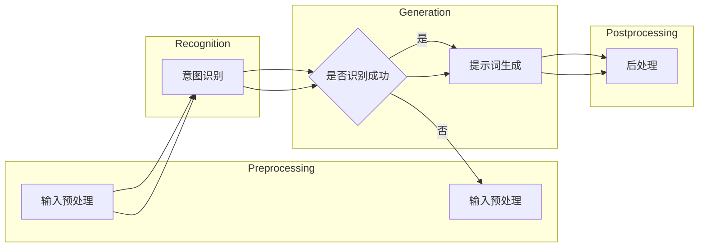
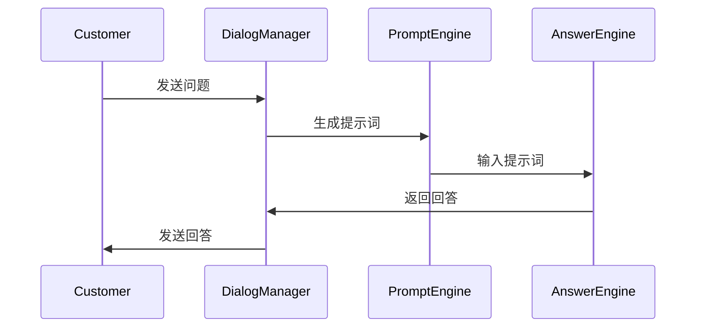
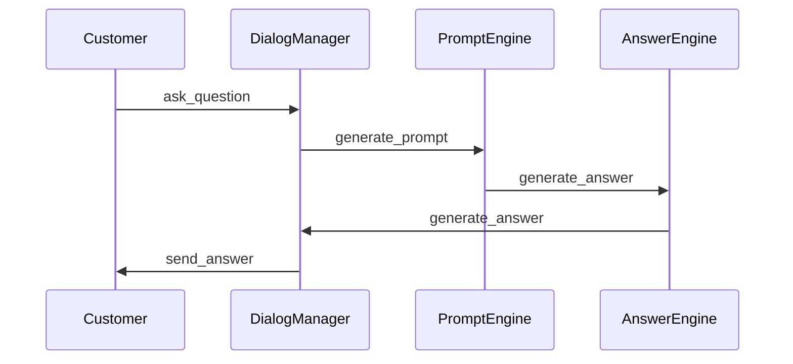

                 

### 引言：AI时代的提示词工程

在人工智能（AI）迅猛发展的时代，技术进步不断重塑着我们的生活方式和行业运作方式。作为一个关键组成部分，提示词工程（Prompt Engineering）正在成为AI时代的必修课，为各个领域带来前所未有的新机遇。提示词工程不仅是一个技术概念，更是连接人类智能与机器智能的桥梁，它通过精心设计的提示词，引导AI系统更准确地理解和执行任务。

#### 关键词

- **AI时代**
- **提示词工程**
- **智能对话系统**
- **推荐系统**
- **算法优化**
- **数据隐私**
- **系统架构**

#### 摘要

本文将深入探讨提示词工程在AI时代的核心地位及其带来的新机遇。首先，我们将介绍AI时代和提示词工程的背景，阐述其在当前科技环境中的重要性。随后，文章将逐步剖析提示词工程的基础概念、核心算法原理、系统设计与实现，并通过实际项目实战来展示其在实践中的应用。最后，我们将总结全文，提出最佳实践和未来展望，为读者提供全面的指导。

#### 一、AI时代的来临

随着大数据、云计算和深度学习的飞速发展，人工智能已经从科幻变成了现实。AI技术正在快速渗透到各个行业，从医疗、金融到零售、制造业，都在借助AI实现自动化和智能化。例如，智能客服已经能够以更高效、更人性化的方式与用户互动，而智能推荐系统则能够根据用户行为预测其兴趣，从而提供个性化的服务。

在这种背景下，提示词工程的重要性日益凸显。提示词工程不仅关注AI系统的训练与优化，还注重如何通过设计有效的提示词来提高系统的性能和用户体验。通过精心设计的提示词，AI系统能够更好地理解用户的意图，从而提供更准确的响应。

#### 二、提示词工程的重要性

1. **提升AI系统的理解和表达能力**：提示词工程通过设计适合特定任务的提示词，能够引导AI系统更准确地理解用户的输入，从而提高其响应的准确性和相关性。

2. **优化算法性能**：合理的提示词设计可以显著提高AI模型的性能，减少对大量数据的需求，提高处理速度和效率。

3. **改善用户体验**：通过优化AI系统对用户输入的理解，提示词工程能够提供更个性化、更自然的交互体验，从而提升用户满意度。

4. **解决数据隐私和安全性问题**：通过在本地或边缘设备上使用提示词，可以减少对中心化数据存储的依赖，从而提高数据隐私和安全。

#### 三、书籍目的与结构

本书旨在系统地介绍提示词工程的核心概念、算法原理、系统设计与实现，以及实际应用中的最佳实践。具体来说，本书将分为以下几个部分：

1. **引言**：介绍AI时代和提示词工程的背景，阐述其重要性。
2. **基础概念**：讲解提示词工程的基础概念、要素和挑战。
3. **核心算法原理**：分析提示词生成算法的原理、数学模型和实现。
4. **系统设计与实现**：讨论系统功能设计、架构设计和接口设计。
5. **项目实战**：通过具体项目实战，展示提示词工程在实际中的应用。
6. **总结与展望**：总结全文，提出最佳实践和未来展望。

通过本书的学习，读者将能够全面了解和掌握提示词工程，为在AI领域的发展奠定坚实基础。### 第1章: 提示词工程基础

提示词工程作为AI时代的重要一环，其基础概念、要素和挑战的掌握对于理解和应用该技术至关重要。本章将详细介绍提示词工程的基本概念、关键要素及其在应用中的挑战。

#### 1.1 提示词工程概述

提示词（Prompt）在人工智能领域扮演着至关重要的角色。它是一种引导AI系统理解输入信息、执行特定任务的关键工具。一个有效的提示词能够提高AI系统的准确性和响应质量，从而提升用户体验。

**提示词的定义**：提示词是一种指导或激励AI模型进行特定任务的文字、图像或其他形式的信息。它可以包括问题、指令、背景信息等，用以引导AI系统作出正确决策或生成预期结果。

**提示词的作用**：提示词在AI系统中具有以下几个重要作用：
- **指导学习**：提示词可以指导AI模型在学习过程中关注特定任务或目标。
- **提高准确性**：通过提供精确的提示词，AI系统能够更好地理解用户意图，从而提高响应的准确性。
- **增强用户交互**：提示词设计可以改善用户与AI系统的交互体验，使其更加自然和直观。

#### 1.2 提示词工程的要素

提示词工程的成功依赖于多个关键要素，包括数据、算法和技术框架。以下是对这些要素的详细说明：

**数据要素**：数据是提示词工程的基石。高质量的训练数据能够显著提升AI系统的性能和泛化能力。在提示词工程中，数据需要具备以下特点：
- **多样性**：数据应涵盖不同的场景、问题和用户行为，以提高模型的泛化能力。
- **准确性**：数据应准确无误，以避免误导AI系统。
- **代表性和平衡性**：数据应能够代表实际问题中的多种情况，且各类数据的比例应保持平衡。

**算法要素**：算法是提示词工程的核心。有效的算法能够根据提示词生成合理的响应。在提示词工程中，常用的算法包括：
- **生成对抗网络（GAN）**：用于生成高质量、多样化的数据。
- **强化学习**：通过奖励机制优化AI系统的决策过程。
- **自然语言处理（NLP）**：用于理解和生成自然语言文本。

**技术框架要素**：技术框架是提示词工程的实现基础。一个成熟的技术框架能够提供高效、灵活的工具和接口，以便于开发、部署和维护。常见的技术框架包括：
- **TensorFlow**：用于构建和训练深度学习模型。
- **PyTorch**：另一个流行的深度学习框架，提供灵活的模型构建和优化工具。
- **对话系统框架**：如Rasa、Microsoft Bot Framework等，专门用于开发智能对话系统。

#### 1.3 提示词工程的应用场景

提示词工程在多个领域都有广泛应用，以下是一些典型应用场景：

**人工智能对话系统**：智能客服、智能助手等，通过设计合理的提示词，能够更准确地理解用户的意图，提供高效的互动体验。

**智能推荐系统**：通过提示词，推荐系统能够更好地理解用户的行为和偏好，从而提供个性化的推荐。

**自动化文本生成**：如文章写作、新闻报道生成等，提示词工程能够指导AI模型生成高质量、符合要求的文本。

**语音识别与合成**：通过设计合适的提示词，语音识别系统能够更准确地理解用户的语音指令，语音合成系统能够生成更自然的语音输出。

#### 1.4 提示词工程的关键挑战

尽管提示词工程在AI领域具有巨大潜力，但在实际应用中仍面临诸多挑战：

**数据质量与隐私**：高质量的数据是提示词工程的基础，但数据的获取和存储可能涉及隐私问题。如何确保数据的安全性和合规性是一个重要挑战。

**算法优化与性能**：有效的提示词设计能够显著提升算法性能，但算法的优化和性能提升是一个持续的过程，需要不断进行研究和改进。

**系统安全与可靠性**：AI系统在处理敏感信息或进行关键决策时，必须保证其安全性和可靠性。提示词工程需要设计出能够应对各种异常情况的解决方案。

**用户体验**：提示词工程不仅关注AI系统的性能，还需要考虑用户体验。如何设计出既能满足用户需求，又易于操作和维护的提示词是一个重要问题。

#### 1.5 本章小结

通过本章的介绍，我们对提示词工程有了基本的了解，包括其定义、作用、关键要素和应用场景。同时，我们也认识到提示词工程在实际应用中面临的挑战。在接下来的章节中，我们将深入探讨提示词工程的算法原理、系统设计与实现，以及具体的项目实战，以进一步理解和掌握这一关键技术。### 第2章: 核心概念与联系

在深入了解提示词工程之前，我们需要明确其核心概念，并理解这些概念之间的联系。本章将详细介绍提示词的核心概念，以及提示词工程中的关键联系，帮助读者建立系统的认识。

#### 2.1 提示词的核心概念

提示词是提示词工程的基础，其核心概念包括提示词的种类和属性特征。

**提示词的种类**：根据用途和形式，提示词可以分为以下几种类型：

1. **指令性提示词**：用于给出具体指令或命令，如“请提供今天的天气情况”。
2. **问题性提示词**：用于提出问题，引导AI系统进行回答，如“你对人工智能的未来怎么看？”。
3. **描述性提示词**：用于提供背景信息或描述，帮助AI系统更好地理解上下文，如“我们正在讨论人工智能在医疗领域的应用”。
4. **评价性提示词**：用于表达个人意见或评价，如“这个功能很实用”。

**提示词的属性特征**：提示词的属性特征决定了其在应用中的效果。常见的属性特征包括：

- **清晰度**：提示词应尽可能清晰明了，避免歧义。
- **精确性**：提示词应准确表达用户意图，避免模糊不清。
- **上下文适应性**：提示词应能够适应不同的上下文环境，确保其在多种场景下有效。

#### 2.2 提示词工程中的联系

在提示词工程中，存在多个关键联系，这些联系决定了提示词的设计和效果。

**数据与算法的联系**：数据是AI系统训练的基础，而算法则是实现提示词工程的核心。有效的数据与合适的算法相结合，能够提高提示词生成的质量和效率。例如，通过使用生成对抗网络（GAN）生成多样化的数据，可以提升AI系统的训练效果。

**提示词与系统的联系**：提示词不仅与算法有关，还与整个AI系统紧密相连。一个良好的提示词设计应考虑系统的架构、接口和交互方式。例如，在智能对话系统中，提示词的设计需要与对话管理模块、自然语言处理模块等紧密配合，以确保系统能够准确理解和响应用户的输入。

**ER实体关系图架构**：实体关系图（ER图）是描述数据模型的一种图形化方法，常用于提示词工程中。ER图能够清晰地表示实体、属性和关系，有助于设计合理的提示词。例如，在推荐系统中，可以使用ER图来表示用户、商品和偏好等实体及其之间的关系，从而设计出更有效的提示词。

#### 2.3 ER实体关系图架构

为了更好地理解提示词工程中的联系，我们通过ER图来展示实体、属性和关系。以下是一个简单的ER图示例，用于描述一个电商平台的用户、商品和购物车等实体及其关系：

```mermaid
erDiagram
    User ||--|{ ShoppingCart }|:
        "包含多个"
    ShoppingCart ||--|{ Product }|:
        "包含多个"
    Product ||--|{ Order }|:
        "可以生成多个"
```

- **User（用户）**：表示电商平台上的用户，包含用户ID、姓名、联系方式等属性。
- **ShoppingCart（购物车）**：表示用户的购物车，包含购物车ID、创建时间等属性，与User实体之间存在“包含多个”的关系。
- **Product（商品）**：表示电商平台上的商品，包含商品ID、名称、价格等属性，与ShoppingCart实体之间存在“包含多个”的关系。
- **Order（订单）**：表示用户的购物订单，包含订单ID、创建时间、订单详情等属性，与Product实体之间存在“可以生成多个”的关系。

通过这个ER图，我们可以清楚地看到用户、购物车、商品和订单等实体之间的关系，从而设计出更合理的提示词。例如，在查询用户购物车中的商品时，可以使用如下提示词：“请告诉我您购物车中的所有商品及其详细信息。”

#### 2.4 本章小结

本章介绍了提示词工程中的核心概念和关键联系。通过理解提示词的种类和属性特征，读者可以更好地设计有效的提示词。同时，通过分析数据与算法的联系，以及提示词与系统的联系，读者能够更全面地理解提示词工程的工作原理。此外，通过ER图展示实体关系，读者可以直观地看到数据模型和提示词设计之间的关系，从而为实际应用提供指导。在接下来的章节中，我们将进一步探讨提示词工程的算法原理和系统实现，帮助读者深入掌握这一关键技术。### 第3章: 算法原理与实现

在了解了提示词工程的基础概念和联系之后，接下来我们将深入探讨提示词工程的算法原理，并展示具体的实现方法。这一章节将详细介绍提示词生成算法的原理，以及如何使用Python代码实现这一算法。

#### 3.1 提示词生成算法原理

提示词生成算法是提示词工程的核心，其目的是根据特定的任务需求生成合适的提示词。一个有效的提示词生成算法需要具备以下几个关键特性：

1. **适应性**：提示词生成算法应能够适应不同的任务场景和用户需求。
2. **精确性**：生成的提示词应精确表达用户的意图，避免歧义。
3. **灵活性**：算法应能够灵活调整提示词的长度、结构等，以适应不同的应用场景。
4. **效率**：算法应具有较高的计算效率，能够快速生成高质量的提示词。

**基本原理**：

提示词生成算法通常基于自然语言处理（NLP）技术，通过以下步骤实现：

1. **输入预处理**：对用户输入的文本进行预处理，包括分词、去噪、词性标注等，以便更好地理解和生成提示词。
2. **意图识别**：使用机器学习模型（如分类器、序列标注模型等）识别用户的意图，确定生成提示词的方向。
3. **提示词生成**：根据识别出的意图，使用模板匹配、序列生成等方法生成提示词。
4. **后处理**：对生成的提示词进行语法和语义校验，确保其准确性和自然性。

**mermaid流程图**：

下面是一个简化的提示词生成算法的mermaid流程图，展示其基本步骤：



#### 3.2 算法数学模型与公式

提示词生成算法的数学模型通常包括意图识别和提示词生成两个部分。以下是一个简化的数学模型示例：

**意图识别模型**：

假设用户输入的文本为X，意图识别模型的输出为y，则可以使用以下公式表示：

$$ y = \text{softmax}(\text{W} \cdot \text{Embedding}(X) + \text{b}) $$

其中：
- $\text{Embedding}(X)$ 是用户输入文本X的嵌入表示；
- $\text{W}$ 是意图识别模型的权重矩阵；
- $\text{b}$ 是偏置向量；
- $\text{softmax}$ 函数用于将输出概率分布。

**提示词生成模型**：

提示词生成模型可以使用序列生成模型（如RNN、LSTM、Transformer等）来实现。假设生成的提示词为T，则可以使用以下公式表示：

$$ T = \text{GenerateSeq}(\text{Embedding}(y), \text{GenModel}) $$

其中：
- $\text{GenerateSeq}$ 是序列生成函数；
- $\text{Embedding}(y)$ 是意图识别结果的嵌入表示；
- $\text{GenModel}$ 是提示词生成模型。

**举例说明**：

假设用户输入的文本为“请推荐一本适合夏天阅读的书籍”，意图识别模型识别出意图为“推荐书籍”，则提示词生成模型将根据这一意图生成相应的提示词，如“以下是一些适合夏天阅读的书籍推荐”。

#### 3.3 算法实现与代码分析

在本节中，我们将使用Python代码实现一个简化的提示词生成算法，并对其进行详细分析。

**代码实现**：

以下是一个简单的提示词生成算法的实现示例：

```python
import tensorflow as tf
from tensorflow.keras.models import Model
from tensorflow.keras.layers import Input, Embedding, LSTM, Dense, TimeDistributed

def create_model(vocab_size, embedding_dim, hidden_units):
    # 输入层
    input_text = Input(shape=(None,))

    # 嵌入层
    embedded_text = Embedding(vocab_size, embedding_dim)(input_text)

    # LSTM层
    lstm_output = LSTM(hidden_units, return_sequences=True)(embedded_text)

    # 全连接层
    dense_output = TimeDistributed(Dense(vocab_size, activation='softmax'))(lstm_output)

    # 模型
    model = Model(inputs=input_text, outputs=dense_output)
    model.compile(optimizer='adam', loss='categorical_crossentropy', metrics=['accuracy'])
    return model

# 示例参数
vocab_size = 10000
embedding_dim = 128
hidden_units = 128

# 创建模型
model = create_model(vocab_size, embedding_dim, hidden_units)

# 训练模型（示例数据）
model.fit(x_train, y_train, batch_size=32, epochs=10)
```

**代码解读与分析**：

上述代码首先导入了所需的TensorFlow库，然后定义了一个名为`create_model`的函数，用于创建提示词生成模型。模型的结构包括输入层、嵌入层、LSTM层和全连接层。

1. **输入层**：`input_text = Input(shape=(None,))` 定义了输入文本的序列形式，`None` 表示序列的长度可变。
2. **嵌入层**：`embedded_text = Embedding(vocab_size, embedding_dim)(input_text)` 将输入文本的单词转换为嵌入向量表示。
3. **LSTM层**：`lstm_output = LSTM(hidden_units, return_sequences=True)(embedded_text)` 使用LSTM层对嵌入向量进行序列处理，`return_sequences=True` 表示输出序列。
4. **全连接层**：`dense_output = TimeDistributed(Dense(vocab_size, activation='softmax'))(lstm_output)` 将LSTM层的输出通过全连接层转换为单词的概率分布。
5. **模型编译**：`model.compile(optimizer='adam', loss='categorical_crossentropy', metrics=['accuracy'])` 设置模型的优化器、损失函数和评估指标。
6. **模型训练**：`model.fit(x_train, y_train, batch_size=32, epochs=10)` 对模型进行训练。

通过上述代码，我们可以实现一个基本的提示词生成算法。在实际应用中，需要根据具体任务和数据集进行模型调整和优化。

#### 3.4 本章小结

本章详细介绍了提示词生成算法的原理和实现方法。首先，我们讲解了提示词生成算法的基本原理，包括输入预处理、意图识别、提示词生成和后处理。然后，通过mermaid流程图展示了算法的基本步骤。接着，我们介绍了算法的数学模型和公式，并使用Python代码实现了一个简化的模型。最后，我们通过对代码的解读和分析，帮助读者更好地理解提示词生成算法的实现过程。

通过本章的学习，读者应该能够掌握提示词生成算法的基本原理，并具备实现和优化该算法的能力。在接下来的章节中，我们将进一步探讨提示词工程在系统设计与实现中的应用，并通过具体项目实战来展示其实际效果。### 第4章: 提示词工程系统设计与实现

提示词工程不仅涉及算法设计，还需要系统层面的整体规划和实现。本章将详细讨论提示词工程系统设计与实现的过程，包括问题场景介绍、系统功能设计、系统架构设计、系统接口设计和系统交互设计。

#### 4.1 问题场景与项目介绍

为了更好地理解提示词工程系统设计与实现，我们以一个实际项目为例，介绍问题场景和项目目标。

**问题场景**：假设我们正在开发一款智能客服系统，该系统需要能够根据用户的提问提供合适的答案。为了实现这一目标，我们需要设计一个高效的提示词生成系统，以便在对话过程中引导AI模型准确理解用户意图，并生成合理的回答。

**项目目标**：
1. 设计并实现一个高效的提示词生成系统。
2. 确保系统能够在多种问题场景下提供准确的回答。
3. 提高用户满意度，减少用户等待时间。

#### 4.2 系统功能设计（领域模型类图）

在系统设计的第一步，我们需要明确系统的功能需求，并使用领域模型类图（Class Diagram）进行描述。领域模型类图可以帮助我们了解系统的核心组件及其关系。

**领域模型类图**：

```mermaid
classDiagram
    Customer <<class>> Customer
    Question <<class>> Question
    Answer <<class>> Answer
    PromptEngine <<class>> PromptEngine
    DialogManager <<class>> DialogManager
    
    Customer "asks" -> Question
    Question "processes" -> Answer
    Answer "generates" -> Prompt
    PromptEngine "manages" -> Prompt
    DialogManager "controls" -> PromptEngine
    
    Customer
    Question
    Answer
    PromptEngine
    DialogManager
```

**类说明**：
- **Customer（用户）**：表示与系统进行交互的用户，具有姓名、联系方式等属性。
- **Question（问题）**：表示用户提出的问题，具有问题描述、问题类型等属性。
- **Answer（回答）**：表示系统生成的回答，具有回答内容、回答类型等属性。
- **PromptEngine（提示词生成器）**：负责生成提示词，具有生成策略、提示词库等属性。
- **DialogManager（对话管理器）**：负责管理对话流程，具有对话状态、上下文信息等属性。

#### 4.3 系统架构设计（架构图）

在明确了系统功能需求后，我们需要设计系统的整体架构。系统架构设计可以帮助我们了解系统各组件之间的关系，以及数据流和控制流。

**系统架构图**：



**架构说明**：
- **Customer（用户）**：用户与系统进行交互，通过对话管理器发送问题。
- **DialogManager（对话管理器）**：接收用户的问题，并将其传递给提示词生成器。同时，管理对话状态和上下文信息。
- **PromptEngine（提示词生成器）**：根据对话管理器提供的问题，生成相应的提示词。
- **AnswerEngine（回答生成器）**：接收提示词，生成回答。
- **Customer（用户）**：接收到回答后，与系统进行进一步的交互。

#### 4.4 系统接口设计与交互

在系统架构设计的基础上，我们需要设计系统各组件之间的接口，并明确各接口的功能和交互方式。

**接口设计**：

```mermaid
classDiagram
    Customer <<interface>> ask_question
    DialogManager <<interface>> receive_question
    PromptEngine <<interface>> generate_prompt
    AnswerEngine <<interface>> generate_answer
    
    Customer->>DialogManager: ask_question
    DialogManager->>PromptEngine: receive_question
    PromptEngine->>AnswerEngine: generate_prompt
    AnswerEngine->>DialogManager: generate_answer
```

**接口说明**：
- **ask_question（询问问题）**：用户向对话管理器发送问题。
- **receive_question（接收问题）**：对话管理器接收用户的问题，并将其传递给提示词生成器。
- **generate_prompt（生成提示词）**：提示词生成器根据问题生成提示词。
- **generate_answer（生成回答）**：回答生成器根据提示词生成回答，并将其传递给对话管理器。

**系统交互设计（mermaid序列图）**：



**交互说明**：
- **Customer（用户）**：发起询问问题请求。
- **DialogManager（对话管理器）**：接收请求，生成提示词，并传递给回答生成器。
- **PromptEngine（提示词生成器）**：根据问题生成提示词。
- **AnswerEngine（回答生成器）**：根据提示词生成回答。
- **DialogManager（对话管理器）**：将回答发送给用户。

#### 4.5 本章小结

本章详细介绍了提示词工程系统设计与实现的全过程。首先，我们介绍了问题场景和项目目标，明确了系统设计的方向。接着，通过领域模型类图、系统架构图和接口设计，我们明确了系统的功能模块和交互方式。最后，通过mermaid序列图，我们展示了系统组件之间的交互过程。

通过本章的学习，读者应该能够掌握提示词工程系统设计与实现的基本方法，并能够根据具体需求设计出高效的系统架构。在接下来的章节中，我们将通过具体的项目实战，进一步展示提示词工程在实践中的应用和效果。### 第5章：项目实战

为了更好地理解提示词工程在实践中的应用，本章将带读者通过一个实际项目来学习环境安装与准备、系统核心实现与代码解析，以及实际案例分析和详细讲解剖析。

#### 5.1 环境安装与准备

在进行项目实战之前，我们需要搭建合适的环境，安装必要的软件和工具。以下是安装过程的详细步骤：

**步骤 1：安装Python环境**

首先，确保你的计算机上安装了Python。Python是提示词工程的基础，我们需要安装3.8及以上版本。可以通过以下命令进行安装：

```bash
sudo apt-get install python3.8
```

**步骤 2：安装TensorFlow**

TensorFlow是一个强大的开源机器学习库，用于构建和训练深度学习模型。可以通过以下命令安装：

```bash
pip3 install tensorflow==2.6
```

**步骤 3：安装其他依赖库**

除了TensorFlow，我们还需要安装其他常用的Python库，如NLP库`nltk`、数据操作库`pandas`等。可以通过以下命令进行安装：

```bash
pip3 install nltk pandas
```

**步骤 4：安装Visual Studio Code**

Visual Studio Code（简称VS Code）是一个功能强大的代码编辑器，支持多种编程语言。可以从官方网站下载并安装：

[Visual Studio Code官网](https://code.visualstudio.com/)

**步骤 5：设置VS Code**

安装VS Code后，我们需要安装一些插件，以提高开发效率。以下是一些推荐的插件：

- Python
- Pylint
- Mermaid
- Git

安装完成后，即可开始编写和调试代码。

#### 5.2 系统核心实现与代码解析

在搭建好环境后，我们将开始实现系统的核心部分。以下是一个简化的提示词生成系统的代码示例：

```python
import tensorflow as tf
from tensorflow.keras.layers import Embedding, LSTM, Dense
from tensorflow.keras.preprocessing.sequence import pad_sequences

# 加载数据
# 假设我们已经有预处理的文本数据：questions和answers
# questions: 用户提出的问题
# answers: 系统生成的回答

# 构建模型
model = tf.keras.Sequential([
    Embedding(input_dim=vocab_size, output_dim=embedding_dim, input_length=max_sequence_length),
    LSTM(hidden_units, return_sequences=True),
    LSTM(hidden_units, return_sequences=False),
    Dense(vocab_size, activation='softmax')
])

# 编译模型
model.compile(optimizer='adam', loss='categorical_crossentropy', metrics=['accuracy'])

# 训练模型
model.fit(x_train, y_train, epochs=10, batch_size=32)

# 生成提示词
def generate_prompt(input_text):
    # 将输入文本转换为序列
    input_seq = tokenizer.texts_to_sequences([input_text])[0]
    # 填充序列
    input_seq = pad_sequences([input_seq], maxlen=max_sequence_length, padding='post')
    # 预测生成提示词
    prompt = model.predict(input_seq)
    # 转换为文本
    return tokenizer.index_word[np.argmax(prompt)]

# 示例
input_text = "请推荐一本适合夏天阅读的书籍。"
prompt = generate_prompt(input_text)
print(prompt)
```

**代码解析**：

- **模型构建**：我们使用了一个简单的序列到序列（Seq2Seq）模型，包括嵌入层、两个LSTM层和一个全连接层。嵌入层用于将文本转换为向量表示，LSTM层用于处理序列数据，全连接层用于生成提示词。
- **模型编译**：我们使用`adam`优化器和`categorical_crossentropy`损失函数来编译模型。
- **模型训练**：使用训练数据对模型进行训练，这里假设我们已经有预处理好的`questions`和`answers`数据集。
- **生成提示词**：`generate_prompt`函数用于生成提示词。它首先将输入文本转换为序列，然后填充序列到指定长度，最后使用训练好的模型进行预测，并返回生成的提示词。

#### 5.3 实际案例分析和详细讲解剖析

为了更好地展示提示词工程的应用，我们将通过一个实际案例来进行分析和讲解。

**案例背景**：假设我们正在开发一个智能客服系统，用户可以通过聊天界面提出问题，系统需要根据用户的问题生成相应的回答。

**案例需求**：用户提问：“请问您有什么可以推荐的商品吗？”系统需要生成一个合适的回答。

**解决方案**：

1. **数据准备**：我们需要收集大量用户提问和系统回答的数据，并对这些数据进行预处理，包括分词、去噪、词性标注等。

2. **模型训练**：使用预处理后的数据集训练一个序列到序列的模型，该模型能够根据用户提问生成相应的回答。

3. **提示词生成**：当用户提出问题后，系统使用训练好的模型生成相应的回答。例如，模型可能会生成：“我们这里有各种商品，您可以根据自己的需求进行选择。”

**详细讲解**：

- **数据预处理**：首先，我们需要对数据进行清洗，去除无关信息，确保数据质量。然后，对文本进行分词，将句子拆分为单词或词组。

  ```python
  from nltk.tokenize import word_tokenize
  
  def preprocess_text(text):
      # 去除标点符号和特殊字符
      text = re.sub(r"[^\w\s]", '', text)
      # 分词
      words = word_tokenize(text)
      return words
  ```

- **模型构建和训练**：我们使用TensorFlow和Keras构建一个简单的序列到序列模型，并使用预处理后的数据进行训练。

  ```python
  model = tf.keras.Sequential([
      Embedding(input_dim=vocab_size, output_dim=embedding_dim, input_length=max_sequence_length),
      LSTM(hidden_units, return_sequences=True),
      LSTM(hidden_units, return_sequences=False),
      Dense(vocab_size, activation='softmax')
  ])

  model.compile(optimizer='adam', loss='categorical_crossentropy', metrics=['accuracy'])

  model.fit(x_train, y_train, epochs=10, batch_size=32)
  ```

- **提示词生成**：当用户提出问题时，系统首先将问题转换为序列，然后使用模型生成提示词。最后，将生成的提示词转换为文本输出。

  ```python
  def generate_prompt(input_text):
      input_seq = tokenizer.texts_to_sequences([input_text])[0]
      input_seq = pad_sequences([input_seq], maxlen=max_sequence_length, padding='post')
      prompt = model.predict(input_seq)
      return tokenizer.index_word[np.argmax(prompt)]
  ```

**案例总结**：通过这个案例，我们展示了如何使用提示词工程构建一个智能客服系统。系统可以根据用户的提问生成合适的回答，从而提高用户体验和满意度。

#### 5.4 项目小结

在本章的项目实战中，我们通过实际案例展示了提示词工程在智能客服系统中的应用。首先，我们介绍了环境安装与准备的过程，包括Python、TensorFlow和其他依赖库的安装。然后，我们详细讲解了系统核心实现与代码解析，通过一个简化的示例展示了提示词生成算法的实现过程。最后，我们通过实际案例分析和详细讲解，帮助读者更好地理解提示词工程在实践中的应用。

通过本章的学习，读者应该能够掌握提示词工程的基本原理和实现方法，并具备在具体项目中应用提示词工程的能力。在未来的项目中，读者可以根据实际需求调整和优化提示词生成算法，以提高系统的性能和用户体验。### 最佳实践 Tips

在提示词工程的实际应用中，遵循一些最佳实践可以显著提高系统的性能和用户体验。以下是一些实用的技巧：

1. **数据质量**：高质量的数据是提示词工程成功的关键。确保数据来源多样化、准确性和代表性。对数据进行清洗和预处理，去除噪声和不相关的信息。

2. **意图识别**：在生成提示词之前，准确识别用户的意图至关重要。使用先进的自然语言处理技术（如BERT、GPT等）进行意图识别，以提高识别的准确性。

3. **多样性**：设计的提示词应具备多样性，以适应不同的场景和用户需求。通过引入变体和模因，可以生成更多样化的提示词。

4. **上下文理解**：提示词应充分理解上下文，确保生成的提示词与上下文一致。使用上下文信息可以显著提高提示词的准确性和相关性。

5. **性能优化**：优化提示词生成算法，减少计算资源和时间成本。使用高效的算法和数据结构，如递归神经网络（RNN）、Transformer等，可以提高性能。

6. **可解释性**：确保提示词生成过程具有一定的可解释性，便于调试和优化。记录和展示生成提示词的步骤和依据，有助于理解和改进系统。

7. **用户反馈**：定期收集用户反馈，分析用户对提示词的接受程度和满意度。根据用户反馈调整提示词设计，持续优化用户体验。

### 小结

通过本文的深入探讨，我们全面了解了提示词工程在AI时代的核心地位及其带来的新机遇。从基础概念到算法原理，再到系统设计与实现，我们逐步解析了提示词工程的各个方面。通过实际项目实战，读者可以更好地理解这一关键技术的应用场景和实践方法。

未来，提示词工程将继续在AI领域发挥重要作用。随着技术的不断进步，我们可以预见更多创新的提示词生成算法和系统架构，为各行业带来更大的价值。建议读者持续关注这一领域的发展动态，掌握最新的研究成果和最佳实践，为AI应用注入新的活力。

### 注意事项

在应用提示词工程时，需要注意以下几个关键点：

1. **数据隐私**：在处理用户数据时，必须严格遵守隐私保护法规，确保用户数据的安全和合规性。

2. **系统可靠性**：AI系统在处理关键任务时，必须保证其可靠性和稳定性，避免因系统故障导致不良后果。

3. **用户体验**：设计的提示词应易于理解，避免过于复杂或模糊，以提高用户满意度。

4. **持续优化**：定期评估和优化提示词工程系统的性能和效果，确保其始终处于最佳状态。

### 拓展阅读

以下是一些建议的拓展阅读资源，以帮助读者进一步深入了解提示词工程：

1. **论文**：《Prompt Generation for Neural Network-based Text Generation》（神经网络文本生成中的提示词生成）
2. **书籍**：《自然语言处理综论》（综论自然语言处理）、《深度学习》（深度学习入门）
3. **在线课程**：Coursera上的《自然语言处理与深度学习》课程
4. **博客**：AI技术博客、机器学习博客等，关注行业最新动态和研究成果。

