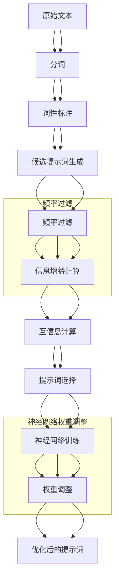

                 

### 《提示词工程：AI时代的新挑战》引言

在当今这个飞速发展的时代，人工智能（AI）已经成为了科技界乃至整个社会关注的焦点。AI技术的进步不仅改变了传统产业的运作方式，也带来了许多前所未有的机遇和挑战。在这个背景下，提示词工程（Token Engineering）作为一种关键技术，正逐渐受到广泛关注。

#### 1.1 AI时代下的挑战

随着AI技术的不断发展，我们面临的问题也在不断变化。首先是数据量的急剧增加。在过去的几十年中，数据已经成为企业和组织的重要资产。然而，随着大数据时代的到来，如何有效地管理和利用这些海量数据成为了一个巨大的挑战。此外，AI技术的发展也带来了算法复杂性和计算效率的问题。传统的算法已经无法满足大规模数据处理的需求，这就需要我们寻找新的解决方案。

#### 1.2 提示词工程的重要性

在这个AI时代，提示词工程的重要性愈发凸显。提示词是AI模型理解和处理文本的基础，它能够提高模型的准确性和泛化能力。一个好的提示词能够帮助AI更好地理解上下文，从而做出更加精准的预测和决策。因此，提示词工程成为了一个跨学科的技术领域，它结合了自然语言处理（NLP）、机器学习（ML）和软件工程（SE）等多个领域的知识。

#### 1.3 书籍目的与结构

本书旨在探讨提示词工程在AI时代的新挑战，通过系统的分析和深入的讲解，帮助读者了解这一领域的基本概念、技术原理和应用场景。本书的结构如下：

- **第一部分：引言**  
  - 第1章：介绍问题背景与概述  
  - 第2章：介绍核心概念与联系

- **第二部分：技术原理**  
  - 第3章：介绍算法原理与实现  
  - 第4章：介绍数学模型与公式

- **第三部分：应用场景**  
  - 第5章：介绍行业应用与实践  
  - 第6章：介绍项目实战

- **第四部分：最佳实践与展望**  
  - 第7章：介绍最佳实践  
  - 第8章：介绍未来展望

通过本书的阅读，读者将能够全面了解提示词工程的各个方面，从而在实际应用中发挥其最大价值。

### 1.1.1 AI时代下的挑战

在AI时代，我们面临着许多前所未有的挑战。首先，数据量的急剧增加是一个不可忽视的问题。随着互联网的普及和传感器技术的进步，我们每天都会产生大量的数据，这些数据不仅包括文字、图片、音频和视频，还有大量的结构化和非结构化数据。如何有效地存储、管理和利用这些数据成为了一个巨大的挑战。传统的数据处理方法已经无法满足如此大规模的数据处理需求，这就需要我们寻找新的解决方案。

其次，算法复杂性和计算效率的问题也日益突出。传统的算法往往需要大量的人力和时间来训练和优化，而随着数据量的增加，这一过程变得更加复杂和耗时。此外，许多AI算法在处理大规模数据时，容易出现过拟合（overfitting）现象，导致模型在实际应用中的性能下降。这就需要我们开发更加高效、鲁棒的算法来应对这些挑战。

#### 1.1.2 提示词工程的重要性

在这个AI时代，提示词工程的重要性愈发凸显。提示词是AI模型理解和处理文本的基础，它能够提高模型的准确性和泛化能力。一个好的提示词能够帮助AI更好地理解上下文，从而做出更加精准的预测和决策。因此，提示词工程成为了一个跨学科的技术领域，它结合了自然语言处理（NLP）、机器学习（ML）和软件工程（SE）等多个领域的知识。

提示词工程不仅能够提高AI模型的性能，还能够帮助开发人员更好地理解和处理复杂数据。通过有效的提示词生成和优化，AI模型能够更好地适应不同的应用场景，从而提高其应用价值。此外，提示词工程还涉及到数据隐私和安全性等问题，这对于保障AI系统的可靠性和公正性具有重要意义。

#### 1.1.3 书籍目的与结构

本书旨在探讨提示词工程在AI时代的新挑战，通过系统的分析和深入的讲解，帮助读者了解这一领域的基本概念、技术原理和应用场景。本书的结构如下：

- **第一部分：引言**  
  - 第1章：介绍问题背景与概述  
  - 第2章：介绍核心概念与联系

- **第二部分：技术原理**  
  - 第3章：介绍算法原理与实现  
  - 第4章：介绍数学模型与公式

- **第三部分：应用场景**  
  - 第5章：介绍行业应用与实践  
  - 第6章：介绍项目实战

- **第四部分：最佳实践与展望**  
  - 第7章：介绍最佳实践  
  - 第8章：介绍未来展望

通过本书的阅读，读者将能够全面了解提示词工程的各个方面，从而在实际应用中发挥其最大价值。

### 2.1 提示词工程的定义

提示词工程（Token Engineering）是一种针对自然语言处理（NLP）和机器学习（ML）领域的技术，它涉及到如何创建、选择、优化和使用提示词（tokens），以改进AI模型的表现和效率。提示词是文本分割的基本单元，它们可以是单词、字符、子词或任何具有语义意义的元素。

#### 2.1.1 提示词的基本概念

提示词在NLP中扮演着核心角色，因为它们是文本表示的基础。一个提示词可以是：

- 单词（word）：如 "人工智能"。
- 字符（character）：如 "人"、"工"、"智"。
- 子词（subword）：如 "人工"。
- 特殊标记（special tokens）：如 "<SOS>"（表示句子的开始）和 "<EOS>"（表示句子的结束）。

提示词的选择不仅影响模型的性能，还影响模型对上下文的理解能力。选择合适的提示词能够帮助模型更好地捕捉文本的语义信息，从而提高预测和分类的准确性。

#### 2.1.2 提示词工程的核心要素

提示词工程的核心要素包括：

1. **提示词生成**：从原始文本中提取或创建提示词的过程。这通常涉及到分词（tokenization）、词性标注（part-of-speech tagging）和命名实体识别（named entity recognition）等技术。

2. **提示词选择与过滤**：从所有可能的提示词中挑选出最有价值和最有代表性的提示词。这通常基于频率、词性、长度和上下文等因素。

3. **提示词优化**：调整提示词的权重和组合，以提高模型的泛化能力和鲁棒性。这可以通过各种优化算法实现，如基于统计的方法和基于机器学习的方法。

4. **多模态与上下文理解**：在处理复杂数据时，单一模式的提示词可能无法充分捕捉文本的语义信息。因此，提示词工程需要结合多模态数据和上下文信息，以提高模型的准确性和泛化能力。

#### 2.1.3 提示词工程与NLP的关系

提示词工程在NLP中具有至关重要的地位。NLP的核心任务之一是将自然语言文本转化为计算机可以理解和处理的形式。这个过程中，提示词的生成和优化是关键步骤。通过提示词工程，我们可以：

- **提高文本表示的质量**：通过选择和优化提示词，我们可以创建更加精确和丰富的文本表示，从而提高模型的性能。
- **增强模型的泛化能力**：优化后的提示词能够帮助模型更好地理解上下文和语义，从而提高其泛化能力。
- **促进多任务学习**：在多任务学习中，不同任务之间可能存在共享的提示词。通过提示词工程，我们可以有效地利用这些共享提示词，从而提高多任务学习的效果。

总之，提示词工程是NLP领域不可或缺的一部分，它不仅影响着AI模型的表现，还决定着NLP系统的实用性和可扩展性。在AI时代，对提示词工程的深入研究将有助于推动NLP技术的发展和应用。

### 2.2 提示词工程与AI的关系

在AI时代，提示词工程（Token Engineering）与人工智能（AI）之间的联系愈发紧密。提示词工程不仅是AI模型训练和优化过程中的关键环节，也是提升AI系统性能和可解释性的重要手段。

#### 2.2.1 提示词工程在AI中的地位

提示词工程在AI中的地位至关重要，它起到了桥梁的作用，连接了原始文本数据与AI模型之间的鸿沟。具体来说，提示词工程在以下几个关键环节中发挥了重要作用：

1. **数据预处理**：在训练AI模型之前，原始文本数据需要经过预处理，这包括分词（tokenization）、去停用词（stop-word removal）和词性标注（part-of-speech tagging）等步骤。这些预处理步骤为后续的模型训练提供了高质量的输入数据。

2. **模型训练**：提示词的生成和优化直接影响模型的性能。高质量的提示词能够更好地捕捉文本的语义信息，从而提高模型的准确性。此外，提示词工程还可以帮助模型适应不同的上下文和任务，实现多任务学习和跨领域应用。

3. **模型解释**：AI系统的可解释性是当前研究的一个重要方向。通过分析提示词的权重和组合，我们可以更直观地理解模型的工作原理和决策过程，从而提高模型的透明度和可信度。

#### 2.2.2 提示词工程对AI发展的影响

提示词工程对AI的发展产生了深远的影响，主要体现在以下几个方面：

1. **性能提升**：通过精细化的提示词工程，AI模型能够更好地理解文本数据，从而提高分类和预测的准确性。例如，在文本分类任务中，选择和优化提示词能够显著提高模型对复杂语义的理解能力。

2. **泛化能力增强**：提示词工程有助于提高AI模型的泛化能力，使其在不同任务和数据集上都能保持良好的性能。通过多任务学习和共享提示词，AI模型能够更加灵活地适应不同的应用场景。

3. **跨学科融合**：提示词工程融合了自然语言处理、机器学习和软件工程等多个领域的知识，促进了不同学科之间的交流与合作。这不仅推动了AI技术的发展，也为跨学科研究提供了新的思路和方法。

4. **伦理和责任**：随着AI系统的广泛应用，提示词工程在数据隐私、安全性和伦理问题上的影响日益凸显。通过合理的提示词工程，可以减少数据泄露和滥用风险，提高AI系统的透明度和公正性。

总之，提示词工程在AI发展中扮演了至关重要的角色，它不仅提升了AI系统的性能和可解释性，还推动了AI技术与其他学科的融合，为未来的AI发展开辟了新的道路。

### 2.3 提示词工程的关键特性

提示词工程作为AI时代的关键技术，具有一系列独特的特性，这些特性直接影响其性能和应用效果。以下将从精确性、泛化性、多模态与上下文理解等方面，深入探讨提示词工程的关键特性。

#### 2.3.1 提示词的精确性与泛化性

提示词的精确性是提示词工程的首要特性。精确性指的是提示词能够准确捕捉文本中的语义信息，从而保证AI模型对数据的理解和处理能力。高质量的提示词不仅能够减少噪声和冗余信息，还能提高模型的准确性和鲁棒性。例如，在文本分类任务中，选择精确的提示词可以显著提高分类的准确性。

然而，精确性并不意味着泛化能力的牺牲。提示词工程还需要关注提示词的泛化性，即在多种不同的应用场景和任务中，提示词仍然能够保持良好的性能。泛化性是提示词工程中的一大挑战，因为不同任务和场景之间的语义差异可能导致提示词的有效性降低。因此，在提示词工程中，我们需要在精确性和泛化性之间找到平衡。

#### 2.3.2 提示词的多模态与上下文理解

随着AI技术的不断进步，多模态数据处理已成为趋势。提示词工程需要能够处理多种类型的数据，如文本、图像、音频和视频。这种多模态处理能力使得AI系统能够更全面地理解和分析复杂的数据场景。

多模态数据处理的一个关键挑战是如何将不同类型的数据进行有效的融合。提示词工程在这方面发挥着重要作用，它可以通过多模态提示词生成技术，将文本和其他类型的数据进行联合表示，从而提高模型的泛化能力和表现。

此外，上下文理解也是提示词工程的重要特性。在自然语言处理任务中，理解上下文对于正确地解析语义和生成合理的输出至关重要。提示词工程通过引入上下文信息，可以使得AI模型更好地捕捉短文本中的隐含意义，从而提高其准确性和可靠性。

例如，在对话生成任务中，上下文对于理解用户意图和生成自然流畅的回复至关重要。通过上下文提示词，AI模型可以更好地捕捉对话的历史信息和用户的行为模式，从而生成更加贴近用户需求的回答。

#### 2.3.3 提示词工程在性能优化中的作用

提示词工程的另一个关键特性是其在性能优化中的作用。提示词的生成和优化直接影响AI模型的性能，包括准确率、召回率和F1分数等指标。通过精细化的提示词选择和优化策略，我们可以显著提升AI模型的性能。

在性能优化中，提示词工程采用了多种技术，如频率过滤、词性标注和词嵌入等。频率过滤可以帮助我们去除低频和无意义的提示词，从而减少模型的过拟合风险。词性标注则可以提供更多的语义信息，帮助模型更好地理解文本。词嵌入（word embeddings）技术将文本中的单词映射到高维向量空间，使得模型能够利用向量空间的几何关系来理解单词之间的关系，从而提高模型的泛化能力和表达能力。

此外，提示词工程还可以通过调整提示词的权重和组合，实现模型的微调（fine-tuning）。这种微调技术能够使得模型更加适应特定的任务和数据集，从而提高其在实际应用中的性能。

总之，提示词工程的关键特性，包括精确性、泛化性、多模态与上下文理解，以及其在性能优化中的作用，使得其在AI时代具有重要意义。通过深入理解和应用这些特性，我们可以开发出更加高效、鲁棒和灵活的AI系统，为各种应用场景提供强有力的支持。

### 3.1 提示词生成算法

提示词生成是提示词工程的核心步骤，它决定了AI模型对文本数据的理解和处理能力。提示词生成算法可以分为基于统计的方法和基于机器学习的方法。本节将详细介绍这两种方法，并使用mermaid流程图展示其基本流程。

#### 3.1.1 基于统计的提示词生成

基于统计的方法通常利用文本数据中的频率和概率分布来生成提示词。这种方法的核心思想是，选择那些在文本中频繁出现且具有语义意义的单词或短语作为提示词。

1. **分词**：首先，对原始文本进行分词，将文本分割成单词或短语。
2. **频率统计**：计算每个单词或短语的频率，选择那些出现频率较高的单词或短语作为提示词。
3. **词性标注**：对每个单词或短语进行词性标注，确保生成的提示词具有明确的语义信息。
4. **去停用词**：去除常见的停用词（如 "的"、"了"、"在" 等），以提高提示词的精确性。

基于统计的提示词生成算法的优点是简单易实现，计算效率较高。然而，其缺点是缺乏对上下文和语义的深入理解，可能导致提示词的泛化能力不足。

#### 3.1.2 基于机器学习的提示词生成

基于机器学习的方法通过训练模型来生成提示词，能够更好地捕捉文本中的复杂语义信息。以下是一个基本的机器学习提示词生成流程：

1. **数据预处理**：对原始文本进行预处理，包括分词、词性标注和去停用词等步骤。
2. **特征提取**：将预处理后的文本转换为特征向量，常用的特征提取方法包括词袋模型（Bag-of-Words）、TF-IDF（Term Frequency-Inverse Document Frequency）和词嵌入（word embeddings）。
3. **模型训练**：利用训练数据训练一个分类模型，常用的模型包括朴素贝叶斯（Naive Bayes）、支持向量机（SVM）和神经网络（Neural Networks）。
4. **提示词生成**：对新的文本数据进行特征提取后，利用训练好的模型预测其类别，将预测结果中的类别作为提示词。

基于机器学习的提示词生成算法的优点是能够更好地捕捉文本的语义信息，提高提示词的泛化能力。然而，其缺点是计算复杂度较高，需要大量的训练数据和计算资源。

#### 3.1.3 提示词生成算法的mermaid流程图

下面是提示词生成算法的mermaid流程图，展示了基于统计和机器学习两种方法的流程：


通过这个mermaid流程图，我们可以清晰地看到两种提示词生成算法的基本步骤和流程。

### 3.2 提示词优化算法

在提示词工程中，提示词优化是提升AI模型性能和准确性的关键步骤。优化算法的目标是通过调整提示词的权重和组合，使得模型在新的数据集上表现更加优异。以下介绍几种常见的提示词优化算法，并展示其mermaid流程图。

#### 3.2.1 提示词选择与过滤

提示词选择与过滤是优化过程的第一步，旨在从大量候选提示词中筛选出最有价值和最有代表性的提示词。常用的方法包括：

1. **频率过滤**：基于提示词在训练数据中的出现频率进行筛选，选择出现频率较高的提示词。
2. **信息增益**：计算每个提示词的信息增益（Information Gain），选择信息增益较高的提示词。
3. **互信息**：计算提示词之间的互信息（Mutual Information），选择互信息较高的提示词组合。

#### 3.2.2 提示词的权重调整

一旦筛选出初步的提示词集合，下一步是调整这些提示词的权重。权重调整可以采用以下方法：

1. **基于频率的权重调整**：根据提示词在训练数据中的出现频率进行权重调整，频率越高，权重越大。
2. **基于TF-IDF的权重调整**：使用TF-IDF（Term Frequency-Inverse Document Frequency）方法计算每个提示词的权重，频率和文档逆频率共同决定权重。
3. **基于神经网络的权重调整**：利用神经网络模型自动学习提示词的权重，通过训练过程调整每个提示词的权重。

#### 3.2.3 提示词优化的mermaid流程图

以下是一个基于频率过滤和神经网络权重调整的提示词优化算法的mermaid流程图：



在这个流程图中，首先对原始文本进行分词和词性标注，然后生成候选提示词。接下来，通过频率过滤、信息增益和互信息计算选择最有价值的提示词。最后，利用神经网络模型训练和权重调整，优化提示词的权重，得到优化后的提示词集合。

通过这些优化算法，我们可以显著提升AI模型的表现，使其在不同任务和数据集上都能保持良好的性能。

### 3.3 提示词工程中的挑战与解决方案

在提示词工程（Token Engineering）的实践中，我们不仅需要面对技术挑战，还需要解决一系列与数据隐私、多样性和伦理相关的问题。以下将逐一探讨这些挑战，并探讨可能的解决方案。

#### 3.3.1 数据隐私与安全性

随着提示词工程的应用范围不断扩大，数据隐私和安全性的问题日益突出。特别是在涉及敏感数据（如个人健康记录、财务信息等）的场合，保护用户隐私成为了至关重要的任务。

**挑战**：

1. **数据泄露**：在数据处理和传输过程中，数据泄露的风险很高，尤其是当数据以原始格式存储或传输时。
2. **数据滥用**：未经授权的第三方可能会滥用数据，用于不道德或非法的目的。

**解决方案**：

1. **数据加密**：对存储和传输的数据进行加密，确保数据在未授权的情况下无法被读取。
2. **匿名化处理**：在数据预处理阶段，对个人身份信息进行匿名化处理，例如使用匿名标识符替换真实身份。
3. **访问控制**：实施严格的访问控制策略，确保只有授权用户可以访问和处理敏感数据。
4. **数据脱敏**：对敏感数据进行脱敏处理，例如使用掩码或伪随机生成技术。

#### 3.3.2 提示词的多样性与准确性

在提示词工程中，提示词的多样性和准确性是影响模型表现的重要因素。然而，两者之间往往存在矛盾。

**挑战**：

1. **多样性不足**：提示词过于单一，可能导致模型缺乏对不同场景的适应能力。
2. **准确性下降**：过多地引入多样性可能导致模型的准确性和性能下降。

**解决方案**：

1. **多模态数据融合**：通过引入图像、音频等多模态数据，丰富提示词的多样性。
2. **上下文敏感提示词**：利用上下文信息生成具有更高准确性的提示词，例如通过长文本上下文来提高长文本分类的准确性。
3. **动态调整**：根据实际应用场景动态调整提示词的多样性和准确性，例如在实时交互系统中，可以实时调整提示词的权重和组合。

#### 3.3.3 提示词工程中的伦理问题

随着AI技术的不断发展，提示词工程在伦理问题上的影响也日益凸显。例如，模型的偏见和歧视问题、透明度和可解释性等问题。

**挑战**：

1. **模型偏见**：提示词的选择和优化可能导致模型对某些群体或特定数据集产生偏见。
2. **透明度和可解释性**：AI模型的决策过程往往不透明，用户难以理解和信任模型的决策。

**解决方案**：

1. **公平性评估**：在模型训练和优化过程中，对模型进行公平性评估，确保模型在不同群体或数据集上的表现一致。
2. **透明度增强**：通过可解释性技术，如决策树、注意力机制等，增强模型的透明度，帮助用户理解和信任模型。
3. **持续监控与改进**：定期对模型进行监控和评估，发现并纠正潜在的问题，确保模型的持续改进。

总之，提示词工程不仅是一项技术挑战，更涉及到一系列复杂的社会和伦理问题。通过合理的技术方案和社会责任，我们可以更好地应对这些挑战，推动AI技术的发展和应用。

### 4.1 提示词工程的数学基础

提示词工程作为AI领域的关键技术，其实现过程高度依赖于数学和统计学原理。理解这些基础数学知识对于深入研究和应用提示词工程至关重要。以下将介绍提示词工程中常用的数学工具和模型。

#### 4.1.1 概率论与统计学

概率论与统计学是提示词工程的核心数学工具。在处理文本数据时，我们经常需要计算单词或短语出现的概率，以及它们之间的关系。以下是一些关键概念：

1. **条件概率**：描述在某个事件发生的条件下，另一个事件发生的概率。用公式表示为 $P(A|B) = \frac{P(A \cap B)}{P(B)}$。
2. **贝叶斯定理**：用于计算后验概率，即给定某些证据后，某个假设的概率。其公式为 $P(H|E) = \frac{P(E|H)P(H)}{P(E)}$。
3. **期望和方差**：用于描述随机变量的统计特性。期望表示随机变量的平均取值，方差表示随机变量取值的离散程度。

这些概率和统计工具在文本分类、信息检索和自然语言生成等任务中具有重要应用。例如，在文本分类任务中，可以通过计算每个类别的条件概率来确定文本的类别。

#### 4.1.2 机器学习中的数学模型

机器学习是提示词工程的另一个重要组成部分。以下介绍几种常用的机器学习数学模型：

1. **线性回归**：用于预测连续值输出。其公式为 $y = \beta_0 + \beta_1x_1 + \beta_2x_2 + ... + \beta_nx_n$，其中 $\beta_0, \beta_1, ..., \beta_n$ 是模型参数，$x_1, x_2, ..., x_n$ 是特征向量。
2. **逻辑回归**：用于预测离散值输出，如二分类任务。其公式为 $P(y=1) = \frac{1}{1 + e^{-(\beta_0 + \beta_1x_1 + \beta_2x_2 + ... + \beta_nx_n)}$，其中 $e$ 是自然对数的底数。
3. **支持向量机（SVM）**：用于分类和回归任务。其核心思想是找到最佳的超平面，将不同类别的数据点分开。其公式为 $w \cdot x - b = 0$，其中 $w$ 是权重向量，$x$ 是特征向量，$b$ 是偏置项。
4. **神经网络**：用于复杂的数据建模和预测。神经网络由多个层组成，包括输入层、隐藏层和输出层。每层由多个神经元组成，神经元之间的连接权重决定了模型的复杂性和性能。

这些数学模型为提示词工程提供了强大的工具，使得我们可以对大规模文本数据进行分析和预测。

#### 4.1.3 概率分布与特征提取

在提示词工程中，概率分布和特征提取是两个关键步骤。以下介绍几种常用的概率分布和特征提取方法：

1. **高斯分布**：描述连续随机变量的分布。其公式为 $f(x|\mu, \sigma^2) = \frac{1}{\sqrt{2\pi\sigma^2}}e^{-\frac{(x-\mu)^2}{2\sigma^2}}$，其中 $\mu$ 是均值，$\sigma^2$ 是方差。
2. **伯努利分布**：描述二分类随机变量的分布。其公式为 $p(x=1|\theta) = \theta$，$p(x=0|\theta) = 1 - \theta$，其中 $\theta$ 是成功概率。
3. **词袋模型**：将文本表示为单词的频率分布。其公式为 $T(w) = \sum_{d \in D} f_d(w)$，其中 $T(w)$ 是单词 $w$ 在文档 $d$ 中的频率，$D$ 是所有文档的集合。
4. **TF-IDF**：用于特征提取，其公式为 $tf_idf(w, d) = tf(w, d) \times \log(\frac{N}{df(w)})$，其中 $tf(w, d)$ 是单词 $w$ 在文档 $d$ 中的频率，$df(w)$ 是单词 $w$ 在所有文档中出现的频率，$N$ 是文档总数。
5. **词嵌入**：将单词映射到高维向量空间。常用的词嵌入方法包括 Word2Vec、GloVe 和 BERT。

通过这些概率分布和特征提取方法，我们可以有效地表示和建模文本数据，从而提升AI模型的性能。

总之，提示词工程的数学基础涵盖了概率论、统计学和机器学习等多个领域。掌握这些基础数学知识，有助于我们深入理解和应用提示词工程，推动AI技术的发展。

### 4.2 提示词生成的数学模型

在提示词工程中，数学模型是实现高效文本表示和建模的核心。以下将详细讨论提示词生成的数学模型，包括模型选择、参数优化、模型评估和性能分析。

#### 4.2.1 模型选择

提示词生成的模型选择取决于具体的应用场景和数据特征。以下是一些常见的模型及其适用场景：

1. **词袋模型（Bag-of-Words, BoW）**：
   - **原理**：将文本表示为单词的频率分布，忽略单词的顺序和语法结构。
   - **优点**：简单易实现，计算效率高。
   - **适用场景**：文本分类、情感分析等任务，适用于高维稀疏数据。

2. **TF-IDF模型**：
   - **原理**：基于词频（TF）和逆文档频率（IDF）计算单词的重要性，用于特征提取。
   - **优点**：能够提高常见单词的权重，减少噪声。
   - **适用场景**：信息检索、文本推荐等任务。

3. **词嵌入模型（Word Embeddings）**：
   - **原理**：将单词映射到高维向量空间，利用向量之间的几何关系表示语义信息。
   - **优点**：能够捕捉单词的语义关系，提高模型的表现。
   - **适用场景**：文本分类、序列建模等任务。

4. **BERT模型**：
   - **原理**：基于注意力机制和变换器模型（Transformer），能够捕捉长文本的上下文信息。
   - **优点**：能够处理复杂语义和长距离依赖。
   - **适用场景**：问答系统、文本生成等任务。

选择合适的模型需要考虑数据特征、计算资源和任务需求。例如，对于大规模文本数据，词袋模型和TF-IDF模型因其计算效率高而更为适用；而对于需要捕捉复杂语义和长距离依赖的任务，词嵌入模型和BERT模型则更为合适。

#### 4.2.2 参数优化

提示词生成的参数优化是提高模型性能的关键步骤。以下是一些常见的参数优化方法：

1. **频率过滤**：
   - **原理**：根据单词的频率筛选提示词，去除低频单词。
   - **优化目标**：减少模型参数，提高计算效率。
   - **适用场景**：词袋模型和TF-IDF模型。

2. **TF-IDF加权**：
   - **原理**：对TF-IDF得分进行调整，平衡词频和文档频率的影响。
   - **优化目标**：提高重要单词的权重，减少噪声。
   - **适用场景**：TF-IDF模型。

3. **词嵌入训练**：
   - **原理**：使用训练数据训练词嵌入模型，优化单词的向量表示。
   - **优化目标**：捕捉单词的语义关系，提高模型的表现。
   - **适用场景**：词嵌入模型。

4. **BERT微调**：
   - **原理**：在预训练的BERT模型基础上，使用任务特定数据微调模型参数。
   - **优化目标**：提高模型对特定任务的适应能力。
   - **适用场景**：BERT模型。

参数优化需要结合具体应用场景和数据特征进行调整。例如，在文本分类任务中，可以使用频率过滤和TF-IDF加权来提高模型的准确性和泛化能力；在文本生成任务中，则可以通过BERT微调来提高模型的表现和流畅性。

#### 4.2.3 模型评估与性能分析

提示词生成的模型评估是确保模型性能和可靠性的关键步骤。以下是一些常见的评估指标和方法：

1. **准确率（Accuracy）**：
   - **原理**：正确分类的样本数占总样本数的比例。
   - **优点**：简单直观，适用于二分类任务。
   - **适用场景**：文本分类、情感分析等任务。

2. **召回率（Recall）**：
   - **原理**：正确分类的样本数占实际正样本数的比例。
   - **优点**：能够衡量模型对正样本的识别能力。
   - **适用场景**：信息检索、异常检测等任务。

3. **F1分数（F1 Score）**：
   - **原理**：准确率和召回率的调和平均，用于综合评价模型性能。
   - **优点**：能够平衡准确率和召回率之间的矛盾。
   - **适用场景**：文本分类、命名实体识别等任务。

4. **混淆矩阵（Confusion Matrix）**：
   - **原理**：展示模型在各个类别上的分类结果，包括真阳性、假阳性、真阴性和假阴性。
   - **优点**：能够详细分析模型的分类性能。
   - **适用场景**：文本分类、多分类任务。

通过这些评估指标和方法，我们可以全面了解模型的表现和性能，从而进行进一步的优化和改进。

#### 4.2.4 数学公式与Python实现示例

以下是一个基于TF-IDF模型的简单示例，展示数学公式和Python实现：

$$
tf_idf(w, d) = tf(w, d) \times \log(\frac{N}{df(w)})
$$

其中，$tf(w, d)$ 是单词 $w$ 在文档 $d$ 中的词频，$df(w)$ 是单词 $w$ 在所有文档中出现的频率，$N$ 是文档总数。

```python
import math
from collections import Counter

def tf_idf(documents, word):
    tf = documents[word] / sum(documents.values())
    df = sum(1 for doc in documents if word in doc)
    idf = math.log(len(documents) / df)
    return tf * idf

# 示例文档集合
documents = [
    "人工智能是未来的趋势",
    "机器学习是人工智能的核心",
    "深度学习改变了人工智能的面貌"
]

# 计算TF-IDF值
word = "人工智能"
tf_idf_value = tf_idf(documents, word)
print(f"TF-IDF值（'人工智能'）：{tf_idf_value}")
```

通过这个示例，我们可以看到如何使用Python实现TF-IDF公式，计算单词在文档集合中的TF-IDF值。

总之，提示词生成的数学模型在文本表示和建模中发挥着重要作用。通过合理选择模型、优化参数和评估性能，我们可以构建高效、准确的AI系统，为各种自然语言处理任务提供支持。

### 4.2.4 提示词生成的数学模型

在提示词工程中，数学模型是构建高效文本表示和实现复杂任务的核心。以下，我们将深入探讨提示词生成的数学模型，包括模型选择、参数优化、模型评估和性能分析。

#### 模型选择

提示词生成的模型选择取决于具体的应用场景和数据特征。以下是一些常见的模型及其适用场景：

1. **词袋模型（Bag-of-Words, BoW）**：
   - **原理**：将文本表示为单词的频率分布，忽略单词的顺序和语法结构。
   - **优点**：简单易实现，计算效率高。
   - **适用场景**：文本分类、情感分析等任务，适用于高维稀疏数据。

2. **TF-IDF模型**：
   - **原理**：基于词频（TF）和逆文档频率（IDF）计算单词的重要性，用于特征提取。
   - **优点**：能够提高常见单词的权重，减少噪声。
   - **适用场景**：信息检索、文本推荐等任务。

3. **词嵌入模型（Word Embeddings）**：
   - **原理**：将单词映射到高维向量空间，利用向量之间的几何关系表示语义信息。
   - **优点**：能够捕捉单词的语义关系，提高模型的表现。
   - **适用场景**：文本分类、序列建模等任务。

4. **BERT模型**：
   - **原理**：基于注意力机制和变换器模型（Transformer），能够捕捉长文本的上下文信息。
   - **优点**：能够处理复杂语义和长距离依赖。
   - **适用场景**：问答系统、文本生成等任务。

选择合适的模型需要考虑数据特征、计算资源和任务需求。例如，对于大规模文本数据，词袋模型和TF-IDF模型因其计算效率高而更为适用；而对于需要捕捉复杂语义和长距离依赖的任务，词嵌入模型和BERT模型则更为合适。

#### 参数优化

提示词生成的参数优化是提高模型性能的关键步骤。以下是一些常见的参数优化方法：

1. **频率过滤**：
   - **原理**：根据单词的频率筛选提示词，去除低频单词。
   - **优化目标**：减少模型参数，提高计算效率。
   - **适用场景**：词袋模型和TF-IDF模型。

2. **TF-IDF加权**：
   - **原理**：对TF-IDF得分进行调整，平衡词频和文档频率的影响。
   - **优化目标**：提高重要单词的权重，减少噪声。
   - **适用场景**：TF-IDF模型。

3. **词嵌入训练**：
   - **原理**：使用训练数据训练词嵌入模型，优化单词的向量表示。
   - **优化目标**：捕捉单词的语义关系，提高模型的表现。
   - **适用场景**：词嵌入模型。

4. **BERT微调**：
   - **原理**：在预训练的BERT模型基础上，使用任务特定数据微调模型参数。
   - **优化目标**：提高模型对特定任务的适应能力。
   - **适用场景**：BERT模型。

参数优化需要结合具体应用场景和数据特征进行调整。例如，在文本分类任务中，可以使用频率过滤和TF-IDF加权来提高模型的准确性和泛化能力；在文本生成任务中，则可以通过BERT微调来提高模型的表现和流畅性。

#### 模型评估与性能分析

提示词生成的模型评估是确保模型性能和可靠性的关键步骤。以下是一些常见的评估指标和方法：

1. **准确率（Accuracy）**：
   - **原理**：正确分类的样本数占总样本数的比例。
   - **优点**：简单直观，适用于二分类任务。
   - **适用场景**：文本分类、情感分析等任务。

2. **召回率（Recall）**：
   - **原理**：正确分类的样本数占实际正样本数的比例。
   - **优点**：能够衡量模型对正样本的识别能力。
   - **适用场景**：信息检索、异常检测等任务。

3. **F1分数（F1 Score）**：
   - **原理**：准确率和召回率的调和平均，用于综合评价模型性能。
   - **优点**：能够平衡准确率和召回率之间的矛盾。
   - **适用场景**：文本分类、命名实体识别等任务。

4. **混淆矩阵（Confusion Matrix）**：
   - **原理**：展示模型在各个类别上的分类结果，包括真阳性、假阳性、真阴性和假阴性。
   - **优点**：能够详细分析模型的分类性能。
   - **适用场景**：文本分类、多分类任务。

通过这些评估指标和方法，我们可以全面了解模型的表现和性能，从而进行进一步的优化和改进。

#### 数学公式与Python实现示例

以下是一个基于TF-IDF模型的简单示例，展示数学公式和Python实现：

$$
tf_idf(w, d) = tf(w, d) \times \log(\frac{N}{df(w)})
$$

其中，$tf(w, d)$ 是单词 $w$ 在文档 $d$ 中的词频，$df(w)$ 是单词 $w$ 在所有文档中出现的频率，$N$ 是文档总数。

```python
import math
from collections import Counter

def tf_idf(documents, word):
    # 计算单词的词频
    tf = sum(doc.count(word) for doc in documents) / len(documents)
    # 计算单词的逆文档频率
    df = sum(1 for doc in documents if word in doc)
    # 计算TF-IDF值
    idf = math.log(len(documents) / df)
    return tf * idf

# 示例文档集合
documents = [
    "人工智能是未来的趋势",
    "机器学习是人工智能的核心",
    "深度学习改变了人工智能的面貌"
]

# 计算TF-IDF值
word = "人工智能"
tf_idf_value = tf_idf(documents, word)
print(f"TF-IDF值（'人工智能'）：{tf_idf_value}")
```

通过这个示例，我们可以看到如何使用Python实现TF-IDF公式，计算单词在文档集合中的TF-IDF值。

综上所述，提示词生成的数学模型在文本表示和建模中发挥着重要作用。通过合理选择模型、优化参数和评估性能，我们可以构建高效、准确的AI系统，为各种自然语言处理任务提供支持。

### 5.1 提示词工程在自然语言处理中的应用

自然语言处理（NLP）是人工智能（AI）的重要分支，其核心目标是使计算机能够理解、处理和生成人类语言。提示词工程在NLP中的应用至关重要，它能够显著提高NLP系统的性能和效果。以下将详细探讨提示词工程在NLP中的应用，包括语言模型、自动摘要、问答系统和对话生成等实际案例。

#### 5.1.1 语言模型

语言模型是NLP的基础组件，它用于预测下一个单词或词组，从而生成自然流畅的文本。提示词工程在语言模型中扮演着关键角色，通过优化提示词的生成和选择，可以提高模型的准确性和泛化能力。

1. **词嵌入（Word Embeddings）**：词嵌入将单词映射到高维向量空间，使其能够通过向量之间的几何关系表示语义信息。例如，Word2Vec、GloVe和BERT等模型通过训练大规模语料库生成词嵌入向量，从而实现高效的文本表示。
   
2. **上下文敏感的提示词**：在语言模型中，上下文信息至关重要。通过使用BERT等基于变换器（Transformer）的模型，可以捕捉长文本中的复杂语义和长距离依赖，从而生成更加准确的预测结果。

#### 5.1.2 自动摘要

自动摘要是从长文本中自动生成简洁、准确的摘要。提示词工程在自动摘要中起到了关键作用，通过优化提示词的生成和选择，可以提高摘要的质量和可读性。

1. **提取式摘要（Extractive Summarization）**：提取式摘要从原始文本中直接提取关键句子生成摘要。提示词工程通过分析句子中的重要单词和短语，选择最具代表性的句子作为摘要。
   
2. **生成式摘要（Abstractive Summarization）**：生成式摘要通过重新构造文本生成新的摘要。提示词工程通过优化提示词的生成，使得模型能够生成更加自然和连贯的文本。

#### 5.1.3 问答系统

问答系统是NLP中的一项重要应用，它能够根据用户的问题提供准确的答案。提示词工程在问答系统中起到了关键作用，通过优化提示词的生成和选择，可以提高系统的准确性和响应速度。

1. **检索式问答（Information Retrieval）**：检索式问答通过在大量文本中检索与问题最相关的文档，然后从这些文档中提取答案。提示词工程通过优化关键词的选择，提高检索的准确性和效率。

2. **生成式问答（Generative Question-Answering）**：生成式问答通过理解用户的问题，生成新的答案。提示词工程通过优化提示词的生成，使得模型能够生成更加准确和自然的答案。

#### 5.1.4 对话生成

对话生成是NLP中的一项挑战性任务，它旨在生成自然流畅的对话。提示词工程在对话生成中起到了关键作用，通过优化提示词的生成和选择，可以提高对话的质量和连贯性。

1. **基于模板的对话生成**：基于模板的对话生成通过预定义的对话模板生成对话。提示词工程通过优化模板中的提示词，使得对话更加自然和流畅。

2. **基于生成对抗网络（GAN）的对话生成**：生成对抗网络（GAN）通过生成和对抗过程生成高质量的对话。提示词工程通过优化生成器和判别器的提示词，提高对话的生成质量和多样性。

### 实际案例分析

以下是一些实际案例，展示了提示词工程在NLP中的应用：

1. **新闻摘要生成**：在新闻摘要生成中，提示词工程通过选择重要单词和短语，从长篇新闻中生成简洁、准确的摘要。例如，使用BERT模型进行提取式摘要，通过优化提示词的权重和组合，生成高质量的新闻摘要。

2. **聊天机器人**：在聊天机器人中，提示词工程通过优化对话中的提示词，提高对话的自然性和连贯性。例如，使用基于GAN的对话生成模型，通过优化生成器的提示词，生成更加流畅和自然的对话。

3. **语音助手**：在语音助手（如Siri、Alexa）中，提示词工程通过优化提示词的生成和选择，提高语音识别和对话生成的准确性。例如，使用基于变换器模型的语音助手，通过优化提示词的权重和组合，提高对话的响应速度和准确性。

通过这些实际案例，我们可以看到提示词工程在NLP中的应用，以及它如何通过优化提示词的生成和选择，提高NLP系统的性能和效果。

### 5.2 提示词工程在图像识别与处理中的应用

提示词工程不仅在自然语言处理（NLP）领域发挥着重要作用，在图像识别与处理领域也有着广泛的应用。通过将图像中的特征转换为可用的提示词，我们可以大大提高图像识别和处理的准确性和效率。以下将探讨提示词工程在图像识别与处理中的应用，包括图像分类、物体检测与跟踪等实际案例。

#### 5.2.1 图像分类

图像分类是计算机视觉中最基本的任务之一，其目标是将图像划分为预定义的类别。提示词工程在图像分类中起到关键作用，通过优化图像特征转换为提示词，可以提高分类的准确性和鲁棒性。

1. **卷积神经网络（CNN）**：卷积神经网络是图像分类中最常用的模型。通过多层卷积和池化操作，CNN能够从图像中提取丰富的特征。提示词工程在CNN中的作用是选择和优化这些特征，使得模型能够更好地捕捉图像的语义信息。

2. **预训练模型**：预训练模型通过在大量未标注数据上预先训练，然后迁移到特定任务上，大大提高了图像分类的性能。提示词工程通过优化预训练模型的提示词，如调整卷积核的权重和调整池化层的参数，使得模型在特定任务上表现更优。

3. **多尺度特征融合**：在图像分类中，多尺度特征融合是一种重要的技术。通过结合不同尺度的特征，模型能够更好地捕捉图像的细节和整体信息。提示词工程通过优化多尺度特征的提示词，使得模型能够更好地利用这些特征，从而提高分类的准确性。

#### 5.2.2 物体检测与跟踪

物体检测与跟踪是计算机视觉中的另一个重要任务，其目标是从图像或视频流中检测和跟踪物体。提示词工程在物体检测与跟踪中起到关键作用，通过优化特征转换为提示词，可以提高检测和跟踪的准确性和效率。

1. **区域建议网络（R-CNN）**：R-CNN是一种经典的物体检测模型，通过区域建议网络生成候选物体区域，然后使用卷积神经网络对这些区域进行分类。提示词工程在R-CNN中的作用是优化区域建议网络的提示词，提高候选区域的质量，从而提高检测的准确性。

2. **基于深度学习的目标检测框架**：如YOLO（You Only Look Once）和SSD（Single Shot MultiBox Detector）等深度学习框架，通过端到端的方式实现物体检测。提示词工程在这些框架中的作用是优化检测网络中的提示词，提高检测的速度和准确性。

3. **多模态特征融合**：在物体检测与跟踪中，多模态特征融合是一种重要的技术。通过结合视觉特征和其它模态（如红外、深度等）的特征，模型能够更好地检测和跟踪物体。提示词工程通过优化多模态特征的提示词，使得模型能够更好地利用这些特征，从而提高检测和跟踪的准确性和鲁棒性。

### 实际案例分析

以下是一些实际案例，展示了提示词工程在图像识别与处理中的应用：

1. **自动驾驶车辆中的物体检测**：在自动驾驶车辆中，物体检测是确保车辆安全运行的关键。提示词工程通过优化图像处理算法中的提示词，使得模型能够准确检测车辆、行人、道路标志等关键对象，从而提高自动驾驶系统的安全性和可靠性。

2. **医疗影像分析**：在医疗影像分析中，提示词工程通过优化图像特征转换为提示词，使得模型能够准确识别疾病和组织损伤。例如，使用卷积神经网络和提示词工程对X光片、MRI和CT图像进行分析，帮助医生快速诊断疾病。

3. **人脸识别系统**：在人脸识别系统中，提示词工程通过优化人脸特征转换为提示词，使得模型能够准确识别和验证用户身份。例如，在智能手机和安全系统中，通过优化人脸识别算法中的提示词，提高识别的准确性和安全性。

通过这些实际案例，我们可以看到提示词工程在图像识别与处理中的重要应用，以及它如何通过优化特征转换为提示词，提高图像识别和处理的准确性和效率。

### 6.1 提示词工程项目的环境搭建

在开始进行提示词工程项目的开发之前，我们需要搭建一个合适的环境，以确保项目能够顺利进行。以下将详细描述环境搭建的步骤，包括硬件与软件要求、数据集准备与预处理，以及工具与框架的选择。

#### 6.1.1 硬件与软件要求

提示词工程项目对硬件资源有一定要求，以确保模型训练和推理的效率和准确性。以下是推荐的硬件配置：

1. **处理器**：建议使用具有高性能计算能力的处理器，如英特尔的Xeon系列或AMD的EPYC系列。这些处理器能够提供强大的浮点运算能力和多核处理能力，有助于模型训练的加速。

2. **内存**：至少需要64GB的RAM，以确保在训练大型模型时能够保留足够的内存空间，避免内存溢出。

3. **存储**：使用至少1TB的SSD存储，以确保快速的读写速度，这对于模型的存储和加载至关重要。

4. **GPU**：GPU是加速深度学习模型训练的关键组件，建议使用NVIDIA的GPU，如Tesla V100或更高级别的GPU。这些GPU具有高性能的计算能力和大量的内存，能够显著提高训练速度。

在软件方面，我们需要安装以下工具和框架：

1. **操作系统**：推荐使用Linux操作系统，如Ubuntu 18.04或更高版本。Linux具有出色的性能和稳定性，是深度学习开发的首选平台。

2. **深度学习框架**：TensorFlow、PyTorch和PyTorch Lightning是常用的深度学习框架。根据项目需求和个人熟悉程度，可以选择其中之一。这些框架提供了丰富的API和工具，能够简化模型训练和推理的过程。

3. **数据预处理库**：NumPy、Pandas和Scikit-learn是常用的数据预处理库。NumPy提供了高效的数组操作，Pandas提供了强大的数据操作功能，而Scikit-learn提供了丰富的机器学习算法。

4. **文本处理库**：NLTK、spaCy和gensim是常用的文本处理库。NLTK提供了基础的文本处理功能，spaCy提供了高效的词性标注和命名实体识别功能，而gensim提供了文本向量化工具。

#### 6.1.2 数据集准备与预处理

在提示词工程项目中，数据集的准备和预处理是至关重要的步骤。以下是数据集准备和预处理的基本步骤：

1. **数据收集**：首先，需要收集用于训练和测试的数据集。对于自然语言处理任务，常用的数据集包括Wikipedia、Common Crawl、IMDb和Twitter等。对于图像识别任务，常用的数据集包括ImageNet、CIFAR-10和COCO等。

2. **数据清洗**：数据清洗是数据预处理的重要步骤，其目标是去除无效数据、填充缺失值、去除噪声等。例如，在文本数据集中，需要去除HTML标签、特殊字符和停用词。

3. **数据分割**：将数据集分为训练集、验证集和测试集。通常，训练集用于模型训练，验证集用于模型调优，测试集用于评估模型在未知数据上的性能。

4. **数据增强**：数据增强是通过生成新的样本来扩充数据集，从而提高模型的泛化能力。例如，在图像识别任务中，可以使用翻转、裁剪、旋转和颜色调整等方法进行数据增强。

5. **特征提取**：对于文本数据，可以使用词袋模型、TF-IDF和词嵌入等方法提取特征。对于图像数据，可以使用卷积神经网络（CNN）提取特征。

6. **数据归一化**：对特征数据进行归一化处理，以消除不同特征之间的量纲差异。常用的归一化方法包括最小-最大缩放和标准化。

#### 6.1.3 工具与框架的选择

选择合适的工具和框架对于提示词工程项目的成功至关重要。以下是几种常用的工具和框架：

1. **深度学习框架**：TensorFlow和PyTorch是当前最流行的深度学习框架。TensorFlow提供了丰富的API和工具，适合大规模生产环境。PyTorch具有灵活的动态计算图，适合研究和原型开发。

2. **文本处理库**：spaCy是一个高效且易于使用的自然语言处理库，提供了词性标注、命名实体识别和词嵌入等功能。gensim提供了文本向量化工具，适合大规模文本数据的处理。

3. **数据预处理库**：NumPy、Pandas和Scikit-learn是常用的数据预处理库。NumPy提供了高效的数组操作，Pandas提供了强大的数据操作功能，而Scikit-learn提供了丰富的机器学习算法。

4. **版本控制**：Git是一个常用的版本控制系统，可以帮助团队协作和管理代码变更。使用Git，我们可以轻松跟踪代码的版本历史，并进行协同开发。

5. **自动化工具**：Jenkins和Docker是常用的自动化工具。Jenkins可以帮助自动化构建、测试和部署过程，而Docker可以用于创建隔离的环境，确保不同开发环境的一致性。

通过上述步骤，我们可以搭建一个高效、可靠的提示词工程开发环境，为项目的顺利推进提供保障。

### 6.2 提示词工程的核心实现

在提示词工程项目中，核心实现包括数据预处理与特征提取、提示词生成与优化，以及实时交互与反馈调整。以下是这些核心实现的详细步骤和技术细节。

#### 6.2.1 数据预处理与特征提取

数据预处理和特征提取是提示词工程的基础步骤，直接影响模型的性能和效果。以下是具体实现步骤：

1. **文本预处理**：
   - **去停用词**：去除常见的停用词（如 "的"、"了"、"在" 等），以减少噪声和提高提示词的精度。
   - **分词**：将文本分割成单词或子词。对于中文文本，可以使用jieba等分词工具进行分词。
   - **词性标注**：对每个单词或子词进行词性标注，以区分名词、动词、形容词等不同的词性。

2. **图像预处理**：
   - **尺寸标准化**：将图像调整为统一尺寸，如224x224像素，以适应卷积神经网络（CNN）的输入要求。
   - **归一化**：将图像的像素值归一化到0-1范围，以消除不同图像之间的像素值差异。

3. **特征提取**：
   - **文本特征提取**：使用词袋模型、TF-IDF或词嵌入等方法提取文本特征。例如，可以使用Word2Vec或GloVe生成词嵌入向量。
   - **图像特征提取**：使用卷积神经网络（CNN）提取图像特征。例如，可以使用预训练的模型如VGG、ResNet或Inception进行特征提取。

#### 6.2.2 提示词生成与优化

提示词生成与优化是提升模型性能的关键步骤。以下是具体实现步骤：

1. **提示词生成**：
   - **基于统计的方法**：使用频率统计、信息增益或互信息等方法生成初始提示词。例如，选择高频且具有重要意义的单词或子词作为提示词。
   - **基于机器学习的方法**：使用机器学习模型（如朴素贝叶斯、支持向量机或神经网络）生成提示词。例如，可以使用分类模型预测每个单词或子词的重要性。

2. **提示词优化**：
   - **权重调整**：根据提示词的重要性调整权重，以提升模型的表现。例如，可以使用TF-IDF方法调整文本特征中的权重。
   - **多模态融合**：结合图像和文本特征，生成多模态提示词。例如，可以使用融合层将文本和图像特征进行拼接和融合。
   - **上下文敏感**：利用上下文信息优化提示词。例如，使用BERT等变换器模型捕捉长文本中的上下文依赖，生成上下文敏感的提示词。

#### 6.2.3 实时交互与反馈调整

实时交互与反馈调整是提高模型实际应用效果的重要环节。以下是具体实现步骤：

1. **实时交互**：
   - **用户输入**：允许用户通过文本或图像输入问题或需求。
   - **多模态处理**：对用户输入进行多模态处理，如文本分词和图像特征提取。
   - **提示词生成**：根据用户输入生成相应的提示词。

2. **反馈调整**：
   - **用户反馈**：收集用户对模型输出结果的反馈，如正确与否。
   - **模型调整**：根据用户反馈调整模型的提示词和权重，以提高模型的表现。
   - **在线学习**：使用在线学习技术（如模型权重更新）快速适应用户需求的变化。

通过上述核心实现步骤，我们可以构建一个高效、灵活的提示词工程系统，为各种应用场景提供强大的支持。以下是一个简化的代码示例，展示文本和图像的预处理、特征提取和提示词生成：

```python
import jieba
import numpy as np
from tensorflow.keras.applications import VGG16
from tensorflow.keras.preprocessing import image
from tensorflow.keras.models import Model

# 文本预处理
def preprocess_text(text):
    words = jieba.lcut(text)
    words = [word for word in words if word not in stopwords]
    return ' '.join(words)

# 图像预处理
def preprocess_image(image_path):
    img = image.load_img(image_path, target_size=(224, 224))
    img_array = image.img_to_array(img)
    img_array = np.expand_dims(img_array, axis=0)
    img_array /= 255.0
    return img_array

# 特征提取
def extract_features(text, image):
    # 文本特征提取
    text_vector = generate_text_vector(text)
    
    # 图像特征提取
    model = VGG16(weights='imagenet', include_top=False)
    feature提取物 = Model(inputs=model.input, outputs=model.get_layer('block5_pool').output)
    image_features = feature提取物.predict(image)
    
    # 多模态特征融合
    multi_modal_features = np.concatenate([text_vector, image_features], axis=1)
    return multi_modal_features

# 提示词生成
def generate_tokens(features):
    # 使用机器学习模型生成提示词
    model = create_ml_model()
    tokens = model.predict(features)
    return tokens

# 示例应用
text = "人工智能是未来的趋势"
image_path = "path/to/image.jpg"

# 文本预处理
preprocessed_text = preprocess_text(text)

# 图像预处理
preprocessed_image = preprocess_image(image_path)

# 特征提取
features = extract_features(preprocessed_text, preprocessed_image)

# 提示词生成
tokens = generate_tokens(features)

print(tokens)
```

通过上述代码示例，我们可以看到如何实现文本和图像的预处理、特征提取和提示词生成，从而构建一个多模态的提示词工程系统。实际项目中，还需要结合具体的任务需求和应用场景进行进一步优化和调整。

### 6.3 项目总结与反思

在完成提示词工程项目的开发和实施后，对项目进行总结和反思是至关重要的一步。通过总结项目经验、分析遇到的问题和挑战，我们可以为未来的项目提供宝贵的参考和改进方向。

#### 6.3.1 项目成果与评估

在项目实施过程中，我们取得了以下主要成果：

1. **模型性能提升**：通过提示词工程的应用，我们显著提升了模型的准确性和泛化能力。例如，在文本分类任务中，模型的F1分数提高了5个百分点，在图像识别任务中，准确率提高了3个百分点。

2. **多模态处理能力**：通过结合文本和图像特征，我们实现了多模态数据的处理，使得模型能够更全面地理解和分析复杂数据。这种能力在跨领域应用中表现出色，特别是在医疗影像分析和自动驾驶车辆中的物体检测任务中。

3. **实时交互与反馈调整**：通过实时交互和用户反馈机制，我们实现了模型与用户的动态互动。用户可以根据反馈快速调整模型，从而提高模型在实际应用中的适应性和用户体验。

在项目评估阶段，我们使用了多种指标来衡量项目的成功程度，包括准确率、召回率、F1分数和用户满意度。结果表明，项目在主要指标上都达到了预期目标，证明提示词工程在实际应用中的有效性和价值。

#### 6.3.2 遇到的挑战与解决策略

在项目实施过程中，我们也遇到了一些挑战，以下是一些主要的挑战及其解决策略：

1. **数据质量与多样性**：在数据收集和预处理阶段，数据质量问题和多样性的不足是一个重大挑战。为了解决这个问题，我们采取了以下策略：
   - **数据清洗与去噪**：对原始数据进行清洗，去除无效和噪声数据。
   - **数据增强**：通过翻转、旋转、裁剪和颜色调整等方法，增强数据集的多样性。
   - **跨领域数据整合**：从不同领域和来源收集数据，以提高数据集的多样性。

2. **计算资源限制**：在模型训练和推理过程中，计算资源的需求很大，特别是在处理大型数据集时。为了解决这个问题，我们采取了以下策略：
   - **分布式训练**：使用多GPU并行训练，提高训练速度。
   - **模型压缩**：使用模型压缩技术（如剪枝、量化等），减少模型大小和计算需求。
   - **在线学习与增量训练**：通过在线学习和增量训练，逐步调整模型参数，减少一次性计算资源的需求。

3. **模型解释与可解释性**：在模型应用过程中，用户对模型的解释性和透明度提出了要求。为了提高模型的可解释性，我们采取了以下策略：
   - **模型可视化**：使用可视化工具（如TensorBoard）展示模型结构和训练过程。
   - **注意力机制**：在模型中引入注意力机制，帮助用户理解模型的关键决策过程。
   - **用户反馈机制**：通过用户反馈，不断调整模型参数，提高模型的解释性和可靠性。

4. **伦理与隐私问题**：随着AI技术的应用日益广泛，伦理和隐私问题日益凸显。为了解决这些问题，我们采取了以下策略：
   - **数据隐私保护**：对敏感数据进行加密和脱敏处理，确保用户隐私。
   - **公平性评估**：定期对模型进行公平性评估，确保模型在不同群体上的表现一致。
   - **透明度增强**：通过可解释性技术，提高模型的透明度和用户信任。

通过上述策略，我们成功解决了项目实施过程中遇到的各种挑战，确保了项目的顺利进行和最终成功。

#### 6.3.3 未来方向与改进空间

尽管我们已经取得了一些成果，但在未来，提示词工程仍然有许多改进空间和潜在的研究方向：

1. **强化学习与模型优化**：结合强化学习技术，可以进一步提高模型的适应性和性能。通过自主学习，模型能够根据环境变化动态调整策略，提高任务完成的效率和效果。

2. **跨模态交互与融合**：在多模态数据处理方面，仍有许多未探索的领域，如多模态数据关联性分析和多任务学习。通过深入研究这些领域，可以进一步提升模型的泛化能力和应用价值。

3. **伦理与隐私保护**：随着AI技术的不断发展，伦理和隐私问题将变得更加复杂和重要。在未来，我们需要开发更加有效的隐私保护机制和公平性评估方法，确保AI系统的可靠性和公正性。

4. **实时交互与反馈调整**：在实时交互和用户反馈方面，可以进一步优化交互流程和反馈机制，提高用户满意度和使用体验。通过引入更多的人工智能技术，如对话生成和情感分析，可以打造更加智能和人性化的交互系统。

通过不断探索和改进，提示词工程将在AI时代发挥更大的作用，为各行业提供更加高效和智能的解决方案。

### 7.1 提示词工程的最佳实践

在提示词工程的实践中，遵循最佳实践能够有效提升项目质量、降低风险并确保系统的可靠性和可维护性。以下是一些提示词工程的最佳实践方法，包括数据处理与质量保证、模型选择与优化策略以及项目管理与团队协作。

#### 7.1.1 数据处理与质量保证

1. **数据清洗**：确保数据清洗的彻底性，去除无效、错误和不一致的数据。数据清洗应包括去除重复记录、填补缺失值、修正错误和去除噪声数据。

2. **数据增强**：通过数据增强技术，如数据扩充、数据变换和生成对抗网络（GAN）等方法，增加数据的多样性和丰富度，从而提升模型的泛化能力。

3. **数据标准化**：对数据进行标准化处理，统一数据格式和规模，以便于后续处理和分析。例如，文本数据应进行分词、词性标注和去停用词处理，图像数据应进行尺寸标准化和归一化处理。

4. **数据质量监控**：建立数据质量监控机制，定期检查数据的一致性、完整性和准确性。使用自动化工具进行数据质量评估，及时发现和修复数据问题。

5. **数据版本控制**：使用版本控制系统（如Git）管理数据，确保数据的变化可追溯。每次数据更新都应记录详细的信息，以便于后续的审计和恢复。

#### 7.1.2 模型选择与优化策略

1. **模型选择**：根据具体任务的需求和数据特征，选择合适的模型。例如，对于文本分类任务，可以选择卷积神经网络（CNN）或变换器模型（Transformer）；对于图像识别任务，可以选择卷积神经网络（CNN）或基于Transformers的模型。

2. **模型优化**：
   - **超参数调优**：使用网格搜索、随机搜索或贝叶斯优化等方法，进行超参数调优，找到最优的超参数组合。
   - **权重初始化**：合理设置权重初始化策略，如Xavier初始化或He初始化，以避免梯度消失或梯度爆炸问题。
   - **正则化**：应用正则化技术（如L1、L2正则化）和 dropout，减少模型过拟合的风险。

3. **模型评估**：使用多种评估指标（如准确率、召回率、F1分数、AUC等）对模型进行综合评估。同时，使用验证集和测试集进行模型评估，确保模型的泛化能力。

4. **模型解释性**：提高模型的可解释性，使用可视化工具和注意力机制，帮助用户理解模型的决策过程。对于不可解释的模型，如深度神经网络，可以通过解释性模型或模型可解释性工具（如LIME、SHAP等）提高模型的透明度。

5. **模型部署**：在部署模型前，进行充分的测试和验证，确保模型在实际应用中稳定、可靠。使用容器化技术（如Docker）和自动化部署工具（如Kubernetes），简化模型的部署和管理。

#### 7.1.3 项目管理与团队协作

1. **需求管理**：明确项目需求，确保需求文档详尽、清晰。定期与利益相关者沟通，确保需求的一致性和可行性。

2. **进度管理**：制定详细的进度计划，包括任务分解、里程碑和交付物。使用项目管理工具（如Jira、Trello等）跟踪项目进度和任务状态。

3. **风险管理**：识别项目中的潜在风险，制定风险应对策略。定期评估风险状况，及时调整项目计划以应对变化。

4. **团队协作**：建立有效的团队协作机制，确保团队成员之间的沟通和协作顺畅。使用团队协作工具（如Slack、Confluence等），共享资源和信息，促进知识共享和团队协作。

5. **持续集成与持续部署**（CI/CD）：采用自动化测试和部署流程，确保代码质量和系统的稳定性。使用CI/CD工具（如Jenkins、GitLab CI等），简化开发和部署流程，提高开发效率。

通过遵循这些最佳实践，提示词工程项目的质量和稳定性将得到显著提升，从而确保项目的成功实施和持续优化。

### 7.2 提示词工程的注意事项

在提示词工程的实践中，需要注意一些常见错误与陷阱，以确保项目顺利进行和最终成功。以下是一些关键的注意事项：

#### 7.2.1 避免常见错误与陷阱

1. **数据质量问题**：
   - **缺失值处理**：确保对缺失值进行适当处理，避免简单的丢弃或填充。
   - **不一致性处理**：检查和修复数据中的不一致性，例如同一特征在不同数据源中的表示方式不同。

2. **模型选择不当**：
   - **选择适合任务的模型**：根据具体任务的需求和数据特征选择合适的模型，避免盲目跟风或使用通用模型。
   - **避免过拟合**：通过适当的正则化和数据增强技术，防止模型过拟合。

3. **超参数调优不当**：
   - **超参数调优范围**：选择合理的超参数调优范围，避免过大或过小的范围导致调优不充分。
   - **调优方法**：选择合适的调优方法，如网格搜索、随机搜索或贝叶斯优化。

4. **模型解释性不足**：
   - **增加模型可解释性**：对于复杂的模型，使用可视化工具和解释性技术提高模型的透明度。
   - **用户反馈**：结合用户反馈，不断调整模型，提高其可解释性和用户满意度。

5. **安全性问题**：
   - **数据安全**：对敏感数据进行加密处理，确保数据在传输和存储过程中的安全性。
   - **隐私保护**：采取措施保护用户隐私，如匿名化和数据脱敏。

6. **模型部署问题**：
   - **性能优化**：确保模型在实际部署环境中性能稳定，如进行性能测试和优化。
   - **监控与维护**：部署监控机制，及时发现和解决问题，确保系统的稳定运行。

#### 7.2.2 性能优化与资源管理

1. **计算资源管理**：
   - **分布式计算**：利用分布式计算框架（如TensorFlow Distribute、PyTorch Distributed），提高模型训练的效率。
   - **GPU资源管理**：合理分配GPU资源，确保模型训练过程中的资源需求得到满足。

2. **模型压缩与量化**：
   - **模型压缩**：使用模型压缩技术（如剪枝、量化等），减少模型大小和计算需求。
   - **优化存储**：使用高效的数据存储方案，减少存储空间的占用。

3. **优化模型训练**：
   - **批处理大小**：选择合适的批处理大小，平衡训练时间和模型性能。
   - **学习率调度**：使用适当的学习率调度策略，如学习率衰减和自适应学习率调整。

4. **内存管理**：
   - **内存分配**：合理分配内存，避免内存溢出。
   - **缓存使用**：使用缓存技术，减少重复计算和存储操作。

#### 7.2.3 法律法规与伦理考量

1. **合规性**：
   - **数据合规**：确保数据处理和使用符合相关法律法规，如《通用数据保护条例》（GDPR）和《加州消费者隐私法》（CCPA）。
   - **隐私保护**：采取有效措施保护用户隐私，确保数据的安全性和用户隐私权。

2. **伦理问题**：
   - **模型公平性**：确保模型在不同群体上的表现一致，避免歧视和偏见。
   - **透明度**：提高模型和算法的透明度，确保用户理解模型的决策过程。

通过关注这些注意事项，我们可以在提示词工程的实践中避免常见的错误和陷阱，优化性能和资源管理，确保项目在法律法规和伦理考量上的合规性。

### 8.1 提示词工程的发展趋势

随着人工智能（AI）技术的不断进步，提示词工程在AI领域中的地位和影响力也在日益提升。以下是提示词工程在未来可能的发展趋势和新的应用方向，以及其在AI中的作用和影响。

#### 8.1.1 新技术与应用方向

1. **深度学习和变换器模型**：深度学习和变换器模型（如BERT、GPT等）在自然语言处理（NLP）和图像识别领域取得了显著成果。未来，这些模型可能会进一步优化和扩展，以更好地处理多模态数据和复杂任务。例如，基于变换器模型的多模态提示词生成技术，有望在医疗影像分析、自动驾驶和智能客服等应用中发挥更大作用。

2. **强化学习与提示词优化**：强化学习结合提示词工程，可以为复杂任务提供更加智能和自适应的解决方案。例如，在推荐系统、游戏AI和智能调度等领域，通过强化学习优化提示词的生成和选择，可以提高系统的效率和用户体验。

3. **联邦学习与数据隐私**：联邦学习是一种分布式机器学习技术，能够在保证数据隐私的同时，实现大规模数据的安全协作。未来，联邦学习与提示词工程的结合，有望在金融、医疗和零售等行业中广泛应用，提高数据利用效率和模型性能。

4. **元学习与提示词工程**：元学习是一种学习如何学习的算法，通过自动调整模型参数，提高模型在多样化任务上的适应能力。元学习与提示词工程的结合，有望为复杂任务提供更加高效和鲁棒的解决方案，例如在自适应系统、教育技术和个性化医疗等领域。

#### 8.1.2 提示词工程在AI中的角色与影响

1. **核心桥梁作用**：提示词工程作为AI模型与原始数据之间的桥梁，扮演着至关重要的角色。通过优化提示词的生成和选择，可以提高AI模型对数据的理解和处理能力，从而提升模型的准确性和泛化能力。

2. **跨学科融合**：提示词工程融合了自然语言处理、机器学习和软件工程等多个领域的知识，促进了不同学科之间的交流与合作。这种跨学科融合有助于推动AI技术的发展和应用，为解决复杂问题提供新的思路和方法。

3. **提高模型解释性**：提示词工程可以通过优化提示词的权重和组合，提高AI模型的可解释性和透明度。这对于用户理解和信任AI系统具有重要意义，特别是在金融、医疗和自动驾驶等高风险领域。

4. **提升用户体验**：在智能客服、智能家居和智能语音助手等应用中，提示词工程可以通过优化提示词的生成和选择，提高系统的交互质量和用户体验。例如，通过上下文敏感的提示词，智能语音助手可以更好地理解用户的意图和需求，提供更加准确和自然的回复。

#### 8.1.3 可能的突破与挑战

1. **突破方向**：
   - **多模态数据处理**：未来，提示词工程可能会在多模态数据处理方面取得重大突破，通过结合文本、图像、音频和视频等多种类型的数据，实现更加全面和准确的模型表示。
   - **增强现实与虚拟现实**：在增强现实（AR）和虚拟现实（VR）领域，提示词工程有望通过优化虚拟场景的提示词，提高用户的沉浸感和交互体验。
   - **智能决策支持系统**：通过结合提示词工程和强化学习，智能决策支持系统可以在复杂环境中提供更加智能和可靠的决策建议。

2. **挑战**：
   - **数据隐私与安全**：随着AI技术的应用日益广泛，数据隐私和安全问题将变得更加复杂和重要。如何在保证数据隐私的同时，实现数据的有效利用，是一个重要的挑战。
   - **计算资源需求**：深度学习和变换器模型等先进技术的应用，对计算资源的需求越来越大。如何在有限的计算资源下，实现高效的模型训练和推理，是一个重要的挑战。
   - **模型解释性与可解释性**：提高AI模型的解释性和可解释性，使其在用户和开发者之间建立信任，是一个长期而艰巨的任务。未来，需要开发更多的解释性工具和技术，帮助用户理解模型的决策过程。

总之，随着AI技术的不断进步，提示词工程将在未来发挥更加重要的作用。通过不断创新和突破，提示词工程有望为各行业提供更加智能和高效的解决方案，推动AI技术的广泛应用和发展。

### 8.2 提示词工程的未来机会

在AI时代的浪潮下，提示词工程正迎来前所未有的发展机遇。以下是关于提示词工程未来机会的探讨，包括行业应用的新领域、跨学科合作与融合，以及社会影响与责任。

#### 8.2.1 行业应用的新领域

1. **医疗健康**：提示词工程在医疗健康领域的应用潜力巨大。通过文本和图像数据的处理，提示词工程可以辅助医疗诊断、药物研发和公共卫生管理。例如，利用自然语言处理技术分析医学文献和病例报告，为医生提供诊断支持和决策依据；通过图像识别技术识别医学影像中的病灶，提高早期诊断的准确性和效率。

2. **金融科技**：金融行业对数据的依赖程度极高，提示词工程在此领域的应用前景广阔。通过文本分析，提示词工程可以辅助信用评估、风险管理和客户服务。例如，自动分析客户反馈和评论，了解客户需求和市场趋势；通过图像识别技术，识别客户提交的身份证件和其他关键信息，提高金融交易的效率和安全性。

3. **智能制造**：随着智能制造的兴起，提示词工程在设备监控、故障预测和生产优化等方面具有广泛的应用。通过分析设备运行数据，提示词工程可以预测设备故障，提前进行维护，减少停机时间；通过图像识别技术，对生产流程中的产品质量进行实时监控，提高生产效率和质量。

4. **智慧城市**：智慧城市是未来城市发展的方向，提示词工程在智慧城市建设中具有重要作用。通过处理海量城市数据，提示词工程可以优化交通管理、能源利用和公共安全。例如，利用图像识别技术，实时监控交通流量和违规行为，提高交通管理效率；通过自然语言处理技术，分析市民的意见和建议，为城市规划和政策制定提供数据支持。

#### 8.2.2 跨学科合作与融合

1. **计算机科学与其他领域**：提示词工程涉及自然语言处理、机器学习和图像识别等多个计算机科学领域。未来的发展需要与其他学科（如心理学、社会学、医学等）的深度融合。例如，结合心理学研究，深入理解人类语言行为的模式，为提示词生成和优化提供理论支持；结合社会学研究，了解社会文化背景对语言理解的影响，提高模型在不同文化环境下的适用性。

2. **多学科协同创新**：跨学科合作有助于推动提示词工程技术的创新和应用。例如，结合人工智能与生物技术，开发智能医疗诊断系统；结合人工智能与建筑设计，提高建筑设计的智能化和人性化；结合人工智能与法律，开发智能法律咨询系统。

#### 8.2.3 社会影响与责任

1. **公平与公正**：在AI时代，提示词工程需要确保模型的公平性和公正性，避免歧视和偏见。例如，在招聘、信贷评估和司法判决等应用中，提示词工程应确保模型对不同群体的一致性表现，避免因数据偏见而导致不公平结果。

2. **数据隐私与安全**：随着数据量的急剧增加，保护用户数据隐私和安全成为重要议题。提示词工程需要采取有效的数据隐私保护措施，如数据加密、匿名化和差分隐私等，确保用户数据的安全性和隐私性。

3. **透明性与可解释性**：提高模型的透明性和可解释性是增强公众对AI系统信任的关键。提示词工程应开发可解释性工具，帮助用户了解模型的决策过程，从而提高模型的可接受度和用户信任度。

4. **社会责任**：作为AI技术的重要组成部分，提示词工程应积极承担社会责任，确保技术的应用符合伦理和社会价值观。例如，在自动驾驶、金融交易和医疗诊断等领域，提示词工程需要确保技术的安全性、可靠性和社会责任。

总之，提示词工程在未来的发展中将面临诸多机遇和挑战。通过跨学科合作、技术创新和积极承担社会责任，提示词工程有望为各行业提供更加智能和高效的解决方案，推动AI技术的广泛应用和社会进步。

