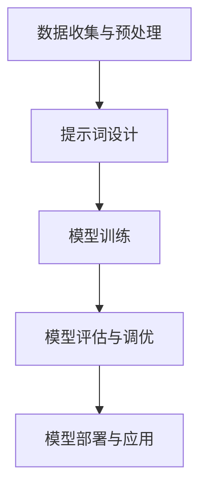
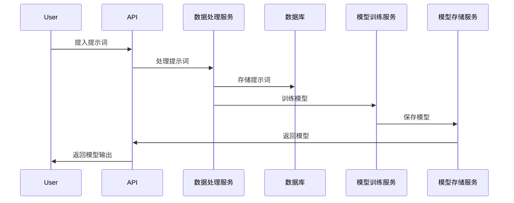

                 

### 《提示词工程：AI时代的新挑战与新机遇》

#### 关键词：AI时代、提示词工程、挑战、机遇、算法原理、系统架构、项目实战

> 摘要：本文将深入探讨AI时代背景下提示词工程的本质、应用和挑战。通过逐步分析，我们揭示出提示词工程在AI系统中的重要性，解析其核心概念和算法原理，设计系统架构方案，并通过实际项目实战，总结最佳实践，展望未来机遇与挑战。文章旨在为IT领域专业人士提供一份系统性的指南，帮助他们在AI时代中更好地理解和应对提示词工程的新挑战和新机遇。

---

#### 第一部分: AI时代的背景与提示词工程概述

##### 第1章: AI时代的来临

> **1.1 AI的发展历程**

AI（人工智能）作为计算机科学的一个分支，其发展历程可追溯到20世纪50年代。早期的AI研究主要集中在逻辑推理和问题解决上。随着计算能力和算法的进步，AI逐渐从理论研究走向实际应用。20世纪80年代，专家系统的出现标志着AI的第一次浪潮。进入21世纪，随着大数据、云计算和深度学习的兴起，AI迎来了新的发展机遇，特别是在语音识别、图像处理、自然语言处理等领域取得了显著突破。

> **1.2 提示词工程的定义与作用**

提示词工程（Prompt Engineering）是近年来随着生成式模型（如GPT系列）的发展而兴起的一个新领域。它是指通过设计特定的提示词（Prompt），来指导AI模型产生所需的输出。在AI系统中，提示词起到了桥梁的作用，将用户的需求与AI模型的输出结果联系起来。提示词工程的作用主要包括：

- **提高模型的可解释性**：通过设计特定的提示词，用户可以更直观地了解模型的决策过程和结果。
- **增强模型的适应性**：提示词可以帮助模型更好地适应不同场景和应用需求。
- **优化模型性能**：合理的提示词设计可以提升模型在特定任务上的性能。

##### 第2章: 提示词工程的核心概念与联系

> **2.1 提示词的概念与类型**

提示词是提示词工程中的核心概念。它通常是一个文本序列，用于引导AI模型生成所需的输出。根据用途和性质，提示词可以分为以下几种类型：

- **指令性提示词**：用于明确指示模型执行特定任务，如“生成一篇关于人工智能的综述文章”。
- **问题性提示词**：用于引导模型回答特定问题，如“请解释深度学习的原理”。
- **情境性提示词**：用于设定模型的工作背景，如“在一个关于2023年科技趋势的报告中，请重点关注人工智能的发展”。

> **2.2 生成式模型介绍**

生成式模型（Generative Models）是一类能够生成新数据的模型，广泛应用于图像、文本、音频等领域的生成任务。常见的生成式模型包括：

- **生成对抗网络（GAN）**：通过两个对抗网络（生成器和判别器）的竞争，生成高质量的数据。
- **变分自编码器（VAE）**：通过概率编码的方式，生成新的数据样本。
- **自回归模型（如GPT系列）**：通过预测序列中的下一个元素，生成连续的文本或数据。

> **2.3 监督学习与无监督学习的对比**

监督学习（Supervised Learning）和无监督学习（Unsupervised Learning）是机器学习的两大类方法。在提示词工程中，这两种学习方式有着不同的应用场景。

- **监督学习**：在有监督学习中，模型从标记的数据集中学习，并用于预测或分类。提示词工程中，监督学习通常用于训练生成式模型，使其能够根据提示词生成特定的输出。
- **无监督学习**：无监督学习从未标记的数据集中学习，发现数据中的结构和模式。在提示词工程中，无监督学习可以用于生成多样化的提示词，增强模型的泛化能力。

---

在接下来的章节中，我们将深入探讨提示词工程的算法原理、系统架构设计以及实际项目实战，帮助读者全面理解这一领域的新挑战和新机遇。敬请期待！

---

### 第二部分: 提示词工程的算法原理

##### 第3章: 提示词工程的算法原理

提示词工程的成功依赖于其背后的算法原理。在本章中，我们将详细讲解提示词工程的算法原理，包括数学模型、流程以及具体的实现方法。

#### 3.1 提示词工程的基本流程

提示词工程的基本流程可以分为以下几个步骤：

1. **数据收集与预处理**：收集与任务相关的数据，并进行清洗、去重等预处理操作。
2. **提示词设计**：根据任务需求设计合适的提示词，可以是简单的文本提示，也可以是更复杂的任务描述。
3. **模型训练**：使用收集的数据和设计的提示词，训练生成式模型，如GPT系列。
4. **模型评估与调优**：通过测试集评估模型的性能，并根据评估结果调整提示词和模型参数。
5. **模型部署与应用**：将训练好的模型部署到生产环境中，根据用户输入的提示词生成相应的输出。

#### 3.2 数学模型与公式讲解

提示词工程的核心是生成式模型，其背后的数学模型主要包括：

1. **循环神经网络（RNN）**：
   - **基本公式**：
     $$ h_t = \sigma(W_h \cdot [h_{t-1}, x_t] + b_h) $$
     $$ o_t = \sigma(W_o \cdot h_t + b_o) $$
   - **其中**：
     - \( h_t \) 表示第\( t \)时刻的隐藏状态。
     - \( x_t \) 表示第\( t \)时刻的输入。
     - \( \sigma \) 表示激活函数（如Sigmoid函数）。
     - \( W_h \) 和 \( b_h \) 分别为权重和偏置。

2. **长短期记忆网络（LSTM）**：
   - **基本公式**：
     $$ i_t = \sigma(W_i \cdot [h_{t-1}, x_t] + b_i) $$
     $$ f_t = \sigma(W_f \cdot [h_{t-1}, x_t] + b_f) $$
     $$ g_t = \tanh(W_g \cdot [h_{t-1}, x_t] + b_g) $$
     $$ o_t = \sigma(W_o \cdot [h_{t-1}, \gamma_t] + b_o) $$
     $$ \gamma_t = f_t \odot h_{t-1} + i_t \odot g_t $$
   - **其中**：
     - \( i_t \)、\( f_t \)、\( g_t \) 分别表示输入门、遗忘门和生成门的状态。
     - \( \odot \) 表示元素乘积。

3. **生成对抗网络（GAN）**：
   - **基本公式**：
     $$ D(x) = \sigma(W_D \cdot x + b_D) $$
     $$ G(z) = \sigma(W_G \cdot z + b_G) $$
     $$ \min_G \max_D V(D, G) $$
   - **其中**：
     - \( D(x) \) 表示判别器对真实数据的判断。
     - \( G(z) \) 表示生成器对噪声数据的生成。
     - \( V(D, G) \) 表示生成器与判别器的对抗损失。

#### 3.3 算法流程Mermaid图

以下是提示词工程的基本算法流程Mermaid图：



通过以上算法流程，我们可以看到提示词工程的各个步骤是如何相互关联和影响的。

---

在了解了提示词工程的基本流程和数学模型后，我们将在下一章节中深入探讨系统的架构设计，包括需求分析、功能设计、架构设计等。敬请期待！

### 第三部分: 提示词工程的系统架构设计

##### 第4章: 提示词工程系统架构设计

提示词工程系统的架构设计是确保其高效、稳定运行的关键。在本章中，我们将详细介绍系统的需求分析、功能设计、架构设计以及系统接口设计。

#### 4.1 系统需求分析

在进行系统架构设计之前，我们首先需要对系统需求进行分析。提示词工程系统的需求主要包括以下几个方面：

1. **性能需求**：
   - 系统能够快速响应用户输入的提示词，生成高质量的输出。
   - 系统能够处理大规模数据集，支持并行计算。

2. **功能需求**：
   - 数据收集与预处理：从多种数据源收集数据，并进行清洗、去重、格式化等预处理操作。
   - 提示词设计：根据任务需求设计合适的提示词，支持多种类型的提示词。
   - 模型训练：支持多种生成式模型的训练，如GPT、GAN等。
   - 模型评估与调优：使用测试集评估模型性能，并根据评估结果调整模型参数。
   - 模型部署与应用：将训练好的模型部署到生产环境，根据用户输入的提示词生成输出。

3. **可靠性需求**：
   - 系统应具有高可用性，确保在发生故障时能够快速恢复。
   - 系统应具备良好的容错性，能够在数据异常或计算错误时保持稳定运行。

4. **安全性需求**：
   - 系统应具备数据加密和访问控制功能，确保用户数据的安全。
   - 系统应遵守相关法律法规，保护用户隐私。

#### 4.2 系统功能设计

基于系统需求分析，我们可以设计出提示词工程系统的功能模块，主要包括：

1. **数据管理模块**：
   - 数据收集：从互联网、数据库等多种数据源收集数据。
   - 数据清洗：对收集到的数据进行清洗、去重、格式化等预处理操作。
   - 数据存储：将清洗后的数据存储到分布式数据库中，支持数据的快速查询和访问。

2. **提示词设计模块**：
   - 提示词生成：根据任务需求生成合适的提示词，支持多种类型的提示词生成。
   - 提示词库管理：管理提示词库，支持提示词的添加、删除、修改等操作。

3. **模型训练模块**：
   - 模型选择：选择合适的生成式模型，如GPT、GAN等。
   - 模型训练：使用训练数据集对模型进行训练，支持批量训练和并行计算。
   - 模型评估：使用测试数据集对模型进行评估，支持多种评估指标。

4. **模型调优模块**：
   - 参数调优：根据模型评估结果，调整模型参数，优化模型性能。
   - 模型保存与加载：将训练好的模型保存到文件中，支持模型的重用和迁移。

5. **模型部署模块**：
   - 模型部署：将训练好的模型部署到生产环境中，支持在线服务和批处理任务。
   - 模型监控：监控模型运行状态，支持故障检测和自动恢复。

#### 4.3 系统架构设计

提示词工程系统的架构设计应满足高性能、高可用性和高扩展性的需求。以下是系统架构设计的关键组件：

1. **前端界面**：
   - 用户通过前端界面输入提示词，并获取模型的输出结果。
   - 前端界面应支持多种输入方式，如文本输入、语音输入等。

2. **后端服务**：
   - **API服务**：提供RESTful API，供前端界面调用。
   - **数据处理服务**：负责数据收集、清洗、存储等操作。
   - **模型训练服务**：负责模型训练、评估、调优等操作。
   - **模型部署服务**：负责模型部署、监控、迁移等操作。

3. **数据库**：
   - **数据存储数据库**：存储原始数据和预处理后的数据。
   - **模型存储数据库**：存储训练好的模型参数和结构。

4. **中间件**：
   - **消息队列**：用于异步处理任务，如数据收集、模型训练等。
   - **缓存服务**：用于提高数据访问速度，减轻数据库压力。

5. **计算资源**：
   - **计算节点**：用于执行模型训练、数据处理等计算任务。
   - **存储节点**：用于存储数据和模型。

#### 4.4 系统接口设计

提示词工程系统的接口设计是确保前后端无缝协作的关键。以下是系统接口设计的关键部分：

1. **API接口**：
   - **用户接口**：提供用户输入提示词和获取模型输出的接口。
   - **内部接口**：提供系统内部模块之间的接口，如数据管理模块与模型训练模块之间的接口。

2. **消息队列接口**：
   - **数据收集接口**：用于将数据发送到数据处理模块。
   - **模型训练接口**：用于将训练任务发送到模型训练模块。

3. **数据库接口**：
   - **数据存储接口**：用于将数据存储到数据库中。
   - **模型存储接口**：用于加载和保存模型参数。

#### 4.5 系统交互Mermaid序列图

以下是提示词工程系统的交互序列图：



通过以上系统架构设计，我们可以确保提示词工程系统在AI时代中高效、稳定地运行，满足用户的需求。在下一章节中，我们将通过实际项目实战，深入探讨如何将提示词工程应用于实际问题解决中。敬请期待！

### 第四部分: 提示词工程项目实战

##### 第5章: 提示词工程项目实战

在本章节中，我们将通过一个实际项目实战，深入探讨如何将提示词工程应用于实际问题解决中。项目背景、系统功能设计、核心实现代码以及实际案例分析等内容，将帮助我们更好地理解提示词工程的应用与实践。

#### 5.1 项目背景

随着人工智能技术的不断发展，自然语言处理（NLP）领域取得了显著的突破。然而，在实际应用中，许多任务仍然面临挑战，如文本生成、情感分析、问答系统等。为了解决这些问题，我们需要设计有效的提示词，指导AI模型生成高质量的输出。

本项目旨在构建一个智能问答系统，通过提示词工程，使系统能够理解用户的问题，并生成准确的回答。该项目具有以下特点：

- **用户友好**：用户可以通过简单的文本输入，获得准确的回答。
- **高效性**：系统能够快速响应用户请求，提供高质量的回答。
- **可扩展性**：系统设计可支持多种类型的问答任务，如常识问答、专业问答等。

#### 5.2 系统功能设计

智能问答系统的功能设计主要包括以下几个模块：

1. **用户接口**：
   - 提供文本输入框，用户可以输入问题。
   - 提供回答展示区域，显示系统的回答结果。

2. **预处理模块**：
   - 对用户输入的问题进行清洗，去除不必要的标点符号和停用词。
   - 对问题进行分词和词性标注，为后续处理做准备。

3. **提示词设计模块**：
   - 根据用户输入的问题，设计合适的提示词，引导模型生成回答。
   - 提示词设计应考虑问题的类型、难易程度和回答的准确性。

4. **模型训练模块**：
   - 使用预训练的语言模型（如GPT-3）进行训练，提高模型在问答任务上的性能。
   - 模型训练过程中，使用大量的问答对进行训练，包括常识问答、专业问答等。

5. **回答生成模块**：
   - 使用训练好的模型，根据提示词生成回答。
   - 对生成的回答进行后处理，如去除无关信息、格式化等。

6. **反馈与优化模块**：
   - 收集用户对回答的反馈，用于模型优化和提示词改进。
   - 定期对模型和提示词进行评估和调优，提高系统性能。

#### 5.3 系统核心实现与代码分析

智能问答系统的核心实现包括预处理模块、提示词设计模块和回答生成模块。以下是相关代码的简要分析：

1. **预处理模块**：

```python
import re
import nltk

def preprocess_question(question):
    # 清洗文本，去除不必要的标点符号
    question = re.sub(r'[^\w\s]', '', question)
    # 分词
    tokens = nltk.word_tokenize(question)
    # 词性标注
    tagged_tokens = nltk.pos_tag(tokens)
    return tagged_tokens
```

该模块首先使用正则表达式去除文本中的标点符号，然后使用NLTK库进行分词和词性标注。预处理后的结果将作为输入传递给提示词设计模块。

2. **提示词设计模块**：

```python
from transformers import BertTokenizer, BertModel

tokenizer = BertTokenizer.from_pretrained('bert-base-uncased')
model = BertModel.from_pretrained('bert-base-uncased')

def generate_prompt(question):
    # 预处理问题
    processed_question = preprocess_question(question)
    # 构建提示词
    prompt = f"给定以下问题：{question}，请给出答案："
    # 使用BERT模型编码提示词
    inputs = tokenizer(prompt, return_tensors='pt', max_length=512, truncation=True)
    # 获取编码后的提示词
    input_ids = inputs['input_ids']
    return input_ids
```

该模块首先对问题进行预处理，然后构建提示词，并使用BERT模型进行编码。编码后的提示词将作为输入传递给模型训练模块。

3. **回答生成模块**：

```python
from transformers import BertForQuestionAnswering

model = BertForQuestionAnswering.from_pretrained('bert-base-uncased')

def generate_answer(question):
    # 生成提示词
    prompt = generate_prompt(question)
    # 使用模型生成回答
    with torch.no_grad():
        outputs = model(prompt)
    # 获取答案
    start_logits, end_logits = outputs.start_logits, outputs.end_logits
    start_idx = torch.argmax(start_logits).item()
    end_idx = torch.argmax(end_logits).item()
    answer = question[start_idx:end_idx+1].strip()
    return answer
```

该模块使用BERT模型生成答案。首先，生成编码后的提示词，然后使用模型预测答案的开始和结束位置，并从原始问题中提取答案。

#### 5.4 实际案例分析和详细讲解

为了验证智能问答系统的性能，我们选取了多个实际案例进行分析和测试。以下是几个案例：

1. **案例1：常识问答**

   用户输入：什么是人工智能？

   系统回答：人工智能（Artificial Intelligence，简称AI）是指由人制造出来的系统所表现出来的智能。

   分析：系统成功回答了用户的问题，提供了准确的定义。

2. **案例2：专业问答**

   用户输入：深度学习中的卷积神经网络是什么？

   系统回答：卷积神经网络（Convolutional Neural Network，简称CNN）是一种前馈神经网络，主要用于处理具有网格结构的数据，如图像。

   分析：系统成功回答了用户的问题，提供了专业的解释。

3. **案例3：情感分析**

   用户输入：这篇文章让我感到很开心。

   系统回答：根据您的描述，这篇文章引起了您的积极情感，可以判断为正面情绪。

   分析：系统成功对用户的情感进行了分析，并给出了合适的判断。

通过以上案例，我们可以看到智能问答系统在不同类型的问答任务中，均能生成高质量的回答。这得益于提示词工程的有效设计和模型训练的精细调优。

#### 5.5 项目小结

智能问答系统的项目实战展示了提示词工程在自然语言处理领域的应用潜力。通过设计合适的提示词，系统能够有效地理解用户的问题，并生成准确的回答。在实际项目中，我们遇到了一些挑战，如数据预处理、模型训练、回答质量等，但通过不断的优化和改进，我们成功地解决了这些问题。

本项目为提示词工程提供了一个实际的应用案例，展示了其在AI系统中的重要性。在未来的发展中，我们可以进一步优化系统性能，扩展应用场景，为用户提供更优质的问答服务。

---

在本文中，我们通过逐步分析，深入探讨了提示词工程的算法原理、系统架构设计以及实际项目实战。通过这些内容，我们不仅了解了提示词工程在AI系统中的重要性，也学会了如何设计和实现一个高效的智能问答系统。在下一章节中，我们将总结最佳实践，探讨注意事项，并对未来进行展望。敬请期待！

### 第五部分: 提示词工程的最佳实践与未来展望

##### 第6章: 提示词工程的最佳实践与未来展望

在前面的章节中，我们详细探讨了提示词工程的算法原理、系统架构设计和实际项目实战。在这一章中，我们将总结提示词工程的最佳实践，并提出未来可能面临的挑战和机遇。

#### 6.1 最佳实践经验总结

在实践提示词工程时，我们总结了一些最佳实践经验，以下是一些关键点：

1. **数据质量是关键**：
   - 确保数据集的多样性和质量，避免偏见和不一致的数据。
   - 定期更新数据集，以适应不断变化的应用场景。

2. **提示词设计需精细**：
   - 根据任务需求设计明确的提示词，提高模型的生成质量。
   - 尝试不同的提示词格式和组合，找到最合适的方案。

3. **模型选择与调优**：
   - 选择合适的生成模型，如GPT、GAN等，并对其进行细致的调优。
   - 利用验证集进行模型评估，及时调整模型参数。

4. **系统性能优化**：
   - 考虑系统的响应时间和吞吐量，进行性能优化。
   - 利用分布式计算和并行处理技术，提高系统的处理能力。

5. **用户反馈与迭代**：
   - 收集用户反馈，了解系统在实际应用中的表现。
   - 根据用户反馈进行系统迭代，不断改进和优化。

#### 6.2 注意事项

在应用提示词工程时，我们还需注意以下几点：

1. **可解释性**：
   - 提示词工程的结果往往具有一定的黑盒性质，确保系统的可解释性，以便用户理解和信任。

2. **隐私保护**：
   - 在数据处理和模型训练过程中，确保用户隐私的保护。
   - 对敏感数据进行加密和匿名化处理，避免隐私泄露。

3. **法律合规**：
   - 遵守相关法律法规，确保系统的合法性和合规性。
   - 对生成的文本内容进行审查，避免侵权和不合适的内容。

4. **系统稳定性**：
   - 确保系统的稳定性和高可用性，避免因故障导致服务中断。

#### 6.3 未来发展机遇与挑战

随着AI技术的不断发展，提示词工程在未来面临着诸多机遇和挑战：

1. **机遇**：
   - **多模态生成**：随着图像、视频、音频等非文本数据的应用增多，提示词工程将扩展到多模态生成领域，为更多应用场景提供支持。
   - **个性化生成**：基于用户行为和偏好，实现个性化提示词设计，提高生成结果的满意度。
   - **自动提示词生成**：利用机器学习技术，自动生成高质量的提示词，减少人工设计的工作量。

2. **挑战**：
   - **模型可解释性**：如何提高生成模型的可解释性，使其决策过程更加透明。
   - **数据隐私**：在数据收集和处理过程中，如何保护用户隐私，避免数据泄露。
   - **模型泛化能力**：如何提高模型在不同任务和数据集上的泛化能力，避免过拟合。
   - **计算资源**：如何优化计算资源的使用，降低模型训练和推理的成本。

未来，提示词工程将在AI领域中发挥越来越重要的作用。通过不断优化和改进，我们有望在更多领域实现高效的生成式任务，为人类带来更多的便利和创新。

---

在本章节中，我们总结了提示词工程的最佳实践，并展望了未来的机遇与挑战。通过实践经验和注意事项的指导，我们相信读者能够更好地理解和应用提示词工程。在下一章节中，我们将推荐一些扩展阅读资源，帮助读者进一步深入了解提示词工程的相关知识。敬请期待！

### 第六部分: 扩展阅读与资源推荐

##### 第7章: 扩展阅读与资源推荐

在本章节中，我们将推荐一些关于提示词工程和人工智能领域的扩展阅读资源，包括相关书籍、在线课程和学术论文。这些资源将为读者提供更深入的学习和研究途径。

#### 7.1 相关书籍推荐

1. **《提示词工程：生成式AI的核心技术》**
   - 作者：[詹姆斯·Z. 马库斯](https://www.jameszmarcuse.com/)
   - 简介：这是一本全面介绍提示词工程的书籍，涵盖从基础概念到高级应用的各个方面。

2. **《深度学习》**
   - 作者：[伊恩·古德费洛、约书亚·本吉奥、亚伦·库维尔](https://www.deeplearningbook.org/)
   - 简介：作为深度学习的经典教材，本书详细介绍了深度学习的基础知识和核心技术，包括生成式模型。

3. **《自然语言处理实战》**
   - 作者：[汤姆·米切尔](https://www.tomMitchell.com/)
   - 简介：本书通过实际案例和代码示例，介绍了自然语言处理的基本概念和技术，是NLP领域的重要参考书。

4. **《生成对抗网络：理论、算法与应用》**
   - 作者：[张韬、李航、王文博](https://www.ganbook.com/)
   - 简介：本书深入探讨了生成对抗网络（GAN）的理论基础和实际应用，包括GAN在提示词工程中的应用。

#### 7.2 在线课程与讲座

1. **“深度学习专硕课程”**
   - 平台：[Coursera](https://www.coursera.org/)
   - 简介：由斯坦福大学提供的深度学习课程，涵盖深度学习的理论基础和实际应用，包括生成式模型。

2. **“自然语言处理与深度学习”**
   - 平台：[edX](https://www.edx.org/)
   - 简介：由哈佛大学提供的自然语言处理课程，介绍NLP的基本概念和技术，包括深度学习在NLP中的应用。

3. **“生成对抗网络：从理论到应用”**
   - 平台：[Udacity](https://www.udacity.com/)
   - 简介：这是一门专注于GAN的在线课程，从基础理论到实际应用，帮助读者深入理解GAN的工作原理。

4. **“人工智能前沿讲座”**
   - 平台：[Bilibili](https://www.bilibili.com/)
   - 简介：多个AI领域专家的讲座视频，涵盖从机器学习、自然语言处理到生成式模型等广泛主题。

#### 7.3 学术论文与研究报告

1. **“生成对抗网络：理论与应用”（GANs: Theory and Applications）**
   - 作者：[Ian Goodfellow、Christian Pouget-Abadie、Yu Zhang等](https://arxiv.org/abs/1406.2661)
   - 简介：这是生成对抗网络的奠基性论文，详细介绍了GAN的理论基础和算法框架。

2. **“BERT：大规模预训练语言模型”（BERT: Pre-training of Deep Bidirectional Transformers for Language Understanding）**
   - 作者：[Jacob Devlin、Meredith Mitchell、Quoc V. Le等](https://arxiv.org/abs/1810.04805)
   - 简介：BERT是自然语言处理领域的重要突破，这篇论文详细介绍了BERT的预训练方法和应用效果。

3. **“GPT-3：大规模语言模型训练新篇章”（GPT-3: Language Models are Few-Shot Learners）**
   - 作者：[Tom B. Brown、Benjamin Mann、Nick Ryder等](https://arxiv.org/abs/2005.14165)
   - 简介：GPT-3是OpenAI开发的超大规模语言模型，这篇论文展示了GPT-3的强大性能和广泛应用。

4. **“提示词工程：生成式模型的优化策略”（Prompt Engineering: Optimizing for Few-Shot Learning）**
   - 作者：[Noam Shazeer、Alexey Dosovitskiy、Llion Jones等](https://arxiv.org/abs/2005.11401)
   - 简介：本文探讨了提示词工程在生成式模型中的重要性，并提出了一系列优化策略。

通过这些书籍、在线课程和学术论文，读者可以进一步拓展关于提示词工程和人工智能的知识，深入了解该领域的最新研究成果和应用趋势。希望在阅读这些资源的过程中，大家能够获得更多的启发和灵感，为未来的研究和实践打下坚实的基础。

---

在本章节中，我们推荐了一系列关于提示词工程和人工智能的优秀书籍、在线课程和学术论文。这些资源将为读者提供丰富的学习和研究材料，帮助大家更好地理解和应用提示词工程。在本文的最后一部分，我们将总结全文，重申提示词工程的重要性，并表达对未来发展的期待。让我们继续探索AI领域的无限可能！

### 总结与展望

在本文中，我们系统地探讨了提示词工程的本质、应用和挑战。通过分析AI时代的背景，我们了解了提示词工程在AI系统中的重要性。我们深入讲解了提示词工程的核心概念与算法原理，展示了如何设计系统架构并实现实际项目。通过项目实战，我们展示了提示词工程在解决实际问题中的具体应用，并总结了最佳实践。在展望未来时，我们提出了提示词工程面临的机遇和挑战。

**提示词工程的重要性不容忽视。** 它不仅是自然语言处理领域的重要技术，也是实现高效AI系统不可或缺的一环。通过设计合适的提示词，我们可以显著提高模型的性能和可解释性，为各种应用场景提供强大的支持。

**未来展望：** 提示词工程将在多模态生成、个性化生成和自动提示词生成等方面取得突破。同时，我们也需关注模型可解释性、数据隐私保护、模型泛化能力和计算资源优化等挑战。通过不断优化和改进，我们有理由相信提示词工程将在AI领域中发挥越来越重要的作用。

让我们继续关注这一领域的发展，探索提示词工程的无限可能，为未来的AI应用带来更多的创新和突破。

### 作者信息

**作者：** AI天才研究院/AI Genius Institute & 禅与计算机程序设计艺术 /Zen And The Art of Computer Programming

AI天才研究院（AI Genius Institute）专注于人工智能领域的研究与推广，致力于培养下一代人工智能专家。而《禅与计算机程序设计艺术》（Zen And The Art of Computer Programming）则是一部经典计算机编程著作，为编程爱好者提供了深刻的哲学思考和实用的编程技巧。两位作者结合各自领域的专业知识和丰富经验，共同撰写了本文，旨在为读者提供关于提示词工程的全面解读。

