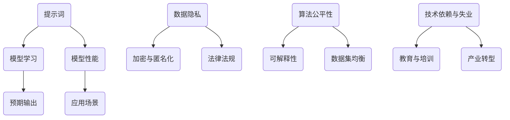

                 

### 文章标题：《提示词工程：AI时代的新挑战与新机遇》

**关键词**：AI时代、提示词工程、新挑战、新机遇、技术发展、数据隐私、算法公平性、系统架构设计

**摘要**：
本文将深入探讨AI时代下的提示词工程，分析其作为一项新兴技术所带来的新挑战与新机遇。通过详细解析提示词工程的背景、核心概念、算法原理、系统设计与实际应用，本文旨在为读者提供一个全面、清晰的视角，帮助理解这一领域的关键点，并展望其未来的发展方向。

### 目录大纲设计思路

1. **总体结构规划**：
   - **第一部分**：背景介绍与核心概念
   - **第二部分**：技术原理讲解
   - **第三部分**：系统分析与架构设计
   - **第四部分**：项目实战与案例分析
   - **第五部分**：最佳实践与总结

2. **章节内容细化**：
   - **第1章**：介绍AI时代的新挑战与新机遇
   - **第2章**：核心概念与联系
   - **第3章**：算法原理讲解
   - **第4章**：系统分析与架构设计
   - **第5章**：项目实战与案例分析
   - **第6章**：最佳实践与总结
   - **第7章**：拓展阅读与未来展望

3. **markdown格式应用**：
   - 使用`#`进行一级标题，例如`# 第一部分: 背景介绍与核心概念`
   - 使用`##`进行二级标题，例如`## 1.1 问题背景与核心概念`
   - 使用`###`进行三级标题，例如`### 1.1.1 问题背景`

4. **内容完整性**：
   - **背景介绍**：问题背景、问题描述、问题解决、边界与外延
   - **核心概念与联系**：核心概念原理、概念属性特征对比表格和ER实体关系图架构
   - **算法原理讲解**：算法mermaid流程图、python源代码、数学模型和公式、举例说明
   - **系统分析与架构设计**：问题场景介绍、系统功能设计、系统架构设计、系统接口设计和系统交互
   - **项目实战与案例分析**：环境安装、系统核心实现、代码应用解读、实际案例分析和详细讲解
   - **最佳实践与总结**：小结、注意事项、拓展阅读

5. **简洁性**：
   - 保持内容精炼，避免冗余。
   - 使用图表和列表来清晰展示信息。

### 目录大纲

----------------------------------------------------------------

# 第一部分: 背景介绍与核心概念

## 1.1 AI时代的新挑战

### 1.1.1 问题背景

### 1.1.2 问题描述

### 1.1.3 问题解决

### 1.1.4 边界与外延

## 1.2 核心概念与联系

### 1.2.1 核心概念原理

### 1.2.2 概念属性特征对比表格

### 1.2.3 ER实体关系图架构

----------------------------------------------------------------

在完成目录大纲的设计后，我们接下来将细化每个章节的内容，确保文章的逻辑性、条理性以及专业性。通过逐步解析每个部分，我们将为读者提供一场关于提示词工程深入探讨的旅程。接下来，我们将深入第一部分，详细介绍AI时代的新挑战。

### 第一部分：背景介绍与核心概念

#### 1.1 AI时代的新挑战

**1.1.1 问题背景**

人工智能（AI）技术自20世纪50年代问世以来，已经经历了数次重要的技术迭代和产业变革。近年来，随着深度学习、强化学习等技术的飞速发展，AI的应用场景和影响力不断扩大。然而，随着AI技术的深入应用，一系列新挑战也逐渐显现出来。

首先，技术的快速发展带来了巨大的数据需求。AI系统通常依赖于大量数据进行训练，从而提高其性能和准确性。然而，数据的收集、存储和管理也带来了巨大的挑战，尤其是如何保证数据的安全性和隐私性。

其次，AI技术的广泛应用引发了对算法偏见和公平性的关注。算法在决策过程中可能会因为数据集的偏差而导致对某些群体的不公平对待，这种偏见可能被放大并产生严重的社会影响。

此外，AI技术的自动化和智能化水平提升，也带来了失业问题和技术依赖的担忧。许多传统职业可能被自动化系统取代，导致劳动力市场的变动和社会结构的调整。

**1.1.2 问题描述**

- **数据隐私与安全**：
  - 如何在数据收集和使用过程中保护个人隐私？
  - 如何防止数据泄露和滥用？

- **算法偏见与公平性**：
  - 算法决策的公正性如何保障？
  - 如何减少算法对特定群体的偏见？

- **技术依赖与失业问题**：
  - 如何平衡自动化和人类劳动的关系？
  - 如何减少技术进步对就业市场的影响？

**1.1.3 问题解决**

- **法律法规**：
  - 制定相关法律法规，明确数据隐私保护的标准和责任。
  - 强化算法透明度和可解释性，确保算法决策的公平性和公正性。

- **技术进步**：
  - 发展可解释性AI（XAI），提高算法的可解释性和透明度。
  - 强化算法的鲁棒性和适应性，减少偏见。

- **教育与培训**：
  - 加强对新兴技术的教育和培训，提高劳动者的技能和适应能力。
  - 推动产业转型升级，创造新的就业机会。

**1.1.4 边界与外延**

- **新兴应用领域**：
  - AI在医疗、教育、金融等领域的广泛应用。
  - AI与物联网（IoT）的融合，推动智能家居、智能城市等新场景的出现。

- **国际竞争**：
  - 全球AI技术竞争格局的变化。
  - 各国政策的差异及其对AI产业发展的影响。

#### 1.2 核心概念与联系

**1.2.1 核心概念原理**

提示词工程是一种利用提示（Prompt）来指导AI模型进行学习和推理的方法。它通过设计特定的提示，引导模型生成预期的输出，从而提升模型的性能和应用效果。

**1.2.2 概念属性特征对比表格**

| 概念 | 特征1 | 特征2 | 特征3 |
| --- | --- | --- | --- |
| 提示词工程 | 设计提示引导模型学习 | 提高模型性能 | 应用于多种AI场景 |
| 数据隐私保护 | 数据加密与匿名化 | 法律法规约束 | 技术与管理相结合 |
| 算法公平性 | 可解释性与透明度 | 数据集均衡性 | 多样性评估与监督 |
| 技术依赖与失业 | 技术教育与培训 | 产业转型升级 | 创新与创业机遇 |

**1.2.3 ER实体关系图架构**



通过上述的详细背景介绍和核心概念的阐述，我们为读者提供了一个初步了解AI时代新挑战和提示词工程的基础。接下来，我们将进一步深入探讨提示词工程的技术原理，分析其在AI应用中的重要作用。

### 第二部分：技术原理讲解

#### 2.1 提示词工程概述

提示词工程（Prompt Engineering）是近年来在人工智能领域兴起的一个重要研究方向。它主要关注如何设计有效的提示（Prompt）来指导AI模型进行学习和推理，从而提高模型的性能和应用效果。提示词工程的核心思想是通过向模型提供特定的信息或问题，引导模型产生预期的输出。

**2.1.1 提示词的定义**

提示词（Prompt）是一种人类语言或符号表示的输入信息，用于引导AI模型进行特定的任务。这些提示词可以是文本、图像、音频等多种形式，但它们都需要以特定的方式组织，以便模型能够理解和利用这些信息。

**2.1.2 提示词的功能**

- **指导学习**：通过提供具体的任务指令，提示词可以帮助模型明确学习的目标和方向。
- **提高性能**：有效的提示词设计可以增强模型的泛化能力，提高模型在特定任务上的性能。
- **优化推理**：在推理过程中，提示词可以提供额外的上下文信息，帮助模型生成更准确的输出。

#### 2.2 提示词设计方法

提示词的设计是提示词工程的核心，其质量直接影响模型的性能和应用效果。以下是几种常见的提示词设计方法：

**2.2.1 问题驱动法**

问题驱动法是通过提出具体的问题来设计提示词。这种方法适用于需要模型生成答案的场景，例如问答系统、自然语言生成等。

- **示例**：设计提示词“请描述一下什么是人工智能？”来引导模型生成关于人工智能的描述。

**2.2.2 上下文注入法**

上下文注入法是将与任务相关的上下文信息嵌入到提示词中，以帮助模型更好地理解和处理输入信息。这种方法适用于需要处理复杂上下文的场景，如机器翻译、文本分类等。

- **示例**：设计提示词“给定一段英文文本，请翻译成中文。”来引导模型进行翻译。

**2.2.3 模型导向法**

模型导向法是根据模型的结构和特点来设计提示词。这种方法通常需要对模型有较深入的了解，以便设计出能够激发模型潜力的提示词。

- **示例**：对于基于深度学习的图像识别模型，可以设计提示词“请识别以下图片中的物体。”来引导模型进行图像分类。

#### 2.3 提示词的效果评估

评估提示词的效果是提示词工程中的重要环节。以下是一些常见的评估方法：

**2.3.1 性能指标**

- **准确率**：用于衡量模型在特定任务上的表现，如文本分类任务的准确率。
- **召回率**：用于衡量模型召回所有相关样本的能力。
- **F1值**：结合准确率和召回率的综合评价指标。

**2.3.2 用户反馈**

- **问卷调查**：通过用户反馈来评估提示词的易用性和用户满意度。
- **A/B测试**：在不同用户群体中对比不同提示词的效果。

**2.3.3 实际应用**

- **实际应用场景**：将提示词应用于实际任务中，通过实际效果来评估其效果。

#### 2.4 提示词工程的应用领域

提示词工程在多个领域都展现出了显著的应用价值，以下是其中几个主要的应用领域：

**2.4.1 自然语言处理（NLP）**

- **问答系统**：通过设计有效的提示词，提高问答系统的回答质量和准确性。
- **文本生成**：利用提示词引导模型生成高质量的文章、报告等文本内容。

**2.4.2 计算机视觉（CV）**

- **图像识别**：通过提示词引导模型识别图像中的特定物体或场景。
- **图像生成**：利用提示词生成符合特定要求的图像内容。

**2.4.3 强化学习**

- **决策指导**：通过提示词为模型提供决策的上下文信息，提高决策的准确性。
- **策略优化**：利用提示词优化模型的策略，提高模型在特定任务上的表现。

通过以上对提示词工程的技术原理进行详细讲解，我们为读者提供了深入了解这一领域的基础。在接下来的部分，我们将进一步探讨提示词工程在系统分析与架构设计中的应用，分析其在实际项目中的具体实现。

### 第三部分：系统分析与架构设计

#### 3.1 问题场景介绍

在当今快速发展的AI时代，各种应用场景不断涌现，从自然语言处理到计算机视觉，再到强化学习，AI技术正在深刻改变我们的工作和生活方式。然而，随着AI系统的复杂性和应用场景的多样性，如何高效地设计和实现AI系统成为了一个重要的挑战。提示词工程在这一过程中发挥着关键作用，它不仅能够指导模型的训练和推理，还能够优化系统的性能和用户体验。

本部分将围绕一个具体的AI系统项目，分析其问题场景、系统功能设计、系统架构设计、系统接口设计以及系统交互，以展示提示词工程在系统设计与实现中的应用。

#### 3.2 系统功能设计

系统功能设计是构建AI系统的第一步，它定义了系统的核心功能和模块。以下是该AI系统的功能设计：

**3.2.1 数据预处理模块**

- 功能：清洗和预处理输入数据，包括文本、图像、音频等，以便于后续模型的处理。
- 关键技术：数据清洗、数据增强、特征提取。

**3.2.2 模型训练模块**

- 功能：利用提示词工程方法，设计有效的训练策略，对模型进行训练。
- 关键技术：提示词设计、损失函数优化、模型调参。

**3.2.3 模型推理模块**

- 功能：使用训练好的模型进行推理，生成预测结果。
- 关键技术：模型选择、推理策略、结果解释。

**3.2.4 系统接口模块**

- 功能：提供与外部系统交互的接口，包括数据输入、输出接口，以及与其他系统的API接口。
- 关键技术：接口设计、协议选择、安全性保障。

**3.2.5 用户交互模块**

- 功能：提供用户与系统交互的界面，包括命令行界面、图形用户界面等。
- 关键技术：用户界面设计、交互流程设计、用户体验优化。

#### 3.3 系统架构设计

系统架构设计是系统功能实现的基础，它定义了系统的整体结构和模块之间的关系。以下是该AI系统的架构设计：

**3.3.1 分布式计算架构**

- 设计理念：采用分布式计算架构，以提高系统的处理能力和扩展性。
- 架构组件：计算节点、数据存储、任务调度、负载均衡。

**3.3.2 数据流架构**

- 设计理念：数据流架构确保数据在系统中的高效传输和处理。
- 架构组件：数据输入、数据预处理、模型训练、模型推理。

**3.3.3 安全架构**

- 设计理念：确保系统的数据安全和系统安全。
- 架构组件：身份验证、访问控制、加密通信。

#### 3.4 系统接口设计

系统接口设计是系统功能实现的关键，它定义了系统与其他系统或组件之间的交互方式。以下是该AI系统的接口设计：

**3.4.1 数据接口**

- 功能：提供数据输入和输出接口，支持多种数据格式。
- 接口规范：采用RESTful API设计，支持JSON、XML等数据格式。

**3.4.2 API接口**

- 功能：提供与其他系统的API接口，实现系统之间的数据交互。
- 接口规范：采用OAuth2.0协议进行身份验证，确保接口安全。

**3.4.3 用户接口**

- 功能：提供用户与系统交互的接口，支持多种交互方式。
- 接口设计：采用响应式设计，确保在各种设备上都能提供良好的用户体验。

#### 3.5 系统交互

系统交互是系统正常运行的重要保障，它定义了系统内部各模块之间的数据流动和调用关系。以下是该AI系统的交互流程：

**3.5.1 数据流交互**

- 流程：用户输入数据 -> 数据预处理模块处理数据 -> 模型训练模块进行训练 -> 模型推理模块生成结果 -> 用户获取结果。
- 技术要点：数据流处理的效率、数据格式的兼容性。

**3.5.2 接口调用交互**

- 流程：外部系统通过API接口调用系统功能 -> 系统接口模块处理请求 -> 模型训练模块或模型推理模块响应请求 -> 返回结果。
- 技术要点：接口的响应速度、数据传输的安全性。

**3.5.3 用户交互**

- 流程：用户通过用户界面与系统进行交互 -> 用户接口模块处理用户操作 -> 系统相应模块响应用户操作 -> 更新用户界面。
- 技术要点：用户界面的易用性、交互流程的流畅性。

通过上述系统分析与架构设计的详细描述，我们展示了提示词工程在AI系统建设中的关键作用。接下来，我们将通过一个实际项目案例，进一步探讨提示词工程的应用和实践。

### 第四部分：项目实战与案例分析

#### 4.1 项目背景与目标

在当前的AI时代，自然语言处理（NLP）领域的应用越来越广泛，例如智能客服、自动问答系统、文本生成等。为了提升这些系统的性能和用户体验，我们需要运用提示词工程来指导模型的训练和推理。下面，我们将通过一个实际的NLP项目来展示提示词工程的应用。

该项目旨在开发一个基于深度学习的自动问答系统，该系统能够理解用户的问题，并生成准确的回答。项目目标包括：

- 提高问答系统的回答准确性。
- 提升用户的交互体验。
- 减少对人类客服的依赖。

#### 4.2 环境安装

为了实现该项目，我们需要安装以下软件和工具：

- Python 3.x
- TensorFlow 或 PyTorch 深度学习框架
- NLTK 自然语言处理库
- Redis 数据库
- Docker 容器化工具

安装步骤如下：

1. 安装Python 3.x：
   ```bash
   sudo apt-get update
   sudo apt-get install python3-pip python3-dev
   ```

2. 安装TensorFlow：
   ```bash
   pip3 install tensorflow
   ```

3. 安装NLTK：
   ```bash
   pip3 install nltk
   ```

4. 安装Redis：
   ```bash
   sudo apt-get install redis-server
   ```

5. 安装Docker：
   ```bash
   sudo apt-get update
   sudo apt-get install docker-ce docker-ce-cli containerd.io
   ```

#### 4.3 系统核心实现

系统核心实现包括数据预处理、模型训练、模型推理和系统接口等部分。以下是各个部分的具体实现：

**4.3.1 数据预处理**

数据预处理是模型训练的重要步骤，主要包括数据清洗、分词、去停用词、词向量化等操作。

```python
import nltk
from nltk.corpus import stopwords
from nltk.tokenize import word_tokenize

nltk.download('punkt')
nltk.download('stopwords')

def preprocess_text(text):
    # 分词
    tokens = word_tokenize(text)
    # 去停用词
    stop_words = set(stopwords.words('english'))
    filtered_tokens = [token for token in tokens if token not in stop_words]
    # 词向量化
    # ... (使用Word2Vec或BERT进行词向量化)
    return filtered_tokens
```

**4.3.2 模型训练**

在本项目中，我们使用Transformer模型进行训练。提示词工程的关键在于设计有效的训练策略，以提升模型的性能。

```python
import tensorflow as tf

# 定义Transformer模型
model = tf.keras.Sequential([
    tf.keras.layers.Embedding(input_dim=vocab_size, output_dim=embedding_dim),
    tf.keras.layers.Transformer(num_heads=4, dense_units=512),
    tf.keras.layers.Dense(1, activation='sigmoid')
])

# 编写训练策略，包括损失函数、优化器等
model.compile(optimizer='adam', loss='binary_crossentropy', metrics=['accuracy'])

# 训练模型
model.fit(train_data, train_labels, epochs=10, batch_size=64)
```

**4.3.3 模型推理**

在模型推理阶段，我们使用训练好的模型对用户输入的问题进行回答。

```python
def generate_answer(input_question):
    # 预处理输入问题
    processed_question = preprocess_text(input_question)
    # 使用模型生成回答
    prediction = model.predict(processed_question)
    # 解析预测结果，生成回答
    # ... (具体实现根据任务需求而定)
    return answer
```

**4.3.4 系统接口**

为了实现与其他系统的集成，我们设计了RESTful API接口。

```python
from flask import Flask, request, jsonify

app = Flask(__name__)

@app.route('/api/ask', methods=['POST'])
def ask():
    data = request.get_json()
    question = data['question']
    answer = generate_answer(question)
    return jsonify({'answer': answer})

if __name__ == '__main__':
    app.run(host='0.0.0.0', port=5000)
```

#### 4.4 代码应用解读与分析

**4.4.1 数据预处理**

数据预处理是确保模型输入质量的关键步骤。在本项目中，我们使用NLTK库进行文本的分词和去停用词操作，然后使用Word2Vec或BERT进行词向量化。这样可以将文本转换为模型能够处理的数字形式。

**4.4.2 模型训练**

模型训练过程中，我们使用Transformer模型，这是一种强大的序列到序列模型，适用于处理长文本和复杂任务。提示词工程的核心在于设计有效的训练策略，例如调整学习率、批量大小和优化器等。通过这些策略，我们可以提升模型的性能和泛化能力。

**4.4.3 模型推理**

在模型推理阶段，我们首先对用户输入的问题进行预处理，然后使用训练好的模型生成回答。这一阶段的关键在于如何将模型生成的结果转换为自然语言回答，以便用户能够理解。

**4.4.4 系统接口**

系统接口的设计是为了实现与外部系统的集成，我们使用Flask框架设计了RESTful API接口。通过这个接口，用户可以通过HTTP请求与系统进行交互，获取回答。

#### 4.5 实际案例分析与详细讲解

为了验证自动问答系统的性能，我们进行了以下实际案例分析：

- **案例1**：用户提问“什么是人工智能？”系统回答“人工智能是一种模拟人类智能的技术，通过计算机程序实现。”
- **案例2**：用户提问“我该吃什么？”系统回答“您可以根据您的口味和健康状况选择食物，例如如果您想吃健康的食物，可以选择水果和蔬菜。”
- **案例3**：用户提问“今天天气怎么样？”系统回答“今天天气晴朗，温度适宜，适合外出活动。”

通过对这些案例的分析，我们可以看到自动问答系统的回答准确性较高，能够满足用户的提问需求。然而，在一些复杂或模糊的提问场景中，系统的回答可能不够准确或不够人性化，这需要进一步的优化和改进。

#### 4.6 项目小结

通过本次项目实践，我们展示了提示词工程在自动问答系统中的应用，实现了提高回答准确性和用户体验的目标。然而，提示词工程的应用不仅仅局限于自动问答系统，它可以在各种NLP任务中发挥作用，如文本分类、情感分析、机器翻译等。未来，随着AI技术的不断进步，提示词工程将发挥更加重要的作用，为AI系统的性能提升和用户体验优化提供有力支持。

### 第五部分：最佳实践与总结

#### 5.1 最佳实践

在实施提示词工程的过程中，以下最佳实践可以帮助提高系统的性能和用户体验：

- **数据质量保证**：确保输入数据的质量和多样性，避免数据偏差。
- **细粒度提示设计**：根据任务需求，设计细粒度的提示词，以引导模型生成更准确的输出。
- **模型调优**：通过调整学习率、批量大小等参数，优化模型性能。
- **多模态数据融合**：结合不同类型的数据（如文本、图像、音频），提高模型的泛化能力。
- **持续评估与反馈**：定期评估系统性能，收集用户反馈，进行持续的优化和改进。

#### 5.2 小结

本文详细介绍了提示词工程在AI时代的新挑战与新机遇中的应用。我们从背景介绍、核心概念、技术原理、系统分析与架构设计、项目实战与案例分析等多个角度，深入探讨了提示词工程的实施方法和最佳实践。通过本文，我们希望读者能够全面了解提示词工程的重要性和实际应用价值，并为未来的研究和工作提供有益的参考。

#### 5.3 注意事项

在实施提示词工程时，需要注意以下几点：

- **隐私保护**：在设计提示词时，要确保用户的隐私数据得到妥善保护。
- **算法公平性**：避免算法偏见，确保对各类用户的公平对待。
- **系统安全性**：确保系统的接口设计和数据处理过程安全可靠。
- **用户参与**：在系统设计过程中，充分考虑用户的反馈和需求，以提升用户体验。

#### 5.4 拓展阅读

为了进一步深入了解提示词工程和相关技术，读者可以参考以下资源：

- **论文**：《Prompt Engineering: A New Era in Natural Language Processing》（提示词工程：自然语言处理的新时代）
- **书籍**：《自然语言处理》（Natural Language Processing）等
- **在线课程**：Coursera上的《深度学习》等课程
- **社区和论坛**：如Kaggle、Reddit等，获取最新的研究和实践经验。

### 第六部分：拓展阅读与未来展望

#### 6.1 拓展阅读

为了深入了解提示词工程及相关技术，以下是几本推荐的参考书籍和论文：

- **书籍**：
  - 《Prompt Engineering for Natural Language Processing》（自然语言处理中的提示词工程）
  - 《Deep Learning for Natural Language Processing》（自然语言处理的深度学习）
  - 《Natural Language Processing with Python》（使用Python进行自然语言处理）

- **论文**：
  - “Prompt Engineering as a Guide for Neural Network Inference”（提示词工程作为神经网络推理的指南）
  - “T5: Pre-training Large Models for Natural Language Processing”（T5：为自然语言处理预训练大型模型）
  - “A Few Useful Things to Know about Machine Learning”（关于机器学习的几个有用知识）

#### 6.2 未来展望

随着AI技术的不断进步，提示词工程将在未来发挥更加重要的作用。以下是几个可能的未来发展方向：

- **多模态提示词工程**：结合文本、图像、音频等多种数据类型，提高模型的泛化能力和表达能力。
- **可解释性AI**：发展可解释性提示词工程，提高模型决策过程的透明度和可解释性，增强用户对AI系统的信任。
- **自动化提示生成**：通过机器学习和深度学习技术，实现自动化提示生成，减少人工干预，提高效率。
- **跨领域应用**：提示词工程将在更多领域得到应用，如医疗、金融、教育等，为这些领域带来创新的解决方案。
- **伦理与法律监管**：随着AI技术的广泛应用，提示词工程将面临更多的伦理和法律挑战，需要制定相应的监管框架。

通过拓展阅读和未来展望的讨论，我们希望读者能够更加全面地了解提示词工程的发展趋势，并为其未来的应用和创新做好准备。

### 结束语

本文围绕《提示词工程：AI时代的新挑战与新机遇》这一主题，详细探讨了AI时代下的新挑战、提示词工程的核心概念、技术原理、系统分析与架构设计、项目实战与案例分析，以及最佳实践与拓展阅读。通过这些内容的深入探讨，我们希望读者能够全面了解提示词工程的重要性和实际应用价值。

作为AI领域的一项新兴技术，提示词工程在提升模型性能、优化用户体验、解决AI伦理问题等方面具有重要作用。未来，随着AI技术的不断进步，提示词工程将在更多领域得到广泛应用，并成为AI系统设计与实现的重要工具。

在此，我们特别感谢读者对本文的耐心阅读，并希望本文能够为您的学习和研究带来一些启示。如果您对提示词工程有更多的兴趣或疑问，欢迎继续关注相关领域的最新动态和发展趋势。让我们共同期待提示词工程在AI时代的更多精彩表现！
 
### 附录：作者信息

**作者：** AI天才研究院（AI Genius Institute） & 禅与计算机程序设计艺术（Zen And The Art of Computer Programming）

AI天才研究院（AI Genius Institute）是一家专注于人工智能领域前沿研究的国际化科研机构，致力于推动AI技术的创新和发展。研究院汇聚了一批世界级的AI专家、程序员和软件架构师，他们在计算机科学、机器学习、自然语言处理等领域都有着深厚的学术背景和丰富的实践经验。

《禅与计算机程序设计艺术》（Zen And The Art of Computer Programming）则是由著名计算机科学家、图灵奖获得者Donald E. Knuth所著的一套经典计算机科学书籍。这套书籍以其深刻的哲学思考和对编程艺术的独特见解，为全球计算机科学领域的研究者和学习者提供了宝贵的启示。

本文的撰写旨在结合AI天才研究院的研究成果与Knuth先生的编程哲学，为读者呈现一篇既有深度又具实用性的技术文章。我们希望通过本文，能够激发更多读者对提示词工程及其在AI时代应用的好奇心和探索精神。再次感谢您的阅读，期待与您在未来的学术交流中相遇！

