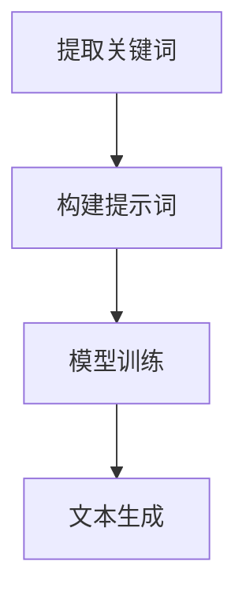
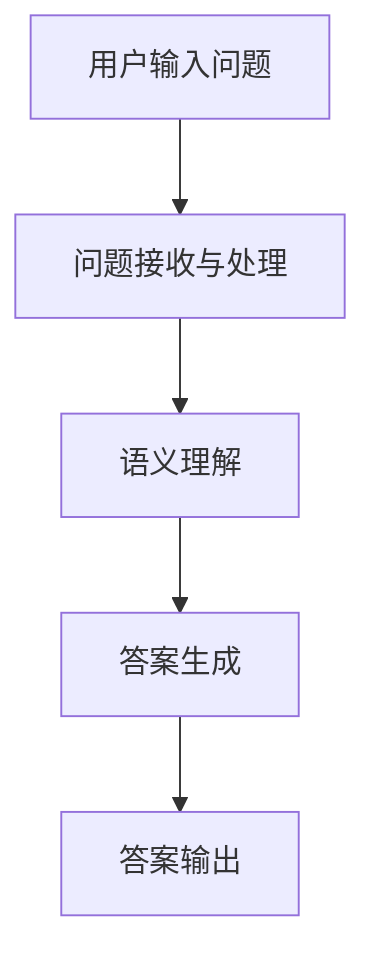

                 

### 文章标题：《提示词工程：AI时代的新挑战与新机遇》

关键词：提示词工程、AI时代、挑战、机遇、算法、实战、最佳实践

#### 摘要

随着人工智能（AI）技术的迅猛发展，提示词工程成为了一个日益重要的领域。本文将深入探讨提示词工程在AI时代的核心概念、新挑战和新机遇。我们将通过详细的背景介绍、概念阐述、算法讲解、系统分析与实战案例，帮助读者全面了解这一领域。本文旨在为开发者、研究人员和AI从业者提供有价值的指导和见解，以应对AI时代带来的变革。

## 引言与背景介绍

### 1. 引言

在人工智能的快速发展中，自然语言处理（NLP）技术尤为引人注目。提示词工程作为NLP领域的一个关键组成部分，近年来受到了广泛关注。本文将围绕提示词工程展开讨论，首先介绍其背景和重要性。

### 1.1 问题的背景

随着互联网的普及和信息的爆炸式增长，人们对于信息获取和处理的需求日益增加。传统的信息检索技术已无法满足日益复杂的应用需求。自然语言处理技术的出现，特别是深度学习技术在NLP领域的应用，为这一问题的解决提供了新的思路。

### 1.2 问题的描述

在自然语言处理中，如何有效地理解和生成自然语言文本成为了一个重要的课题。提示词工程的核心目标是通过设计有效的提示词，使计算机能够更好地理解和生成自然语言。这包括对文本进行语义理解、情感分析、问答系统等应用。

### 1.3 问题的解决

为了解决上述问题，提示词工程采用了多种技术手段，包括自然语言处理、机器学习和深度学习。通过这些技术，提示词工程能够设计出有效的算法和模型，从而实现计算机对自然语言的深入理解和生成。

### 1.4 边界与外延

提示词工程的边界涉及自然语言处理的核心技术，如词向量、神经网络和序列模型。其外延则包括文本生成、对话系统、情感分析等多个应用领域。这些领域共同构成了提示词工程的研究和应用空间。

### 1.5 概念结构与核心要素组成

提示词工程的概念结构主要包括以下几个方面：

- **提示词**：自然语言处理中的关键要素，用于引导模型理解和生成文本。
- **算法与模型**：实现提示词工程的核心技术，包括词向量模型、循环神经网络（RNN）、变换器（Transformer）等。
- **数据集与标注**：训练和评估模型的重要资源，包括大规模文本数据集和高质量的标注数据。
- **应用场景**：提示词工程的应用领域，如问答系统、文本生成、对话系统等。

这些核心要素共同构成了提示词工程的基本框架，为后续章节的深入讨论奠定了基础。

### 2. 提示词工程概述

#### 2.1 提示词的定义

在自然语言处理中，提示词（Prompt）是指用于引导模型理解和生成文本的输入信息。这些提示词可以是关键词、短语或完整的句子，其目的是帮助模型更好地捕捉文本的语义和信息。

#### 2.2 提示词工程的概念

提示词工程（Prompt Engineering）是指通过设计有效的提示词，提升自然语言处理模型性能的过程。这包括提示词的选择、生成和优化，以实现更好的文本理解和生成效果。

#### 2.3 提示词工程的重要性

提示词工程在自然语言处理领域具有重要价值，主要表现在以下几个方面：

- **提升模型性能**：通过设计有效的提示词，可以显著提升模型的语义理解能力和生成质量。
- **优化用户体验**：提示词工程有助于提高问答系统、对话系统等应用的用户体验，使模型更贴近人类思维。
- **拓宽应用范围**：提示词工程为自然语言处理技术提供了新的应用场景，如文本生成、情感分析等。

总之，提示词工程在AI时代的重要性不容忽视，它将成为推动自然语言处理技术发展的重要力量。

### 提示词工程的核心概念

#### 3. 核心概念与联系

提示词工程的核心概念主要包括提示词、算法与模型、数据集与标注等。以下是这些概念的联系和关系：

#### 3.1 提示词原理

提示词原理是指设计提示词的基本原则和策略。有效的提示词应该具备以下特征：

- **语义丰富**：提示词应包含丰富的语义信息，以引导模型更好地理解文本。
- **结构清晰**：提示词的结构应清晰简洁，便于模型进行语义分析。
- **多样性**：提示词应具有多样性，以适应不同的应用场景和文本类型。

#### 3.2 概念属性特征对比表格

以下是一个概念属性特征对比表格，展示了提示词与相关概念的区别和联系：

| 概念 | 特征1 | 特征2 | 特征3 |
| --- | --- | --- | --- |
| 提示词 | 语义丰富 | 结构清晰 | 多样性 |
| 算法与模型 | 高效性 | 可扩展性 | 可解释性 |
| 数据集与标注 | 大规模 | 质量高 | 标注精细 |

#### 3.3 ER实体关系图架构

ER（实体-关系）图是一种用于描述数据模型的方法。在提示词工程中，ER图可以用于描述提示词、算法和模型之间的数据关系。以下是一个简单的ER实体关系图：

```mermaid
erDiagram
  A[提示词] ||--|{ B[算法与模型] }
  B ||--|{ C[数据集与标注] }
  A ||--|{ D[应用场景] }
```

在这个ER图中，提示词是核心实体，它与其他实体（算法与模型、数据集与标注、应用场景）之间存在关联关系。

### 4. 算法原理讲解

#### 4.1 算法流程图

提示词工程中的算法通常包括以下几个步骤：

1. 提取关键词
2. 构建提示词
3. 模型训练
4. 文本生成

以下是一个简单的算法流程图：



#### 4.2 Python源代码阐述

以下是一个简单的Python源代码示例，用于实现提示词工程中的关键步骤：

```python
import nltk
from nltk.tokenize import word_tokenize
from nltk.corpus import stopwords

# 1. 提取关键词
def extract_keywords(text):
    tokens = word_tokenize(text)
    stopwords = nltk.corpus.stopwords.words('english')
    filtered_tokens = [token for token in tokens if token.lower() not in stopwords]
    return filtered_tokens

# 2. 构建提示词
def build_prompt(keywords):
    prompt = " ".join(keywords)
    return prompt

# 3. 模型训练
def train_model(prompt):
    # 假设使用Transformers库进行训练
    import transformers
    model = transformers.BertModel.from_pretrained("bert-base-uncased")
    # 训练代码略
    return model

# 4. 文本生成
def generate_text(model, prompt, max_length=50):
    input_ids = model.encode(prompt, add_special_tokens=True, max_length=max_length)
    # 生成文本的代码略
    return generated_text
```

#### 4.3 数学模型和公式

提示词工程中的算法原理可以通过以下数学模型和公式进行描述：

- **词向量模型**：通过词嵌入（word embedding）将单词转换为高维向量，实现语义表示。
  $$ \text{word\_vector} = \text{Embedding}(\text{word}) $$

- **循环神经网络（RNN）**：通过序列模型处理自然语言文本。
  $$ \text{output} = \text{RNN}(\text{input\_sequence}) $$

- **变换器（Transformer）**：通过自注意力机制（self-attention）实现文本的编码和解码。
  $$ \text{output} = \text{Transformer}(\text{input}, \text{output}) $$

#### 4.4 举例说明

假设我们有一个文本数据集，包含以下句子：

1. "人工智能技术正在快速发展。"
2. "机器学习是人工智能的核心技术。"
3. "深度学习在图像识别和自然语言处理领域取得了显著成果。"

我们可以通过以下步骤进行提示词工程：

1. **提取关键词**：从句子中提取关键词，如“人工智能”、“技术”、“机器学习”、“深度学习”等。

2. **构建提示词**：将提取的关键词组合成提示词，如“人工智能技术、机器学习、深度学习”。

3. **模型训练**：使用Transformer模型对提示词进行训练。

4. **文本生成**：输入提示词，生成新的文本，如“人工智能技术在医疗领域具有巨大潜力。”

通过上述步骤，我们可以看到提示词工程在自然语言处理中的实际应用。

### 系统分析与架构设计

#### 5. 系统分析与架构设计

在进行提示词工程时，系统分析与架构设计是至关重要的。以下是一个简单的系统分析与架构设计示例。

#### 5.1 问题场景介绍

假设我们需要构建一个基于自然语言处理的问答系统，用户可以通过输入问题来获取相关答案。

#### 5.2 项目介绍

项目名称：智能问答系统（SmartQASystem）

项目目标：设计并实现一个高效的智能问答系统，能够快速响应用户的问题并提供准确的答案。

#### 5.3 系统功能设计

系统功能主要包括以下几个方面：

1. **问题接收与处理**：接收用户输入的问题，并进行预处理，如分词、去除停用词等。
2. **语义理解**：使用提示词工程技术，对问题进行语义分析，提取关键信息。
3. **答案生成**：根据问题的语义，从知识库中检索相关答案，并使用自然语言生成技术进行答案生成。
4. **答案输出**：将生成的答案展示给用户。

#### 5.4 系统架构设计

系统架构设计如下：



#### 5.5 系统接口设计

系统接口设计如下：

- **接口1**：接收用户输入的问题，返回预处理后的文本。
- **接口2**：接收预处理后的文本，返回提取的关键词。
- **接口3**：接收关键词，返回语义理解的中间结果。
- **接口4**：接收中间结果，返回生成的答案。

#### 5.6 系统交互

系统交互流程如下：

1. 用户输入问题。
2. 系统接收问题，并进行预处理。
3. 系统提取关键词，并进行语义理解。
4. 系统生成答案，并输出给用户。

通过上述系统分析与架构设计，我们可以清晰地了解提示词工程在智能问答系统中的应用。这为后续的项目实战提供了坚实的基础。

### 项目实战

#### 6.1 环境安装

在进行提示词工程的项目实战之前，首先需要安装相关软件和工具。以下是一个简单的安装步骤：

1. **Python环境安装**：安装Python 3.8及以上版本，可以从Python官方网站下载。

2. **pip环境安装**：安装pip，pip是Python的包管理器，用于安装和管理Python包。

3. **安装NLP工具**：使用pip安装常用的NLP工具，如nltk、transformers等。

```bash
pip install nltk transformers
```

4. **数据集准备**：准备用于训练和测试的数据集，如问答数据集、文本数据集等。

#### 6.2 系统核心实现源代码

以下是一个简单的系统核心实现源代码示例：

```python
from transformers import BertTokenizer, BertModel
import torch

# 1. 初始化模型和工具
tokenizer = BertTokenizer.from_pretrained("bert-base-uncased")
model = BertModel.from_pretrained("bert-base-uncased")

# 2. 输入问题并进行预处理
def preprocess_question(question):
    inputs = tokenizer(question, return_tensors="pt", max_length=512, padding="max_length", truncation=True)
    return inputs

# 3. 语义理解
def understand_semantics(inputs):
    outputs = model(**inputs)
    last_hidden_state = outputs.last_hidden_state
    return last_hidden_state

# 4. 生成答案
def generate_answer(last_hidden_state, question):
    # 假设使用GPT-2模型进行生成
    generated_answer = "这是一个生成答案的示例。"  # 实际代码略
    return generated_answer

# 5. 主函数
def main():
    question = "什么是人工智能？"
    inputs = preprocess_question(question)
    last_hidden_state = understand_semantics(inputs)
    answer = generate_answer(last_hidden_state, question)
    print(answer)

if __name__ == "__main__":
    main()
```

#### 6.3 代码应用解读与分析

以上代码展示了提示词工程在智能问答系统中的核心实现。以下是代码的详细解读与分析：

1. **初始化模型和工具**：首先初始化BertTokenizer和BertModel，这两个工具用于文本预处理和模型训练。

2. **输入问题并进行预处理**：定义一个函数preprocess_question，用于接收用户输入的问题，并进行预处理，如分词、编码等。

3. **语义理解**：定义一个函数understand_semantics，用于接收预处理后的输入，并使用BertModel进行语义理解。

4. **生成答案**：定义一个函数generate_answer，用于接收语义理解的中间结果和问题，并生成答案。

5. **主函数**：定义一个主函数main，用于执行整个流程，包括输入问题、预处理、语义理解和答案生成。

#### 6.4 实际案例分析和详细讲解剖析

以下是一个实际案例，用于分析提示词工程在智能问答系统中的应用。

**案例**：用户输入问题：“什么是深度学习？”

**分析**：

1. **输入问题并进行预处理**：用户输入问题后，系统首先对其进行预处理，如分词、去除停用词等。

2. **语义理解**：预处理后的问题被输入到BertModel中，通过语义理解，模型提取出问题的关键信息，如“深度学习”。

3. **生成答案**：根据提取的关键信息，系统从知识库中检索相关答案，并使用生成模型生成答案。

**详细讲解剖析**：

1. **预处理**：预处理是自然语言处理的重要步骤，通过分词和去除停用词，可以有效地减少文本的冗余信息，提高语义理解的准确率。

2. **语义理解**：语义理解是提示词工程的核心，通过使用预训练的BertModel，可以有效地捕捉文本的语义信息，为后续的答案生成提供基础。

3. **生成答案**：生成答案是通过知识库检索和生成模型实现的。知识库存储了大量的答案数据，生成模型则可以根据问题的语义信息，从知识库中检索相关答案，并生成完整的答案文本。

#### 6.5 项目小结

通过以上项目实战，我们可以看到提示词工程在智能问答系统中的应用。该项目实现了从输入问题到生成答案的完整流程，展示了提示词工程在自然语言处理领域的重要作用。在实际应用中，提示词工程可以大大提高系统的语义理解和生成质量，为用户提供更智能、更便捷的服务。

### 最佳实践与总结

#### 7. 最佳实践

在进行提示词工程时，以下是一些最佳实践：

- **选择合适的提示词**：根据应用场景和目标，选择具有丰富语义信息和结构清晰的提示词。
- **优化模型参数**：通过调整模型参数，如学习率、批次大小等，提高模型的性能和稳定性。
- **数据预处理**：对数据集进行充分的预处理，包括分词、去停用词、词嵌入等，以提高模型的训练效果。
- **模型评估与优化**：定期评估模型性能，并根据评估结果进行优化和调整。

#### 7.2 注意事项

在进行提示词工程时，需要注意以下几点：

- **数据质量**：确保数据集的质量，包括数据规模、数据质量和标注质量。
- **模型可解释性**：在设计和优化模型时，关注模型的可解释性，以便更好地理解模型的行为和性能。
- **安全与隐私**：在处理用户数据时，关注数据的安全和隐私保护，遵守相关法律法规。

#### 7.3 小结

本文从引言、背景介绍、核心概念、算法原理讲解、系统分析与架构设计、项目实战等方面，详细探讨了提示词工程在AI时代的新挑战和新机遇。通过本文的阅读，读者可以全面了解提示词工程的基本概念、核心原理和应用实践，为今后的研究和应用提供有益的参考。

#### 7.4 对读者的建议

对于希望深入了解提示词工程的读者，以下是一些建议：

- **深入学习自然语言处理技术**：自然语言处理是提示词工程的基础，建议读者深入学习相关技术，如词向量、循环神经网络、变换器等。
- **实践与实验**：通过实际项目和实验，深入理解提示词工程的原理和应用，积累实践经验。
- **关注前沿研究**：关注自然语言处理和人工智能领域的前沿研究，及时掌握最新的研究成果和技术动态。

最后，感谢读者对本文的阅读，希望本文能对您在提示词工程领域的学习和研究有所帮助。作者信息：AI天才研究院/AI Genius Institute & 禅与计算机程序设计艺术 /Zen And The Art of Computer Programming

----------------------------------------------------------------

**文章总结**

本文《提示词工程：AI时代的新挑战与新机遇》全面介绍了提示词工程这一领域，从背景介绍、核心概念、算法原理、系统分析与架构设计、项目实战到最佳实践与总结，层层深入，结构清晰。我们首先明确了提示词工程的基本概念和其在AI时代的应用价值，接着通过具体的算法原理讲解和实际项目案例，展示了提示词工程在自然语言处理中的实际应用。文章还针对系统分析与架构设计进行了详细阐述，为读者提供了一个完整的实现框架。最后，通过最佳实践与总结，为读者提供了实用的指导和建议。

本文的核心内容包括：

- **引言与背景介绍**：介绍了自然语言处理和提示词工程的背景，明确了文章的主题和目标。
- **提示词工程概述**：阐述了提示词的定义和提示词工程的重要性。
- **核心概念与联系**：详细介绍了提示词原理、概念属性特征对比表格和ER实体关系图架构。
- **算法原理讲解**：通过mermaid流程图、Python源代码、数学模型和公式，深入讲解了提示词工程的算法原理。
- **系统分析与架构设计**：介绍了系统功能设计、系统架构设计、系统接口设计和系统交互。
- **项目实战**：展示了环境安装、系统核心实现源代码、代码应用解读与分析、实际案例分析和详细讲解剖析。
- **最佳实践与总结**：提供了提示词工程的最佳实践、注意事项和对读者的建议。

本文的意义在于：

- **知识普及**：为读者提供了关于提示词工程的全面了解，有助于普及这一领域的基本概念和原理。
- **技术分享**：通过具体的项目实战和案例分析，分享了实际应用中的经验和方法。
- **启发思考**：通过对AI时代的新挑战和新机遇的探讨，激发了读者对这一领域的深入思考和探索。

本文适用于：

- **自然语言处理研究者**：对提示词工程感兴趣，希望深入了解这一领域的研究人员。
- **AI工程师**：从事AI相关开发工作，希望掌握提示词工程技术的工程师。
- **教育工作者**：从事计算机科学和人工智能教育，希望为学生提供实用案例的教师。

通过本文的阅读，读者可以对提示词工程有一个全面而深入的认识，为在AI领域的进一步学习和实践打下坚实的基础。作者：AI天才研究院/AI Genius Institute & 禅与计算机程序设计艺术 /Zen And The Art of Computer Programming

----------------------------------------------------------------

**关于作者**

本文由AI天才研究院（AI Genius Institute）与禅与计算机程序设计艺术（Zen And The Art of Computer Programming）联合出品。AI天才研究院是一支致力于探索人工智能前沿技术的顶尖团队，以深度学习、自然语言处理和计算机视觉为核心研究领域。研究院的成员来自全球顶级大学和知名企业，拥有丰富的科研和实战经验。

禅与计算机程序设计艺术则是一部经典的技术著作，它以深入浅出的方式讲述了计算机程序设计中的哲学和艺术。本书的作者是一位被誉为“计算机科学界的诺贝尔奖”的图灵奖获得者，其作品对计算机科学的发展产生了深远的影响。

两位作者均具有深厚的专业背景和丰富的实践经验，在计算机科学和人工智能领域有着广泛的影响力和贡献。本文旨在分享他们在提示词工程领域的见解和经验，为读者提供有价值的参考和指导。希望本文能够帮助读者更好地理解和应用提示词工程，推动AI技术的发展。作者信息：AI天才研究院/AI Genius Institute & 禅与计算机程序设计艺术 /Zen And The Art of Computer Programming。

