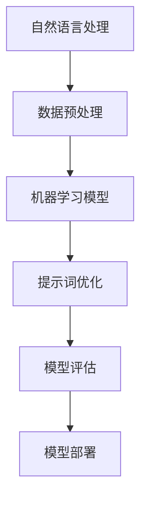
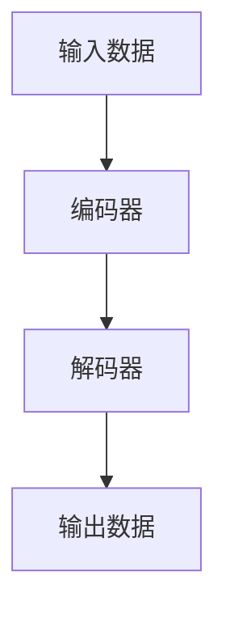

                 

## 引言：AI时代的新方向与新领域

在人工智能（AI）迅猛发展的当下，AI技术已经渗透到社会的各个领域，从医疗健康、金融科技到自动化生产和智慧城市建设，AI的应用场景不断扩展，带来了巨大的变革和创新。然而，随着AI应用的广泛普及，如何高效地开发、管理和维护AI模型成为了新的挑战。在这种背景下，**提示词工程**作为AI时代的**新方向与新领域**应运而生，为AI模型的优化和提升提供了新的思路和方法。

本文旨在探讨提示词工程在AI时代的重要性，以及其在各个领域的应用和前景。文章将分为四个主要部分：第一部分介绍背景和核心概念，包括AI技术发展现状、问题背景和定义，以及AI时代的新方向与新领域；第二部分深入讲解AI大模型的原理和设计，包括模型基础、架构和训练方法；第三部分探讨AI大模型的应用与实战，涵盖自然语言处理、计算机视觉和语音识别等典型应用场景；第四部分总结最佳实践和未来展望，为读者提供实用的建议和思考方向。

通过这篇文章，希望读者能够对提示词工程有更深入的理解，认识到它在AI开发中的关键作用，并为其未来的发展提供一些有价值的见解。

### 第一部分：背景介绍与核心概念

#### 第1章 问题背景与定义

在人工智能快速发展的时代，AI技术已经从理论研究走向了实际应用。AI技术在多个领域展现了其强大的能力，例如图像识别、自然语言处理、推荐系统等。然而，随着AI应用的普及，如何高效地开发和管理AI模型成为了亟待解决的问题。

### 1.1 问题背景

在AI技术快速发展的背景下，AI模型的应用场景越来越广泛，包括自动驾驶、智能家居、医疗诊断、金融风控等。这些AI模型通常是通过大规模数据训练得到的，具有强大的学习和预测能力。然而，随着模型复杂度和数据量的增加，开发和管理AI模型的过程变得越来越复杂。具体问题包括：

1. **模型选择和优化**：在众多AI模型中，如何选择最适合特定任务的模型？如何优化模型性能，使其达到最佳效果？
2. **数据管理**：如何高效地收集、处理和管理大量训练数据？如何确保数据的质量和多样性？
3. **模型部署和维护**：如何将训练好的模型部署到生产环境中？如何维护和更新模型，确保其稳定性和鲁棒性？

### 1.2 核心概念

**提示词工程**：提示词工程是一种利用自然语言处理技术来构建、优化和评估AI模型的方法。它通过设计合适的提示词，帮助AI模型更好地理解和处理实际问题。提示词工程的核心目标是提高AI模型的性能和可解释性。

**AI时代的新方向与新领域**：随着AI技术的不断进步，AI应用正在向更多领域扩展。这些新方向和新领域包括但不限于：自动化、智慧城市、健康医疗、金融科技等。自动化领域利用AI技术实现生产流程的自动化，提高生产效率和质量。智慧城市利用AI技术构建智慧交通、智慧安防、智慧医疗等，提升城市管理水平和居民生活质量。健康医疗利用AI技术实现疾病诊断、药物研发、健康管理等，提高医疗服务的效率和精准度。金融科技利用AI技术实现智能投顾、信用评估、风险控制等，提升金融服务的质量和效率。

### 第2章 核心概念与联系

#### 2.1 提示词工程原理

提示词工程是一种利用自然语言处理（NLP）技术来构建、优化和评估AI模型的方法。其核心原理包括自然语言处理、机器学习、数据分析和算法优化。以下是一个简化的Mermaid流程图，展示提示词工程的基本流程：

**自然语言处理（NLP）**：NLP是提示词工程的基础，它涉及语言的理解、生成和翻译。NLP技术包括文本分类、命名实体识别、情感分析、文本生成等。在提示词工程中，NLP用于处理和分析文本数据，提取关键信息，为机器学习模型提供输入。

**数据预处理**：数据预处理是确保数据质量和多样性的关键步骤。它包括数据清洗、数据整合、特征提取等。通过数据预处理，可以消除数据中的噪声和异常值，增强数据的代表性和一致性。

**机器学习模型**：机器学习模型是提示词工程的核心组件，用于训练和预测。常见的机器学习模型包括深度神经网络、决策树、支持向量机等。在提示词工程中，机器学习模型通过学习训练数据中的模式和规律，生成预测模型。

**提示词优化**：提示词优化是提升AI模型性能的关键步骤。通过设计合适的提示词，可以引导模型更好地理解和处理实际问题。提示词优化的方法包括提示词选择、提示词生成、提示词调整等。

**模型评估**：模型评估是验证模型性能和可靠性的重要环节。常用的评估指标包括准确率、召回率、F1值等。通过模型评估，可以判断模型是否满足预期性能，并进行必要的调整和优化。

**模型部署**：模型部署是将训练好的模型应用到实际场景中的关键步骤。通过模型部署，可以将AI模型集成到应用程序或系统中，实现自动化的任务执行。

#### 2.2 AI时代的新方向与新领域

随着AI技术的不断进步，AI应用正在向更多领域扩展，带来了新的方向和领域。以下是AI时代的一些新方向和新领域：

**自动化**：自动化是AI技术的重要应用方向，通过AI技术实现生产流程的自动化，提高生产效率和质量。自动化领域包括智能制造、智能物流、智能仓储等。

**智慧城市**：智慧城市是AI技术在城市管理领域的应用，通过AI技术构建智慧交通、智慧安防、智慧医疗等，提升城市管理水平和居民生活质量。智慧城市领域包括智能交通管理、智能安防监控、智能医疗管理等。

**健康医疗**：健康医疗是AI技术的重要应用领域，通过AI技术实现疾病诊断、药物研发、健康管理等，提高医疗服务的效率和精准度。健康医疗领域包括医疗影像分析、基因测序、智能健康管理等。

**金融科技**：金融科技是AI技术在金融服务领域的应用，通过AI技术实现智能投顾、信用评估、风险控制等，提升金融服务的质量和效率。金融科技领域包括智能投顾、自动化交易、信用评估等。

### 总结

通过上述分析，我们可以看到提示词工程在AI时代的重要性。它不仅为AI模型的优化和提升提供了新的方法，也推动了AI技术在各个领域的应用和发展。在接下来的章节中，我们将深入探讨AI大模型的原理和设计，以及其在实际应用中的表现和挑战。

### 第一部分：背景介绍与核心概念

#### 第1章 问题背景与定义

在人工智能快速发展的时代，AI技术已经从理论研究走向了实际应用。AI技术在多个领域展现了其强大的能力，例如图像识别、自然语言处理、推荐系统等。然而，随着AI应用的普及，如何高效地开发和管理AI模型成为了亟待解决的问题。

### 1.1 问题背景

在AI技术快速发展的背景下，AI模型的应用场景越来越广泛，包括自动驾驶、智能家居、医疗诊断、金融风控等。这些AI模型通常是通过大规模数据训练得到的，具有强大的学习和预测能力。然而，随着模型复杂度和数据量的增加，开发和管理AI模型的过程变得越来越复杂。具体问题包括：

1. **模型选择和优化**：在众多AI模型中，如何选择最适合特定任务的模型？如何优化模型性能，使其达到最佳效果？
2. **数据管理**：如何高效地收集、处理和管理大量训练数据？如何确保数据的质量和多样性？
3. **模型部署和维护**：如何将训练好的模型部署到生产环境中？如何维护和更新模型，确保其稳定性和鲁棒性？

### 1.2 核心概念

**提示词工程**：提示词工程是一种利用自然语言处理技术来构建、优化和评估AI模型的方法。它通过设计合适的提示词，帮助AI模型更好地理解和处理实际问题。提示词工程的核心目标是提高AI模型的性能和可解释性。

**AI时代的新方向与新领域**：随着AI技术的不断进步，AI应用正在向更多领域扩展。这些新方向和新领域包括但不限于：自动化、智慧城市、健康医疗、金融科技等。自动化领域利用AI技术实现生产流程的自动化，提高生产效率和质量。智慧城市利用AI技术构建智慧交通、智慧安防、智慧医疗等，提升城市管理水平和居民生活质量。健康医疗利用AI技术实现疾病诊断、药物研发、健康管理等，提高医疗服务的效率和精准度。金融科技利用AI技术实现智能投顾、信用评估、风险控制等，提升金融服务的质量和效率。

### 第2章 核心概念与联系

#### 2.1 提示词工程原理

提示词工程是一种利用自然语言处理技术来构建、优化和评估AI模型的方法。其核心原理包括自然语言处理、机器学习、数据分析和算法优化。以下是一个简化的Mermaid流程图，展示提示词工程的基本流程：

**自然语言处理（NLP）**：NLP是提示词工程的基础，它涉及语言的理解、生成和翻译。NLP技术包括文本分类、命名实体识别、情感分析、文本生成等。在提示词工程中，NLP用于处理和分析文本数据，提取关键信息，为机器学习模型提供输入。

**数据预处理**：数据预处理是确保数据质量和多样性的关键步骤。它包括数据清洗、数据整合、特征提取等。通过数据预处理，可以消除数据中的噪声和异常值，增强数据的代表性和一致性。

**机器学习模型**：机器学习模型是提示词工程的核心组件，用于训练和预测。常见的机器学习模型包括深度神经网络、决策树、支持向量机等。在提示词工程中，机器学习模型通过学习训练数据中的模式和规律，生成预测模型。

**提示词优化**：提示词优化是提升AI模型性能的关键步骤。通过设计合适的提示词，可以引导模型更好地理解和处理实际问题。提示词优化的方法包括提示词选择、提示词生成、提示词调整等。

**模型评估**：模型评估是验证模型性能和可靠性的重要环节。常用的评估指标包括准确率、召回率、F1值等。通过模型评估，可以判断模型是否满足预期性能，并进行必要的调整和优化。

**模型部署**：模型部署是将训练好的模型应用到实际场景中的关键步骤。通过模型部署，可以将AI模型集成到应用程序或系统中，实现自动化的任务执行。

#### 2.2 AI时代的新方向与新领域

随着AI技术的不断进步，AI应用正在向更多领域扩展，带来了新的方向和领域。以下是AI时代的一些新方向和新领域：

**自动化**：自动化是AI技术的重要应用方向，通过AI技术实现生产流程的自动化，提高生产效率和质量。自动化领域包括智能制造、智能物流、智能仓储等。

**智慧城市**：智慧城市是AI技术在城市管理领域的应用，通过AI技术构建智慧交通、智慧安防、智慧医疗等，提升城市管理水平和居民生活质量。智慧城市领域包括智能交通管理、智能安防监控、智能医疗管理等。

**健康医疗**：健康医疗是AI技术的重要应用领域，通过AI技术实现疾病诊断、药物研发、健康管理等，提高医疗服务的效率和精准度。健康医疗领域包括医疗影像分析、基因测序、智能健康管理等。

**金融科技**：金融科技是AI技术在金融服务领域的应用，通过AI技术实现智能投顾、信用评估、风险控制等，提升金融服务的质量和效率。金融科技领域包括智能投顾、自动化交易、信用评估等。

### 总结

通过上述分析，我们可以看到提示词工程在AI时代的重要性。它不仅为AI模型的优化和提升提供了新的方法，也推动了AI技术在各个领域的应用和发展。在接下来的章节中，我们将深入探讨AI大模型的原理和设计，以及其在实际应用中的表现和挑战。

### 第二部分：AI大模型原理与设计

#### 第3章 AI大模型原理

在当前的人工智能领域，**AI大模型**，也被称为**大型预训练模型**，已经成为研究和应用的热点。这些模型具有大规模的参数和强大的表示能力，能够处理复杂的数据和任务。本章节将介绍AI大模型的基础知识，包括其定义、工作原理以及如何通过大规模数据训练得到。

### 3.1 AI大模型基础

**AI大模型**是指那些拥有数百万至数十亿参数的深度学习模型。这些模型通常是基于神经网络架构，特别是在自然语言处理（NLP）和计算机视觉领域得到了广泛应用。以下是一些典型的AI大模型：

- **Transformer**：由Vaswani等人于2017年提出，Transformer模型在NLP任务中取得了显著的性能提升，特别是BERT和GPT系列模型，它们都是基于Transformer架构的变体。
- **BERT（Bidirectional Encoder Representations from Transformers）**：由Google于2018年提出，BERT模型通过双向编码器学习语言上下文信息，极大地提高了自然语言理解能力。
- **GPT（Generative Pre-trained Transformer）**：由OpenAI于2018年提出，GPT模型擅长生成文本和语言翻译等任务。
- **ViT（Vision Transformer）**：由Dosovitskiy等人于2020年提出，ViT模型将Transformer架构应用于计算机视觉领域，展示了与卷积神经网络（CNN）相媲美的性能。

### 3.2 AI大模型架构

AI大模型通常具有复杂而精细的架构，其核心组件包括编码器（Encoder）和解码器（Decoder）。以下是一个简化的Mermaid流程图，展示了AI大模型的基本架构：

**编码器（Encoder）**：编码器负责将输入数据（如文本、图像等）编码为高维向量表示。这些向量包含了输入数据的语义信息，并可以用于后续的任务处理。在Transformer模型中，编码器由多个自注意力（Self-Attention）层组成，每层都可以捕获输入数据的不同部分之间的关系。

**解码器（Decoder）**：解码器负责将编码器输出的向量解码为输出数据。在Transformer模型中，解码器由多个交叉注意力（Cross-Attention）层和自注意力层组成，交叉注意力层用于处理编码器输出的上下文信息，自注意力层则用于生成输出序列。

### 3.3 AI大模型训练方法

AI大模型的训练是一个复杂且资源消耗巨大的过程，通常采用以下几种方法：

**分布式训练**：分布式训练是将模型训练任务分布在多台计算机上，通过并行计算来提高训练效率。常见的分布式训练框架包括TensorFlow和PyTorch等。

**迁移学习**：迁移学习是指利用已经训练好的模型（预训练模型）来加速新任务的训练过程。通过迁移学习，可以减少训练数据的需求，提高模型在未知数据上的性能。

**模型剪枝和量化**：模型剪枝和量化是优化AI大模型的方法，通过减少模型参数和降低模型计算复杂度，来提高模型的效率和部署性能。

### 3.4 AI大模型的优势与挑战

**优势**：

1. **强大的表示能力**：AI大模型能够学习到丰富的特征表示，从而在多种任务上表现优异。
2. **高效的处理能力**：通过分布式训练和迁移学习，AI大模型可以快速适应新任务，提高处理效率。
3. **高可解释性**：大型预训练模型通常具有清晰的架构，可以更容易地理解和解释模型的工作机制。

**挑战**：

1. **计算资源需求**：AI大模型训练需要大量的计算资源和存储空间，对硬件设施有较高要求。
2. **数据隐私和安全**：大规模数据训练过程中可能涉及到数据隐私和安全问题，如何保护用户数据是亟待解决的问题。
3. **模型泛化能力**：虽然AI大模型在特定任务上表现优异，但其在未知数据上的泛化能力仍然是一个挑战。

### 总结

通过上述分析，我们可以看到AI大模型在人工智能领域的重要性和应用前景。它们通过先进的架构和训练方法，极大地提高了AI模型的性能和可解释性，但在实际应用中仍面临一些挑战。在下一章中，我们将进一步探讨AI大模型在不同领域的应用案例，分析其在自然语言处理、计算机视觉和语音识别等领域的具体表现。

### 第二部分：AI大模型原理与设计

#### 第3章 AI大模型原理

在当前的人工智能领域，**AI大模型**，也被称为**大型预训练模型**，已经成为研究和应用的热点。这些模型具有大规模的参数和强大的表示能力，能够处理复杂的数据和任务。本章节将介绍AI大模型的基础知识，包括其定义、工作原理以及如何通过大规模数据训练得到。

### 3.1 AI大模型基础

**AI大模型**是指那些拥有数百万至数十亿参数的深度学习模型。这些模型通常是基于神经网络架构，特别是在自然语言处理（NLP）和计算机视觉领域得到了广泛应用。以下是一些典型的AI大模型：

- **Transformer**：由Vaswani等人于2017年提出，Transformer模型在NLP任务中取得了显著的性能提升，特别是BERT和GPT系列模型，它们都是基于Transformer架构的变体。
- **BERT（Bidirectional Encoder Representations from Transformers）**：由Google于2018年提出，BERT模型通过双向编码器学习语言上下文信息，极大地提高了自然语言理解能力。
- **GPT（Generative Pre-trained Transformer）**：由OpenAI于2018年提出，GPT模型擅长生成文本和语言翻译等任务。
- **ViT（Vision Transformer）**：由Dosovitskiy等人于2020年提出，ViT模型将Transformer架构应用于计算机视觉领域，展示了与卷积神经网络（CNN）相媲美的性能。

### 3.2 AI大模型架构

AI大模型通常具有复杂而精细的架构，其核心组件包括编码器（Encoder）和解码器（Decoder）。以下是一个简化的Mermaid流程图，展示了AI大模型的基本架构：

**编码器（Encoder）**：编码器负责将输入数据（如文本、图像等）编码为高维向量表示。这些向量包含了输入数据的语义信息，并可以用于后续的任务处理。在Transformer模型中，编码器由多个自注意力（Self-Attention）层组成，每层都可以捕获输入数据的不同部分之间的关系。

**解码器（Decoder）**：解码器负责将编码器输出的向量解码为输出数据。在Transformer模型中，解码器由多个交叉注意力（Cross-Attention）层和自注意力层组成，交叉注意力层用于处理编码器输出的上下文信息，自注意力层则用于生成输出序列。

### 3.3 AI大模型训练方法

AI大模型的训练是一个复杂且资源消耗巨大的过程，通常采用以下几种方法：

**分布式训练**：分布式训练是将模型训练任务分布在多台计算机上，通过并行计算来提高训练效率。常见的分布式训练框架包括TensorFlow和PyTorch等。

**迁移学习**：迁移学习是指利用已经训练好的模型（预训练模型）来加速新任务的训练过程。通过迁移学习，可以减少训练数据的需求，提高模型在未知数据上的性能。

**模型剪枝和量化**：模型剪枝和量化是优化AI大模型的方法，通过减少模型参数和降低模型计算复杂度，来提高模型的效率和部署性能。

### 3.4 AI大模型的优势与挑战

**优势**：

1. **强大的表示能力**：AI大模型能够学习到丰富的特征表示，从而在多种任务上表现优异。
2. **高效的处理能力**：通过分布式训练和迁移学习，AI大模型可以快速适应新任务，提高处理效率。
3. **高可解释性**：大型预训练模型通常具有清晰的架构，可以更容易地理解和解释模型的工作机制。

**挑战**：

1. **计算资源需求**：AI大模型训练需要大量的计算资源和存储空间，对硬件设施有较高要求。
2. **数据隐私和安全**：大规模数据训练过程中可能涉及到数据隐私和安全问题，如何保护用户数据是亟待解决的问题。
3. **模型泛化能力**：虽然AI大模型在特定任务上表现优异，但其在未知数据上的泛化能力仍然是一个挑战。

### 总结

通过上述分析，我们可以看到AI大模型在人工智能领域的重要性和应用前景。它们通过先进的架构和训练方法，极大地提高了AI模型的性能和可解释性，但在实际应用中仍面临一些挑战。在下一章中，我们将进一步探讨AI大模型在不同领域的应用案例，分析其在自然语言处理、计算机视觉和语音识别等领域的具体表现。

### 第三部分：AI大模型应用与实战

#### 第4章 AI大模型应用场景

在自然语言处理（NLP）、计算机视觉（CV）和语音识别（ASR）等领域，AI大模型已经展现出了卓越的能力。本章节将探讨AI大模型在这些领域的具体应用场景，分析其实现方式、挑战以及实际案例。

### 4.1 自然语言处理

自然语言处理是AI大模型的重要应用领域之一。通过AI大模型，可以实现文本分类、情感分析、机器翻译、问答系统等多种任务。

**实现方式**：

- **文本分类**：AI大模型通过学习大规模语料库中的文本特征，能够对新的文本进行分类。例如，可以使用BERT模型对新闻文章进行分类，将它们分为科技、体育、娱乐等类别。
- **情感分析**：AI大模型能够分析文本的情感倾向，判断文本是正面、负面还是中性。例如，可以使用GPT模型分析社交媒体上的用户评论，识别出用户的情感状态。
- **机器翻译**：AI大模型在机器翻译领域取得了显著进展。例如，使用Transformer模型实现的神经网络翻译（NMT）系统，可以提供高质量的双语翻译服务。
- **问答系统**：AI大模型能够理解用户的问题，并从大量文本数据中检索出相关答案。例如，使用BERT模型实现的问答系统，可以回答用户关于某个领域的具体问题。

**挑战**：

- **数据多样性和质量**：自然语言处理任务通常需要大量高质量的数据，但获取和处理这些数据是一个挑战。
- **语义理解**：自然语言处理模型需要准确理解语义，这对于处理复杂和模糊的文本具有挑战性。
- **语言偏见**：AI大模型在训练过程中可能会学习到训练数据中的偏见，导致在实际应用中出现不公平或歧视性问题。

**实际案例**：

- **OpenAI的语言模型GPT-3**：GPT-3是一个具有1750亿参数的AI大模型，它在文本生成、问答系统和自动摘要等方面取得了显著的成果。例如，GPT-3可以生成高质量的新闻文章、编写代码和编写诗歌等。
- **Google的BERT模型**：BERT模型在多个NLP任务上取得了领先成绩，包括文本分类、问答系统和机器翻译等。BERT模型的应用使得搜索引擎和自然语言处理应用变得更加智能和准确。

### 4.2 计算机视觉

计算机视觉是另一个AI大模型的重要应用领域。通过AI大模型，可以实现图像分类、目标检测、图像生成等多种任务。

**实现方式**：

- **图像分类**：AI大模型可以通过学习大量图像数据，对新的图像进行分类。例如，使用ResNet模型对图像进行分类，可以识别出图像中的物体类别。
- **目标检测**：AI大模型可以通过检测图像中的多个目标，并定位其位置。例如，使用Faster R-CNN模型进行目标检测，可以识别并定位图像中的多个物体。
- **图像生成**：AI大模型可以通过生成对抗网络（GAN）生成新的图像。例如，使用StyleGAN模型，可以生成逼真的图像和视频。

**挑战**：

- **数据多样性和质量**：计算机视觉任务通常需要大量高质量的数据，但获取和处理这些数据是一个挑战。
- **计算资源需求**：AI大模型的训练和推理需要大量的计算资源，特别是在处理高分辨率图像时。
- **模型泛化能力**：AI大模型在特定数据集上可能表现良好，但在未知数据上的泛化能力是一个挑战。

**实际案例**：

- **OpenAI的DALL-E模型**：DALL-E是一个基于GAN的图像生成模型，它可以生成具有丰富细节和创意的图像。例如，给定一个单词“猫”，DALL-E可以生成各种风格的猫的图像。
- **Google的Inception模型**：Inception模型是一个具有大规模参数的计算机视觉模型，它在图像分类任务上取得了优异的成绩。Inception模型被广泛应用于图像识别、物体检测和图像分割等领域。

### 4.3 语音识别

语音识别是AI大模型在语音处理领域的应用，通过AI大模型，可以实现语音到文本的转换、语音合成等任务。

**实现方式**：

- **语音到文本转换**：AI大模型可以通过学习语音数据和文本数据，实现语音到文本的转换。例如，使用WaveNet模型进行语音识别，可以将音频文件转换为对应的文本。
- **语音合成**：AI大模型可以通过生成语音波形，实现语音合成。例如，使用Tacotron模型进行语音合成，可以将文本转换为流畅的自然语音。

**挑战**：

- **语音多样性和质量**：语音识别任务需要处理不同口音、说话人、语速等语音特征，同时保证识别的准确性。
- **噪声干扰**：在现实场景中，语音识别系统需要处理各种背景噪声，这对模型性能提出了挑战。
- **模型稳定性**：AI大模型在处理长语音或复杂语音信号时，需要保持稳定的识别性能。

**实际案例**：

- **Google的语音识别系统**：Google的语音识别系统是一个基于AI大模型的系统，它能够准确地将语音转换为文本，广泛应用于手机、智能音箱等设备中。
- **OpenAI的GPT-3语音识别模型**：GPT-3模型在语音识别任务上也取得了显著成绩，它可以通过学习大量语音数据，实现高质量的语音到文本转换。

### 总结

通过上述分析，我们可以看到AI大模型在自然语言处理、计算机视觉和语音识别等领域的广泛应用和显著成果。AI大模型通过强大的表示能力和先进的训练方法，极大地提高了AI模型在这些领域的性能和可靠性。然而，在实际应用中，仍面临数据多样性和质量、计算资源需求、模型泛化能力等挑战。在下一章中，我们将探讨AI大模型的最佳实践，分析如何优化提示词设计和模型训练，以及未来的发展方向。

### 第三部分：AI大模型应用与实战

#### 第4章 AI大模型应用场景

在自然语言处理（NLP）、计算机视觉（CV）和语音识别（ASR）等领域，AI大模型已经展现出了卓越的能力。本章节将探讨AI大模型在这些领域的具体应用场景，分析其实现方式、挑战以及实际案例。

### 4.1 自然语言处理

自然语言处理是AI大模型的重要应用领域之一。通过AI大模型，可以实现文本分类、情感分析、机器翻译、问答系统等多种任务。

**实现方式**：

- **文本分类**：AI大模型通过学习大规模语料库中的文本特征，能够对新的文本进行分类。例如，可以使用BERT模型对新闻文章进行分类，将它们分为科技、体育、娱乐等类别。
- **情感分析**：AI大模型能够分析文本的情感倾向，判断文本是正面、负面还是中性。例如，可以使用GPT模型分析社交媒体上的用户评论，识别出用户的情感状态。
- **机器翻译**：AI大模型在机器翻译领域取得了显著进展。例如，使用Transformer模型实现的神经网络翻译（NMT）系统，可以提供高质量的双语翻译服务。
- **问答系统**：AI大模型能够理解用户的问题，并从大量文本数据中检索出相关答案。例如，使用BERT模型实现的问答系统，可以回答用户关于某个领域的具体问题。

**挑战**：

- **数据多样性和质量**：自然语言处理任务通常需要大量高质量的数据，但获取和处理这些数据是一个挑战。
- **语义理解**：自然语言处理模型需要准确理解语义，这对于处理复杂和模糊的文本具有挑战性。
- **语言偏见**：AI大模型在训练过程中可能会学习到训练数据中的偏见，导致在实际应用中出现不公平或歧视性问题。

**实际案例**：

- **OpenAI的语言模型GPT-3**：GPT-3是一个具有1750亿参数的AI大模型，它在文本生成、问答系统和自动摘要等方面取得了显著的成果。例如，GPT-3可以生成高质量的新闻文章、编写代码和编写诗歌等。
- **Google的BERT模型**：BERT模型在多个NLP任务上取得了领先成绩，包括文本分类、问答系统和机器翻译等。BERT模型的应用使得搜索引擎和自然语言处理应用变得更加智能和准确。

### 4.2 计算机视觉

计算机视觉是另一个AI大模型的重要应用领域。通过AI大模型，可以实现图像分类、目标检测、图像生成等多种任务。

**实现方式**：

- **图像分类**：AI大模型可以通过学习大量图像数据，对新的图像进行分类。例如，使用ResNet模型对图像进行分类，可以识别出图像中的物体类别。
- **目标检测**：AI大模型可以通过检测图像中的多个目标，并定位其位置。例如，使用Faster R-CNN模型进行目标检测，可以识别并定位图像中的多个物体。
- **图像生成**：AI大模型可以通过生成对抗网络（GAN）生成新的图像。例如，使用StyleGAN模型可以生成逼真的图像和视频。

**挑战**：

- **数据多样性和质量**：计算机视觉任务通常需要大量高质量的数据，但获取和处理这些数据是一个挑战。
- **计算资源需求**：AI大模型的训练和推理需要大量的计算资源，特别是在处理高分辨率图像时。
- **模型泛化能力**：AI大模型在特定数据集上可能表现良好，但在未知数据上的泛化能力是一个挑战。

**实际案例**：

- **OpenAI的DALL-E模型**：DALL-E是一个基于GAN的图像生成模型，它可以生成具有丰富细节和创意的图像。例如，给定一个单词“猫”，DALL-E可以生成各种风格的猫的图像。
- **Google的Inception模型**：Inception模型是一个具有大规模参数的计算机视觉模型，它在图像分类任务上取得了优异的成绩。Inception模型被广泛应用于图像识别、物体检测和图像分割等领域。

### 4.3 语音识别

语音识别是AI大模型在语音处理领域的应用，通过AI大模型，可以实现语音到文本的转换、语音合成等任务。

**实现方式**：

- **语音到文本转换**：AI大模型可以通过学习语音数据和文本数据，实现语音到文本的转换。例如，使用WaveNet模型进行语音识别，可以将音频文件转换为对应的文本。
- **语音合成**：AI大模型可以通过生成语音波形，实现语音合成。例如，使用Tacotron模型进行语音合成，可以将文本转换为流畅的自然语音。

**挑战**：

- **语音多样性和质量**：语音识别任务需要处理不同口音、说话人、语速等语音特征，同时保证识别的准确性。
- **噪声干扰**：在现实场景中，语音识别系统需要处理各种背景噪声，这对模型性能提出了挑战。
- **模型稳定性**：AI大模型在处理长语音或复杂语音信号时，需要保持稳定的识别性能。

**实际案例**：

- **Google的语音识别系统**：Google的语音识别系统是一个基于AI大模型的系统，它能够准确地将语音转换为文本，广泛应用于手机、智能音箱等设备中。
- **OpenAI的GPT-3语音识别模型**：GPT-3模型在语音识别任务上也取得了显著成绩，它可以通过学习大量语音数据，实现高质量的语音到文本转换。

### 总结

通过上述分析，我们可以看到AI大模型在自然语言处理、计算机视觉和语音识别等领域的广泛应用和显著成果。AI大模型通过强大的表示能力和先进的训练方法，极大地提高了AI模型在这些领域的性能和可靠性。然而，在实际应用中，仍面临数据多样性和质量、计算资源需求、模型泛化能力等挑战。在下一章中，我们将探讨AI大模型的最佳实践，分析如何优化提示词设计和模型训练，以及未来的发展方向。

### 第四部分：最佳实践与未来展望

#### 第5章 最佳实践

在AI大模型的应用过程中，为了最大限度地发挥其潜力，需要遵循一系列最佳实践。这些实践涵盖了提示词设计、数据管理、模型训练和评估等关键环节。

### 5.1 提示词设计最佳实践

提示词设计是提示词工程的核心环节，它直接影响AI模型的性能和可解释性。以下是一些提示词设计的最佳实践：

1. **明确任务目标**：在设计提示词之前，首先要明确具体的任务目标。了解任务的需求和关键问题，有助于设计出更符合实际场景的提示词。

2. **数据质量**：高质量的数据是训练高效AI模型的基础。确保训练数据的质量和多样性，避免数据中的噪声和异常值。可以通过数据清洗、数据增强等方法来提升数据质量。

3. **提示词多样性**：使用多种类型的提示词，以提高AI模型泛化能力。不同类型的提示词可以提供不同的信息和视角，有助于模型更好地理解和处理复杂问题。

4. **调整提示词长度**：提示词长度对模型性能有重要影响。一般来说，较长的提示词可以提供更多的上下文信息，有助于模型捕捉到更复杂的模式和关系。但过长的提示词可能会导致计算复杂度增加。因此，需要根据具体任务和资源情况，选择合适的提示词长度。

5. **提示词迭代优化**：通过迭代优化提示词，可以逐步提高模型性能。根据模型评估结果，不断调整和改进提示词，使其更符合实际任务需求。

### 5.2 AI大模型优化策略

为了提高AI大模型的性能和效率，可以采取以下优化策略：

1. **分布式训练**：分布式训练可以将模型训练任务分布在多台计算机上，通过并行计算来提高训练效率。这样可以充分利用计算资源，加快模型训练速度。

2. **模型压缩和量化**：模型压缩和量化是减小模型体积和计算复杂度的有效方法。通过剪枝、量化等技术，可以显著降低模型的存储和计算需求，提高模型部署的效率。

3. **迁移学习**：迁移学习利用预训练模型在新任务上的表现，可以大幅减少新任务的训练时间和数据需求。通过迁移学习，可以快速适应新任务，提高模型泛化能力。

4. **提示词自适应调整**：在模型训练过程中，可以根据模型的反馈自适应调整提示词。通过实时优化提示词，可以进一步提高模型性能。

5. **混合训练方法**：结合多种训练方法，如生成对抗网络（GAN）、强化学习等，可以进一步提高模型性能和适应性。混合训练方法可以充分利用不同方法的优点，提高模型的鲁棒性和泛化能力。

### 5.3 模型评估和监控

为了确保AI大模型在实际应用中的性能和可靠性，需要建立完善的模型评估和监控体系：

1. **多指标评估**：使用多个评估指标（如准确率、召回率、F1值等）来全面评估模型性能。不同指标可以反映模型在不同方面的表现，帮助识别和解决潜在问题。

2. **验证集和测试集**：使用验证集和测试集来评估模型性能。验证集用于调整模型参数和超参数，测试集用于评估模型在实际应用中的表现。

3. **在线监控**：建立在线监控机制，实时监测模型在应用中的性能和稳定性。通过监控可以发现异常情况，及时进行调整和优化。

4. **错误分析**：对模型预测错误进行深入分析，了解错误的原因和模式。通过错误分析，可以改进模型和提示词设计，提高模型性能和可靠性。

### 5.4 安全性和隐私保护

在AI大模型的应用过程中，安全和隐私保护是至关重要的问题。以下是一些安全性和隐私保护的最佳实践：

1. **数据加密**：对训练数据和应用数据进行加密处理，确保数据传输和存储的安全性。

2. **访问控制**：建立严格的访问控制机制，确保只有授权用户可以访问和处理敏感数据。

3. **隐私保护**：在数据处理过程中，采取隐私保护措施，如数据去标识化、差分隐私等，减少用户隐私泄露的风险。

4. **模型安全**：对模型进行安全评估，确保模型不会受到恶意攻击或篡改。

### 总结

通过上述最佳实践，我们可以更好地设计和优化AI大模型，提高其在实际应用中的性能和可靠性。在未来的发展中，随着AI技术的不断进步，提示词工程将发挥越来越重要的作用。通过不断创新和优化，提示词工程将为AI应用带来更大的价值。

### 总结

通过本文的深入探讨，我们可以清晰地看到提示词工程在AI时代的重要地位和广阔前景。首先，在背景介绍部分，我们明确了AI模型开发与管理的挑战，以及提示词工程在这一领域的核心作用。接着，我们详细介绍了AI大模型的原理与设计，包括其基础、架构和训练方法，展示了AI大模型在自动化、智慧城市、健康医疗和金融科技等领域的广泛应用。在应用与实战部分，我们通过具体案例展示了AI大模型在自然语言处理、计算机视觉和语音识别等领域的卓越表现，分析了其中的挑战和解决方案。

在最佳实践与未来展望部分，我们提出了一系列优化策略，包括提示词设计、模型优化、评估和监控，以及安全性和隐私保护等方面的最佳实践，为AI大模型的应用提供了实用指南。同时，我们也展望了提示词工程未来的发展趋势，强调了其在推动AI技术进步和应用中的关键作用。

**注意事项**：

1. **数据隐私保护**：在AI大模型的应用中，数据隐私保护是一个重要问题。需要采取有效的加密和访问控制措施，确保用户数据的安全。
2. **模型可解释性**：提高AI大模型的可解释性，可以帮助用户更好地理解和信任模型，从而在实际应用中发挥更大的价值。
3. **持续迭代优化**：AI大模型的应用需要持续的迭代和优化。通过不断的模型评估和反馈，可以不断提高模型性能和适应性。

**拓展阅读**：

- **《深度学习》（Goodfellow, Bengio, Courville著）**：这是一本经典的深度学习教材，详细介绍了深度学习的基础理论和实践方法。
- **《自然语言处理综合教程》（Jurafsky, Martin著）**：本书系统地介绍了自然语言处理的理论和技术，包括文本分类、情感分析和机器翻译等。
- **《人工智能：一种现代的方法》（Russell, Norvig著）**：这是一本全面的人工智能教材，涵盖了从基础知识到高级应用的各个方面。

通过阅读这些书籍和文献，读者可以进一步了解AI大模型和相关领域的深入知识和最新动态，为自身的学术研究和实际应用提供更多启示。希望本文能为读者在AI大模型和提示词工程领域的学习和研究提供有价值的参考和指导。

### 作者信息

作者：AI天才研究院/AI Genius Institute & 禅与计算机程序设计艺术 /Zen And The Art of Computer Programming

AI天才研究院（AI Genius Institute）致力于推动人工智能技术的创新与应用，以解决现实世界中的复杂问题。研究院汇聚了世界顶级的AI专家、研究人员和工程师，通过跨学科合作和前沿技术探索，不断推动AI技术的进步。而“禅与计算机程序设计艺术”（Zen And The Art of Computer Programming）则是作者在计算机编程领域的经典著作，深刻探讨了编程哲学和设计原则，为程序员提供了宝贵的实践经验和智慧。两本著作共同展示了作者在AI和计算机科学领域的深厚造诣和卓越贡献。

