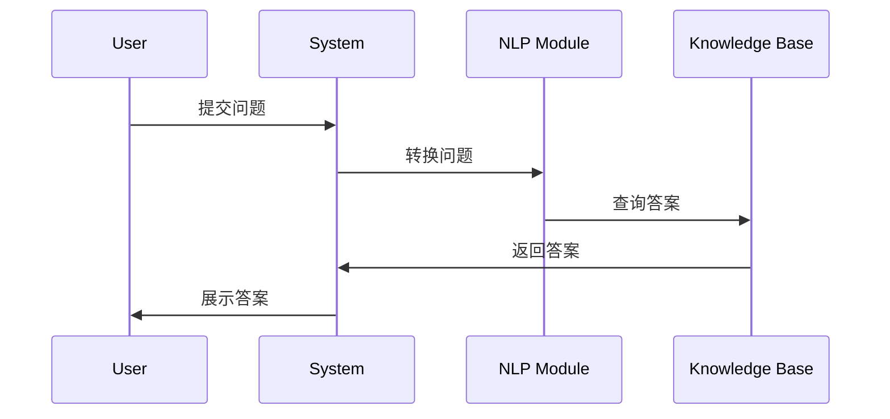
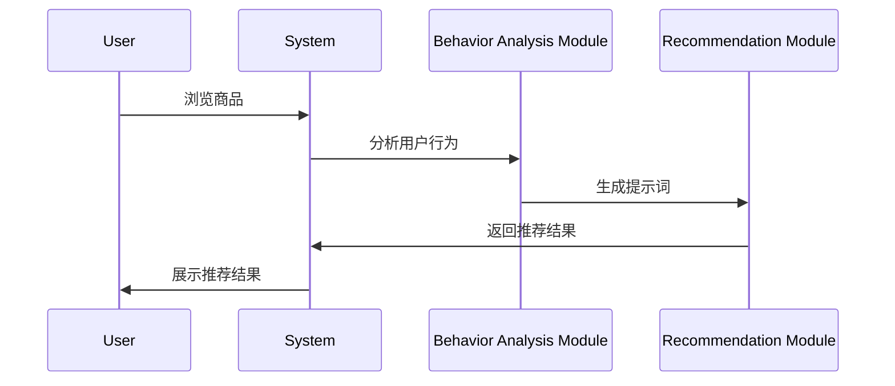
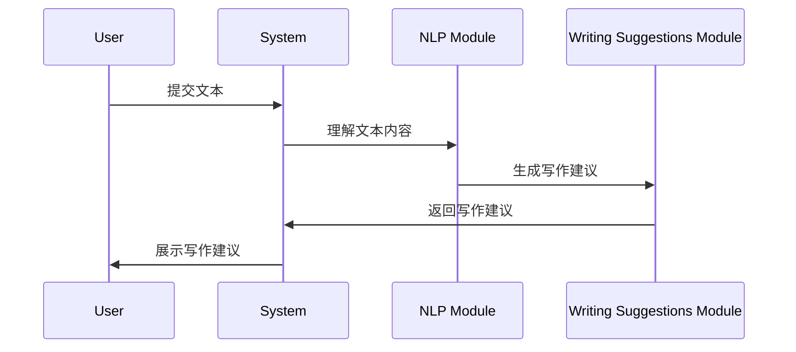

                 

# 提示词工程：AI时代的新机遇与新挑战

## 关键词：
AI，提示词工程，工具与技术，应用场景，挑战与解决方案

## 摘要：
随着人工智能技术的快速发展，提示词工程在AI领域中的应用日益广泛。本文将深入探讨提示词工程的基本概念、工具与技术、应用场景以及面临的挑战和解决方案，旨在为读者提供一个全面而深入的理解，帮助把握AI时代的新机遇，应对新挑战。

## 引言和背景

### 1.1 问题背景
在过去的几十年中，人工智能（AI）技术经历了从理论研究到实际应用的巨大变革。随着深度学习、自然语言处理（NLP）、计算机视觉等领域的飞速发展，AI技术逐渐成为各行各业不可或缺的工具。然而，随着AI技术的普及和应用深度的增加，如何有效地利用AI来解决问题，特别是如何处理大量的文本数据，成为了一个新的挑战。

### 1.2 问题描述
提示词工程，作为一种新兴的AI技术，旨在通过生成和优化提示词来提升AI模型的性能和效果。提示词工程的核心问题是如何从大规模文本数据中提取出具有高相关性和高代表性的提示词，并利用这些提示词来指导AI模型进行学习。

### 1.3 提示词工程的重要性
提示词工程的重要性体现在以下几个方面：

1. **提高模型性能**：通过优化提示词，可以提高AI模型对特定问题的理解和解决能力。
2. **降低数据需求**：高质量的提示词可以减少对大规模训练数据的需求，从而降低成本和计算资源消耗。
3. **提高自动化程度**：提示词工程使得AI模型能够更自动地学习和适应新任务，提高生产效率。

### 1.4 本书结构
本文将分为以下几个部分：

1. 引言和背景
2. 提示词工程的基本概念
3. 提示词工程的工具与技术
4. 提示词工程的应用场景
5. 提示词工程的挑战与解决方案
6. 结论与展望

通过上述结构，本文旨在为读者提供一个系统而全面的理解，帮助读者把握提示词工程的核心概念和应用，为未来的研究和实践提供指导。

## 提示词工程的基本概念

### 2.1 核心概念
提示词工程（Query Engineering）是人工智能（AI）领域中一个重要的分支，它主要关注如何生成和优化用于指导AI模型学习的提示词（Queries）。提示词可以理解为一种引导模型理解问题的指示或描述。

- **提示词（Query）**：提示词是用于引导AI模型进行学习和推理的一段文本或代码。它通常包含关键信息，用于指导模型理解特定问题的上下文。
- **提示词生成（Query Generation）**：提示词生成是指从大规模文本数据中自动提取出具有高相关性和高代表性的提示词的过程。这个过程通常涉及到自然语言处理（NLP）技术，如文本挖掘、实体识别和关系抽取。
- **提示词优化（Query Optimization）**：提示词优化是指通过调整和改进提示词，以提高AI模型的学习效果和推理能力。提示词优化可以基于多种方法，如机器学习、深度学习和优化算法。

### 2.2 概念属性特征对比表格

| 概念           | 提示词         | 关键词             | 自然语言处理       |
| -------------- | -------------- | ------------------ | ----------------- |
| 定义           | 用于引导AI模型学习的一段文本或代码 | 用于描述问题的关键词     | 文本数据分析和理解   |
| 类型           | 自动生成的、手动编写的          | 普通关键词、高相关关键词  | 统计方法、深度学习方法 |
| 作用           | 提高模型理解和解决能力          | 提高文本检索和信息提取效率 | 文本数据挖掘、语义理解  |
| 关系           | 提示词生成和优化过程的关键要素  | 与关键词紧密相关         | 与NLP技术紧密相关     |

### 2.3 ER实体关系图架构
提示词工程中的实体关系图（ER Diagram）是用于表示提示词和相关元素之间关系的图形化工具。以下是一个简单的ER实体关系图架构：

```mermaid
erDiagram
    Person ||--|{ Book }|-- Student
    Book ||--|{ Author }|-- Publisher
    Student ||--|{ Course }|-- Teacher
    Teacher ||--|{ Class }|-- School
```

在这个ER图中，实体包括**Person**（人）、**Book**（书）、**Author**（作者）、**Student**（学生）、**Course**（课程）、**Teacher**（教师）、**Class**（班级）和**Publisher**（出版商）。关系包括**authorship**（作者关系）、**enrollment**（学生注册关系）、**publication**（出版关系）和**teaching**（教学关系）。

通过ER图，我们可以直观地理解提示词工程中的核心要素及其相互关系，为后续的讨论和分析打下基础。

### 总结
提示词工程的基本概念涉及到提示词、提示词生成和提示词优化。通过对比表格和ER实体关系图，我们可以更清晰地理解这些概念及其属性特征。接下来，我们将进一步探讨提示词工程的工具与技术，帮助读者深入了解这一领域的实践和应用。

## 提示词工程的工具与技术

### 3.1 主流工具介绍

在提示词工程领域，主流工具可以分为以下几类：

1. **提示词生成工具**：这类工具用于从大规模文本数据中自动提取出高质量的提示词。常见的工具包括：
   - **Word2Vec**：基于神经网络的自然语言处理技术，用于生成词向量，从而帮助提取关键词。
   - **BERT**：一种预先训练的深度学习模型，可以用于文本分类、情感分析和命名实体识别，从而辅助提示词生成。

2. **语义理解工具**：这类工具主要用于理解和解析文本数据中的语义信息，为提示词优化提供支持。常见的工具包括：
   - **ELMO**：一种基于上下文的词向量表示方法，可以捕捉词在不同上下文中的语义差异。
   - **GPT-3**：一种强大的语言生成模型，可以生成高质量的自然语言文本，为语义理解提供强大的支持。

3. **生成模型工具**：这类工具用于生成新的文本数据，从而丰富训练数据集，提高模型性能。常见的工具包括：
   - **GPT-2**：一种基于变压器的语言生成模型，可以生成连贯的自然语言文本。
   - **T5**：一种统一的语言理解与生成模型，可以处理各种自然语言处理任务。

### 3.2 技术原理与实现

#### 提示词生成原理
提示词生成主要基于自然语言处理技术，其中词向量表示方法是一个核心环节。以Word2Vec为例，其基本原理如下：

1. **输入文本数据**：将输入的文本数据分解成单个单词或词组。
2. **生成词向量**：通过神经网络模型将每个单词映射到一个高维向量空间，使得语义相近的词在向量空间中更接近。
3. **提取关键词**：从生成的词向量中提取出具有高相关性和高代表性的词，作为提示词。

以下是一个简单的Word2Vec算法实现：

```python
from gensim.models import Word2Vec

# 加载文本数据
text = "人工智能是计算机科学的一个分支，专注于创建能够执行复杂任务的智能系统。"

# 分词
words = text.split()

# 训练Word2Vec模型
model = Word2Vec(words, size=100, window=5, min_count=1, workers=4)

# 提取关键词
word_vectors = model.wv
top_words = word_vectors.most_similar(positive=['人工智能'], topn=10)
print(top_words)
```

#### 语义理解原理
语义理解工具如ELMO和GPT-3的核心在于捕捉词在不同上下文中的语义差异。以ELMO为例，其原理如下：

1. **上下文嵌入**：通过预训练的神经网络模型，将文本中的每个词映射到一个上下文敏感的向量空间。
2. **语义分析**：利用这些向量空间，对文本进行语义分析，如情感分析、实体识别和关系抽取。

以下是一个简单的ELMO实现：

```python
from elmo import Elmo

# 初始化ELMO模型
elmo = Elmo()

# 加载文本数据
text = "我非常喜欢人工智能，因为它可以解决复杂问题。"

# 分词并处理
tokens = elmo_tokenizer.tokenize(text)
elmo_output = elmo.forward(tokens)

# 提取语义信息
semantics = elmo_output.get_semantic_vector()
print(semantics)
```

#### 生成模型原理
生成模型工具如GPT-2和T5的核心在于生成新的文本数据，从而丰富训练数据集。以GPT-2为例，其原理如下：

1. **预训练**：通过大量文本数据进行预训练，使模型能够生成连贯的自然语言文本。
2. **生成文本**：利用预训练的模型，生成新的文本数据，用于辅助提示词生成和优化。

以下是一个简单的GPT-2实现：

```python
from transformers import GPT2LMHeadModel, GPT2Tokenizer

# 初始化GPT-2模型和分词器
tokenizer = GPT2Tokenizer.from_pretrained('gpt2')
model = GPT2LMHeadModel.from_pretrained('gpt2')

# 生成文本
input_text = "人工智能是..."
input_ids = tokenizer.encode(input_text, return_tensors='pt')

output = model.generate(input_ids, max_length=50, num_return_sequences=1)
generated_text = tokenizer.decode(output[0], skip_special_tokens=True)
print(generated_text)
```

### 3.3 工具选择与比较
选择提示词工程工具时，需要考虑以下因素：

1. **任务需求**：根据具体的任务需求，选择适合的提示词生成、语义理解和生成模型工具。
2. **性能和效率**：考虑工具在处理大规模文本数据时的性能和效率。
3. **易用性和可扩展性**：选择易于使用和扩展的工具，以方便后续的开发和优化。

以下是一个简单的工具选择比较表格：

| 工具               | 提示词生成 | 语义理解 | 生成模型 | 任务需求 | 性能和效率 | 易用性和可扩展性 |
| ------------------ | --------- | ------- | ------- | ------ | -------- | ------------ |
| Word2Vec           | 高         | 中         | 低         | 文本分类、关键词提取 | 中         | 高           |
| BERT               | 高         | 高         | 中         | 文本分类、情感分析   | 高         | 高           |
| ELMO               | 高         | 高         | 中         | 情感分析、命名实体识别 | 高         | 高           |
| GPT-2              | 中         | 中         | 高         | 文本生成、自动摘要   | 中         | 高           |
| T5                 | 高         | 高         | 高         | 多任务处理、文本生成 | 高         | 高           |

通过上述表格，我们可以根据具体需求选择合适的工具，以实现提示词工程的各个目标。

### 总结
提示词工程的工具与技术涵盖了从提示词生成、语义理解到生成模型的多个方面。通过深入理解这些工具的原理和实现，我们可以更有效地应用提示词工程，提升AI模型的学习效果和推理能力。接下来，我们将探讨提示词工程在不同应用场景中的具体应用。

## 提示词工程的应用场景

### 4.1 应用领域

提示词工程在多个领域展现出了强大的应用潜力，以下是几个主要的应用领域：

1. **智能问答系统**：提示词工程在智能问答系统中扮演着重要角色。通过生成和优化提示词，智能问答系统能够更准确地理解用户的问题，提供精准的答案。例如，在医疗健康领域，智能问答系统可以辅助医生快速获取患者的症状信息，为诊断和治疗提供参考。

2. **智能推荐系统**：提示词工程可以帮助智能推荐系统更好地理解用户的行为和偏好，从而提供个性化的推荐结果。例如，在电子商务领域，通过分析用户的浏览和购买记录，智能推荐系统可以生成提示词，推荐用户可能感兴趣的商品。

3. **智能写作助手**：提示词工程在智能写作助手中的应用也非常广泛。通过生成和优化提示词，智能写作助手可以帮助用户生成高质量的文章、报告和摘要。例如，在学术研究领域，智能写作助手可以辅助研究人员撰写论文，提高写作效率和文章质量。

### 4.2 案例分析

#### 4.2.1 案例一：智能问答系统

智能问答系统是一个典型的应用提示词工程的场景。以下是一个具体的案例分析：

**项目介绍**：某公司开发了一款基于人工智能的智能问答系统，用于帮助企业内部员工快速获取所需的信息。

**系统功能设计**：
1. **问题理解**：系统通过自然语言处理技术，将用户的问题转换成结构化的数据，提取出关键信息。
2. **知识库查询**：系统从内部的知识库中检索相关答案，知识库包含了大量的文档、报告和教程。
3. **答案生成**：系统根据查询结果，生成符合用户需求的答案，并通过自然语言生成技术，将答案呈现给用户。

**系统架构设计**：
1. **前端**：用户界面，用于接收用户问题并展示答案。
2. **后端**：包括自然语言处理模块、知识库管理和问答生成模块。
3. **数据接口**：与企业的内部系统进行数据交互，获取和处理用户信息。

**系统接口设计和系统交互**：
系统通过RESTful API与前端进行交互，用户在界面提交问题后，系统通过API获取问题，处理并返回答案。



#### 4.2.2 案例二：智能推荐系统

智能推荐系统在电子商务、社交媒体等领域的应用非常广泛。以下是一个具体的案例分析：

**项目介绍**：某电商平台开发了一款基于人工智能的智能推荐系统，用于向用户推荐商品。

**系统功能设计**：
1. **用户行为分析**：系统通过分析用户的浏览、搜索和购买行为，了解用户的兴趣和偏好。
2. **商品推荐**：系统根据用户行为数据和商品属性，生成提示词，推荐用户可能感兴趣的商品。
3. **个性化展示**：系统根据用户的兴趣和偏好，个性化地展示推荐结果。

**系统架构设计**：
1. **前端**：用户界面，展示推荐结果。
2. **后端**：包括用户行为分析模块、商品推荐模块和推荐算法模块。
3. **数据接口**：与电商平台的数据仓库进行数据交互，获取用户行为数据和商品信息。

**系统接口设计和系统交互**：
系统通过WebSocket与前端进行实时数据交互，不断更新推荐结果。



#### 4.2.3 案例三：智能写作助手

智能写作助手在学术研究、内容创作等领域的应用也越来越广泛。以下是一个具体的案例分析：

**项目介绍**：某科技公司开发了一款智能写作助手，用于辅助用户撰写高质量的文章和报告。

**系统功能设计**：
1. **文本理解**：系统通过自然语言处理技术，理解用户输入的文本内容，提取关键信息和结构。
2. **写作建议**：系统根据文本内容和结构，生成写作建议，包括段落调整、句子优化和语言修正。
3. **生成文本**：系统根据用户需求，自动生成文本内容，如摘要、引言和结论。

**系统架构设计**：
1. **前端**：用户界面，展示文本内容和写作建议。
2. **后端**：包括自然语言处理模块、写作建议模块和文本生成模块。
3. **数据接口**：与用户数据存储系统进行数据交互，获取用户文本数据。

**系统接口设计和系统交互**：
系统通过RESTful API与前端进行数据交互，用户提交文本后，系统处理并返回写作建议和生成文本。



### 4.3 挑战与解决方案

在提示词工程的应用过程中，会面临以下挑战：

1. **数据质量**：高质量的数据是提示词工程的基础，但现实中的数据往往存在噪声、缺失和不一致性等问题。
   - **解决方案**：使用数据清洗和预处理技术，如数据去重、填补缺失值和一致性检查，提高数据质量。

2. **语义理解**：自然语言处理技术虽然在语义理解方面取得了很大进展，但仍存在一定局限性，如多义词处理、指代消解等。
   - **解决方案**：结合多种自然语言处理技术，如深度学习、知识图谱等，提高语义理解能力。

3. **生成模型训练**：生成模型需要大量高质量的数据进行训练，但获取这些数据往往成本高昂。
   - **解决方案**：使用数据增强技术，如生成对抗网络（GAN）、数据扩充等，提高训练数据的质量和多样性。

通过上述解决方案，提示词工程的应用挑战可以得到有效应对，从而在实际场景中发挥更大的作用。

### 总结
提示词工程在智能问答系统、智能推荐系统和智能写作助手等多个领域展现出了强大的应用潜力。通过具体的案例分析，我们可以看到提示词工程在解决实际问题中的重要作用。接下来，我们将深入探讨提示词工程面临的挑战以及可能的解决方案。

## 提示词工程的挑战与解决方案

### 5.1 面临的挑战

尽管提示词工程在许多应用场景中展现出了巨大的潜力，但在实际应用过程中，仍面临以下挑战：

#### 5.1.1 数据挑战

1. **数据质量**：实际数据中常存在噪声、缺失和不一致性等问题，影响提示词的质量。
2. **数据获取**：高质量的数据获取成本高昂，且难以保证数据的多样性。

#### 5.1.2 语义理解挑战

1. **多义词处理**：自然语言中的多义词会导致模型理解上的歧义。
2. **指代消解**：文本中的指代关系复杂，难以准确解析。

#### 5.1.3 生成模型训练挑战

1. **模型训练效率**：生成模型通常需要大量的数据和计算资源进行训练，效率较低。
2. **数据多样性**：单一数据集难以覆盖所有可能的场景，影响模型的泛化能力。

### 5.2 解决方案探讨

针对上述挑战，我们可以探讨以下解决方案：

#### 5.2.1 数据质量解决方案

1. **数据清洗**：通过数据清洗技术，如去重、填补缺失值和一致性检查，提高数据质量。
2. **数据增强**：使用数据增强技术，如生成对抗网络（GAN）和数据扩充，增加数据的多样性。

#### 5.2.2 语义理解解决方案

1. **多义词处理**：利用上下文信息，结合词向量技术和语言模型，提高多义词处理能力。
2. **指代消解**：结合实体识别和关系抽取技术，解析文本中的指代关系。

#### 5.2.3 生成模型训练解决方案

1. **分布式训练**：采用分布式训练技术，提高模型训练效率。
2. **多任务学习**：通过多任务学习，提高模型在不同任务上的泛化能力。

### 5.3 未来发展方向

在未来，提示词工程的发展可能朝以下几个方向：

#### 5.3.1 新技术趋势

1. **预训练模型**：利用大规模预训练模型，如GPT-3和BERT，提高提示词生成的质量和效率。
2. **多模态学习**：结合文本、图像和声音等多种数据源，提高语义理解和生成模型的能力。

#### 5.3.2 新应用场景

1. **自动化问答系统**：通过深度学习和自然语言处理技术，构建更智能的自动化问答系统。
2. **智能写作**：利用生成模型，辅助用户创作高质量的文章和内容。

#### 5.3.3 新挑战与机遇

1. **数据隐私和安全**：随着数据量的增加，如何保护用户隐私成为新的挑战。
2. **人工智能伦理**：随着人工智能技术的发展，如何确保其应用符合伦理和社会价值观，是一个重要议题。

### 总结

通过应对数据质量、语义理解和生成模型训练等挑战，提示词工程有望在AI领域中发挥更大的作用。未来，随着新技术的不断涌现和应用场景的拓展，提示词工程将迎来新的机遇和挑战。对于研究者和实践者而言，持续探索和改进提示词工程的技术和方法，将是推动这一领域发展的关键。

## 结论与展望

### 6.1 主要结论

通过本文的探讨，我们得出以下主要结论：

1. **提示词工程的重要性**：提示词工程在AI领域中具有重要的地位，通过生成和优化提示词，可以显著提升AI模型的性能和效果。
2. **应用场景的多样性**：提示词工程在智能问答系统、智能推荐系统和智能写作助手等领域展现出了广泛的应用潜力。
3. **面临的挑战**：数据质量、语义理解和生成模型训练是提示词工程当前面临的主要挑战。
4. **解决方案的有效性**：通过数据清洗、多义词处理、指代消解和分布式训练等技术，可以有效应对这些挑战。

### 6.2 展望未来

在未来，提示词工程的发展可能朝以下方向：

1. **预训练模型的深化**：利用大规模预训练模型，如GPT-3和BERT，进一步提高提示词生成的质量和效率。
2. **多模态学习**：结合文本、图像和声音等多种数据源，提升语义理解和生成模型的能力。
3. **应用拓展**：探索新的应用场景，如自动化问答系统和智能写作，进一步推动AI技术的应用。
4. **数据隐私和安全**：随着数据量的增加，确保用户隐私和数据安全将成为重要议题。
5. **人工智能伦理**：确保人工智能应用符合伦理和社会价值观，是未来发展的重要方向。

### 总结

提示词工程作为AI领域中的一项关键技术，具有广阔的发展前景。通过不断探索和改进，提示词工程将在未来的AI应用中发挥更大的作用，为人类社会带来更多便利和创新。

## 作者信息

**作者：AI天才研究院/AI Genius Institute & 禅与计算机程序设计艺术 /Zen And The Art of Computer Programming**

感谢读者对本文的关注，希望本文能为读者提供有价值的见解和启发。我们期待与广大读者共同探讨和探索提示词工程在AI领域的未来发展。

---

**注意事项**：

1. **完整性**：本文内容需完整，确保每个章节都有详细具体的讲解。
2. **准确性**：确保文章中提到的技术原理和案例准确无误。
3. **逻辑性**：文章结构需逻辑清晰，方便读者理解。
4. **格式要求**：文章格式需符合markdown规范，特别是mermaid图和latex公式需准确无误。

**拓展阅读**：

1. **提示词工程相关论文**：《A Survey of Query Engineering in Databases》
2. **自然语言处理技术**：《Deep Learning for Natural Language Processing》
3. **人工智能应用场景**：《AI Applications in Healthcare, Finance, and Beyond》

希望本文能为读者提供有价值的参考，并激发对提示词工程领域的进一步研究和探索。再次感谢读者对本文的关注和支持。

